# C03 控制流与函数 思维导图与可视化

> **文档定位**: Rust 1.90 控制流与函数技术可视化学习  
> **创建日期**: 2025-10-20  
> **适用版本**: Rust 1.90+ | Edition 2024  
> **文档类型**: 思维导图 + 流程图 + 架构图

---

## 📊 目录

- [C03 控制流与函数 思维导图与可视化](#c03-控制流与函数-思维导图与可视化)
  - [📊 目录](#-目录)
  - [1. 控制流全景思维导图](#1-控制流全景思维导图)
    - [技术栈总览](#技术栈总览)
  - [2. 条件控制流程图](#2-条件控制流程图)
    - [if-else决策流程](#if-else决策流程)
    - [match模式匹配流程](#match模式匹配流程)
  - [3. 循环控制架构](#3-循环控制架构)
    - [循环类型对比](#循环类型对比)
    - [迭代器执行流程](#迭代器执行流程)
  - [4. 函数调用架构](#4-函数调用架构)
    - [函数调用栈](#函数调用栈)
    - [闭包捕获机制](#闭包捕获机制)
  - [5. 错误处理流程](#5-错误处理流程)
    - [Result错误传播](#result错误传播)
    - [?操作符执行流程](#操作符执行流程)
  - [6. 模式匹配可视化](#6-模式匹配可视化)
    - [模式匹配决策树](#模式匹配决策树)
    - [解构模式展开](#解构模式展开)
  - [7. 控制流优化](#7-控制流优化)
    - [编译器优化流程](#编译器优化流程)
  - [相关文档](#相关文档)
  - [返回导航](#返回导航)

---

## 1. 控制流全景思维导图

### 技术栈总览

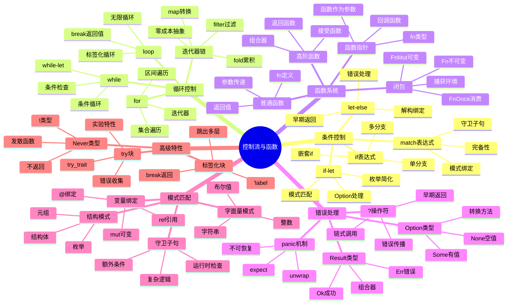

---

## 2. 条件控制流程图

### if-else决策流程

```mermaid
flowchart TD
    Start[开始] --> Eval[评估条件]
    Eval --> Cond{条件为true?}
    
    Cond -->|是| ThenBlock[执行then块]
    Cond -->|否| ElseCheck{有else?}
    
    ElseCheck -->|是| ElseBlock[执行else块]
    ElseCheck -->|否| Skip[跳过]
    
    ThenBlock --> ReturnThen[返回then值]
    ElseBlock --> ReturnElse[返回else值]
    Skip --> ReturnUnit[返回()]
    
    ReturnThen --> End[结束]
    ReturnElse --> End
    ReturnUnit --> End
    
    style Start fill:#e3f2fd
    style End fill:#c8e6c9
    style Cond fill:#fff3e0
    style ThenBlock fill:#f3e5f5
    style ElseBlock fill:#fce4ec
```

### match模式匹配流程

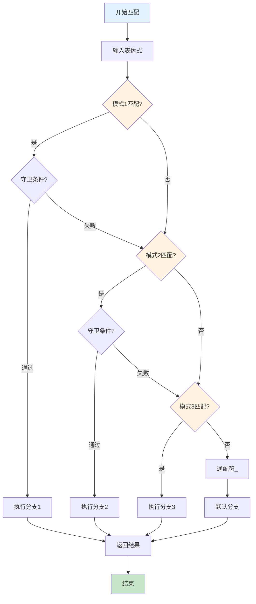

---

## 3. 循环控制架构

### 循环类型对比

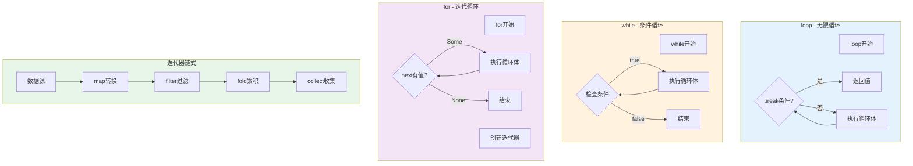

### 迭代器执行流程

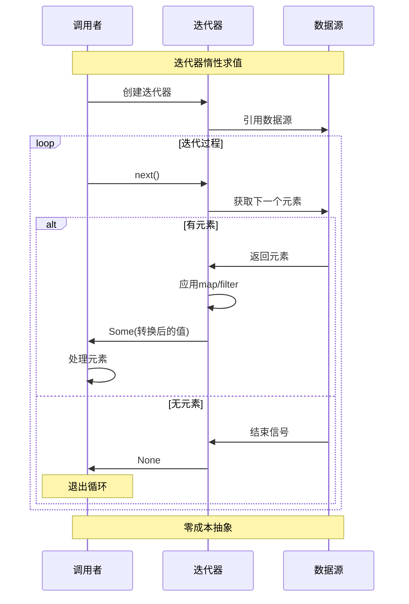

---

## 4. 函数调用架构

### 函数调用栈

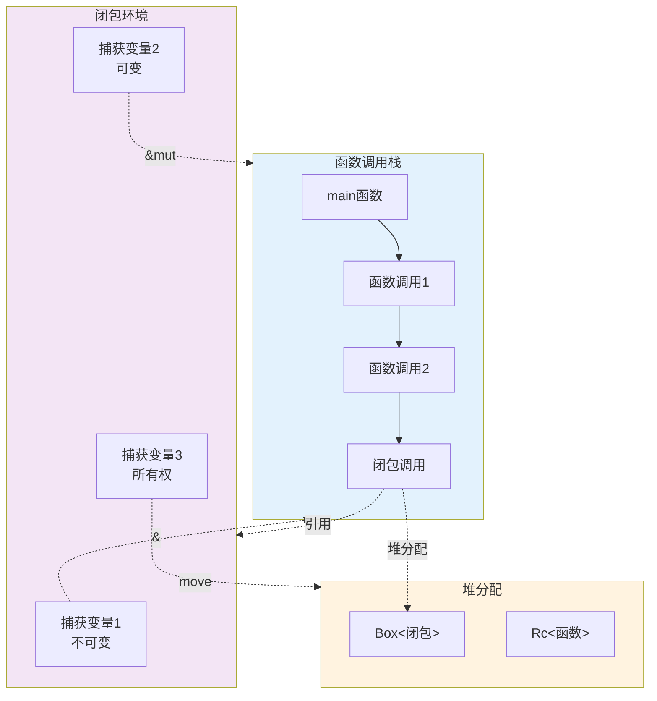

### 闭包捕获机制

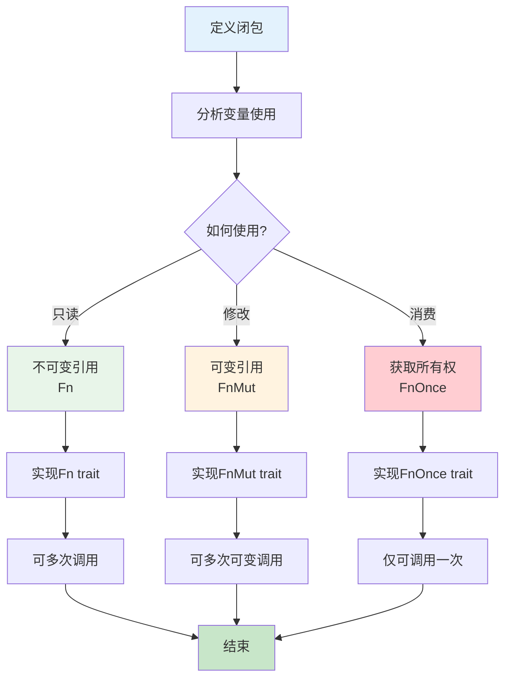

---

## 5. 错误处理流程

### Result错误传播

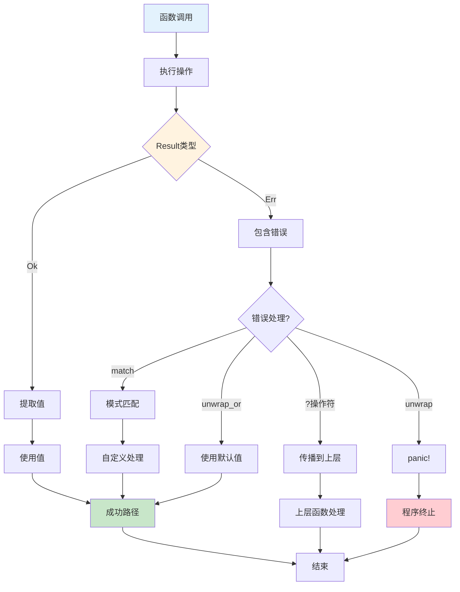

### ?操作符执行流程

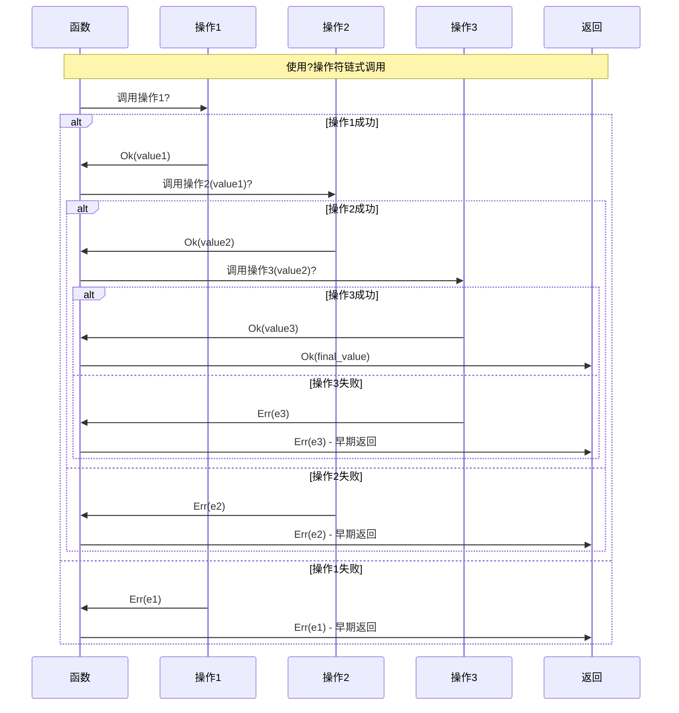

---

## 6. 模式匹配可视化

### 模式匹配决策树

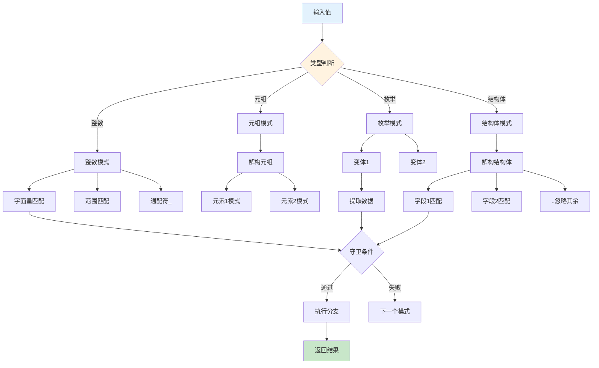

### 解构模式展开

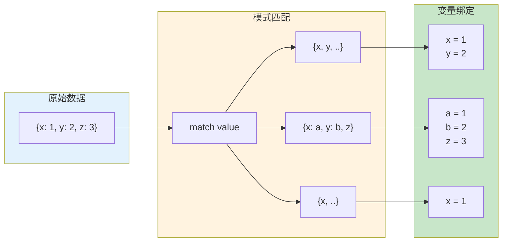

---

## 7. 控制流优化

### 编译器优化流程

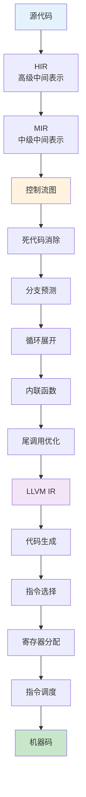

**优化示例**:

```rust
// 原始代码
fn sum_range(n: i32) -> i32 {
    let mut sum = 0;
    for i in 0..n {
        sum += i;
    }
    sum
}

// 编译器优化后 (概念)
fn sum_range_optimized(n: i32) -> i32 {
    // 循环展开 + 公式化
    n * (n - 1) / 2
}

// 分支预测优化
if likely(condition) {  // 提示编译器这个分支更可能执行
    // 热路径
} else {
    // 冷路径
}

// 尾调用优化
fn factorial(n: u64, acc: u64) -> u64 {
    if n == 0 {
        acc
    } else {
        factorial(n - 1, n * acc)  // 尾递归 -> 循环
    }
}
```

---

## 相关文档

- [知识图谱](./KNOWLEDGE_GRAPH_AND_CONCEPT_RELATIONS.md)
- [多维矩阵](./MULTI_DIMENSIONAL_COMPARISON_MATRIX.md)
- [基础教程](../02_basics/)
- [高级特性](../03_advanced/)
- [FAQ](../FAQ.md)

---

**文档版本**: v1.0  
**最后更新**: 2025-10-20  
**维护者**: Rust-lang项目组

---

## 返回导航

- [返回主索引](../00_MASTER_INDEX.md)
- [返回README](../README.md)
- [查看教程](../02_basics/)
