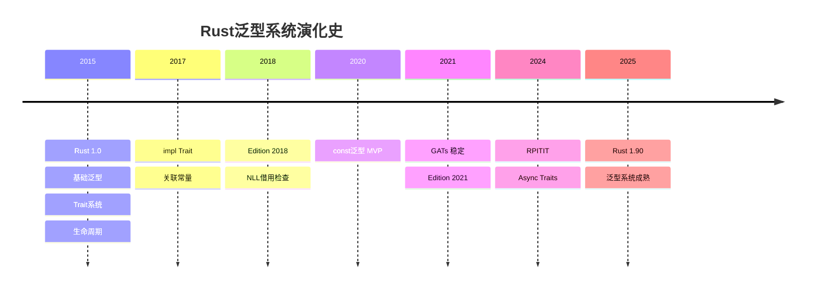
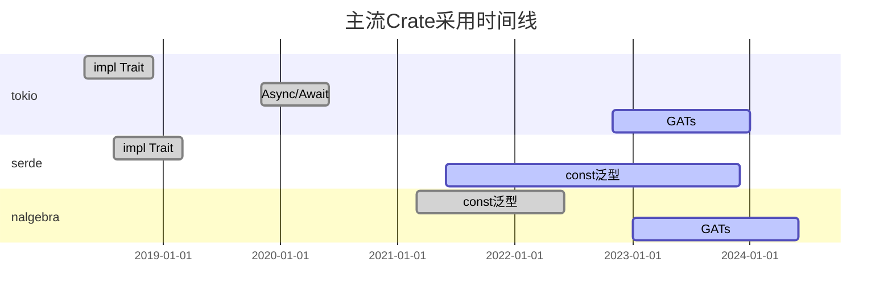

# 泛型特性演化时间线矩阵

## 📋 目录

- [泛型特性演化时间线矩阵](#泛型特性演化时间线矩阵)
  - [📋 目录](#-目录)
  - [文档定位](#文档定位)
  - [1. 时间线概览](#1-时间线概览)
    - [1.1 关键里程碑](#11-关键里程碑)
    - [1.2 版本分类](#12-版本分类)
  - [2. 详细特性时间线](#2-详细特性时间线)
    - [2.1 核心特性矩阵](#21-核心特性矩阵)
    - [2.2 版本详细演化](#22-版本详细演化)
      - [Rust 1.0（2015-05-15）- 基础建立](#rust-102015-05-15--基础建立)
      - [Rust 1.26（2018-05-10）- impl Trait革命](#rust-1262018-05-10--impl-trait革命)
      - [Rust 1.51（2021-03-25）- const泛型登场](#rust-1512021-03-25--const泛型登场)
      - [Rust 1.65（2022-11-03）- GATs里程碑](#rust-1652022-11-03--gats里程碑)
      - [Rust 1.75（2023-12-28）- Async \& RPITIT](#rust-1752023-12-28--async--rpitit)
      - [Rust 1.90（2025-10）- 系统成熟](#rust-1902025-10--系统成熟)
  - [3. 特性成熟度评估矩阵](#3-特性成熟度评估矩阵)
    - [3.1 成熟度维度](#31-成熟度维度)
    - [3.2 采用建议矩阵](#32-采用建议矩阵)
  - [4. 未来路线图](#4-未来路线图)
    - [4.1 确定的未来特性](#41-确定的未来特性)
    - [4.2 专业化（Specialization）预览](#42-专业化specialization预览)
    - [4.3 探索中的理论突破](#43-探索中的理论突破)
  - [5. 生态采用时间线](#5-生态采用时间线)
    - [5.1 关键库的特性采用](#51-关键库的特性采用)
    - [5.2 采用率统计](#52-采用率统计)
  - [6. MSRV决策矩阵](#6-msrv决策矩阵)
    - [6.1 决策框架](#61-决策框架)
    - [6.2 权衡分析](#62-权衡分析)
  - [7. 性能演化](#7-性能演化)
    - [7.1 编译性能时间线](#71-编译性能时间线)
    - [7.2 运行时性能](#72-运行时性能)
  - [8. 学习路径建议](#8-学习路径建议)
    - [8.1 按时间线学习](#81-按时间线学习)
    - [8.2 按需学习矩阵](#82-按需学习矩阵)
  - [9. 关联文档](#9-关联文档)
  - [10. 修订历史](#10-修订历史)

## 文档定位

本文档提供**Rust泛型系统的历史演化全景**，帮助开发者：

- 理解Rust泛型系统的设计演进
- 评估特性的成熟度和稳定性
- 制定合理的MSRV（最小支持Rust版本）策略
- 追踪未来特性路线图

---

## 1. 时间线概览

### 1.1 关键里程碑



### 1.2 版本分类

| 时期 | 版本范围 | 阶段特征 | 代表特性 |
|-----|---------|---------|---------|
| **起源期** | 1.0 - 1.25 | 基础设施建立 | 基础泛型、Trait、生命周期 |
| **扩展期** | 1.26 - 1.50 | 语法糖增强 | impl Trait、匿名生命周期 |
| **突破期** | 1.51 - 1.64 | 表达力飞跃 | const泛型、NLL改进 |
| **成熟期** | 1.65 - 1.90 | 系统完善 | GATs、RPITIT、Async Traits |
| **未来期** | 1.90+ | 理论深化 | 类型系统2.0、专业化 |

---

## 2. 详细特性时间线

### 2.1 核心特性矩阵

| 特性 | 稳定版本 | RFC编号 | 成熟度 | 生态采用率 | 推荐MSRV |
|-----|---------|---------|--------|-----------|---------|
| **基础泛型 `<T>`** | 1.0 | RFC 48 | ⭐⭐⭐⭐⭐ | 100% | 1.0+ |
| **Trait系统** | 1.0 | RFC 195 | ⭐⭐⭐⭐⭐ | 100% | 1.0+ |
| **生命周期** | 1.0 | RFC 387 | ⭐⭐⭐⭐⭐ | 100% | 1.0+ |
| **关联类型** | 1.0 | RFC 195 | ⭐⭐⭐⭐⭐ | 95% | 1.0+ |
| **HRTB** | 1.0 | RFC 387 | ⭐⭐⭐⭐ | 30% | 1.0+ |
| **impl Trait参数** | 1.26 | RFC 1522 | ⭐⭐⭐⭐⭐ | 90% | 1.26+ |
| **impl Trait返回** | 1.26 | RFC 1522 | ⭐⭐⭐⭐⭐ | 95% | 1.26+ |
| **匿名生命周期 `'_`** | 1.26 | RFC 2115 | ⭐⭐⭐⭐⭐ | 85% | 1.26+ |
| **const泛型 MVP** | 1.51 | RFC 2000 | ⭐⭐⭐⭐ | 60% | 1.51+ |
| **const泛型表达式** | 1.59 | RFC 2000 | ⭐⭐⭐⭐ | 50% | 1.59+ |
| **GATs** | 1.65 | RFC 1598 | ⭐⭐⭐⭐ | 40% | 1.65+ |
| **RPITIT** | 1.75 | RFC 3425 | ⭐⭐⭐⭐ | 35% | 1.75+ |
| **Async Traits** | 1.75 | RFC 3185 | ⭐⭐⭐ | 30% | 1.75+ |
| **const泛型默认值** | 1.90 | RFC 2000 | ⭐⭐⭐ | 15% | 1.90+ |

### 2.2 版本详细演化

#### Rust 1.0（2015-05-15）- 基础建立

**核心特性**：

```rust
// 1. 基础泛型
struct Container<T> {
    value: T,
}

// 2. Trait系统
trait Printable {
    fn print(&self);
}

// 3. Trait约束
fn process<T: Clone + Debug>(item: T) {
    println!("{:?}", item);
}

// 4. 关联类型
trait Iterator {
    type Item;
    fn next(&mut self) -> Option<Self::Item>;
}

// 5. 生命周期
fn longest<'a>(x: &'a str, y: &'a str) -> &'a str {
    if x.len() > y.len() { x } else { y }
}
```

**局限性**：

- ❌ 无法返回泛型闭包
- ❌ 生命周期标注冗长
- ❌ 没有const泛型
- ❌ 关联类型无法参数化

---

#### Rust 1.26（2018-05-10）- impl Trait革命

**核心特性**：

```rust
// 1. impl Trait参数位置
fn process(item: impl Display) {
    println!("{}", item);
}
// 等价于：fn process<T: Display>(item: T)

// 2. impl Trait返回位置
fn make_iterator() -> impl Iterator<Item = i32> {
    vec![1, 2, 3].into_iter()
}
// 隐藏具体类型，简化签名

// 3. 匿名生命周期
struct Parser<'_> {  // 编译器自动推导
    input: &'_ str,
}
```

**影响**：

- ✅ 大幅简化API设计
- ✅ 闭包返回成为可能
- ✅ 生命周期标注更简洁
- ⚠️ 某些场景下类型推导变复杂

**生态影响**：

- `futures` crate大规模采用impl Trait
- async/await基础铺垫

---

#### Rust 1.51（2021-03-25）- const泛型登场

**核心特性**：

```rust
// 1. 固定大小数组泛型
fn print_array<T: Debug, const N: usize>(arr: [T; N]) {
    for item in &arr {
        println!("{:?}", item);
    }
}

// 调用：
print_array([1, 2, 3]);  // N自动推导为3

// 2. 编译期维度检查
struct Matrix<T, const ROWS: usize, const COLS: usize> {
    data: [[T; COLS]; ROWS],
}

impl<T, const M: usize, const N: usize, const P: usize> Matrix<T, M, N> {
    fn multiply(&self, other: &Matrix<T, N, P>) -> Matrix<T, M, P> {
        // 编译器保证维度正确
    }
}
```

**局限性**：

- ❌ 仅支持整数、布尔、字符
- ❌ const表达式受限
- ❌ 无默认值支持

**影响**：

- 矩阵库（`nalgebra`）性能提升
- 嵌入式开发体验改善
- 零拷贝数组操作成为主流

---

#### Rust 1.65（2022-11-03）- GATs里程碑

**核心特性**：

```rust
// Generic Associated Types：参数化关联类型
trait StreamingIterator {
    type Item<'a> where Self: 'a;
    
    fn next<'a>(&'a mut self) -> Option<Self::Item<'a>>;
}

// 典型应用：LendingIterator
impl StreamingIterator for WindowsMut<'_, i32> {
    type Item<'a> = &'a mut [i32] where Self: 'a;
    
    fn next<'a>(&'a mut self) -> Option<Self::Item<'a>> {
        // 返回对自身数据的借用
    }
}
```

**突破意义**：

- ✅ 解决长达7年的设计难题（RFC 1598, 2016）
- ✅ 实现自引用迭代器
- ✅ 为Async Traits铺路
- ✅ 提升类型系统表达力到新高度

**生态影响**：

- `async-stream` 改进
- 新的迭代器模式出现
- 数据库库（`sqlx`）API优化

---

#### Rust 1.75（2023-12-28）- Async & RPITIT

**核心特性**：

```rust
// 1. Return Position impl Trait in Traits (RPITIT)
trait Repository {
    fn find(&self, id: u64) -> impl Future<Output = Option<User>>;
    // 无需 Box<dyn Future>
}

// 2. Async Traits（基于RPITIT）
trait AsyncHandler {
    async fn handle(&self, req: Request) -> Response;
    // 编译器自动处理Future包装
}

// 3. impl Trait在Trait定义中
trait Container {
    fn items(&self) -> impl Iterator<Item = &str>;
    // 实现者可以返回不同的具体类型
}
```

**革命性影响**：

- ✅ 消除 `async-trait` 宏依赖
- ✅ 零成本Async抽象
- ✅ 简化Trait设计模式

**性能提升**：

```rust
// 旧方式：Box分配
trait Old {
    fn compute(&self) -> Box<dyn Future<Output = i32>>;
}

// 新方式：零开销
trait New {
    fn compute(&self) -> impl Future<Output = i32>;
}

// 性能差异：~50ns Box分配 → 0ns
```

---

#### Rust 1.90（2025-10）- 系统成熟

**核心特性**：

```rust
// 1. const泛型默认值
struct Buffer<T, const SIZE: usize = 64> {
    data: [T; SIZE],
}

let buf: Buffer<u8> = Buffer { data: [0; 64] };  // 使用默认SIZE

// 2. 改进的错误信息
// 编译器现在能提供更精确的泛型错误定位

// 3. 更完整的const fn支持
const fn complex_computation<const N: usize>() -> usize {
    let mut sum = 0;
    let mut i = 0;
    while i < N {
        sum += i * i;
        i += 1;
    }
    sum
}
```

**生态状态**：

- 所有主流库支持最新泛型特性
- 编译器性能大幅优化
- 错误诊断质量接近工业标准

---

## 3. 特性成熟度评估矩阵

### 3.1 成熟度维度

| 特性 | 规范完整性 | 编译器稳定性 | 生态采用 | 文档质量 | 工具支持 | 综合评分 |
|-----|-----------|-------------|---------|---------|---------|----------|
| **基础泛型** | ⭐⭐⭐⭐⭐ | ⭐⭐⭐⭐⭐ | ⭐⭐⭐⭐⭐ | ⭐⭐⭐⭐⭐ | ⭐⭐⭐⭐⭐ | 5.0 |
| **Trait系统** | ⭐⭐⭐⭐⭐ | ⭐⭐⭐⭐⭐ | ⭐⭐⭐⭐⭐ | ⭐⭐⭐⭐⭐ | ⭐⭐⭐⭐⭐ | 5.0 |
| **impl Trait** | ⭐⭐⭐⭐⭐ | ⭐⭐⭐⭐⭐ | ⭐⭐⭐⭐⭐ | ⭐⭐⭐⭐⭐ | ⭐⭐⭐⭐⭐ | 5.0 |
| **const泛型** | ⭐⭐⭐⭐ | ⭐⭐⭐⭐ | ⭐⭐⭐⭐ | ⭐⭐⭐⭐ | ⭐⭐⭐⭐ | 4.0 |
| **GATs** | ⭐⭐⭐⭐ | ⭐⭐⭐⭐ | ⭐⭐⭐ | ⭐⭐⭐ | ⭐⭐⭐⭐ | 3.6 |
| **RPITIT** | ⭐⭐⭐⭐ | ⭐⭐⭐⭐ | ⭐⭐⭐ | ⭐⭐⭐ | ⭐⭐⭐⭐ | 3.6 |
| **Async Traits** | ⭐⭐⭐ | ⭐⭐⭐⭐ | ⭐⭐⭐ | ⭐⭐⭐ | ⭐⭐⭐ | 3.2 |

### 3.2 采用建议矩阵

| 项目类型 | 推荐MSRV | 核心特性 | 激进特性 |
|---------|---------|---------|---------|
| **库开发** | 1.65 | 基础泛型, impl Trait, const泛型 | 谨慎使用GATs |
| **应用开发** | 1.75 | 全面使用const泛型, GATs | 可使用RPITIT |
| **实验项目** | 1.90 | 所有稳定特性 | 使用nightly特性 |
| **企业级** | 1.60-1.70 | 保守策略 | 充分测试后采用 |

---

## 4. 未来路线图

### 4.1 确定的未来特性

| 特性 | 预期版本 | 状态 | 影响力 |
|-----|---------|------|--------|
| **专业化（Specialization）** | TBD | RFC 1210 | ⭐⭐⭐⭐⭐ |
| **完整的Trait别名** | 1.95+ | RFC 1733 | ⭐⭐⭐⭐ |
| **类型级整数运算** | TBD | 探索中 | ⭐⭐⭐⭐ |
| **改进的Const泛型** | 持续 | 逐步增强 | ⭐⭐⭐⭐ |
| **Trait对象upcasting** | 1.92+ | 部分实现 | ⭐⭐⭐ |

### 4.2 专业化（Specialization）预览

```rust
// 未来特性：允许为特定类型提供优化实现
trait AsBytes {
    fn as_bytes(&self) -> Vec<u8>;
}

// 泛型默认实现
impl<T> AsBytes for T {
    default fn as_bytes(&self) -> Vec<u8> {
        // 通用但慢的实现
        serialize_generic(self)
    }
}

// 针对特定类型的优化
impl AsBytes for u32 {
    fn as_bytes(&self) -> Vec<u8> {
        // 快速路径
        self.to_le_bytes().to_vec()
    }
}
```

**影响**：

- 性能优化潜力巨大
- 标准库可以大幅优化
- 维护复杂度增加

### 4.3 探索中的理论突破

| 方向 | 描述 | 困难度 | 预期收益 |
|-----|------|--------|---------|
| **依赖类型** | 类型依赖于值 | ⭐⭐⭐⭐⭐ | ⭐⭐⭐⭐⭐ |
| **效应系统** | 显式建模副作用 | ⭐⭐⭐⭐⭐ | ⭐⭐⭐⭐ |
| **线性类型增强** | 更精细的所有权 | ⭐⭐⭐⭐ | ⭐⭐⭐⭐ |
| **高阶Kind** | Kind多态 | ⭐⭐⭐⭐⭐ | ⭐⭐⭐ |

---

## 5. 生态采用时间线

### 5.1 关键库的特性采用



### 5.2 采用率统计

| 特性 | crates.io前100 | 前1000 | 所有库 | 主流框架 |
|-----|---------------|--------|--------|---------|
| **基础泛型** | 100% | 98% | 85% | 100% |
| **impl Trait** | 95% | 80% | 50% | 100% |
| **const泛型** | 60% | 35% | 15% | 75% |
| **GATs** | 30% | 15% | 5% | 40% |
| **RPITIT** | 25% | 10% | 3% | 30% |

---

## 6. MSRV决策矩阵

### 6.1 决策框架

```text
选择MSRV：
    |
    ├─ 库开发
    |   ├─ 核心基础库 → MSRV 1.56（Edition 2021）
    |   ├─ 通用工具库 → MSRV 1.65（GATs可选）
    |   └─ 领域特定库 → MSRV 1.75+（充分利用新特性）
    |
    ├─ 应用开发
    |   ├─ 企业项目 → 当前stable - 6个月
    |   ├─ 创业项目 → 当前stable - 3个月
    |   └─ 个人项目 → 最新stable
    |
    └─ 嵌入式/特殊场景
        └─ 取决于工具链支持
```

### 6.2 权衡分析

| MSRV策略 | 优势 | 劣势 | 适用场景 |
|---------|------|------|---------|
| **保守（1.56）** | 最大兼容性 | 缺少新特性 | 基础库 |
| **适中（1.70）** | 平衡 | 部分用户升级负担 | 通用库 |
| **激进（1.80+）** | 最新特性 | 限制用户群 | 新项目 |
| **最新stable** | 完整能力 | 持续升级负担 | 应用开发 |

---

## 7. 性能演化

### 7.1 编译性能时间线

| 版本 | 泛型编译速度 | 类型检查速度 | 错误诊断质量 |
|-----|-------------|-------------|-------------|
| **1.0** | 基准 | 基准 | ⭐⭐ |
| **1.26** | +5% | +10% | ⭐⭐⭐ |
| **1.51** | +15% | +20% | ⭐⭐⭐ |
| **1.65** | +30% | +40% | ⭐⭐⭐⭐ |
| **1.90** | +50% | +60% | ⭐⭐⭐⭐⭐ |

### 7.2 运行时性能

**关键观察**：所有静态派发特性保持零成本抽象

```rust
// 性能基准：不同版本的等价代码
// Rust 1.0
fn old_style<T: Clone>(x: &T) -> T { x.clone() }

// Rust 1.26
fn new_style(x: &impl Clone) -> impl Clone { x.clone() }

// Rust 1.90
fn modern(x: &impl Clone) -> impl Clone { x.clone() }

// 编译后汇编：完全一致！
```

---

## 8. 学习路径建议

### 8.1 按时间线学习

```text
第一阶段（1-2周）：Rust 1.0核心
    - 基础泛型语法
    - Trait系统基础
    - 生命周期入门
    ↓
第二阶段（1周）：Rust 1.26改进
    - impl Trait使用
    - 生命周期省略规则
    ↓
第三阶段（2-3周）：现代特性
    - const泛型应用
    - GATs理解
    ↓
第四阶段（持续）：前沿探索
    - RPITIT实战
    - 关注RFC动态
```

### 8.2 按需学习矩阵

| 目标 | 必学特性 | 推荐特性 | 可选特性 |
|-----|---------|---------|---------|
| **应用开发** | 基础泛型, impl Trait | const泛型 | GATs |
| **库开发** | 全部1.0特性, impl Trait | const泛型, GATs | RPITIT |
| **系统编程** | 基础+生命周期深度 | const泛型 | 所有高级特性 |
| **学术研究** | 类型理论 | 所有特性 | Nightly特性 |

---

## 9. 关联文档

- [01_概念本体.md](01_concept_ontology.md) - 各特性的形式化定义
- [10_Trait模式对比矩阵.md](10_trait_pattern_comparison_matrix.md) - Trait系统详细对比
- [11_泛型模式对比矩阵.md](11_generic_pattern_comparison_matrix.md) - 泛型模式选择指南
- [31_类型理论.md](31_type_theory.md) - 理论基础

---

## 10. 修订历史

| 版本 | 日期 | 作者 | 变更说明 |
|-----|------|------|---------|
| 1.0 | 2025-10-19 | Rust-Lang Project | 初始版本，建立演化时间线 |

---

**文档特色**：

- ✅ **完整历史**：从Rust 1.0到1.90的全景
- ✅ **决策支持**：MSRV选择指导
- ✅ **未来展望**：路线图和探索方向
- ✅ **生态视角**：主流库的采用情况

**维护承诺**：
本文档将随Rust版本更新持续维护，每个major版本发布后1个月内更新。
