# 生命周期系统思维导图


## 📊 目录

- [📋 目录](#目录)
- [文档定位](#文档定位)
- [1. 四层思维导图结构](#1-四层思维导图结构)
  - [1.1 整体架构](#11-整体架构)
- [2. L1 领域层：生命周期哲学](#2-l1-领域层生命周期哲学)
  - [L1 核心特征](#l1-核心特征)
- [3. L2 核心层：生命周期基础](#3-l2-核心层生命周期基础)
  - [3.1 借用规则分支](#31-借用规则分支)
    - [借用规则矩阵](#借用规则矩阵)
  - [3.2 生命周期标注分支](#32-生命周期标注分支)
    - [生命周期标注模式](#生命周期标注模式)
  - [3.3 作用域管理分支](#33-作用域管理分支)
    - [NLL改进对比](#nll改进对比)
  - [3.4 借用检查器分支](#34-借用检查器分支)
    - [借用检查器工作流程](#借用检查器工作流程)
- [4. L3 实现层：生命周期机制](#4-l3-实现层生命周期机制)
  - [4.1 生命周期推导](#41-生命周期推导)
    - [推导成功 vs 失败案例](#推导成功-vs-失败案例)
  - [4.2 省略规则](#42-省略规则)
    - [省略规则详解](#省略规则详解)
    - [省略决策矩阵](#省略决策矩阵)
  - [4.3 生命周期约束](#43-生命周期约束)
    - [生命周期约束实战](#生命周期约束实战)
  - [4.4 NLL（Non-Lexical Lifetimes）](#44-nllnon-lexical-lifetimes)
    - [NLL改进案例集](#nll改进案例集)
- [5. L4 高级层：生命周期高级特性](#5-l4-高级层生命周期高级特性)
  - [5.1 HRTB（Higher-Rank Trait Bounds）](#51-hrtbhigher-rank-trait-bounds)
    - [HRTB核心用例](#hrtb核心用例)
  - [5.2 生命周期子类型](#52-生命周期子类型)
    - [型变（Variance）详解](#型变variance详解)
  - [5.3 Polonius借用检查器](#53-polonius借用检查器)
    - [Polonius vs 当前借用检查器](#polonius-vs-当前借用检查器)
- [6. 学习路径导航](#6-学习路径导航)
  - [6.1 初学者路径（2-3周）](#61-初学者路径2-3周)
  - [6.2 进阶路径（2-3周）](#62-进阶路径2-3周)
  - [6.3 高级路径（持续）](#63-高级路径持续)
- [7. 常见错误模式与解决方案](#7-常见错误模式与解决方案)
  - [7.1 悬垂引用](#71-悬垂引用)
  - [7.2 借用冲突](#72-借用冲突)
  - [7.3 生命周期不足](#73-生命周期不足)
- [8. 实战检查清单](#8-实战检查清单)
- [9. 关联文档](#9-关联文档)
- [10. 修订历史](#10-修订历史)


## 📋 目录

- [生命周期系统思维导图](#生命周期系统思维导图)
  - [📋 目录](#-目录)
  - [文档定位](#文档定位)
  - [1. 四层思维导图结构](#1-四层思维导图结构)
    - [1.1 整体架构](#11-整体架构)
  - [2. L1 领域层：生命周期哲学](#2-l1-领域层生命周期哲学)
    - [L1 核心特征](#l1-核心特征)
  - [3. L2 核心层：生命周期基础](#3-l2-核心层生命周期基础)
    - [3.1 借用规则分支](#31-借用规则分支)
      - [借用规则矩阵](#借用规则矩阵)
    - [3.2 生命周期标注分支](#32-生命周期标注分支)
      - [生命周期标注模式](#生命周期标注模式)
    - [3.3 作用域管理分支](#33-作用域管理分支)
      - [NLL改进对比](#nll改进对比)
    - [3.4 借用检查器分支](#34-借用检查器分支)
      - [借用检查器工作流程](#借用检查器工作流程)
  - [4. L3 实现层：生命周期机制](#4-l3-实现层生命周期机制)
    - [4.1 生命周期推导](#41-生命周期推导)
      - [推导成功 vs 失败案例](#推导成功-vs-失败案例)
    - [4.2 省略规则](#42-省略规则)
      - [省略规则详解](#省略规则详解)
      - [省略决策矩阵](#省略决策矩阵)
    - [4.3 生命周期约束](#43-生命周期约束)
      - [生命周期约束实战](#生命周期约束实战)
    - [4.4 NLL（Non-Lexical Lifetimes）](#44-nllnon-lexical-lifetimes)
      - [NLL改进案例集](#nll改进案例集)
  - [5. L4 高级层：生命周期高级特性](#5-l4-高级层生命周期高级特性)
    - [5.1 HRTB（Higher-Rank Trait Bounds）](#51-hrtbhigher-rank-trait-bounds)
      - [HRTB核心用例](#hrtb核心用例)
    - [5.2 生命周期子类型](#52-生命周期子类型)
      - [型变（Variance）详解](#型变variance详解)
    - [5.3 Polonius借用检查器](#53-polonius借用检查器)
      - [Polonius vs 当前借用检查器](#polonius-vs-当前借用检查器)
  - [6. 学习路径导航](#6-学习路径导航)
    - [6.1 初学者路径（2-3周）](#61-初学者路径2-3周)
    - [6.2 进阶路径（2-3周）](#62-进阶路径2-3周)
    - [6.3 高级路径（持续）](#63-高级路径持续)
  - [7. 常见错误模式与解决方案](#7-常见错误模式与解决方案)
    - [7.1 悬垂引用](#71-悬垂引用)
    - [7.2 借用冲突](#72-借用冲突)
    - [7.3 生命周期不足](#73-生命周期不足)
  - [8. 实战检查清单](#8-实战检查清单)
  - [9. 关联文档](#9-关联文档)
  - [10. 修订历史](#10-修订历史)

## 文档定位

本文档提供**生命周期系统的层次化可视结构**，帮助开发者：

- 理解生命周期的完整知识架构
- 掌握借用检查器的工作原理
- 建立系统化的生命周期思维模型

---

## 1. 四层思维导图结构

### 1.1 整体架构

```text
生命周期系统（L1 Domain）
├── 核心概念层（L2 Core）
│   ├── 借用规则
│   ├── 生命周期标注
│   ├── 作用域管理
│   └── 借用检查器
│
├── 实现机制层（L3 Implementation）
│   ├── 生命周期推导
│   ├── 省略规则
│   ├── 生命周期约束
│   └── NLL分析
│
└── 高级特性层（L4 Advanced）
    ├── HRTB
    ├── 生命周期子类型
    ├── 协变与逆变
    └── Polonius引擎
```

---

## 2. L1 领域层：生命周期哲学

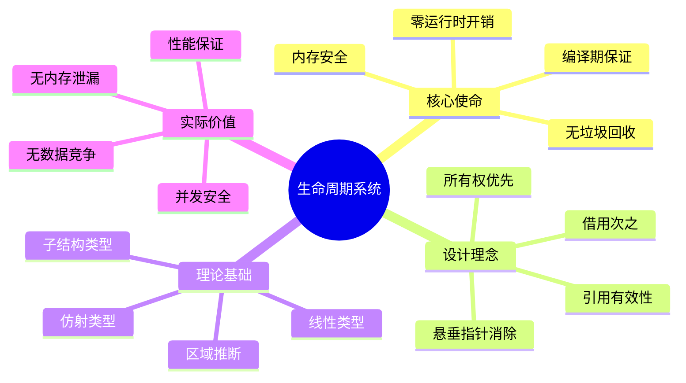

### L1 核心特征

| 维度 | 描述 | 独特价值 |
|-----|------|---------|
| **安全保证** | 编译期消除悬垂指针 | 无运行时检查 |
| **性能零成本** | 生命周期标注编译后擦除 | 纯零开销抽象 |
| **所有权集成** | 与所有权系统深度耦合 | 统一内存模型 |
| **并发基石** | Send/Sync的基础 | 无数据竞争保证 |

---

## 3. L2 核心层：生命周期基础

### 3.1 借用规则分支

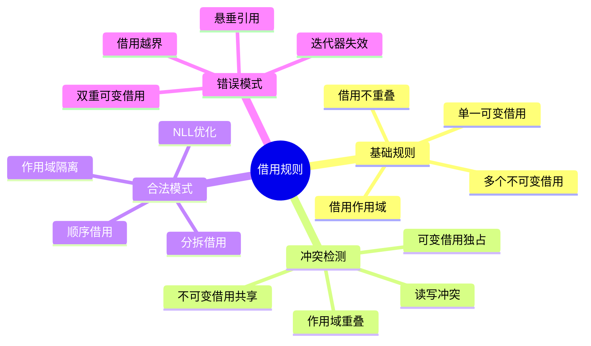

#### 借用规则矩阵

| 场景 | 可行性 | 原因 | 解决方案 |
|-----|-------|------|---------|
| **多个不可变借用** | ✅ 合法 | 只读不冲突 | 直接使用 |
| **单一可变借用** | ✅ 合法 | 独占写入 | 直接使用 |
| **可变+不可变借用** | ❌ 非法 | 读写冲突 | 分离作用域 |
| **多个可变借用** | ❌ 非法 | 写写冲突 | 分拆借用/内部可变性 |

```rust
// ✅ 合法：多个不可变借用
let s = String::from("hello");
let r1 = &s;
let r2 = &s;
println!("{} {}", r1, r2);  // OK

// ✅ 合法：单一可变借用
let mut s = String::from("hello");
let r = &mut s;
r.push_str(" world");

// ❌ 非法：可变+不可变借用
let mut s = String::from("hello");
let r1 = &s;
let r2 = &mut s;  // 编译错误
println!("{}", r1);

// ✅ 修复：分离作用域（NLL）
let mut s = String::from("hello");
let r1 = &s;
println!("{}", r1);  // r1作用域结束
let r2 = &mut s;     // OK
```

---

### 3.2 生命周期标注分支

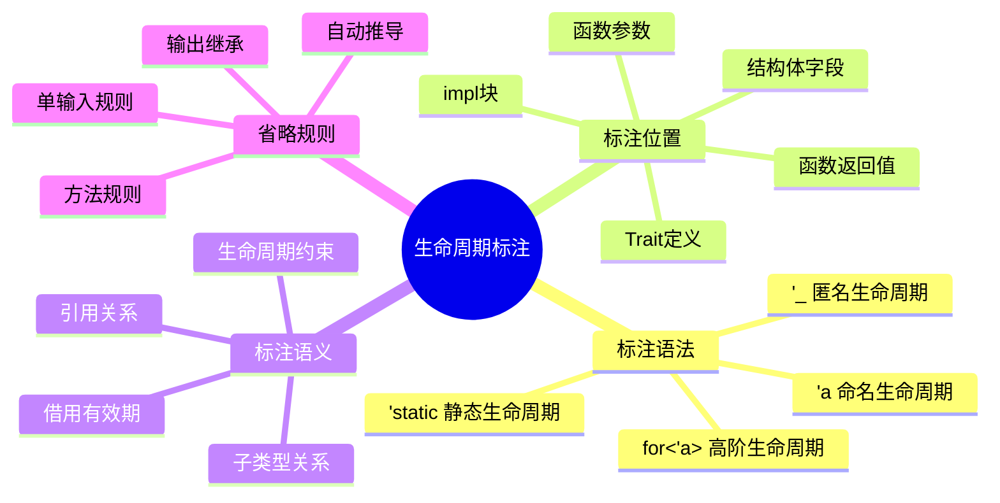

#### 生命周期标注模式

```rust
// 模式1：基础标注（输入输出关联）
fn first_word<'a>(s: &'a str) -> &'a str {
    s.split_whitespace().next().unwrap_or("")
}

// 模式2：多生命周期
fn longest<'a, 'b>(x: &'a str, y: &'b str) -> &'a str
where
    'b: 'a,  // y至少和x活得一样久
{
    if x.len() > y.len() { x } else { y }
}

// 模式3：结构体生命周期
struct Parser<'a> {
    input: &'a str,
    position: usize,
}

impl<'a> Parser<'a> {
    fn new(input: &'a str) -> Self {
        Parser { input, position: 0 }
    }
    
    // 返回值生命周期继承&self
    fn current(&self) -> &str {
        &self.input[self.position..]
    }
}

// 模式4：静态生命周期
static HELLO: &'static str = "Hello, world!";

fn get_static() -> &'static str {
    "static string"
}

// 模式5：匿名生命周期（Rust 1.26+）
struct Wrapper<'_> {
    data: &'_ str,  // 编译器推导
}
```

---

### 3.3 作用域管理分支

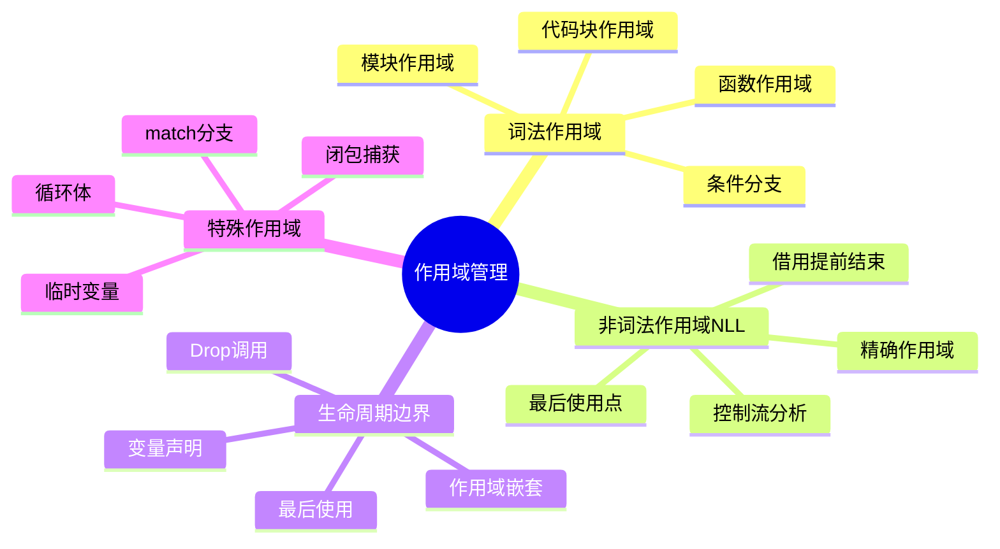

#### NLL改进对比

```rust
// ❌ 旧借用检查器（Rust 1.30之前）
fn old_nll() {
    let mut data = vec![1, 2, 3];
    let r = &data[0];
    println!("{}", r);
    data.push(4);  // 编译错误：可变借用冲突
}

// ✅ NLL（Non-Lexical Lifetimes, Rust 1.31+）
fn new_nll() {
    let mut data = vec![1, 2, 3];
    let r = &data[0];
    println!("{}", r);  // r最后使用点
    // r的作用域在此结束
    data.push(4);  // OK：r不再活跃
}

// NLL分析控制流
fn control_flow(cond: bool) {
    let mut s = String::from("hello");
    
    let r = if cond {
        &s  // 不可变借用
    } else {
        s.push_str(" world");  // 可变借用
        &s
    };
    
    println!("{}", r);
}  // NLL正确分析分支
```

---

### 3.4 借用检查器分支

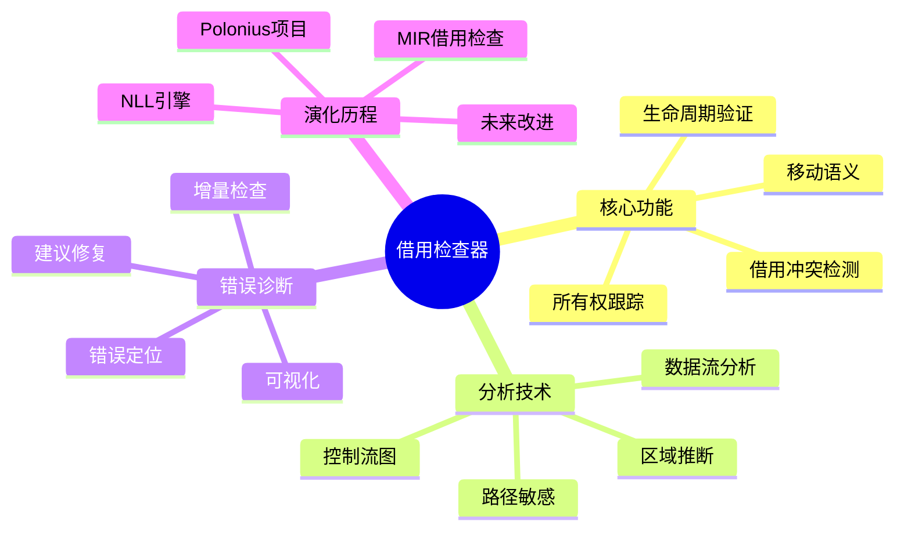

#### 借用检查器工作流程

```text
源代码
    ↓
解析/类型检查
    ↓
MIR（中间表示）
    ↓
借用检查器
    ├─ 所有权分析
    ├─ 生命周期推断
    ├─ 借用冲突检测
    ├─ 移动/复制检查
    └─ 区域求解
    ↓
通过 → 编译
失败 → 错误报告
```

**借用检查器的三个核心问题**：

1. **这个借用在哪里结束？** → 生命周期分析
2. **是否有借用冲突？** → 路径分析
3. **值是否已被移动？** → 所有权跟踪

---

## 4. L3 实现层：生命周期机制

### 4.1 生命周期推导

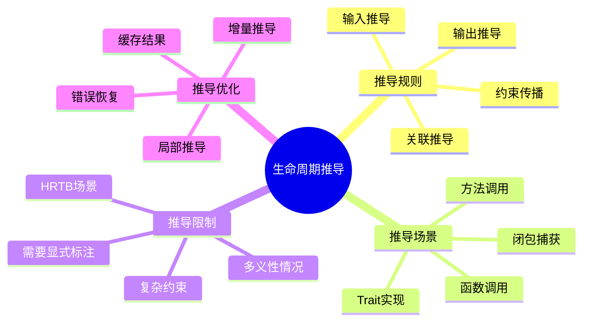

#### 推导成功 vs 失败案例

```rust
// ✅ 成功推导：单输入单输出
fn extract(s: &str) -> &str {
    // 编译器推导：fn extract<'a>(s: &'a str) -> &'a str
    s.trim()
}

// ✅ 成功推导：方法
struct Data {
    content: String,
}

impl Data {
    fn get(&self) -> &str {
        // 推导：fn get<'a>(&'a self) -> &'a str
        &self.content
    }
}

// ❌ 推导失败：多输入多输出
fn combine(x: &str, y: &str) -> (&str, &str) {
    // 编译错误：无法确定返回值的生命周期
    (x, y)
}

// ✅ 显式标注修复
fn combine<'a, 'b>(x: &'a str, y: &'b str) -> (&'a str, &'b str) {
    (x, y)
}

// ❌ 推导失败：条件返回
fn conditional<'a>(flag: bool, x: &'a str, y: &str) -> &'a str {
    // 编译错误：y的生命周期不是'a
    if flag { x } else { y }
}

// ✅ 生命周期约束修复
fn conditional<'a, 'b: 'a>(flag: bool, x: &'a str, y: &'b str) -> &'a str {
    if flag { x } else { y }
}
```

---

### 4.2 省略规则

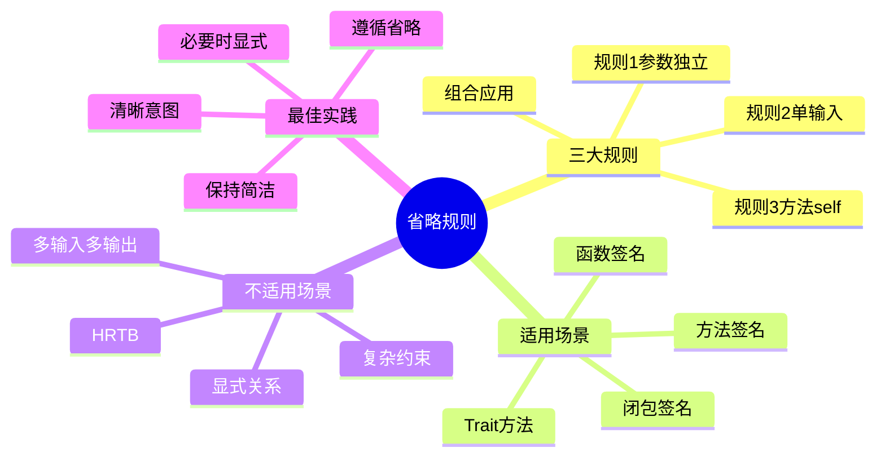

#### 省略规则详解

**规则1：每个引用参数获得独立生命周期**:

```rust
fn print(s: &str, t: &str)
// 编译器推导为：
fn print<'a, 'b>(s: &'a str, t: &'b str)
```

**规则2：单输入引用，输出继承该生命周期**:

```rust
fn first_char(s: &str) -> &str
// 编译器推导为：
fn first_char<'a>(s: &'a str) -> &'a str
```

**规则3：方法中，输出继承&self的生命周期**:

```rust
impl MyStruct {
    fn get_data(&self) -> &str
    // 编译器推导为：
    fn get_data<'a>(&'a self) -> &'a str
}
```

#### 省略决策矩阵

| 场景 | 可省略 | 规则 | 建议 |
|-----|-------|------|------|
| `fn foo(&self) -> &T` | ✅ | 规则3 | 省略 |
| `fn foo(s: &str) -> &str` | ✅ | 规则2 | 省略 |
| `fn foo(x: &str, y: &str) -> &str` | ❌ | 多输入 | 显式标注 |
| `fn foo(&self, s: &str) -> &str` | ✅ | 规则3 | 省略（返回继承self） |
| `struct S<'a> { f: &'a T }` | ❌ | 结构体 | 必须标注 |

---

### 4.3 生命周期约束

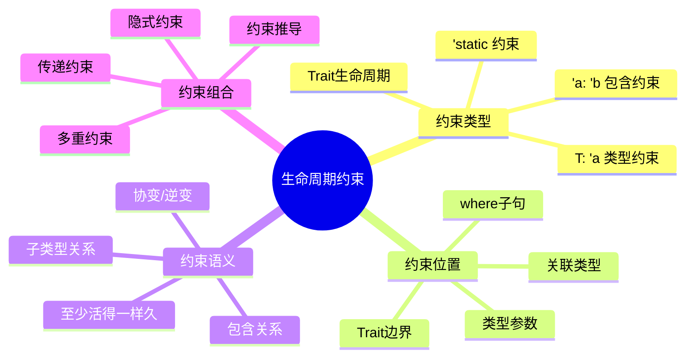

#### 生命周期约束实战

```rust
// 约束1：'a: 'b（'a至少和'b一样长）
fn foo<'a, 'b>(x: &'a str, y: &'b str) -> &'b str
where
    'a: 'b,  // x的生命周期 >= y的生命周期
{
    if x.len() > y.len() { x } else { y }
}

// 约束2：T: 'a（T不包含短于'a的引用）
struct Ref<'a, T: 'a> {
    reference: &'a T,
}

// 在Rust 2018+，T: 'a通常可以省略（编译器推导）
struct RefModern<'a, T> {
    reference: &'a T,  // T: 'a隐式
}

// 约束3：'static约束
fn spawn<F>(f: F)
where
    F: FnOnce() + Send + 'static,  // F不能包含非'static引用
{
    std::thread::spawn(f);
}

// 约束4：Trait生命周期
trait Processor<'a> {
    type Output: 'a;  // Output不能outlive 'a
    
    fn process(&self, input: &'a str) -> Self::Output;
}

// 约束5：HRTB（高阶生命周期约束）
fn apply<F>(f: F)
where
    F: for<'a> Fn(&'a str) -> &'a str,  // 对任意'a都成立
{
    let s = String::from("hello");
    let result = f(&s);
    println!("{}", result);
}
```

---

### 4.4 NLL（Non-Lexical Lifetimes）

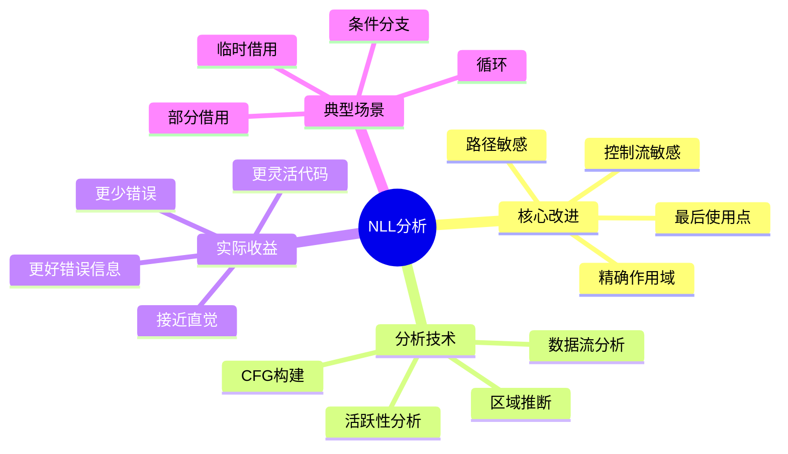

#### NLL改进案例集

```rust
// 案例1：条件分支
fn nll_branch(flag: bool) {
    let mut s = String::from("hello");
    
    if flag {
        let r = &s;
        println!("{}", r);
    }  // r的作用域结束
    
    s.push_str(" world");  // OK：r不再活跃
}

// 案例2：循环中的借用
fn nll_loop() {
    let mut data = vec![1, 2, 3];
    
    for i in 0..3 {
        let r = &data[i];
        println!("{}", r);
    }  // r的作用域在每次迭代结束
    
    data.push(4);  // OK
}

// 案例3：部分借用（字段分拆）
struct Point {
    x: i32,
    y: i32,
}

fn nll_partial() {
    let mut p = Point { x: 0, y: 0 };
    
    let rx = &mut p.x;  // 仅借用x字段
    let ry = &mut p.y;  // OK：y字段独立
    
    *rx += 1;
    *ry += 2;
}

// 案例4：方法链中的临时借用
fn nll_method_chain() {
    let mut s = String::from("hello");
    
    s.push_str(" world");
    let len = s.len();  // 临时不可变借用
    // 临时借用立即结束
    
    s.push_str("!");  // OK
}
```

---

## 5. L4 高级层：生命周期高级特性

### 5.1 HRTB（Higher-Rank Trait Bounds）

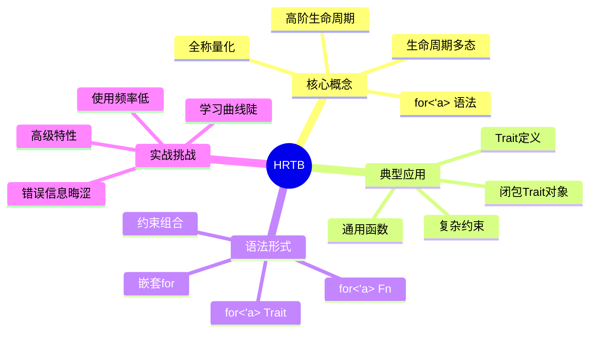

#### HRTB核心用例

```rust
// 用例1：通用闭包适配器
fn call_with_ref<F, T, R>(f: F, arg: &T) -> R
where
    F: for<'a> Fn(&'a T) -> R,  // 对任意'a都成立
{
    f(arg)
}

// 使用
let result = call_with_ref(|s: &str| s.len(), &"hello".to_string());

// 用例2：Trait对象
type Callback<'a> = Box<dyn for<'b> Fn(&'b str) -> &'b str + 'a>;

fn make_callback() -> Callback<'static> {
    Box::new(|s| s.trim())
}

// 用例3：高阶Trait定义
trait Handler {
    fn handle<'a>(&self, input: &'a str) -> &'a str;
}

fn process_handler<H>(handler: H)
where
    H: for<'a> Fn(&'a str) -> &'a str,
{
    let result = handler("test");
    println!("{}", result);
}

// 用例4：复杂约束
trait StreamProcessor {
    type Item;
    
    fn process<'a, F>(&'a self, f: F)
    where
        F: for<'b> FnMut(&'b Self::Item) -> bool;
}
```

---

### 5.2 生命周期子类型

```mermaid
mindmap
  root((生命周期子类型))
    子类型关系
      'static 最大
      'a: 'b 子类型
      协变
      逆变
      不变
    
    型变规则
      &'a T 协变
      &'a mut T 不变
      fn('a T) 逆变
      Cell<T> 不变
    
    实际影响
      类型转换
      生命周期缩短
      约束推导
      安全保证
    
    常见陷阱
      可变引用不变
      函数参数逆变
      内部可变性
      类型转换限制
```

#### 型变（Variance）详解

| 类型构造器 | 型变性 | 含义 | 示例 |
|-----------|--------|------|------|
| **`&'a T`** | 协变 | 'long可以转为'short | `&'static str` → `&'a str` |
| **`&'a mut T`** | 不变 | 不可转换 | 无法缩短生命周期 |
| **`fn(T)`** | 逆变 | 'short可以转为'long | 反直觉 |
| **`Cell<T>`** | 不变 | 内部可变性限制 | 不可变换 |

```rust
// 协变示例：&'a T
fn covariant() {
    let s: &'static str = "hello";
    let r: &str = s;  // OK：'static -> 'a（协变）
}

// 不变示例：&'a mut T
fn invariant<'a>(r: &'a mut &'a str) {
    // 无法将&'static str赋值给r
    // 因为&mut是不变的
}

// 逆变示例：函数参数
fn contravariant() {
    // 接受任意生命周期的函数
    let f: fn(&str) = |s: &'static str| println!("{}", s);
    // 编译错误：fn(&'static str)不能转为fn(&str)
}

// 实际应用：生命周期缩短
fn shorten<'a, 'b: 'a>(r: &'b str) -> &'a str {
    r  // OK：'b >= 'a，协变允许缩短
}
```

---

### 5.3 Polonius借用检查器

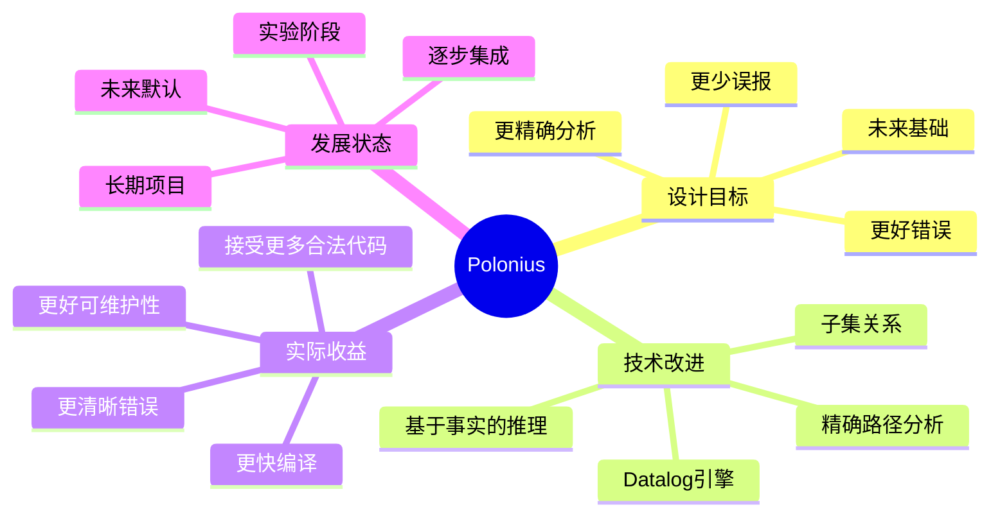

#### Polonius vs 当前借用检查器

```rust
// 当前借用检查器拒绝但应该接受的代码

// 案例1：复杂控制流
fn polonius_case1(v: &mut Vec<i32>, i: usize) {
    if let Some(x) = v.get_mut(i) {
        *x += 1;
    }
    v.push(1);  // 当前：可能错误；Polonius：OK
}

// 案例2：条件借用
fn polonius_case2(flag: bool, v: &mut Vec<i32>) -> Option<&i32> {
    if flag {
        return v.get(0);
    }
    v.push(1);  // 当前：可能冲突；Polonius：OK
    None
}

// 案例3：复杂路径
struct Container {
    data: Vec<i32>,
}

fn polonius_case3(c: &mut Container) {
    let r = &c.data[0];
    println!("{}", r);
    c.data.push(1);  // Polonius更精确的路径分析
}
```

---

## 6. 学习路径导航

### 6.1 初学者路径（2-3周）

```text
阶段1：借用规则基础
    → 理解所有权
    → 不可变借用
    → 可变借用
    → 借用冲突规则
    ↓
阶段2：生命周期标注入门
    → 基础语法 'a
    → 函数参数返回值
    → 简单结构体
    ↓
阶段3：省略规则
    → 三大省略规则
    → 何时可以省略
    → 何时必须显式
```

### 6.2 进阶路径（2-3周）

```text
阶段4：复杂生命周期
    → 多生命周期标注
    → 生命周期约束
    → 结构体生命周期
    ↓
阶段5：NLL理解
    → 最后使用点
    → 控制流分析
    → 部分借用
    ↓
阶段6：实战错误处理
    → 常见错误模式
    → 解决方案
    → 重构技巧
```

### 6.3 高级路径（持续）

```text
阶段7：HRTB深入
    → for<'a>语法
    → 闭包Trait对象
    → 高阶抽象
    ↓
阶段8：类型理论
    → 生命周期子类型
    → 协变逆变
    → 型变系统
    ↓
阶段9：借用检查器原理
    → MIR分析
    → 区域推断
    → Polonius探索
```

---

## 7. 常见错误模式与解决方案

### 7.1 悬垂引用

```rust
// ❌ 错误：返回局部变量引用
fn dangle() -> &str {
    let s = String::from("hello");
    &s  // 编译错误：s将被销毁
}

// ✅ 解决方案1：返回拥有所有权的类型
fn owned() -> String {
    String::from("hello")
}

// ✅ 解决方案2：使用静态生命周期
fn static_str() -> &'static str {
    "hello"  // 字符串字面量
}

// ✅ 解决方案3：使用Box::leak（慎用）
fn leaked() -> &'static str {
    Box::leak(String::from("hello").into_boxed_str())
}
```

### 7.2 借用冲突

```rust
// ❌ 错误：可变和不可变借用重叠
fn borrow_conflict() {
    let mut v = vec![1, 2, 3];
    let r = &v[0];
    v.push(4);  // 编译错误
    println!("{}", r);
}

// ✅ 解决方案1：分离借用作用域
fn separated_scope() {
    let mut v = vec![1, 2, 3];
    {
        let r = &v[0];
        println!("{}", r);
    }  // r作用域结束
    v.push(4);  // OK
}

// ✅ 解决方案2：克隆数据
fn clone_data() {
    let mut v = vec![1, 2, 3];
    let first = v[0];  // Copy类型
    v.push(4);
    println!("{}", first);
}

// ✅ 解决方案3：使用索引
fn use_index() {
    let mut v = vec![1, 2, 3];
    let idx = 0;
    v.push(4);
    println!("{}", v[idx]);
}
```

### 7.3 生命周期不足

```rust
// ❌ 错误：返回值生命周期不足
fn too_short<'a>(x: &'a str) -> &'a str {
    let temp = String::from("temp");
    &temp  // 编译错误：temp不是'a
}

// ✅ 解决方案1：返回拥有所有权
fn return_owned(x: &str) -> String {
    format!("{} processed", x)
}

// ✅ 解决方案2：使用Cow（写时克隆）
use std::borrow::Cow;

fn use_cow<'a>(x: &'a str, modify: bool) -> Cow<'a, str> {
    if modify {
        Cow::Owned(format!("{} modified", x))
    } else {
        Cow::Borrowed(x)
    }
}
```

---

## 8. 实战检查清单

**设计带引用的函数前**：

- [ ] 是否可以返回拥有所有权的类型？
- [ ] 引用的生命周期来源是否清晰？
- [ ] 是否满足省略规则？
- [ ] 是否需要多个独立生命周期？
- [ ] 是否涉及复杂的借用关系？

**遇到生命周期错误时**：

- [ ] 错误信息指向的位置是否是真实问题？
- [ ] 是否可以通过分离作用域解决？
- [ ] 是否可以用Clone/Copy避免借用？
- [ ] 是否需要调整函数签名？
- [ ] 是否是NLL可以解决的情况？

**设计结构体时**：

- [ ] 是否真的需要存储引用？
- [ ] 能否用拥有所有权的类型代替？
- [ ] 生命周期参数是否最小化？
- [ ] 是否考虑了自引用问题？

---

## 9. 关联文档

- [01_概念本体.md](01_concept_ontology.md) - 生命周期形式化定义
- [02_关系网络.md](02_relationship_network.md) - 生命周期与所有权的关系
- [12_生命周期模式对比矩阵.md](12_lifetime_pattern_comparison_matrix.md) - 生命周期模式详细对比
- [20_核心概念思维导图.md](20_core_concepts_mindmap.md) - 泛型系统整体导图

---

## 10. 修订历史

| 版本 | 日期 | 作者 | 变更说明 |
|-----|------|------|---------|
| 1.0 | 2025-10-19 | Rust-Lang Project | 初始版本，建立生命周期系统思维导图 |

---

**文档特色**：

- ✅ **四层结构**：从哲学到实现的完整层次
- ✅ **实战导向**：大量错误案例与解决方案
- ✅ **可视化**：Mermaid思维导图辅助理解
- ✅ **系统化**：借用检查器原理深入剖析

**学习建议**：

1. **初学者**：重点L2核心层，掌握基础借用规则
2. **进阶者**：深入L3机制层，理解NLL和推导
3. **高级开发者**：探索L4高级层，掌握HRTB
4. **理论研究者**：研究Polonius和型变系统
