# 高级特性思维导图


## 📊 目录

- [📋 目录](#目录)
- [文档定位](#文档定位)
- [1. 四层思维导图结构](#1-四层思维导图结构)
  - [1.1 整体架构](#11-整体架构)
- [2. L1 领域层：高级特性全景](#2-l1-领域层高级特性全景)
  - [L1 特征矩阵](#l1-特征矩阵)
- [3. L2 核心层：四大核心高级特性](#3-l2-核心层四大核心高级特性)
  - [3.1 GATs（Generic Associated Types）](#31-gatsgeneric-associated-types)
    - [GATs核心应用矩阵](#gats核心应用矩阵)
    - [GATs实战：LendingIterator完整实现](#gats实战lendingiterator完整实现)
  - [3.2 HRTB（Higher-Rank Trait Bounds）](#32-hrtbhigher-rank-trait-bounds)
    - [HRTB深度剖析](#hrtb深度剖析)
    - [HRTB实战模式](#hrtb实战模式)
  - [3.3 Const泛型高级应用](#33-const泛型高级应用)
    - [Const泛型高级模式](#const泛型高级模式)
  - [3.4 RPITIT与Async Traits](#34-rpitit与async-traits)
    - [RPITIT完整演化](#rpitit完整演化)
    - [RPITIT高级模式](#rpitit高级模式)
- [4. L3 实现层：类型级编程技术](#4-l3-实现层类型级编程技术)
  - [4.1 零大小类型（ZST）](#41-零大小类型zst)
    - [ZST实战：类型状态模式](#zst实战类型状态模式)
    - [ZST模式：PhantomData用法](#zst模式phantomdata用法)
  - [4.2 类型级编程](#42-类型级编程)
    - [类型级编程实战](#类型级编程实战)
  - [4.3 幻影数据与型变](#43-幻影数据与型变)
    - [PhantomData与型变控制](#phantomdata与型变控制)
- [5. L4 前沿层：未来特性探索](#5-l4-前沿层未来特性探索)
  - [5.1 专业化（Specialization）](#51-专业化specialization)
    - [专业化概念示例（Nightly）](#专业化概念示例nightly)
  - [5.2 依赖类型与类型级证明](#52-依赖类型与类型级证明)
    - [依赖类型概念（未来展望）](#依赖类型概念未来展望)
  - [5.3 效应系统](#53-效应系统)
    - [效应系统概念（未来展望）](#效应系统概念未来展望)
- [6. 学习路径导航](#6-学习路径导航)
  - [6.1 进阶路径（3-4周）](#61-进阶路径3-4周)
  - [6.2 高级路径（4-6周）](#62-高级路径4-6周)
  - [6.3 专家路径（持续）](#63-专家路径持续)
- [7. 实战检查清单](#7-实战检查清单)
- [8. 关联文档](#8-关联文档)
- [9. 修订历史](#9-修订历史)


## 📋 目录

- [高级特性思维导图](#高级特性思维导图)
  - [📋 目录](#-目录)
  - [文档定位](#文档定位)
  - [1. 四层思维导图结构](#1-四层思维导图结构)
    - [1.1 整体架构](#11-整体架构)
  - [2. L1 领域层：高级特性全景](#2-l1-领域层高级特性全景)
    - [L1 特征矩阵](#l1-特征矩阵)
  - [3. L2 核心层：四大核心高级特性](#3-l2-核心层四大核心高级特性)
    - [3.1 GATs（Generic Associated Types）](#31-gatsgeneric-associated-types)
      - [GATs核心应用矩阵](#gats核心应用矩阵)
      - [GATs实战：LendingIterator完整实现](#gats实战lendingiterator完整实现)
    - [3.2 HRTB（Higher-Rank Trait Bounds）](#32-hrtbhigher-rank-trait-bounds)
      - [HRTB深度剖析](#hrtb深度剖析)
      - [HRTB实战模式](#hrtb实战模式)
    - [3.3 Const泛型高级应用](#33-const泛型高级应用)
      - [Const泛型高级模式](#const泛型高级模式)
    - [3.4 RPITIT与Async Traits](#34-rpitit与async-traits)
      - [RPITIT完整演化](#rpitit完整演化)
      - [RPITIT高级模式](#rpitit高级模式)
  - [4. L3 实现层：类型级编程技术](#4-l3-实现层类型级编程技术)
    - [4.1 零大小类型（ZST）](#41-零大小类型zst)
      - [ZST实战：类型状态模式](#zst实战类型状态模式)
      - [ZST模式：PhantomData用法](#zst模式phantomdata用法)
    - [4.2 类型级编程](#42-类型级编程)
      - [类型级编程实战](#类型级编程实战)
    - [4.3 幻影数据与型变](#43-幻影数据与型变)
      - [PhantomData与型变控制](#phantomdata与型变控制)
  - [5. L4 前沿层：未来特性探索](#5-l4-前沿层未来特性探索)
    - [5.1 专业化（Specialization）](#51-专业化specialization)
      - [专业化概念示例（Nightly）](#专业化概念示例nightly)
    - [5.2 依赖类型与类型级证明](#52-依赖类型与类型级证明)
      - [依赖类型概念（未来展望）](#依赖类型概念未来展望)
    - [5.3 效应系统](#53-效应系统)
      - [效应系统概念（未来展望）](#效应系统概念未来展望)
  - [6. 学习路径导航](#6-学习路径导航)
    - [6.1 进阶路径（3-4周）](#61-进阶路径3-4周)
    - [6.2 高级路径（4-6周）](#62-高级路径4-6周)
    - [6.3 专家路径（持续）](#63-专家路径持续)
  - [7. 实战检查清单](#7-实战检查清单)
  - [8. 关联文档](#8-关联文档)
  - [9. 修订历史](#9-修订历史)

## 文档定位

本文档提供**泛型系统高级特性的可视化知识架构**，帮助开发者：

- 掌握Rust泛型系统的前沿特性
- 理解高级特性间的关联关系
- 探索类型系统的理论边界

---

## 1. 四层思维导图结构

### 1.1 整体架构

```text
高级特性（L1 Domain）
├── 核心高级特性层（L2 Core）
│   ├── GATs
│   ├── HRTB
│   ├── Const泛型
│   └── RPITIT
│
├── 实现技术层（L3 Implementation）
│   ├── 类型级编程
│   ├── 零大小类型
│   ├── 幻影数据
│   └── 类型状态
│
└── 前沿探索层（L4 Future）
    ├── 专业化
    ├── 依赖类型
    ├── 效应系统
    └── Kind多态
```

---

## 2. L1 领域层：高级特性全景

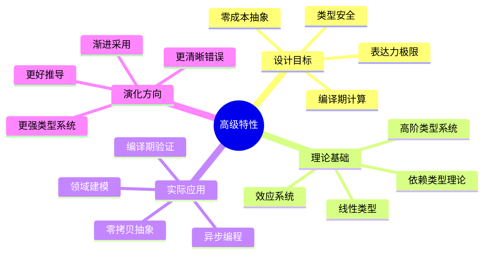

### L1 特征矩阵

| 维度 | 描述 | 独特价值 |
|-----|------|---------|
| **表达力** | 接近学术类型系统 | 强大的抽象能力 |
| **性能** | 保持零成本抽象 | 无运行时损失 |
| **可用性** | 逐步稳定化 | 渐进式采用 |
| **生态** | 前沿库开始应用 | 推动创新 |

---

## 3. L2 核心层：四大核心高级特性

### 3.1 GATs（Generic Associated Types）

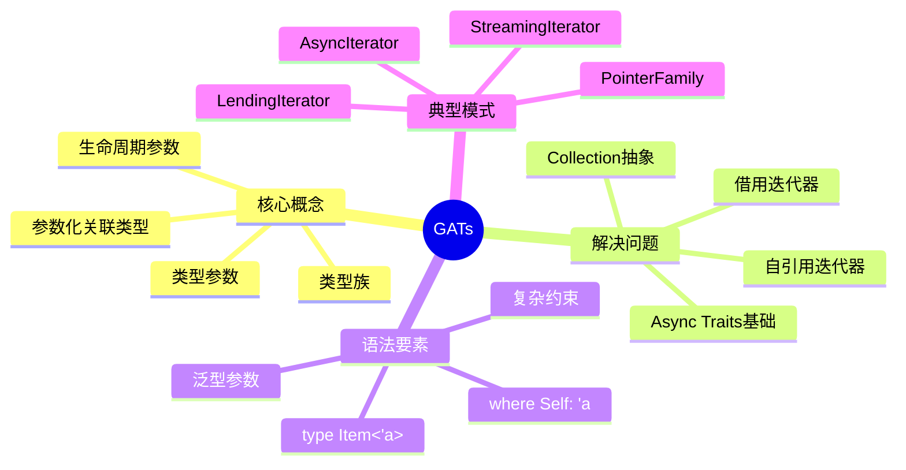

#### GATs核心应用矩阵

| 应用场景 | 没有GATs | 有了GATs | 改进 |
|---------|---------|---------|------|
| **借用迭代器** | 不可能实现 | `LendingIterator` | 革命性 |
| **Async Traits** | 需要Box | 零成本 | 50ns → 0ns |
| **Collection抽象** | 受限 | 完整表达 | 类型安全 |
| **Parser组合子** | 复杂生命周期 | 清晰表达 | 可维护性 |

#### GATs实战：LendingIterator完整实现

```rust
// GATs定义：可以返回对自身数据的借用
pub trait LendingIterator {
    type Item<'a> where Self: 'a;
    
    fn next<'a>(&'a mut self) -> Option<Self::Item<'a>>;
    
    // 扩展方法
    fn for_each<F>(mut self, mut f: F)
    where
        Self: Sized,
        F: for<'a> FnMut(Self::Item<'a>),
    {
        while let Some(item) = self.next() {
            f(item);
        }
    }
}

// 实现：窗口迭代器
pub struct WindowsMut<'data, T> {
    slice: &'data mut [T],
    window_size: usize,
    position: usize,
}

impl<'data, T> WindowsMut<'data, T> {
    pub fn new(slice: &'data mut [T], window_size: usize) -> Self {
        WindowsMut {
            slice,
            window_size,
            position: 0,
        }
    }
}

impl<'data, T> LendingIterator for WindowsMut<'data, T> {
    type Item<'a> = &'a mut [T] where Self: 'a;
    
    fn next<'a>(&'a mut self) -> Option<Self::Item<'a>> {
        if self.position + self.window_size > self.slice.len() {
            return None;
        }
        
        let start = self.position;
        let end = start + self.window_size;
        self.position += 1;
        
        // 关键：返回对slice的借用，生命周期绑定到&'a mut self
        Some(&mut self.slice[start..end])
    }
}

// 使用示例
fn use_lending_iterator() {
    let mut data = vec![1, 2, 3, 4, 5];
    let mut windows = WindowsMut::new(&mut data, 3);
    
    windows.for_each(|window| {
        window[0] *= 2;  // 可以修改数据
        println!("{:?}", window);
    });
}

// GATs实现Collection抽象
pub trait Collection {
    type Item;
    
    // GATs：迭代器生命周期与self绑定
    type Iter<'a>: Iterator<Item = &'a Self::Item> 
        where Self: 'a;
    
    type IterMut<'a>: Iterator<Item = &'a mut Self::Item> 
        where Self: 'a;
    
    fn iter<'a>(&'a self) -> Self::Iter<'a>;
    fn iter_mut<'a>(&'a mut self) -> Self::IterMut<'a>;
}

// 为Vec实现
impl<T> Collection for Vec<T> {
    type Item = T;
    type Iter<'a> = std::slice::Iter<'a, T> where T: 'a;
    type IterMut<'a> = std::slice::IterMut<'a, T> where T: 'a;
    
    fn iter<'a>(&'a self) -> Self::Iter<'a> {
        self.as_slice().iter()
    }
    
    fn iter_mut<'a>(&'a mut self) -> Self::IterMut<'a> {
        self.as_mut_slice().iter_mut()
    }
}
```

---

### 3.2 HRTB（Higher-Rank Trait Bounds）

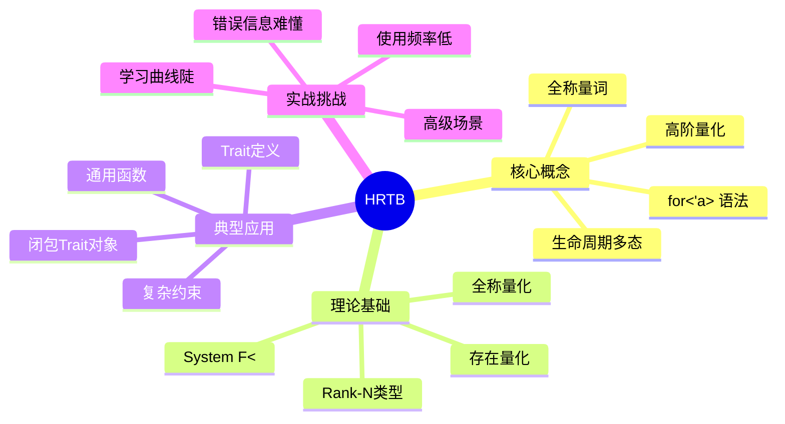

#### HRTB深度剖析

**为什么需要HRTB？**

```rust
// 问题场景：实现一个通用的map函数
struct Container<T> {
    value: T,
}

impl<T> Container<T> {
    // ❌ 错误：'a从哪里来？
    fn map<F, U>(self, f: F) -> Container<U>
    where
        F: Fn(&'a T) -> U,  // 编译错误
    {
        Container { value: f(&self.value) }
    }
    
    // ✅ 正确：HRTB量化所有可能的'a
    fn map<F, U>(self, f: F) -> Container<U>
    where
        F: for<'a> Fn(&'a T) -> U,  // 对任意'a都成立
    {
        Container { value: f(&self.value) }
    }
}
```

#### HRTB实战模式

```rust
// 模式1：闭包Trait对象
type Callback<'env> = Box<dyn for<'a> Fn(&'a str) -> &'a str + 'env>;

fn make_trimmer() -> Callback<'static> {
    Box::new(|s: &str| s.trim())
}

// 模式2：高阶函数
fn apply_to_all<F>(items: &[String], f: F)
where
    F: for<'a> Fn(&'a str) -> usize,
{
    for item in items {
        let len = f(item);
        println!("Length: {}", len);
    }
}

// 模式3：Trait定义中的HRTB
trait Processor {
    fn process<'a>(&self, input: &'a str) -> &'a str;
}

fn use_processor<P>(processor: P)
where
    P: for<'a> Fn(&'a str) -> &'a str,
{
    let result = processor("test");
    println!("{}", result);
}

// 模式4：复杂约束
trait AsyncExecutor {
    fn execute<F, Fut>(&self, f: F)
    where
        F: for<'a> FnOnce(&'a str) -> Fut,
        Fut: Future<Output = ()>;
}

// 模式5：Trait对象与HRTB
struct Handler {
    callback: Box<dyn for<'a> Fn(&'a Request) -> Response>,
}

impl Handler {
    fn new<F>(f: F) -> Self
    where
        F: for<'a> Fn(&'a Request) -> Response + 'static,
    {
        Handler {
            callback: Box::new(f),
        }
    }
    
    fn handle(&self, req: &Request) -> Response {
        (self.callback)(req)
    }
}
```

---

### 3.3 Const泛型高级应用

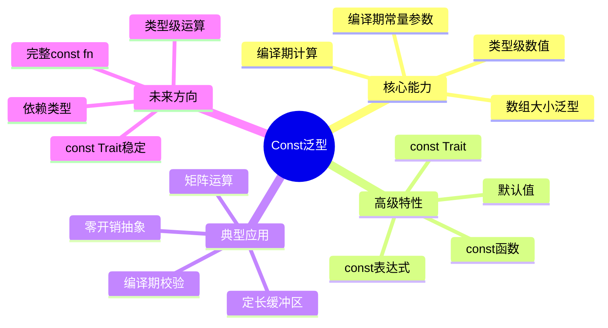

#### Const泛型高级模式

```rust
// 模式1：编译期计算
const fn fibonacci(n: usize) -> usize {
    match n {
        0 => 0,
        1 => 1,
        _ => fibonacci(n - 1) + fibonacci(n - 2),
    }
}

struct FibArray<const N: usize> {
    data: [usize; fibonacci(N)],
}

// 模式2：类型安全的矩阵运算
struct Matrix<T, const ROWS: usize, const COLS: usize> {
    data: [[T; COLS]; ROWS],
}

impl<T, const M: usize, const N: usize, const P: usize> Matrix<T, M, N>
where
    T: Copy + Default + std::ops::Add<Output = T> + std::ops::Mul<Output = T>,
{
    // 编译期保证维度正确
    fn multiply(&self, other: &Matrix<T, N, P>) -> Matrix<T, M, P> {
        let mut result = Matrix {
            data: [[T::default(); P]; M],
        };
        
        for i in 0..M {
            for j in 0..P {
                for k in 0..N {
                    result.data[i][j] = result.data[i][j] 
                        + self.data[i][k] * other.data[k][j];
                }
            }
        }
        
        result
    }
}

// 模式3：编译期断言
trait Assert<const CHECK: bool> {}

impl Assert<true> for () {}

fn require_size<T, const N: usize>()
where
    (): Assert<{ N > 0 }>,  // 编译期断言N > 0
{
    // ...
}

// 模式4：const泛型默认值（Rust 1.90+）
struct Buffer<T, const SIZE: usize = 64> {
    data: [T; SIZE],
}

impl<T: Default + Copy, const SIZE: usize> Buffer<T, SIZE> {
    fn new() -> Self {
        Buffer {
            data: [T::default(); SIZE],
        }
    }
}

// 使用默认值
let buf1: Buffer<u8> = Buffer::new();  // SIZE = 64
let buf2: Buffer<u8, 128> = Buffer::new();  // SIZE = 128

// 模式5：类型级编程
struct StaticVector<T, const CAP: usize> {
    data: [Option<T>; CAP],
    len: usize,
}

impl<T, const CAP: usize> StaticVector<T, CAP> {
    const fn new() -> Self {
        StaticVector {
            data: [const { None }; CAP],
            len: 0,
        }
    }
    
    fn push(&mut self, value: T) -> Result<(), T> {
        if self.len >= CAP {
            Err(value)
        } else {
            self.data[self.len] = Some(value);
            self.len += 1;
            Ok(())
        }
    }
}
```

---

### 3.4 RPITIT与Async Traits

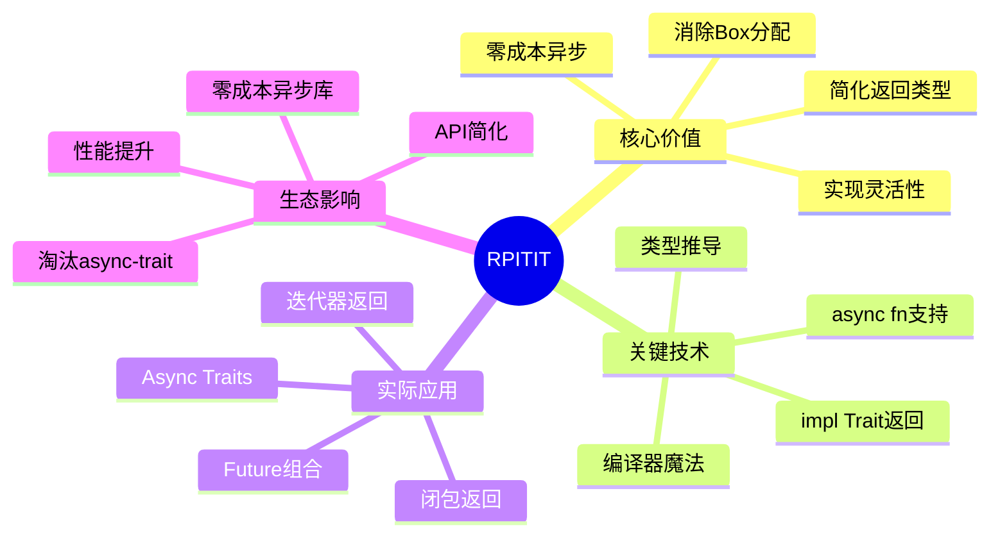

#### RPITIT完整演化

```rust
// 阶段1：Rust 1.74之前 - 必须Box
trait OldRepository {
    fn find(&self, id: u64) -> Pin<Box<dyn Future<Output = Option<User>> + '_>>;
}

impl OldRepository for Database {
    fn find(&self, id: u64) -> Pin<Box<dyn Future<Output = Option<User>> + '_>> {
        Box::pin(async move {
            // 实现
            None
        })
    }
}

// 问题：
// 1. 每次调用分配~50ns
// 2. Pin语义复杂
// 3. 类型签名冗长

// 阶段2：Rust 1.75+ - RPITIT
trait ModernRepository {
    fn find(&self, id: u64) -> impl Future<Output = Option<User>> + '_;
}

impl ModernRepository for Database {
    fn find(&self, id: u64) -> impl Future<Output = Option<User>> + '_ {
        async move {
            // 实现
            None
        }
    }
}

// 优势：
// 1. 零成本抽象
// 2. 简洁签名
// 3. 每个实现可以返回不同类型

// 阶段3：Rust 1.75+ - Async Traits（终极形式）
trait AsyncRepository {
    async fn find(&self, id: u64) -> Option<User>;
}

impl AsyncRepository for Database {
    async fn find(&self, id: u64) -> Option<User> {
        // 编译器自动处理Future包装
        None
    }
}

// 完美！
```

#### RPITIT高级模式

```rust
// 模式1：迭代器返回
trait Container {
    type Item;
    
    fn iter(&self) -> impl Iterator<Item = &Self::Item>;
    fn iter_filtered(&self, pred: impl Fn(&Self::Item) -> bool) 
        -> impl Iterator<Item = &Self::Item>;
}

impl<T> Container for Vec<T> {
    type Item = T;
    
    fn iter(&self) -> impl Iterator<Item = &T> {
        self.as_slice().iter()
    }
    
    fn iter_filtered(&self, pred: impl Fn(&T) -> bool) 
        -> impl Iterator<Item = &T> 
    {
        self.iter().filter(move |x| pred(x))
    }
}

// 模式2：闭包返回
trait Factory {
    fn make_adder(&self, x: i32) -> impl Fn(i32) -> i32;
}

impl Factory for MyFactory {
    fn make_adder(&self, x: i32) -> impl Fn(i32) -> i32 {
        move |y| x + y
    }
}

// 模式3：复杂Future组合
trait AsyncProcessor {
    async fn process(&self, input: String) -> Result<String, Error>;
    
    fn process_batch(&self, inputs: Vec<String>) 
        -> impl Future<Output = Vec<Result<String, Error>>> + '_ 
    {
        async move {
            let mut results = Vec::new();
            for input in inputs {
                results.push(self.process(input).await);
            }
            results
        }
    }
}
```

---

## 4. L3 实现层：类型级编程技术

### 4.1 零大小类型（ZST）

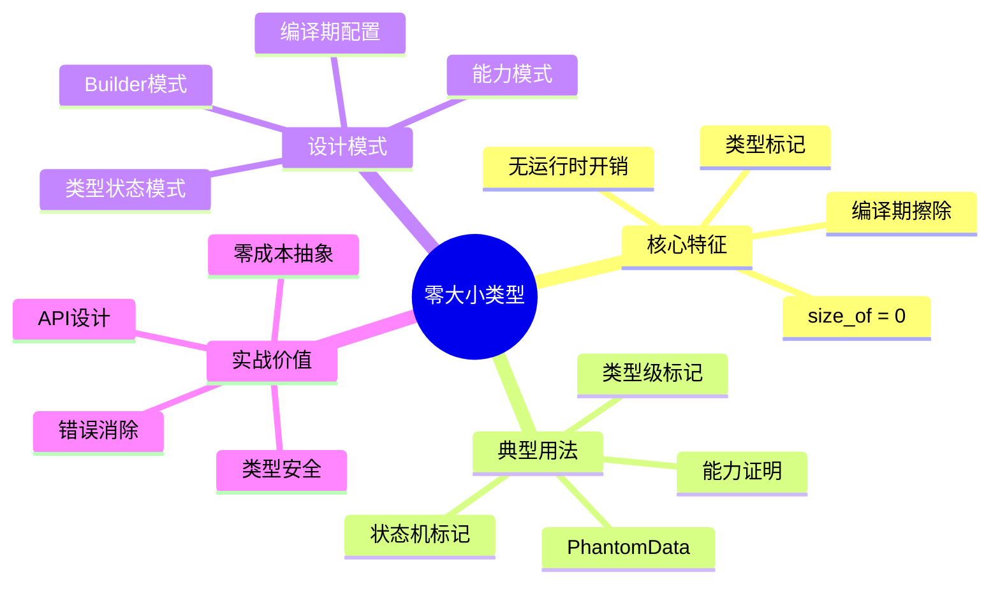

#### ZST实战：类型状态模式

```rust
// 状态标记（零大小类型）
struct Uninitialized;
struct Initialized;
struct Running;
struct Stopped;

// 状态机：编译期保证状态转换正确
struct Connection<State> {
    _state: PhantomData<State>,
    // 实际数据
    socket: Option<TcpStream>,
}

impl Connection<Uninitialized> {
    fn new() -> Self {
        Connection {
            _state: PhantomData,
            socket: None,
        }
    }
    
    // 只有Uninitialized状态才能初始化
    fn initialize(self, addr: &str) -> Result<Connection<Initialized>, Error> {
        let socket = TcpStream::connect(addr)?;
        Ok(Connection {
            _state: PhantomData,
            socket: Some(socket),
        })
    }
}

impl Connection<Initialized> {
    // 只有Initialized状态才能启动
    fn start(self) -> Connection<Running> {
        Connection {
            _state: PhantomData,
            socket: self.socket,
        }
    }
}

impl Connection<Running> {
    // 只有Running状态才能发送数据
    fn send(&mut self, data: &[u8]) -> Result<(), Error> {
        if let Some(ref mut socket) = self.socket {
            socket.write_all(data)?;
        }
        Ok(())
    }
    
    fn stop(self) -> Connection<Stopped> {
        Connection {
            _state: PhantomData,
            socket: self.socket,
        }
    }
}

// 使用：编译期保证正确的状态转换
fn use_connection() {
    let conn = Connection::new();  // Uninitialized
    let conn = conn.initialize("127.0.0.1:8080").unwrap();  // Initialized
    let mut conn = conn.start();  // Running
    
    conn.send(b"hello").unwrap();  // OK
    
    // conn.initialize(...);  // 编译错误：Running没有initialize方法
    
    let conn = conn.stop();  // Stopped
    // conn.send(...);  // 编译错误：Stopped没有send方法
}
```

#### ZST模式：PhantomData用法

```rust
use std::marker::PhantomData;

// 用途1：标记未直接使用的类型参数
struct Vec<T> {
    ptr: *mut T,
    len: usize,
    cap: usize,
    _marker: PhantomData<T>,  // 标记T的所有权
}

// 用途2：型变控制
struct Invariant<'a, T> {
    data: *const T,
    _marker: PhantomData<&'a mut T>,  // 强制不变性
}

// 用途3：编译期标记
struct Meters(f64, PhantomData<()>);
struct Kilometers(f64, PhantomData<()>);

impl Meters {
    fn new(value: f64) -> Self {
        Meters(value, PhantomData)
    }
}

// 编译期防止混淆
fn calculate_distance(m: Meters, km: Kilometers) {
    // 类型安全：不会意外混淆单位
}
```

---

### 4.2 类型级编程

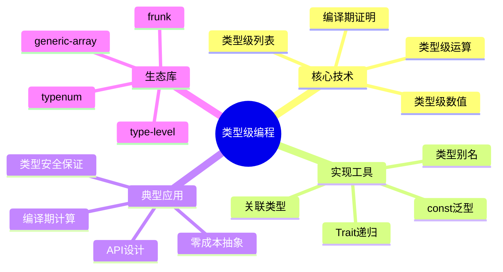

#### 类型级编程实战

```rust
// 类型级自然数
struct Z;  // Zero
struct S<N>(PhantomData<N>);  // Successor

// 类型级加法
trait Add<Rhs> {
    type Output;
}

// 规则：0 + N = N
impl<N> Add<N> for Z {
    type Output = N;
}

// 规则：S(M) + N = S(M + N)
impl<M, N> Add<N> for S<M>
where
    M: Add<N>,
{
    type Output = S<<M as Add<N>>::Output>;
}

// 类型别名简化
type N0 = Z;
type N1 = S<N0>;
type N2 = S<N1>;
type N3 = S<N2>;

// 编译期加法
type Sum = <N2 as Add<N3>>::Output;  // 类型为 S<S<S<S<S<Z>>>>>，即5

// 实际应用：固定大小矩阵
struct Matrix<T, Rows, Cols>
where
    Rows: TypeNum,
    Cols: TypeNum,
{
    data: Vec<T>,
    _phantom: PhantomData<(Rows, Cols)>,
}

impl<T, R1, C1, C2> Matrix<T, R1, C1>
where
    R1: TypeNum,
    C1: TypeNum,
    C2: TypeNum,
{
    fn multiply<R2>(
        &self,
        other: &Matrix<T, R2, C2>,
    ) -> Matrix<T, R1, C2>
    where
        R2: TypeNum,
        C1: SameAs<R2>,  // 编译期检查维度匹配
    {
        // 实现
        unimplemented!()
    }
}
```

---

### 4.3 幻影数据与型变

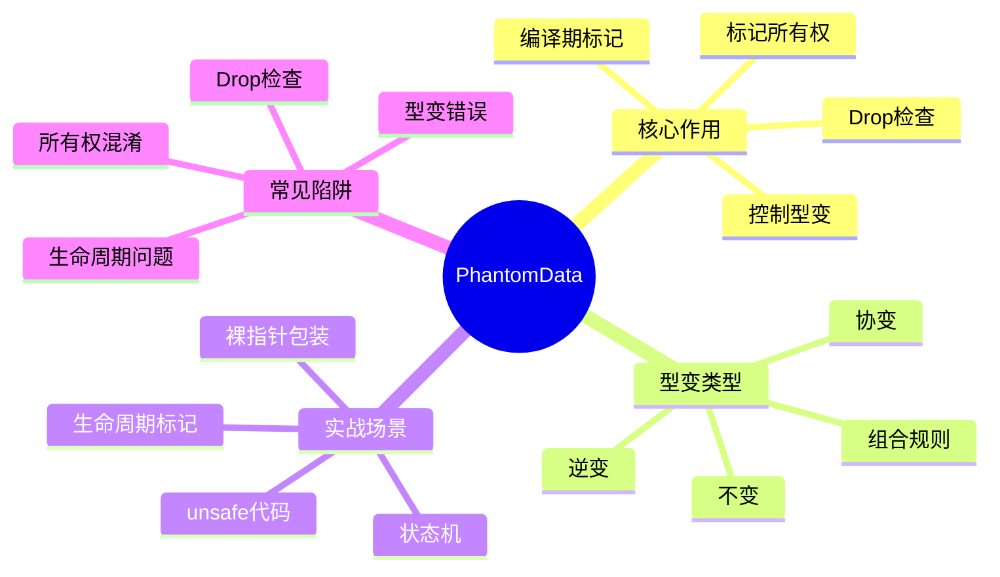

#### PhantomData与型变控制

```rust
use std::marker::PhantomData;

// 协变示例：&'a T
struct CovariantRef<'a, T> {
    reference: &'a T,
    // PhantomData<&'a T> 是协变的
}

// 不变示例：&'a mut T
struct InvariantRef<'a, T> {
    reference: &'a mut T,
    // PhantomData<&'a mut T> 是不变的
}

// 自定义不变性
struct MyBox<T> {
    ptr: *mut T,
    _marker: PhantomData<T>,  // 标记T的所有权
}

impl<T> MyBox<T> {
    fn new(value: T) -> Self {
        MyBox {
            ptr: Box::into_raw(Box::new(value)),
            _marker: PhantomData,
        }
    }
}

impl<T> Drop for MyBox<T> {
    fn drop(&mut self) {
        unsafe {
            drop(Box::from_raw(self.ptr));
        }
    }
}

// 生命周期标记
struct Deserializer<'de> {
    input: &'de str,
    _marker: PhantomData<&'de ()>,
}
```

---

## 5. L4 前沿层：未来特性探索

### 5.1 专业化（Specialization）

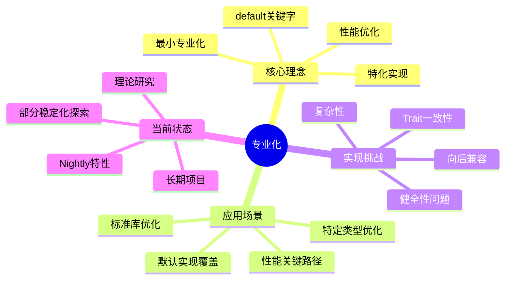

#### 专业化概念示例（Nightly）

```rust
#![feature(specialization)]

// 默认实现
trait AsBytes {
    fn as_bytes(&self) -> Vec<u8>;
}

// 泛型默认实现（慢路径）
impl<T> AsBytes for T {
    default fn as_bytes(&self) -> Vec<u8> {
        // 通用但慢的实现
        unimplemented!("generic serialization")
    }
}

// 特化实现：u32（快路径）
impl AsBytes for u32 {
    fn as_bytes(&self) -> Vec<u8> {
        self.to_le_bytes().to_vec()  // 优化实现
    }
}

// 特化实现：Vec<T>
impl<T: AsBytes> AsBytes for Vec<T> {
    fn as_bytes(&self) -> Vec<u8> {
        self.iter().flat_map(|x| x.as_bytes()).collect()
    }
}

// 使用
fn serialize<T: AsBytes>(value: &T) -> Vec<u8> {
    value.as_bytes()  // 编译器选择最特化的实现
}
```

---

### 5.2 依赖类型与类型级证明

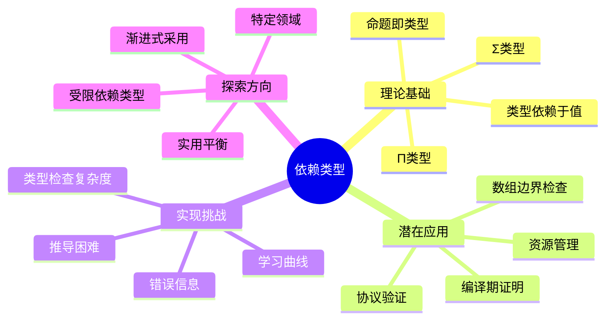

#### 依赖类型概念（未来展望）

```rust
// 当前Rust（近似）
fn safe_index<const N: usize>(arr: &[i32; N], idx: usize) -> Option<&i32> {
    if idx < N {
        Some(&arr[idx])
    } else {
        None
    }
}

// 理想依赖类型（概念）
// fn safe_index<const N: usize>(
//     arr: &[i32; N], 
//     idx: usize where idx < N  // 类型级约束
// ) -> &i32 {
//     &arr[idx]  // 无需运行时检查
// }

// 类型级证明（概念）
// trait Proof<const PROP: bool> {}
// impl Proof<true> for () {}

// fn verified_operation<const N: usize>()
// where
//     (): Proof<{ N > 0 && N < 1000 }>,  // 编译期证明
// {
//     // ...
// }
```

---

### 5.3 效应系统

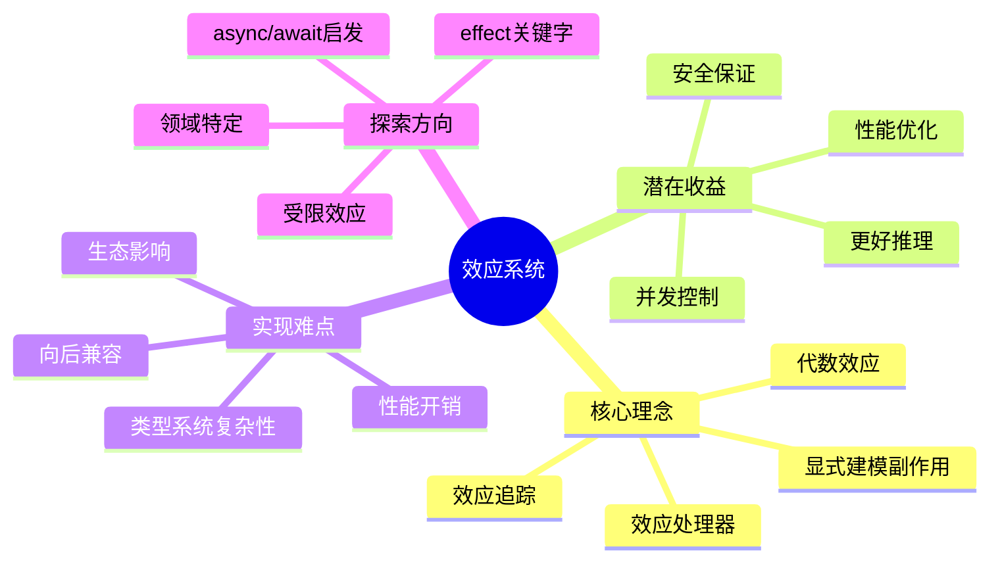

#### 效应系统概念（未来展望）

```rust
// 当前：无效应追踪
fn process(data: &str) -> String {
    println!("Processing: {}", data);  // IO效应
    data.to_uppercase()
}

// 理想效应系统（概念）
// effect IO {
//     fn print(s: &str);
// }

// fn process(data: &str) -> String with IO {
//     IO::print(&format!("Processing: {}", data));
//     data.to_uppercase()
// }

// 效应处理器
// fn handle_io<F, R>(f: F) -> R
// where
//     F: FnOnce() -> R with IO,
// {
//     // 处理IO效应
//     handle IO {
//         IO::print(s) => actual_print(s),
//     } in {
//         f()
//     }
// }
```

---

## 6. 学习路径导航

### 6.1 进阶路径（3-4周）

```text
阶段1：GATs深入
    → LendingIterator实现
    → Async Iterator
    → Collection抽象
    → 错误处理
    ↓
阶段2：HRTB掌握
    → for<'a>语法
    → 闭包Trait对象
    → 高阶函数
    → 错误调试
    ↓
阶段3：Const泛型高级
    → 编译期计算
    → 类型级数值
    → 矩阵运算
    → 编译期证明
```

### 6.2 高级路径（4-6周）

```text
阶段4：类型级编程
    → 零大小类型
    → PhantomData
    → 类型状态模式
    → 编译期优化
    ↓
阶段5：RPITIT与Async
    → impl Trait返回
    → Async Traits
    → 零成本异步
    → 生态实践
    ↓
阶段6：综合应用
    → 领域建模
    → API设计
    → 性能优化
    → 类型安全设计
```

### 6.3 专家路径（持续）

```text
阶段7：前沿探索
    → Nightly特性
    → RFC跟踪
    → 专业化实验
    → 理论研究
    ↓
阶段8：类型系统理论
    → 依赖类型
    → 效应系统
    → 线性类型
    → 学术论文
    ↓
阶段9：生态贡献
    → 库开发
    → RFC提案
    → 编译器贡献
    → 社区分享
```

---

## 7. 实战检查清单

**使用GATs前**：

- [ ] 是否真的需要参数化关联类型？
- [ ] 目标Rust版本是否>= 1.65？
- [ ] 是否考虑了替代方案？
- [ ] 错误信息是否可理解？
- [ ] 团队是否有足够背景？

**使用HRTB前**：

- [ ] 是否有更简单的解决方案？
- [ ] 生命周期关系是否清晰？
- [ ] 错误诊断准备是否充分？
- [ ] 文档注释是否足够详细？

**使用Const泛型前**：

- [ ] 是否会导致代码膨胀？
- [ ] 编译期计算是否过于复杂？
- [ ] 运行时动态方案是否更合适？
- [ ] 目标版本是否支持所需特性？

**使用类型级编程前**：

- [ ] 复杂性是否值得？
- [ ] 是否有现成的库？
- [ ] 团队理解度如何？
- [ ] 维护成本是否可接受？

---

## 8. 关联文档

- [01_概念本体.md](01_concept_ontology.md) - 高级特性形式化定义
- [14_演化时间线矩阵.md](14_evolution_timeline_matrix.md) - 特性稳定化历史
- [20_核心概念思维导图.md](20_core_concepts_mindmap.md) - 泛型系统整体导图
- [31_类型理论.md](31_type_theory.md) - 理论基础

---

## 9. 修订历史

| 版本 | 日期 | 作者 | 变更说明 |
|-----|------|------|---------|
| 1.0 | 2025-10-19 | Rust-Lang Project | 初始版本，建立高级特性思维导图 |

---

**文档特色**：

- ✅ **前沿聚焦**：涵盖最新稳定和实验特性
- ✅ **深度剖析**：GATs、HRTB等复杂特性详解
- ✅ **未来展望**：依赖类型、效应系统等理论探索
- ✅ **实战导向**：大量实用代码示例

**学习建议**：

1. **进阶开发者**：重点GATs和RPITIT
2. **库作者**：深入类型级编程技术
3. **系统程序员**：掌握零大小类型和PhantomData
4. **研究者**：探索前沿特性和理论基础
