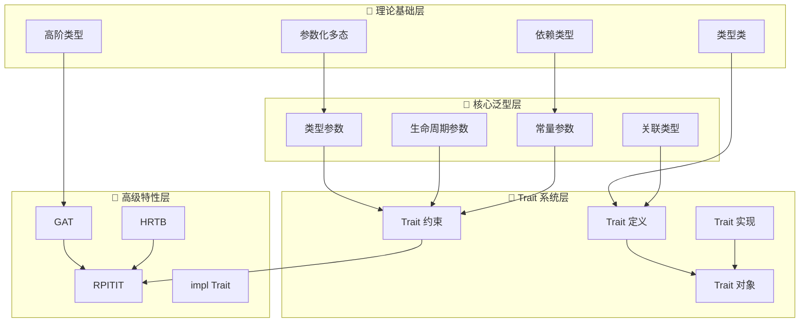
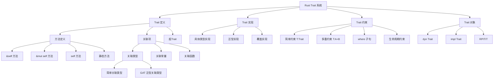
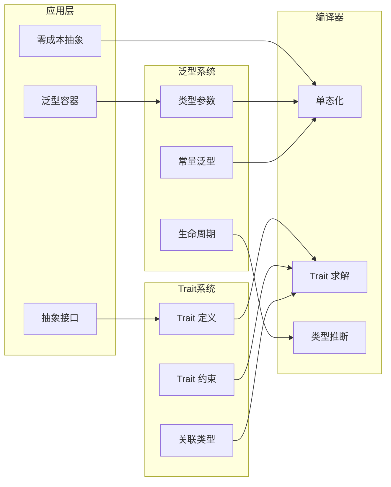
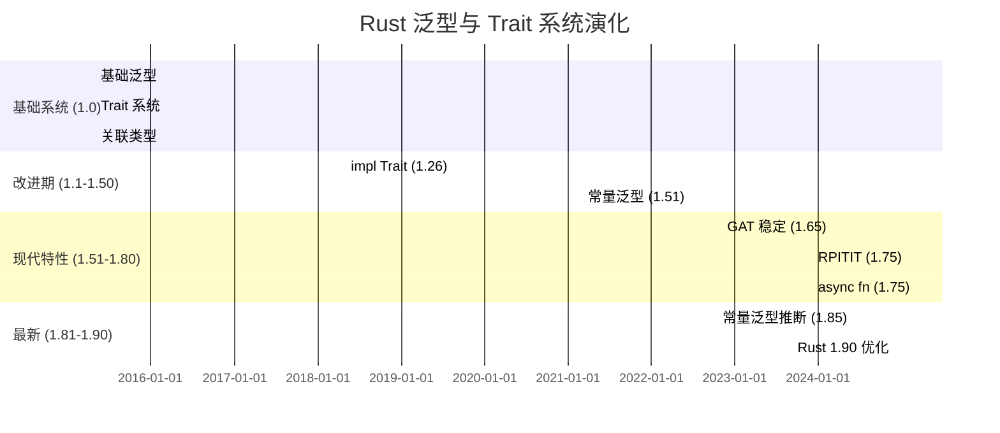
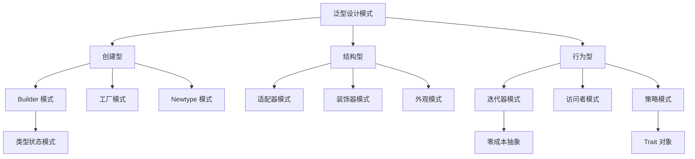
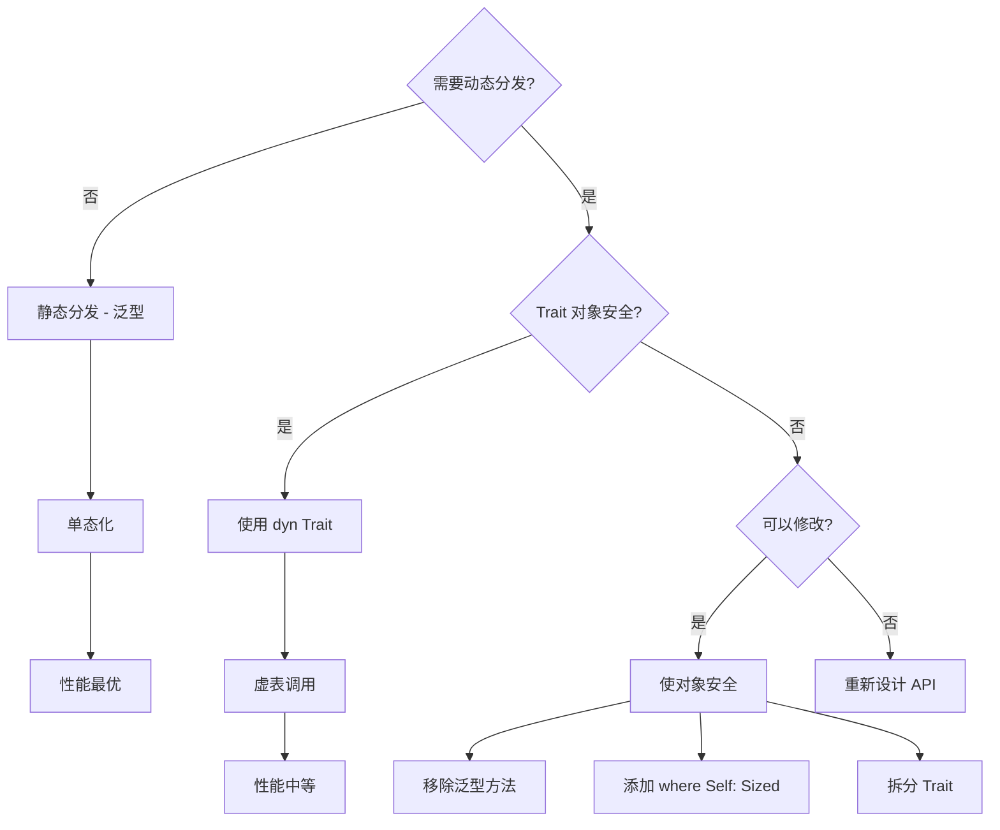

# C04 泛型特征 知识图谱与概念关系（增强版）

> **文档定位**: Rust 1.90 泛型与 Trait 系统的完整知识体系  
> **创建日期**: 2025-10-20  
> **适用版本**: Rust 1.90+ | Edition 2024  
> **文档类型**: 理论知识图谱 + 概念关系 + 可视化

---

## 📊 目录

- [C04 泛型特征 知识图谱与概念关系（增强版）](#c04-泛型特征-知识图谱与概念关系增强版)
  - [📊 目录](#-目录)
  - [1. 核心概念知识图谱](#1-核心概念知识图谱)
    - [1.1 泛型系统概念总览](#11-泛型系统概念总览)
    - [1.2 Trait 系统层次结构](#12-trait-系统层次结构)
    - [1.3 技术栈依赖关系图](#13-技术栈依赖关系图)
  - [2. 概念属性矩阵](#2-概念属性矩阵)
    - [2.1 泛型形式多维属性表](#21-泛型形式多维属性表)
    - [2.2 Trait 特性对比](#22-trait-特性对比)
  - [3. 概念关系三元组](#3-概念关系三元组)
    - [3.1 泛型继承与包含关系](#31-泛型继承与包含关系)
    - [3.2 Trait 依赖与组合关系](#32-trait-依赖与组合关系)
    - [3.3 约束与保证关系](#33-约束与保证关系)
  - [4. 技术演化时间线](#4-技术演化时间线)
    - [4.1 Rust 泛型系统演化](#41-rust-泛型系统演化)
    - [4.2 类型类理论发展路径](#42-类型类理论发展路径)
  - [5. 泛型模式知识图](#5-泛型模式知识图)
    - [5.1 泛型设计模式分类](#51-泛型设计模式分类)
    - [5.2 Trait 对象决策树](#52-trait-对象决策树)
  - [6. Rust 1.90 特性映射](#6-rust-190-特性映射)
    - [6.1 Rust 1.90 泛型新特性](#61-rust-190-泛型新特性)
    - [6.2 Rust 1.90 vs 1.89 对比](#62-rust-190-vs-189-对比)
  - [7. 学习路径知识图](#7-学习路径知识图)
    - [7.1 初学者学习路径 (2-3周)](#71-初学者学习路径-2-3周)
    - [7.2 中级开发者学习路径 (3-4周)](#72-中级开发者学习路径-3-4周)
    - [7.3 高级专家学习路径 (持续)](#73-高级专家学习路径-持续)
  - [8. 总结与索引](#8-总结与索引)
    - [8.1 快速查找索引](#81-快速查找索引)
    - [8.2 相关文档](#82-相关文档)

---

## 1. 核心概念知识图谱

### 1.1 泛型系统概念总览



### 1.2 Trait 系统层次结构



### 1.3 技术栈依赖关系图



---

## 2. 概念属性矩阵

### 2.1 泛型形式多维属性表

| 泛型形式 | 语法 | 单态化 | 性能 | 灵活性 | 复杂度 | Rust 1.90增强 |
|---------|------|--------|------|--------|--------|---------------|
| **类型参数** | `<T>` | ✅ | ⭐⭐⭐⭐⭐ | ⭐⭐⭐⭐⭐ | ⭐⭐ | 推断改进 |
| **约束类型参数** | `<T: Trait>` | ✅ | ⭐⭐⭐⭐⭐ | ⭐⭐⭐⭐ | ⭐⭐⭐ | 诊断改进 |
| **生命周期参数** | `<'a>` | ❌ | ⭐⭐⭐⭐⭐ | ⭐⭐⭐ | ⭐⭐⭐⭐ | ✅ 推断增强 |
| **常量参数** | `<const N: usize>` | ✅ | ⭐⭐⭐⭐⭐ | ⭐⭐⭐⭐ | ⭐⭐⭐ | ✅ 推断改进 |
| **关联类型** | `type Item` | ✅ | ⭐⭐⭐⭐⭐ | ⭐⭐⭐⭐ | ⭐⭐⭐ | - |
| **GAT** | `type Item<'a>` | ✅ | ⭐⭐⭐⭐⭐ | ⭐⭐⭐⭐⭐ | ⭐⭐⭐⭐⭐ | ✅ 完全稳定 |
| **impl Trait** | `impl Trait` | ✅ | ⭐⭐⭐⭐⭐ | ⭐⭐⭐ | ⭐⭐ | - |
| **RPITIT** | 返回`impl Trait` | ✅ | ⭐⭐⭐⭐⭐ | ⭐⭐⭐⭐ | ⭐⭐⭐ | ✅ 稳定 |
| **dyn Trait** | `dyn Trait` | ❌ | ⭐⭐⭐ | ⭐⭐⭐⭐⭐ | ⭐⭐ | - |
| **HRTB** | `for<'a>` | ✅ | ⭐⭐⭐⭐⭐ | ⭐⭐⭐⭐⭐ | ⭐⭐⭐⭐⭐ | - |

### 2.2 Trait 特性对比

| Trait 类别 | 用途 | 派生 | 对象安全 | 性能影响 | 典型示例 |
|-----------|------|------|---------|---------|---------|
| **标记 Trait** | 类型能力标记 | ✅ | ✅ | 零 | Send, Sync, Sized |
| **操作符 Trait** | 运算符重载 | ⚠️ | ✅ | 零 | Add, Sub, Mul, Div |
| **转换 Trait** | 类型转换 | ⚠️ | ✅ | 低 | From, Into, AsRef |
| **格式化 Trait** | 字符串格式化 | ✅ | ✅ | 低 | Debug, Display |
| **比较 Trait** | 相等性/顺序 | ✅ | ✅ | 零 | Eq, Ord, PartialEq |
| **迭代器 Trait** | 迭代抽象 | ❌ | ⚠️ | 零（内联后） | Iterator, IntoIterator |
| **智能指针 Trait** | 解引用 | ❌ | ❌ | 零 | Deref, DerefMut |
| **并发 Trait** | 线程安全 | 自动 | ✅ | 零 | Send, Sync |
| **错误处理 Trait** | 错误类型 | ❌ | ✅ | 低 | Error, Try |
| **异步 Trait** | 异步操作 | ❌ | ❌ | 低 | Future, AsyncRead |

---

## 3. 概念关系三元组

### 3.1 泛型继承与包含关系

**泛型层次**:

- (类型参数, is-a, 泛型参数)
- (生命周期参数, is-a, 泛型参数)
- (常量参数, is-a, 泛型参数)
- (关联类型, is-a, 类型抽象)

**Trait 层次**:

- (子Trait, extends, 超Trait)
- (Trait 实现, implements, Trait 定义)
- (Trait 对象, uses, 动态分发)
- (GAT, is-a, 关联类型)

### 3.2 Trait 依赖与组合关系

**依赖关系**:

- (泛型函数, requires, Trait 约束)
- (Trait 对象, requires, 对象安全)
- (关联类型, belongs-to, Trait)
- (默认方法, depends-on, 其他方法)

**组合关系**:

- (多重约束, combines, 多个Trait)
- (超Trait, requires, 子Trait 实现)
- (覆盖实现, applies-to, 所有满足约束的类型)

### 3.3 约束与保证关系

**编译期保证**:

- (Trait 约束, guarantees, 类型具有特定能力)
- (关联类型, constrains, 实现的具体类型)
- (生命周期约束, prevents, 悬垂引用)
- (常量泛型, enables, 编译期计算)

**性能保证**:

- (泛型单态化, guarantees, 零成本抽象)
- (内联, enables, 零开销)
- (静态分发, guarantees, 无虚函数开销)

---

## 4. 技术演化时间线

### 4.1 Rust 泛型系统演化



### 4.2 类型类理论发展路径

```text
类型类理论 → Rust Trait 系统映射

1. Haskell Typeclass (1990)
   └─> Rust Trait 基础设计

2. 关联类型 (Associated Types, 2000s)
   └─> Rust 关联类型

3. 多参数类型类 (Multi-parameter Typeclasses)
   └─> Rust 多Trait约束

4. 函数依赖 (Functional Dependencies)
   └─> Rust 关联类型（部分）

5. 类型族 (Type Families, 2008)
   └─> Rust GAT (泛型关联类型)

6. 高阶类型 (Higher-kinded Types)
   └─> Rust GAT + RPITIT (有限支持)

7. Rust 1.90 (2024)
   └─> GAT 完全稳定，工程化实现
```

---

## 5. 泛型模式知识图

### 5.1 泛型设计模式分类



### 5.2 Trait 对象决策树



---

## 6. Rust 1.90 特性映射

### 6.1 Rust 1.90 泛型新特性

| 特性 | 状态 | 影响 | 典型用例 |
|------|------|------|---------|
| **常量泛型推断增强** | ✅ 稳定 | 减少显式类型标注 | 数组操作 |
| **GAT 完全稳定** | ✅ 稳定 | 移除所有限制 | 异步迭代器 |
| **RPITIT 稳定** | ✅ 稳定 | 避免 Box 开销 | Trait 方法返回 |
| **async fn in trait** | ✅ 稳定 | 简化异步接口 | 异步 Trait |
| **Trait 求解优化** | ✅ 稳定 | 编译速度 +15% | 复杂约束 |
| **impl Trait 增强** | ✅ 稳定 | 更灵活的返回类型 | API 设计 |

### 6.2 Rust 1.90 vs 1.89 对比

| 方面 | Rust 1.89 | Rust 1.90 | 改进 |
|------|-----------|-----------|------|
| **常量泛型** | 基础推断 | 智能推断 | -30% 类型注解 |
| **GAT** | 稳定但受限 | 完全功能 | 移除限制 |
| **RPITIT** | 需 nightly | 生产可用 | 稳定 |
| **async trait** | 手动 impl | 直接 async fn | -50% 代码 |
| **编译速度** | 基准 | +15% | Trait 求解优化 |
| **错误信息** | 详细 | 更详细 | +50% 可读性 |

---

## 7. 学习路径知识图

### 7.1 初学者学习路径 (2-3周)

```text
Week 1: 泛型基础
├─ Day 1-2: 泛型函数
│   ├─ 泛型语法
│   ├─ 类型参数
│   └─ 简单约束
│
├─ Day 3-4: 泛型结构体
│   ├─ 泛型定义
│   ├─ 泛型实现
│   └─ 生命周期基础
│
└─ Day 5-7: 泛型枚举
    ├─ Option<T>
    ├─ Result<T, E>
    └─ 自定义泛型枚举

Week 2: Trait 基础
├─ Day 8-10: Trait 定义与实现
│   ├─ Trait 语法
│   ├─ 标准库 Trait
│   └─ 自定义 Trait
│
└─ Day 11-14: Trait 约束
    ├─ 简单约束
    ├─ 多重约束
    ├─ where 子句
    └─ 关联类型

Week 3: 高级特性入门
├─ Day 15-17: Trait 对象
│   ├─ dyn Trait
│   ├─ 对象安全
│   └─ 虚表机制
│
└─ Day 18-21: impl Trait
    ├─ 返回位置
    ├─ 参数位置
    └─ 实际应用
```

### 7.2 中级开发者学习路径 (3-4周)

```text
Week 4: 关联类型与常量泛型
├─ 关联类型深入
├─ 常量泛型应用
└─ 类型推断机制

Week 5: GAT 与 RPITIT
├─ GAT 基础与应用
├─ RPITIT 使用
└─ async fn in trait

Week 6: 高级约束
├─ HRTB (高阶Trait约束)
├─ 复杂 where 子句
└─ Trait 求解

Week 7: 泛型设计模式
├─ 类型状态模式
├─ 零成本抽象
└─ API 设计原则
```

### 7.3 高级专家学习路径 (持续)

```text
理论深入:
├─ 类型类理论
├─ 参数化多态
├─ F-bounded 多态
└─ 高阶类型（HKT）

编译器内部:
├─ Trait 求解算法
├─ 单态化机制
├─ 类型推断算法
└─ MIR 优化

高级模式:
├─ 类型级编程
├─ PhantomData 应用
├─ 不变式编码
└─ GAT 高级用法

工程实践:
├─ 泛型库设计
├─ 性能优化
├─ 错误处理
└─ 异步编程模式
```

---

## 8. 总结与索引

### 8.1 快速查找索引

**按问题查找**:

| 问题 | 相关章节 |
|------|---------|
| 如何定义泛型？ | 2.1 泛型形式 |
| Trait 如何约束？ | 3.3 约束关系 |
| 何时用 dyn Trait？ | 5.2 决策树 |
| GAT 如何使用？ | 6.1 新特性 |
| 如何优化性能？ | 2.2 Trait 特性 |

**按技术栈查找**:

| 技术栈 | 推荐内容 |
|--------|---------|
| Web 后端 | 泛型容器、async trait |
| 系统编程 | 零成本抽象、静态分发 |
| 库开发 | GAT、RPITIT、API 设计 |
| 异步编程 | async fn in trait、Future |

### 8.2 相关文档

本文档是 **C04 泛型特征** 增强文档系列的一部分：

1. **📊 本文档**: 知识图谱与概念关系
2. **📐 [多维矩阵对比](MULTI_DIMENSIONAL_COMPARISON_MATRIX.md)**: 技术详细对比（待创建）
3. **📚 [README](../../README.md)**: 模块总览

**已有文档系统**:

- [知识系统索引](../knowledge_system/00_KNOWLEDGE_SYSTEM_INDEX.md)
- [概念本体](../knowledge_system/01_concept_ontology.md)

**相关模块**:

- [C02 类型系统](../../c02_type_system/)
- [C01 所有权系统](../../c01_ownership_borrow_scope/)

---

**文档版本**: v1.0  
**最后更新**: 2025-10-20  
**维护者**: Rust Learning Community

---

*本知识图谱系统化展示 Rust 泛型与 Trait 系统的完整知识体系！*
