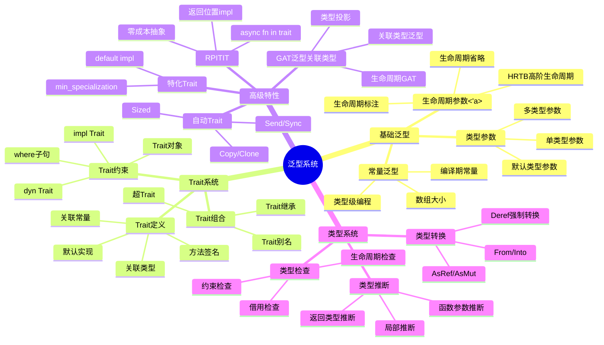
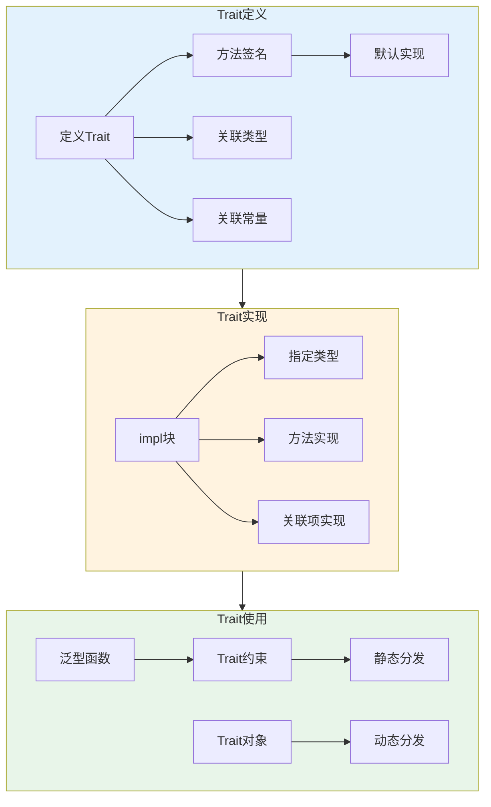
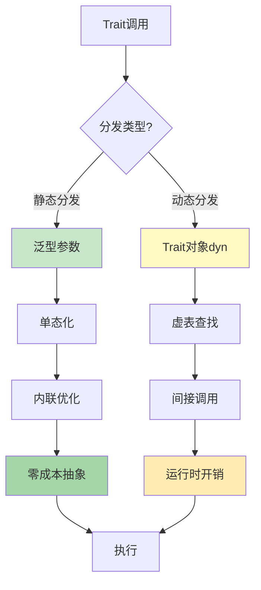
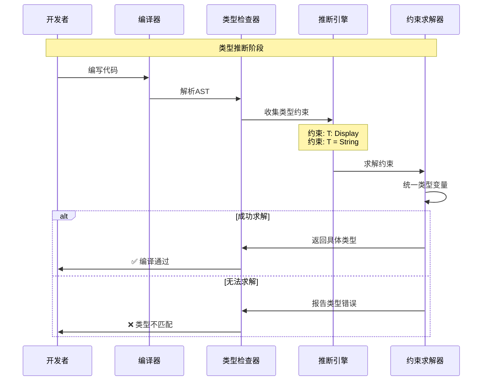
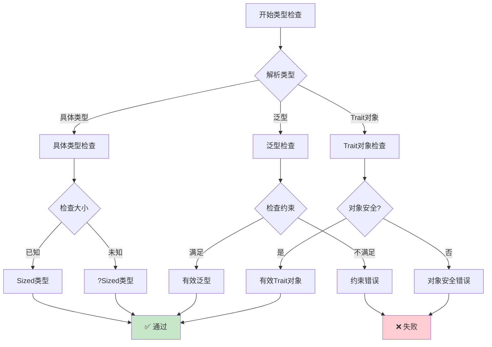
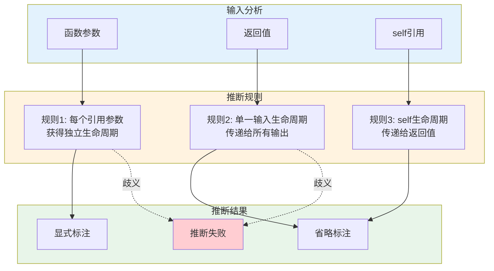
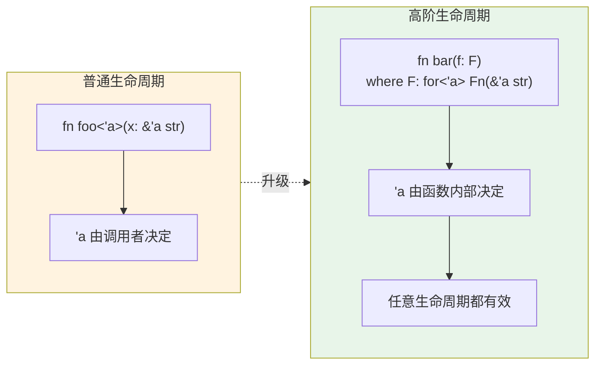
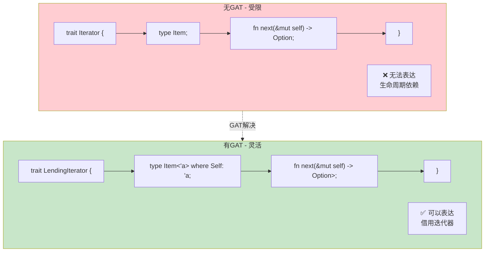
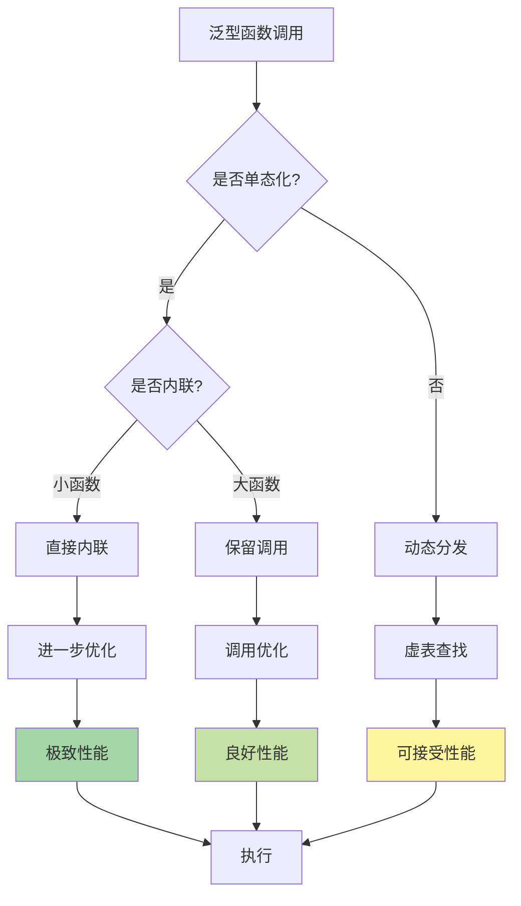
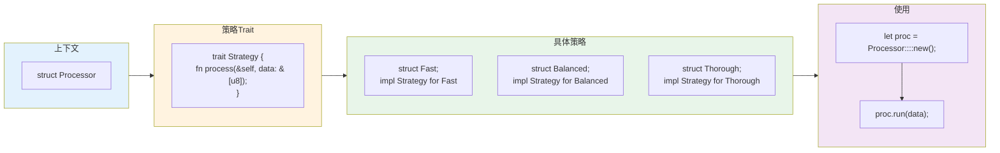

# C04 泛型特征 思维导图与可视化

> **文档定位**: Rust 1.90 泛型与Trait系统可视化学习  
> **创建日期**: 2025-10-20  
> **适用版本**: Rust 1.90+ | Edition 2024  
> **文档类型**: 思维导图 + 流程图 + 架构图

---

## 📊 目录

- [C04 泛型特征 思维导图与可视化](#c04-泛型特征-思维导图与可视化)
  - [📊 目录](#-目录)
  - [1. 泛型系统全景思维导图](#1-泛型系统全景思维导图)
    - [技术栈总览](#技术栈总览)
  - [2. Trait系统架构图](#2-trait系统架构图)
    - [Trait定义与实现流程](#trait定义与实现流程)
    - [Trait分发机制](#trait分发机制)
  - [3. 类型系统架构](#3-类型系统架构)
    - [类型推断流程](#类型推断流程)
    - [类型检查决策树](#类型检查决策树)
  - [4. 生命周期与泛型](#4-生命周期与泛型)
    - [生命周期推断流程](#生命周期推断流程)
    - [HRTB工作机制](#hrtb工作机制)
  - [5. 高级特性架构](#5-高级特性架构)
    - [GAT架构图](#gat架构图)
    - [RPITIT实现流程](#rpitit实现流程)
  - [6. 性能优化架构](#6-性能优化架构)
    - [单态化过程](#单态化过程)
    - [内联优化流程](#内联优化流程)
  - [7. 设计模式架构](#7-设计模式架构)
    - [Builder模式架构](#builder模式架构)
    - [Strategy模式架构](#strategy模式架构)
  - [相关文档](#相关文档)
  - [返回导航](#返回导航)

---

## 1. 泛型系统全景思维导图

### 技术栈总览



---

## 2. Trait系统架构图

### Trait定义与实现流程



### Trait分发机制



---

## 3. 类型系统架构

### 类型推断流程



### 类型检查决策树



---

## 4. 生命周期与泛型

### 生命周期推断流程



### HRTB工作机制



---

## 5. 高级特性架构

### GAT架构图



### RPITIT实现流程

```mermaid
sequenceDiagram
    participant Dev as 开发者
    participant Trait as Trait定义
    participant Impl as Impl块
    participant Compiler as 编译器
    participant Runtime as 运行时
    
    Note over Dev,Runtime: RPITIT (Return Position Impl Trait In Trait)
    
    Dev->>Trait: 定义返回impl Trait
    Note over Trait: trait Foo {<br/>  fn bar() -> impl Display;<br/>}
    
    Dev->>Impl: 实现具体类型
    Note over Impl: impl Foo for MyType {<br/>  fn bar() -> String {<br/>    String::from("hello")<br/>  }<br/>}
    
    Compiler->>Compiler: 单态化处理
    Note over Compiler: 每个实现生成<br/>专门的类型信息
    
    Compiler->>Runtime: 生成优化代码
    Note over Runtime: 零成本抽象<br/>静态分发
    
    Runtime-->>Dev: ✅ 高性能执行
```

---

## 6. 性能优化架构

### 单态化过程

```mermaid
graph LR
    subgraph Source [源代码]
        Generic["fn foo<T: Display>(x: T) {<br/>  println!(\"{}\", x);<br/>}"]
    end
    
    subgraph Calls [函数调用]
        Call1["foo(42_i32)"]
        Call2["foo(\"hello\")"]
        Call3["foo(3.14_f64)"]
    end
    
    subgraph Monomorphized [单态化结果]
        Inst1["fn foo_i32(x: i32) {<br/>  println!(\"{}\", x);<br/>}"]
        Inst2["fn foo_str(x: &str) {<br/>  println!(\"{}\", x);<br/>}"]
        Inst3["fn foo_f64(x: f64) {<br/>  println!(\"{}\", x);<br/>}"]
    end
    
    Generic --> Call1
    Generic --> Call2
    Generic --> Call3
    
    Call1 --> Inst1
    Call2 --> Inst2
    Call3 --> Inst3
    
    style Source fill:#e3f2fd
    style Calls fill:#fff3e0
    style Monomorphized fill:#c8e6c9
```

### 内联优化流程



---

## 7. 设计模式架构

### Builder模式架构

```mermaid
graph TB
    subgraph Client [客户端代码]
        C1["let config = ServerConfig::builder()"]
        C2[".host(\"localhost\")"]
        C3[".port(8080)"]
        C4[".build();"]
        C1 --> C2 --> C3 --> C4
    end
    
    subgraph Builder [Builder结构]
        B1["struct ServerConfigBuilder<Host, Port> {"]
        B2["  host: Host,"]
        B3["  port: Port,"]
        B4["}"]
        B1 --> B2 --> B3 --> B4
    end
    
    subgraph TypeState [类型状态]
        TS1["struct Unset;"]
        TS2["struct Set<T>(T);"]
        TS1 -.-> TS2
    end
    
    subgraph Result [结果类型]
        R1["struct ServerConfig {"]
        R2["  host: String,"]
        R3["  port: u16,"]
        R4["}"]
        R1 --> R2 --> R3 --> R4
    end
    
    Client --> Builder
    Builder --> TypeState
    TypeState --> Result
    
    style Client fill:#e3f2fd
    style Builder fill:#fff3e0
    style TypeState fill:#f3e5f5
    style Result fill:#c8e6c9
```

### Strategy模式架构



---

## 相关文档

- [知识图谱](./KNOWLEDGE_GRAPH_AND_CONCEPT_RELATIONS.md)
- [多维矩阵](./MULTI_DIMENSIONAL_COMPARISON_MATRIX.md)
- [知识系统](../knowledge_system/)
- [FAQ](../FAQ.md)

---

**文档版本**: v1.0  
**最后更新**: 2025-10-20  
**维护者**: Rust-lang项目组

---

## 返回导航

- [返回主索引](../00_MASTER_INDEX.md)
- [返回README](./README.md)
- [查看教程](../)
