# Trait 系统思维导图

## 📋 目录

- [Trait 系统思维导图](#trait-系统思维导图)
  - [📋 目录](#-目录)
  - [文档定位](#文档定位)
  - [1. 四层思维导图结构](#1-四层思维导图结构)
    - [1.1 整体架构](#11-整体架构)
  - [2. L1 领域层：Trait系统全景](#2-l1-领域层trait系统全景)
    - [L1 核心特征](#l1-核心特征)
  - [3. L2 核心层：Trait基础概念](#3-l2-核心层trait基础概念)
    - [3.1 Trait定义分支](#31-trait定义分支)
      - [详细展开：基础语法](#详细展开基础语法)
    - [3.2 Trait实现分支](#32-trait实现分支)
      - [详细展开：实现方式对比](#详细展开实现方式对比)
    - [3.3 Trait约束分支](#33-trait约束分支)
      - [约束位置对比](#约束位置对比)
    - [3.4 Trait对象分支](#34-trait对象分支)
      - [对象安全性规则](#对象安全性规则)
  - [4. L3 实现层：Trait机制](#4-l3-实现层trait机制)
    - [4.1 静态派发 vs 动态派发](#41-静态派发-vs-动态派发)
      - [性能对比矩阵](#性能对比矩阵)
    - [4.2 关联项系统](#42-关联项系统)
      - [关联类型 vs 泛型参数决策树](#关联类型-vs-泛型参数决策树)
    - [4.3 Trait组合模式](#43-trait组合模式)
      - [Trait继承实战](#trait继承实战)
  - [5. L4 高级层：现代Trait特性](#5-l4-高级层现代trait特性)
    - [5.1 GATs（Generic Associated Types）](#51-gatsgeneric-associated-types)
      - [GATs核心用例](#gats核心用例)
    - [5.2 RPITIT（Return Position impl Trait in Traits）](#52-rpititreturn-position-impl-trait-in-traits)
      - [RPITIT演化对比](#rpitit演化对比)
    - [5.3 特殊Trait类型](#53-特殊trait类型)
      - [标记Trait详解](#标记trait详解)
  - [6. 学习路径导航](#6-学习路径导航)
    - [6.1 初学者路径（1-2周）](#61-初学者路径1-2周)
    - [6.2 进阶路径（2-3周）](#62-进阶路径2-3周)
    - [6.3 高级路径（持续）](#63-高级路径持续)
  - [7. 关键决策点](#7-关键决策点)
    - [决策1：定义Trait还是用泛型？](#决策1定义trait还是用泛型)
    - [决策2：关联类型还是泛型参数？](#决策2关联类型还是泛型参数)
    - [决策3：静态还是动态派发？](#决策3静态还是动态派发)
  - [8. 实战检查清单](#8-实战检查清单)
  - [9. 关联文档](#9-关联文档)
  - [10. 修订历史](#10-修订历史)

## 文档定位

本文档提供**Trait系统的层次化可视结构**，通过思维导图形式：

- 展现Trait系统的完整知识架构
- 建立概念间的层次关系
- 提供结构化的学习路径

---

## 1. 四层思维导图结构

### 1.1 整体架构

```text
Trait系统（L1 Domain）
├── 核心概念层（L2 Core）
│   ├── Trait定义
│   ├── Trait实现
│   ├── Trait约束
│   └── Trait对象
│
├── 实现机制层（L3 Implementation）
│   ├── 静态派发
│   ├── 动态派发
│   ├── 关联项
│   └── 泛型组合
│
└── 高级特性层（L4 Advanced）
    ├── GATs
    ├── RPITIT
    ├── Trait别名
    └── 专业化（Future）
```

---

## 2. L1 领域层：Trait系统全景

```mermaid
mindmap
  root((Trait系统))
    核心理念
      接口抽象
      Ad-hoc多态
      零成本抽象
      静态派发优先
    
    设计目标
      类型安全
      性能保证
      扩展性
      组合能力
    
    理论基础
      Type Classes
      Haskell启发
      System F
      Trait Coherence
    
    实际应用
      标准库核心
      异步编程
      错误处理
      迭代器模式
```



### L1 核心特征

| 维度 | 描述 | 关键价值 |
|-----|------|---------|
| **哲学定位** | "行为抽象而非继承" | 组合优于继承 |
| **性能保证** | 单态化零开销 | 无运行时性能损失 |
| **类型安全** | 编译期完整检查 | 消除运行时错误 |
| **灵活性** | 为外部类型实现Trait | 开放扩展能力 |

---

## 3. L2 核心层：Trait基础概念

### 3.1 Trait定义分支

```mermaid
mindmap
  root((Trait定义))
    基础语法
      方法签名
      关联类型
      关联常量
      默认实现
    
    约束机制
      Self类型
      where子句
      Trait继承
      生命周期约束
    
    特殊Trait
      标记Trait
      自动Trait
      内置Trait
      派生Trait
    
    设计原则
      单一职责
      最小接口
      组合优先
      向后兼容
```



#### 详细展开：基础语法

```rust
trait MyTrait {
    // 1. 方法签名（必须实现）
    fn required_method(&self) -> i32;
    
    // 2. 默认实现（可覆盖）
    fn optional_method(&self) -> String {
        String::from("default")
    }
    
    // 3. 关联类型
    type AssociatedType;
    
    // 4. 关联常量
    const CONSTANT: usize;
    
    // 5. 静态方法
    fn static_method() -> Self;
}
```

**学习路径**：

1. 掌握基础方法定义
2. 理解默认实现的作用
3. 深入关联项的使用
4. 掌握Self类型的语义

---

### 3.2 Trait实现分支

```mermaid
mindmap
  root((Trait实现))
    实现方式
      为具体类型实现
      泛型实现
      条件实现
      blanket实现
    
    实现规则
      孤儿规则
      Trait一致性
      实现唯一性
      优先级规则
    
    实现模式
      新类型模式
      包装器模式
      扩展Trait
      Trait组合
    
    实现约束
      where子句
      生命周期约束
      关联类型约束
      const约束
```



#### 详细展开：实现方式对比

| 实现类型 | 语法 | 适用场景 | 灵活性 |
|---------|------|---------|--------|
| **具体类型** | `impl Trait for Type` | 为自有类型实现 | ⭐⭐ |
| **泛型实现** | `impl<T> Trait for Generic<T>` | 为泛型类型实现 | ⭐⭐⭐⭐ |
| **条件实现** | `impl<T: Bound> Trait for Type<T>` | 有条件的实现 | ⭐⭐⭐⭐⭐ |
| **blanket实现** | `impl<T: Trait1> Trait2 for T` | 为所有满足条件的类型 | ⭐⭐⭐⭐⭐ |

```rust
// 示例：不同实现方式
// 1. 具体类型
impl Display for MyStruct {
    fn fmt(&self, f: &mut Formatter) -> fmt::Result { /* ... */ }
}

// 2. 泛型实现
impl<T: Display> Display for Wrapper<T> {
    fn fmt(&self, f: &mut Formatter) -> fmt::Result {
        write!(f, "Wrapper({})", self.0)
    }
}

// 3. 条件实现
impl<T: Clone> Clone for MyBox<T> {
    fn clone(&self) -> Self { /* ... */ }
}

// 4. blanket实现（标准库模式）
impl<T: Display> ToString for T {
    fn to_string(&self) -> String {
        format!("{}", self)
    }
}
```

---

### 3.3 Trait约束分支

```mermaid
mindmap
  root((Trait约束))
    约束位置
      泛型参数约束
      where子句约束
      impl块约束
      关联类型约束
    
    约束类型
      单Trait约束
      多Trait约束
      生命周期约束
      高阶约束HRTB
    
    约束组合
      加法组合 T+U
      where子句
      Trait继承
      复合约束
    
    约束简化
      Trait别名
      impl Trait
      类型推导
      省略规则
```



#### 约束位置对比

```rust
// 位置1：内联约束
fn process<T: Clone + Debug>(item: T) {
    println!("{:?}", item);
}

// 位置2：where子句（复杂约束首选）
fn complex<T, U>(x: T, y: U) -> T
where
    T: Clone + Debug + PartialEq,
    U: Into<T>,
{
    // ...
}

// 位置3：impl块约束
impl<T> MyStruct<T>
where
    T: Clone + Debug,
{
    fn new(value: T) -> Self { /* ... */ }
}

// 位置4：关联类型约束
fn iterate<I>(iter: I)
where
    I: Iterator,
    I::Item: Display,  // 约束关联类型
{
    // ...
}
```

---

### 3.4 Trait对象分支

```mermaid
mindmap
  root((Trait对象))
    基础概念
      dyn Trait
      动态派发
      虚函数表
      类型擦除
    
    对象安全性
      安全条件
      Self限制
      泛型方法限制
      Sized约束
    
    使用场景
      运行时多态
      插件系统
      异构集合
      回调机制
    
    性能权衡
      虚函数开销
      堆分配成本
      缓存不友好
      灵活性收益
```



#### 对象安全性规则

**对象安全的Trait必须满足**：

```rust
// ✅ 对象安全
trait ObjectSafe {
    fn method(&self);  // self参数
    fn another(&mut self) -> i32;
}

// ❌ 非对象安全：返回Self
trait NotObjectSafe1 {
    fn clone_self(&self) -> Self;
}

// ❌ 非对象安全：泛型方法
trait NotObjectSafe2 {
    fn generic<T>(&self, x: T);
}

// ❌ 非对象安全：关联类型没有约束
trait NotObjectSafe3 {
    type Item;
    fn get(&self) -> Self::Item;
}

// ✅ 修复：使用where Self: Sized
trait Fixed {
    fn clone_self(&self) -> Self
    where
        Self: Sized;  // 禁止在Trait对象中调用
}
```

---

## 4. L3 实现层：Trait机制

### 4.1 静态派发 vs 动态派发

```mermaid
mindmap
  root((派发机制))
    静态派发
      单态化
      编译期确定
      零成本抽象
      代码膨胀
      内联优化
    
    动态派发
      虚函数表
      运行时查找
      类型擦除
      统一大小
      灵活性高
    
    选择标准
      性能要求
      类型数量
      二进制大小
      运行时多态需求
    
    混合策略
      核心路径静态
      边界动态
      智能指针
      枚举派发
```



#### 性能对比矩阵

| 维度 | 静态派发 `<T: Trait>` | 动态派发 `dyn Trait` |
|-----|---------------------|---------------------|
| **调用开销** | 0ns (内联) | 2-5ns (vtable查找) |
| **内存布局** | 按类型变化 | 固定大小指针 |
| **编译时间** | 较长（实例化） | 较短 |
| **二进制大小** | 较大（多份代码） | 较小 |
| **类型信息** | 保留 | 擦除 |
| **适用场景** | 性能关键 | 运行时多态 |

```rust
// 静态派发：性能最优
fn static_dispatch<T: Display>(item: &T) {
    println!("{}", item);  // 直接调用，可内联
}

// 动态派发：灵活但有开销
fn dynamic_dispatch(item: &dyn Display) {
    println!("{}", item);  // vtable查找
}

// 基准测试示例
use criterion::{black_box, criterion_group, Criterion};

fn bench_static(c: &mut Criterion) {
    c.bench_function("static", |b| {
        let x = 42i32;
        b.iter(|| static_dispatch(black_box(&x)));
    });
}

fn bench_dynamic(c: &mut Criterion) {
    c.bench_function("dynamic", |b| {
        let x: &dyn Display = &42i32;
        b.iter(|| dynamic_dispatch(black_box(x)));
    });
}

// 结果：static ~1ns, dynamic ~3ns
```

---

### 4.2 关联项系统

```mermaid
mindmap
  root((关联项))
    关联类型
      输出位置
      类型投影
      唯一性保证
      推导能力
    
    关联常量
      编译期常量
      类型信息
      配置参数
      元数据
    
    GATs
      类型族
      参数化关联类型
      生命周期灵活性
      高阶抽象
    
    设计模式
      迭代器模式
      Builder模式
      类型状态
      零大小类型
```



#### 关联类型 vs 泛型参数决策树

```text
需要类型关联？
    |
    ├─ 每个实现只有一种关联类型？
    |   └─ 是 → 关联类型
    |       trait Iterator { type Item; }
    |
    ├─ 需要为同一类型实现多次？
    |   └─ 是 → 泛型参数
    |       trait Into<T> { fn into(self) -> T; }
    |
    ├─ 类型参数是"输出"性质？
    |   └─ 是 → 关联类型
    |       trait Add { type Output; }
    |
    └─ 类型参数是"输入"性质？
        └─ 是 → 泛型参数
            trait From<T> { fn from(T) -> Self; }
```

---

### 4.3 Trait组合模式

```mermaid
mindmap
  root((Trait组合))
    继承组合
      Trait继承
      超Trait
      依赖链
      继承限制
    
    约束组合
      多Trait约束
      where子句
      关联类型约束
      生命周期组合
    
    实现组合
      Blanket实现
      条件实现
      扩展方法
      Adapter模式
    
    设计模式
      接口隔离
      迭代器链
      Error类型
      Async Trait栈
```



#### Trait继承实战

```rust
// 基础Trait
trait Shape {
    fn area(&self) -> f64;
}

// 继承Trait（超Trait）
trait Drawable: Shape {  // Drawable需要Shape
    fn draw(&self);
    
    fn draw_with_area(&self) {
        println!("Drawing shape with area {}", self.area());
    }
}

// 实现时必须同时实现Shape
impl Shape for Circle {
    fn area(&self) -> f64 { /* ... */ }
}

impl Drawable for Circle {
    fn draw(&self) { /* ... */ }
}

// 多重继承
trait Advanced: Shape + Drawable + Clone {
    fn transform(&mut self);
}
```

---

## 5. L4 高级层：现代Trait特性

### 5.1 GATs（Generic Associated Types）

```mermaid
mindmap
  root((GATs))
    核心能力
      参数化关联类型
      生命周期灵活性
      自引用结构
      类型族表达
    
    典型应用
      LendingIterator
      Async Traits
      Collection抽象
      Parser组合子
    
    语法要素
      type Item<'a>
      where Self: 'a
      高阶生命周期
      复杂约束
    
    实战挑战
      错误信息复杂
      学习曲线陡
      编译器压力
      生态建设中
```



#### GATs核心用例

```rust
// 用例1：LendingIterator（借用迭代器）
trait LendingIterator {
    type Item<'a> where Self: 'a;
    
    fn next<'a>(&'a mut self) -> Option<Self::Item<'a>>;
}

// 实现：窗口迭代器
struct WindowsMut<'data, T> {
    slice: &'data mut [T],
    window_size: usize,
    position: usize,
}

impl<'data, T> LendingIterator for WindowsMut<'data, T> {
    type Item<'a> = &'a mut [T] where Self: 'a;
    
    fn next<'a>(&'a mut self) -> Option<Self::Item<'a>> {
        if self.position + self.window_size > self.slice.len() {
            return None;
        }
        
        let start = self.position;
        let end = start + self.window_size;
        self.position += 1;
        
        // 关键：返回对自身数据的可变借用
        Some(&mut self.slice[start..end])
    }
}

// 用例2：Async Iterator
trait AsyncIterator {
    type Item;
    type Next<'a>: Future<Output = Option<Self::Item>> 
        where Self: 'a;
    
    fn next<'a>(&'a mut self) -> Self::Next<'a>;
}

// 用例3：Collection抽象
trait Collection {
    type Item;
    type Iter<'a>: Iterator<Item = &'a Self::Item> 
        where Self: 'a;
    
    fn iter<'a>(&'a self) -> Self::Iter<'a>;
}
```

---

### 5.2 RPITIT（Return Position impl Trait in Traits）

```mermaid
mindmap
  root((RPITIT))
    核心价值
      简化返回类型
      消除Box分配
      零成本异步
      实现灵活性
    
    语法形式
      impl Trait返回
      async fn支持
      类型推导
      实现自由度
    
    使用场景
      Async Traits
      迭代器返回
      闭包返回
      Future组合
    
    与旧方案对比
      无需async-trait宏
      零堆分配
      更好类型推导
      编译器原生支持
```



#### RPITIT演化对比

```rust
// ❌ 旧方案（Rust 1.74之前）
trait Repository {
    fn find(&self, id: u64) -> Pin<Box<dyn Future<Output = Option<User>> + '_>>;
    // 问题：
    // 1. 必须Box分配（~50ns开销）
    // 2. 类型签名复杂
    // 3. Pin语义复杂
}

// ✅ 新方案1：RPITIT（Rust 1.75+）
trait Repository {
    fn find(&self, id: u64) -> impl Future<Output = Option<User>> + '_;
    // 优势：
    // 1. 零开销抽象
    // 2. 简洁的签名
    // 3. 实现可以返回不同的Future类型
}

// ✅ 新方案2：Async Traits（Rust 1.75+）
trait Repository {
    async fn find(&self, id: u64) -> Option<User>;
    // 终极简洁：
    // 1. 编译器自动处理Future
    // 2. 零成本
    // 3. 完美的开发体验
}

// 性能对比
// 旧方案：find调用 = ~50ns (Box分配) + 实际逻辑
// 新方案：find调用 = 0ns + 实际逻辑（完全内联）
```

---

### 5.3 特殊Trait类型

```mermaid
mindmap
  root((特殊Trait))
    标记Trait
      Send
      Sync
      Sized
      Unpin
      Copy
    
    自动Trait
      编译器自动实现
      传递性
      结构化规则
      unsafe实现
    
    派生Trait
      #[derive]宏
      Clone
      Debug
      PartialEq
      自定义派生
    
    内置Trait
      Drop
      Deref
      Index
      操作符重载
```

#### 标记Trait详解

| Trait | 语义 | 自动实现条件 | 手动实现 |
|-------|------|------------|---------|
| **Send** | 可跨线程传递 | 所有字段都是Send | `unsafe impl` |
| **Sync** | 可跨线程共享引用 | 所有字段都是Sync | `unsafe impl` |
| **Sized** | 编译期已知大小 | 默认所有类型 | 不可手动实现 |
| **Unpin** | 可安全移动 | 几乎所有类型 | PhantomPinned否定 |
| **Copy** | 按位复制 | 所有字段都是Copy | 显式实现 |

```rust
// Send/Sync示例
struct MyStruct {
    data: Vec<i32>,  // Vec是Send+Sync
}
// MyStruct自动是Send+Sync

// 打破自动实现
use std::rc::Rc;
struct NotSend {
    data: Rc<i32>,  // Rc不是Send
}
// NotSend不是Send

// 手动实现（需要unsafe）
struct MyPointer(*mut i32);

unsafe impl Send for MyPointer {}  // 承诺线程安全
unsafe impl Sync for MyPointer {}
```

---

## 6. 学习路径导航

### 6.1 初学者路径（1-2周）

```text
阶段1：基础理解
    → Trait定义语法
    → 为自有类型实现Trait
    → 标准库常用Trait（Clone, Debug, Display）
    ↓
阶段2：Trait约束
    → 泛型函数约束
    → where子句
    → 多Trait约束
    ↓
阶段3：静态派发
    → impl Trait参数
    → impl Trait返回
    → 理解单态化
```

### 6.2 进阶路径（2-3周）

```text
阶段4：动态派发
    → dyn Trait理解
    → 对象安全性
    → Box<dyn Trait>使用
    ↓
阶段5：关联项
    → 关联类型应用
    → 关联常量
    → 关联类型 vs 泛型参数
    ↓
阶段6：Trait设计
    → Trait继承
    → Blanket实现
    → 新类型模式
```

### 6.3 高级路径（持续）

```text
阶段7：现代特性
    → GATs深入
    → RPITIT实战
    → Async Traits
    ↓
阶段8：类型系统理论
    → Type Classes理论
    → Trait一致性
    → 专业化（Future）
    ↓
阶段9：生态实践
    → 标准库Trait分析
    → 流行库设计模式
    → RFC跟踪
```

---

## 7. 关键决策点

### 决策1：定义Trait还是用泛型？

```text
需要多态？
    |
    ├─ 需要为外部类型添加行为 → Trait
    |
    ├─ 仅需代码复用 → 泛型函数
    |
    ├─ 需要运行时多态 → Trait对象
    |
    └─ 需要约束类型行为 → Trait约束
```

### 决策2：关联类型还是泛型参数？

参考 [L3.2 关联项系统](#42-关联项系统) 的决策树

### 决策3：静态还是动态派发？

参考 [L3.1 派发机制](#41-静态派发-vs-动态派发) 的性能对比矩阵

---

## 8. 实战检查清单

**设计Trait前**：

- [ ] Trait是否遵循单一职责原则？
- [ ] 是否考虑了对象安全性需求？
- [ ] 关联类型vs泛型参数的选择是否合理？
- [ ] 是否需要默认实现？
- [ ] 是否考虑了向后兼容性？

**实现Trait前**：

- [ ] 是否符合孤儿规则？
- [ ] 是否需要条件实现？
- [ ] 约束是否最小化？
- [ ] 是否考虑了blanket实现冲突？

**使用Trait前**：

- [ ] 静态还是动态派发？
- [ ] 性能是否满足要求？
- [ ] 错误信息是否清晰？
- [ ] 是否需要Trait对象？

---

## 9. 关联文档

- [01_概念本体.md](01_concept_ontology.md) - Trait概念形式化定义
- [02_关系网络.md](02_relationship_network.md) - Trait与其他概念的关系
- [10_Trait模式对比矩阵.md](10_trait_pattern_comparison_matrix.md) - Trait模式详细对比
- [20_核心概念思维导图.md](20_core_concepts_mindmap.md) - 泛型系统整体导图

---

## 10. 修订历史

| 版本 | 日期 | 作者 | 变更说明 |
|-----|------|------|---------|
| 1.0 | 2025-10-19 | Rust-Lang Project | 初始版本，建立Trait系统思维导图 |

---

**文档特色**：

- ✅ **四层结构**：从领域到细节的清晰层次
- ✅ **可视化**：大量Mermaid思维导图
- ✅ **路径导航**：明确的学习路径指引
- ✅ **决策支持**：关键决策点的指导

**使用建议**：

1. 初学者：重点关注L2核心层
2. 进阶者：深入L3实现层
3. 高级开发者：探索L4高级特性
4. 架构师：全局理解L1领域层
