# Rust 类型系统综合指南

## 📋 目录

- [Rust 类型系统综合指南](#rust-类型系统综合指南)
  - [📋 目录](#-目录)
  - [文档定位](#文档定位)
  - [1. Rust类型系统概览](#1-rust类型系统概览)
    - [1.1 设计目标](#11-设计目标)
    - [1.2 核心组成](#12-核心组成)
  - [2. 类型系统层次结构](#2-类型系统层次结构)
    - [2.1 四层架构](#21-四层架构)
  - [3. L1层：基础类型系统](#3-l1层基础类型系统)
    - [3.1 类型分类](#31-类型分类)
    - [3.2 类型大小（Size）](#32-类型大小size)
    - [3.3 内存布局与对齐](#33-内存布局与对齐)
  - [4. L2层：泛型系统](#4-l2层泛型系统)
    - [4.1 类型参数化](#41-类型参数化)
    - [4.2 单态化（Monomorphization）](#42-单态化monomorphization)
  - [5. L3层：Trait系统](#5-l3层trait系统)
    - [5.1 Trait作为接口](#51-trait作为接口)
    - [5.2 Trait作为约束](#52-trait作为约束)
    - [5.3 关联类型](#53-关联类型)
    - [5.4 关联类型 vs 泛型参数](#54-关联类型-vs-泛型参数)
  - [6. L4层：高级特性](#6-l4层高级特性)
    - [6.1 GATs（Generic Associated Types）](#61-gatsgeneric-associated-types)
    - [6.2 HRTB（Higher-Rank Trait Bounds）](#62-hrtbhigher-rank-trait-bounds)
    - [6.3 RPITIT（Return Position impl Trait in Traits）](#63-rpititreturn-position-impl-trait-in-traits)
  - [7. 类型推导系统](#7-类型推导系统)
    - [7.1 局部类型推导](#71-局部类型推导)
    - [7.2 推导规则](#72-推导规则)
    - [7.3 Turbofish语法](#73-turbofish语法)
  - [8. 类型安全保证](#8-类型安全保证)
    - [8.1 编译期保证](#81-编译期保证)
    - [8.2 类型安全模式](#82-类型安全模式)
      - [新类型模式](#新类型模式)
      - [类型状态模式](#类型状态模式)
  - [9. 性能特性](#9-性能特性)
    - [9.1 零成本抽象验证](#91-零成本抽象验证)
    - [9.2 内联与优化](#92-内联与优化)
    - [9.3 编译期计算](#93-编译期计算)
  - [10. 类型系统限制与未来](#10-类型系统限制与未来)
    - [10.1 当前限制](#101-当前限制)
    - [10.2 未来特性](#102-未来特性)
  - [11. 最佳实践](#11-最佳实践)
    - [11.1 类型设计原则](#111-类型设计原则)
    - [11.2 性能优化](#112-性能优化)
  - [12. 关联文档](#12-关联文档)
  - [13. 修订历史](#13-修订历史)

## 文档定位

本文档提供**Rust类型系统的全景视图**，整合：

- 理论基础与实践应用
- 泛型系统的完整架构
- 类型安全的设计原则
- 性能与表达力的权衡

---

## 1. Rust类型系统概览

### 1.1 设计目标

```mermaid
mindmap
  root((Rust类型系统))
    内存安全
      无空指针
      无悬垂指针
      无数据竞争
      编译期保证
    
    零成本抽象
      单态化
      内联优化
      静态派发
      编译期计算
    
    表达力
      泛型编程
      Trait系统
      生命周期
      类型推导
    
    实用性
      错误信息
      渐进学习
      工具支持
      生态成熟
```



### 1.2 核心组成

| 组件 | 理论基础 | Rust实现 | 关键特性 |
|-----|---------|---------|---------|
| **所有权系统** | 仿射类型（Affine Types） | `move`语义 | 唯一所有者 |
| **借用系统** | 区域推断（Region Inference） | 引用`&T`, `&mut T` | 借用规则 |
| **生命周期** | 子结构类型（Substructural Types） | `'a` | 引用有效性 |
| **泛型系统** | System F | `<T>` | 参数多态 |
| **Trait系统** | Type Classes | `trait` | Ad-hoc多态 |
| **类型推导** | Hindley-Milner | 局部推导 | 减少标注 |

---

## 2. 类型系统层次结构

### 2.1 四层架构

```text
┌─────────────────────────────────────────────────┐
│  L1: 基础类型层                                  │
│  - 原始类型 (i32, bool, ...)                    │
│  - 复合类型 (tuple, struct, enum)               │
│  - 引用类型 (&T, &mut T)                        │
└─────────────────────────────────────────────────┘
                    ↓
┌─────────────────────────────────────────────────┐
│  L2: 泛型抽象层                                  │
│  - 类型参数 <T>                                  │
│  - 生命周期参数 <'a>                             │
│  - Const参数 <const N: usize>                    │
└─────────────────────────────────────────────────┘
                    ↓
┌─────────────────────────────────────────────────┐
│  L3: Trait约束层                                 │
│  - Trait定义与实现                               │
│  - 关联类型/常量                                 │
│  - Trait继承                                     │
└─────────────────────────────────────────────────┘
                    ↓
┌─────────────────────────────────────────────────┐
│  L4: 高阶特性层                                  │
│  - GATs                                          │
│  - HRTB                                          │
│  - RPITIT                                        │
└─────────────────────────────────────────────────┘
```

---

## 3. L1层：基础类型系统

### 3.1 类型分类

```rust
// 1. 原始类型（Primitive Types）
let i: i32 = 42;           // 有符号整数
let u: u32 = 42;           // 无符号整数
let f: f64 = 3.14;         // 浮点数
let b: bool = true;        // 布尔
let c: char = 'A';         // Unicode字符
let unit: () = ();         // 单元类型

// 2. 复合类型（Compound Types）
let tuple: (i32, f64) = (42, 3.14);        // 元组
let array: [i32; 5] = [1, 2, 3, 4, 5];     // 数组

struct Point {                              // 结构体
    x: f64,
    y: f64,
}

enum Option<T> {                            // 枚举
    Some(T),
    None,
}

// 3. 引用类型（Reference Types）
let r: &i32 = &42;                          // 不可变引用
let mr: &mut Vec<i32> = &mut vec![1, 2, 3]; // 可变引用

// 4. 裸指针（Raw Pointers）
let ptr: *const i32 = &42 as *const i32;    // 原始指针（unsafe）
let mut_ptr: *mut i32 = &mut 42 as *mut i32;

// 5. 函数类型（Function Types）
let f: fn(i32) -> i32 = |x| x + 1;          // 函数指针
let closure: Box<dyn Fn(i32) -> i32> = Box::new(|x| x + 1);  // 闭包
```

### 3.2 类型大小（Size）

| 类型 | 大小（64位系统） | 对齐 | 特性 |
|-----|----------------|------|------|
| `i32`, `u32`, `f32` | 4字节 | 4字节 | 固定大小 |
| `i64`, `u64`, `f64` | 8字节 | 8字节 | 固定大小 |
| `bool` | 1字节 | 1字节 | 固定大小 |
| `char` | 4字节 | 4字节 | Unicode |
| `&T` | 8字节 | 8字节 | 瘦指针 |
| `&[T]` | 16字节 | 8字节 | 胖指针（ptr+len） |
| `&dyn Trait` | 16字节 | 8字节 | 胖指针（ptr+vtable） |
| `String` | 24字节 | 8字节 | ptr+len+cap |
| `Vec<T>` | 24字节 | 8字节 | ptr+len+cap |
| `[T; N]` | `N * size_of::<T>()` | `align_of::<T>()` | 栈分配 |
| `struct` | 字段总和+对齐填充 | 最大字段对齐 | 结构体布局 |

### 3.3 内存布局与对齐

```rust
use std::mem;

#[repr(C)]  // C布局
struct AlignedStruct {
    a: u8,   // 1字节
    // 3字节填充（对齐到u32）
    b: u32,  // 4字节
    c: u16,  // 2字节
    // 2字节填充（对齐到8字节边界）
}

fn size_analysis() {
    println!("size_of::<AlignedStruct>() = {}", 
             mem::size_of::<AlignedStruct>());  // 12字节
    
    println!("align_of::<AlignedStruct>() = {}", 
             mem::align_of::<AlignedStruct>());  // 4字节
}

// 零大小类型（ZST）
struct ZeroSized;
struct Marker<T>(PhantomData<T>);

fn zst_analysis() {
    println!("size_of::<ZeroSized>() = {}", 
             mem::size_of::<ZeroSized>());  // 0字节
    
    println!("size_of::<Marker<i32>>() = {}", 
             mem::size_of::<Marker<i32>>());  // 0字节
}
```

---

## 4. L2层：泛型系统

### 4.1 类型参数化

```rust
// 基础泛型
struct Container<T> {
    value: T,
}

impl<T> Container<T> {
    fn new(value: T) -> Self {
        Container { value }
    }
    
    fn get(&self) -> &T {
        &self.value
    }
}

// 多类型参数
struct Pair<T, U> {
    first: T,
    second: U,
}

// 生命周期参数
struct Ref<'a, T> {
    reference: &'a T,
}

// Const泛型参数
struct Array<T, const N: usize> {
    data: [T; N],
}

// 组合：类型 + 生命周期 + Const
struct Complex<'a, T, const N: usize> 
where
    T: Clone + 'a,
{
    data: [&'a T; N],
}
```

### 4.2 单态化（Monomorphization）

**源代码**：

```rust
fn max<T: Ord>(a: T, b: T) -> T {
    if a > b { a } else { b }
}

fn main() {
    let i = max(1, 2);
    let f = max(1.0, 2.0);
    let s = max("a", "b");
}
```

**编译后（概念）**：

```rust
// 编译器生成三个特化版本
fn max_i32(a: i32, b: i32) -> i32 {
    if a > b { a } else { b }
}

fn max_f64(a: f64, b: f64) -> f64 {
    if a > b { a } else { b }
}

fn max_str(a: &str, b: &str) -> &str {
    if a > b { a } else { b }
}

fn main() {
    let i = max_i32(1, 2);
    let f = max_f64(1.0, 2.0);
    let s = max_str("a", "b");
}
```

**性能分析**：

- ✅ 零运行时开销（直接调用）
- ✅ 完全内联机会
- ❌ 代码膨胀（每个类型一份代码）
- ❌ 编译时间增加

---

## 5. L3层：Trait系统

### 5.1 Trait作为接口

```rust
// Trait定义
trait Drawable {
    fn draw(&self);
    
    // 默认实现
    fn description(&self) -> String {
        String::from("A drawable object")
    }
}

// Trait实现
struct Circle {
    radius: f64,
}

impl Drawable for Circle {
    fn draw(&self) {
        println!("Drawing circle with radius {}", self.radius);
    }
    
    // 可选：覆盖默认实现
    fn description(&self) -> String {
        format!("Circle with radius {}", self.radius)
    }
}
```

### 5.2 Trait作为约束

```rust
// 单一约束
fn print_drawable<T: Drawable>(item: &T) {
    item.draw();
}

// 多重约束
fn process<T>(item: T) 
where
    T: Clone + Debug + Drawable,
{
    let cloned = item.clone();
    println!("{:?}", cloned);
    item.draw();
}

// Trait对象（动态派发）
fn draw_all(items: &[Box<dyn Drawable>]) {
    for item in items {
        item.draw();
    }
}
```

### 5.3 关联类型

```rust
// 定义
trait Iterator {
    type Item;  // 关联类型
    
    fn next(&mut self) -> Option<Self::Item>;
}

// 实现
struct Counter {
    count: u32,
}

impl Iterator for Counter {
    type Item = u32;  // 确定具体类型
    
    fn next(&mut self) -> Option<u32> {
        self.count += 1;
        Some(self.count)
    }
}

// 使用
fn sum_iterator<I>(iter: I) -> i32
where
    I: Iterator<Item = i32>,
{
    let mut sum = 0;
    let mut iter = iter;
    while let Some(value) = iter.next() {
        sum += value;
    }
    sum
}
```

### 5.4 关联类型 vs 泛型参数

```rust
// 关联类型：每个类型唯一确定
trait Graph {
    type Node;
    type Edge;
    
    fn nodes(&self) -> Vec<Self::Node>;
    fn edges(&self) -> Vec<Self::Edge>;
}

// 泛型参数：可以多次实现
trait From<T> {
    fn from(value: T) -> Self;
}

// i32可以从u32和u16转换
impl From<u32> for i32 {
    fn from(value: u32) -> i32 {
        value as i32
    }
}

impl From<u16> for i32 {
    fn from(value: u16) -> i32 {
        value as i32
    }
}
```

---

## 6. L4层：高级特性

### 6.1 GATs（Generic Associated Types）

```rust
trait LendingIterator {
    type Item<'a> where Self: 'a;
    
    fn next<'a>(&'a mut self) -> Option<Self::Item<'a>>;
}

// 实现：可以返回对自身的借用
struct WindowsMut<'data, T> {
    slice: &'data mut [T],
    size: usize,
    pos: usize,
}

impl<'data, T> LendingIterator for WindowsMut<'data, T> {
    type Item<'a> = &'a mut [T] where Self: 'a;
    
    fn next<'a>(&'a mut self) -> Option<Self::Item<'a>> {
        if self.pos + self.size > self.slice.len() {
            return None;
        }
        
        let start = self.pos;
        let end = start + self.size;
        self.pos += 1;
        
        Some(&mut self.slice[start..end])
    }
}
```

### 6.2 HRTB（Higher-Rank Trait Bounds）

```rust
// 问题：如何表达"对任意生命周期都成立"
fn apply<F>(f: F, arg: &str)
where
    F: for<'a> Fn(&'a str) -> usize,  // HRTB：对任意'a
{
    let len = f(arg);
    println!("Length: {}", len);
}

// Trait对象与HRTB
type Callback = Box<dyn for<'a> Fn(&'a str) -> &'a str>;

fn make_trimmer() -> Callback {
    Box::new(|s: &str| s.trim())
}
```

### 6.3 RPITIT（Return Position impl Trait in Traits）

```rust
// Trait定义中的impl Trait返回
trait Repository {
    fn find(&self, id: u64) -> impl Future<Output = User>;
}

// Async Traits（基于RPITIT）
trait AsyncHandler {
    async fn handle(&self, req: Request) -> Response;
    // 等价于：
    // fn handle(&self, req: Request) -> impl Future<Output = Response>;
}

// 实现
struct Database;

impl Repository for Database {
    fn find(&self, id: u64) -> impl Future<Output = User> {
        async move {
            // 查询逻辑
            User::default()
        }
    }
}
```

---

## 7. 类型推导系统

### 7.1 局部类型推导

Rust使用**局部Hindley-Milner类型推导**：

```rust
// 完全推导
let x = 42;  // 推导为 i32
let v = vec![1, 2, 3];  // 推导为 Vec<i32>

// 部分推导
let mut v = Vec::new();  // 类型暂不确定
v.push(42);  // 现在推导为 Vec<i32>

// 需要标注的情况
let s: i32 = "42".parse().unwrap();  // parse返回泛型，需要标注

// 函数签名必须标注
fn add(a: i32, b: i32) -> i32 {  // 不能省略
    a + b
}

// 闭包可以推导
let add_closure = |a, b| a + b;  // 类型从使用推导
```

### 7.2 推导规则

| 场景 | 是否推导 | 原因 |
|-----|---------|------|
| **局部变量** | ✅ | 上下文充足 |
| **函数参数** | ❌ | 需要显式签名 |
| **函数返回** | ❌ | 需要显式签名 |
| **结构体字段** | ❌ | 需要显式定义 |
| **闭包参数** | ✅ | 使用处推导 |
| **泛型调用** | ✅ | Turbofish可选 |

### 7.3 Turbofish语法

```rust
// 明确指定泛型参数
let v = Vec::<i32>::new();
let s: i32 = "42".parse::<i32>().unwrap();

// Iterator方法
let doubled: Vec<i32> = vec![1, 2, 3]
    .iter()
    .map(|x| x * 2)
    .collect::<Vec<i32>>();

// 也可以通过类型标注
let doubled: Vec<i32> = vec![1, 2, 3]
    .iter()
    .map(|x| x * 2)
    .collect();
```

---

## 8. 类型安全保证

### 8.1 编译期保证

```rust
// 1. 无空指针
// Rust没有null，使用Option<T>
let maybe_value: Option<i32> = Some(42);
match maybe_value {
    Some(v) => println!("{}", v),
    None => println!("No value"),
}

// 2. 无悬垂指针
fn no_dangling() -> &i32 {
    let x = 42;
    &x  // 编译错误：x将被销毁
}

// 3. 无数据竞争
use std::sync::Arc;
use std::thread;

fn no_data_race() {
    let data = Arc::new(vec![1, 2, 3]);
    
    let data1 = Arc::clone(&data);
    let handle1 = thread::spawn(move || {
        // 只能读取
        println!("{:?}", data1);
    });
    
    let data2 = Arc::clone(&data);
    let handle2 = thread::spawn(move || {
        // 只能读取
        println!("{:?}", data2);
    });
    
    handle1.join().unwrap();
    handle2.join().unwrap();
}

// 如需修改，需要Mutex保护
use std::sync::Mutex;

fn safe_mutation() {
    let data = Arc::new(Mutex::new(vec![1, 2, 3]));
    
    let data1 = Arc::clone(&data);
    let handle = thread::spawn(move || {
        let mut d = data1.lock().unwrap();
        d.push(4);
    });
    
    handle.join().unwrap();
}
```

### 8.2 类型安全模式

#### 新类型模式

```rust
// 区分语义相同但类型不同的值
struct UserId(u64);
struct PostId(u64);

fn get_user(id: UserId) -> User { /* ... */ }
fn get_post(id: PostId) -> Post { /* ... */ }

// 编译期防止混淆
let user_id = UserId(123);
let post_id = PostId(456);

get_user(user_id);  // OK
// get_user(post_id);  // 编译错误：类型不匹配
```

#### 类型状态模式

```rust
// 使用类型编码状态机
struct Uninitialized;
struct Initialized;
struct Running;

struct Connection<State> {
    _state: PhantomData<State>,
    socket: Option<TcpStream>,
}

impl Connection<Uninitialized> {
    fn new() -> Self { /* ... */ }
    fn initialize(self) -> Connection<Initialized> { /* ... */ }
}

impl Connection<Initialized> {
    fn start(self) -> Connection<Running> { /* ... */ }
}

impl Connection<Running> {
    fn send(&mut self, data: &[u8]) { /* ... */ }
}

// 编译期保证正确的状态转换
let conn = Connection::new();  // Uninitialized
let conn = conn.initialize();  // Initialized
let mut conn = conn.start();    // Running
conn.send(b"data");             // OK
```

---

## 9. 性能特性

### 9.1 零成本抽象验证

```rust
// 泛型函数
#[inline(never)]
fn generic_add<T: std::ops::Add<Output = T>>(a: T, b: T) -> T {
    a + b
}

// 具体类型函数
#[inline(never)]
fn concrete_add(a: i32, b: i32) -> i32 {
    a + b
}

// 汇编代码完全一致（查看：cargo rustc --release -- --emit asm）
fn test() {
    let x = generic_add(1, 2);
    let y = concrete_add(1, 2);
}
```

### 9.2 内联与优化

```rust
// 标记内联
#[inline(always)]
fn force_inline() {
    // 强制内联
}

#[inline(never)]
fn never_inline() {
    // 禁止内联（用于基准测试）
}

// 编译器自动内联小函数
fn auto_inline(x: i32) -> i32 {
    x + 1
}

// 跨crate内联
#[inline]
pub fn cross_crate_inline() {
    // 允许跨crate内联
}
```

### 9.3 编译期计算

```rust
// const函数
const fn fibonacci(n: u32) -> u32 {
    match n {
        0 => 0,
        1 => 1,
        _ => fibonacci(n - 1) + fibonacci(n - 2),
    }
}

// 编译期计算
const FIB_10: u32 = fibonacci(10);  // 编译期完成

// const泛型
struct Matrix<const ROWS: usize, const COLS: usize> {
    data: [[f64; COLS]; ROWS],
}

// 编译期验证维度
fn multiply<const M: usize, const N: usize, const P: usize>(
    a: &Matrix<M, N>,
    b: &Matrix<N, P>,
) -> Matrix<M, P> {
    // 编译器保证维度正确
    unimplemented!()
}
```

---

## 10. 类型系统限制与未来

### 10.1 当前限制

| 限制 | 描述 | 影响 | 未来方向 |
|-----|------|------|---------|
| **无HKT** | 缺少高阶Kind | 无法抽象类型构造器 | 探索中 |
| **无专业化** | 无法特化Trait实现 | 性能优化受限 | Nightly特性 |
| **生命周期标注** | 复杂场景需要显式标注 | 学习曲线 | Polonius改进 |
| **Const泛型** | 表达式和类型受限 | 编译期计算受限 | 逐步扩展 |
| **错误信息** | 泛型错误难懂 | 开发体验 | 持续改进 |

### 10.2 未来特性

```rust
// 1. 专业化（Specialization）- Nightly
#![feature(specialization)]

trait AsBytes {
    fn as_bytes(&self) -> Vec<u8>;
}

impl<T> AsBytes for T {
    default fn as_bytes(&self) -> Vec<u8> {
        // 通用实现
    }
}

impl AsBytes for u32 {
    fn as_bytes(&self) -> Vec<u8> {
        self.to_le_bytes().to_vec()  // 优化实现
    }
}

// 2. 效应系统（概念）
// fn process(data: &str) -> String with IO {
//     println!("Processing");
//     data.to_uppercase()
// }

// 3. 依赖类型（探索）
// fn safe_index<const N: usize>(
//     arr: &[i32; N], 
//     idx: usize where idx < N
// ) -> &i32 {
//     &arr[idx]
// }
```

---

## 11. 最佳实践

### 11.1 类型设计原则

1. **优先使用具体类型**

   ```rust
   // ❌ 过度泛型
   fn process<T: Display>(item: T) {
       println!("{}", item);
   }
   
   // ✅ 如果只用字符串
   fn process(item: &str) {
       println!("{}", item);
   }
   ```

2. **关联类型 vs 泛型参数**

   ```rust
   // 一对一关系 → 关联类型
   trait Iterator {
       type Item;
   }
   
   // 一对多关系 → 泛型参数
   trait From<T> {
       fn from(value: T) -> Self;
   }
   ```

3. **新类型模式**

   ```rust
   // 类型安全的ID
   struct UserId(u64);
   struct ProductId(u64);
   
   // 为外部类型实现Trait
   struct Wrapper(Vec<i32>);
   impl Display for Wrapper {
       fn fmt(&self, f: &mut Formatter) -> fmt::Result {
           write!(f, "{:?}", self.0)
       }
   }
   ```

### 11.2 性能优化

1. **避免不必要的泛型实例化**

   ```rust
   // ❌ 会生成多份代码
   fn process<T>(data: &[T]) {
       // 处理逻辑
   }
   
   // ✅ 使用trait对象
   fn process(data: &[Box<dyn Processable>]) {
       // 单份代码
   }
   ```

2. **内联标记**

   ```rust
   #[inline]
   pub fn hot_path() {
       // 性能关键路径
   }
   ```

3. **const泛型优化**

   ```rust
   // 编译期已知大小，栈分配
   fn stack_array<const N: usize>() -> [i32; N] {
       [0; N]
   }
   ```

---

## 12. 关联文档

- [31_类型理论.md](31_type_theory.md) - System F和HM理论
- [32_Type_Classes.md](32_type_classes.md) - Type Classes深度解析
- [01_概念本体.md](01_concept_ontology.md) - 核心概念形式化
- [20_核心概念思维导图.md](20_core_concepts_mindmap.md) - 可视化知识结构

---

## 13. 修订历史

| 版本 | 日期 | 作者 | 变更说明 |
|-----|------|------|---------|
| 1.0 | 2025-10-19 | Rust-Lang Project | 初始版本，建立Rust类型系统综合指南 |

---

**文档特色**：

- ✅ **全景视图**：从基础到高级的完整覆盖
- ✅ **理论实践结合**：理论基础与实战应用并重
- ✅ **性能透明**：明确零成本抽象保证
- ✅ **最佳实践**：清晰的设计指导原则

**学习路径**：

1. **初学者**：重点L1-L2层（基础类型和泛型）
2. **进阶者**：深入L3层（Trait系统）
3. **高级开发者**：掌握L4层（GATs、HRTB等）
4. **专家级**：探索未来特性和理论边界
