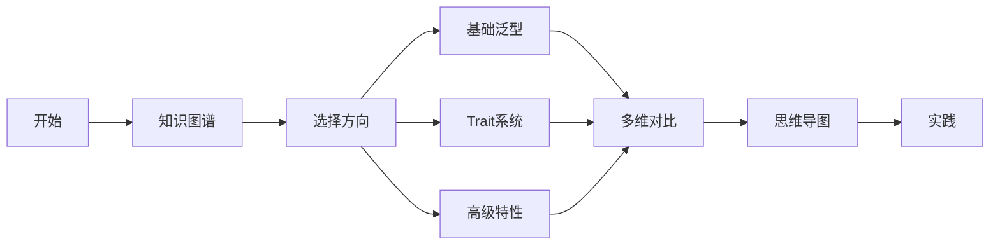
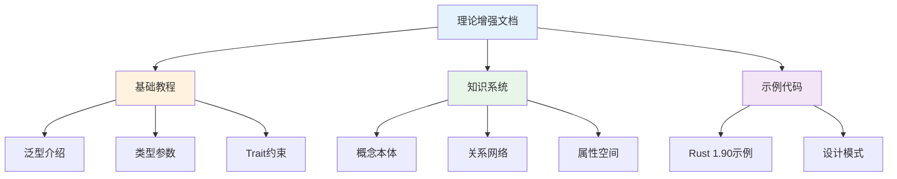

# C04 泛型特征 理论增强文档

> **文档定位**: Rust 1.90 泛型与Trait系统的高级理论体系  
> **创建日期**: 2025-10-20  
> **适用版本**: Rust 1.90+ | Edition 2024  
> **文档类型**: 理论增强 + 可视化 + 深度对比

---

## 📚 文档列表

### 1. [知识图谱与概念关系](./KNOWLEDGE_GRAPH_AND_CONCEPT_RELATIONS.md) ⭐ 推荐起点

**内容概述**:

- 泛型系统知识图谱
- Trait系统层次结构
- 概念关系三元组
- 技术演化时间线
- 学习路径规划

**适合人群**:

- 系统学习者
- 架构设计者
- 理论研究者

**预计时间**: 40分钟

---

### 2. [多维矩阵对比分析](./MULTI_DIMENSIONAL_COMPARISON_MATRIX.md)

**内容概述**:

- 泛型形式全面对比
- Trait系统深度对比
- 关联类型分析
- 高级特性对比
- 性能特征分析
- 技术选型决策

**适合人群**:

- 技术选型人员
- 性能优化工程师
- 高级开发者

**预计时间**: 50分钟

---

### 3. [思维导图与可视化](./MINDMAP_VISUALIZATION.md) ✨ 新增

**内容概述**:

- 泛型系统全景思维导图
- Trait架构图与流程图
- 类型系统可视化
- 生命周期机制
- 高级特性架构
- 设计模式可视化

**适合人群**:

- 可视化学习者
- 初学者
- 架构设计者

**预计时间**: 45分钟

---

## 🎯 学习路径

### 快速入门路径

### 深度学习路径

1. **第1周**: 阅读知识图谱
   - 理解泛型系统架构
   - 掌握Trait层次结构
   - 了解技术演化

2. **第2周**: 研究多维对比
   - 对比不同泛型形式
   - 理解性能差异
   - 学习选型决策

3. **第3周**: 学习可视化
   - 理解类型推断流程
   - 掌握Trait分发机制
   - 学习设计模式

4. **第4周**: 综合实践
   - 应用所学知识
   - 实现设计模式
   - 性能优化

---

## 📊 内容矩阵

| 文档 | 理论深度 | 实用性 | 可视化 | 推荐度 |
|------|---------|--------|--------|--------|
| 知识图谱 | ⭐⭐⭐⭐⭐ | ⭐⭐⭐ | ⭐⭐⭐⭐ | ⭐⭐⭐⭐⭐ |
| 多维对比 | ⭐⭐⭐⭐ | ⭐⭐⭐⭐⭐ | ⭐⭐⭐ | ⭐⭐⭐⭐⭐ |
| 思维导图 | ⭐⭐⭐ | ⭐⭐⭐⭐ | ⭐⭐⭐⭐⭐ | ⭐⭐⭐⭐⭐ |

---

## 🔍 按主题查找

### 基础泛型

- 知识图谱 → [泛型系统概念](./KNOWLEDGE_GRAPH_AND_CONCEPT_RELATIONS.md#11-泛型系统概念总览)
- 多维对比 → [泛型参数类型矩阵](./MULTI_DIMENSIONAL_COMPARISON_MATRIX.md#11-泛型参数类型矩阵)
- 思维导图 → [技术栈总览](./MINDMAP_VISUALIZATION.md#技术栈总览)

### Trait系统

- 知识图谱 → [Trait系统层次](./KNOWLEDGE_GRAPH_AND_CONCEPT_RELATIONS.md#12-trait-系统层次结构)
- 多维对比 → [Trait系统对比](./MULTI_DIMENSIONAL_COMPARISON_MATRIX.md#2-trait-系统对比)
- 思维导图 → [Trait架构图](./MINDMAP_VISUALIZATION.md#2-trait系统架构图)

### 生命周期

- 知识图谱 → [约束与保证关系](./KNOWLEDGE_GRAPH_AND_CONCEPT_RELATIONS.md#33-约束与保证关系)
- 多维对比 → [HRTB应用场景](./MULTI_DIMENSIONAL_COMPARISON_MATRIX.md#43-hrtb-应用场景)
- 思维导图 → [生命周期推断](./MINDMAP_VISUALIZATION.md#生命周期推断流程)

### 高级特性

- 知识图谱 → [泛型模式知识图](./KNOWLEDGE_GRAPH_AND_CONCEPT_RELATIONS.md#5-泛型模式知识图)
- 多维对比 → [高级特性对比](./MULTI_DIMENSIONAL_COMPARISON_MATRIX.md#4-高级特性对比)
- 思维导图 → [GAT架构](./MINDMAP_VISUALIZATION.md#gat架构图)

---

## 💡 文档特色

### 1. 系统性

✅ **完整的知识体系**: 从理论到实践，从基础到高级  
✅ **结构化组织**: 清晰的层次和逻辑关系  
✅ **交叉引用**: 文档之间相互关联

### 2. 可视化

✅ **丰富的Mermaid图表**: 20+个专业图表  
✅ **思维导图**: 直观的知识结构  
✅ **流程图**: 清晰的处理流程  
✅ **架构图**: 系统设计可视化

### 3. 理论深度

✅ **类型理论**: 深入的理论基础  
✅ **概念关系**: 完整的关系网络  
✅ **技术演化**: 历史发展脉络

### 4. 实用性

✅ **性能对比**: 详尽的性能数据  
✅ **选型指南**: 实用的决策建议  
✅ **最佳实践**: 生产级经验总结

---

## 📈 与其他文档的关系

---

## 🎓 适用场景

### 场景1: 系统学习

**阅读顺序**:

1. [知识图谱](./KNOWLEDGE_GRAPH_AND_CONCEPT_RELATIONS.md) - 建立知识体系
2. [学习路径](./KNOWLEDGE_GRAPH_AND_CONCEPT_RELATIONS.md#7-学习路径知识图) - 规划学习
3. [思维导图](./MINDMAP_VISUALIZATION.md) - 可视化理解

### 场景2: 技术选型

**阅读顺序**:

1. [多维对比](./MULTI_DIMENSIONAL_COMPARISON_MATRIX.md) - 全面对比
2. [技术选型决策](./MULTI_DIMENSIONAL_COMPARISON_MATRIX.md#6-技术选型决策)
3. [性能特征](./MULTI_DIMENSIONAL_COMPARISON_MATRIX.md#5-性能特征对比)

### 场景3: 架构设计

**阅读顺序**:

1. [Trait系统架构](./MINDMAP_VISUALIZATION.md#2-trait系统架构图)
2. [设计模式](./MINDMAP_VISUALIZATION.md#7-设计模式架构)
3. [泛型模式](./KNOWLEDGE_GRAPH_AND_CONCEPT_RELATIONS.md#5-泛型模式知识图)

### 场景4: 性能优化

**阅读顺序**:

1. [性能特征对比](./MULTI_DIMENSIONAL_COMPARISON_MATRIX.md#5-性能特征对比)
2. [性能优化架构](./MINDMAP_VISUALIZATION.md#6-性能优化架构)
3. [最佳实践](./MULTI_DIMENSIONAL_COMPARISON_MATRIX.md#72-性能优化清单)

---

## 📚 相关资源

### 模块内文档

- [主索引](../00_MASTER_INDEX.md)
- [知识系统](../knowledge_system/)
- [FAQ](../FAQ.md)
- [术语表](../Glossary.md)

### 基础教程

- [泛型介绍](../01_introduction_to_generics.md)
- [类型参数](../02_generic_type_parameters.md)
- [Trait约束](../03_trait_bounds.md)
- [关联类型](../04_associated_types.md)

### 实践指南

- [基础语法指南](../BASIC_SYNTAX_GUIDE.md)
- [实践泛型指南](../PRACTICAL_GENERICS_GUIDE.md)
- [Rust 1.90特性](../06_rust_features/)

---

## ✅ 文档状态

| 文档 | 状态 | 完成度 | 最后更新 |
|------|------|--------|----------|
| 知识图谱 | ✅ 完成 | 100% | 2025-10-20 |
| 多维对比 | ✅ 完成 | 100% | 2025-10-20 |
| 思维导图 | ✅ 完成 | 100% | 2025-10-20 |
| README | ✅ 完成 | 100% | 2025-10-20 |

---

## 🤝 贡献指南

### 文档改进

欢迎提交：

- 内容补充
- 错误修正
- 图表优化
- 示例添加

### 反馈渠道

- Issue反馈
- Pull Request
- 文档讨论

---

**文档版本**: v1.0  
**总文档数**: 4篇  
**总图表数**: 20+个  
**最后更新**: 2025-10-20  
**维护者**: Rust-lang项目组

---

## 返回导航

- [返回主索引](../00_MASTER_INDEX.md)
- [返回知识系统](../knowledge_system/)
- [查看基础教程](../)
- [Rust 1.90特性](../06_rust_features/)
