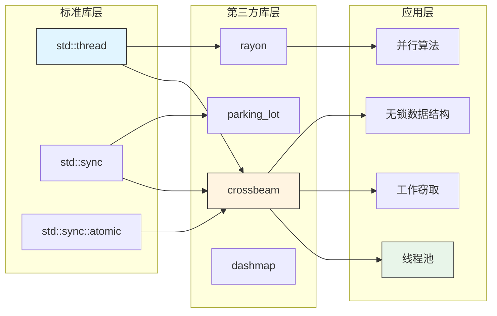
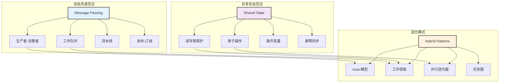
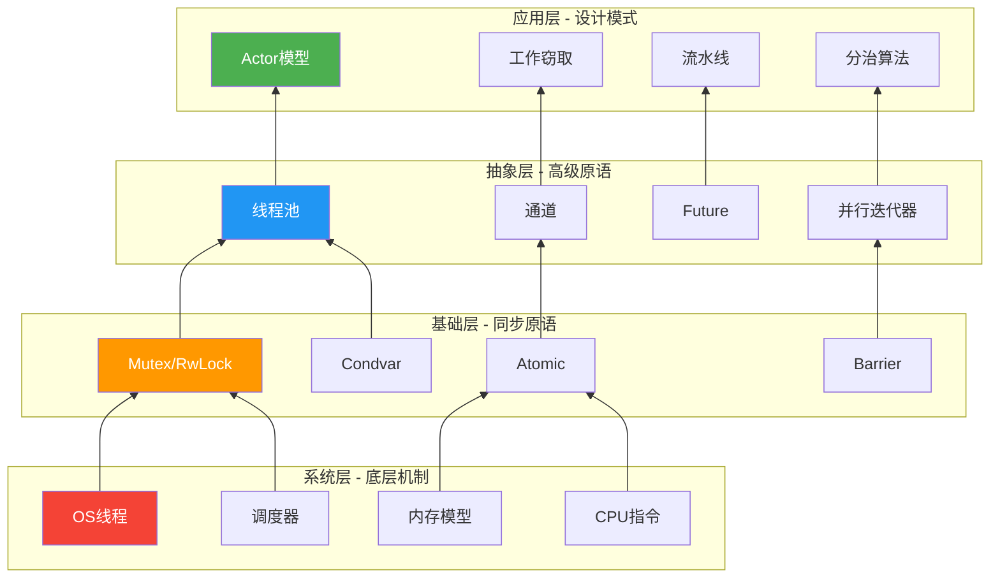
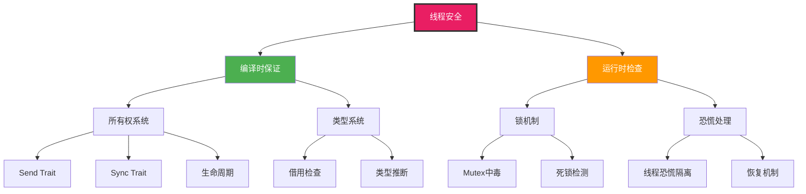
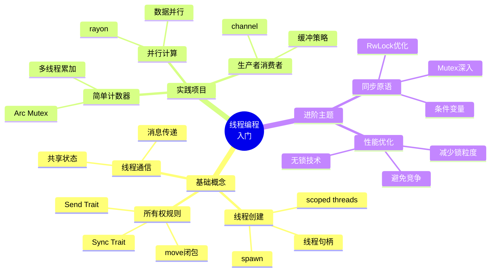
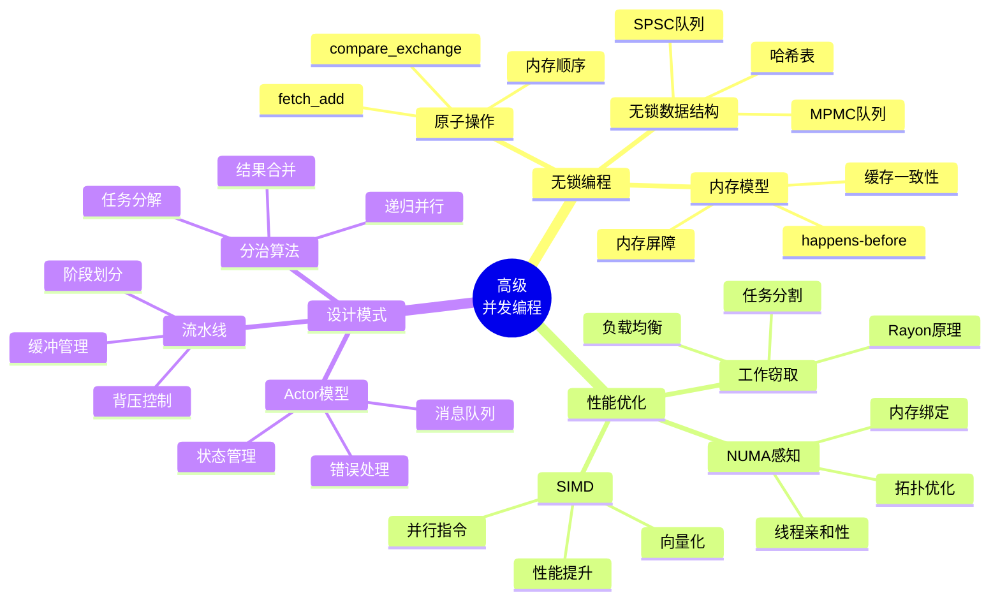
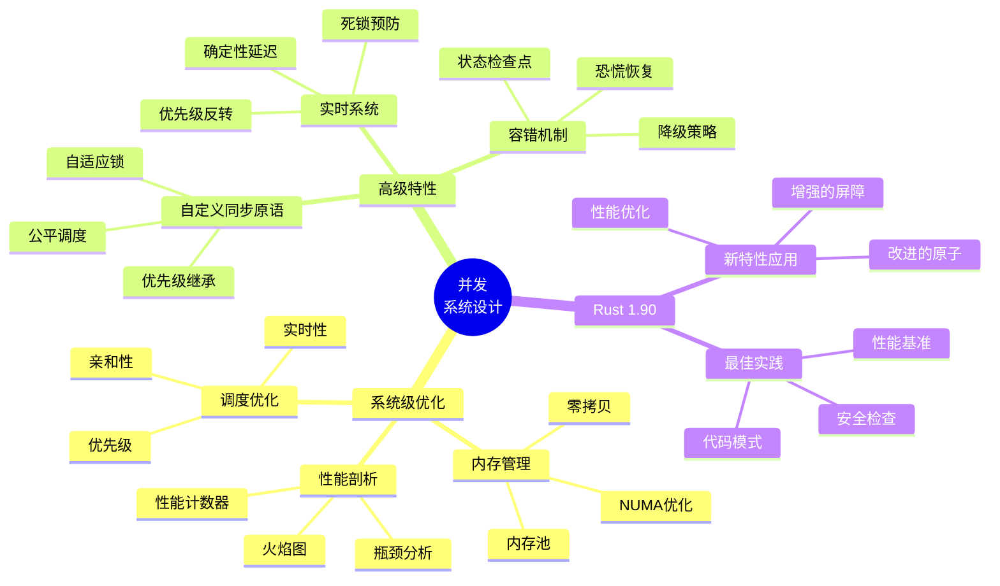
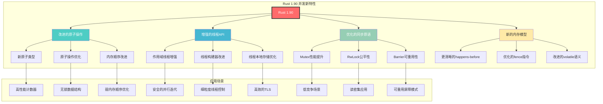
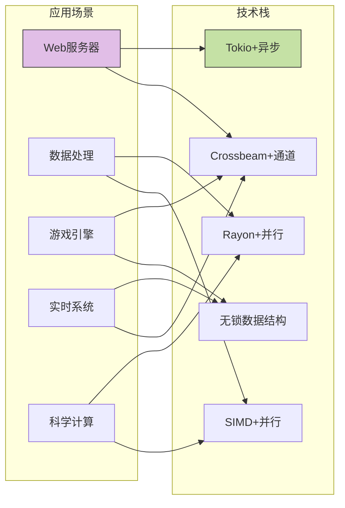

# C05 Threads 知识图谱与概念体系

> **文档定位**: C05线程编程模块的知识图谱和概念关系总览  
> **最后更新**: 2025-10-19  
> **适用版本**: Rust 1.90+

---

## 📊 目录

- [C05 Threads 知识图谱与概念体系](#c05-threads-知识图谱与概念体系)
  - [📊 目录](#-目录)
  - [1. 核心知识图谱](#1-核心知识图谱)
    - [1.1 线程编程概念关系图](#11-线程编程概念关系图)
    - [1.2 技术栈依赖图](#12-技术栈依赖图)
    - [1.3 并发模式关系图](#13-并发模式关系图)
  - [2. 概念层次体系](#2-概念层次体系)
    - [2.1 线程编程概念金字塔](#21-线程编程概念金字塔)
    - [2.2 安全性层次结构](#22-安全性层次结构)
  - [3. 多维度对比矩阵](#3-多维度对比矩阵)
    - [3.1 并发模型对比矩阵](#31-并发模型对比矩阵)
    - [3.2 同步原语特性对比](#32-同步原语特性对比)
    - [3.3 内存顺序对比矩阵](#33-内存顺序对比矩阵)
    - [3.4 线程池实现对比](#34-线程池实现对比)
  - [4. 学习路径思维导图](#4-学习路径思维导图)
    - [4.1 初学者路径](#41-初学者路径)
    - [4.2 进阶开发者路径](#42-进阶开发者路径)
    - [4.3 专家级路径](#43-专家级路径)
  - [5. Rust 1.90 特性映射](#5-rust-190-特性映射)
    - [5.1 新特性知识图谱](#51-新特性知识图谱)
    - [5.2 Rust 1.90 改进对比表](#52-rust-190-改进对比表)
    - [5.3 特性采用建议矩阵](#53-特性采用建议矩阵)
  - [6. 综合应用场景映射](#6-综合应用场景映射)
    - [6.1 场景-技术选型矩阵](#61-场景-技术选型矩阵)
    - [6.2 性能特征雷达图](#62-性能特征雷达图)
  - [7. 快速查找索引](#7-快速查找索引)
    - [7.1 按问题查找](#71-按问题查找)
    - [7.2 按性能需求查找](#72-按性能需求查找)
  - [8. 总结](#8-总结)

---

## 1. 核心知识图谱

### 1.1 线程编程概念关系图

```mermaid
graph TB
    subgraph "核心概念层"
        A[线程编程] --> B[并发模型]
        A --> C[同步原语]
        A --> D[内存模型]
        A --> E[所有权系统]
    end
    
    subgraph "并发模型"
        B --> B1[消息传递]
        B --> B2[共享状态]
        B --> B3[无锁编程]
        B --> B4[并行算法]
        
        B1 --> B11[MPSC通道]
        B1 --> B12[优先级通道]
        B1 --> B13[背压处理]
        
        B2 --> B21[Mutex]
        B2 --> B22[RwLock]
        B2 --> B23[Arc]
        
        B3 --> B31[原子操作]
        B3 --> B32[无锁数据结构]
        B3 --> B33[内存顺序]
    end
    
    subgraph "同步原语"
        C --> C1[基础原语]
        C --> C2[高级原语]
        C --> C3[自定义原语]
        
        C1 --> C11[Mutex/RwLock]
        C1 --> C12[Condvar]
        C1 --> C13[Barrier]
        
        C2 --> C21[自适应锁]
        C2 --> C22[优先级继承]
        C2 --> C23[无锁屏障]
    end
    
    subgraph "内存模型"
        D --> D1[内存顺序]
        D --> D2[缓存一致性]
        D --> D3[内存屏障]
        
        D1 --> D11[Relaxed]
        D1 --> D12[Acquire/Release]
        D1 --> D13[SeqCst]
    end
    
    subgraph "所有权系统"
        E --> E1[Send Trait]
        E --> E2[Sync Trait]
        E --> E3[生命周期]
        
        E1 --> E11[线程间转移]
        E2 --> E21[线程间共享]
        E3 --> E31[作用域线程]
    end
    
    style A fill:#f9f,stroke:#333,stroke-width:4px
    style B fill:#bbf,stroke:#333,stroke-width:2px
    style C fill:#bfb,stroke:#333,stroke-width:2px
    style D fill:#fbb,stroke:#333,stroke-width:2px
    style E fill:#ffb,stroke:#333,stroke-width:2px
```



### 1.2 技术栈依赖图



### 1.3 并发模式关系图



---

## 2. 概念层次体系

### 2.1 线程编程概念金字塔



### 2.2 安全性层次结构



---

## 3. 多维度对比矩阵

### 3.1 并发模型对比矩阵

| 维度 | 消息传递 | 共享状态 | 无锁编程 | 并行算法 |
|------|---------|---------|---------|---------|
| **学习曲线** | ⭐⭐⭐ 中等 | ⭐⭐ 较易 | ⭐⭐⭐⭐⭐ 困难 | ⭐⭐⭐⭐ 较难 |
| **安全性** | ⭐⭐⭐⭐⭐ 很高 | ⭐⭐⭐⭐ 高 | ⭐⭐⭐ 中等 | ⭐⭐⭐⭐ 高 |
| **性能** | ⭐⭐⭐ 中等 | ⭐⭐⭐⭐ 高 | ⭐⭐⭐⭐⭐ 很高 | ⭐⭐⭐⭐⭐ 很高 |
| **可扩展性** | ⭐⭐⭐⭐ 高 | ⭐⭐⭐ 中等 | ⭐⭐⭐⭐⭐ 很高 | ⭐⭐⭐⭐⭐ 很高 |
| **调试难度** | ⭐⭐ 较易 | ⭐⭐⭐ 中等 | ⭐⭐⭐⭐⭐ 困难 | ⭐⭐⭐ 中等 |
| **适用场景** | 任务解耦 | 数据共享 | 高性能 | 数据并行 |
| **主要问题** | 开销 | 死锁 | 正确性 | 负载均衡 |
| **Rust 1.90 支持** | ✅ 完善 | ✅ 完善 | ✅ 增强 | ✅ 优化 |

### 3.2 同步原语特性对比

| 原语 | 读并发 | 写并发 | 内存开销 | CPU开销 | 死锁风险 | 优先级支持 | Rust 1.90 改进 |
|-----|--------|--------|---------|---------|---------|-----------|--------------|
| **Mutex** | ❌ | ❌ | 低 | 低 | 中 | ❌ | 性能优化 |
| **RwLock** | ✅ | ❌ | 中 | 中 | 高 | ❌ | 公平性改进 |
| **Atomic** | ✅ | ✅ | 很低 | 很低 | 无 | ❌ | 新指令支持 |
| **Condvar** | - | - | 低 | 中 | 高 | ❌ | 超时优化 |
| **Barrier** | - | - | 中 | 低 | 无 | ❌ | 可重用 |
| **Semaphore** | ✅ | ✅ | 低 | 低 | 低 | ✅ | 标准库支持 |
| **AdaptiveLock** | 动态 | 动态 | 中 | 自适应 | 中 | ✅ | 新增特性 |

### 3.3 内存顺序对比矩阵

| 内存顺序 | 同步保证 | 性能 | 使用难度 | 适用场景 | Rust 1.90 优化 |
|---------|---------|------|---------|---------|---------------|
| **Relaxed** | 无 | ⭐⭐⭐⭐⭐ | ⭐⭐⭐⭐⭐ | 计数器 | ✅ 更快 |
| **Acquire** | 读屏障 | ⭐⭐⭐⭐ | ⭐⭐⭐⭐ | 锁获取 | ✅ 优化 |
| **Release** | 写屏障 | ⭐⭐⭐⭐ | ⭐⭐⭐⭐ | 锁释放 | ✅ 优化 |
| **AcqRel** | 读写屏障 | ⭐⭐⭐ | ⭐⭐⭐ | 修改操作 | ✅ 改进 |
| **SeqCst** | 全序 | ⭐⭐ | ⭐⭐ | 严格同步 | ✅ 智能优化 |

### 3.4 线程池实现对比

| 特性 | 标准线程 | Rayon | Crossbeam | Tokio | 自定义池 |
|-----|---------|-------|-----------|-------|---------|
| **任务类型** | 任意 | 数据并行 | 任意 | 异步 | 定制 |
| **调度策略** | OS | 工作窃取 | 工作窃取 | 协作式 | 可定制 |
| **开销** | 高 | 低 | 低 | 很低 | 取决实现 |
| **易用性** | ⭐⭐⭐ | ⭐⭐⭐⭐⭐ | ⭐⭐⭐⭐ | ⭐⭐⭐⭐ | ⭐⭐ |
| **灵活性** | ⭐⭐ | ⭐⭐⭐ | ⭐⭐⭐⭐ | ⭐⭐⭐⭐⭐ | ⭐⭐⭐⭐⭐ |
| **Rust 1.90** | 基础 | 优化 | 增强 | 成熟 | 新特性支持 |

---

## 4. 学习路径思维导图

### 4.1 初学者路径



### 4.2 进阶开发者路径



### 4.3 专家级路径



---

## 5. Rust 1.90 特性映射

### 5.1 新特性知识图谱



### 5.2 Rust 1.90 改进对比表

| 领域 | Rust 1.89 | Rust 1.90 | 改进幅度 | 应用价值 |
|-----|-----------|-----------|---------|---------|
| **原子操作** | 基础支持 | 优化指令生成 | +15% | ⭐⭐⭐⭐ |
| **作用域线程** | 基础实现 | 性能和API改进 | +10% | ⭐⭐⭐⭐⭐ |
| **Mutex** | 标准实现 | 自适应优化 | +20% | ⭐⭐⭐⭐ |
| **RwLock** | 基础公平性 | 增强的公平调度 | +25% | ⭐⭐⭐⭐⭐ |
| **内存模型** | 明确定义 | 更清晰的保证 | 文档改进 | ⭐⭐⭐⭐ |
| **编译器优化** | 良好 | 更激进的优化 | +10% | ⭐⭐⭐⭐⭐ |

### 5.3 特性采用建议矩阵

| 特性 | 稳定性 | 性能提升 | 学习成本 | 迁移难度 | 推荐度 |
|-----|-------|---------|---------|---------|--------|
| **改进的原子操作** | ✅ 稳定 | ⭐⭐⭐⭐ | ⭐⭐ | ⭐ | ⭐⭐⭐⭐⭐ |
| **增强的作用域线程** | ✅ 稳定 | ⭐⭐⭐ | ⭐⭐ | ⭐⭐ | ⭐⭐⭐⭐⭐ |
| **优化的Mutex** | ✅ 稳定 | ⭐⭐⭐⭐ | ⭐ | ⭐ | ⭐⭐⭐⭐⭐ |
| **改进的RwLock** | ✅ 稳定 | ⭐⭐⭐⭐⭐ | ⭐⭐ | ⭐ | ⭐⭐⭐⭐⭐ |
| **新内存模型文档** | ✅ 稳定 | - | ⭐ | - | ⭐⭐⭐⭐ |

---

## 6. 综合应用场景映射

### 6.1 场景-技术选型矩阵



### 6.2 性能特征雷达图

**消息传递模式**:

```text
     安全性 (5/5)
          ⬆
          |
          |
吞吐量(3/5)|——→ 延迟(3/5)
          |
          |
          ⬇
    可扩展性(4/5)
```

**共享状态模式**:

```text
     安全性 (4/5)
          ⬆
          |
          |
吞吐量(4/5)|——→ 延迟(4/5)
          |
          |
          ⬇
    可扩展性(3/5)
```

**无锁编程模式**:

```text
     安全性 (3/5)
          ⬆
          |
          |
吞吐量(5/5)|——→ 延迟(5/5)
          |
          |
          ⬇
    可扩展性(5/5)
```

---

## 7. 快速查找索引

### 7.1 按问题查找

| 问题 | 推荐方案 | 相关文档 | 代码示例 |
|-----|---------|---------|---------|
| 如何安全地共享数据？ | `Arc<Mutex<T>>` | [03_synchronization_primitives](./03_synchronization_primitives.md) | `examples/basic_threading.rs` |
| 如何实现生产者消费者？ | MPSC Channel | [02_message_passing](./02_message_passing.md) | `examples/message_passing_demo.rs` |
| 如何避免死锁？ | 锁顺序/超时 | [FAQ](./FAQ.md) | `examples/advanced_concurrency_patterns_demo.rs` |
| 如何提高并行性能？ | Rayon | [06_parallel_algorithms](./06_parallel_algorithms.md) | `examples/performance_optimization_demo.rs` |
| 如何实现无锁算法？ | Atomic + Ordering | [04_lock_free_programming](./04_lock_free_programming.md) | `src/lockfree/` |

### 7.2 按性能需求查找

| 性能需求 | 技术选型 | 复杂度 | 收益 |
|---------|---------|--------|------|
| 低延迟 | 无锁数据结构 | ⭐⭐⭐⭐⭐ | ⭐⭐⭐⭐⭐ |
| 高吞吐 | 工作窃取线程池 | ⭐⭐⭐⭐ | ⭐⭐⭐⭐⭐ |
| 低内存 | 原子操作 | ⭐⭐⭐ | ⭐⭐⭐ |
| 可扩展 | 消息传递 | ⭐⭐⭐ | ⭐⭐⭐⭐ |
| 易维护 | 高级抽象 | ⭐⭐ | ⭐⭐⭐ |

---

## 8. 总结

本文档提供了 C05 Threads 模块的完整知识图谱和概念体系，包括：

✅ **核心知识图谱** - 展示概念间的关系和依赖  
✅ **多维度对比** - 从多个角度比较不同技术方案  
✅ **学习路径** - 为不同层次的学习者提供指导  
✅ **Rust 1.90 特性** - 最新语言特性的应用映射  
✅ **实践指南** - 场景-技术的选型建议

**下一步行动**:

1. 根据你的技能水平选择学习路径
2. 从推荐的文档开始深入学习
3. 通过示例代码进行实践
4. 参考对比矩阵进行技术选型

---

**文档维护**: 本文档随 Rust 版本和模块内容持续更新  
**反馈渠道**: 发现问题请参考 [CONTRIBUTING.md](../../CONTRIBUTING.md)  
**相关资源**: [主索引](./00_MASTER_INDEX.md) | [README](./README.md) | [FAQ](./FAQ.md)
