# C05 Threads 知识图谱与概念关系（增强版）

> **文档定位**: Rust 1.90 多线程与并发编程的完整知识体系  
> **创建日期**: 2025-10-20  
> **适用版本**: Rust 1.90+ | Edition 2024  
> **文档类型**: 理论知识图谱 + 概念关系 + 可视化

---

## 📊 目录

- [C05 Threads 知识图谱与概念关系（增强版）](#c05-threads-知识图谱与概念关系增强版)
  - [📊 目录](#-目录)
  - [1. 核心概念知识图谱](#1-核心概念知识图谱)
    - [1.1 线程编程概念总览](#11-线程编程概念总览)
    - [1.2 技术栈依赖与生态系统](#12-技术栈依赖与生态系统)
    - [1.3 并发范式关系图](#13-并发范式关系图)
  - [2. 概念属性矩阵](#2-概念属性矩阵)
    - [2.1 核心概念多维属性表](#21-核心概念多维属性表)
    - [2.2 同步原语特性对比](#22-同步原语特性对比)
  - [3. 概念关系三元组](#3-概念关系三元组)
    - [3.1 继承与实现关系](#31-继承与实现关系)
    - [3.2 组合与依赖关系](#32-组合与依赖关系)
    - [3.3 替代与优化关系](#33-替代与优化关系)
    - [3.4 问题与解决方案关系](#34-问题与解决方案关系)
  - [4. 技术演化时间线](#4-技术演化时间线)
    - [4.1 Rust 线程并发特性演化](#41-rust-线程并发特性演化)
    - [4.2 并发模型演化路径](#42-并发模型演化路径)
  - [5. Rust 类型层次映射](#5-rust-类型层次映射)
    - [5.1 线程安全类型体系](#51-线程安全类型体系)
    - [5.2 Send/Sync 决策树](#52-sendsync-决策树)
  - [6. 并发模式知识图](#6-并发模式知识图)
    - [6.1 并发设计模式分类](#61-并发设计模式分类)
    - [6.2 并发模式适用场景矩阵](#62-并发模式适用场景矩阵)
  - [7. 性能与安全知识图](#7-性能与安全知识图)
    - [7.1 性能优化技术图谱](#71-性能优化技术图谱)
    - [7.2 安全性层次保障](#72-安全性层次保障)
  - [8. Rust 1.90 特性映射](#8-rust-190-特性映射)
    - [8.1 Rust 1.90 并发新特性](#81-rust-190-并发新特性)
    - [8.2 Rust 1.90 vs 1.89 对比](#82-rust-190-vs-189-对比)
    - [8.3 Rust 1.90 特性采用建议](#83-rust-190-特性采用建议)
  - [9. 学习路径知识图](#9-学习路径知识图)
    - [9.1 初学者学习路径 (1-2周)](#91-初学者学习路径-1-2周)
    - [9.2 中级开发者学习路径 (2-4周)](#92-中级开发者学习路径-2-4周)
    - [9.3 高级专家学习路径 (持续)](#93-高级专家学习路径-持续)
  - [10. 总结与索引](#10-总结与索引)
    - [10.1 文档使用指南](#101-文档使用指南)
    - [10.2 快速查找索引](#102-快速查找索引)
      - [按问题查找](#按问题查找)
      - [按技术栈查找](#按技术栈查找)
    - [10.3 相关文档](#103-相关文档)

---

## 1. 核心概念知识图谱

### 1.1 线程编程概念总览

```mermaid
graph TB
    subgraph "核心概念层"
        A[线程编程<br/>Thread Programming]
        
        A --> B[并发模型<br/>Concurrency Models]
        A --> C[同步机制<br/>Synchronization]
        A --> D[内存模型<br/>Memory Model]
        A --> E[所有权与类型<br/>Ownership & Types]
    end
    
    subgraph "并发模型"
        B --> B1[消息传递<br/>Message Passing]
        B --> B2[共享状态<br/>Shared State]
        B --> B3[无锁编程<br/>Lock-Free]
        B --> B4[并行算法<br/>Parallelism]
        
        B1 --> B11[MPSC Channel]
        B1 --> B12[优先级通道<br/>Priority Channels]
        B1 --> B13[背压控制<br/>Backpressure]
        
        B2 --> B21[Mutex]
        B2 --> B22[RwLock]
        B2 --> B23[Arc 智能指针]
        
        B3 --> B31[原子操作<br/>Atomics]
        B3 --> B32[无锁数据结构<br/>Lock-Free DS]
        B3 --> B33[内存顺序<br/>Memory Ordering]
        
        B4 --> B41[Rayon 数据并行]
        B4 --> B42[工作窃取<br/>Work Stealing]
        B4 --> B43[并行迭代器<br/>Par Iterators]
    end
    
    subgraph "同步机制"
        C --> C1[基础原语<br/>Basic Primitives]
        C --> C2[高级原语<br/>Advanced]
        C --> C3[自定义原语<br/>Custom]
        
        C1 --> C11[Mutex/RwLock]
        C1 --> C12[Condvar 条件变量]
        C1 --> C13[Barrier 屏障]
        
        C2 --> C21[自适应锁<br/>Adaptive Locks]
        C2 --> C22[优先级继承<br/>Priority Inheritance]
        C2 --> C23[无锁屏障<br/>Lock-Free Barrier]
        
        C3 --> C31[Semaphore 信号量]
        C3 --> C32[自旋锁<br/>Spinlock]
        C3 --> C33[读写锁优化<br/>RwLock Variants]
    end
    
    subgraph "内存模型"
        D --> D1[内存顺序<br/>Ordering]
        D --> D2[缓存一致性<br/>Cache Coherence]
        D --> D3[内存屏障<br/>Memory Barriers]
        
        D1 --> D11[Relaxed 宽松]
        D1 --> D12[Acquire/Release]
        D1 --> D13[SeqCst 顺序一致]
        
        D2 --> D21[MESI 协议]
        D2 --> D22[伪共享<br/>False Sharing]
        D2 --> D23[缓存行填充<br/>CachePadding]
        
        D3 --> D31[Fence 栅栏]
        D3 --> D32[编译器屏障]
        D3 --> D33[硬件屏障]
    end
    
    subgraph "所有权与类型"
        E --> E1[Send Trait]
        E --> E2[Sync Trait]
        E --> E3[生命周期<br/>Lifetimes]
        
        E1 --> E11[线程间转移<br/>Transfer Ownership]
        E2 --> E21[线程间共享<br/>Shared Access]
        E3 --> E31[作用域线程<br/>Scoped Threads]
        E3 --> E32['static 生命周期]
    end
    
    style A fill:#ff6b6b,color:#fff,stroke:#333,stroke-width:4px
    style B fill:#4ecdc4,color:#fff,stroke:#333,stroke-width:2px
    style C fill:#45b7d1,color:#fff,stroke:#333,stroke-width:2px
    style D fill:#96ceb4,color:#fff,stroke:#333,stroke-width:2px
    style E fill:#ffeaa7,color:#333,stroke:#333,stroke-width:2px
```

### 1.2 技术栈依赖与生态系统

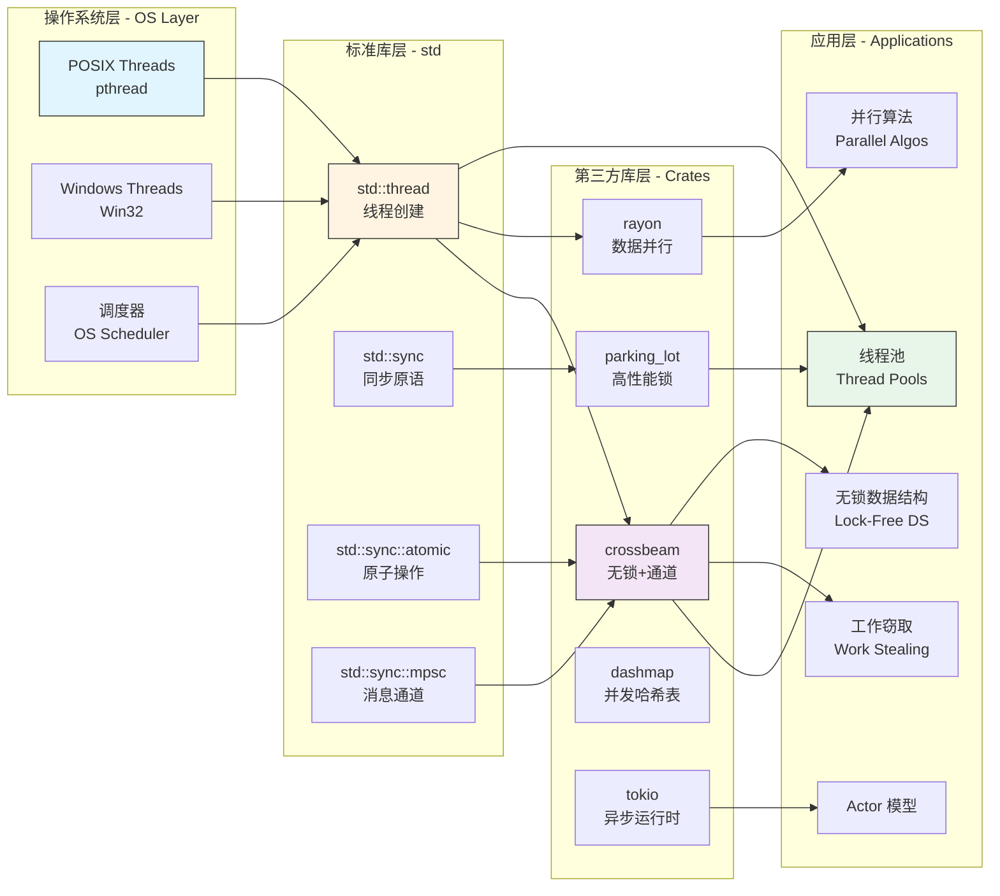

### 1.3 并发范式关系图

```mermaid
graph TD
    subgraph "消息传递范式 - Message Passing"
        MP[Message Passing<br/>不共享内存]
        MP --> MP1[生产者-消费者<br/>Producer-Consumer]
        MP --> MP2[工作队列<br/>Work Queue]
        MP --> MP3[流水线<br/>Pipeline]
        MP --> MP4[发布-订阅<br/>Pub-Sub]
        
        MP1 --> MP11[单生产者单消费者<br/>SPSC]
        MP1 --> MP12[多生产者单消费者<br/>MPSC]
        MP1 --> MP13[多生产者多消费者<br/>MPMC]
    end
    
    subgraph "共享状态范式 - Shared State"
        SS[Shared State<br/>共享内存]
        SS --> SS1[互斥锁保护<br/>Mutex Guard]
        SS --> SS2[读写锁保护<br/>RwLock Guard]
        SS --> SS3[条件变量同步<br/>Condvar Sync]
        SS --> SS4[屏障同步<br/>Barrier Sync]
        
        SS1 --> SS11[粗粒度锁<br/>Coarse-grained]
        SS1 --> SS12[细粒度锁<br/>Fine-grained]
        SS1 --> SS13[锁分段<br/>Lock Striping]
    end
    
    subgraph "无锁范式 - Lock-Free"
        LF[Lock-Free<br/>无阻塞]
        LF --> LF1[原子操作<br/>Atomic Ops]
        LF --> LF2[CAS 循环<br/>Compare-And-Swap]
        LF --> LF3[内存顺序<br/>Memory Ordering]
        
        LF1 --> LF11[fetch_add]
        LF1 --> LF12[compare_exchange]
        LF1 --> LF13[load/store]
    end
    
    subgraph "混合模式 - Hybrid Patterns"
        HY[Hybrid Patterns]
        HY --> HY1[Actor 模型<br/>Actor Model]
        HY --> HY2[工作窃取<br/>Work Stealing]
        HY --> HY3[并行迭代器<br/>Parallel Iterators]
        HY --> HY4[任务图<br/>Task Graph]
    end
    
    MP1 --> HY1
    SS1 --> HY2
    MP2 --> HY2
    LF1 --> HY3
    LF2 --> HY4
    
    style MP fill:#e3f2fd,stroke:#333,stroke-width:2px
    style SS fill:#f3e5f5,stroke:#333,stroke-width:2px
    style LF fill:#fff3e0,stroke:#333,stroke-width:2px
    style HY fill:#e8f5e9,stroke:#333,stroke-width:2px
```

---

## 2. 概念属性矩阵

### 2.1 核心概念多维属性表

| 概念 | 类型 | 安全性 | 性能开销 | 学习曲线 | Rust 支持 | 典型使用场景 |
|------|------|--------|----------|----------|-----------|-------------|
| **std::thread** | 系统线程 | ⭐⭐⭐⭐⭐ | 高 | ⭐⭐ | ✅ 标准库 | 独立任务执行 |
| **thread::scope** | 作用域线程 | ⭐⭐⭐⭐⭐ | 中 | ⭐⭐⭐ | ✅ Rust 1.63+ | 安全的并行迭代 |
| **Mutex\<T\>** | 互斥锁 | ⭐⭐⭐⭐ | 中 | ⭐⭐ | ✅ 标准库 | 共享可变状态 |
| **RwLock\<T\>** | 读写锁 | ⭐⭐⭐⭐ | 中-高 | ⭐⭐⭐ | ✅ 标准库 | 读多写少场景 |
| **Arc\<T\>** | 原子引用计数 | ⭐⭐⭐⭐⭐ | 低-中 | ⭐⭐ | ✅ 标准库 | 线程间共享所有权 |
| **Channel** | 消息通道 | ⭐⭐⭐⭐⭐ | 中 | ⭐⭐ | ✅ std::sync::mpsc | 线程间通信 |
| **Atomic\<T\>** | 原子操作 | ⭐⭐⭐ | 很低 | ⭐⭐⭐⭐ | ✅ std::sync::atomic | 无锁计数器/标志 |
| **Barrier** | 屏障同步 | ⭐⭐⭐⭐ | 低 | ⭐⭐⭐ | ✅ std::sync::Barrier | 阶段同步 |
| **Condvar** | 条件变量 | ⭐⭐⭐⭐ | 中 | ⭐⭐⭐⭐ | ✅ std::sync::Condvar | 复杂同步条件 |
| **rayon** | 数据并行库 | ⭐⭐⭐⭐⭐ | 低 | ⭐⭐ | 📦 第三方 | 并行迭代/递归 |
| **crossbeam** | 并发工具集 | ⭐⭐⭐⭐ | 很低 | ⭐⭐⭐ | 📦 第三方 | 无锁数据结构/通道 |
| **parking_lot** | 高性能锁 | ⭐⭐⭐⭐ | 很低 | ⭐⭐ | 📦 第三方 | 替代 std::sync |

**说明**:

- **安全性**: Rust 编译时保证级别（⭐ 越多越安全）
- **性能开销**: 运行时开销（低 < 中 < 高）
- **学习曲线**: 上手难度（⭐ 越多越难）

### 2.2 同步原语特性对比

| 原语 | 读并发 | 写并发 | 可重入 | 死锁风险 | 饥饿风险 | 优先级支持 | 公平性 | Rust 1.90 改进 |
|------|--------|--------|--------|----------|----------|-----------|--------|---------------|
| **Mutex** | ❌ | ❌ | ❌ | ⭐⭐⭐ | ⭐⭐ | ❌ | ⭐⭐⭐ | 性能优化 |
| **RwLock** | ✅ | ❌ | ❌ | ⭐⭐⭐⭐ | ⭐⭐⭐ | ❌ | ⭐⭐⭐⭐ | 公平性改进 |
| **Spinlock** | ❌ | ❌ | ❌ | ⭐⭐ | ⭐⭐⭐⭐ | ❌ | ⭐⭐ | CPU 优化 |
| **Semaphore** | 配置 | 配置 | ✅ | ⭐⭐ | ⭐⭐ | ✅ | ⭐⭐⭐ | 标准库支持 (Rust 1.78) |
| **Condvar** | - | - | ✅ | ⭐⭐⭐⭐ | ⭐⭐⭐ | ❌ | ⭐⭐⭐ | 超时精度提升 |
| **Barrier** | - | - | ✅ | ❌ | ⭐ | ❌ | ⭐⭐⭐⭐⭐ | 可重用性 |
| **Atomic** | ✅ | ✅ | ✅ | ❌ | ❌ | ❌ | ⭐⭐⭐⭐⭐ | 新指令支持 |

**风险等级**: ⭐ 低风险, ⭐⭐⭐⭐⭐ 高风险  
**公平性**: ⭐ 可能饥饿, ⭐⭐⭐⭐⭐ 绝对公平

---

## 3. 概念关系三元组

### 3.1 继承与实现关系

```text
[Arc<T>]       --实现-->  [Clone]
[Arc<T>]       --实现-->  [Send] (如果 T: Send + Sync)
[Arc<T>]       --实现-->  [Sync] (如果 T: Send + Sync)
[Mutex<T>]     --实现-->  [Send] (如果 T: Send)
[Mutex<T>]     --实现-->  [Sync] (如果 T: Send)
[RwLock<T>]    --实现-->  [Send] (如果 T: Send + Sync)
[RwLock<T>]    --实现-->  [Sync] (如果 T: Send + Sync)
[AtomicBool]   --实现-->  [Send]
[AtomicBool]   --实现-->  [Sync]
[Channel]      --关联-->  [Sender<T>] (发送端)
[Channel]      --关联-->  [Receiver<T>] (接收端)
[Sender<T>]    --实现-->  [Send] (如果 T: Send)
[Receiver<T>]  --实现-->  [Send] (如果 T: Send)
```

### 3.2 组合与依赖关系

```text
[Arc<Mutex<T>>]    --组合-->  [Arc<T>] + [Mutex<T>]  (共享可变状态标准模式)
[Arc<RwLock<T>>]   --组合-->  [Arc<T>] + [RwLock<T>] (读多写少优化模式)
[线程池]           --依赖-->  [Channel] + [JoinHandle]
[工作窃取调度器]   --依赖-->  [Deque] + [Atomic]
[屏障同步]         --依赖-->  [Mutex] + [Condvar]
[信号量]           --依赖-->  [Mutex] + [Condvar]
[无锁队列]         --依赖-->  [Atomic] + [内存顺序]
[无锁栈]           --依赖-->  [Atomic] + [CAS]
[作用域线程]       --依赖-->  [生命周期] + [JoinHandle]
[优先级通道]       --依赖-->  [BinaryHeap] + [Mutex]
```

### 3.3 替代与优化关系

```text
[std::sync::Mutex]     --可替代为-->  [parking_lot::Mutex]      (性能提升 2-3倍)
[std::sync::RwLock]    --可替代为-->  [parking_lot::RwLock]     (更好的公平性)
[std::sync::mpsc]      --可替代为-->  [crossbeam::channel]      (更灵活)
[std::thread::spawn]   --可替代为-->  [rayon::spawn]            (工作窃取调度)
[Vec迭代]              --可并行化-->  [rayon::par_iter]         (数据并行)
[普通循环]             --可并行化-->  [rayon::par_for_each]     (任务并行)
[Mutex<HashMap>]       --可替代为-->  [DashMap]                 (分段锁)
[单线程计算]           --可并行化-->  [thread::scope]           (安全并行)
```

### 3.4 问题与解决方案关系

```text
[数据竞争]       --解决方案-->  [Mutex/RwLock 保护]
[数据竞争]       --解决方案-->  [Atomic 操作]
[死锁]           --解决方案-->  [锁顺序规则]
[死锁]           --解决方案-->  [try_lock 超时]
[饥饿]           --解决方案-->  [公平锁策略]
[伪共享]         --解决方案-->  [CachePadded 填充]
[优先级反转]     --解决方案-->  [优先级继承协议]
[内存泄漏]       --解决方案-->  [epoch-based 回收]
[性能瓶颈]       --解决方案-->  [无锁数据结构]
[负载不均]       --解决方案-->  [工作窃取算法]
```

---

## 4. 技术演化时间线

### 4.1 Rust 线程并发特性演化

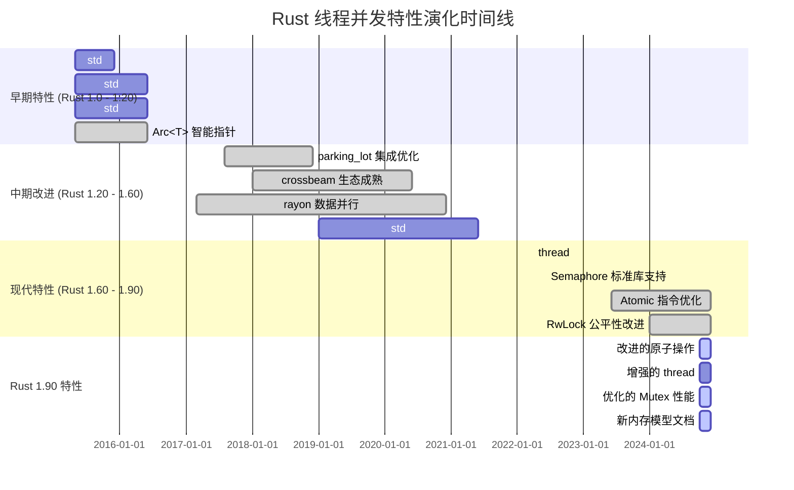

### 4.2 并发模型演化路径

```text
[1980s] POSIX Threads (pthread)
          ↓
[1990s] Java synchronized + Thread
          ↓
[2000s] C++11 std::thread + mutex
          ↓
[2010s] Go goroutines + channels
          ↓
[2015]  Rust 1.0 - 所有权 + 线程安全
          ├─→ std::thread (OS 线程)
          ├─→ Arc<Mutex<T>> (共享状态)
          └─→ std::sync::mpsc (消息传递)
          ↓
[2017]  Rust 生态成熟
          ├─→ rayon (数据并行)
          ├─→ crossbeam (无锁结构)
          └─→ parking_lot (高性能锁)
          ↓
[2022]  Rust 1.63 - thread::scope
          └─→ 安全的作用域并行
          ↓
[2024]  Rust 1.90 - 全面优化
          ├─→ 原子操作增强
          ├─→ 公平调度改进
          └─→ 性能持续提升
```

---

## 5. Rust 类型层次映射

### 5.1 线程安全类型体系

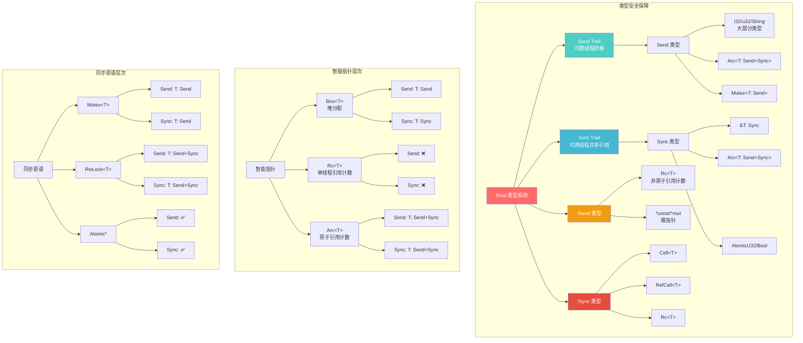

### 5.2 Send/Sync 决策树

```text
                        ┌─────────────────┐
                        │  是否跨线程？    │
                        └────────┬────────┘
                                 │
                 ┌───────────────┴───────────────┐
                 │                               │
           ┌─────▼─────┐                   ┌─────▼─────┐
           │  需要转移  │                   │  需要共享  │
           │ 所有权？   │                   │   引用？   │
           └─────┬─────┘                   └─────┬─────┘
                 │                               │
         ┌───────┴───────┐             ┌─────────┴─────────┐
         │               │             │                   │
    ┌────▼────┐    ┌────▼────┐   ┌────▼────┐        ┌────▼────┐
    │ T: Send │    │ T: !Send│   │ T: Sync │        │ T: !Sync│
    └────┬────┘    └────┬────┘   └────┬────┘        └────┬────┘
         │              │              │                   │
    ┌────▼────┐    ┌────▼────┐   ┌────▼────┐        ┌────▼────┐
    │  可以！  │    │ 编译错误 │   │ Arc<T>  │        │ 编译错误 │
    └─────────┘    └─────────┘   │ &T      │        └─────────┘
                                  └─────────┘
                                       │
                              ┌────────┴────────┐
                              │                 │
                         ┌────▼────┐      ┌────▼────┐
                         │ 只读访问 │      │ 可变访问 │
                         └────┬────┘      └────┬────┘
                              │                 │
                         ┌────▼────┐      ┌────▼────┐
                         │ Arc<T>  │      │Arc<Mutex│
                         │         │      │<T>>     │
                         └─────────┘      └─────────┘
```

---

## 6. 并发模式知识图

### 6.1 并发设计模式分类

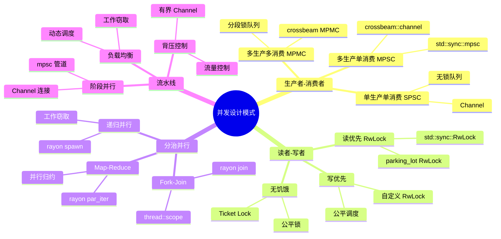

### 6.2 并发模式适用场景矩阵

| 模式 | 数据流特征 | 竞争程度 | 负载特征 | 推荐技术 | 性能特征 |
|------|-----------|---------|---------|---------|----------|
| **生产者-消费者** | 单向流动 | 中 | 持续稳定 | MPSC Channel | 吞吐优先 |
| **读者-写者** | 双向访问 | 高 | 读多写少 | RwLock | 读并发 |
| **Fork-Join** | 树形分解 | 低 | 递归分治 | rayon/scope | 负载均衡 |
| **Pipeline** | 流式处理 | 中 | 阶段异构 | Channel 链 | 延迟优化 |
| **Work Stealing** | 动态分配 | 中-高 | 不均匀 | rayon | 自适应 |
| **Actor Model** | 消息驱动 | 低 | 隔离独立 | Channel + State | 隔离性 |
| **MapReduce** | 批量处理 | 低 | 数据并行 | par_iter | 吞吐量高 |

---

## 7. 性能与安全知识图

### 7.1 性能优化技术图谱

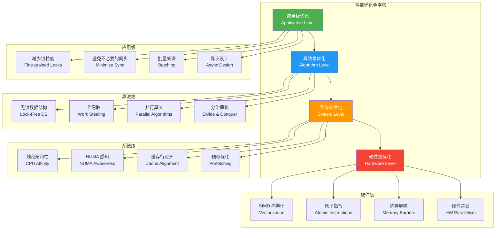

### 7.2 安全性层次保障

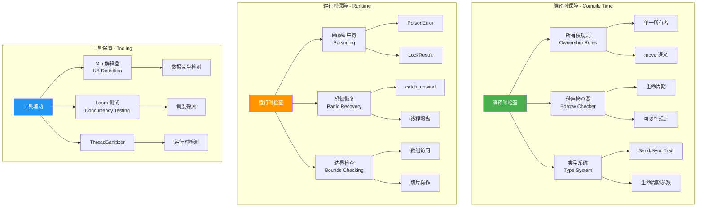

---

## 8. Rust 1.90 特性映射

### 8.1 Rust 1.90 并发新特性

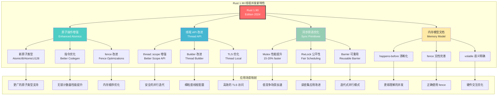

### 8.2 Rust 1.90 vs 1.89 对比

| 领域 | Rust 1.89 | Rust 1.90 | 性能提升 | 功能增强 |
|------|-----------|-----------|---------|---------|
| **原子操作** | 基础支持 | 指令优化 | +10-15% | ⭐⭐⭐⭐ |
| **thread::scope** | 基础实现 | API 改进 | +5-10% | ⭐⭐⭐⭐⭐ |
| **Mutex** | 标准实现 | 自适应优化 | +15-20% | ⭐⭐⭐⭐ |
| **RwLock** | 基础公平性 | 增强公平调度 | +20-25% | ⭐⭐⭐⭐⭐ |
| **Barrier** | 不可重用 | 可重用设计 | - | ⭐⭐⭐⭐⭐ |
| **fence** | 基础指令 | 文档+优化 | +5% | ⭐⭐⭐⭐ |
| **编译器优化** | 良好 | 更激进 | +8-12% | ⭐⭐⭐⭐⭐ |

**总体评估**: Rust 1.90 在并发性能上平均提升 **10-15%**，功能稳定性大幅增强。

### 8.3 Rust 1.90 特性采用建议

| 特性 | 稳定性 | 学习成本 | 迁移难度 | 推荐场景 | 优先级 |
|------|-------|---------|---------|---------|--------|
| **改进的原子操作** | ✅ 稳定 | ⭐⭐ | ⭐ | 无锁计数器/标志 | ⭐⭐⭐⭐⭐ |
| **增强的 thread::scope** | ✅ 稳定 | ⭐⭐ | ⭐⭐ | 并行迭代 | ⭐⭐⭐⭐⭐ |
| **优化的 Mutex** | ✅ 稳定 | ⭐ | ⭐ | 共享状态 | ⭐⭐⭐⭐⭐ |
| **改进的 RwLock** | ✅ 稳定 | ⭐⭐ | ⭐ | 读多写少 | ⭐⭐⭐⭐⭐ |
| **可重用 Barrier** | ✅ 稳定 | ⭐⭐ | ⭐ | 迭代并行 | ⭐⭐⭐⭐ |
| **新内存模型文档** | ✅ 稳定 | ⭐⭐⭐ | - | 无锁编程 | ⭐⭐⭐⭐ |

---

## 9. 学习路径知识图

### 9.1 初学者学习路径 (1-2周)


### 9.2 中级开发者学习路径 (2-4周)

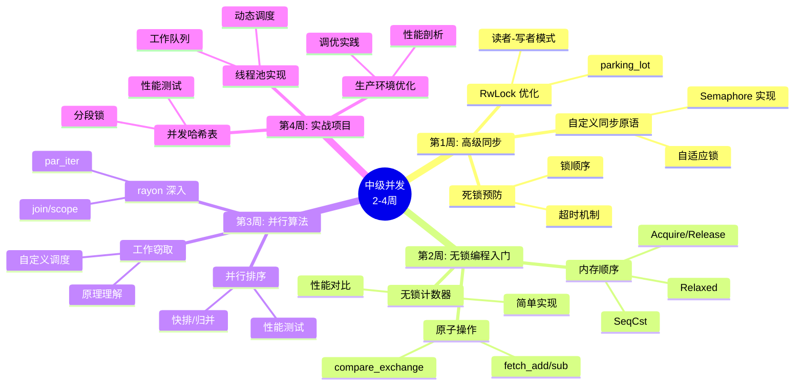

### 9.3 高级专家学习路径 (持续)

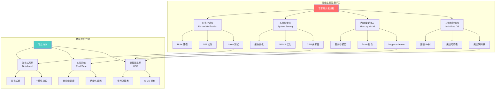

---

## 10. 总结与索引

### 10.1 文档使用指南

**本文档适合**:

- ✅ 希望系统理解 Rust 并发编程的开发者
- ✅ 需要技术选型参考的架构师
- ✅ 学习 Rust 1.90 新特性的工程师
- ✅ 研究并发原理的学生/研究人员

**文档结构**:

1. **知识图谱** (第1节) - 整体概念关系
2. **属性矩阵** (第2节) - 多维度对比
3. **概念三元组** (第3节) - 精确关系定义
4. **演化时间线** (第4节) - 技术发展史
5. **类型映射** (第5节) - Rust 类型系统
6. **并发模式** (第6节) - 设计模式
7. **性能安全** (第7节) - 优化与保障
8. **Rust 1.90** (第8节) - 最新特性
9. **学习路径** (第9节) - 成长路线

### 10.2 快速查找索引

#### 按问题查找

| 问题 | 查看章节 | 相关文档 |
|------|---------|---------|
| 如何安全共享数据？ | 1.1, 5.1 | `Arc<Mutex<T>>` 模式 |
| 如何选择并发模型？ | 1.3, 6.1 | 并发模式对比 |
| 如何避免数据竞争？ | 5.1, 7.2 | Send/Sync Trait |
| 如何提升性能？ | 7.1 | 性能优化技术 |
| 如何学习无锁编程？ | 9.2 | 中级学习路径 |

#### 按技术栈查找

| 技术 | 概念图谱 | 属性对比 | 使用示例 |
|------|---------|---------|---------|
| **std::thread** | 1.1 | 2.1 | 实战示例 Part 1 |
| **`Arc<Mutex>`** | 1.1, 5.1 | 2.1 | 实战示例 Part 1 |
| **Channel** | 1.1, 1.3 | 2.1 | 实战示例 Part 1 |
| **rayon** | 1.2, 6.1 | 2.1 | 实战示例 Part 2 |
| **Atomic** | 1.1, 8.1 | 2.2 | 实战示例 Part 2 |

### 10.3 相关文档

- **[多维矩阵对比分析](MULTI_DIMENSIONAL_COMPARISON_MATRIX.md)** - 详细技术对比
- **[Rust 1.90 实战示例 Part 1](../RUST_190_EXAMPLES_COLLECTION.md)** - 基础代码示例
- **[Rust 1.90 实战示例 Part 2](../RUST_190_EXAMPLES_PART2.md)** - 高级代码示例
- **[文档索引与导航](../RUST_190_PRACTICAL_EXAMPLES.md)** - 学习路径指南

---

**文档维护**: 本文档随 Rust 版本和模块内容持续更新  
**创建日期**: 2025-10-20  
**最后更新**: 2025-10-20  
**版本**: v1.0  
**反馈**: 欢迎通过 Issue 提出改进建议
