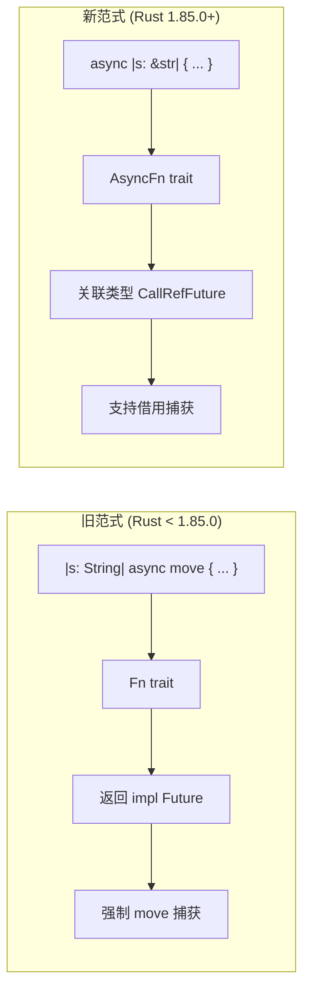
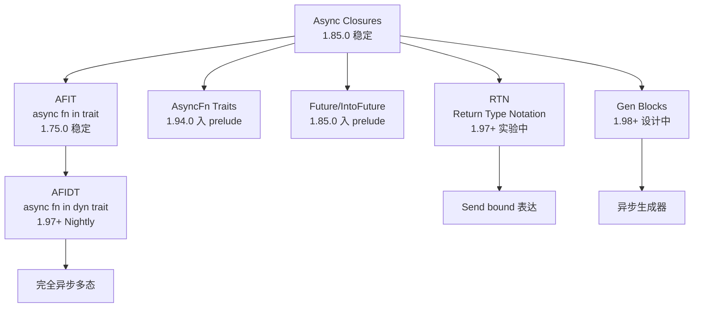

# Async Closures 深度指南

> **Rust 版本**: 1.85.0+ Stable
> **RFC**: [RFC 3668 - Async Closures](https://rust-lang.github.io/rfcs/3668-async-closures.html)
> **相关 Traits**: `AsyncFn`, `AsyncFnMut`, `AsyncFnOnce` (1.94.0+ 已入 prelude)
> **最后更新**: 2026-05-08

---

## 目录

- [Async Closures 深度指南](#async-closures-深度指南)
  - [目录](#目录)
  - [1. 概念定义](#1-概念定义)
    - [什么是 Async Closure？](#什么是-async-closure)
    - [为什么需要 Async Closures？](#为什么需要-async-closures)
  - [2. 核心差异：旧范式 vs 新范式](#2-核心差异旧范式-vs-新范式)
    - [详细对比矩阵](#详细对比矩阵)
  - [3. AsyncFn Trait Family](#3-asyncfn-trait-family)
    - [Trait 定义（概念性）](#trait-定义概念性)
    - [自动实现规则](#自动实现规则)
  - [4. 语法与用法](#4-语法与用法)
    - [基础语法](#基础语法)
    - [在函数参数中使用](#在函数参数中使用)
  - [5. Wikipedia 概念对齐](#5-wikipedia-概念对齐)
  - [6. 实际应用场景](#6-实际应用场景)
    - [场景 1：异步迭代器适配](#场景-1异步迭代器适配)
    - [场景 2：中间件模式](#场景-2中间件模式)
    - [场景 3：事件处理](#场景-3事件处理)
  - [7. 反例与限制](#7-反例与限制)
    - [❌ 不是 dyn-compatible](#-不是-dyn-compatible)
    - [❌ Send bound 表达仍复杂](#-send-bound-表达仍复杂)
    - [❌ 与 `Fn() -> impl Future` 的互操作](#-与-fn---impl-future-的互操作)
  - [8. 决策树](#8-决策树)
  - [9. 与其他特性的关系](#9-与其他特性的关系)
  - [10. 迁移指南](#10-迁移指南)
    - [从旧范式迁移到 Async Closures](#从旧范式迁移到-async-closures)
      - [步骤 1：识别候选代码](#步骤-1识别候选代码)
      - [步骤 2：迁移条件判断](#步骤-2迁移条件判断)
      - [步骤 3：语法转换](#步骤-3语法转换)
      - [步骤 4：Trait bound 更新](#步骤-4trait-bound-更新)
  - [参考资源](#参考资源)

---

## 1. 概念定义

### 什么是 Async Closure？

**Async Closure** 是一种可以**异步执行**的闭包。
与普通闭包返回计算结果不同，async closure 返回一个 `Future`，需要在异步上下文中 `.await` 才能获得最终结果。

```rust
// 普通闭包：立即返回结果
let regular = |x: i32| x * 2;
let result = regular(21); // result == 42

// 异步闭包：返回 Future
let async_closure = async |x: i32| {
    tokio::time::sleep(Duration::from_millis(10)).await;
    x * 2
};
let result = async_closure(21).await; // result == 42
```

### 为什么需要 Async Closures？

在 async closures 稳定之前，Rust 开发者使用以下**旧范式**来模拟异步闭包：

```rust
// 旧范式：返回 Future 的普通闭包
let old_style = |s: String| async move {
    println!("{}", s);
    s.len()
};
```

这个旧范式存在三个核心问题：

1. **强制 `move`**: 旧范式需要 `async move` 来捕获变量，导致所有权转移，无法借用
2. **Send bound 表达困难**: 无法在 trait bound 中简洁地表达 "返回的 Future 是 Send 的"
3. **类型系统不统一**: 旧范式实现的是 `Fn` trait，返回 `impl Future`，而异步生态需要统一的 `AsyncFn` trait

Async closures 通过引入 `AsyncFn` trait family 解决了这些问题。

---

## 2. 核心差异：旧范式 vs 新范式



### 详细对比矩阵

| 维度 | 旧范式 `\|x\| async move { ... }` | Async Closure `async \|x\| { ... }` (1.85.0+) |
|------|----------------------------------|-----------------------------------------------|
| **语法** | 闭包返回 async block | `async` 关键字修饰闭包 |
| **捕获方式** | 强制 `move`（所有权转移） | 支持借用（与常规闭包一致） |
| **返回类型** | `impl Future<Output = T>` | `impl AsyncFn(...) -> T`（关联类型抽象） |
| **Trait 实现** | `FnOnce` / `Fn` / `FnMut` | `AsyncFnOnce` / `AsyncFn` / `AsyncFnMut` + `FnOnce` |
| **Send bound** | 复杂（需显式标注） | 自动推断（通过关联类型） |
| **dyn 兼容** | ❌ 不支持 | ❌ 不支持（当前限制） |
| **调用方式** | `closure(args).await` | `closure(args).await` |
| **稳定性** | 任何版本可用 | **1.85.0 稳定** |

---

## 3. AsyncFn Trait Family

### Trait 定义（概念性）

```rust
pub trait AsyncFn<Args> {
    type Output;
    type CallRefFuture<'a>: Future<Output = Self::Output>
    where
        Self: 'a;

    fn async_call(&self, args: Args) -> Self::CallRefFuture<'_>;
}

pub trait AsyncFnMut<Args>: AsyncFn<Args> {
    type CallMutFuture<'a>: Future<Output = Self::Output>
    where
        Self: 'a;

    fn async_call_mut(&mut self, args: Args) -> Self::CallMutFuture<'_>;
}

pub trait AsyncFnOnce<Args>: AsyncFnMut<Args> {
    type CallOnceFuture: Future<Output = Self::Output>;

    fn async_call_once(self, args: Args) -> Self::CallOnceFuture;
}
```

> **注意**: `async_call` / `async_call_mut` / `async_call_once` 方法在 **nightly** 中可用。
> 在 **stable 1.95.0** 中，使用直接调用语法 `closure(args).await`。

### 自动实现规则

Async closures 自动实现 `AsyncFn` traits：

| 闭包形式 | 实现的 Traits |
|---------|--------------|
| `async \|x\| { ... }`（不 move，不 mutate 捕获） | `AsyncFn` + `AsyncFnMut` + `AsyncFnOnce` + `Fn` + `FnMut` + `FnOnce` |
| `async move \|x\| { ... }`（move 捕获，不 mutate） | `AsyncFn` + `AsyncFnMut` + `AsyncFnOnce` + `FnOnce`（可能 + `Fn`/`FnMut`） |
| `async \|x\| { captured.push(x); }`（mutate 捕获） | `AsyncFnMut` + `AsyncFnOnce` + `FnMut` + `FnOnce` |

---

## 4. 语法与用法

### 基础语法

```rust
use std::time::Duration;

// 1. 最简单的 async closure
let simple = async |x: i32| x * 2;
let result = simple(21).await; // 42

// 2. 带类型注解的参数
let typed = async |name: &str| -> String {
    format!("Hello, {name}")
};

// 3. move 捕获
let prefix = String::from("Result: ");
let moved = async move |x: i32| {
    format!("{prefix}{}", x * 2)
};

// 4. 多个参数
let multi = async |a: i32, b: i32| a + b;

// 5. 泛型参数（ Higher-Ranked ）
let generic = async |s: &str| s.len();
// 等价于：for<'a> async |s: &'a str| -> usize
```

### 在函数参数中使用

```rust
/// 接受异步谓词的过滤函数
async fn async_filter<T, F>(items: Vec<T>, predicate: F) -> Vec<T>
where
    F: AsyncFn(&T) -> bool,
{
    let mut results = Vec::new();
    for item in items {
        if predicate(&item).await {
            results.push(item);
        }
    }
    results
}

// 使用
let numbers = vec![1, 2, 3, 4, 5];
let evens = async_filter(numbers, async |x: &i32| *x % 2 == 0).await;
assert_eq!(evens, vec![2, 4]);
```

---

## 5. Wikipedia 概念对齐

| 概念 (Wikipedia) | 定义 | Rust Async Closure 映射 | 示例 | 反例 |
|-----------------|------|------------------------|------|------|
| **Closure (CS)** | 捕获其定义环境的函数 | `async \|args\| { body }` | `async \|x\| db.query(x).await` | 无法捕获环境（普通函数） |
| **Coroutine** | 可暂停/恢复的计算单元 | `AsyncFn` 返回 `Future` | `async \|x\| { yield x; }` (future gen) | 同步闭包（不可暂停） |
| **Continuation** | 程序剩余计算的代表 | `.await` 是 continuation 的显式形式 | `async \|x\| step1(x).await` | 回调地狱（隐式 continuation） |
| **Higher-Order Function** | 接受函数为参数的函数 | `async_filter(items, async \|x\| ...)` | `Iterator::filter` | 不接受回调的函数 |
| **Type Class** | 类型行为的抽象接口 | `AsyncFn` trait family | `impl AsyncFn(i32) -> i32` | 具体类型（无抽象） |
| **Parametric Polymorphism** | 类型无关的泛型编程 | `fn foo<F: AsyncFn(T) -> U>(f: F)` | 可接受任何 async closure | 仅接受具体 Future 类型 |

---

## 6. 实际应用场景

### 场景 1：异步迭代器适配

```rust
/// 异步 map：对 Stream 的每个元素应用异步转换
async fn async_map<S, T, F>(stream: S, transform: F) -> Vec<T>
where
    S: Stream,
    F: AsyncFn(S::Item) -> T,
{
    let mut results = Vec::new();
    pin_mut!(stream);
    while let Some(item) = stream.next().await {
        results.push(transform(item).await);
    }
    results
}
```

### 场景 2：中间件模式

```rust
/// HTTP 中间件链
async fn middleware<F>(req: Request, next: F) -> Response
where
    F: AsyncFn(Request) -> Response,
{
    // 前置处理
    let modified = add_trace_id(req);

    // 调用下一个处理器
    let resp = next(modified).await;

    // 后置处理
    log_response(&resp);
    resp
}

// 使用
let handler = async |req: Request| {
    Response::new(format!("Handled: {}", req.path()))
};
let response = middleware(request, handler).await;
```

### 场景 3：事件处理

```rust
/// GUI 事件处理器注册
struct EventBus {
    handlers: Vec<Box<dyn Fn(Event) -> Pin<Box<dyn Future<Output = ()>>>>>,
}

// 更现代的写法：使用泛型存储 AsyncFn
struct TypedEventBus {
    // 由于 AsyncFn 不是 dyn-safe，使用泛型或枚举
}
```

> **注意**: 由于 `AsyncFn` 不是 dyn-compatible，事件总线需要使用泛型或 `BoxFuture` 模式。

---

## 7. 反例与限制

### ❌ 不是 dyn-compatible

```rust
// 错误：AsyncFn 不是 dyn-compatible
fn make_dyn() -> Box<dyn AsyncFn(i32) -> bool> {
    Box::new(async |x| x > 0)
}
```

**原因**: `AsyncFn` 的关联类型 `CallRefFuture` 使 vtable 无法统一构造。

**替代方案**:

```rust
// 方案 1：使用泛型
fn make_generic<F: AsyncFn(i32) -> bool>(f: F) -> F { f }

// 方案 2：使用 Pin<Box<dyn Future>>
fn make_boxed() -> impl Fn(i32) -> Pin<Box<dyn Future<Output = bool>>> {
    |x| Box::pin(async move { x > 0 })
}
```

### ❌ Send bound 表达仍复杂

```rust
// 困难：如何表达 "async closure 返回的 Future 是 Send 的"？
fn spawn_task<F>(f: F)
where
    F: AsyncFn(i32) -> i32,
    // F::CallRefFuture: Send,  // ❌ 关联类型不稳定
{
    // tokio::spawn 需要 Send future
}
```

**临时解决方案**: 使用 `async move` 闭包 + `Fn` bound（旧范式）直到 RTN (Return Type Notation) 稳定。

### ❌ 与 `Fn() -> impl Future` 的互操作

```rust
let old_style = |x: i32| async move { x * 2 };
let new_style = async |x: i32| x * 2;

// old_style 实现 Fn(i32) -> impl Future
// new_style 实现 AsyncFn(i32) -> i32
// 两者不能直接在同一个泛型参数中使用
```

---

## 8. 决策树

```mermaid
graph TD
    D[需要异步回调?] --> Q1{需要借用捕获?}

    Q1 -->|是| A1[使用 async closure<br/>async |x| { ... }<br/>1.85.0+]
    Q1 -->|否| Q2{需要 dyn trait?}

    Q2 -->|是| A2[使用旧范式<br/>|x| async move { ... }<br/>+ Pin<Box<dyn Future>>]
    Q2 -->|否| Q3{Send bound 重要?}

    Q3 -->|是| A3[使用旧范式<br/>显式 Future + Send bound]
    Q3 -->|否| A4[使用 async closure<br/>更简洁现代]

    Q4{需要 trait bound?} -->|是| Q5{需要 await 调用?}
    Q5 -->|是| A5[使用 AsyncFn trait<br/>predicate(&item).await]
    Q5 -->|否| A6[使用 Fn trait<br/>返回 Future]
```

---

## 9. 与其他特性的关系



---

## 10. 迁移指南

### 从旧范式迁移到 Async Closures

#### 步骤 1：识别候选代码

查找模式：`|args| async move { ... }`

#### 步骤 2：迁移条件判断

满足以下条件时迁移：

- ✅ 不需要 `dyn trait`（`AsyncFn` 不是 dyn-safe）
- ✅ 不需要显式的 Future Send bound（或可以 workaround）
- ✅ 需要借用捕获（非 move）

#### 步骤 3：语法转换

```rust
// 旧代码
let handler = |s: String| async move {
    db.query(&s).await
};

// 新代码
let handler = async |s: &str| {
    db.query(s).await
};
```

#### 步骤 4：Trait bound 更新

```rust
// 旧代码
async fn process<F, Fut>(f: F)
where
    F: Fn(i32) -> Fut,
    Fut: Future<Output = i32> + Send,
{}

// 新代码
async fn process<F>(f: F)
where
    F: AsyncFn(i32) -> i32,
{
    // 注意：Send bound 仍需要 RTN
}
```

---

## 参考资源

- [RFC 3668 - Async Closures](https://rust-lang.github.io/rfcs/3668-async-closures.html)
- [Rust 1.85.0 Release Notes](https://blog.rust-lang.org/2025/02/20/Rust-1.85.0.html)
- [Async Fundamentals Initiative](https://github.com/rust-lang/async-fundamentals-initiative)
- [Tracking Issue: async_closures](https://github.com/rust-lang/rust/issues/132706)
---

> **权威来源**: [Rust Reference](https://doc.rust-lang.org/reference/), [The Rust Programming Language](https://doc.rust-lang.org/book/), [Rust Standard Library](https://doc.rust-lang.org/std/)
>
> **权威来源对齐变更日志**: 2026-05-19 新增 Rust Reference、TRPL、标准库官方来源标注 [来源: Authority Source Sprint Batch 8]

**文档版本**: 1.1
**对应 Rust 版本**: 1.95.0+ (Edition 2024)
**最后更新**: 2026-05-19
**状态**: ✅ 权威来源对齐完成 (Batch 8)
