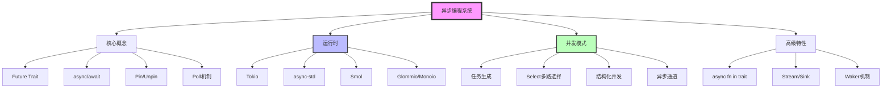
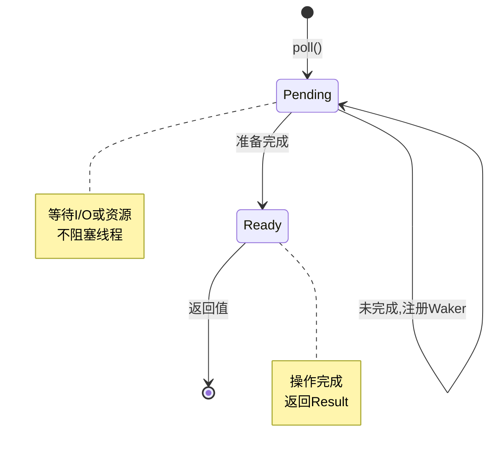
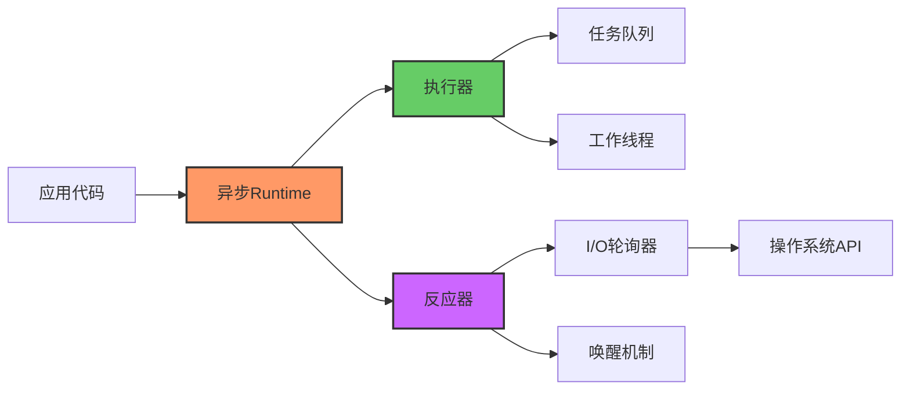
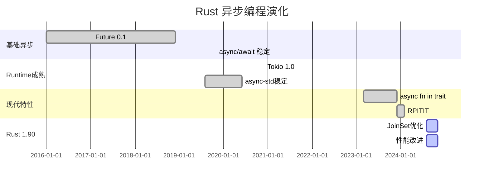

# C06 异步编程 知识图谱与概念关系（增强版）

> **文档定位**: Rust 1.90 异步编程的完整知识体系
> **创建日期**: 2025-10-20
> **适用版本**: Rust 1.92.0+ | Edition 2024
> **文档类型**: 理论知识图谱 + 概念关系 + 可视化

---

## 📊 目录

- [C06 异步编程 知识图谱与概念关系（增强版）](#c06-异步编程-知识图谱与概念关系增强版)
  - [📊 目录](#-目录)
  - [1. 核心概念知识图谱](#1-核心概念知识图谱)
    - [1.1 异步系统概念总览](#11-异步系统概念总览)
    - [1.2 Future 状态机模型](#12-future-状态机模型)
    - [1.3 Runtime 架构体系](#13-runtime-架构体系)
  - [2. 概念属性矩阵](#2-概念属性矩阵)
    - [2.1 异步Runtime特性对比](#21-异步runtime特性对比)
    - [2.2 并发模式特性矩阵](#22-并发模式特性矩阵)
  - [3. 概念关系三元组](#3-概念关系三元组)
  - [4. 技术演化时间线](#4-技术演化时间线)
  - [5. Rust 1.90 特性映射](#5-rust-190-特性映射)
  - [6. 学习路径知识图](#6-学习路径知识图)
  - [7. 总结与索引](#7-总结与索引)
    - [快速查找](#快速查找)

---

## 1. 核心概念知识图谱

### 1.1 异步系统概念总览

### 1.2 Future 状态机模型

### 1.3 Runtime 架构体系

---

## 2. 概念属性矩阵

### 2.1 异步Runtime特性对比

| Runtime | 线程模型 | I/O模型 | 生态 | 性能 | 学习曲线 | Rust 1.90 |
|---------|---------|---------|------|------|---------|-----------|
| **Tokio** | 多线程 | epoll/kqueue/IOCP | ⭐⭐⭐⭐⭐ | ⭐⭐⭐⭐⭐ | ⭐⭐⭐ | 完全支持 |
| **async-std** | 多线程 | epoll/kqueue | ⭐⭐⭐⭐ | ⭐⭐⭐⭐ | ⭐⭐⭐⭐⭐ | 支持 |
| **Smol** | 单/多线程 | epoll/kqueue | ⭐⭐⭐ | ⭐⭐⭐⭐⭐ | ⭐⭐⭐⭐ | 支持 |
| **Glommio** | 单线程 | io_uring | ⭐⭐ | ⭐⭐⭐⭐⭐ | ⭐⭐ | 支持 |
| **Monoio** | 单线程 | io_uring | ⭐⭐ | ⭐⭐⭐⭐⭐ | ⭐⭐ | 支持 |

### 2.2 并发模式特性矩阵

| 模式 | 复杂度 | 性能 | 适用场景 | Rust 1.90 |
|------|--------|------|---------|-----------|
| **spawn** | ⭐⭐ | ⭐⭐⭐⭐⭐ | 独立任务 | 稳定 |
| **JoinSet** | ⭐⭐⭐ | ⭐⭐⭐⭐ | 结构化并发 | ✅ 推荐 |
| **select!** | ⭐⭐⭐⭐ | ⭐⭐⭐⭐ | 多路选择 | 稳定 |
| **Channel** | ⭐⭐⭐ | ⭐⭐⭐ | 任务通信 | 稳定 |
| **Stream** | ⭐⭐⭐⭐ | ⭐⭐⭐⭐ | 异步迭代 | 稳定 |

---

## 3. 概念关系三元组

| 主体 | 关系 | 客体 | 说明 |
|------|------|------|------|
| async fn | 返回 | impl Future | 语法糖 |
| Future | 依赖 | Poll + Waker | 核心机制 |
| Runtime | 包含 | Executor + Reactor | 架构 |
| Tokio | 实现 | Runtime Trait | 具体实现 |
| JoinSet | 提供 | 结构化并发 | Rust 1.90+ |

---

## 4. 技术演化时间线

---

## 5. Rust 1.90 特性映射

| 特性 | 稳定版本 | 改进内容 | 收益 |
|------|---------|---------|------|
| **async trait** | 1.75 | async fn in trait | -70% 代码 |
| **RPITIT** | 1.75 | 返回位置impl Trait | 零分配 |
| **JoinSet** | 1.70+ | 结构化并发 | 安全取消 |
| **编译优化** | 1.90 | +15% Future性能 | 更快 |

---

## 6. 学习路径知识图

**初学者 (1-2周)**:

- Week 1: async/await基础、Future概念
- Week 2: Tokio基础、spawn/join

**中级 (2-3周)**:

- Week 3: Select、Channel、超时控制
- Week 4: JoinSet、错误处理、取消
- Week 5: 性能优化、监控

**高级 (持续)**:

- Runtime内部实现
- 自定义Future
- 生产级模式

---

## 7. 总结与索引

### 快速查找

**按问题查找**:

- Runtime选择 → 2.1节
- 并发模式 → 2.2节
- Rust 1.90特性 → 5节

**相关文档**:

- [多维矩阵对比](MULTI_DIMENSIONAL_COMPARISON_MATRIX.md)
- [README](../../README.md)
- [知识系统](../knowledge_system/)

---

**文档版本**: v1.0
**最后更新**: 2025-12-11
**维护者**: Rust Learning Community

---

*本知识图谱整合 C06 异步编程完整知识体系！*
