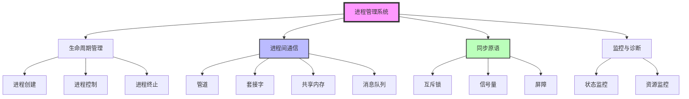
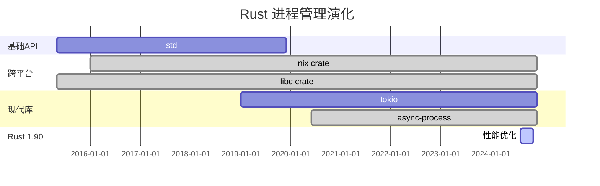

# C07 进程管理 知识图谱与概念关系（增强版）

> **文档定位**: Rust 1.90 进程管理与IPC的完整知识体系  
> **创建日期**: 2025-10-20  
> **适用版本**: Rust 1.90+ | Edition 2024  
> **文档类型**: 理论知识图谱 + 概念关系 + 可视化

---

## 📊 目录

- [C07 进程管理 知识图谱与概念关系（增强版）](#c07-进程管理-知识图谱与概念关系增强版)
  - [📊 目录](#-目录)
  - [1. 核心概念知识图谱](#1-核心概念知识图谱)
    - [进程管理系统总览](#进程管理系统总览)
  - [2. 概念属性矩阵](#2-概念属性矩阵)
    - [IPC机制对比](#ipc机制对比)
    - [同步原语对比](#同步原语对比)
  - [3. 技术演化与学习路径](#3-技术演化与学习路径)
    - [Rust进程管理演化](#rust进程管理演化)
    - [学习路径](#学习路径)
  - [4. 总结与索引](#4-总结与索引)
    - [快速查找](#快速查找)

---

## 1. 核心概念知识图谱

### 进程管理系统总览

---

## 2. 概念属性矩阵

### IPC机制对比

| 机制 | 跨平台 | 性能 | 容量 | 复杂度 | 适用场景 |
|------|--------|------|------|--------|---------|
| **Pipe** | ✅ | ⭐⭐⭐⭐⭐ | 小 | ⭐⭐ | 父子进程 |
| **Unix Socket** | ❌ Unix | ⭐⭐⭐⭐ | 中 | ⭐⭐⭐ | 本地IPC |
| **TCP Socket** | ✅ | ⭐⭐⭐ | 大 | ⭐⭐⭐⭐ | 网络通信 |
| **Shared Memory** | ⚠️ 部分 | ⭐⭐⭐⭐⭐ | 大 | ⭐⭐⭐⭐⭐ | 高性能IPC |
| **Message Queue** | ⚠️ 部分 | ⭐⭐⭐⭐ | 中 | ⭐⭐⭐ | 异步消息 |

### 同步原语对比

| 原语 | 跨进程 | 性能 | 适用场景 |
|------|--------|------|---------|
| **Mutex** | ✅ | ⭐⭐⭐⭐ | 互斥访问 |
| **Semaphore** | ✅ | ⭐⭐⭐⭐ | 资源计数 |
| **Barrier** | ✅ | ⭐⭐⭐ | 同步点 |
| **Condvar** | ⚠️ | ⭐⭐⭐ | 条件等待 |

---

## 3. 技术演化与学习路径

### Rust进程管理演化

### 学习路径

**初学者 (1-2周)**:

- Week 1: std::process 基础、Command 使用
- Week 2: 管道通信、进程控制

**中级 (2-3周)**:

- Week 3: IPC机制（Socket/Shared Memory）
- Week 4: 跨平台兼容性
- Week 5: 异步进程管理

**高级 (持续)**:

- 进程监控、资源管理
- 安全沙盒、容器化
- 生产级进程管理器

---

## 4. 总结与索引

### 快速查找

**按问题查找**:

- IPC选择 → 2节
- 同步原语 → 2节
- 跨平台方案 → 相关文档

**相关文档**:

- [多维矩阵对比](MULTI_DIMENSIONAL_COMPARISON_MATRIX.md)
- [README](../../README.md)
- [进程模型](../01_process_model_and_lifecycle.md)

---

**文档版本**: v1.0  
**最后更新**: 2025-10-20

---

*本知识图谱整合 C07 进程管理完整知识体系！*
