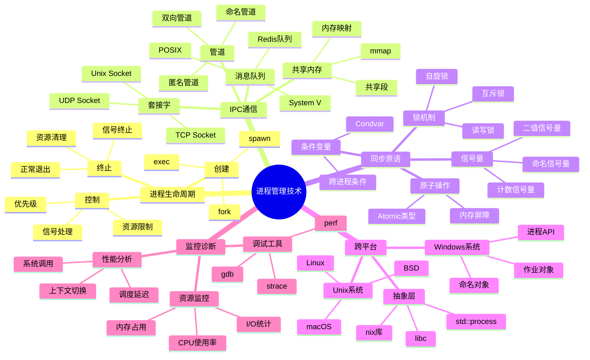
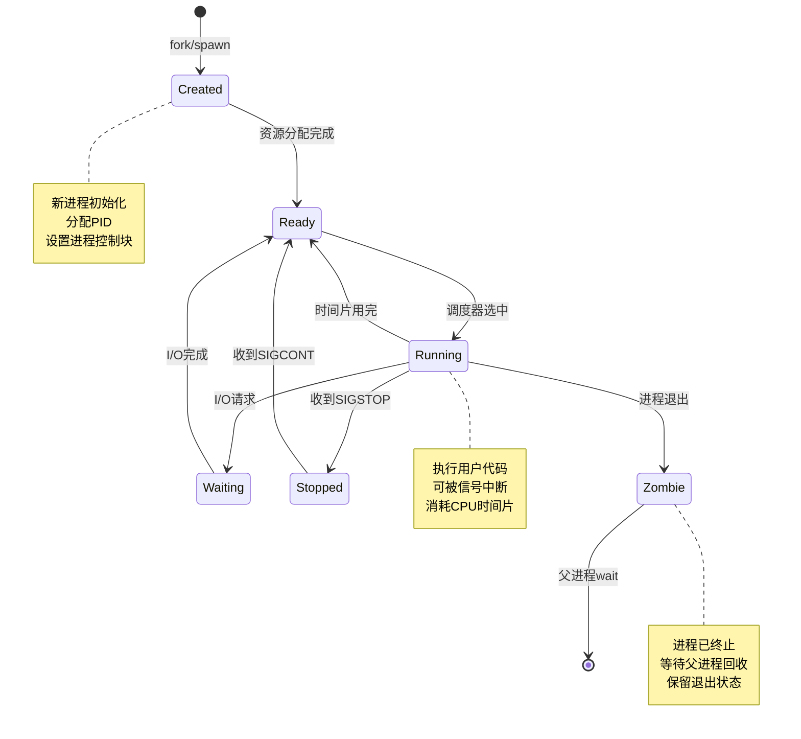
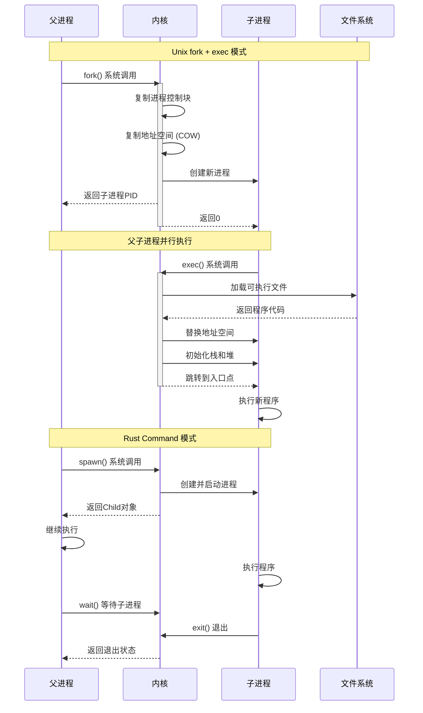
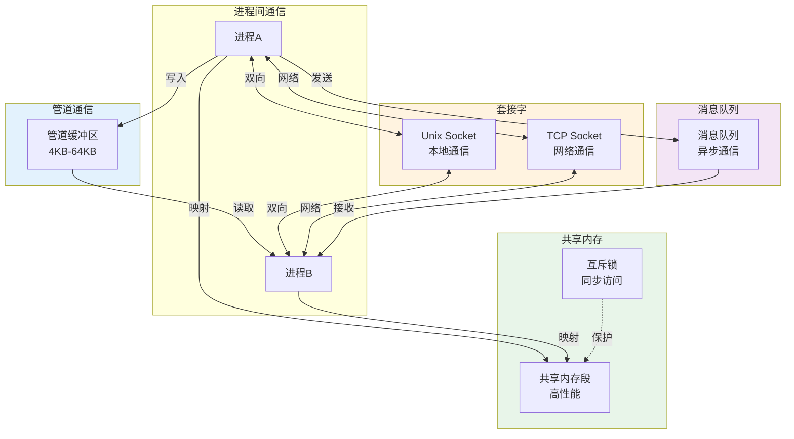
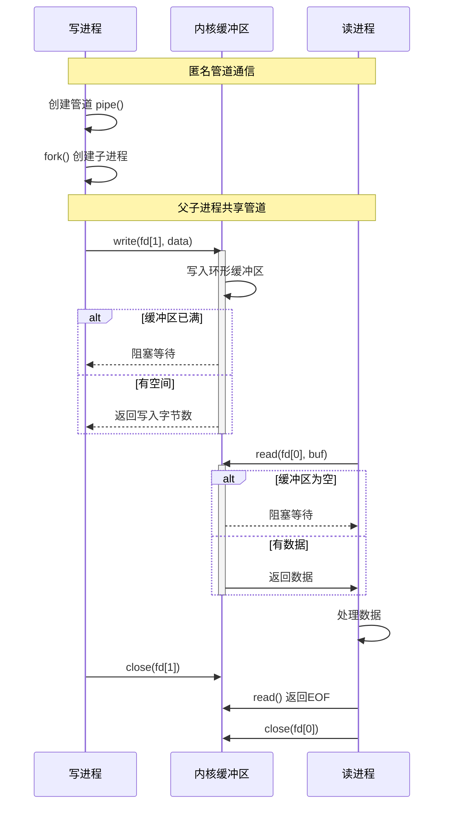
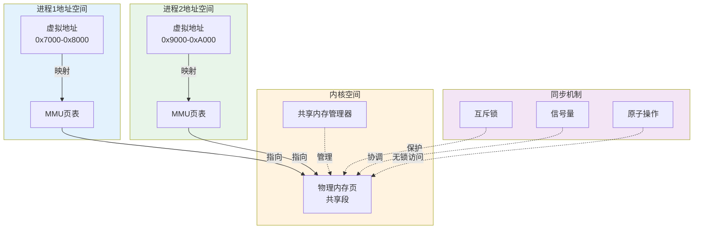
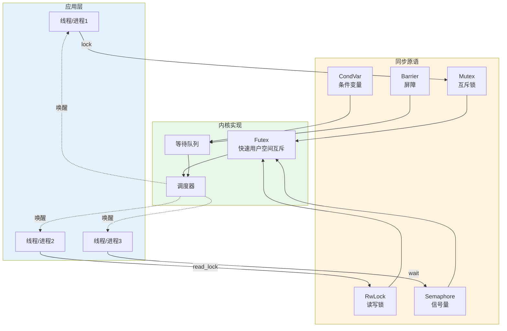
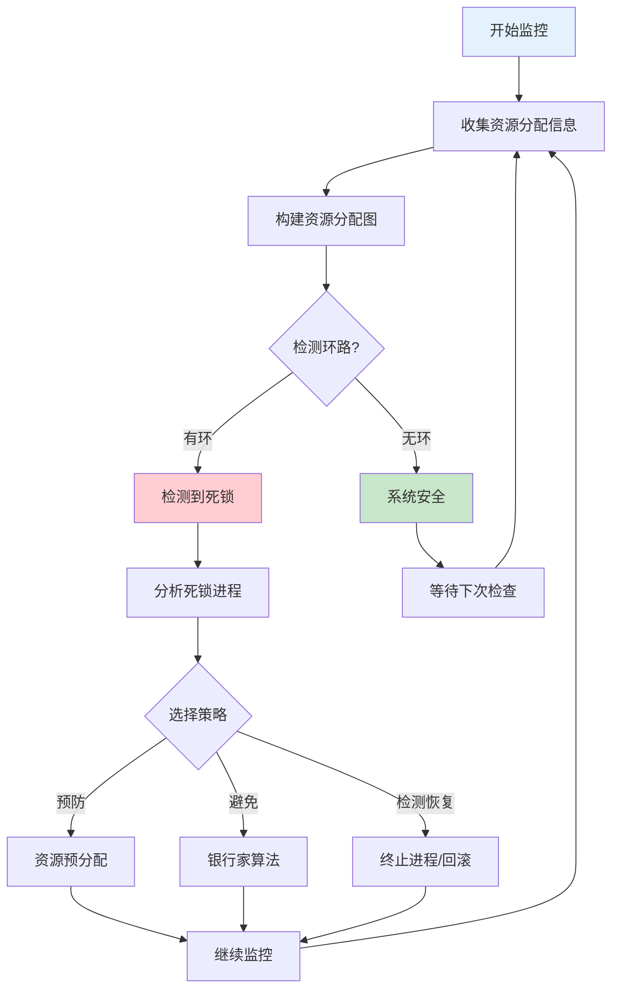
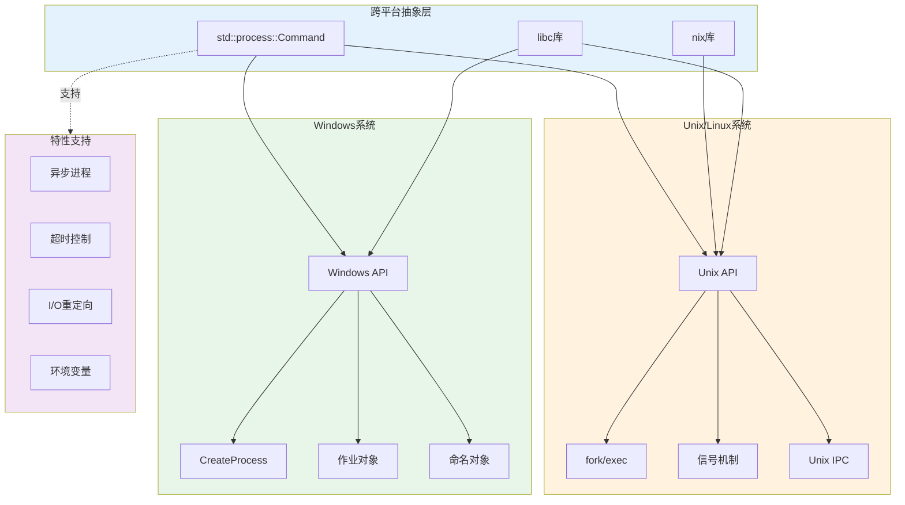
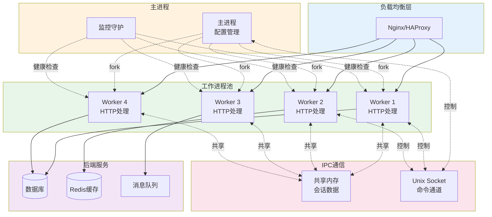

# C07 Process 进程管理思维导图与可视化

> **文档定位**: Rust 1.90 进程管理技术可视化学习  
> **创建日期**: 2025-10-20  
> **适用版本**: Rust 1.90+ | Edition 2024  
> **文档类型**: 思维导图 + 流程图 + 架构图

---

## 📊 目录

- [C07 Process 进程管理思维导图与可视化](#c07-process-进程管理思维导图与可视化)
  - [📊 目录](#-目录)
  - [1. 进程管理全景思维导图](#1-进程管理全景思维导图)
    - [技术栈总览](#技术栈总览)
  - [2. 进程生命周期图](#2-进程生命周期图)
    - [进程状态机](#进程状态机)
    - [进程创建流程](#进程创建流程)
  - [3. IPC架构图](#3-ipc架构图)
    - [IPC机制对比](#ipc机制对比)
    - [管道通信流程](#管道通信流程)
    - [共享内存架构](#共享内存架构)
  - [4. 同步与并发控制](#4-同步与并发控制)
    - [同步原语架构](#同步原语架构)
    - [死锁检测流程](#死锁检测流程)
  - [5. 跨平台进程管理](#5-跨平台进程管理)
    - [平台差异对比](#平台差异对比)
  - [6. 性能监控架构](#6-性能监控架构)
    - [进程监控系统](#进程监控系统)
  - [7. 实战部署架构](#7-实战部署架构)
    - [多进程应用架构](#多进程应用架构)
  - [相关文档](#相关文档)
  - [返回导航](#返回导航)

---

## 1. 进程管理全景思维导图

### 技术栈总览



---

## 2. 进程生命周期图

### 进程状态机



### 进程创建流程



---

## 3. IPC架构图

### IPC机制对比



### 管道通信流程



### 共享内存架构



---

## 4. 同步与并发控制

### 同步原语架构



### 死锁检测流程



---

## 5. 跨平台进程管理

### 平台差异对比



---

## 6. 性能监控架构

### 进程监控系统

```mermaid
graph TB
    subgraph Targets [监控目标]
        Proc1[进程1]
        Proc2[进程2]
        Proc3[进程3]
    end
    
    subgraph Collectors [数据收集]
        ProcFS[/proc文件系统]
        PerfEvents[perf_events]
        Syscalls[系统调用追踪]
    end
    
    subgraph Metrics [指标类型]
        CPU[CPU使用率<br/>用户态/内核态]
        Memory[内存占用<br/>RSS/VSZ]
        IO[I/O统计<br/>读/写字节]
        Context[上下文切换<br/>自愿/非自愿]
    end
    
    subgraph Storage [存储层]
        TimeSeries[时序数据库<br/>Prometheus]
        Logs[日志系统<br/>journald]
    end
    
    subgraph Visualization [可视化]
        Dashboard[Grafana仪表板]
        Alerts[告警系统]
    end
    
    Proc1 -.->|数据| ProcFS
    Proc2 -.->|数据| PerfEvents
    Proc3 -.->|数据| Syscalls
    
    ProcFS --> CPU
    ProcFS --> Memory
    PerfEvents --> CPU
    PerfEvents --> Context
    Syscalls --> IO
    
    CPU --> TimeSeries
    Memory --> TimeSeries
    IO --> TimeSeries
    Context --> Logs
    
    TimeSeries --> Dashboard
    TimeSeries --> Alerts
    Logs --> Dashboard
    
    style Targets fill:#e3f2fd
    style Collectors fill:#fff3e0
    style Metrics fill:#e8f5e9
    style Storage fill:#f3e5f5
    style Visualization fill:#fce4ec
```

---

## 7. 实战部署架构

### 多进程应用架构



---

## 相关文档

- [知识图谱](./KNOWLEDGE_GRAPH_AND_CONCEPT_RELATIONS.md)
- [多维对比](./MULTI_DIMENSIONAL_COMPARISON_MATRIX.md)
- [进程模型](../01_process_model_and_lifecycle.md)
- [IPC机制](../02_ipc_mechanisms.md)
- [FAQ](../FAQ.md)

---

**文档版本**: v1.0  
**最后更新**: 2025-10-20  
**维护者**: Rust-lang项目组

---

## 返回导航

- [返回主索引](../00_MASTER_INDEX.md)
- [返回README](../README.md)
- [查看教程](../practical_examples/)
