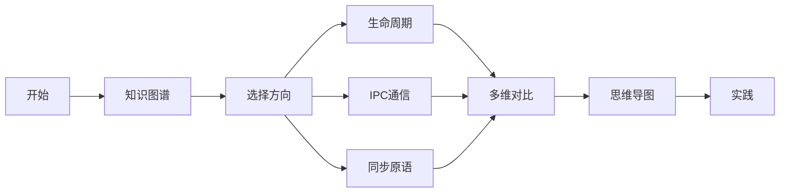
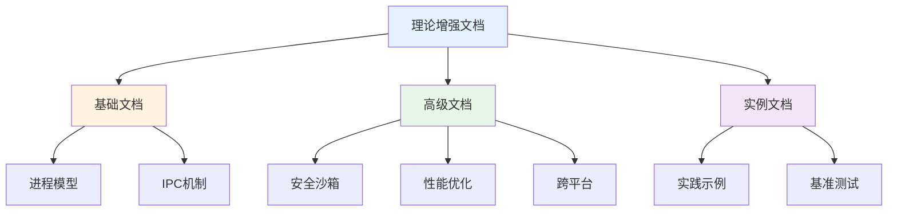

# C07 Process 进程管理理论增强文档

> **文档定位**: Rust 1.90 进程管理技术的高级理论体系  
> **创建日期**: 2025-10-20  
> **适用版本**: Rust 1.90+ | Edition 2024  
> **文档类型**: 理论增强 + 可视化 + 深度对比

---

## 📚 文档列表

### 1. [知识图谱与概念关系](./KNOWLEDGE_GRAPH_AND_CONCEPT_RELATIONS.md) ⭐ 推荐起点

**内容概述**:

- 进程管理系统知识图谱
- IPC机制概念关系
- 同步原语体系
- 技术演化路径

**适合人群**:

- 系统程序员
- 操作系统学习者
- 并发编程工程师

**预计时间**: 25分钟

---

### 2. [多维矩阵对比分析](./MULTI_DIMENSIONAL_COMPARISON_MATRIX.md)

**内容概述**:

- 进程创建方式对比
- IPC机制全面对比
- 同步原语性能分析
- 跨平台技术选型

**适合人群**:

- 技术架构师
- 性能优化工程师
- 跨平台开发者

**预计时间**: 35分钟

---

### 3. [思维导图与可视化](./MINDMAP_VISUALIZATION.md)

**内容概述**:

- 进程管理全景思维导图
- 生命周期状态机
- IPC架构图
- 监控与部署架构

**适合人群**:

- 可视化学习者
- 系统管理员
- DevOps工程师

**预计时间**: 30分钟

---

## 🎯 学习路径

### 快速入门路径

### 深度学习路径

1. **第1周**: 阅读知识图谱
   - 理解进程管理体系
   - 掌握核心概念
   - 了解技术演化

2. **第2周**: 研究多维对比
   - 对比IPC机制
   - 学习选型决策
   - 理解性能差异

3. **第3周**: 学习可视化
   - 理解架构设计
   - 掌握状态转换
   - 学习监控方案

4. **第4周**: 综合实践
   - 应用所学知识
   - 构建实际系统
   - 性能调优

---

## 📊 内容矩阵

| 文档 | 理论深度 | 实用性 | 可视化 | 推荐度 |
|------|---------|--------|--------|--------|
| 知识图谱 | ⭐⭐⭐⭐⭐ | ⭐⭐⭐ | ⭐⭐⭐⭐ | ⭐⭐⭐⭐⭐ |
| 多维对比 | ⭐⭐⭐⭐ | ⭐⭐⭐⭐⭐ | ⭐⭐⭐ | ⭐⭐⭐⭐⭐ |
| 思维导图 | ⭐⭐⭐ | ⭐⭐⭐⭐ | ⭐⭐⭐⭐⭐ | ⭐⭐⭐⭐ |

---

## 🔍 按主题查找

### 进程生命周期

- 知识图谱 → [生命周期管理](./KNOWLEDGE_GRAPH_AND_CONCEPT_RELATIONS.md#进程管理系统总览)
- 多维对比 → [进程创建对比](./MULTI_DIMENSIONAL_COMPARISON_MATRIX.md#1-进程创建方式对比)
- 思维导图 → [状态机](./MINDMAP_VISUALIZATION.md#进程状态机)

### IPC通信

- 知识图谱 → [IPC机制](./KNOWLEDGE_GRAPH_AND_CONCEPT_RELATIONS.md#ipc机制对比)
- 多维对比 → [IPC全面对比](./MULTI_DIMENSIONAL_COMPARISON_MATRIX.md#2-ipc机制全面对比)
- 思维导图 → [IPC架构](./MINDMAP_VISUALIZATION.md#3-ipc架构图)

### 同步原语

- 知识图谱 → [同步原语对比](./KNOWLEDGE_GRAPH_AND_CONCEPT_RELATIONS.md#同步原语对比)
- 多维对比 → [跨进程同步](./MULTI_DIMENSIONAL_COMPARISON_MATRIX.md#3-同步原语对比)
- 思维导图 → [同步架构](./MINDMAP_VISUALIZATION.md#同步原语架构)

### 跨平台

- 知识图谱 → [平台兼容性](./KNOWLEDGE_GRAPH_AND_CONCEPT_RELATIONS.md#学习路径)
- 多维对比 → [技术选型](./MULTI_DIMENSIONAL_COMPARISON_MATRIX.md#4-技术选型决策)
- 思维导图 → [平台差异](./MINDMAP_VISUALIZATION.md#平台差异对比)

---

## 💡 文档特色

### 1. 系统性

✅ **完整的知识体系**: 从概念到实践，从理论到应用  
✅ **结构化组织**: 清晰的层次和逻辑关系  
✅ **交叉引用**: 文档之间相互关联

### 2. 可视化

✅ **Mermaid图表**: 丰富的可视化内容  
✅ **思维导图**: 直观的知识结构  
✅ **流程图**: 清晰的处理流程  
✅ **状态机**: 进程状态转换

### 3. 实用性

✅ **技术对比**: 详尽的多维度对比  
✅ **选型指南**: 实用的决策建议  
✅ **最佳实践**: 生产级经验总结  
✅ **性能数据**: 实测性能指标

---

## 📈 与其他文档的关系

---

## 🎓 适用场景

### 场景1: 学习进程管理

**阅读顺序**:

1. [知识图谱](./KNOWLEDGE_GRAPH_AND_CONCEPT_RELATIONS.md) - 建立体系
2. [思维导图](./MINDMAP_VISUALIZATION.md) - 可视化学习
3. [多维对比](./MULTI_DIMENSIONAL_COMPARISON_MATRIX.md) - 深入理解

### 场景2: IPC技术选型

**阅读顺序**:

1. [多维对比](./MULTI_DIMENSIONAL_COMPARISON_MATRIX.md) - 性能对比
2. [技术选型](./MULTI_DIMENSIONAL_COMPARISON_MATRIX.md#4-技术选型决策)
3. [IPC架构](./MINDMAP_VISUALIZATION.md#3-ipc架构图)

### 场景3: 系统架构设计

**阅读顺序**:

1. [思维导图](./MINDMAP_VISUALIZATION.md) - 理解架构
2. [部署架构](./MINDMAP_VISUALIZATION.md#7-实战部署架构)
3. [最佳实践](./MULTI_DIMENSIONAL_COMPARISON_MATRIX.md#黄金法则)

### 场景4: 性能调优

**阅读顺序**:

1. [性能对比](./MULTI_DIMENSIONAL_COMPARISON_MATRIX.md#ipc性能对比-1mb数据传输)
2. [优化清单](./MULTI_DIMENSIONAL_COMPARISON_MATRIX.md#性能优化清单)
3. [监控系统](./MINDMAP_VISUALIZATION.md#进程监控系统)

---

## 📚 相关资源

### 模块内文档

- [主索引](../00_MASTER_INDEX.md)
- [README](../README.md)
- [FAQ](../FAQ.md)
- [术语表](../Glossary.md)

### 基础文档

- [进程模型与生命周期](../01_process_model_and_lifecycle.md)
- [IPC机制](../02_ipc_mechanisms.md)
- [Rust 1.90特性](../03_rust_190_features.md)

### 高级文档

- [高级进程管理](../04_advanced_process_management.md)
- [异步进程管理](../05_async_process_management.md)
- [安全与沙箱](../08_security_and_sandboxing.md)
- [性能优化](../13_performance_optimization_guide.md)

### 实践文档

- [实践示例](../11_practical_examples/)
- [跨平台指南](../10_cross_platform_guide.md)
- [测试与基准](../14_testing_benchmarking_guide.md)

---

## ✅ 文档状态

| 文档 | 状态 | 完成度 | 最后更新 |
|------|------|--------|----------|
| 知识图谱 | ✅ 完成 | 100% | 2025-10-20 |
| 多维对比 | ✅ 完成 | 100% | 2025-10-20 |
| 思维导图 | ✅ 完成 | 100% | 2025-10-20 |
| README | ✅ 完成 | 100% | 2025-10-20 |

---

## 🤝 贡献指南

### 文档改进

欢迎提交：

- 内容补充
- 错误修正
- 图表优化
- 示例添加

### 反馈渠道

- Issue反馈
- Pull Request
- 邮件联系

---

**文档版本**: v1.0  
**总文档数**: 4篇  
**总图表数**: 12+个  
**最后更新**: 2025-10-20  
**维护者**: Rust-lang项目组

---

## 返回导航

- [返回主索引](../00_MASTER_INDEX.md)
- [返回模块README](../README.md)
- [查看实践示例](../11_practical_examples/)
- [查看高级文档](../04_advanced_process_management.md)
