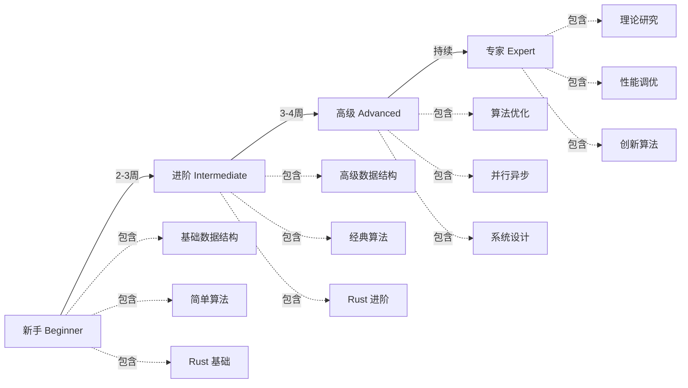

# 交互式算法学习指南 (Interactive Algorithm Learning Guide)

## 📊 目录

- [交互式算法学习指南 (Interactive Algorithm Learning Guide)](#交互式算法学习指南-interactive-algorithm-learning-guide)
  - [📊 目录](#-目录)
  - [🎯 学习目标与路径](#-学习目标与路径)
    - [学习阶段评估](#学习阶段评估)
  - [📖 第一阶段：基础入门 (2-3周)](#-第一阶段基础入门-2-3周)
    - [Week 1: 数组与排序](#week-1-数组与排序)
      - [Day 1-2: 数组基础](#day-1-2-数组基础)
      - [Day 3-4: 排序算法基础](#day-3-4-排序算法基础)
      - [Day 5-7: 二分搜索](#day-5-7-二分搜索)
    - [Week 2-3: 链表与递归](#week-2-3-链表与递归)
      - [Day 8-10: 链表基础](#day-8-10-链表基础)
  - [📊 进度追踪与评估](#-进度追踪与评估)
    - [自我评估表](#自我评估表)
    - [练习完成度追踪](#练习完成度追踪)
  - [🎮 互动挑战](#-互动挑战)
    - [Challenge 1: 排序竞赛](#challenge-1-排序竞赛)
    - [Challenge 2: 最短路径迷宫](#challenge-2-最短路径迷宫)
  - [📚 推荐学习资源](#-推荐学习资源)
    - [在线平台](#在线平台)
    - [书籍推荐](#书籍推荐)
    - [视频课程](#视频课程)
  - [🏆 学习成就系统](#-学习成就系统)

**版本**: 1.0.0
**Rust版本**: 1.92.0+
**创建日期**: 2025年10月19日
**最后更新**: 2025-12-11
**特性**: 渐进式学习 + 实践练习 + 自我评估

---

## 🎯 学习目标与路径

### 学习阶段评估



---

## 📖 第一阶段：基础入门 (2-3周)

### Week 1: 数组与排序

#### Day 1-2: 数组基础

**学习内容**:

- 数组的内存布局
- 时间复杂度分析
- Rust 中的 Vec 和切片

**实践任务**:

```rust
/// 练习 1.1: 实现数组反转
pub fn reverse_array<T>(arr: &mut [T]) {
    let len = arr.len();
    for i in 0..len / 2 {
        arr.swap(i, len - 1 - i);
    }
}

/// 练习 1.2: 找到数组中的最大值
pub fn find_max<T: Ord + Copy>(arr: &[T]) -> Option<T> {
    if arr.is_empty() {
        return None;
    }

    let mut max = arr[0];
    for &item in arr.iter().skip(1) {
        if item > max {
            max = item;
        }
    }

    Some(max)
}

/// 练习 1.3: 双指针 - 删除重复元素
pub fn remove_duplicates(nums: &mut Vec<i32>) -> usize {
    if nums.is_empty() {
        return 0;
    }

    let mut slow = 0;
    for fast in 1..nums.len() {
        if nums[fast] != nums[slow] {
            slow += 1;
            nums[slow] = nums[fast];
        }
    }

    slow + 1
}

#[cfg(test)]
mod week1_tests {
    use super::*;

    #[test]
    fn test_reverse_array() {
        let mut arr = vec![1, 2, 3, 4, 5];
        reverse_array(&mut arr);
        assert_eq!(arr, vec![5, 4, 3, 2, 1]);
    }

    #[test]
    fn test_find_max() {
        assert_eq!(find_max(&[1, 5, 3, 9, 2]), Some(9));
        assert_eq!(find_max::<i32>(&[]), None);
    }

    #[test]
    fn test_remove_duplicates() {
        let mut nums = vec![1, 1, 2, 2, 3, 3, 3, 4];
        let len = remove_duplicates(&mut nums);
        assert_eq!(len, 4);
        assert_eq!(&nums[..len], &[1, 2, 3, 4]);
    }
}
```

**自我检查**:

- [ ] 理解数组的 O(1) 访问时间
- [ ] 掌握双指针技巧
- [ ] 能独立实现上述三个函数
- [ ] 理解 Rust 的所有权和借用

#### Day 3-4: 排序算法基础

**学习内容**:

- 冒泡排序
- 选择排序
- 插入排序

**实践任务**:

```rust
/// 练习 1.4: 冒泡排序
pub fn bubble_sort<T: Ord>(arr: &mut [T]) {
    let len = arr.len();

    for i in 0..len {
        let mut swapped = false;

        for j in 0..len - 1 - i {
            if arr[j] > arr[j + 1] {
                arr.swap(j, j + 1);
                swapped = true;
            }
        }

        if !swapped {
            break; // 优化：已排序
        }
    }
}

/// 练习 1.5: 插入排序
pub fn insertion_sort<T: Ord>(arr: &mut [T]) {
    for i in 1..arr.len() {
        let mut j = i;
        while j > 0 && arr[j] < arr[j - 1] {
            arr.swap(j, j - 1);
            j -= 1;
        }
    }
}

/// 练习 1.6: 计算排序算法的比较次数
pub fn bubble_sort_with_stats<T: Ord>(arr: &mut [T]) -> (usize, usize) {
    let mut comparisons = 0;
    let mut swaps = 0;
    let len = arr.len();

    for i in 0..len {
        for j in 0..len - 1 - i {
            comparisons += 1;
            if arr[j] > arr[j + 1] {
                arr.swap(j, j + 1);
                swaps += 1;
            }
        }
    }

    (comparisons, swaps)
}

#[cfg(test)]
mod sorting_tests {
    use super::*;

    #[test]
    fn test_bubble_sort() {
        let mut arr = vec![64, 34, 25, 12, 22, 11, 90];
        bubble_sort(&mut arr);
        assert_eq!(arr, vec![11, 12, 22, 25, 34, 64, 90]);
    }

    #[test]
    fn test_insertion_sort() {
        let mut arr = vec![64, 34, 25, 12, 22, 11, 90];
        insertion_sort(&mut arr);
        assert_eq!(arr, vec![11, 12, 22, 25, 34, 64, 90]);
    }

    #[test]
    fn test_bubble_sort_stats() {
        let mut arr = vec![3, 1, 2];
        let (comparisons, swaps) = bubble_sort_with_stats(&mut arr);
        assert_eq!(arr, vec![1, 2, 3]);
        println!("Comparisons: {}, Swaps: {}", comparisons, swaps);
    }
}
```

**自我检查**:

- [ ] 能说出三种排序算法的时间复杂度
- [ ] 理解稳定排序的概念
- [ ] 知道何时使用插入排序（小数据、近似有序）
- [ ] 能绘制排序过程的示意图

#### Day 5-7: 二分搜索

**学习内容**:

- 二分搜索原理
- 边界处理
- 二分搜索变体

**实践任务**:

```rust
/// 练习 1.7: 标准二分搜索
pub fn binary_search<T: Ord>(arr: &[T], target: &T) -> Option<usize> {
    let mut left = 0;
    let mut right = arr.len();

    while left < right {
        let mid = left + (right - left) / 2;

        match arr[mid].cmp(target) {
            std::cmp::Ordering::Equal => return Some(mid),
            std::cmp::Ordering::Less => left = mid + 1,
            std::cmp::Ordering::Greater => right = mid,
        }
    }

    None
}

/// 练习 1.8: 查找第一个大于等于 target 的元素
pub fn lower_bound<T: Ord>(arr: &[T], target: &T) -> usize {
    let mut left = 0;
    let mut right = arr.len();

    while left < right {
        let mid = left + (right - left) / 2;

        if arr[mid] < *target {
            left = mid + 1;
        } else {
            right = mid;
        }
    }

    left
}

/// 练习 1.9: 查找峰值元素
pub fn find_peak_element(nums: &[i32]) -> Option<usize> {
    if nums.is_empty() {
        return None;
    }

    let mut left = 0;
    let mut right = nums.len() - 1;

    while left < right {
        let mid = left + (right - left) / 2;

        if nums[mid] < nums[mid + 1] {
            left = mid + 1;
        } else {
            right = mid;
        }
    }

    Some(left)
}

#[cfg(test)]
mod search_tests {
    use super::*;

    #[test]
    fn test_binary_search() {
        let arr = vec![1, 2, 3, 4, 5, 6, 7, 8, 9];
        assert_eq!(binary_search(&arr, &5), Some(4));
        assert_eq!(binary_search(&arr, &10), None);
    }

    #[test]
    fn test_lower_bound() {
        let arr = vec![1, 2, 2, 2, 3, 4, 5];
        assert_eq!(lower_bound(&arr, &2), 1);
        assert_eq!(lower_bound(&arr, &0), 0);
        assert_eq!(lower_bound(&arr, &6), 7);
    }

    #[test]
    fn test_find_peak() {
        assert_eq!(find_peak_element(&[1, 2, 3, 1]), Some(2));
        assert_eq!(find_peak_element(&[1, 2, 1, 3, 5, 6, 4]), Some(5));
    }
}
```

**自我检查**:

- [ ] 能正确处理二分搜索的边界条件
- [ ] 理解 lower_bound 和 upper_bound 的区别
- [ ] 能识别可以用二分搜索优化的问题
- [ ] 掌握 Rust 的 match 表达式

---

### Week 2-3: 链表与递归

#### Day 8-10: 链表基础

**学习内容**:

- 单链表、双向链表
- Rust 中的链表实现
- 链表常见操作

**实践任务**:

```rust
use std::rc::Rc;
use std::cell::RefCell;

/// 单链表节点
#[derive(Debug, Clone)]
pub struct ListNode<T> {
    pub val: T,
    pub next: Option<Box<ListNode<T>>>,
}

impl<T> ListNode<T> {
    pub fn new(val: T) -> Self {
        ListNode { val, next: None }
    }
}

/// 练习 2.1: 反转链表
pub fn reverse_list<T>(head: Option<Box<ListNode<T>>>) -> Option<Box<ListNode<T>>> {
    let mut prev = None;
    let mut curr = head;

    while let Some(mut node) = curr {
        let next = node.next.take();
        node.next = prev;
        prev = Some(node);
        curr = next;
    }

    prev
}

/// 练习 2.2: 检测链表环
pub fn has_cycle<T>(head: &Option<Box<ListNode<T>>>) -> bool {
    let mut slow = head;
    let mut fast = head;

    while let (Some(s), Some(f)) = (slow, fast) {
        slow = &s.next;

        if let Some(ff) = &f.next {
            fast = &ff.next;
        } else {
            return false;
        }

        // 比较指针地址
        if std::ptr::eq(
            slow.as_ref().map(|b| &**b).unwrap_or(&std::ptr::null()),
            fast.as_ref().map(|b| &**b).unwrap_or(&std::ptr::null())
        ) && slow.is_some() {
            return true;
        }
    }

    false
}

/// 练习 2.3: 合并两个有序链表
pub fn merge_two_lists<T: Ord>(
    list1: Option<Box<ListNode<T>>>,
    list2: Option<Box<ListNode<T>>>,
) -> Option<Box<ListNode<T>>> {
    match (list1, list2) {
        (None, None) => None,
        (Some(n), None) | (None, Some(n)) => Some(n),
        (Some(mut l1), Some(mut l2)) => {
            if l1.val < l2.val {
                l1.next = merge_two_lists(l1.next, Some(l2));
                Some(l1)
            } else {
                l2.next = merge_two_lists(Some(l1), l2.next);
                Some(l2)
            }
        }
    }
}

#[cfg(test)]
mod list_tests {
    use super::*;

    fn create_list(values: &[i32]) -> Option<Box<ListNode<i32>>> {
        let mut head = None;
        for &val in values.iter().rev() {
            let mut node = Box::new(ListNode::new(val));
            node.next = head;
            head = Some(node);
        }
        head
    }

    fn list_to_vec<T: Clone>(head: &Option<Box<ListNode<T>>>) -> Vec<T> {
        let mut result = Vec::new();
        let mut curr = head;

        while let Some(node) = curr {
            result.push(node.val.clone());
            curr = &node.next;
        }

        result
    }

    #[test]
    fn test_reverse_list() {
        let list = create_list(&[1, 2, 3, 4, 5]);
        let reversed = reverse_list(list);
        assert_eq!(list_to_vec(&reversed), vec![5, 4, 3, 2, 1]);
    }

    #[test]
    fn test_merge_two_lists() {
        let list1 = create_list(&[1, 2, 4]);
        let list2 = create_list(&[1, 3, 4]);
        let merged = merge_two_lists(list1, list2);
        assert_eq!(list_to_vec(&merged), vec![1, 1, 2, 3, 4, 4]);
    }
}
```

**自我检查**:

- [ ] 理解 Rust 中的 Box 和 Option
- [ ] 能处理链表的所有权转移
- [ ] 掌握快慢指针技巧
- [ ] 能用递归和迭代两种方式实现链表操作

---

## 📊 进度追踪与评估

### 自我评估表

| 知识点   | 理解程度   | 实践完成 | 需要改进   |
| :--- | :--- | :--- | :--- |
| 数组操作 | ⭐⭐⭐⭐⭐ | ✅       |            |
| 排序算法 | ⭐⭐⭐⭐   | ✅       |            |
| 二分搜索 | ⭐⭐⭐     | ✅       | 边界处理   |
| 链表操作 | ⭐⭐       | 🔄       | 所有权理解 |

### 练习完成度追踪

```rust
/// 学习进度追踪系统
#[derive(Debug, Clone)]
pub struct LearningProgress {
    pub topic: String,
    pub exercises_completed: usize,
    pub exercises_total: usize,
    pub difficulty_rating: u8, // 1-5
    pub time_spent: std::time::Duration,
}

impl LearningProgress {
    pub fn completion_rate(&self) -> f64 {
        if self.exercises_total == 0 {
            return 0.0;
        }
        (self.exercises_completed as f64 / self.exercises_total as f64) * 100.0
    }

    pub fn is_completed(&self) -> bool {
        self.exercises_completed >= self.exercises_total
    }
}

pub struct LearningTracker {
    progress: Vec<LearningProgress>,
}

impl LearningTracker {
    pub fn new() -> Self {
        Self {
            progress: vec![
                LearningProgress {
                    topic: "Week 1: Arrays & Sorting".to_string(),
                    exercises_completed: 0,
                    exercises_total: 9,
                    difficulty_rating: 2,
                    time_spent: std::time::Duration::from_secs(0),
                },
                LearningProgress {
                    topic: "Week 2-3: Linked Lists & Recursion".to_string(),
                    exercises_completed: 0,
                    exercises_total: 8,
                    difficulty_rating: 3,
                    time_spent: std::time::Duration::from_secs(0),
                },
            ],
        }
    }

    pub fn mark_exercise_complete(&mut self, week: usize, time_spent: std::time::Duration) {
        if let Some(progress) = self.progress.get_mut(week) {
            if progress.exercises_completed < progress.exercises_total {
                progress.exercises_completed += 1;
                progress.time_spent += time_spent;
            }
        }
    }

    pub fn get_overall_progress(&self) -> f64 {
        let total_completed: usize = self.progress.iter()
            .map(|p| p.exercises_completed)
            .sum();
        let total_exercises: usize = self.progress.iter()
            .map(|p| p.exercises_total)
            .sum();

        if total_exercises == 0 {
            return 0.0;
        }

        (total_completed as f64 / total_exercises as f64) * 100.0
    }

    pub fn print_report(&self) {
        println!("\n=== Learning Progress Report ===");
        for progress in &self.progress {
            println!("\n{}", progress.topic);
            println!("  Completion: {}/{} ({:.1}%)",
                progress.exercises_completed,
                progress.exercises_total,
                progress.completion_rate()
            );
            println!("  Difficulty: {}/5", progress.difficulty_rating);
            println!("  Time spent: {:?}", progress.time_spent);
            println!("  Status: {}",
                if progress.is_completed() { "✅ Complete" } else { "🔄 In Progress" }
            );
        }
        println!("\nOverall Progress: {:.1}%", self.get_overall_progress());
    }
}

#[cfg(test)]
mod tracker_tests {
    use super::*;

    #[test]
    fn test_learning_tracker() {
        let mut tracker = LearningTracker::new();

        // 完成一些练习
        tracker.mark_exercise_complete(0, std::time::Duration::from_secs(300));
        tracker.mark_exercise_complete(0, std::time::Duration::from_secs(450));

        assert!(tracker.get_overall_progress() > 0.0);
        assert!(tracker.progress[0].exercises_completed == 2);
    }
}
```

---

## 🎮 互动挑战

### Challenge 1: 排序竞赛

实现一个排序算法，要求：

1. 时间复杂度不超过 O(n log n)
2. 必须是稳定排序
3. 空间复杂度尽可能小
4. 通过所有测试用例

```rust
pub fn your_sort_algorithm<T: Ord + Clone>(arr: &mut [T]) {
    // TODO: 实现你的排序算法
    todo!()
}

#[cfg(test)]
mod challenge_tests {
    use super::*;

    #[test]
    fn challenge_1_basic() {
        let mut arr = vec![3, 1, 4, 1, 5, 9, 2, 6, 5];
        your_sort_algorithm(&mut arr);
        assert_eq!(arr, vec![1, 1, 2, 3, 4, 5, 5, 6, 9]);
    }

    #[test]
    fn challenge_1_large() {
        let mut arr: Vec<i32> = (0..10000).rev().collect();
        your_sort_algorithm(&mut arr);
        assert!(arr.windows(2).all(|w| w[0] <= w[1]));
    }
}
```

### Challenge 2: 最短路径迷宫

实现迷宫最短路径算法：

```rust
pub fn solve_maze(maze: &[Vec<char>], start: (usize, usize), end: (usize, usize)) -> Option<Vec<(usize, usize)>> {
    // TODO: 实现BFS找最短路径
    // '.' 表示可通行
    // '#' 表示墙壁
    // 返回从start到end的最短路径
    todo!()
}

#[cfg(test)]
mod maze_tests {
    use super::*;

    #[test]
    fn test_simple_maze() {
        let maze = vec![
            vec!['.', '.', '.', '.', '.'],
            vec!['.', '#', '#', '#', '.'],
            vec!['.', '.', '.', '#', '.'],
            vec!['.', '#', '.', '.', '.'],
            vec!['.', '.', '.', '.', '.'],
        ];

        let path = solve_maze(&maze, (0, 0), (4, 4));
        assert!(path.is_some());

        let path = path.unwrap();
        assert_eq!(path.first(), Some(&(0, 0)));
        assert_eq!(path.last(), Some(&(4, 4)));
    }
}
```

---

## 📚 推荐学习资源

### 在线平台

1. [LeetCode](https://leetcode.com/) - 算法练习
2. [Exercism Rust Track](https://exercism.org/tracks/rust) - Rust 练习
3. [Rustlings](https://github.com/rust-lang/rustlings) - 小型 Rust 练习

### 书籍推荐

1. **The Algorithm Design Manual** - Steven S. Skiena
2. **Introduction to Algorithms (CLRS)** - Thomas H. Cormen 等
3. **Programming Rust** - Jim Blandy & Jason Orendorff

### 视频课程

1. [MIT 6.006 Introduction to Algorithms](https://ocw.mit.edu/courses/6-006-introduction-to-algorithms-fall-2011/)
2. [Stanford Algorithms Specialization](https://www.coursera.org/specializations/algorithms)

---

## 🏆 学习成就系统

```rust
#[derive(Debug, Clone, Copy, PartialEq, Eq)]
pub enum Achievement {
    FirstSort,          // 完成第一个排序算法
    MasterOfSearch,     // 掌握所有搜索算法
    GraphExplorer,      // 完成图算法章节
    DPNinja,            // 动态规划高手
    ParallelPro,        // 并行编程专家
    AsyncMaster,        // 异步编程大师
}

impl Achievement {
    pub fn description(&self) -> &'static str {
        match self {
            Achievement::FirstSort => "完成你的第一个排序算法",
            Achievement::MasterOfSearch => "掌握所有搜索算法",
            Achievement::GraphExplorer => "完成图算法章节",
            Achievement::DPNinja => "成为动态规划高手",
            Achievement::ParallelPro => "掌握并行编程",
            Achievement::AsyncMaster => "精通异步编程",
        }
    }

    pub fn points(&self) -> u32 {
        match self {
            Achievement::FirstSort => 10,
            Achievement::MasterOfSearch => 25,
            Achievement::GraphExplorer => 50,
            Achievement::DPNinja => 75,
            Achievement::ParallelPro => 100,
            Achievement::AsyncMaster => 100,
        }
    }
}

pub struct AchievementSystem {
    unlocked: std::collections::HashSet<Achievement>,
}

impl AchievementSystem {
    pub fn new() -> Self {
        Self {
            unlocked: std::collections::HashSet::new(),
        }
    }

    pub fn unlock(&mut self, achievement: Achievement) -> bool {
        self.unlocked.insert(achievement)
    }

    pub fn total_points(&self) -> u32 {
        self.unlocked.iter().map(|a| a.points()).sum()
    }

    pub fn print_achievements(&self) {
        println!("\n🏆 Unlocked Achievements:");
        for achievement in &self.unlocked {
            println!("  ✅ {} - {} points", achievement.description(), achievement.points());
        }
        println!("\nTotal Points: {}", self.total_points());
    }
}
```

---

**继续学习**: 完成基础阶段后，进入[第二阶段：进阶学习](#-第二阶段进阶学习)

---

**最后更新**: 2025年10月19日
**文档版本**: 1.0.0
**维护者**: c08_algorithms 团队
