# 算法知识图谱系统 (Algorithm Knowledge Graph)

**版本**: 1.0.0  
**Rust版本**: 1.90.0  
**创建日期**: 2025年10月19日  
**特性**: 知识图谱 + 关系网络 + 概念映射

---

## 📊 知识图谱概览

本文档构建了一个完整的算法知识图谱，展示算法之间的关系、依赖、演化路径和应用场景。

```mermaid
graph TB
    %% 核心概念层
    Algorithm[算法核心]
    DataStructure[数据结构]
    Complexity[复杂度理论]
    Paradigm[设计范式]
    
    %% 算法范式分类
    Algorithm --> DivideConquer[分治法]
    Algorithm --> DynamicProgramming[动态规划]
    Algorithm --> Greedy[贪心算法]
    Algorithm --> Backtracking[回溯算法]
    Algorithm --> BranchBound[分支限界]
    
    %% 数据结构分类
    DataStructure --> Linear[线性结构]
    DataStructure --> Tree[树形结构]
    DataStructure --> Graph[图结构]
    DataStructure --> Hash[散列结构]
    
    %% 线性结构细分
    Linear --> Array[数组]
    Linear --> LinkedList[链表]
    Linear --> Stack[栈]
    Linear --> Queue[队列]
    
    %% 树形结构细分
    Tree --> BinaryTree[二叉树]
    Tree --> BST[二叉搜索树]
    Tree --> AVL[AVL树]
    Tree --> RedBlack[红黑树]
    Tree --> BTree[B树]
    Tree --> Heap[堆]
    
    %% 图结构细分
    Graph --> DirectedGraph[有向图]
    Graph --> UndirectedGraph[无向图]
    Graph --> WeightedGraph[加权图]
    Graph --> DAG[有向无环图]
    
    %% 算法与数据结构关系
    DivideConquer -.uses.-> Array
    DynamicProgramming -.uses.-> Array
    Greedy -.uses.-> Heap
    Backtracking -.uses.-> Stack
    
    %% 复杂度关系
    Complexity --> TimeComplexity[时间复杂度]
    Complexity --> SpaceComplexity[空间复杂度]
    
    style Algorithm fill:#ff6b6b
    style DataStructure fill:#4ecdc4
    style Complexity fill:#45b7d1
    style Paradigm fill:#96ceb4
```



---

## 🎯 算法分类知识图谱

### 1. 排序算法知识图谱

```mermaid
graph LR
    Sorting[排序算法] --> Comparison[比较排序]
    Sorting --> NonComparison[非比较排序]
    
    %% 比较排序分支
    Comparison --> Simple[简单排序 O-n²]
    Comparison --> Advanced[高级排序 O-n_log_n]
    
    Simple --> BubbleSort[冒泡排序]
    Simple --> SelectionSort[选择排序]
    Simple --> InsertionSort[插入排序]
    
    Advanced --> MergeSort[归并排序]
    Advanced --> QuickSort[快速排序]
    Advanced --> HeapSort[堆排序]
    
    %% 非比较排序分支
    NonComparison --> CountingSort[计数排序 O-n+k]
    NonComparison --> RadixSort[基数排序 O-d×n+k]
    NonComparison --> BucketSort[桶排序 O-n+k]
    
    %% Rust 1.90 特性应用
    MergeSort -.async.-> AsyncMerge[异步归并]
    QuickSort -.parallel.-> ParallelQuick[并行快排]
    HeapSort -.const_generic.-> GenericHeap[泛型堆排序]
    
    %% 算法关系
    MergeSort -->|分治思想| DivideConquer
    QuickSort -->|分治思想| DivideConquer
    HeapSort -->|使用| HeapStructure[堆数据结构]
    
    style Sorting fill:#ff6b6b
    style Comparison fill:#4ecdc4
    style NonComparison fill:#45b7d1
    style AsyncMerge fill:#ffd93d
    style ParallelQuick fill:#ffd93d
```



#### Rust 1.90 排序算法实现示例

```rust
use std::cmp::Ordering;

/// 归并排序 - 展示 Rust 1.90 const generic 特性
pub fn merge_sort_generic<T: Ord + Clone, const N: usize>(arr: &mut [T; N]) {
    if arr.len() <= 1 {
        return;
    }
    
    let mid = arr.len() / 2;
    let mut left = arr[..mid].to_vec();
    let mut right = arr[mid..].to_vec();
    
    merge_sort_slice(&mut left);
    merge_sort_slice(&mut right);
    
    merge(arr, &left, &right);
}

fn merge_sort_slice<T: Ord + Clone>(arr: &mut [T]) {
    if arr.len() <= 1 {
        return;
    }
    
    let mid = arr.len() / 2;
    let mut left = arr[..mid].to_vec();
    let mut right = arr[mid..].to_vec();
    
    merge_sort_slice(&mut left);
    merge_sort_slice(&mut right);
    
    merge(arr, &left, &right);
}

fn merge<T: Ord + Clone>(arr: &mut [T], left: &[T], right: &[T]) {
    let (mut i, mut j, mut k) = (0, 0, 0);
    
    while i < left.len() && j < right.len() {
        if left[i] <= right[j] {
            arr[k] = left[i].clone();
            i += 1;
        } else {
            arr[k] = right[j].clone();
            j += 1;
        }
        k += 1;
    }
    
    while i < left.len() {
        arr[k] = left[i].clone();
        i += 1;
        k += 1;
    }
    
    while j < right.len() {
        arr[k] = right[j].clone();
        j += 1;
        k += 1;
    }
}

/// 异步归并排序 - Rust 1.90 async fn in trait
pub trait AsyncSort {
    async fn sort_async(&mut self) -> Result<(), Box<dyn std::error::Error + Send + Sync>>;
}

impl<T: Ord + Clone + Send + Sync> AsyncSort for Vec<T> {
    async fn sort_async(&mut self) -> Result<(), Box<dyn std::error::Error + Send + Sync>> {
        if self.len() <= 1 {
            return Ok(());
        }
        
        let mid = self.len() / 2;
        let mut left = self[..mid].to_vec();
        let mut right = self[mid..].to_vec();
        
        // 并行异步排序
        let (left_res, right_res) = tokio::join!(
            async { merge_sort_slice(&mut left); Ok::<_, Box<dyn std::error::Error + Send + Sync>>(()) },
            async { merge_sort_slice(&mut right); Ok::<_, Box<dyn std::error::Error + Send + Sync>>(()) }
        );
        
        left_res?;
        right_res?;
        
        merge(self, &left, &right);
        Ok(())
    }
}

/// 并行快速排序 - 使用 rayon
pub fn quick_sort_parallel<T: Ord + Send>(arr: &mut [T]) {
    use rayon::prelude::*;
    
    if arr.len() <= 1 {
        return;
    }
    
    if arr.len() < 1000 {
        // 小数组使用串行排序
        arr.sort_unstable();
        return;
    }
    
    let pivot_idx = partition(arr);
    let (left, right) = arr.split_at_mut(pivot_idx);
    
    rayon::join(
        || quick_sort_parallel(left),
        || quick_sort_parallel(&mut right[1..])
    );
}

fn partition<T: Ord>(arr: &mut [T]) -> usize {
    let len = arr.len();
    let pivot_idx = len / 2;
    arr.swap(pivot_idx, len - 1);
    
    let mut i = 0;
    for j in 0..len - 1 {
        if arr[j] <= arr[len - 1] {
            arr.swap(i, j);
            i += 1;
        }
    }
    
    arr.swap(i, len - 1);
    i
}

#[cfg(test)]
mod tests {
    use super::*;
    
    #[test]
    fn test_merge_sort_generic() {
        let mut arr = [64, 34, 25, 12, 22, 11, 90];
        merge_sort_generic(&mut arr);
        assert_eq!(arr, [11, 12, 22, 25, 34, 64, 90]);
    }
    
    #[tokio::test]
    async fn test_async_sort() {
        let mut vec = vec![64, 34, 25, 12, 22, 11, 90];
        vec.sort_async().await.unwrap();
        assert_eq!(vec, vec![11, 12, 22, 25, 34, 64, 90]);
    }
    
    #[test]
    fn test_parallel_quick_sort() {
        let mut arr = vec![64, 34, 25, 12, 22, 11, 90];
        quick_sort_parallel(&mut arr);
        assert_eq!(arr, vec![11, 12, 22, 25, 34, 64, 90]);
    }
}
```

---

### 2. 图算法知识图谱

```mermaid
graph TB
    GraphAlgo[图算法] --> Traversal[遍历算法]
    GraphAlgo --> ShortestPath[最短路径]
    GraphAlgo --> MST[最小生成树]
    GraphAlgo --> Connectivity[连通性]
    GraphAlgo --> Matching[匹配算法]
    GraphAlgo --> Flow[网络流]
    
    %% 遍历算法
    Traversal --> DFS[深度优先 DFS]
    Traversal --> BFS[广度优先 BFS]
    
    %% 最短路径
    ShortestPath --> Dijkstra[Dijkstra O-E+V_log_V]
    ShortestPath --> BellmanFord[Bellman-Ford O-VE]
    ShortestPath --> Floyd[Floyd-Warshall O-V³]
    ShortestPath --> SPFA[SPFA 平均O-kE]
    ShortestPath --> AStar[A* 启发式搜索]
    
    %% 最小生成树
    MST --> Prim[Prim O-E+V_log_V]
    MST --> Kruskal[Kruskal O-E_log_E]
    
    %% 连通性
    Connectivity --> Tarjan[Tarjan 强连通分量]
    Connectivity --> Kosaraju[Kosaraju 强连通分量]
    Connectivity --> UnionFind[并查集]
    
    %% 网络流
    Flow --> FordFulkerson[Ford-Fulkerson]
    Flow --> EdmondsKarp[Edmonds-Karp]
    Flow --> Dinic[Dinic O-V²E]
    
    %% 数据结构依赖
    Dijkstra -.uses.-> PriorityQueue[优先队列]
    Prim -.uses.-> PriorityQueue
    Kruskal -.uses.-> UnionFind
    BFS -.uses.-> QueueStructure[队列]
    DFS -.uses.-> StackStructure[栈]
    
    %% Rust 1.90 特性
    Dijkstra -.async.-> AsyncDijkstra[异步 Dijkstra]
    BFS -.parallel.-> ParallelBFS[并行 BFS]
    
    style GraphAlgo fill:#ff6b6b
    style ShortestPath fill:#4ecdc4
    style MST fill:#45b7d1
    style Flow fill:#96ceb4
```



#### Rust 1.90 图算法实现示例

```rust
use std::collections::{HashMap, BinaryHeap, VecDeque};
use std::cmp::Ordering;

/// 图的边表示
#[derive(Debug, Clone)]
pub struct Edge<V, W> {
    pub to: V,
    pub weight: W,
}

/// Dijkstra 算法节点
#[derive(Debug, Clone, Eq, PartialEq)]
struct DijkstraNode<V, W> {
    vertex: V,
    distance: W,
}

impl<V: Eq, W: Ord> Ord for DijkstraNode<V, W> {
    fn cmp(&self, other: &Self) -> Ordering {
        other.distance.cmp(&self.distance)
    }
}

impl<V: Eq, W: Ord> PartialOrd for DijkstraNode<V, W> {
    fn partial_cmp(&self, other: &Self) -> Option<Ordering> {
        Some(self.cmp(other))
    }
}

/// Dijkstra 最短路径 - Rust 1.90 泛型约束
pub fn dijkstra<V, W>(
    graph: &HashMap<V, Vec<Edge<V, W>>>,
    start: V,
) -> HashMap<V, W>
where
    V: Eq + std::hash::Hash + Clone,
    W: Ord + Clone + Default + std::ops::Add<Output = W>,
{
    let mut distances: HashMap<V, W> = HashMap::new();
    let mut heap = BinaryHeap::new();
    
    distances.insert(start.clone(), W::default());
    heap.push(DijkstraNode {
        vertex: start,
        distance: W::default(),
    });
    
    while let Some(DijkstraNode { vertex, distance }) = heap.pop() {
        if let Some(&ref current_dist) = distances.get(&vertex) {
            if distance > current_dist.clone() {
                continue;
            }
        }
        
        if let Some(neighbors) = graph.get(&vertex) {
            for edge in neighbors {
                let new_distance = distance.clone() + edge.weight.clone();
                
                let is_shorter = distances
                    .get(&edge.to)
                    .map_or(true, |&ref d| new_distance < d.clone());
                
                if is_shorter {
                    distances.insert(edge.to.clone(), new_distance.clone());
                    heap.push(DijkstraNode {
                        vertex: edge.to.clone(),
                        distance: new_distance,
                    });
                }
            }
        }
    }
    
    distances
}

/// 异步 Dijkstra - 展示 async fn in trait (Rust 1.90)
pub trait AsyncGraph<V, W> {
    async fn shortest_path(&self, start: V, end: V) -> Option<(Vec<V>, W)>;
}

pub struct AsyncGraphImpl<V, W> {
    pub adjacency_list: HashMap<V, Vec<Edge<V, W>>>,
}

impl<V, W> AsyncGraph<V, W> for AsyncGraphImpl<V, W>
where
    V: Eq + std::hash::Hash + Clone + Send + Sync + 'static,
    W: Ord + Clone + Default + std::ops::Add<Output = W> + Send + Sync + 'static,
{
    async fn shortest_path(&self, start: V, end: V) -> Option<(Vec<V>, W)> {
        // 模拟异步操作（如从远程加载图数据）
        tokio::time::sleep(tokio::time::Duration::from_micros(1)).await;
        
        let distances = dijkstra(&self.adjacency_list, start.clone());
        
        distances.get(&end).map(|dist| {
            // 简化版：只返回距离，实际应该重构路径
            (vec![start, end], dist.clone())
        })
    }
}

/// BFS 广度优先搜索
pub fn bfs<V>(
    graph: &HashMap<V, Vec<V>>,
    start: V,
) -> Vec<V>
where
    V: Eq + std::hash::Hash + Clone,
{
    let mut visited = std::collections::HashSet::new();
    let mut queue = VecDeque::new();
    let mut result = Vec::new();
    
    queue.push_back(start.clone());
    visited.insert(start);
    
    while let Some(vertex) = queue.pop_front() {
        result.push(vertex.clone());
        
        if let Some(neighbors) = graph.get(&vertex) {
            for neighbor in neighbors {
                if visited.insert(neighbor.clone()) {
                    queue.push_back(neighbor.clone());
                }
            }
        }
    }
    
    result
}

/// 并行 BFS - 使用 rayon
pub fn parallel_bfs<V>(
    graph: &HashMap<V, Vec<V>>,
    start: V,
) -> Vec<V>
where
    V: Eq + std::hash::Hash + Clone + Send + Sync,
{
    use rayon::prelude::*;
    use std::sync::{Arc, Mutex};
    
    let visited = Arc::new(Mutex::new(std::collections::HashSet::new()));
    let result = Arc::new(Mutex::new(Vec::new()));
    
    let mut current_level = vec![start.clone()];
    visited.lock().unwrap().insert(start);
    
    while !current_level.is_empty() {
        // 处理当前层
        result.lock().unwrap().extend(current_level.clone());
        
        // 并行获取下一层
        let next_level: Vec<V> = current_level
            .par_iter()
            .flat_map(|vertex| {
                graph.get(vertex).map(|neighbors| {
                    neighbors
                        .iter()
                        .filter(|n| {
                            let mut v = visited.lock().unwrap();
                            v.insert((*n).clone())
                        })
                        .cloned()
                        .collect::<Vec<_>>()
                }).unwrap_or_default()
            })
            .collect();
        
        current_level = next_level;
    }
    
    Arc::try_unwrap(result).unwrap().into_inner().unwrap()
}

/// 并查集 (Union-Find) - 路径压缩 + 按秩合并
pub struct UnionFind {
    parent: Vec<usize>,
    rank: Vec<usize>,
}

impl UnionFind {
    pub fn new(size: usize) -> Self {
        Self {
            parent: (0..size).collect(),
            rank: vec![0; size],
        }
    }
    
    pub fn find(&mut self, x: usize) -> usize {
        if self.parent[x] != x {
            self.parent[x] = self.find(self.parent[x]); // 路径压缩
        }
        self.parent[x]
    }
    
    pub fn union(&mut self, x: usize, y: usize) -> bool {
        let root_x = self.find(x);
        let root_y = self.find(y);
        
        if root_x == root_y {
            return false;
        }
        
        // 按秩合并
        match self.rank[root_x].cmp(&self.rank[root_y]) {
            Ordering::Less => self.parent[root_x] = root_y,
            Ordering::Greater => self.parent[root_y] = root_x,
            Ordering::Equal => {
                self.parent[root_y] = root_x;
                self.rank[root_x] += 1;
            }
        }
        
        true
    }
    
    pub fn connected(&mut self, x: usize, y: usize) -> bool {
        self.find(x) == self.find(y)
    }
}

/// Kruskal 最小生成树
pub fn kruskal(n: usize, mut edges: Vec<(usize, usize, i32)>) -> (i32, Vec<(usize, usize)>) {
    // 按权重排序
    edges.sort_by_key(|e| e.2);
    
    let mut uf = UnionFind::new(n);
    let mut mst = Vec::new();
    let mut total_weight = 0;
    
    for (u, v, w) in edges {
        if uf.union(u, v) {
            mst.push((u, v));
            total_weight += w;
            
            if mst.len() == n - 1 {
                break;
            }
        }
    }
    
    (total_weight, mst)
}

#[cfg(test)]
mod tests {
    use super::*;
    
    #[test]
    fn test_dijkstra() {
        let mut graph = HashMap::new();
        graph.insert("A", vec![
            Edge { to: "B", weight: 4 },
            Edge { to: "C", weight: 2 },
        ]);
        graph.insert("B", vec![
            Edge { to: "D", weight: 5 },
        ]);
        graph.insert("C", vec![
            Edge { to: "B", weight: 1 },
            Edge { to: "D", weight: 8 },
        ]);
        graph.insert("D", vec![]);
        
        let distances = dijkstra(&graph, "A");
        assert_eq!(distances.get("D"), Some(&7));
    }
    
    #[tokio::test]
    async fn test_async_dijkstra() {
        let mut graph_data = HashMap::new();
        graph_data.insert("A", vec![
            Edge { to: "B", weight: 4 },
            Edge { to: "C", weight: 2 },
        ]);
        graph_data.insert("B", vec![
            Edge { to: "D", weight: 5 },
        ]);
        graph_data.insert("C", vec![
            Edge { to: "B", weight: 1 },
            Edge { to: "D", weight: 8 },
        ]);
        graph_data.insert("D", vec![]);
        
        let graph = AsyncGraphImpl {
            adjacency_list: graph_data,
        };
        
        let result = graph.shortest_path("A", "D").await;
        assert!(result.is_some());
        let (_, distance) = result.unwrap();
        assert_eq!(distance, 7);
    }
    
    #[test]
    fn test_kruskal() {
        let edges = vec![
            (0, 1, 10),
            (0, 2, 6),
            (0, 3, 5),
            (1, 3, 15),
            (2, 3, 4),
        ];
        
        let (total_weight, mst) = kruskal(4, edges);
        assert_eq!(total_weight, 19);
        assert_eq!(mst.len(), 3);
    }
}
```

---

### 3. 动态规划知识图谱

```mermaid
graph TB
    DP[动态规划] --> Linear[线性DP]
    DP --> Interval[区间DP]
    DP --> Tree[树形DP]
    DP --> State[状态压缩DP]
    DP --> Digit[数位DP]
    DP --> Probability[概率DP]
    
    %% 线性DP
    Linear --> LCS[最长公共子序列]
    Linear --> LIS[最长递增子序列]
    Linear --> EditDistance[编辑距离]
    Linear --> Knapsack[背包问题]
    
    %% 背包问题细分
    Knapsack --> Knapsack01[0-1背包]
    Knapsack --> KnapsackComplete[完全背包]
    Knapsack --> KnapsackMultiple[多重背包]
    Knapsack --> KnapsackGrouped[分组背包]
    
    %% 区间DP
    Interval --> MatrixChain[矩阵链乘]
    Interval --> StoneGame[石子合并]
    
    %% 状态压缩DP
    State --> TSP[旅行商问题]
    State --> Assignment[指派问题]
    
    %% 优化技术
    DP --> Optimization[优化技术]
    Optimization --> ScrollArray[滚动数组]
    Optimization --> MonotonicQueue[单调队列]
    Optimization --> SlopeOptimization[斜率优化]
    
    %% Rust 1.90 特性
    LCS -.parallel.-> ParallelLCS[并行LCS]
    Knapsack01 -.async.-> AsyncKnapsack[异步背包]
    
    style DP fill:#ff6b6b
    style Linear fill:#4ecdc4
    style Interval fill:#45b7d1
    style State fill:#96ceb4
```



#### Rust 1.90 动态规划实现示例

```rust
/// 最长公共子序列 (LCS) - 标准实现
pub fn lcs(text1: &str, text2: &str) -> usize {
    let m = text1.len();
    let n = text2.len();
    let text1: Vec<char> = text1.chars().collect();
    let text2: Vec<char> = text2.chars().collect();
    
    let mut dp = vec![vec![0; n + 1]; m + 1];
    
    for i in 1..=m {
        for j in 1..=n {
            if text1[i - 1] == text2[j - 1] {
                dp[i][j] = dp[i - 1][j - 1] + 1;
            } else {
                dp[i][j] = dp[i - 1][j].max(dp[i][j - 1]);
            }
        }
    }
    
    dp[m][n]
}

/// LCS - 滚动数组优化 (空间 O(n))
pub fn lcs_optimized(text1: &str, text2: &str) -> usize {
    let text1: Vec<char> = text1.chars().collect();
    let text2: Vec<char> = text2.chars().collect();
    let (m, n) = (text1.len(), text2.len());
    
    let mut prev = vec![0; n + 1];
    let mut curr = vec![0; n + 1];
    
    for i in 1..=m {
        for j in 1..=n {
            if text1[i - 1] == text2[j - 1] {
                curr[j] = prev[j - 1] + 1;
            } else {
                curr[j] = prev[j].max(curr[j - 1]);
            }
        }
        std::mem::swap(&mut prev, &mut curr);
    }
    
    prev[n]
}

/// 并行 LCS - 使用 rayon 加速大规模计算
pub fn lcs_parallel(text1: &str, text2: &str) -> usize {
    use rayon::prelude::*;
    
    if text1.len() < 1000 || text2.len() < 1000 {
        return lcs(text1, text2);
    }
    
    let mid = text1.len() / 2;
    let (left, right) = text1.split_at(mid);
    
    // 并行计算两部分
    let (lcs_left, lcs_right) = rayon::join(
        || lcs(left, text2),
        || lcs(right, text2)
    );
    
    lcs_left.max(lcs_right)
}

/// 0-1 背包问题
pub fn knapsack_01(weights: &[i32], values: &[i32], capacity: i32) -> i32 {
    let n = weights.len();
    let cap = capacity as usize;
    let mut dp = vec![vec![0; cap + 1]; n + 1];
    
    for i in 1..=n {
        for w in 0..=cap {
            if weights[i - 1] as usize <= w {
                dp[i][w] = dp[i - 1][w].max(
                    dp[i - 1][w - weights[i - 1] as usize] + values[i - 1]
                );
            } else {
                dp[i][w] = dp[i - 1][w];
            }
        }
    }
    
    dp[n][cap]
}

/// 0-1 背包 - 滚动数组优化
pub fn knapsack_01_optimized(weights: &[i32], values: &[i32], capacity: i32) -> i32 {
    let cap = capacity as usize;
    let mut dp = vec![0; cap + 1];
    
    for i in 0..weights.len() {
        // 倒序遍历避免重复使用
        for w in (weights[i] as usize..=cap).rev() {
            dp[w] = dp[w].max(dp[w - weights[i] as usize] + values[i]);
        }
    }
    
    dp[cap]
}

/// 完全背包问题
pub fn knapsack_complete(weights: &[i32], values: &[i32], capacity: i32) -> i32 {
    let cap = capacity as usize;
    let mut dp = vec![0; cap + 1];
    
    for i in 0..weights.len() {
        // 正序遍历允许重复使用
        for w in weights[i] as usize..=cap {
            dp[w] = dp[w].max(dp[w - weights[i] as usize] + values[i]);
        }
    }
    
    dp[cap]
}

/// 异步 0-1 背包 - 展示 async/await (适用于大规模或远程数据)
pub async fn knapsack_01_async(
    weights: Vec<i32>,
    values: Vec<i32>,
    capacity: i32,
) -> Result<i32, Box<dyn std::error::Error + Send + Sync>> {
    // 模拟异步数据加载
    tokio::time::sleep(tokio::time::Duration::from_micros(1)).await;
    
    let result = tokio::task::spawn_blocking(move || {
        knapsack_01_optimized(&weights, &values, capacity)
    }).await?;
    
    Ok(result)
}

/// 编辑距离 (Levenshtein Distance)
pub fn edit_distance(word1: &str, word2: &str) -> usize {
    let m = word1.len();
    let n = word2.len();
    let word1: Vec<char> = word1.chars().collect();
    let word2: Vec<char> = word2.chars().collect();
    
    let mut dp = vec![vec![0; n + 1]; m + 1];
    
    // 初始化
    for i in 0..=m {
        dp[i][0] = i;
    }
    for j in 0..=n {
        dp[0][j] = j;
    }
    
    // 动态规划
    for i in 1..=m {
        for j in 1..=n {
            if word1[i - 1] == word2[j - 1] {
                dp[i][j] = dp[i - 1][j - 1];
            } else {
                dp[i][j] = 1 + dp[i - 1][j]     // 删除
                    .min(dp[i][j - 1])           // 插入
                    .min(dp[i - 1][j - 1]);      // 替换
            }
        }
    }
    
    dp[m][n]
}

/// 最长递增子序列 (LIS) - O(n log n)
pub fn lis(nums: &[i32]) -> usize {
    let mut tails = Vec::new();
    
    for &num in nums {
        match tails.binary_search(&num) {
            Ok(_) => {} // 已存在
            Err(pos) => {
                if pos < tails.len() {
                    tails[pos] = num;
                } else {
                    tails.push(num);
                }
            }
        }
    }
    
    tails.len()
}

#[cfg(test)]
mod tests {
    use super::*;
    
    #[test]
    fn test_lcs() {
        assert_eq!(lcs("ABCBDAB", "BDCABA"), 4); // "BCBA" or "BDAB"
        assert_eq!(lcs_optimized("ABCBDAB", "BDCABA"), 4);
    }
    
    #[test]
    fn test_knapsack() {
        let weights = vec![2, 2, 6, 5, 4];
        let values = vec![6, 3, 5, 4, 6];
        assert_eq!(knapsack_01(&weights, &values, 10), 15);
        assert_eq!(knapsack_01_optimized(&weights, &values, 10), 15);
    }
    
    #[tokio::test]
    async fn test_knapsack_async() {
        let weights = vec![2, 2, 6, 5, 4];
        let values = vec![6, 3, 5, 4, 6];
        let result = knapsack_01_async(weights, values, 10).await.unwrap();
        assert_eq!(result, 15);
    }
    
    #[test]
    fn test_edit_distance() {
        assert_eq!(edit_distance("horse", "ros"), 3);
        assert_eq!(edit_distance("intention", "execution"), 5);
    }
    
    #[test]
    fn test_lis() {
        assert_eq!(lis(&[10, 9, 2, 5, 3, 7, 101, 18]), 4);
        assert_eq!(lis(&[0, 1, 0, 3, 2, 3]), 4);
    }
}
```

---

## 🔄 算法演化与关系

### 排序算法演化图

```mermaid
timeline
    title 排序算法演化史
    
    1950s : 冒泡排序
          : 插入排序
          : 选择排序
    
    1960s : 快速排序 (Hoare)
          : 堆排序 (Williams)
    
    1970s : 归并排序优化
    
    1980s : 桶排序
          : 计数排序
    
    1990s : 基数排序
          : Tim Sort (Python)
    
    2000s : 并行排序算法
    
    2020s : Rust std::sort (Pattern-defeating Quicksort)
          : 异步排序
```



### 图算法依赖关系

```mermaid
graph LR
    subgraph 基础
    A[BFS/DFS]
    B[并查集]
    C[优先队列]
    end
    
    subgraph 中级
    D[Dijkstra]
    E[Kruskal]
    F[Prim]
    G[拓扑排序]
    end
    
    subgraph 高级
    H[Floyd-Warshall]
    I[Bellman-Ford]
    J[网络流]
    K[二分图匹配]
    end
    
    A --> D
    A --> G
    C --> D
    C --> F
    B --> E
    D --> I
    A --> H
    G --> J
    A --> K
```

---

## 📊 算法应用场景映射

| 算法类别 | 核心算法 | 应用场景 | Rust 1.90 特性 | 时间复杂度 |
|---------|---------|---------|---------------|-----------|
| **排序** | 快速排序 | 通用排序、Top-K | 并行化 `rayon::join` | O(n log n) |
| | 归并排序 | 稳定排序、外部排序 | `async fn in trait` | O(n log n) |
| | 堆排序 | 优先级队列 | `const generics` | O(n log n) |
| **搜索** | 二分搜索 | 有序数据查找 | `Option::is_some_and` | O(log n) |
| | BFS | 最短路径、层次遍历 | 并行层处理 | O(V + E) |
| | DFS | 拓扑排序、连通性 | 栈优化 | O(V + E) |
| **图论** | Dijkstra | 单源最短路径 | `async fn in trait` | O(E + V log V) |
| | Floyd-Warshall | 全源最短路径 | 并行化 | O(V³) |
| | Kruskal | 最小生成树 | 并查集优化 | O(E log E) |
| **动态规划** | LCS | 文本相似度、diff | 滚动数组 | O(mn) |
| | 0-1背包 | 资源分配 | `async task` | O(nW) |
| | 编辑距离 | 拼写检查 | SIMD 加速 | O(mn) |
| **字符串** | KMP | 模式匹配 | `const generics` | O(m + n) |
| | Aho-Corasick | 多模式匹配 | Trie + 状态机 | O(n + m + z) |

---

## 🧠 认知维度映射

### 算法理解的五个层次

```mermaid
graph TB
    L1[层次1: 使用 Use] --> L2[层次2: 理解 Understand]
    L2 --> L3[层次3: 分析 Analyze]
    L3 --> L4[层次4: 优化 Optimize]
    L4 --> L5[层次5: 创新 Innovate]
    
    L1 -.示例.-> U1[会调用 sort 函数]
    L2 -.示例.-> U2[理解快排原理]
    L3 -.示例.-> U3[分析时间复杂度]
    L4 -.示例.-> U4[三路快排优化]
    L5 -.示例.-> U5[发明新算法]
    
    style L1 fill:#e8f5e9
    style L2 fill:#c8e6c9
    style L3 fill:#a5d6a7
    style L4 fill:#81c784
    style L5 fill:#66bb6a
```



---

## 🎯 学习路径知识图谱

```mermaid
graph TD
    Start[开始学习算法] --> Foundation[基础数据结构]
    
    Foundation --> Array[数组与链表]
    Foundation --> StackQueue[栈与队列]
    Foundation --> TreeBasic[二叉树]
    
    Array --> Sorting[排序算法]
    StackQueue --> Recursion[递归与回溯]
    TreeBasic --> TreeAdvanced[高级树结构]
    
    Sorting --> BasicAlgo[基础算法]
    Recursion --> DivideConquer[分治算法]
    TreeAdvanced --> GraphBasic[图基础]
    
    BasicAlgo --> Search[搜索算法]
    DivideConquer --> DP[动态规划]
    GraphBasic --> GraphAdvanced[高级图算法]
    
    Search --> String[字符串算法]
    DP --> Greedy[贪心算法]
    GraphAdvanced --> NetworkFlow[网络流]
    
    String --> Advanced[高级专题]
    Greedy --> Advanced
    NetworkFlow --> Advanced
    
    Advanced --> Parallel[并行算法]
    Advanced --> Async[异步算法]
    Advanced --> Optimization[性能优化]
    
    Parallel --> Master[算法大师]
    Async --> Master
    Optimization --> Master
    
    style Start fill:#ff6b6b
    style Foundation fill:#4ecdc4
    style BasicAlgo fill:#45b7d1
    style Advanced fill:#96ceb4
    style Master fill:#ffd93d
```



---

## 📚 参考资源

- [Rust Algorithm Club](https://rust-algo.club/)
- [The Algorithm Design Manual](https://www.algorist.com/)
- [Introduction to Algorithms (CLRS)](https://mitpress.mit.edu/books/introduction-algorithms-fourth-edition)
- [Rust Performance Book](https://nnethercote.github.io/perf-book/)

---

**最后更新**: 2025年10月19日  
**文档版本**: 1.0.0  
**维护者**: c08_algorithms 团队

