# 算法学习思维导图 (Algorithm Learning Mind Map)

## 📊 目录

- [算法学习思维导图 (Algorithm Learning Mind Map)](#算法学习思维导图-algorithm-learning-mind-map)
  - [📊 目录](#-目录)
  - [🧠 总体知识架构思维导图](#-总体知识架构思维导图)
  - [📚 排序算法思维导图](#-排序算法思维导图)
  - [🌲 图算法思维导图](#-图算法思维导图)
  - [💡 动态规划思维导图](#-动态规划思维导图)
  - [🔤 字符串算法思维导图](#-字符串算法思维导图)
  - [🚀 学习路径思维导图](#-学习路径思维导图)
  - [🎯 问题分类思维导图](#-问题分类思维导图)
  - [🔧 Rust 特性应用思维导图](#-rust-特性应用思维导图)
  - [📊 复杂度分析思维导图](#-复杂度分析思维导图)
  - [🎓 核心概念关联图](#-核心概念关联图)
  - [📱 实战应用场景思维导图](#-实战应用场景思维导图)
  - [🏆 竞赛编程思维导图](#-竞赛编程思维导图)
  - [📚 参考资源](#-参考资源)

**版本**: 1.0.0
**Rust版本**: 1.90.0
**创建日期**: 2025年10月19日
**特性**: 思维导图 + 学习路径 + 知识关联

---

## 🧠 总体知识架构思维导图

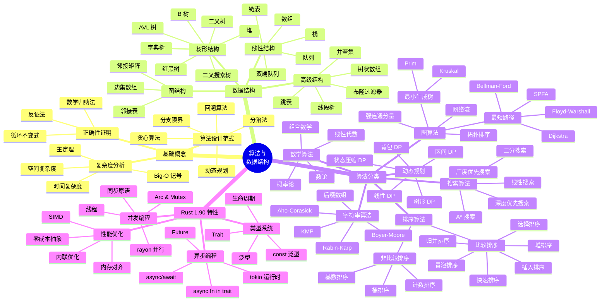

---

## 📚 排序算法思维导图

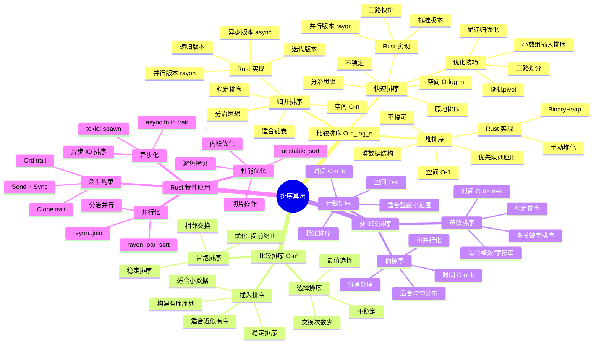

---

## 🌲 图算法思维导图

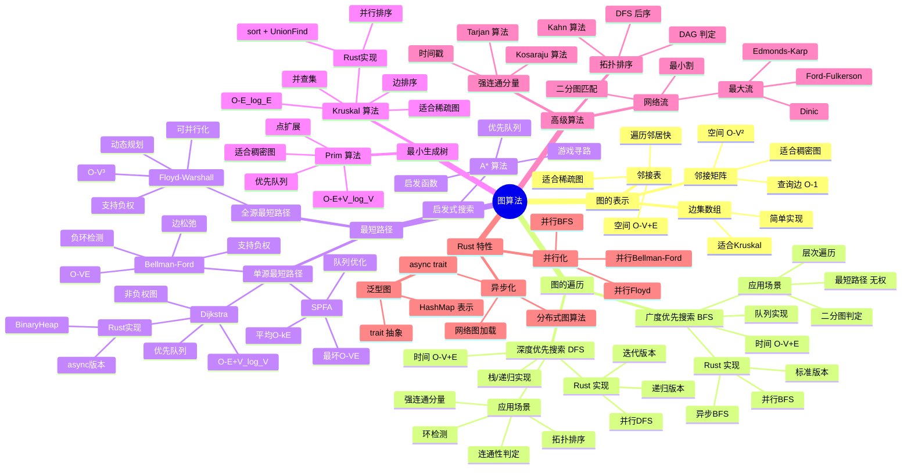

---

## 💡 动态规划思维导图

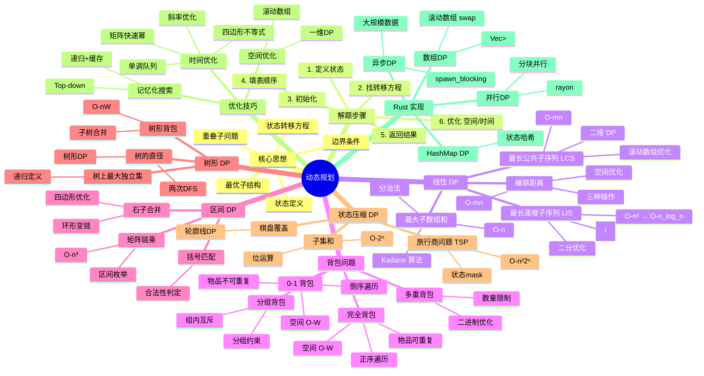

---

## 🔤 字符串算法思维导图

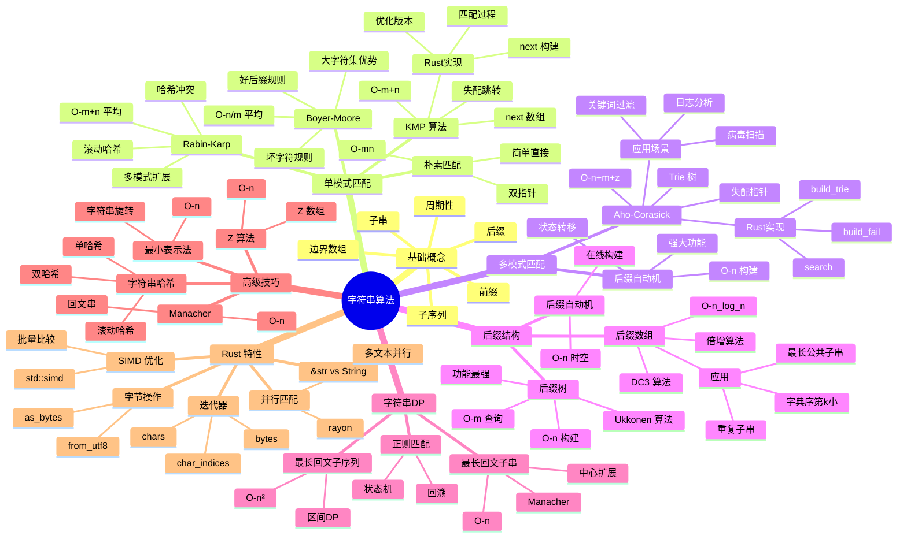

---

## 🚀 学习路径思维导图

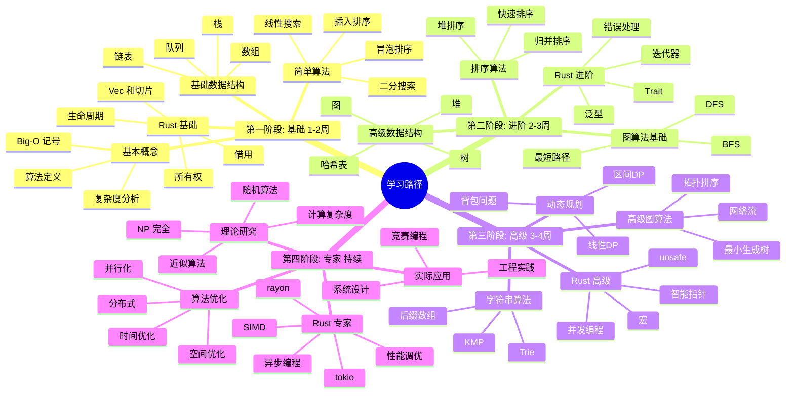

---

## 🎯 问题分类思维导图

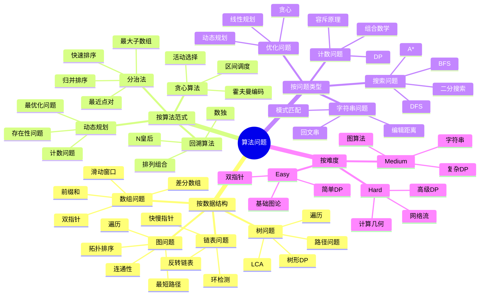

---

## 🔧 Rust 特性应用思维导图

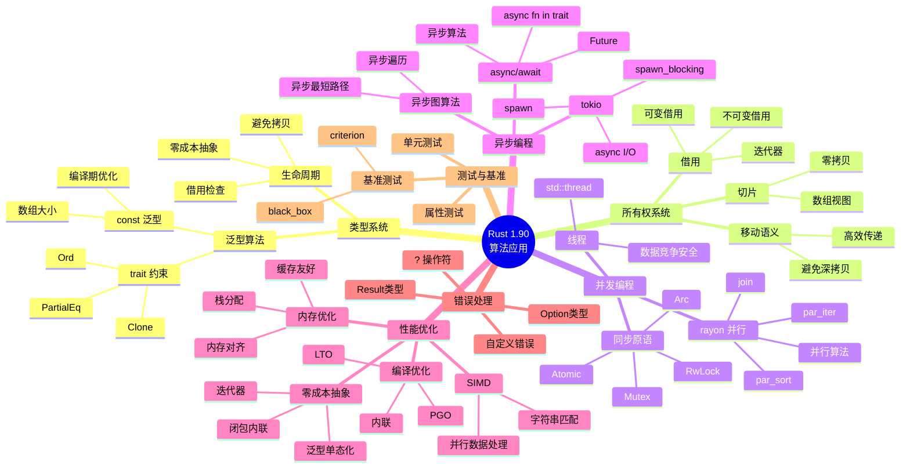

---

## 📊 复杂度分析思维导图

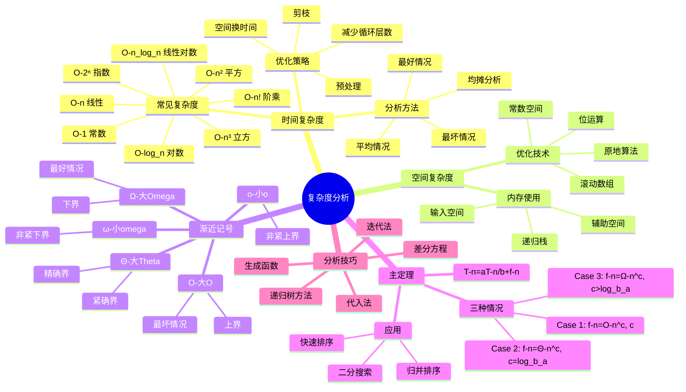

---

## 🎓 核心概念关联图

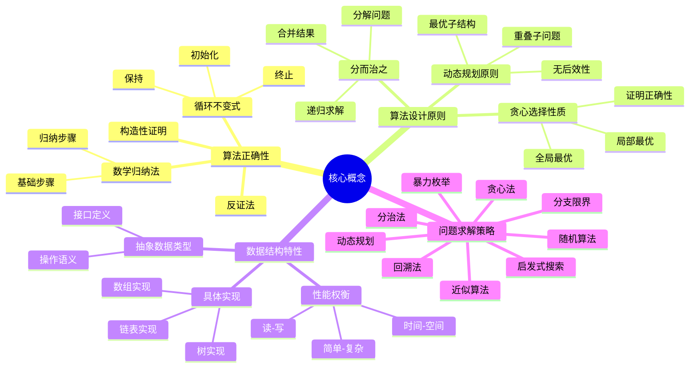

---

## 📱 实战应用场景思维导图

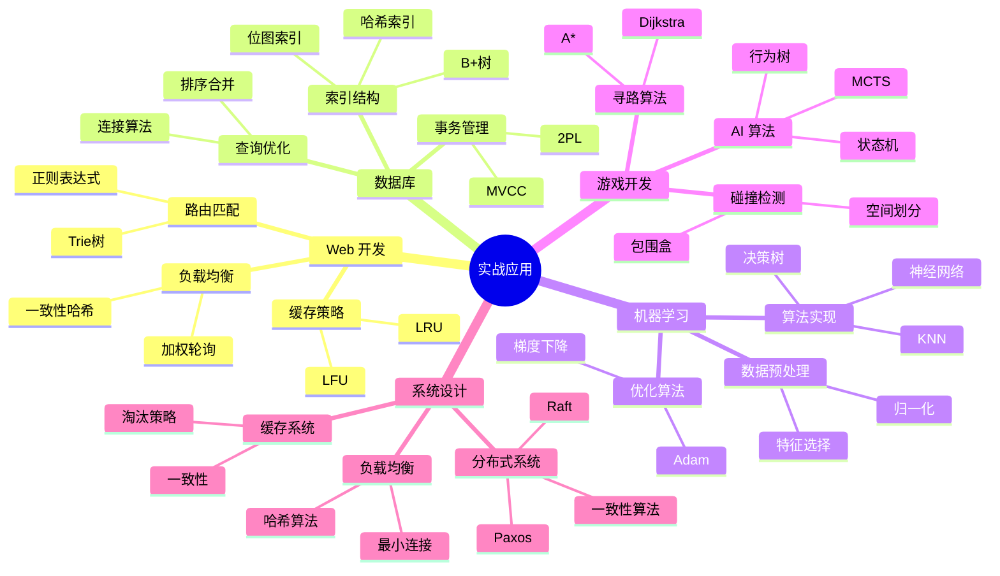

---

## 🏆 竞赛编程思维导图

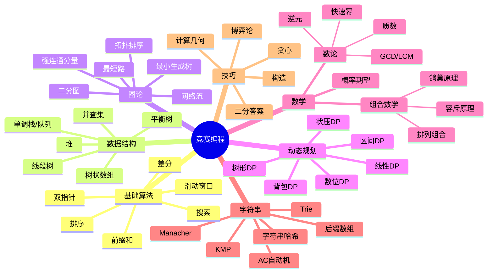

---

## 📚 参考资源

- [VisuAlgo](https://visualgo.net/) - 算法可视化
- [LeetCode](https://leetcode.com/) - 算法练习
- [Codeforces](https://codeforces.com/) - 竞赛编程
- [OI Wiki](https://oi-wiki.org/) - 竞赛知识库

---

**最后更新**: 2025年10月19日
**文档版本**: 1.0.0
**维护者**: c08_algorithms 团队
