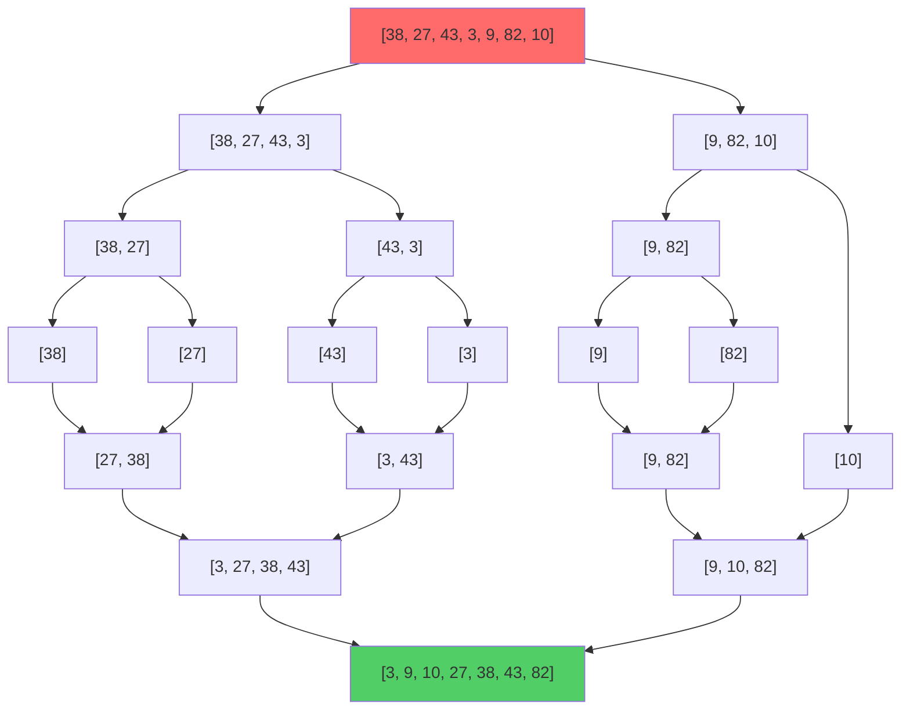

# 可视化代码示例库 (Visual Code Examples Library)

## 📊 目录

- [可视化代码示例库 (Visual Code Examples Library)](#可视化代码示例库-visual-code-examples-library)
  - [📊 目录](#-目录)
  - [🎨 可视化示例总览](#-可视化示例总览)
  - [1. 排序算法可视化](#1-排序算法可视化)
    - [1.1 冒泡排序可视化](#11-冒泡排序可视化)
      - [算法动画](#算法动画)
      - [实现代码（带日志）](#实现代码带日志)
    - [1.2 归并排序可视化](#12-归并排序可视化)
      - [实现代码（带可视化）](#实现代码带可视化)
  - [2. 图算法可视化](#2-图算法可视化)
    - [2.1 BFS 广度优先搜索](#21-bfs-广度优先搜索)
      - [实现代码（带可视化）1](#实现代码带可视化1)
    - [2.2 Dijkstra 最短路径可视化](#22-dijkstra-最短路径可视化)
      - [实现代码（带可视化）2](#实现代码带可视化2)
  - [3. 动态规划可视化](#3-动态规划可视化)
    - [3.1 斐波那契数列 - DP 表](#31-斐波那契数列---dp-表)
    - [3.2 最长公共子序列 (LCS) - DP 表](#32-最长公共子序列-lcs---dp-表)
      - [实现代码（带可视化）3](#实现代码带可视化3)
  - [4. 树遍历可视化](#4-树遍历可视化)
    - [4.1 二叉树遍历](#41-二叉树遍历)
      - [实现代码（带可视化）4](#实现代码带可视化4)
  - [5. 复杂度可视化](#5-复杂度可视化)
    - [5.1 时间复杂度对比图](#51-时间复杂度对比图)
    - [5.2 空间复杂度对比](#52-空间复杂度对比)
  - [📚 使用说明](#-使用说明)
    - [运行可视化示例](#运行可视化示例)
    - [自定义可视化](#自定义可视化)

**版本**: 1.0.0
**Rust版本**: 1.92.0
**创建日期**: 2025年10月19日
**特性**: 可视化演示 + 动画说明 + 交互式示例

---

## 🎨 可视化示例总览

本文档提供算法的可视化表示和详细的执行步骤演示。

---

## 1. 排序算法可视化

### 1.1 冒泡排序可视化

#### 算法动画

```text
初始状态: [5, 2, 8, 1, 9]

第1轮:
[5, 2, 8, 1, 9]  比较 5 和 2
[2, 5, 8, 1, 9]  交换 ✓
[2, 5, 8, 1, 9]  比较 5 和 8
[2, 5, 8, 1, 9]  不交换
[2, 5, 8, 1, 9]  比较 8 和 1
[2, 5, 1, 8, 9]  交换 ✓
[2, 5, 1, 8, 9]  比较 8 和 9
[2, 5, 1, 8, 9]  不交换
结果: [2, 5, 1, 8, 9]  最大元素9已就位 ✓

第2轮:
[2, 5, 1, 8, 9]  比较 2 和 5
[2, 5, 1, 8, 9]  不交换
[2, 5, 1, 8, 9]  比较 5 和 1
[2, 1, 5, 8, 9]  交换 ✓
[2, 1, 5, 8, 9]  比较 5 和 8
[2, 1, 5, 8, 9]  不交换
结果: [2, 1, 5, 8, 9]  第二大元素8已就位 ✓

第3轮:
[2, 1, 5, 8, 9]  比较 2 和 1
[1, 2, 5, 8, 9]  交换 ✓
[1, 2, 5, 8, 9]  比较 2 和 5
[1, 2, 5, 8, 9]  不交换
结果: [1, 2, 5, 8, 9]  排序完成! ✓
```

#### 实现代码（带日志）

```rust
/// 冒泡排序 - 带可视化输出
pub fn bubble_sort_visual<T: Ord + std::fmt::Display + Clone>(arr: &mut [T]) {
    let len = arr.len();
    println!("初始状态: {:?}", arr);
    println!();

    for i in 0..len {
        println!("=== 第{}轮 ===", i + 1);
        let mut swapped = false;

        for j in 0..len - 1 - i {
            print_comparison(arr, j, j + 1);

            if arr[j] > arr[j + 1] {
                arr.swap(j, j + 1);
                println!("  ➜ 交换 ✓");
                print_array(arr);
                swapped = true;
            } else {
                println!("  ➜ 不交换");
            }
        }

        println!("结果: {:?}", arr);
        println!("  最大的{}个元素已就位 ✓", i + 1);
        println!();

        if !swapped {
            println!("提前终止：数组已排序!");
            break;
        }
    }

    println!("排序完成! 最终结果: {:?}", arr);
}

fn print_comparison<T: std::fmt::Display>(arr: &[T], i: usize, j: usize) {
    print!("[");
    for (idx, item) in arr.iter().enumerate() {
        if idx == i |
| idx == j {
            print!(">{}<", item);
        } else {
            print!("{}", item);
        }
        if idx < arr.len() - 1 {
            print!(", ");
        }
    }
    print!("]  比较 {} 和 {}", arr[i], arr[j]);
    println!();
}

fn print_array<T: std::fmt::Display>(arr: &[T]) {
    print!("  [");
    for (idx, item) in arr.iter().enumerate() {
        print!("{}", item);
        if idx < arr.len() - 1 {
            print!(", ");
        }
    }
    println!("]");
}

#[cfg(test)]
mod tests {
    use super::*;

    #[test]
    fn test_bubble_sort_visual() {
        let mut arr = vec![5, 2, 8, 1, 9];
        bubble_sort_visual(&mut arr);
        assert_eq!(arr, vec![1, 2, 5, 8, 9]);
    }
}
```

### 1.2 归并排序可视化



#### 实现代码（带可视化）

```rust
/// 归并排序 - 带可视化输出
pub fn merge_sort_visual<T: Ord + Clone + std::fmt::Debug>(arr: &mut [T], depth: usize) {
    let indent = "  ".repeat(depth);

    if arr.len() <= 1 {
        println!("{}基础情况: {:?}", indent, arr);
        return;
    }

    println!("{}分解: {:?}", indent, arr);

    let mid = arr.len() / 2;
    let mut left = arr[..mid].to_vec();
    let mut right = arr[mid..].to_vec();

    println!("{}  左: {:?}", indent, left);
    merge_sort_visual(&mut left, depth + 1);

    println!("{}  右: {:?}", indent, right);
    merge_sort_visual(&mut right, depth + 1);

    println!("{}合并: {:?} + {:?}", indent, left, right);
    merge(arr, &left, &right);
    println!("{}结果: {:?}", indent, arr);
}

fn merge<T: Ord + Clone>(arr: &mut [T], left: &[T], right: &[T]) {
    let (mut i, mut j, mut k) = (0, 0, 0);

    while i < left.len() && j < right.len() {
        if left[i] <= right[j] {
            arr[k] = left[i].clone();
            i += 1;
        } else {
            arr[k] = right[j].clone();
            j += 1;
        }
        k += 1;
    }

    while i < left.len() {
        arr[k] = left[i].clone();
        i += 1;
        k += 1;
    }

    while j < right.len() {
        arr[k] = right[j].clone();
        j += 1;
        k += 1;
    }
}

#[cfg(test)]
mod merge_sort_tests {
    use super::*;

    #[test]
    fn test_merge_sort_visual() {
        let mut arr = vec![38, 27, 43, 3, 9, 82, 10];
        println!("\n=== 归并排序可视化 ===\n");
        merge_sort_visual(&mut arr, 0);
        assert_eq!(arr, vec![3, 9, 10, 27, 38, 43, 82]);
    }
}
```

---

## 2. 图算法可视化

### 2.1 BFS 广度优先搜索

```text
图结构:
    1
   / \
  2   3
 / \   \
4   5   6

BFS 遍历过程:

初始化:
  队列: [1]
  已访问: {1}

步骤1:
  出队: 1
  访问邻居: 2, 3
  队列: [2, 3]
  已访问: {1, 2, 3}

步骤2:
  出队: 2
  访问邻居: 4, 5
  队列: [3, 4, 5]
  已访问: {1, 2, 3, 4, 5}

步骤3:
  出队: 3
  访问邻居: 6
  队列: [4, 5, 6]
  已访问: {1, 2, 3, 4, 5, 6}

步骤4:
  出队: 4
  无新邻居
  队列: [5, 6]

步骤5:
  出队: 5
  无新邻居
  队列: [6]

步骤6:
  出队: 6
  无新邻居
  队列: []

遍历结果: [1, 2, 3, 4, 5, 6]
```

#### 实现代码（带可视化）1

```rust
use std::collections::{HashMap, HashSet, VecDeque};

/// BFS - 带可视化输出
pub fn bfs_visual<V>(
    graph: &HashMap<V, Vec<V>>,
    start: V,
) -> Vec<V>
where
    V: Eq + std::hash::Hash + Clone + std::fmt::Display,
{
    let mut visited = HashSet::new();
    let mut queue = VecDeque::new();
    let mut result = Vec::new();

    queue.push_back(start.clone());
    visited.insert(start.clone());

    println!("初始化:");
    println!("  队列: {:?}", queue.iter().collect::<Vec<_>>());
    println!("  已访问: {:?}", visited.iter().collect::<Vec<_>>());
    println!();

    let mut step = 1;
    while let Some(vertex) = queue.pop_front() {
        println!("步骤{}:", step);
        println!("  出队: {}", vertex);
        result.push(vertex.clone());

        if let Some(neighbors) = graph.get(&vertex) {
            let mut new_neighbors = Vec::new();

            for neighbor in neighbors {
                if visited.insert(neighbor.clone()) {
                    queue.push_back(neighbor.clone());
                    new_neighbors.push(neighbor.clone());
                }
            }

            if !new_neighbors.is_empty() {
                println!("  访问邻居: {:?}", new_neighbors);
            } else {
                println!("  无新邻居");
            }
        }

        println!("  队列: {:?}", queue.iter().collect::<Vec<_>>());
        println!("  已访问: {:?}", visited.iter().collect::<Vec<_>>());
        println!();

        step += 1;
    }

    println!("遍历结果: {:?}", result);
    result
}

#[cfg(test)]
mod bfs_tests {
    use super::*;

    #[test]
    fn test_bfs_visual() {
        let mut graph = HashMap::new();
        graph.insert(1, vec![2, 3]);
        graph.insert(2, vec![4, 5]);
        graph.insert(3, vec![6]);
        graph.insert(4, vec![]);
        graph.insert(5, vec![]);
        graph.insert(6, vec![]);

        println!("\n=== BFS 广度优先搜索可视化 ===\n");
        let result = bfs_visual(&graph, 1);
        assert_eq!(result, vec![1, 2, 3, 4, 5, 6]);
    }
}
```

### 2.2 Dijkstra 最短路径可视化

```text
图结构（带权重）:

    A --4-- B
    |       |
    2       5
    |       |
    C --1-- D
    |       |
    8       2
    |       |
    E ------+

从 A 开始的 Dijkstra 算法:

初始化:
  距离: {A: 0, B: ∞, C: ∞, D: ∞, E: ∞}
  队列: [(A, 0)]
  已访问: {}

步骤1: 处理 A (距离: 0)
  更新 B: ∞ → 4
  更新 C: ∞ → 2
  队列: [(C, 2), (B, 4)]
  已访问: {A}

步骤2: 处理 C (距离: 2)
  更新 B: 4 → 3 (通过 C: 2 + 1)
  更新 D: ∞ → 3 (2 + 1)
  更新 E: ∞ → 10 (2 + 8)
  队列: [(B, 3), (D, 3), (B, 4), (E, 10)]
  已访问: {A, C}

步骤3: 处理 B (距离: 3)
  更新 D: 3 → 3 (不变)
  队列: [(D, 3), (B, 4), (E, 10)]
  已访问: {A, C, B}

步骤4: 处理 D (距离: 3)
  更新 E: 10 → 5 (3 + 2)
  队列: [(B, 4), (E, 5), (E, 10)]
  已访问: {A, C, B, D}

步骤5: 处理 E (距离: 5)
  队列: [(E, 10)]
  已访问: {A, C, B, D, E}

最终距离:
  A → A: 0
  A → B: 3
  A → C: 2
  A → D: 3
  A → E: 5
```

#### 实现代码（带可视化）2

```rust
use std::collections::{HashMap, BinaryHeap};
use std::cmp::Ordering;

#[derive(Debug, Clone, Eq, PartialEq)]
struct DijkstraNode<V> {
    vertex: V,
    distance: i32,
}

impl<V: Eq> Ord for DijkstraNode<V> {
    fn cmp(&self, other: &Self) -> Ordering {
        other.distance.cmp(&self.distance)
    }
}

impl<V: Eq> PartialOrd for DijkstraNode<V> {
    fn partial_cmp(&self, other: &Self) -> Option<Ordering> {
        Some(self.cmp(other))
    }
}

/// Dijkstra - 带可视化输出
pub fn dijkstra_visual(
    graph: &HashMap<&str, Vec<(&str, i32)>>,
    start: &str,
) -> HashMap<String, i32> {
    let mut distances: HashMap<String, i32> = HashMap::new();
    let mut heap = BinaryHeap::new();
    let mut visited = std::collections::HashSet::new();

    // 初始化
    for &node in graph.keys() {
        distances.insert(node.to_string(), i32::MAX);
    }
    distances.insert(start.to_string(), 0);
    heap.push(DijkstraNode {
        vertex: start.to_string(),
        distance: 0,
    });

    println!("初始化:");
    print_distances(&distances);
    println!("  队列: [{} (距离: 0)]", start);
    println!("  已访问: {{}}");
    println!();

    let mut step = 1;

    while let Some(DijkstraNode { vertex, distance }) = heap.pop() {
        if visited.contains(&vertex) {
            continue;
        }

        println!("步骤{}: 处理 {} (距离: {})", step, vertex, distance);
        visited.insert(vertex.clone());

        if let Some(neighbors) = graph.get(vertex.as_str()) {
            for &(neighbor, weight) in neighbors {
                let new_distance = distance + weight;
                let current_distance = *distances.get(neighbor).unwrap_or(&i32::MAX);

                if new_distance < current_distance {
                    println!("  更新 {}: {} → {} (通过 {}: {} + {})",
                        neighbor,
                        if current_distance == i32::MAX { "∞".to_string() } else { current_distance.to_string() },
                        new_distance,
                        vertex,
                        distance,
                        weight
                    );

                    distances.insert(neighbor.to_string(), new_distance);
                    heap.push(DijkstraNode {
                        vertex: neighbor.to_string(),
                        distance: new_distance,
                    });
                }
            }
        }

        println!("  已访问: {:?}", visited);
        println!();
        step += 1;
    }

    println!("最终距离:");
    for (node, dist) in &distances {
        if *dist == i32::MAX {
            println!("  {} → {}: ∞", start, node);
        } else {
            println!("  {} → {}: {}", start, node, dist);
        }
    }

    distances
}

fn print_distances(distances: &HashMap<String, i32>) {
    print!("  距离: {{");
    for (idx, (node, dist)) in distances.iter().enumerate() {
        if *dist == i32::MAX {
            print!("{}: ∞", node);
        } else {
            print!("{}: {}", node, dist);
        }
        if idx < distances.len() - 1 {
            print!(", ");
        }
    }
    println!("}}");
}

#[cfg(test)]
mod dijkstra_tests {
    use super::*;

    #[test]
    fn test_dijkstra_visual() {
        let mut graph = HashMap::new();
        graph.insert("A", vec![("B", 4), ("C", 2)]);
        graph.insert("B", vec![("D", 5)]);
        graph.insert("C", vec![("B", 1), ("D", 8), ("E", 10)]);
        graph.insert("D", vec![("E", 2)]);
        graph.insert("E", vec![]);

        println!("\n=== Dijkstra 最短路径算法可视化 ===\n");
        let distances = dijkstra_visual(&graph, "A");

        assert_eq!(distances.get("A"), Some(&0));
        assert_eq!(distances.get("E"), Some(&5));
    }
}
```

---

## 3. 动态规划可视化

### 3.1 斐波那契数列 - DP 表

```text
计算 fib(6):

DP 表构建过程:

初始化:
  dp[0] = 0
  dp[1] = 1

步骤1: 计算 dp[2]
  dp[2] = dp[0] + dp[1] = 0 + 1 = 1
  dp = [0, 1, 1]

步骤2: 计算 dp[3]
  dp[3] = dp[1] + dp[2] = 1 + 1 = 2
  dp = [0, 1, 1, 2]

步骤3: 计算 dp[4]
  dp[4] = dp[2] + dp[3] = 1 + 2 = 3
  dp = [0, 1, 1, 2, 3]

步骤4: 计算 dp[5]
  dp[5] = dp[3] + dp[4] = 2 + 3 = 5
  dp = [0, 1, 1, 2, 3, 5]

步骤5: 计算 dp[6]
  dp[6] = dp[4] + dp[5] = 3 + 5 = 8
  dp = [0, 1, 1, 2, 3, 5, 8]

结果: fib(6) = 8
```

### 3.2 最长公共子序列 (LCS) - DP 表

```text
字符串1: "ABCBDAB"
字符串2: "BDCABA"

DP 表构建:

    ''  B  D  C  A  B  A
''   0  0  0  0  0  0  0
A    0  0  0  0  1  1  1
B    0  1  1  1  1  2  2
C    0  1  1  2  2  2  2
B    0  1  1  2  2  3  3
D    0  1  2  2  2  3  3
A    0  1  2  2  3  3  4
B    0  1  2  2  3  4  4

LCS 长度: 4
LCS: "BDAB" 或 "BCAB" 或 "BCBA"
```

#### 实现代码（带可视化）3

```rust
/// LCS - 带 DP 表可视化
pub fn lcs_visual(text1: &str, text2: &str) -> usize {
    let m = text1.len();
    let n = text2.len();
    let text1: Vec<char> = text1.chars().collect();
    let text2: Vec<char> = text2.chars().collect();

    let mut dp = vec![vec![0; n + 1]; m + 1];

    println!("字符串1: \"{}\"", text1.iter().collect::<String>());
    println!("字符串2: \"{}\"", text2.iter().collect::<String>());
    println!();

    println!("DP 表构建:");
    print_dp_header(&text2);
    print_dp_row(&dp[0], "''", &text2);

    for i in 1..=m {
        for j in 1..=n {
            if text1[i - 1] == text2[j - 1] {
                dp[i][j] = dp[i - 1][j - 1] + 1;
            } else {
                dp[i][j] = dp[i - 1][j].max(dp[i][j - 1]);
            }
        }

        let label = text1[i - 1].to_string();
        print_dp_row(&dp[i], &label, &text2);
    }

    println!();
    println!("LCS 长度: {}", dp[m][n]);

    // 重构 LCS
    let lcs = reconstruct_lcs(&dp, &text1, &text2, m, n);
    println!("LCS: \"{}\"", lcs);

    dp[m][n]
}

fn print_dp_header(text2: &[char]) {
    print!("      ''");
    for ch in text2 {
        print!("  {}", ch);
    }
    println!();
}

fn print_dp_row(row: &[usize], label: &str, text2: &[char]) {
    print!("{:3}  ", label);
    for val in row.iter().take(text2.len() + 1) {
        print!("{:3}", val);
    }
    println!();
}

fn reconstruct_lcs(
    dp: &[Vec<usize>],
    text1: &[char],
    text2: &[char],
    mut i: usize,
    mut j: usize,
) -> String {
    let mut lcs = Vec::new();

    while i > 0 && j > 0 {
        if text1[i - 1] == text2[j - 1] {
            lcs.push(text1[i - 1]);
            i -= 1;
            j -= 1;
        } else if dp[i - 1][j] > dp[i][j - 1] {
            i -= 1;
        } else {
            j -= 1;
        }
    }

    lcs.reverse();
    lcs.iter().collect()
}

#[cfg(test)]
mod lcs_tests {
    use super::*;

    #[test]
    fn test_lcs_visual() {
        println!("\n=== 最长公共子序列 (LCS) 可视化 ===\n");
        let length = lcs_visual("ABCBDAB", "BDCABA");
        assert_eq!(length, 4);
    }
}
```

---

## 4. 树遍历可视化

### 4.1 二叉树遍历

```text
二叉树结构:
       1
      / \
     2   3
    / \   \
   4   5   6

前序遍历 (Pre-order):  1 → 2 → 4 → 5 → 3 → 6
中序遍历 (In-order):   4 → 2 → 5 → 1 → 3 → 6
后序遍历 (Post-order): 4 → 5 → 2 → 6 → 3 → 1
层序遍历 (Level-order): 1 → 2 → 3 → 4 → 5 → 6
```

#### 实现代码（带可视化）4

```rust
use std::rc::Rc;
use std::cell::RefCell;
use std::collections::VecDeque;

#[derive(Debug)]
pub struct TreeNode {
    pub val: i32,
    pub left: Option<Rc<RefCell<TreeNode>>>,
    pub right: Option<Rc<RefCell<TreeNode>>>,
}

impl TreeNode {
    pub fn new(val: i32) -> Self {
        TreeNode {
            val,
            left: None,
            right: None,
        }
    }
}

/// 前序遍历 - 带可视化
pub fn preorder_visual(root: &Option<Rc<RefCell<TreeNode>>>, depth: usize) -> Vec<i32> {
    let indent = "  ".repeat(depth);

    match root {
        None => {
            println!("{}None", indent);
            vec![]
        }
        Some(node) => {
            let node = node.borrow();
            println!("{}访问: {}", indent, node.val);

            let mut result = vec![node.val];

            println!("{}处理左子树:", indent);
            result.extend(preorder_visual(&node.left, depth + 1));

            println!("{}处理右子树:", indent);
            result.extend(preorder_visual(&node.right, depth + 1));

            result
        }
    }
}

/// 层序遍历 - 带可视化
pub fn level_order_visual(root: &Option<Rc<RefCell<TreeNode>>>) -> Vec<Vec<i32>> {
    let mut result = Vec::new();

    if root.is_none() {
        return result;
    }

    let mut queue = VecDeque::new();
    queue.push_back(root.clone());

    let mut level = 0;

    while !queue.is_empty() {
        let level_size = queue.len();
        let mut current_level = Vec::new();

        println!("层级 {}: ", level);

        for _ in 0..level_size {
            if let Some(Some(node_rc)) = queue.pop_front() {
                let node = node_rc.borrow();
                current_level.push(node.val);
                print!("  访问: {} ", node.val);

                if node.left.is_some() {
                    queue.push_back(node.left.clone());
                    print!("(左子: {}) ", node.left.as_ref().unwrap().borrow().val);
                }

                if node.right.is_some() {
                    queue.push_back(node.right.clone());
                    print!("(右子: {}) ", node.right.as_ref().unwrap().borrow().val);
                }

                println!();
            }
        }

        result.push(current_level);
        level += 1;
        println!();
    }

    result
}

#[cfg(test)]
mod tree_tests {
    use super::*;

    fn create_test_tree() -> Option<Rc<RefCell<TreeNode>>> {
        let root = Rc::new(RefCell::new(TreeNode::new(1)));
        let left = Rc::new(RefCell::new(TreeNode::new(2)));
        let right = Rc::new(RefCell::new(TreeNode::new(3)));

        left.borrow_mut().left = Some(Rc::new(RefCell::new(TreeNode::new(4))));
        left.borrow_mut().right = Some(Rc::new(RefCell::new(TreeNode::new(5))));
        right.borrow_mut().right = Some(Rc::new(RefCell::new(TreeNode::new(6))));

        root.borrow_mut().left = Some(left);
        root.borrow_mut().right = Some(right);

        Some(root)
    }

    #[test]
    fn test_preorder_visual() {
        let tree = create_test_tree();
        println!("\n=== 前序遍历可视化 ===\n");
        let result = preorder_visual(&tree, 0);
        assert_eq!(result, vec![1, 2, 4, 5, 3, 6]);
    }

    #[test]
    fn test_level_order_visual() {
        let tree = create_test_tree();
        println!("\n=== 层序遍历可视化 ===\n");
        let result = level_order_visual(&tree);
        assert_eq!(result, vec![vec![1], vec![2, 3], vec![4, 5, 6]]);
    }
}
```

---

## 5. 复杂度可视化

### 5.1 时间复杂度对比图

```text
执行时间随输入规模增长图:

O(1)     ──────────────────────────
O(log n) ─────────────────────────
O(n)     ──────────────────────────────────
O(n log n) ────────────────────────────────────────
O(n²)    ────────────────────────────────────────────────────────
O(2ⁿ)    ──────────────────────────────────────────────────────────────────
O(n!)    ──────────────────────────────────────────────────────────────────────────────

         n=10   n=100  n=1000 n=10000
```

### 5.2 空间复杂度对比

```text
算法             时间复杂度        空间复杂度    原地排序
冒泡排序         O(n²)            O(1)         ✓
选择排序         O(n²)            O(1)         ✓
插入排序         O(n²)            O(1)         ✓
归并排序         O(n log n)       O(n)         ✗
快速排序         O(n log n)       O(log n)     ✓
堆排序           O(n log n)       O(1)         ✓
```

---

## 📚 使用说明

### 运行可视化示例

```bash
# 运行所有可视化测试
cargo test --test visual_examples -- --nocapture

# 运行特定可视化
cargo test bubble_sort_visual -- --nocapture
cargo test dijkstra_visual -- --nocapture
cargo test lcs_visual -- --nocapture
```

### 自定义可视化

```rust
// 创建自己的可视化函数
pub fn your_algorithm_visual<T>(input: T) {
    println!("=== 算法名称 ===\n");
    println!("输入: {:?}", input);

    // 算法步骤
    // ...

    println!("结果: {:?}", result);
}
```

---

**最后更新**: 2025年10月19日
**文档版本**: 1.0.0
**维护者**: c08_algorithms 团队
