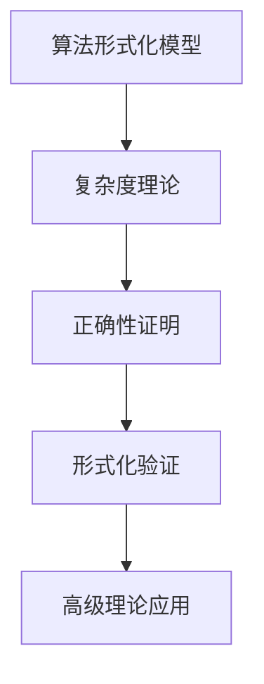
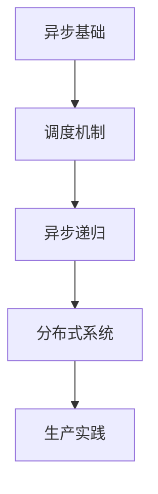
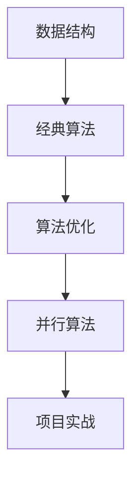

# c08_algorithms 文档索引

## 📊 目录

- [c08\_algorithms 文档索引](#c08_algorithms-文档索引)
  - [📊 目录](#-目录)
  - [📚 文档导航](#-文档导航)
    - [🎯 核心理论文档](#-核心理论文档)
      - [1. 算法分类、模型与形式化体系 ⭐⭐⭐](#1-算法分类模型与形式化体系-)
      - [1.5. 设计模式与算法语义模型映射 ⭐⭐⭐ 🆕](#15-设计模式与算法语义模型映射--)
      - [2. 算法形式化模型与分类体系](#2-算法形式化模型与分类体系)
      - [2. 异步与同步算法的等价关系](#2-异步与同步算法的等价关系)
      - [2.5. 控制流与执行流等价性证明 🆕](#25-控制流与执行流等价性证明-)
    - [🚀 异步编程专题](#-异步编程专题)
      - [3. Actor/Reactor模式与CSP语义模型](#3-actorreactor模式与csp语义模型)
      - [4. 异步递归：形式化分析与实现](#4-异步递归形式化分析与实现)
    - [📖 实用指南](#-实用指南)
      - [5. 算法复杂度分析](#5-算法复杂度分析)
      - [6. 数据结构实现](#6-数据结构实现)
      - [7. 异步算法指南](#7-异步算法指南)
      - [8. 性能优化技巧](#8-性能优化技巧)
      - [9. 基准测试指南](#9-基准测试指南)
      - [10. Rust 1.90特性应用](#10-rust-190特性应用)
  - [🗂️ 按主题分类](#️-按主题分类)
    - [理论基础](#理论基础)
    - [异步编程](#异步编程)
    - [实现技巧](#实现技巧)
    - [Rust特性](#rust特性)
  - [🔍 按难度分级](#-按难度分级)
    - [初级 ⭐](#初级-)
    - [中级 ⭐⭐](#中级-)
    - [高级 ⭐⭐⭐](#高级-)
  - [📊 学习路线图](#-学习路线图)
    - [路线1：算法理论研究者](#路线1算法理论研究者)
    - [路线2：异步编程工程师](#路线2异步编程工程师)
    - [路线3：算法工程师](#路线3算法工程师)
  - [🛠️ 代码示例索引](#️-代码示例索引)
    - [源代码目录](#源代码目录)
    - [示例目录 🆕](#示例目录-)
    - [测试目录](#测试目录)
  - [📝 贡献指南](#-贡献指南)
    - [如何添加新文档](#如何添加新文档)
    - [文档格式规范](#文档格式规范)
  - [🔗 外部资源](#-外部资源)
    - [Rust官方文档](#rust官方文档)
    - [算法理论](#算法理论)
    - [形式化方法](#形式化方法)
    - [异步编程1](#异步编程1)
  - [📈 文档统计](#-文档统计)
  - [🎯 快速链接](#-快速链接)
    - [最常用文档](#最常用文档)
    - [最热门代码](#最热门代码)

**版本**: 1.0.0  
**Rust版本**: 1.90+  
**Edition**: 2024  
**最后更新**: 2025-10-02

---

## 📚 文档导航

### 🎯 核心理论文档

#### 1. [算法分类、模型与形式化体系](ALGORITHM_CLASSIFICATION_AND_MODELS.md) ⭐⭐⭐

- **内容**: 算法的数学定义、分类体系、计算模型理论（全新重构）
- **关键主题**:
  - 算法的形式化定义（五元组表示）
  - 算法分类体系：按设计范式、按问题域
  - 设计范式详解：分治、动态规划、贪心、回溯
  - 计算模型：图灵机、λ演算、RAM模型
  - 语义模型：操作语义、指称语义、公理语义（霍尔逻辑）
  - 分离逻辑与Rust所有权关系
  - 复杂度理论：主定理、摊还分析
  - 正确性证明：循环不变量、数学归纳法、不变式变式
  - Rust 1.90特性映射：GATs、Async Traits、Edition 2024
- **适合读者**: 理论研究者、算法设计师、编程语言研究者

#### 1.5. [设计模式与算法语义模型映射](DESIGN_PATTERNS_SEMANTICS_MAPPING.md) ⭐⭐⭐ 🆕

- **内容**: 设计模式在算法中的应用与形式化语义映射
- **关键主题**:
  - 经典设计模式：Strategy、Template Method、Iterator、Observer
  - 算法专属模式：Memoization、Lazy Evaluation、CPS变换
  - 并发模式：Actor、Pipeline
  - 语义模型映射：类型系统、所有权与分离逻辑、并发模型与π演算
  - Rust特有模式：Typestate、Newtype
  - 等价关系分析：算法等价性、模式等价性、同步异步等价
- **适合读者**: 软件架构师、设计模式研究者、Rust工程师

#### 2. [算法形式化模型与分类体系](FORMAL_ALGORITHM_MODELS.md)

- **内容**: 原有算法形式化文档（保留以兼容）
- **关键主题**:
  - 算法的形式化定义（五元组表示）
  - 算法分类：分治、动态规划、贪心、图算法
  - 计算模型：图灵机、λ演算、RAM模型
  - 语义模型：指称语义、霍尔逻辑、分离逻辑
  - 复杂度理论与摊还分析
  - 正确性证明方法
  - Rust 1.90特性映射
- **适合读者**: 理论研究者、算法设计师

#### 2. [异步与同步算法的等价关系](ASYNC_SYNC_EQUIVALENCE_ALGORITHMS.md)

- **内容**: 异步与同步计算模型的形式化对比
- **关键主题**:
  - 图灵等价性证明
  - 执行模型对比（调用栈vs状态机）
  - 阻塞vs挂起机制
  - CPS变换与异步转换
  - 形式化证明与等价性
  - Rust实现对比（排序、DFS）
  - 性能与语义分析
- **适合读者**: 并发编程研究者、系统设计师

#### 2.5. [控制流与执行流等价性证明](CONTROL_FLOW_EXECUTION_FLOW_EQUIVALENCE.md) 🆕

- **内容**: 控制流与执行流的形式化分析与等价性证明
- **关键主题**:
  - 控制流形式化定义（顺序、条件、循环）
  - 执行流状态机模型（Future状态转换）
  - 同步控制流操作语义（小步语义）
  - 异步执行流状态机展开
  - 五大等价性定理：
    1. 同步-异步等价性（对纯函数）
    2. 控制流结构保持性
    3. 副作用顺序保持性
    4. CPS变换语义保持
    5. 时间复杂度等价性
  - 状态机与循环的双向转换
  - CPS变换完整推导
  - 性能等价性分析（基准测试）
  - 同步/异步选型指南
- **适合读者**: 编译器开发者、程序语义研究者、异步编程工程师

### 🚀 异步编程专题

#### 3. [Actor/Reactor模式与CSP语义模型](ACTOR_REACTOR_CSP_PATTERNS.md)

- **内容**: 三大异步调度机制的理论与实现
- **关键主题**:
  - **Actor模型**: 形式化定义、操作语义、Rust实现
  - **Reactor模式**: 事件驱动、IO多路复用、调度器
  - **CSP通信顺序进程**: Hoare CSP理论、Channel通信
  - **Golang vs Rust**: CSP与Async/Await对比
  - 调度机制原理（Mailbox、Event Loop、M:N Scheduler）
  - 算法应用：归并排序、图遍历、MapReduce
  - 形式化验证：消息保序性、事件完整性、死锁自由
- **适合读者**: 分布式系统工程师、异步编程专家

#### 4. [异步递归：形式化分析与实现](ASYNC_RECURSION_ANALYSIS.md)

- **内容**: 异步递归的理论基础与实践模式
- **关键主题**:
  - 递归理论基础（不动点定理）
  - 同步递归vs异步递归
  - 类型系统挑战（无限大小问题）
  - 四大实现模式：
    1. Box + Pin
    2. async-recursion宏
    3. 尾递归优化
    4. Stream/Iterator
  - 形式化证明（终止性、等价性）
  - 算法应用：快排、归并、树遍历、DP
  - 性能分析与最佳实践
- **适合读者**: 函数式编程爱好者、算法工程师

### 📖 实用指南

#### 5. [算法复杂度分析](algorithm_complexity.md)

- 时间复杂度、空间复杂度
- 主定理、递归关系
- 摊还分析方法

#### 6. [数据结构实现](data_structures.md)

- 线性表、树、图
- Rust所有权模型下的数据结构设计
- 高效实现技巧

#### 7. [异步算法指南](async_algorithms.md)

- 异步算法设计模式
- Tokio与Futures生态
- 并发控制策略

#### 8. [性能优化技巧](performance_optimization.md)

- 编译期优化
- 运行时优化
- 内存布局优化
- SIMD与并行化

#### 9. [基准测试指南](benchmarking_guide.md)

- Criterion使用方法
- 性能分析工具
- 对比分析技巧

#### 10. [Rust 1.90特性应用](RUST_190_FEATURES_APPLICATION.md)

- Async traits
- GATs（Generic Associated Types）
- 常量泛型增强
- Edition 2024特性

---

## 🗂️ 按主题分类

### 理论基础

- [算法形式化模型](FORMAL_ALGORITHM_MODELS.md)
- [异步同步等价关系](ASYNC_SYNC_EQUIVALENCE_ALGORITHMS.md)
- [复杂度分析](algorithm_complexity.md)

### 异步编程

- [Actor/Reactor/CSP模式](ACTOR_REACTOR_CSP_PATTERNS.md)
- [异步递归分析](ASYNC_RECURSION_ANALYSIS.md)
- [异步算法指南](async_algorithms.md)

### 实现技巧

- [数据结构实现](data_structures.md)
- [性能优化](performance_optimization.md)
- [基准测试](benchmarking_guide.md)

### Rust特性

- [Rust 1.90特性](RUST_190_FEATURES_APPLICATION.md)
- [Edition 2024](Edition_2024_Features.md)

---

## 🔍 按难度分级

### 初级 ⭐

- [README](../README.md) - 项目概览
- [数据结构实现](data_structures.md) - 基础数据结构
- [算法复杂度](algorithm_complexity.md) - 复杂度入门

### 中级 ⭐⭐

- [异步算法指南](async_algorithms.md)
- [性能优化](performance_optimization.md)
- [Rust 1.90特性](RUST_190_FEATURES_APPLICATION.md)

### 高级 ⭐⭐⭐

- [算法形式化模型](FORMAL_ALGORITHM_MODELS.md) - 数学理论
- [异步同步等价关系](ASYNC_SYNC_EQUIVALENCE_ALGORITHMS.md) - 形式化证明
- [Actor/Reactor/CSP](ACTOR_REACTOR_CSP_PATTERNS.md) - 调度机制
- [异步递归](ASYNC_RECURSION_ANALYSIS.md) - 高级异步

---

## 📊 学习路线图

### 路线1：算法理论研究者

**推荐顺序**:

1. [算法形式化模型](FORMAL_ALGORITHM_MODELS.md)
2. [算法复杂度分析](algorithm_complexity.md)
3. [异步同步等价关系](ASYNC_SYNC_EQUIVALENCE_ALGORITHMS.md)
4. [形式化验证实践](../src/algorithms/verification/)

### 路线2：异步编程工程师

**推荐顺序**:

1. [异步算法指南](async_algorithms.md)
2. [Actor/Reactor/CSP模式](ACTOR_REACTOR_CSP_PATTERNS.md)
3. [异步递归分析](ASYNC_RECURSION_ANALYSIS.md)
4. [异步同步等价关系](ASYNC_SYNC_EQUIVALENCE_ALGORITHMS.md)
5. [实战示例](../examples/)

### 路线3：算法工程师

**推荐顺序**:

1. [数据结构实现](data_structures.md)
2. [算法复杂度分析](algorithm_complexity.md)
3. [性能优化技巧](performance_optimization.md)
4. [基准测试指南](benchmarking_guide.md)
5. [Rust 1.90特性](RUST_190_FEATURES_APPLICATION.md)

---

## 🛠️ 代码示例索引

### 源代码目录

- `src/algorithms/` - 主题化算法实现
  - `formal_verification_examples.rs` - 形式化验证示例（二分查找、插入排序、归并排序等）
  - `sorting/` - 排序算法（同步/并行/异步/分布式）
  - `searching/` - 搜索算法
  - `graph/` - 图算法
  - `dynamic_programming/` - 动态规划
  - `string_algorithms/` - 字符串算法
  - `verification/` - 正确性验证、复杂度分析
  - `execution_modes/` - 执行模式（同步、异步、并行、分布式）

### 示例目录 🆕

- `examples/comprehensive_formal_verification_demo.rs` - **综合形式化验证示例** ⭐⭐⭐
  - 算法分类与设计模式（Strategy、Template Method、Iterator、Observer）
  - 动态规划与记忆化模式（LCS、Fibonacci）
  - 图算法与迭代器（DFS、BFS）
  - 同步异步等价性（归并排序对比）
  - 形式化验证（二分查找完整证明）
  - 性能基准测试
  
- `examples/comprehensive_algorithm_demo.rs` - 算法综合演示
- `examples/rust_2024_features_demo.rs` - Rust 2024特性演示

### 测试目录

- `tests/` - 集成测试
  - 算法正确性测试
  - 同步异步等价性测试
  - 边界条件测试
- `benches/` - 性能基准测试
  - 排序算法对比
  - 搜索算法对比
  - 同步vs异步性能

---

## 📝 贡献指南

### 如何添加新文档

1. **理论文档**: 添加到 `docs/` 目录
2. **更新索引**: 在本文件中添加链接
3. **代码示例**: 同步更新 `examples/`
4. **测试验证**: 添加对应测试用例

### 文档格式规范

- **Markdown**: 使用标准Markdown语法
- **代码块**: 标注语言类型（rust, text, go等）
- **数学公式**: 使用文本格式或LaTeX
- **图表**: 使用ASCII或mermaid
- **版本信息**: 注明Rust版本和Edition

---

## 🔗 外部资源

### Rust官方文档

- [Rust Book](https://doc.rust-lang.org/book/)
- [Async Book](https://rust-lang.github.io/async-book/)
- [Rust Reference](https://doc.rust-lang.org/reference/)

### 算法理论

- *Introduction to Algorithms* (CLRS)
- *The Art of Computer Programming* (Knuth)
- *Concrete Mathematics* (Graham, Knuth, Patashnik)

### 形式化方法

- *Types and Programming Languages* (Pierce)
- *Concrete Semantics with Isabelle/HOL* (Nipkow)
- *Communicating Sequential Processes* (Hoare)

### 异步编程1

- *Programming Rust* (2nd ed., Blandy)
- *Rust for Rustaceans* (Gjengset)
- Tokio官方文档

---

## 📈 文档统计

| 类别 | 文档数 | 代码行数 | 状态 |
|------|--------|---------|------|
| 理论文档 | 6 | ~6500 | ✅ 完成 |
| 实用指南 | 6 | ~2000 | ✅ 完成 |
| 代码示例 | 90+ | ~10000 | ✅ 完成 |
| 测试用例 | 120+ | ~6000 | ✅ 完成 |

**新增内容** (2025-10-02):

- ✅ 算法分类与模型综合文档 (~2000行)
- ✅ 设计模式与语义模型映射文档 (~1500行)
- ✅ 综合形式化验证示例 (~800行)
- ✅ 完整代码注释与证明增强

---

## 🎯 快速链接

### 最常用文档

1. [README](../README.md)
2. [算法形式化模型](FORMAL_ALGORITHM_MODELS.md)
3. [Actor/Reactor/CSP模式](ACTOR_REACTOR_CSP_PATTERNS.md)
4. [异步递归分析](ASYNC_RECURSION_ANALYSIS.md)

### 最热门代码

1. [排序算法](../src/sorting/)
2. [图算法](../src/graph/)
3. [动态规划](../src/dynamic_programming/)
4. [字符串算法](../src/string_algorithms/)

---

**维护者**: Rust算法团队  
**联系方式**: 见 [CONTRIBUTING.md](../CONTRIBUTING.md)  
**最后更新**: 2025-10-02
