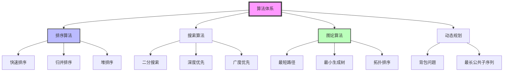
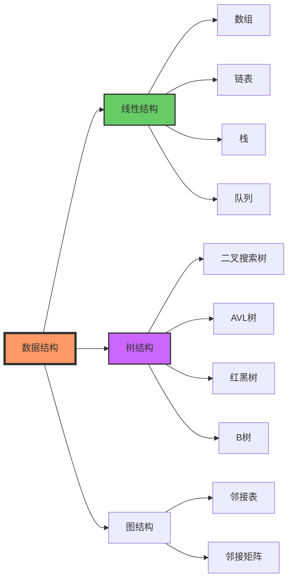
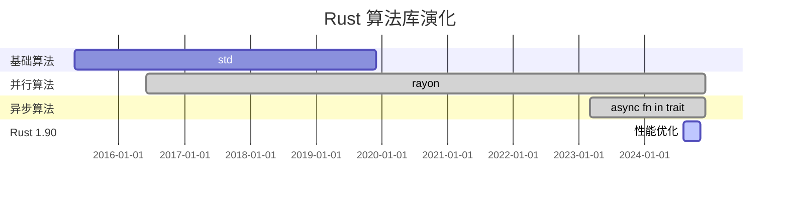

# C08 算法 知识图谱与概念关系（增强版）

> **文档定位**: Rust 1.90 算法与数据结构的完整知识体系  
> **创建日期**: 2025-10-20  
> **适用版本**: Rust 1.90+ | Edition 2024  
> **文档类型**: 理论知识图谱 + 概念关系 + 可视化

---

## 📊 目录

- [C08 算法 知识图谱与概念关系（增强版）](#c08-算法-知识图谱与概念关系增强版)
  - [📊 目录](#-目录)
  - [1. 核心概念知识图谱](#1-核心概念知识图谱)
    - [算法体系总览](#算法体系总览)
    - [数据结构分类](#数据结构分类)
  - [2. 概念属性矩阵](#2-概念属性矩阵)
    - [算法复杂度对比](#算法复杂度对比)
    - [数据结构特性矩阵](#数据结构特性矩阵)
  - [3. 技术演化与学习路径](#3-技术演化与学习路径)
    - [Rust算法演化](#rust算法演化)
    - [学习路径](#学习路径)
  - [4. 总结与索引](#4-总结与索引)
    - [快速查找](#快速查找)

---

## 1. 核心概念知识图谱

### 算法体系总览

### 数据结构分类

---

## 2. 概念属性矩阵

### 算法复杂度对比

| 算法 | 时间复杂度 | 空间复杂度 | 稳定性 | 适用场景 |
|------|-----------|----------|--------|---------|
| **快速排序** | O(n log n) | O(log n) | ❌ | 通用排序 |
| **归并排序** | O(n log n) | O(n) | ✅ | 稳定排序 |
| **堆排序** | O(n log n) | O(1) | ❌ | 原地排序 |
| **二分搜索** | O(log n) | O(1) | N/A | 有序数组 |
| **Dijkstra** | O(E log V) | O(V) | N/A | 最短路径 |

### 数据结构特性矩阵

| 结构 | 插入 | 删除 | 查找 | 空间 | 适用 |
|------|------|------|------|------|------|
| **数组** | O(n) | O(n) | O(1) | O(n) | 随机访问 |
| **链表** | O(1) | O(1) | O(n) | O(n) | 动态插入 |
| **哈希表** | O(1) | O(1) | O(1) | O(n) | 快速查找 |
| **BST** | O(log n) | O(log n) | O(log n) | O(n) | 有序数据 |
| **AVL** | O(log n) | O(log n) | O(log n) | O(n) | 平衡查找 |

---

## 3. 技术演化与学习路径

### Rust算法演化

### 学习路径

**初学者 (2-3周)**:

- Week 1: 基础数据结构（数组、链表、栈、队列）
- Week 2: 排序算法（快排、归并、堆排序）
- Week 3: 搜索算法（二分、DFS、BFS）

**中级 (3-4周)**:

- Week 4: 树结构（BST、AVL、B树）
- Week 5: 图论算法（Dijkstra、MST）
- Week 6: 动态规划（背包、LCS）
- Week 7: 并行算法（rayon）

**高级 (持续)**:

- 异步算法、高级优化
- 算法证明与复杂度分析
- 生产级算法库设计

---

## 4. 总结与索引

### 快速查找

**按问题查找**:

- 排序选择 → 2节算法对比
- 数据结构选择 → 2节特性矩阵
- 复杂度分析 → 相关文档

**相关文档**:

- [多维矩阵对比](MULTI_DIMENSIONAL_COMPARISON_MATRIX.md)
- [README](../../README.md)
- [知识图谱](../KNOWLEDGE_GRAPH.md)

---

**文档版本**: v1.0  
**最后更新**: 2025-10-20

---

*本知识图谱整合 C08 算法完整知识体系！*
