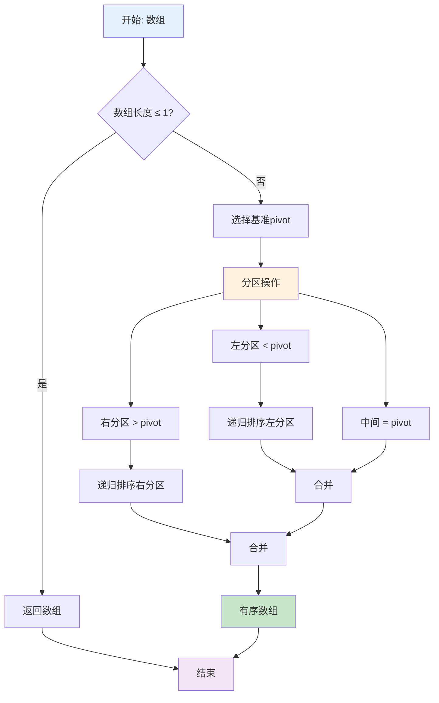
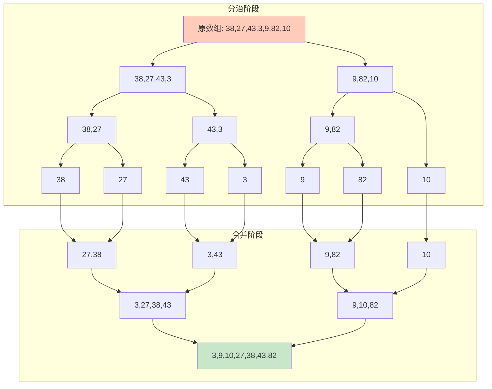
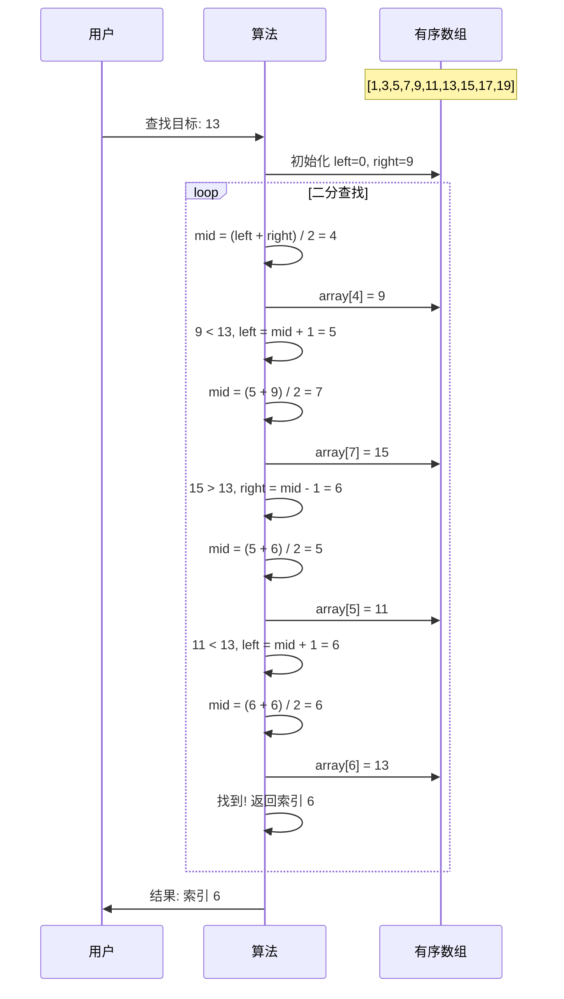
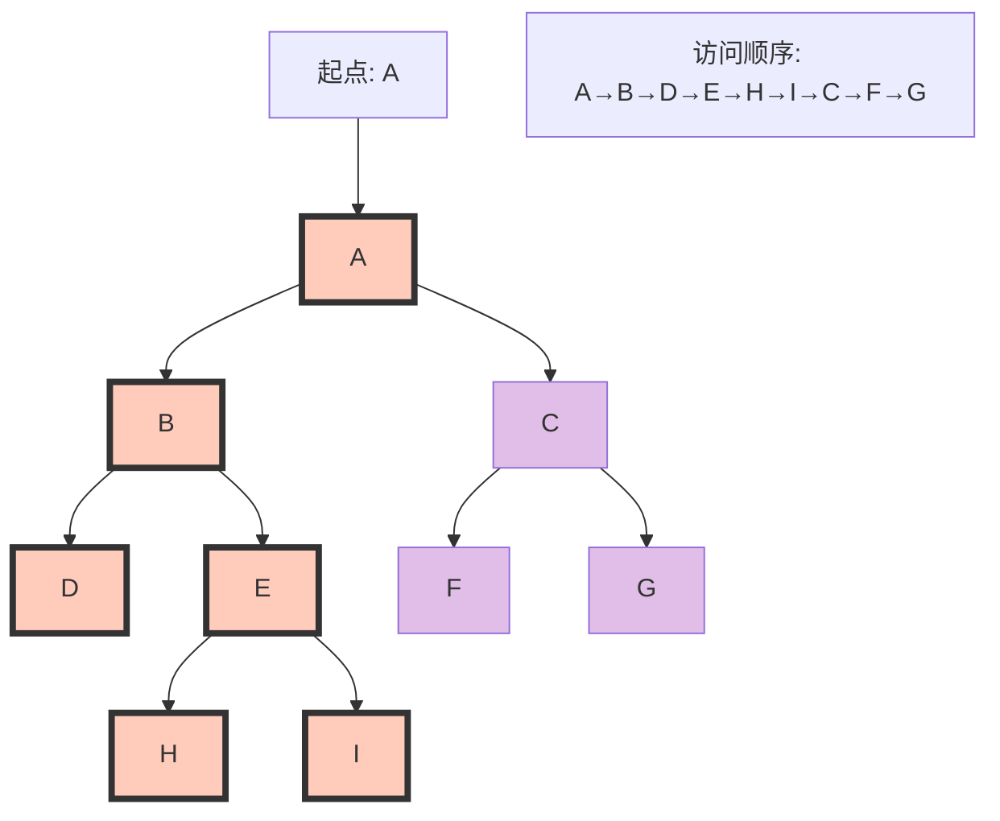
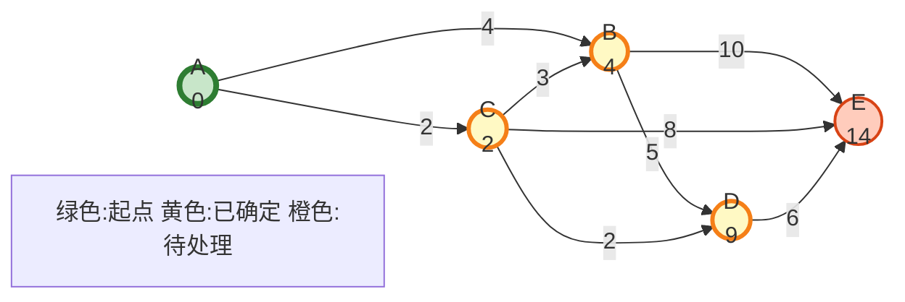
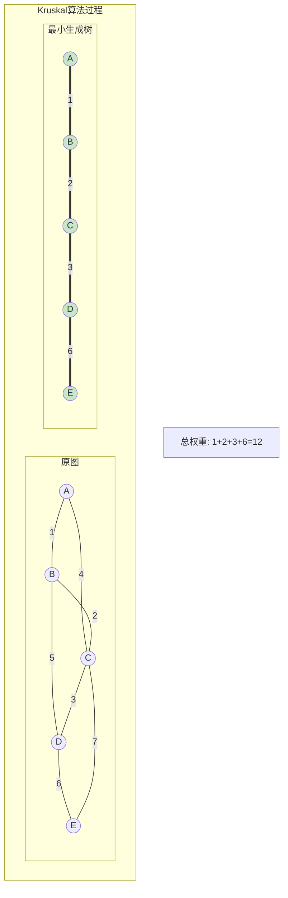
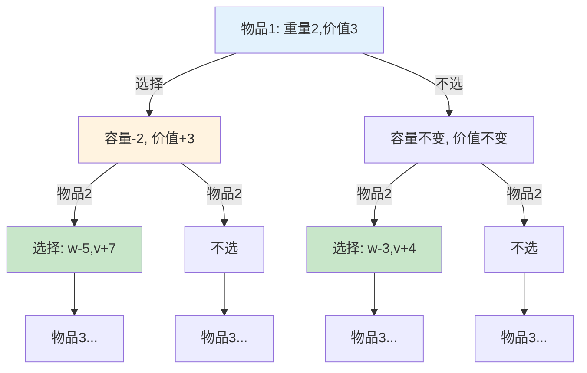
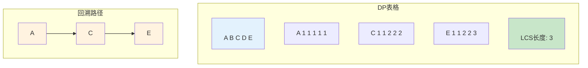
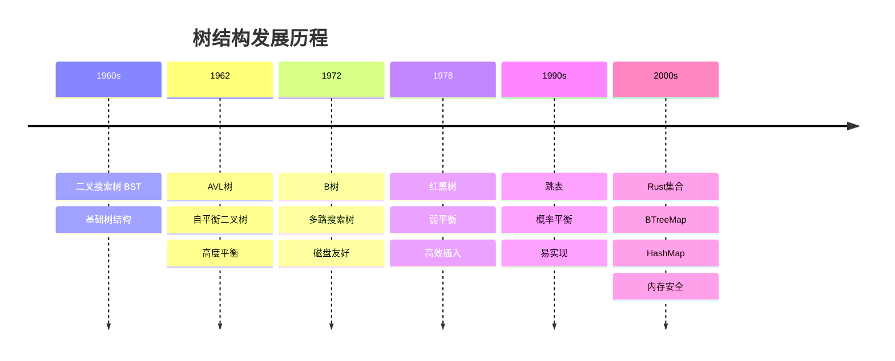
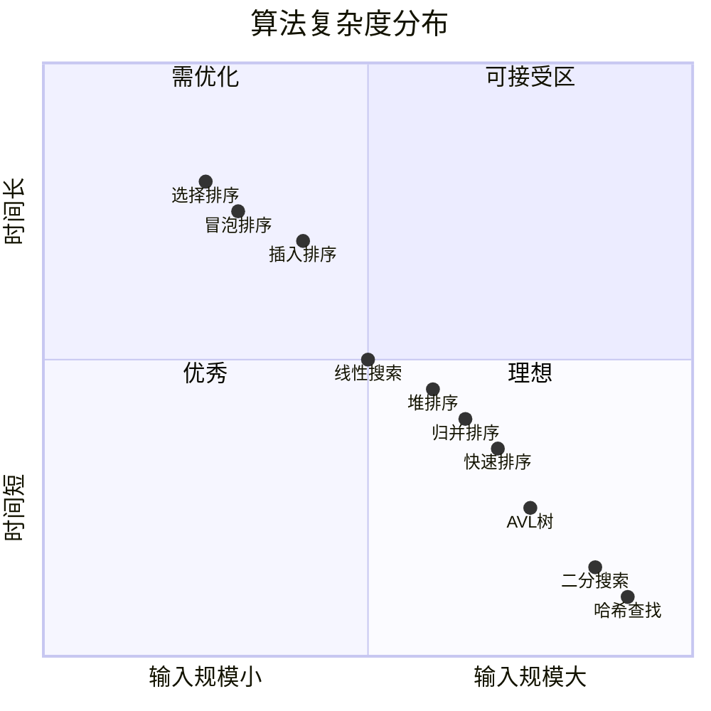

# C08 算法 思维导图与可视化

> **文档定位**: Rust 1.90 算法与数据结构可视化学习  
> **创建日期**: 2025-10-20  
> **适用版本**: Rust 1.90+ | Edition 2024  
> **文档类型**: 思维导图 + 流程图 + 算法可视化

---

## 📊 目录

- [C08 算法 思维导图与可视化](#c08-算法-思维导图与可视化)
  - [📊 目录](#-目录)
  - [1. 算法全景思维导图](#1-算法全景思维导图)
    - [算法分类总览](#算法分类总览)
  - [2. 排序算法可视化](#2-排序算法可视化)
    - [快速排序流程](#快速排序流程)
    - [归并排序过程](#归并排序过程)
  - [3. 搜索算法可视化](#3-搜索算法可视化)
    - [二分搜索流程](#二分搜索流程)
    - [深度优先搜索](#深度优先搜索)
  - [4. 图算法可视化](#4-图算法可视化)
    - [Dijkstra最短路径](#dijkstra最短路径)
    - [最小生成树](#最小生成树)
  - [5. 动态规划可视化](#5-动态规划可视化)
    - [背包问题决策树](#背包问题决策树)
    - [最长公共子序列](#最长公共子序列)
  - [6. 数据结构演化](#6-数据结构演化)
    - [树结构演化](#树结构演化)
  - [7. 复杂度分析可视化](#7-复杂度分析可视化)
    - [时间复杂度对比](#时间复杂度对比)
  - [相关文档](#相关文档)
  - [返回导航](#返回导航)

---

## 1. 算法全景思维导图

### 算法分类总览

```mermaid
mindmap
  root((算法与数据结构))
    排序算法
      比较排序
        快速排序 O(n log n)
        归并排序 O(n log n)
        堆排序 O(n log n)
      非比较排序
        计数排序 O(n+k)
        桶排序 O(n+k)
        基数排序 O(d(n+k))
    搜索算法
      线性搜索
        顺序查找 O(n)
        哨兵查找
      二分搜索
        标准二分 O(log n)
        插值查找
        指数查找
      树搜索
        BST O(log n)
        AVL O(log n)
        红黑树 O(log n)
    图算法
      最短路径
        Dijkstra 单源
        Bellman-Ford 负权
        Floyd-Warshall 全源
      最小生成树
        Kruskal 边排序
        Prim 顶点优先
      拓扑排序
        Kahn算法
        DFS算法
    动态规划
      线性DP
        最长递增子序列
        最大子数组和
        编辑距离
      区间DP
        矩阵链乘法
        石子合并
      树形DP
        树的直径
        树的重心
      状态压缩DP
        TSP旅行商
        集合覆盖
    数据结构
      线性结构
        数组 连续存储
        链表 链式存储
        栈 LIFO
        队列 FIFO
      树结构
        二叉树
        B树/B+树
        字典树 Trie
        线段树
      图结构
        邻接表
        邻接矩阵
        稀疏图
      高级结构
        并查集 Union-Find
        跳表 SkipList
        布隆过滤器
```

---

## 2. 排序算法可视化

### 快速排序流程



### 归并排序过程



---

## 3. 搜索算法可视化

### 二分搜索流程



### 深度优先搜索



---

## 4. 图算法可视化

### Dijkstra最短路径



### 最小生成树



---

## 5. 动态规划可视化

### 背包问题决策树



### 最长公共子序列



---

## 6. 数据结构演化

### 树结构演化



---

## 7. 复杂度分析可视化

### 时间复杂度对比

```mermaid
%%{init: {'theme':'base'}}%%
graph LR
    subgraph "常见复杂度增长"
        O1[O(1)<br/>常数]
        OlogN[O(log n)<br/>对数]
        ON[O(n)<br/>线性]
        ONlogN[O(n log n)<br/>线性对数]
        ON2[O(n²)<br/>平方]
        ON3[O(n³)<br/>立方]
        O2N[O(2ⁿ)<br/>指数]
    end
    
    O1 --> OlogN
    OlogN --> ON
    ON --> ONlogN
    ONlogN --> ON2
    ON2 --> ON3
    ON3 --> O2N
    
    style O1 fill:#c8e6c9
    style OlogN fill:#c8e6c9
    style ON fill:#fff9c4
    style ONlogN fill:#fff9c4
    style ON2 fill:#ffccbc
    style ON3 fill:#ffccbc
    style O2N fill:#ef9a9a
```

**复杂度实例对比**:



---

## 相关文档

- [知识图谱](./KNOWLEDGE_GRAPH_AND_CONCEPT_RELATIONS.md)
- [多维对比](./MULTI_DIMENSIONAL_COMPARISON_MATRIX.md)
- [算法指南](../guides/)
- [FAQ](../FAQ.md)

---

**文档版本**: v1.0  
**最后更新**: 2025-10-20  
**维护者**: Rust-lang项目组

---

## 返回导航

- [返回主索引](../00_MASTER_INDEX.md)
- [返回README](../README.md)
- [查看理论文档](../theory/)
