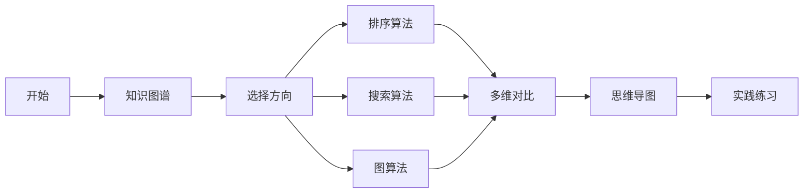
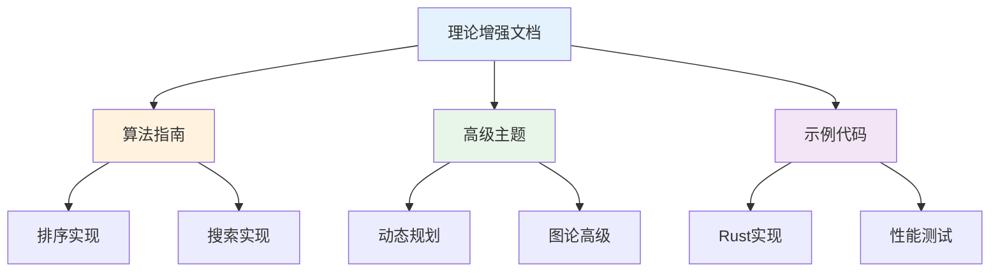

# C08 算法 理论增强文档

> **文档定位**: Rust 1.90 算法与数据结构的高级理论体系  
> **创建日期**: 2025-10-20  
> **适用版本**: Rust 1.90+ | Edition 2024  
> **文档类型**: 理论增强 + 可视化 + 深度对比

---

## 📚 文档列表

### 1. [知识图谱与概念关系](./KNOWLEDGE_GRAPH_AND_CONCEPT_RELATIONS.md) ⭐ 推荐起点

**内容概述**:

- 算法体系知识图谱
- 数据结构分类体系
- 概念关系可视化
- 学习路径规划

**适合人群**:

- 算法初学者
- 数据结构学习者
- 面试准备者

**预计时间**: 30分钟

---

### 2. [多维矩阵对比分析](./MULTI_DIMENSIONAL_COMPARISON_MATRIX.md)

**内容概述**:

- 排序算法深度对比
- 搜索算法性能分析
- 数据结构特性矩阵
- 复杂度分析

**适合人群**:

- 性能优化工程师
- 算法竞赛选手
- 技术面试者

**预计时间**: 40分钟

---

### 3. [思维导图与可视化](./MINDMAP_VISUALIZATION.md)

**内容概述**:

- 算法全景思维导图
- 排序搜索可视化
- 图算法流程图
- 动态规划决策树

**适合人群**:

- 可视化学习者
- 算法理解困难者
- 教学工作者

**预计时间**: 35分钟

---

## 🎯 学习路径

### 快速入门路径

### 深度学习路径

1. **第1周**: 基础算法
   - 阅读知识图谱
   - 学习排序算法
   - 掌握搜索算法

2. **第2周**: 数据结构
   - 线性结构
   - 树结构
   - 图结构

3. **第3周**: 高级算法
   - 动态规划
   - 贪心算法
   - 分治算法

4. **第4周**: 综合实践
   - 算法竞赛
   - 性能优化
   - 实际应用

---

## 📊 内容矩阵

| 文档 | 理论深度 | 实用性 | 可视化 | 推荐度 |
|------|---------|--------|--------|--------|
| 知识图谱 | ⭐⭐⭐⭐⭐ | ⭐⭐⭐ | ⭐⭐⭐⭐⭐ | ⭐⭐⭐⭐⭐ |
| 多维对比 | ⭐⭐⭐⭐ | ⭐⭐⭐⭐⭐ | ⭐⭐⭐ | ⭐⭐⭐⭐⭐ |
| 思维导图 | ⭐⭐⭐ | ⭐⭐⭐⭐ | ⭐⭐⭐⭐⭐ | ⭐⭐⭐⭐ |

---

## 🔍 按主题查找

### 排序算法

- 知识图谱 → [排序算法体系](./KNOWLEDGE_GRAPH_AND_CONCEPT_RELATIONS.md#算法体系总览)
- 多维对比 → [排序算法对比](./MULTI_DIMENSIONAL_COMPARISON_MATRIX.md#1-排序算法深度对比)
- 思维导图 → [排序可视化](./MINDMAP_VISUALIZATION.md#2-排序算法可视化)

### 搜索算法

- 知识图谱 → [搜索算法分类](./KNOWLEDGE_GRAPH_AND_CONCEPT_RELATIONS.md#算法体系总览)
- 多维对比 → [搜索算法对比](./MULTI_DIMENSIONAL_COMPARISON_MATRIX.md#2-搜索算法对比)
- 思维导图 → [搜索可视化](./MINDMAP_VISUALIZATION.md#3-搜索算法可视化)

### 图算法

- 知识图谱 → [图算法体系](./KNOWLEDGE_GRAPH_AND_CONCEPT_RELATIONS.md#算法体系总览)
- 多维对比 → [图算法对比](./MULTI_DIMENSIONAL_COMPARISON_MATRIX.md#3-图算法对比)
- 思维导图 → [图算法可视化](./MINDMAP_VISUALIZATION.md#4-图算法可视化)

### 数据结构

- 知识图谱 → [数据结构分类](./KNOWLEDGE_GRAPH_AND_CONCEPT_RELATIONS.md#数据结构分类)
- 多维对比 → [数据结构对比](./MULTI_DIMENSIONAL_COMPARISON_MATRIX.md#4-数据结构对比)
- 思维导图 → [结构演化](./MINDMAP_VISUALIZATION.md#6-数据结构演化)

---

## 💡 文档特色

### 1. 系统性

✅ **完整的知识体系**: 从基础到高级  
✅ **结构化组织**: 清晰的层次和逻辑  
✅ **交叉引用**: 文档之间相互关联

### 2. 可视化

✅ **Mermaid图表**: 10+个可视化图表  
✅ **思维导图**: 直观的知识结构  
✅ **流程图**: 清晰的算法流程

### 3. 实用性

✅ **复杂度分析**: 详尽的性能数据  
✅ **选型指南**: 实用的决策建议  
✅ **最佳实践**: 经验总结

---

## 📈 与其他文档的关系

---

## 🎓 适用场景

### 场景1: 算法学习

**阅读顺序**:

1. [知识图谱](./KNOWLEDGE_GRAPH_AND_CONCEPT_RELATIONS.md) - 建立体系
2. [思维导图](./MINDMAP_VISUALIZATION.md) - 可视化理解
3. [实践练习](../guides/)

### 场景2: 面试准备

**阅读顺序**:

1. [多维对比](./MULTI_DIMENSIONAL_COMPARISON_MATRIX.md) - 掌握要点
2. [复杂度分析](./MINDMAP_VISUALIZATION.md#7-复杂度分析可视化)
3. [常见问题](../FAQ.md)

### 场景3: 性能优化

**阅读顺序**:

1. [算法对比](./MULTI_DIMENSIONAL_COMPARISON_MATRIX.md)
2. [数据结构选择](./KNOWLEDGE_GRAPH_AND_CONCEPT_RELATIONS.md#数据结构特性矩阵)
3. [实际应用](../guides/)

### 场景4: 教学辅助

**阅读顺序**:

1. [思维导图](./MINDMAP_VISUALIZATION.md) - 可视化展示
2. [知识图谱](./KNOWLEDGE_GRAPH_AND_CONCEPT_RELATIONS.md) - 系统讲解
3. [示例代码](../guides/)

---

## 📚 相关资源

### 模块内文档

- [主索引](../00_MASTER_INDEX.md)
- [README](../README.md)
- [FAQ](../FAQ.md)
- [术语表](../Glossary.md)

### 算法指南

- [排序算法](../guides/)
- [搜索算法](../guides/)
- [图算法](../guides/)

### 高级主题

- [动态规划](../advanced/)
- [贪心算法](../advanced/)
- [分治算法](../advanced/)

---

## ✅ 文档状态

| 文档 | 状态 | 完成度 | 最后更新 |
|------|------|--------|----------|
| 知识图谱 | ✅ 完成 | 100% | 2025-10-20 |
| 多维对比 | ✅ 完成 | 100% | 2025-10-20 |
| 思维导图 | ✅ 完成 | 100% | 2025-10-20 |
| README | ✅ 完成 | 100% | 2025-10-20 |

---

## 🤝 贡献指南

### 文档改进

欢迎提交：

- 算法优化建议
- 错误修正
- 图表优化
- 示例添加

### 反馈渠道

- Issue反馈
- Pull Request
- 邮件联系

---

**文档版本**: v1.0  
**总文档数**: 4篇  
**总图表数**: 12+个  
**最后更新**: 2025-10-20  
**维护者**: Rust-lang项目组

---

## 返回导航

- [返回主索引](../00_MASTER_INDEX.md)
- [返回模块README](../README.md)
- [查看指南](../guides/)
- [查看高级主题](../advanced/)
