# 设计模式知识图谱 (Design Patterns Knowledge Graph)

> **文档定位**: 全景展示设计模式之间的关系、依赖、组合和演化路径  
> **适用版本**: Rust 1.90+ (Edition 2024)  
> **最后更新**: 2025-10-19

---

## 📊 文档概览

本文档通过知识图谱的方式，系统化地展示：

1. 🔗 **模式关系网络** - 模式之间的继承、组合、依赖关系
2. 🎯 **概念层级结构** - 从抽象概念到具体实现的层次
3. 🔄 **演化路径** - 模式如何从简单到复杂演进
4. 🧩 **模式组合** - 常见的模式组合策略
5. 📈 **适用场景映射** - 从问题域到解决方案的映射

---

## 🏗️ 第一部分：设计模式关系网络

### 1.1 核心概念层级

```mermaid
graph TD
    A[设计模式总览] --> B[创建型模式]
    A --> C[结构型模式]
    A --> D[行为型模式]
    A --> E[并发模式]
    A --> F[Rust特有模式]
    
    B --> B1[对象创建]
    B --> B2[实例管理]
    
    C --> C1[对象组合]
    C --> C2[接口适配]
    
    D --> D1[对象协作]
    D --> D2[算法封装]
    D --> D3[状态管理]
    
    E --> E1[异步模式]
    E --> E2[并行模式]
    E --> E3[消息传递]
    
    F --> F1[所有权模式]
    F --> F2[生命周期模式]
    F --> F3[零成本抽象]
```

### 1.2 创建型模式关系图

```mermaid
graph LR
    subgraph "创建型模式族"
        S[单例 Singleton] 
        F[工厂 Factory]
        AF[抽象工厂 Abstract Factory]
        B[建造者 Builder]
        P[原型 Prototype]
        OP[对象池 Object Pool]
        SCM[静态创建方法]
    end
    
    %% 关系连接
    F -.升级.-> AF
    F --> SCM
    B -.解决复杂创建.-> AF
    P -.避免重复创建.-> F
    S -.全局访问.-> OP
    OP -.性能优化.-> P
    
    %% 应用场景
    S ==> |全局状态| UseCase1[配置管理]
    F ==> |多态创建| UseCase2[数据库连接]
    B ==> |复杂对象| UseCase3[HTTP请求]
    P ==> |快速复制| UseCase4[游戏对象]
    OP ==> |资源重用| UseCase5[线程池]
```

**关系说明**：

| 源模式 | 目标模式 | 关系类型 | 说明 |
|--------|---------|---------|------|
| 工厂 | 抽象工厂 | 升级 | 抽象工厂是工厂的泛化 |
| 建造者 | 抽象工厂 | 解决问题 | 建造者解决抽象工厂的复杂创建问题 |
| 原型 | 工厂 | 优化 | 原型模式避免工厂的重复创建开销 |
| 单例 | 对象池 | 扩展 | 对象池是单例的多实例版本 |
| 对象池 | 原型 | 组合 | 对象池可使用原型来复制对象 |

### 1.3 结构型模式关系图

```mermaid
graph TD
    subgraph "结构型模式族"
        AD[适配器 Adapter]
        BR[桥接 Bridge]
        CO[组合 Composite]
        DE[装饰器 Decorator]
        FA[外观 Facade]
        FL[享元 Flyweight]
        PR[代理 Proxy]
    end
    
    %% 模式关系
    AD -.接口转换.-> BR
    DE -.功能扩展.-> AD
    PR -.访问控制.-> DE
    CO -.递归结构.-> DE
    FA -.简化接口.-> CO
    FL -.内存优化.-> PR
    
    %% Rust特性映射
    AD --> |trait impl| RUST1[Trait适配]
    BR --> |泛型| RUST2[类型参数]
    DE --> |组合| RUST3[嵌套结构]
    PR --> |智能指针| RUST4[Arc/Box]
    FL --> |intern| RUST5[字符串池]
```

**模式协作矩阵**：

|        | 适配器 | 桥接 | 组合 | 装饰器 | 外观 | 享元 | 代理 |
|--------|--------|------|------|--------|------|------|------|
| **适配器** | - | 🔄 | ⚡ | ⚡ | ✅ | - | ⚡ |
| **桥接** | 🔄 | - | ✅ | - | ⚡ | - | - |
| **组合** | ⚡ | ✅ | - | 🔗 | ✅ | - | - |
| **装饰器** | ⚡ | - | 🔗 | - | - | - | 🔄 |
| **外观** | ✅ | ⚡ | ✅ | - | - | ⚡ | ✅ |
| **享元** | - | - | - | - | ⚡ | - | ✅ |
| **代理** | ⚡ | - | - | 🔄 | ✅ | ✅ | - |

**图例**：

- ✅ 强协作 (经常一起使用)
- 🔗 可组合 (可以嵌套使用)
- 🔄 可替代 (在某些场景下可互换)
- ⚡ 弱关联 (偶尔配合使用)

### 1.4 行为型模式关系图

```mermaid
graph TB
    subgraph "行为型模式族"
        CH[责任链 Chain]
        CM[命令 Command]
        IT[迭代器 Iterator]
        ME[中介者 Mediator]
        MM[备忘录 Memento]
        OB[观察者 Observer]
        ST[状态 State]
        STR[策略 Strategy]
        TM[模板方法 Template]
        VI[访问者 Visitor]
        IN[解释器 Interpreter]
    end
    
    %% 模式关系
    CH --> |请求传递| ME
    CM --> |封装请求| MM
    OB --> |事件通知| ME
    ST --> |状态转换| STR
    IT --> |遍历| VI
    TM --> |算法框架| STR
    VI --> |操作分离| IN
    
    %% 应用层
    CH ==> APP1[中间件链]
    CM ==> APP2[事务系统]
    OB ==> APP3[事件总线]
    ST ==> APP4[协议状态机]
    STR ==> APP5[排序算法]
```

**行为型模式的职责分类**：

```mermaid
pie title 行为型模式职责分布
    "对象协作" : 30
    "算法封装" : 25
    "状态管理" : 20
    "请求处理" : 15
    "数据遍历" : 10
```

---

## 🔄 第二部分：模式演化路径

### 2.1 从简单到复杂的演化

```mermaid
graph LR
    subgraph "Level 1: 基础模式"
        L1_1[简单工厂]
        L1_2[策略]
        L1_3[模板方法]
    end
    
    subgraph "Level 2: 中级模式"
        L2_1[工厂方法]
        L2_2[状态]
        L2_3[命令]
    end
    
    subgraph "Level 3: 高级模式"
        L3_1[抽象工厂]
        L3_2[中介者]
        L3_3[访问者]
    end
    
    L1_1 --> L2_1 --> L3_1
    L1_2 --> L2_2
    L1_3 --> L2_3 --> L3_2
```

### 2.2 Rust特有演化

```mermaid
graph TD
    A[C++/Java 经典模式] --> B[Rust 基础适配]
    B --> C[Rust 所有权优化]
    C --> D[Rust 零成本抽象]
    D --> E[Rust 1.90 特性增强]
    
    A1[单例 - 全局变量] --> B1[单例 - lazy_static]
    B1 --> C1[单例 - OnceLock]
    C1 --> D1[单例 - 编译时初始化]
    
    A2[观察者 - 回调] --> B2[观察者 - Channel]
    B2 --> C2[观察者 - GATs借用]
    C2 --> D2[观察者 - async trait]
```

---

## 🧩 第三部分：模式组合策略

### 3.1 常见组合模式

#### 组合1: MVC架构 (模型-视图-控制器)

```mermaid
graph LR
    M[模型 Model] --> |观察者| V[视图 View]
    C[控制器 Controller] --> |命令| M
    V --> |策略| C
    
    M -.单例.-> DB[(数据库)]
    C -.工厂.-> V
```

**Rust实现关键**：

- Model: 使用`观察者模式` + `Arc<RwLock<T>>`
- View: 使用`策略模式` (trait对象)
- Controller: 使用`命令模式` (闭包)

#### 组合2: 插件系统

```mermaid
graph TD
    Core[核心系统] --> |外观| API[插件API]
    API --> |抽象工厂| P1[插件1]
    API --> |抽象工厂| P2[插件2]
    API --> |抽象工厂| P3[插件3]
    
    P1 --> |代理| Service1[服务1]
    P2 --> |适配器| Service2[服务2]
    P3 --> |装饰器| Service3[服务3]
    
    Core --> |观察者| EventBus[事件总线]
    EventBus -.通知.-> P1
    EventBus -.通知.-> P2
    EventBus -.通知.-> P3
```

**Rust实现要点**：

```rust
// 插件接口 (抽象工厂)
pub trait PluginFactory {
    fn create_plugin(&self) -> Box<dyn Plugin>;
}

// 插件特性 (外观模式)
pub trait Plugin: Send + Sync {
    fn name(&self) -> &str;
    fn initialize(&mut self) -> Result<(), Error>;
    fn execute(&self, context: &Context) -> Result<(), Error>;
}

// 插件管理器 (单例 + 观察者)
pub struct PluginManager {
    plugins: Vec<Box<dyn Plugin>>,
    event_bus: Arc<EventBus>,
}
```

#### 组合3: 异步任务系统

```mermaid
graph TD
    Scheduler[任务调度器<br/>Strategy] --> |生产者消费者| Queue[任务队列]
    Queue --> |命令模式| Task1[任务1]
    Queue --> |命令模式| Task2[任务2]
    Queue --> |命令模式| Task3[任务3]
    
    Task1 --> |状态模式| Executing[执行中]
    Executing --> |备忘录| Checkpoints[(检查点)]
    Executing --> |观察者| Monitor[监控器]
    
    Monitor --> |装饰器| Logging[日志]
    Monitor --> |装饰器| Metrics[指标]
```

**Rust 1.90 实现**：

```rust
use std::sync::Arc;
use tokio::sync::mpsc;

// 任务命令 (命令模式)
#[async_trait::async_trait]
pub trait AsyncTask: Send + Sync {
    async fn execute(&self) -> Result<(), Error>;
}

// 任务调度器 (策略模式)
pub struct TaskScheduler {
    strategy: Box<dyn SchedulingStrategy>,
    queue: mpsc::Sender<Box<dyn AsyncTask>>,
}

// 调度策略 (策略模式)
pub trait SchedulingStrategy: Send + Sync {
    fn prioritize(&self, tasks: &mut [Box<dyn AsyncTask>]);
}

// 任务监控 (观察者模式 + GATs)
pub trait TaskObserver {
    type ViewType<'a> where Self: 'a;
    fn on_task_start<'a>(&'a self, task: &dyn AsyncTask) -> Self::ViewType<'a>;
    fn on_task_complete(&self, result: &Result<(), Error>);
}
```

### 3.2 模式组合决策树

```mermaid
graph TD
    Start{需要什么?}
    Start --> Create{创建对象?}
    Start --> Structure{组织结构?}
    Start --> Behavior{定义行为?}
    
    Create --> Simple{简单创建?}
    Simple -->|是| UseFactory[工厂模式]
    Simple -->|否| Complex{复杂配置?}
    Complex -->|是| UseBuilder[建造者<br/>+ 工厂]
    Complex -->|否| UsePrototype[原型<br/>+ 对象池]
    
    Structure --> Interface{接口适配?}
    Interface -->|是| UseAdapter[适配器<br/>+ 外观]
    Interface -->|否| Enhance{功能扩展?}
    Enhance -->|是| UseDecorator[装饰器<br/>+ 代理]
    Enhance -->|否| UseComposite[组合<br/>+ 享元]
    
    Behavior --> Event{事件驱动?}
    Event -->|是| UseObserver[观察者<br/>+ 中介者]
    Event -->|否| Algorithm{算法变化?}
    Algorithm -->|是| UseStrategy[策略<br/>+ 模板方法]
    Algorithm -->|否| UseState[状态<br/>+ 命令]
```

---

## 📈 第四部分：概念关系性质矩阵

### 4.1 模式属性多维分析

| 模式 | 复杂度 | 性能开销 | 灵活性 | 可测试性 | 类型安全 | 并发安全 |
|------|--------|---------|--------|---------|---------|---------|
| **单例** | ⭐ | 极低 | ⭐ | ⭐⭐ | ⭐⭐⭐⭐⭐ | ⭐⭐⭐⭐⭐ |
| **工厂** | ⭐⭐ | 低 | ⭐⭐⭐⭐ | ⭐⭐⭐⭐ | ⭐⭐⭐⭐ | ⭐⭐⭐ |
| **建造者** | ⭐⭐⭐ | 低 | ⭐⭐⭐⭐⭐ | ⭐⭐⭐⭐⭐ | ⭐⭐⭐⭐⭐ | ⭐⭐⭐ |
| **适配器** | ⭐⭐ | 极低 | ⭐⭐⭐ | ⭐⭐⭐⭐ | ⭐⭐⭐⭐ | ⭐⭐⭐⭐ |
| **装饰器** | ⭐⭐ | 低 | ⭐⭐⭐⭐⭐ | ⭐⭐⭐⭐ | ⭐⭐⭐⭐ | ⭐⭐⭐ |
| **代理** | ⭐⭐ | 中 | ⭐⭐⭐⭐ | ⭐⭐⭐ | ⭐⭐⭐⭐ | ⭐⭐⭐⭐ |
| **观察者** | ⭐⭐⭐⭐ | 中 | ⭐⭐⭐⭐⭐ | ⭐⭐⭐ | ⭐⭐⭐ | ⭐⭐ |
| **策略** | ⭐⭐ | 低 | ⭐⭐⭐⭐⭐ | ⭐⭐⭐⭐⭐ | ⭐⭐⭐⭐ | ⭐⭐⭐⭐ |
| **状态** | ⭐⭐⭐ | 低 | ⭐⭐⭐⭐ | ⭐⭐⭐⭐ | ⭐⭐⭐⭐⭐ | ⭐⭐⭐ |
| **命令** | ⭐⭐ | 低 | ⭐⭐⭐⭐⭐ | ⭐⭐⭐⭐⭐ | ⭐⭐⭐⭐ | ⭐⭐⭐⭐ |
| **责任链** | ⭐⭐⭐ | 中 | ⭐⭐⭐⭐ | ⭐⭐⭐⭐ | ⭐⭐⭐ | ⭐⭐ |
| **中介者** | ⭐⭐⭐⭐ | 中 | ⭐⭐⭐ | ⭐⭐⭐ | ⭐⭐⭐ | ⭐⭐ |
| **访问者** | ⭐⭐⭐⭐⭐ | 低 | ⭐⭐⭐ | ⭐⭐⭐⭐ | ⭐⭐⭐ | ⭐⭐⭐ |

### 4.2 Rust特性适配度

```mermaid
graph TB
    subgraph "Rust 1.90 特性映射"
        F1[OnceLock] --> P1[单例模式]
        F2[GATs] --> P2[观察者模式]
        F3[async trait] --> P3[异步模式]
        F4[RPITIT] --> P4[迭代器模式]
        F5[let-else] --> P5[责任链模式]
        F6[TypeState] --> P6[建造者模式]
        F7[PhantomData] --> P7[状态模式]
        F8[trait bounds] --> P8[策略模式]
    end
```

**特性适配矩阵**：

| Rust 1.90 特性 | 最佳适配模式 | 适配度 | 性能提升 | 示例位置 | 完整示例 |
|----------------|-------------|--------|---------|---------|---------|
| **OnceLock** | 单例 | ⭐⭐⭐⭐⭐ | 100% | `creational/singleton/` | [`oncelock_singleton_comprehensive.rs`](../examples/oncelock_singleton_comprehensive.rs) |
| **GATs** | 观察者 | ⭐⭐⭐⭐⭐ | 零拷贝 | `behavioral/observer/` | [`gats_observer_advanced.rs`](../examples/gats_observer_advanced.rs) |
| **async trait** | 异步模式 | ⭐⭐⭐⭐⭐ | 简化代码 | `concurrency/asynchronous/` | [`native_async_trait_app.rs`](../examples/native_async_trait_app.rs) |
| **RPITIT** | 迭代器/流水线 | ⭐⭐⭐⭐ | 零开销 | `parallel/pipeline/` | [`rpitit_pipeline_advanced.rs`](../examples/rpitit_pipeline_advanced.rs) |
| **let-else** | 责任链 | ⭐⭐⭐⭐ | 可读性↑ | `behavioral/chain_of_responsibility/` | [`let_else_chain_advanced.rs`](../examples/let_else_chain_advanced.rs) |
| **dyn upcasting** | 适配器 | ⭐⭐⭐ | 灵活性↑ | `structural/adapter/` | [`dyn_upcasting_adapter.rs`](../examples/dyn_upcasting_adapter.rs) |

---

## 🎯 第五部分：问题域到解决方案映射

### 5.1 场景驱动的模式选择

```mermaid
graph TD
    subgraph "问题域"
        P1[全局配置管理]
        P2[数据库连接池]
        P3[HTTP请求构建]
        P4[日志系统]
        P5[插件架构]
        P6[状态机]
        P7[事件系统]
        P8[算法切换]
    end
    
    subgraph "设计模式"
        S1[单例]
        S2[对象池 + 工厂]
        S3[建造者 + TypeState]
        S4[装饰器 + 代理]
        S5[抽象工厂 + 外观]
        S6[状态 + 策略]
        S7[观察者 + 中介者]
        S8[策略 + 模板方法]
    end
    
    P1 --> S1
    P2 --> S2
    P3 --> S3
    P4 --> S4
    P5 --> S5
    P6 --> S6
    P7 --> S7
    P8 --> S8
```

### 5.2 性能需求映射

```mermaid
graph LR
    subgraph "性能需求"
        N1[零运行时开销]
        N2[内存高效]
        N3[高并发]
        N4[低延迟]
    end
    
    subgraph "模式选择"
        M1[泛型策略]
        M2[享元 + 对象池]
        M3[异步 + Actor]
        M4[无锁数据结构]
    end
    
    subgraph "Rust实现"
        R1[单态化]
        R2[Arc + Intern]
        R3[Tokio + Channel]
        R4[Atomic + CAS]
    end
    
    N1 --> M1 --> R1
    N2 --> M2 --> R2
    N3 --> M3 --> R3
    N4 --> M4 --> R4
```

---

## 🔍 第六部分：反模式与陷阱

### 6.1 常见误用

```mermaid
graph TD
    Anti1[❌ 过度使用单例] --> Fix1[✅ 依赖注入]
    Anti2[❌ 深层装饰器嵌套] --> Fix2[✅ 组合模式]
    Anti3[❌ 观察者内存泄漏] --> Fix3[✅ Weak引用]
    Anti4[❌ 策略爆炸] --> Fix4[✅ 配置驱动]
    Anti5[❌ 状态图混乱] --> Fix5[✅ 类型状态]
```

**反模式对照表**：

| 反模式 | 问题 | Rust陷阱 | 正确做法 |
|--------|------|---------|---------|
| **单例滥用** | 全局状态耦合 | 难以测试 | 依赖注入 + 构造器传递 |
| **过度抽象** | 性能损失 | trait对象开销 | 泛型单态化 |
| **观察者泄漏** | 内存泄漏 | `Rc<RefCell>`循环 | `Weak` + 手动清理 |
| **深层嵌套** | 调试困难 | 类型推导失败 | 扁平化设计 |
| **状态爆炸** | 维护困难 | 枚举分支过多 | 状态分组 + 子状态机 |

### 6.2 Rust特有陷阱

```rust
// ❌ 错误：观察者内存泄漏
use std::rc::Rc;
use std::cell::RefCell;

pub struct Subject {
    observers: Vec<Rc<RefCell<dyn Observer>>>, // 强引用导致泄漏
}

// ✅ 正确：使用Weak避免泄漏
use std::rc::Weak;

pub struct Subject {
    observers: Vec<Weak<RefCell<dyn Observer>>>, // 弱引用
}

impl Subject {
    pub fn notify(&self) {
        self.observers.retain(|obs| {
            if let Some(observer) = obs.upgrade() {
                observer.borrow_mut().update();
                true // 保留有效观察者
            } else {
                false // 移除已失效的观察者
            }
        });
    }
}
```

---

## 📊 第七部分：知识图谱统计

### 7.1 模式覆盖度

```mermaid
pie title 模式类型分布
    "创建型 (7个)" : 21
    "结构型 (7个)" : 21
    "行为型 (11个)" : 33
    "并发型 (6个)" : 18
    "并行型 (5个)" : 15
    "领域型 (4个)" : 12
```

### 7.2 Rust特性使用统计

| 特性 | 使用次数 | 主要模式 | 优势 |
|------|---------|---------|------|
| **OnceLock** | 1 | 单例 | 线程安全初始化 |
| **GATs** | 3 | 观察者、迭代器、Future | 零拷贝借用 |
| **async trait** | 8 | 所有异步模式 | 简化异步代码 |
| **RPITIT** | 5 | 迭代器、流水线 | 返回impl Trait |
| **let-else** | 4 | 责任链、工厂 | 早退模式 |
| **泛型** | 所有模式 | 全部 | 零成本抽象 |
| **trait bounds** | 所有模式 | 全部 | 编译时约束 |

### 7.3 复杂度分析

```mermaid
graph LR
    subgraph "实现复杂度"
        Low[简单 ⭐⭐]
        Med[中等 ⭐⭐⭐]
        High[复杂 ⭐⭐⭐⭐]
        VHigh[很复杂 ⭐⭐⭐⭐⭐]
    end
    
    Low --> |6个模式| L1[策略、适配器等]
    Med --> |10个模式| M1[工厂、装饰器等]
    High --> |8个模式| H1[观察者、状态等]
    VHigh --> |6个模式| V1[访问者、中介者等]
```

---

## 🚀 第八部分：学习路径推荐

### 8.1 基于知识图谱的学习顺序

```mermaid
graph TD
    Week1[第1周: 基础] --> Week2[第2周: 结构]
    Week2 --> Week3[第3周: 行为]
    Week3 --> Week4[第4周: 并发]
    Week4 --> Week5[第5-8周: 高级]
    
    Week1 --> W1_1[单例]
    Week1 --> W1_2[工厂]
    Week1 --> W1_3[策略]
    
    Week2 --> W2_1[适配器]
    Week2 --> W2_2[装饰器]
    Week2 --> W2_3[代理]
    
    Week3 --> W3_1[观察者]
    Week3 --> W3_2[命令]
    Week3 --> W3_3[状态]
    
    Week4 --> W4_1[异步模式]
    Week4 --> W4_2[消息传递]
    Week4 --> W4_3[Actor模式]
    
    Week5 --> W5_1[模式组合]
    Week5 --> W5_2[架构设计]
    Week5 --> W5_3[性能优化]
```

### 8.2 前置依赖关系

| 模式 | 前置知识 | 推荐学习顺序 |
|------|---------|-------------|
| **抽象工厂** | 工厂方法 | 3 |
| **装饰器** | 适配器 | 4 |
| **中介者** | 观察者 | 8 |
| **访问者** | 迭代器 | 10 |
| **状态** | 策略 | 6 |
| **Actor** | 观察者 + Channel | 12 |

---

## 📝 第九部分：实践检查清单

### 9.1 模式选择检查清单

- [ ] **问题分析**
  - [ ] 明确问题域
  - [ ] 识别变化点
  - [ ] 评估复杂度

- [ ] **模式评估**
  - [ ] 查看知识图谱找到候选模式
  - [ ] 检查模式适配矩阵
  - [ ] 考虑模式组合

- [ ] **Rust适配**
  - [ ] 检查Rust特性支持
  - [ ] 评估性能影响
  - [ ] 考虑所有权约束

- [ ] **实施验证**
  - [ ] 编写测试用例
  - [ ] 性能基准测试
  - [ ] 代码审查

### 9.2 代码质量检查

```rust
// 检查清单示例
pub mod pattern_checklist {
    /// ✅ 1. 所有权清晰
    /// ✅ 2. 生命周期明确
    /// ✅ 3. 错误处理完善
    /// ✅ 4. 文档注释完整
    /// ✅ 5. 单元测试覆盖
    /// ✅ 6. 性能可接受
    pub trait PatternQuality {
        fn validate_ownership(&self) -> bool;
        fn validate_lifetime(&self) -> bool;
        fn validate_error_handling(&self) -> bool;
    }
}
```

---

## 🔗 相关文档

- [多维矩阵对比](./MULTIDIMENSIONAL_MATRIX_COMPARISON.md) - 详细的性能和特性对比
- [思维导图](./MIND_MAP.md) - 可视化学习路径
- [Rust 1.90 特性示例](./RUST_190_EXAMPLES.md) - 最新特性应用
- [综合设计模式指南](./COMPREHENSIVE_DESIGN_PATTERNS_GUIDE.md) - 完整理论和实践

## 🚀 快速开始

运行完整示例以深入理解 Rust 1.90 特性在设计模式中的应用：

```bash
# OnceLock 单例模式 - 全局状态管理
cargo run --example oncelock_singleton_comprehensive

# GATs 观察者模式 - 零拷贝事件系统
cargo run --example gats_observer_advanced

# 原生 async trait - 异步中间件链
cargo run --example native_async_trait_app

# RPITIT 流水线 - 数据处理管道
cargo run --example rpitit_pipeline_advanced

# let-else 责任链 - HTTP 中间件
cargo run --example let_else_chain_advanced

# dyn upcasting - 设备管理系统
cargo run --example dyn_upcasting_adapter
```

---

**文档维护者**: Rust 设计模式社区  
**贡献方式**: 欢迎提交 PR 补充新的模式关系和组合策略  
**许可证**: MIT/Apache-2.0  
**最后更新**: 2025-10-19

---

*本知识图谱持续更新，反映最新的Rust设计模式实践和研究成果。所有示例代码均可运行，包含完整的注释和测试用例。*
