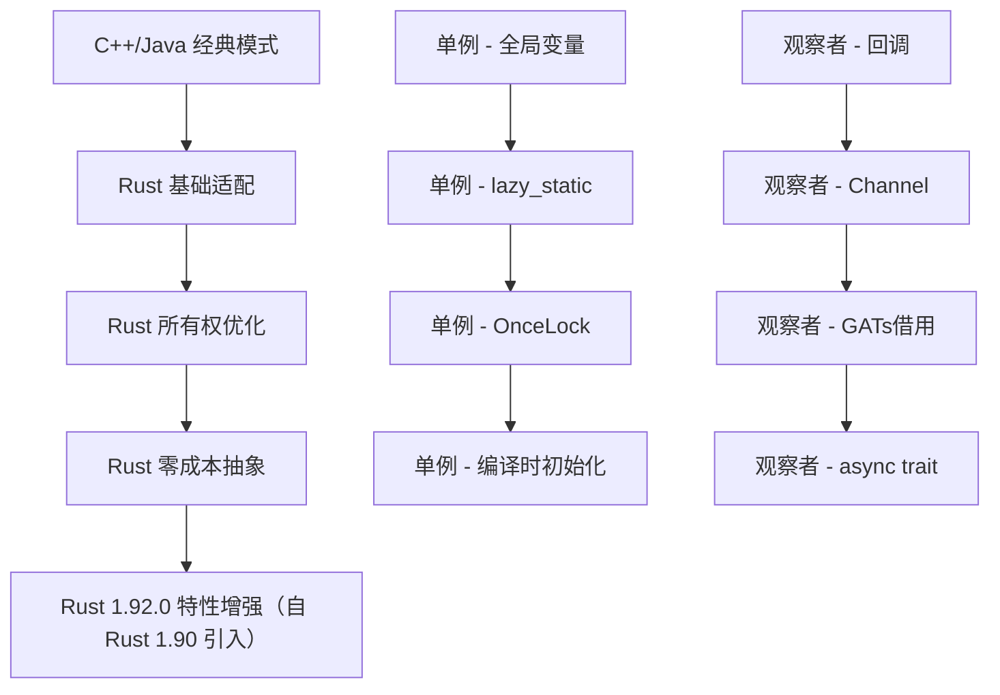
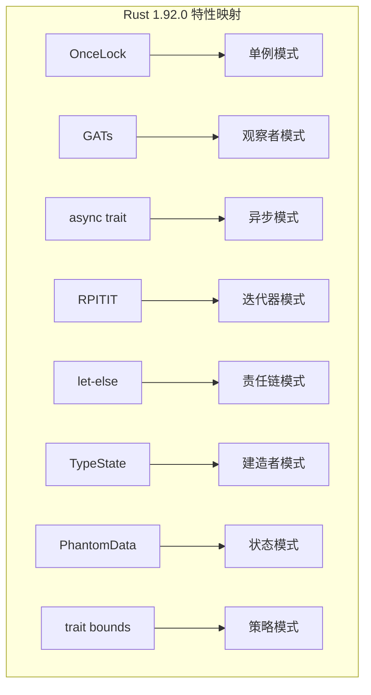

# 设计模式知识图谱 (Design Patterns Knowledge Graph)

> **文档定位**: 全景展示设计模式之间的关系、依赖、组合和演化路径
> **适用版本**: Rust 1.92.0+ (Edition 2024)
> **最后更新**: 2025-12-11

---

## 📊 目录

- [设计模式知识图谱 (Design Patterns Knowledge Graph)](#设计模式知识图谱-design-patterns-knowledge-graph)
  - [📊 目录](#-目录)
  - [📊 文档概览](#-文档概览)
  - [🏗️ 第一部分：设计模式关系网络](#️-第一部分设计模式关系网络)
    - [1.1 核心概念层级](#11-核心概念层级)
    - [1.2 创建型模式关系图](#12-创建型模式关系图)
    - [1.3 结构型模式关系图](#13-结构型模式关系图)
    - [1.4 行为型模式关系图](#14-行为型模式关系图)
  - [🔄 第二部分：模式演化路径](#-第二部分模式演化路径)
    - [2.1 从简单到复杂的演化](#21-从简单到复杂的演化)
    - [2.2 Rust特有演化](#22-rust特有演化)
  - [🧩 第三部分：模式组合策略](#-第三部分模式组合策略)
    - [3.1 常见组合模式](#31-常见组合模式)
      - [组合1: MVC架构 (模型-视图-控制器)](#组合1-mvc架构-模型-视图-控制器)
      - [组合2: 插件系统](#组合2-插件系统)
      - [组合3: 异步任务系统](#组合3-异步任务系统)
    - [3.2 模式组合决策树](#32-模式组合决策树)
  - [📈 第四部分：概念关系性质矩阵](#-第四部分概念关系性质矩阵)
    - [4.1 模式属性多维分析](#41-模式属性多维分析)
    - [4.2 Rust特性适配度](#42-rust特性适配度)
  - [🎯 第五部分：问题域到解决方案映射](#-第五部分问题域到解决方案映射)
    - [5.1 场景驱动的模式选择](#51-场景驱动的模式选择)
    - [5.2 性能需求映射](#52-性能需求映射)
  - [🔍 第六部分：反模式与陷阱](#-第六部分反模式与陷阱)
    - [6.1 常见误用](#61-常见误用)
    - [6.2 Rust特有陷阱](#62-rust特有陷阱)
  - [📊 第七部分：知识图谱统计](#-第七部分知识图谱统计)
    - [7.1 模式覆盖度](#71-模式覆盖度)
    - [7.2 Rust特性使用统计](#72-rust特性使用统计)
    - [7.3 复杂度分析](#73-复杂度分析)
  - [🚀 第八部分：学习路径推荐](#-第八部分学习路径推荐)
    - [8.1 基于知识图谱的学习顺序](#81-基于知识图谱的学习顺序)
    - [8.2 前置依赖关系](#82-前置依赖关系)
  - [📝 第九部分：实践检查清单](#-第九部分实践检查清单)
    - [9.1 模式选择检查清单](#91-模式选择检查清单)
    - [9.2 代码质量检查](#92-代码质量检查)
  - [🔗 相关文档](#-相关文档)
  - [🚀 快速开始](#-快速开始)

## 📊 文档概览

本文档通过知识图谱的方式，系统化地展示：

1. 🔗 **模式关系网络** - 模式之间的继承、组合、依赖关系
2. 🎯 **概念层级结构** - 从抽象概念到具体实现的层次
3. 🔄 **演化路径** - 模式如何从简单到复杂演进
4. 🧩 **模式组合** - 常见的模式组合策略
5. 📈 **适用场景映射** - 从问题域到解决方案的映射

---

## 🏗️ 第一部分：设计模式关系网络

### 1.1 核心概念层级


### 1.2 创建型模式关系图


**关系说明**：

| 源模式 | 目标模式 | 关系类型 | 说明 |
| --- | --- | --- | --- |
| 工厂 | 抽象工厂 | 升级 | 抽象工厂是工厂的泛化 |
| 建造者 | 抽象工厂 | 解决问题 | 建造者解决抽象工厂的复杂创建问题 |
| 原型 | 工厂 | 优化 | 原型模式避免工厂的重复创建开销 |
| 单例 | 对象池 | 扩展 | 对象池是单例的多实例版本 |
| 对象池 | 原型 | 组合 | 对象池可使用原型来复制对象 |

### 1.3 结构型模式关系图


**模式协作矩阵**：

|        | 适配器 | 桥接 | 组合 | 装饰器 | 外观 | 享元 | 代理 |
| --- | --- | --- | --- | --- | --- | --- | --- |
| **适配器** | - | 🔄 | ⚡ | ⚡ | ✅ | - | ⚡ |
| **桥接** | 🔄 | - | ✅ | - | ⚡ | - | - |
| **组合** | ⚡ | ✅ | - | 🔗 | ✅ | - | - |
| **装饰器** | ⚡ | - | 🔗 | - | - | - | 🔄 |
| **外观** | ✅ | ⚡ | ✅ | - | - | ⚡ | ✅ |
| **享元** | - | - | - | - | ⚡ | - | ✅ |
| **代理** | ⚡ | - | - | 🔄 | ✅ | ✅ | - |

**图例**：

- ✅ 强协作 (经常一起使用)
- 🔗 可组合 (可以嵌套使用)
- 🔄 可替代 (在某些场景下可互换)
- ⚡ 弱关联 (偶尔配合使用)

### 1.4 行为型模式关系图


**行为型模式的职责分类**：


---

## 🔄 第二部分：模式演化路径

### 2.1 从简单到复杂的演化


### 2.2 Rust特有演化



---

## 🧩 第三部分：模式组合策略

### 3.1 常见组合模式

#### 组合1: MVC架构 (模型-视图-控制器)


**Rust实现关键**：

- Model: 使用`观察者模式` + `Arc<RwLock<T>>`
- View: 使用`策略模式` (trait对象)
- Controller: 使用`命令模式` (闭包)

#### 组合2: 插件系统


**Rust实现要点**：

```rust
// 插件接口 (抽象工厂)
pub trait PluginFactory {
    fn create_plugin(&self) -> Box<dyn Plugin>;
}

// 插件特性 (外观模式)
pub trait Plugin: Send + Sync {
    fn name(&self) -> &str;
    fn initialize(&mut self) -> Result<(), Error>;
    fn execute(&self, context: &Context) -> Result<(), Error>;
}

// 插件管理器 (单例 + 观察者)
pub struct PluginManager {
    plugins: Vec<Box<dyn Plugin>>,
    event_bus: Arc<EventBus>,
}
```

#### 组合3: 异步任务系统


**Rust 1.92.0 实现**（自 Rust 1.90 引入）：

```rust
use std::sync::Arc;
use tokio::sync::mpsc;

// 任务命令 (命令模式)
#[async_trait::async_trait]
pub trait AsyncTask: Send + Sync {
    async fn execute(&self) -> Result<(), Error>;
}

// 任务调度器 (策略模式)
pub struct TaskScheduler {
    strategy: Box<dyn SchedulingStrategy>,
    queue: mpsc::Sender<Box<dyn AsyncTask>>,
}

// 调度策略 (策略模式)
pub trait SchedulingStrategy: Send + Sync {
    fn prioritize(&self, tasks: &mut [Box<dyn AsyncTask>]);
}

// 任务监控 (观察者模式 + GATs)
pub trait TaskObserver {
    type ViewType<'a> where Self: 'a;
    fn on_task_start<'a>(&'a self, task: &dyn AsyncTask) -> Self::ViewType<'a>;
    fn on_task_complete(&self, result: &Result<(), Error>);
}
```

### 3.2 模式组合决策树


---

## 📈 第四部分：概念关系性质矩阵

### 4.1 模式属性多维分析

| 模式 | 复杂度 | 性能开销 | 灵活性 | 可测试性 | 类型安全 | 并发安全 |
| --- | --- | --- | --- | --- | --- | --- |
| **单例** | ⭐ | 极低 | ⭐ | ⭐⭐ | ⭐⭐⭐⭐⭐ | ⭐⭐⭐⭐⭐ |
| **工厂** | ⭐⭐ | 低 | ⭐⭐⭐⭐ | ⭐⭐⭐⭐ | ⭐⭐⭐⭐ | ⭐⭐⭐ |
| **建造者** | ⭐⭐⭐ | 低 | ⭐⭐⭐⭐⭐ | ⭐⭐⭐⭐⭐ | ⭐⭐⭐⭐⭐ | ⭐⭐⭐ |
| **适配器** | ⭐⭐ | 极低 | ⭐⭐⭐ | ⭐⭐⭐⭐ | ⭐⭐⭐⭐ | ⭐⭐⭐⭐ |
| **装饰器** | ⭐⭐ | 低 | ⭐⭐⭐⭐⭐ | ⭐⭐⭐⭐ | ⭐⭐⭐⭐ | ⭐⭐⭐ |
| **代理** | ⭐⭐ | 中 | ⭐⭐⭐⭐ | ⭐⭐⭐ | ⭐⭐⭐⭐ | ⭐⭐⭐⭐ |
| **观察者** | ⭐⭐⭐⭐ | 中 | ⭐⭐⭐⭐⭐ | ⭐⭐⭐ | ⭐⭐⭐ | ⭐⭐ |
| **策略** | ⭐⭐ | 低 | ⭐⭐⭐⭐⭐ | ⭐⭐⭐⭐⭐ | ⭐⭐⭐⭐ | ⭐⭐⭐⭐ |
| **状态** | ⭐⭐⭐ | 低 | ⭐⭐⭐⭐ | ⭐⭐⭐⭐ | ⭐⭐⭐⭐⭐ | ⭐⭐⭐ |
| **命令** | ⭐⭐ | 低 | ⭐⭐⭐⭐⭐ | ⭐⭐⭐⭐⭐ | ⭐⭐⭐⭐ | ⭐⭐⭐⭐ |
| **责任链** | ⭐⭐⭐ | 中 | ⭐⭐⭐⭐ | ⭐⭐⭐⭐ | ⭐⭐⭐ | ⭐⭐ |
| **中介者** | ⭐⭐⭐⭐ | 中 | ⭐⭐⭐ | ⭐⭐⭐ | ⭐⭐⭐ | ⭐⭐ |
| **访问者** | ⭐⭐⭐⭐⭐ | 低 | ⭐⭐⭐ | ⭐⭐⭐⭐ | ⭐⭐⭐ | ⭐⭐⭐ |

### 4.2 Rust特性适配度



**特性适配矩阵**：

| Rust 1.92.0 特性 | 最佳适配模式 | 适配度 | 性能提升 | 示例位置 | 完整示例 |
| --- | --- | --- | --- | --- | --- |
| **OnceLock** | 单例 | ⭐⭐⭐⭐⭐ | 100% | `creational/singleton/` | [`oncelock_singleton_comprehensive.rs`](../examples/oncelock_singleton_comprehensive.rs) |
| **GATs** | 观察者 | ⭐⭐⭐⭐⭐ | 零拷贝 | `behavioral/observer/` | [`gats_observer_advanced.rs`](../examples/gats_observer_advanced.rs) |
| **async trait** | 异步模式 | ⭐⭐⭐⭐⭐ | 简化代码 | `concurrency/asynchronous/` | [`native_async_trait_app.rs`](../examples/native_async_trait_app.rs) |
| **RPITIT** | 迭代器/流水线 | ⭐⭐⭐⭐ | 零开销 | `parallel/pipeline/` | [`rpitit_pipeline_advanced.rs`](../examples/rpitit_pipeline_advanced.rs) |
| **let-else** | 责任链 | ⭐⭐⭐⭐ | 可读性↑ | `behavioral/chain_of_responsibility/` | [`let_else_chain_advanced.rs`](../examples/let_else_chain_advanced.rs) |
| **dyn upcasting** | 适配器 | ⭐⭐⭐ | 灵活性↑ | `structural/adapter/` | [`dyn_upcasting_adapter.rs`](../examples/dyn_upcasting_adapter.rs) |

---

## 🎯 第五部分：问题域到解决方案映射

### 5.1 场景驱动的模式选择


### 5.2 性能需求映射


---

## 🔍 第六部分：反模式与陷阱

### 6.1 常见误用


**反模式对照表**：

| 反模式 | 问题 | Rust陷阱 | 正确做法 |
| --- | --- | --- | --- |
| **单例滥用** | 全局状态耦合 | 难以测试 | 依赖注入 + 构造器传递 |
| **过度抽象** | 性能损失 | trait对象开销 | 泛型单态化 |
| **观察者泄漏** | 内存泄漏 | `Rc<RefCell>`循环 | `Weak` + 手动清理 |
| **深层嵌套** | 调试困难 | 类型推导失败 | 扁平化设计 |
| **状态爆炸** | 维护困难 | 枚举分支过多 | 状态分组 + 子状态机 |

### 6.2 Rust特有陷阱

```rust
// ❌ 错误：观察者内存泄漏
use std::rc::Rc;
use std::cell::RefCell;

pub struct Subject {
    observers: Vec<Rc<RefCell<dyn Observer>>>, // 强引用导致泄漏
}

// ✅ 正确：使用Weak避免泄漏
use std::rc::Weak;

pub struct Subject {
    observers: Vec<Weak<RefCell<dyn Observer>>>, // 弱引用
}

impl Subject {
    pub fn notify(&self) {
        self.observers.retain(|obs| {
            if let Some(observer) = obs.upgrade() {
                observer.borrow_mut().update();
                true // 保留有效观察者
            } else {
                false // 移除已失效的观察者
            }
        });
    }
}
```

---

## 📊 第七部分：知识图谱统计

### 7.1 模式覆盖度


### 7.2 Rust特性使用统计

| 特性 | 使用次数 | 主要模式 | 优势 |
| --- | --- | --- | --- |
| **OnceLock** | 1 | 单例 | 线程安全初始化 |
| **GATs** | 3 | 观察者、迭代器、Future | 零拷贝借用 |
| **async trait** | 8 | 所有异步模式 | 简化异步代码 |
| **RPITIT** | 5 | 迭代器、流水线 | 返回impl Trait |
| **let-else** | 4 | 责任链、工厂 | 早退模式 |
| **泛型** | 所有模式 | 全部 | 零成本抽象 |
| **trait bounds** | 所有模式 | 全部 | 编译时约束 |

### 7.3 复杂度分析


---

## 🚀 第八部分：学习路径推荐

### 8.1 基于知识图谱的学习顺序


### 8.2 前置依赖关系

| 模式 | 前置知识 | 推荐学习顺序 |
| --- | --- | --- |
| **抽象工厂** | 工厂方法 | 3 |
| **装饰器** | 适配器 | 4 |
| **中介者** | 观察者 | 8 |
| **访问者** | 迭代器 | 10 |
| **状态** | 策略 | 6 |
| **Actor** | 观察者 + Channel | 12 |

---

## 📝 第九部分：实践检查清单

### 9.1 模式选择检查清单

- [ ] **问题分析**
  - [ ] 明确问题域
  - [ ] 识别变化点
  - [ ] 评估复杂度

- [ ] **模式评估**
  - [ ] 查看知识图谱找到候选模式
  - [ ] 检查模式适配矩阵
  - [ ] 考虑模式组合

- [ ] **Rust适配**
  - [ ] 检查Rust特性支持
  - [ ] 评估性能影响
  - [ ] 考虑所有权约束

- [ ] **实施验证**
  - [ ] 编写测试用例
  - [ ] 性能基准测试
  - [ ] 代码审查

### 9.2 代码质量检查

```rust
// 检查清单示例
pub mod pattern_checklist {
    /// ✅ 1. 所有权清晰
    /// ✅ 2. 生命周期明确
    /// ✅ 3. 错误处理完善
    /// ✅ 4. 文档注释完整
    /// ✅ 5. 单元测试覆盖
    /// ✅ 6. 性能可接受
    pub trait PatternQuality {
        fn validate_ownership(&self) -> bool;
        fn validate_lifetime(&self) -> bool;
        fn validate_error_handling(&self) -> bool;
    }
}
```

---

## 🔗 相关文档

- [多维矩阵对比](./MULTIDIMENSIONAL_MATRIX_COMPARISON.md) - 详细的性能和特性对比
- [思维导图](./MIND_MAP.md) - 可视化学习路径
- [Rust 1.92.0 特性示例](./RUST_192_EXAMPLES.md) - 最新特性应用（自 Rust 1.90 引入）
- [综合设计模式指南](./COMPREHENSIVE_DESIGN_PATTERNS_GUIDE.md) - 完整理论和实践

## 🚀 快速开始

运行完整示例以深入理解 Rust 1.92.0 特性在设计模式中的应用（自 Rust 1.90 引入）：

```bash
# OnceLock 单例模式 - 全局状态管理
cargo run --example oncelock_singleton_comprehensive

# GATs 观察者模式 - 零拷贝事件系统
cargo run --example gats_observer_advanced

# 原生 async trait - 异步中间件链
cargo run --example native_async_trait_app

# RPITIT 流水线 - 数据处理管道
cargo run --example rpitit_pipeline_advanced

# let-else 责任链 - HTTP 中间件
cargo run --example let_else_chain_advanced

# dyn upcasting - 设备管理系统
cargo run --example dyn_upcasting_adapter
```

---

**文档维护者**: Rust 设计模式社区
**贡献方式**: 欢迎提交 PR 补充新的模式关系和组合策略
**许可证**: MIT/Apache-2.0
**最后更新**: 2025-12-11

---

*本知识图谱持续更新，反映最新的Rust设计模式实践和研究成果。所有示例代码均可运行，包含完整的注释和测试用例。*
