# 设计模式思维导图 (Design Patterns Mind Map)

> **文档定位**: 可视化学习路径、决策树和知识结构  
> **适用版本**: Rust 1.90+ (Edition 2024)  
> **最后更新**: 2025-10-19

---


## 📊 目录

- [设计模式思维导图 (Design Patterns Mind Map)](#设计模式思维导图-design-patterns-mind-map)
  - [📊 目录](#-目录)
  - [🧠 文档概览](#-文档概览)
  - [📚 第一部分：学习路径思维导图](#-第一部分学习路径思维导图)
    - [1.1 初学者路径 (第1-2周)](#11-初学者路径-第1-2周)
    - [1.2 中级路径 (第3-4周)](#12-中级路径-第3-4周)
    - [1.3 高级路径 (第5-8周)](#13-高级路径-第5-8周)
  - [🌳 第二部分：知识树结构](#-第二部分知识树结构)
    - [2.1 设计模式知识树](#21-设计模式知识树)
    - [2.2 Rust特性知识树](#22-rust特性知识树)
  - [🎯 第三部分：决策树](#-第三部分决策树)
    - [3.1 模式选择决策树](#31-模式选择决策树)
    - [3.2 性能优化决策树](#32-性能优化决策树)
    - [3.3 Rust特性选择决策树](#33-rust特性选择决策树)
  - [🔄 第四部分：关系思维导图](#-第四部分关系思维导图)
    - [4.1 模式关联图](#41-模式关联图)
    - [4.2 Rust概念关联图](#42-rust概念关联图)
  - [🚀 第五部分：实践路径导图](#-第五部分实践路径导图)
    - [5.1 项目实战导图](#51-项目实战导图)
    - [5.2 代码实现导图](#52-代码实现导图)
  - [📊 第六部分：复杂度可视化](#-第六部分复杂度可视化)
    - [6.1 学习曲线图](#61-学习曲线图)
    - [6.2 时间投入导图](#62-时间投入导图)
  - [🎓 第七部分：能力提升导图](#-第七部分能力提升导图)
    - [7.1 技能树](#71-技能树)
    - [7.2 职业发展路径](#72-职业发展路径)
  - [🔍 第八部分：问题诊断导图](#-第八部分问题诊断导图)
    - [8.1 常见问题诊断](#81-常见问题诊断)
    - [8.2 调试流程图](#82-调试流程图)
  - [📚 第九部分：资源导航](#-第九部分资源导航)
    - [9.1 学习资源导图](#91-学习资源导图)
    - [9.2 工具链导图](#92-工具链导图)
  - [🎯 使用指南](#-使用指南)
    - [如何使用本思维导图](#如何使用本思维导图)
  - [🔗 相关文档](#-相关文档)
  - [📖 图表说明](#-图表说明)
    - [Mermaid图表类型](#mermaid图表类型)
    - [颜色编码](#颜色编码)


## 🧠 文档概览

本文档通过思维导图的形式，提供：

1. 📚 **学习路径导图** - 循序渐进的学习顺序
2. 🌳 **知识树** - 概念的层级结构
3. 🎯 **决策树** - 如何选择合适的模式
4. 🔄 **关系图** - 模式之间的联系
5. 🚀 **实践导图** - 从理论到实践的路径

---

## 📚 第一部分：学习路径思维导图

### 1.1 初学者路径 (第1-2周)

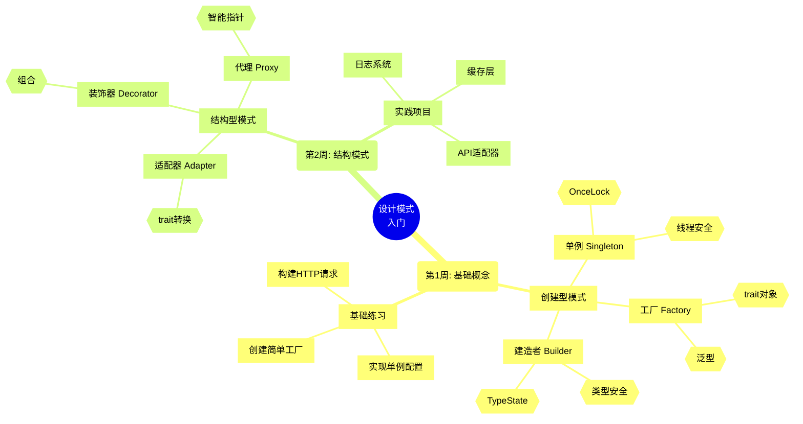

### 1.2 中级路径 (第3-4周)

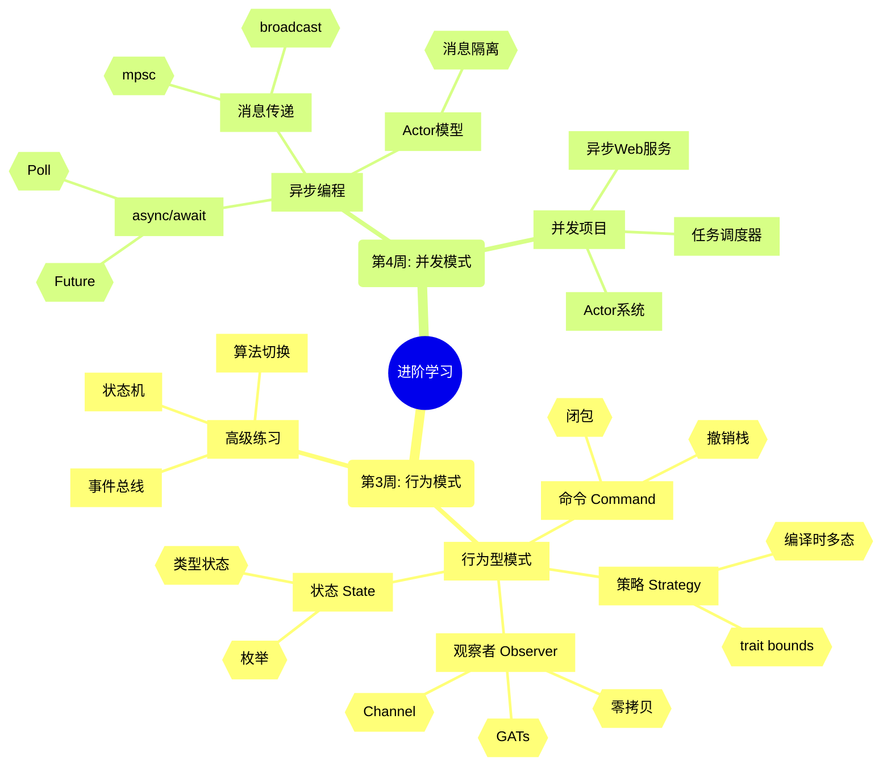

### 1.3 高级路径 (第5-8周)

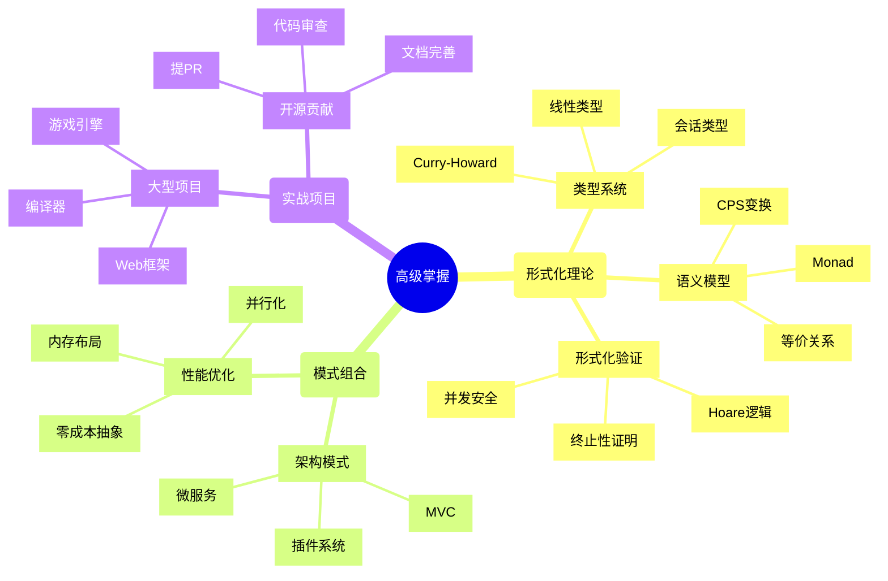

---

## 🌳 第二部分：知识树结构

### 2.1 设计模式知识树

```mermaid
graph TD
    Root[设计模式] --> Level1_1[创建型]
    Root --> Level1_2[结构型]
    Root --> Level1_3[行为型]
    Root --> Level1_4[并发型]
    Root --> Level1_5[Rust特有]
    
    Level1_1 --> L2_1_1[对象创建策略]
    Level1_1 --> L2_1_2[实例管理]
    
    L2_1_1 --> L3_1_1[单例<br/>全局唯一]
    L2_1_1 --> L3_1_2[工厂<br/>创建抽象]
    L2_1_1 --> L3_1_3[建造者<br/>分步构建]
    L2_1_1 --> L3_1_4[原型<br/>克隆创建]
    
    L2_1_2 --> L3_1_5[对象池<br/>复用管理]
    L2_1_2 --> L3_1_6[享元<br/>共享优化]
    
    Level1_2 --> L2_2_1[对象组合]
    Level1_2 --> L2_2_2[接口适配]
    
    L2_2_1 --> L3_2_1[组合<br/>树形结构]
    L2_2_1 --> L3_2_2[装饰器<br/>功能扩展]
    L2_2_1 --> L3_2_3[代理<br/>访问控制]
    
    L2_2_2 --> L3_2_4[适配器<br/>接口转换]
    L2_2_2 --> L3_2_5[桥接<br/>抽象分离]
    L2_2_2 --> L3_2_6[外观<br/>接口简化]
    
    Level1_3 --> L2_3_1[对象协作]
    Level1_3 --> L2_3_2[算法封装]
    Level1_3 --> L2_3_3[状态管理]
    
    L2_3_1 --> L3_3_1[观察者<br/>事件通知]
    L2_3_1 --> L3_3_2[中介者<br/>集中协调]
    L2_3_1 --> L3_3_3[责任链<br/>请求传递]
    
    L2_3_2 --> L3_3_4[策略<br/>算法切换]
    L2_3_2 --> L3_3_5[模板方法<br/>算法骨架]
    L2_3_2 --> L3_3_6[命令<br/>请求封装]
    
    L2_3_3 --> L3_3_7[状态<br/>状态转换]
    L2_3_3 --> L3_3_8[备忘录<br/>状态保存]
    
    Level1_4 --> L2_4_1[异步模式]
    Level1_4 --> L2_4_2[并行模式]
    
    L2_4_1 --> L3_4_1[Future<br/>延迟计算]
    L2_4_1 --> L3_4_2[Actor<br/>消息传递]
    L2_4_1 --> L3_4_3[Reactor<br/>事件驱动]
    
    L2_4_2 --> L3_4_4[数据并行<br/>Rayon]
    L2_4_2 --> L3_4_5[流水线<br/>Pipeline]
    L2_4_2 --> L3_4_6[工作窃取<br/>负载均衡]
    
    Level1_5 --> L2_5_1[所有权模式]
    Level1_5 --> L2_5_2[生命周期模式]
    Level1_5 --> L2_5_3[类型模式]
    
    L2_5_1 --> L3_5_1[RAII<br/>资源管理]
    L2_5_1 --> L3_5_2[新型类型<br/>类型安全]
    
    L2_5_2 --> L3_5_3[借用检查<br/>引用安全]
    L2_5_2 --> L3_5_4[PhantomData<br/>标记类型]
    
    L2_5_3 --> L3_5_5[TypeState<br/>状态验证]
    L2_5_3 --> L3_5_6[会话类型<br/>协议验证]
    
    style Root fill:#2196F3,stroke:#1976D2,color:#fff
    style Level1_1 fill:#4CAF50,stroke:#388E3C,color:#fff
    style Level1_2 fill:#FF9800,stroke:#F57C00,color:#fff
    style Level1_3 fill:#9C27B0,stroke:#7B1FA2,color:#fff
    style Level1_4 fill:#F44336,stroke:#D32F2F,color:#fff
    style Level1_5 fill:#00BCD4,stroke:#0097A7,color:#fff
```

### 2.2 Rust特性知识树

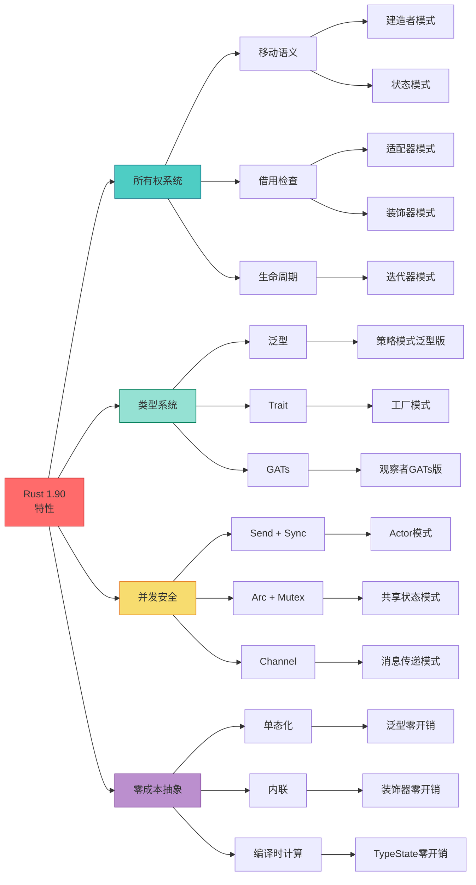

---

## 🎯 第三部分：决策树

### 3.1 模式选择决策树

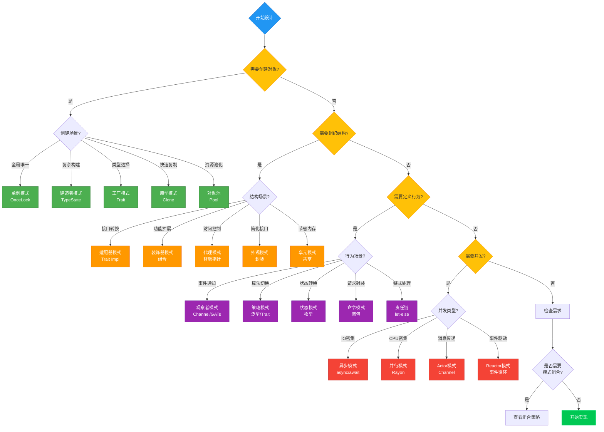

### 3.2 性能优化决策树

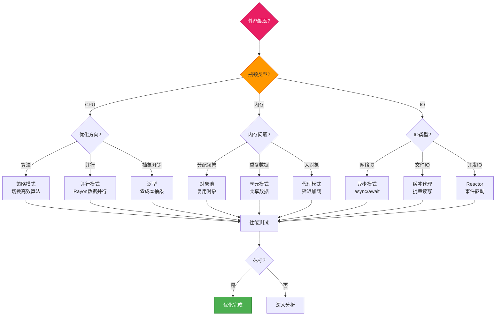

### 3.3 Rust特性选择决策树

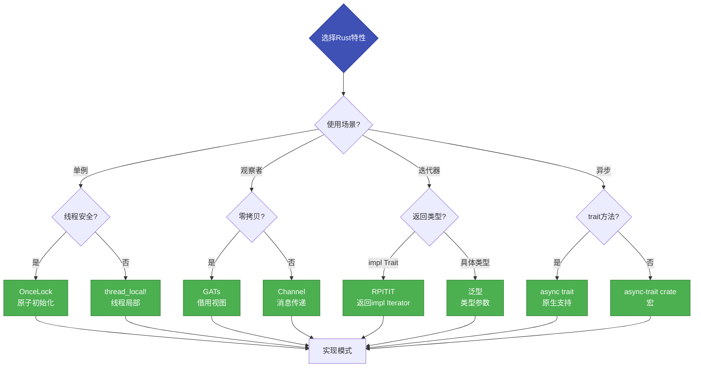

---

## 🔄 第四部分：关系思维导图

### 4.1 模式关联图

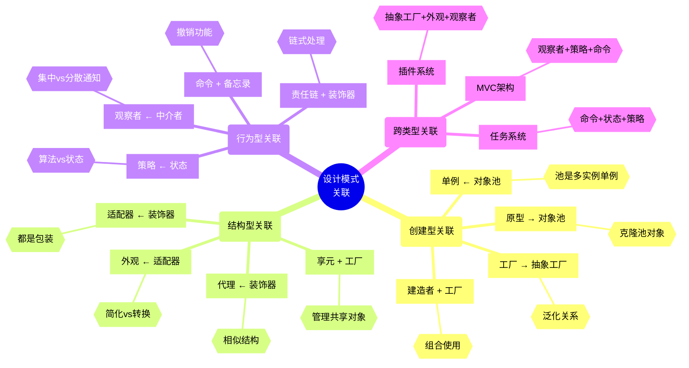

### 4.2 Rust概念关联图

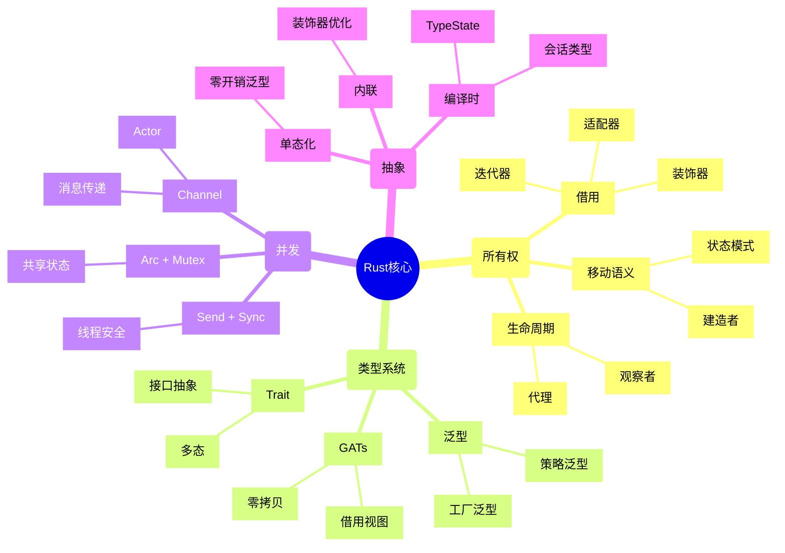

---

## 🚀 第五部分：实践路径导图

### 5.1 项目实战导图

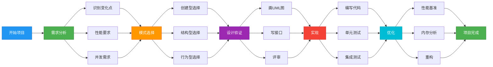

### 5.2 代码实现导图

```mermaid
mindmap
  root((代码实现))
    (第1步: 定义接口)
      [Trait定义]
        {{pub trait Pattern}}
      [泛型参数]
        
      [生命周期]
        {{'a, 'b}}
    (第2步: 核心实现)
      [结构体]
        {{pub struct}}
      [方法]
        {{impl Pattern}}
      [关联类型]
        {{type Item}}
    (第3步: 测试)
      [单元测试]
        {{#[test]}}
      [集成测试]
        {{tests/}}
      [基准测试]
        {{benches/}}
    (第4步: 文档)
      [Doc注释]
        {{///}}
      [示例代码]
        {{# Examples}}
      [README]
        {{说明用法}}
    (第5步: 优化)
      [性能分析]
        {{Criterion}}
      [内存分析]
        {{valgrind}}
      [重构]
        {{改进设计}}
```

---

## 📊 第六部分：复杂度可视化

### 6.1 学习曲线图

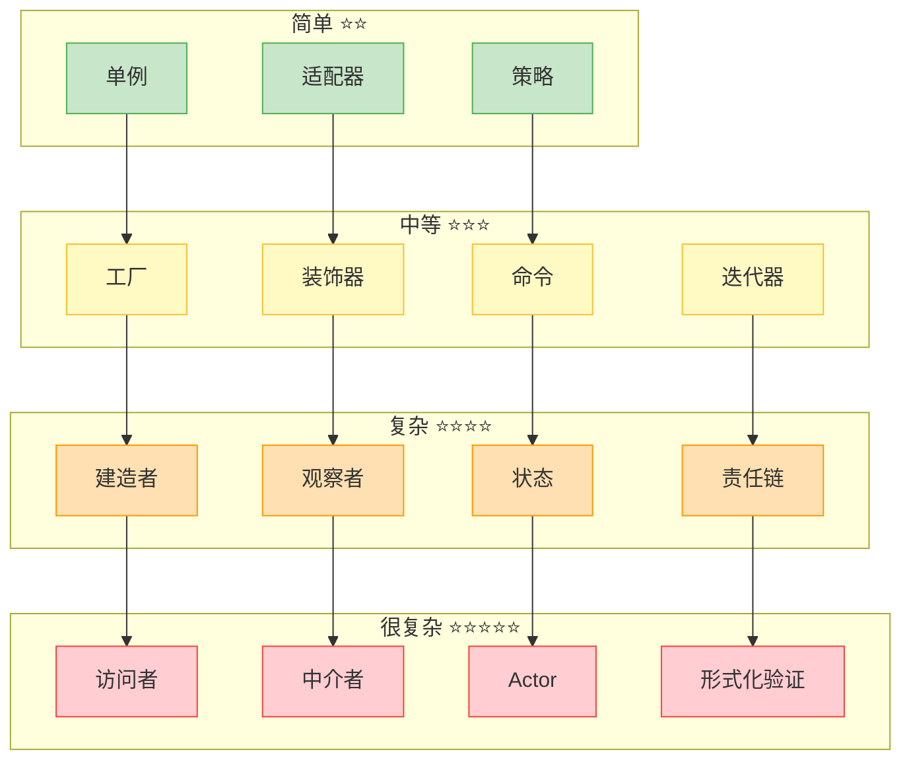

### 6.2 时间投入导图

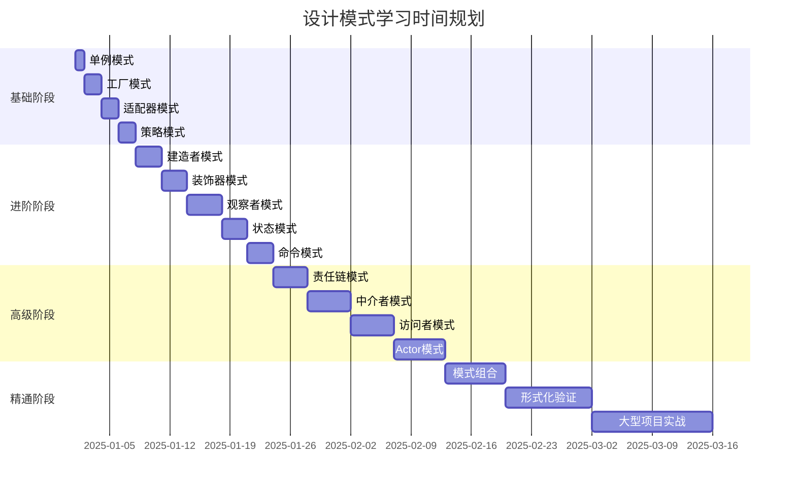

---

## 🎓 第七部分：能力提升导图

### 7.1 技能树

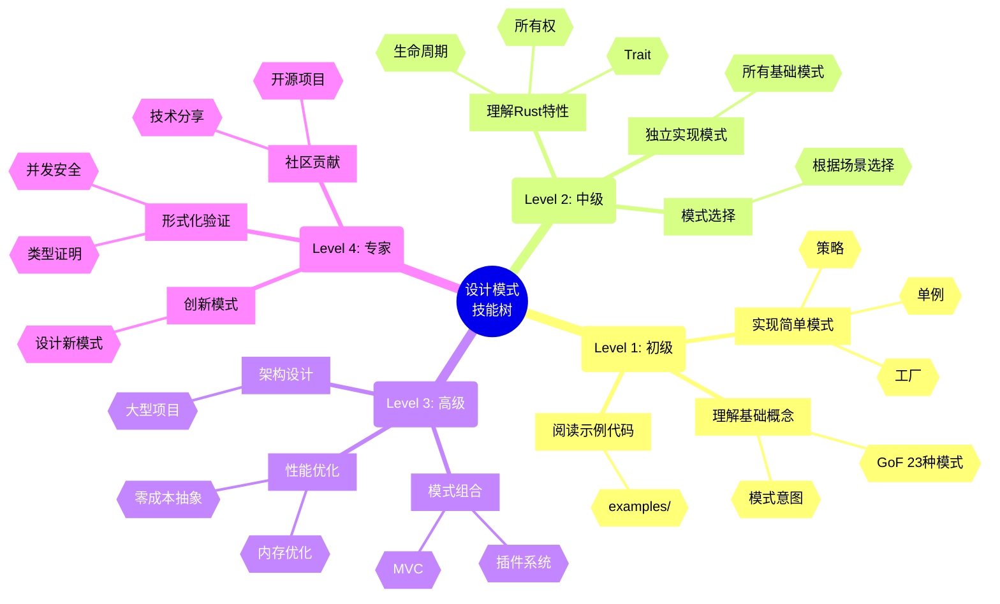

### 7.2 职业发展路径

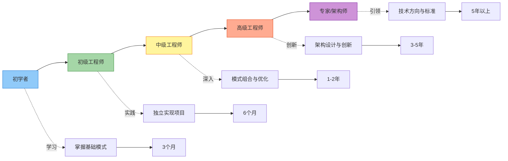

---

## 🔍 第八部分：问题诊断导图

### 8.1 常见问题诊断

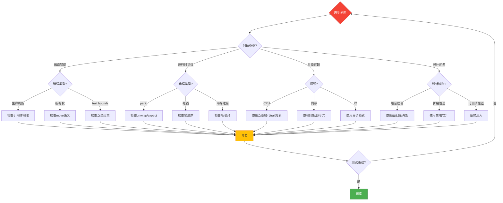

### 8.2 调试流程图

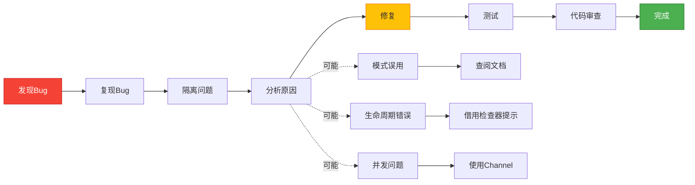

---

## 📚 第九部分：资源导航

### 9.1 学习资源导图

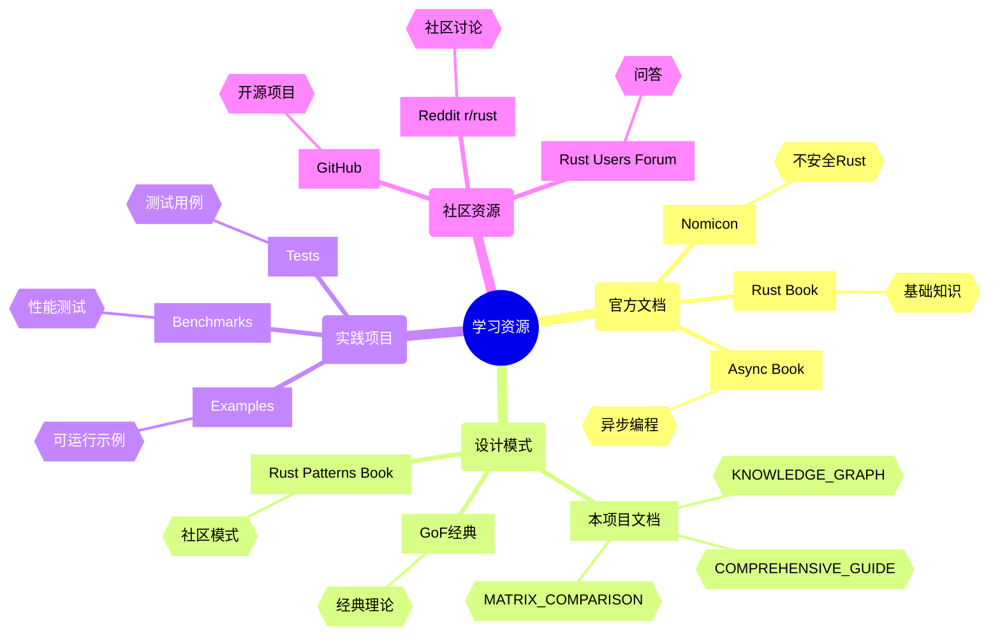

### 9.2 工具链导图

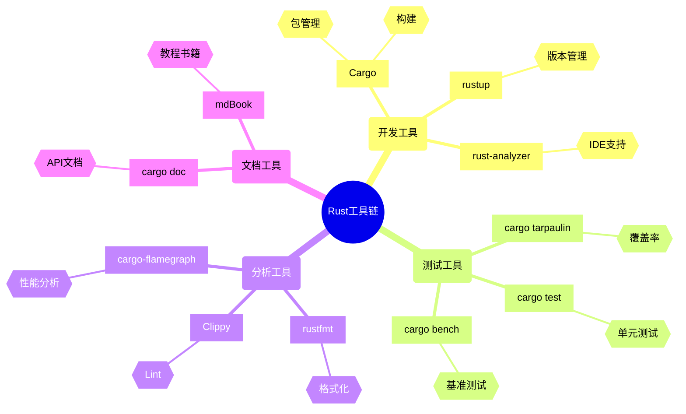

---

## 🎯 使用指南

### 如何使用本思维导图

1. **学习规划**
   - 参考"学习路径思维导图"制定学习计划
   - 使用"时间投入导图"估算学习时间
   - 查看"学习曲线图"调整学习节奏

2. **模式选择**
   - 使用"决策树"快速找到合适的模式
   - 参考"关联图"了解模式之间的关系
   - 查看"场景映射"匹配实际需求

3. **问题解决**
   - 使用"问题诊断导图"定位问题
   - 参考"调试流程图"系统化解决
   - 查看"常见陷阱"避免错误

4. **能力提升**
   - 参考"技能树"规划成长路径
   - 使用"职业发展路径"设定目标
   - 查看"资源导航"深入学习

---

## 🔗 相关文档

- [知识图谱](./KNOWLEDGE_GRAPH.md) - 模式关系网络详解
- [多维矩阵对比](./MULTIDIMENSIONAL_MATRIX_COMPARISON.md) - 详细性能数据
- [Rust 1.90 示例集](./RUST_190_EXAMPLES.md) - 最新特性示例
- [综合指南](./COMPREHENSIVE_DESIGN_PATTERNS_GUIDE.md) - 完整理论

---

## 📖 图表说明

### Mermaid图表类型

- **mindmap**: 思维导图，展示知识结构
- **graph**: 流程图和关系图，展示逻辑关系
- **gantt**: 甘特图，展示时间规划

### 颜色编码

- 🔵 蓝色: 起点/入口
- 🟢 绿色: 创建型模式
- 🟠 橙色: 结构型模式
- 🟣 紫色: 行为型模式
- 🔴 红色: 并发型模式
- 🟡 黄色: 决策点/选择

---

**贡献者**: Rust 设计模式社区  
**可视化工具**: Mermaid.js  
**更新频率**: 随学习内容扩展持续更新

---

*本思维导图旨在提供清晰的学习路径和决策支持，帮助开发者系统化掌握Rust设计模式。*
