# 设计模式思维导图 (Design Patterns Mind Map)

> **文档定位**: 可视化学习路径、决策树和知识结构  
> **适用版本**: Rust 1.90+ (Edition 2024)  
> **最后更新**: 2025-10-19

---

## 🧠 文档概览

本文档通过思维导图的形式，提供：

1. 📚 **学习路径导图** - 循序渐进的学习顺序
2. 🌳 **知识树** - 概念的层级结构
3. 🎯 **决策树** - 如何选择合适的模式
4. 🔄 **关系图** - 模式之间的联系
5. 🚀 **实践导图** - 从理论到实践的路径

---

## 📚 第一部分：学习路径思维导图

### 1.1 初学者路径 (第1-2周)

```mermaid
mindmap
  root((设计模式<br/>入门))
    (第1周: 基础概念)
      [创建型模式]
        ::icon(fa fa-plus-circle)
        [单例 Singleton]
          {{OnceLock}}
          {{线程安全}}
        [工厂 Factory]
          {{trait对象}}
          {{泛型}}
        [建造者 Builder]
          {{TypeState}}
          {{类型安全}}
      [基础练习]
        [实现单例配置]
        [创建简单工厂]
        [构建HTTP请求]
    (第2周: 结构模式)
      [结构型模式]
        ::icon(fa fa-cubes)
        [适配器 Adapter]
          {{trait转换}}
        [装饰器 Decorator]
          {{组合}}
        [代理 Proxy]
          {{智能指针}}
      [实践项目]
        [日志系统]
        [缓存层]
        [API适配器]
```

### 1.2 中级路径 (第3-4周)

```mermaid
mindmap
  root((进阶学习))
    (第3周: 行为模式)
      [行为型模式]
        ::icon(fa fa-exchange)
        [观察者 Observer]
          {{Channel}}
          {{GATs}}
          {{零拷贝}}
        [策略 Strategy]
          {{trait bounds}}
          {{编译时多态}}
        [命令 Command]
          {{闭包}}
          {{撤销栈}}
        [状态 State]
          {{枚举}}
          {{类型状态}}
      [高级练习]
        [事件总线]
        [算法切换]
        [状态机]
    (第4周: 并发模式)
      [异步编程]
        ::icon(fa fa-bolt)
        [async/await]
          {{Future}}
          {{Poll}}
        [消息传递]
          {{mpsc}}
          {{broadcast}}
        [Actor模型]
          {{消息隔离}}
      [并发项目]
        [异步Web服务]
        [任务调度器]
        [Actor系统]
```

### 1.3 高级路径 (第5-8周)

```mermaid
mindmap
  root((高级掌握))
    (形式化理论)
      [类型系统]
        [Curry-Howard]
        [线性类型]
        [会话类型]
      [语义模型]
        [CPS变换]
        [Monad]
        [等价关系]
      [形式化验证]
        [Hoare逻辑]
        [终止性证明]
        [并发安全]
    (模式组合)
      [架构模式]
        [MVC]
        [插件系统]
        [微服务]
      [性能优化]
        [零成本抽象]
        [内存布局]
        [并行化]
    (实战项目)
      [大型项目]
        [Web框架]
        [游戏引擎]
        [编译器]
      [开源贡献]
        [提PR]
        [代码审查]
        [文档完善]
```

---

## 🌳 第二部分：知识树结构

### 2.1 设计模式知识树

```mermaid
graph TD
    Root[设计模式] --> Level1_1[创建型]
    Root --> Level1_2[结构型]
    Root --> Level1_3[行为型]
    Root --> Level1_4[并发型]
    Root --> Level1_5[Rust特有]
    
    Level1_1 --> L2_1_1[对象创建策略]
    Level1_1 --> L2_1_2[实例管理]
    
    L2_1_1 --> L3_1_1[单例<br/>全局唯一]
    L2_1_1 --> L3_1_2[工厂<br/>创建抽象]
    L2_1_1 --> L3_1_3[建造者<br/>分步构建]
    L2_1_1 --> L3_1_4[原型<br/>克隆创建]
    
    L2_1_2 --> L3_1_5[对象池<br/>复用管理]
    L2_1_2 --> L3_1_6[享元<br/>共享优化]
    
    Level1_2 --> L2_2_1[对象组合]
    Level1_2 --> L2_2_2[接口适配]
    
    L2_2_1 --> L3_2_1[组合<br/>树形结构]
    L2_2_1 --> L3_2_2[装饰器<br/>功能扩展]
    L2_2_1 --> L3_2_3[代理<br/>访问控制]
    
    L2_2_2 --> L3_2_4[适配器<br/>接口转换]
    L2_2_2 --> L3_2_5[桥接<br/>抽象分离]
    L2_2_2 --> L3_2_6[外观<br/>接口简化]
    
    Level1_3 --> L2_3_1[对象协作]
    Level1_3 --> L2_3_2[算法封装]
    Level1_3 --> L2_3_3[状态管理]
    
    L2_3_1 --> L3_3_1[观察者<br/>事件通知]
    L2_3_1 --> L3_3_2[中介者<br/>集中协调]
    L2_3_1 --> L3_3_3[责任链<br/>请求传递]
    
    L2_3_2 --> L3_3_4[策略<br/>算法切换]
    L2_3_2 --> L3_3_5[模板方法<br/>算法骨架]
    L2_3_2 --> L3_3_6[命令<br/>请求封装]
    
    L2_3_3 --> L3_3_7[状态<br/>状态转换]
    L2_3_3 --> L3_3_8[备忘录<br/>状态保存]
    
    Level1_4 --> L2_4_1[异步模式]
    Level1_4 --> L2_4_2[并行模式]
    
    L2_4_1 --> L3_4_1[Future<br/>延迟计算]
    L2_4_1 --> L3_4_2[Actor<br/>消息传递]
    L2_4_1 --> L3_4_3[Reactor<br/>事件驱动]
    
    L2_4_2 --> L3_4_4[数据并行<br/>Rayon]
    L2_4_2 --> L3_4_5[流水线<br/>Pipeline]
    L2_4_2 --> L3_4_6[工作窃取<br/>负载均衡]
    
    Level1_5 --> L2_5_1[所有权模式]
    Level1_5 --> L2_5_2[生命周期模式]
    Level1_5 --> L2_5_3[类型模式]
    
    L2_5_1 --> L3_5_1[RAII<br/>资源管理]
    L2_5_1 --> L3_5_2[新型类型<br/>类型安全]
    
    L2_5_2 --> L3_5_3[借用检查<br/>引用安全]
    L2_5_2 --> L3_5_4[PhantomData<br/>标记类型]
    
    L2_5_3 --> L3_5_5[TypeState<br/>状态验证]
    L2_5_3 --> L3_5_6[会话类型<br/>协议验证]
    
    style Root fill:#2196F3,stroke:#1976D2,color:#fff
    style Level1_1 fill:#4CAF50,stroke:#388E3C,color:#fff
    style Level1_2 fill:#FF9800,stroke:#F57C00,color:#fff
    style Level1_3 fill:#9C27B0,stroke:#7B1FA2,color:#fff
    style Level1_4 fill:#F44336,stroke:#D32F2F,color:#fff
    style Level1_5 fill:#00BCD4,stroke:#0097A7,color:#fff
```

### 2.2 Rust特性知识树

```mermaid
graph LR
    Root[Rust 1.90<br/>特性] --> F1[所有权系统]
    Root --> F2[类型系统]
    Root --> F3[并发安全]
    Root --> F4[零成本抽象]
    
    F1 --> F1_1[移动语义]
    F1 --> F1_2[借用检查]
    F1 --> F1_3[生命周期]
    
    F1_1 --> P1_1[建造者模式]
    F1_1 --> P1_2[状态模式]
    F1_2 --> P1_3[适配器模式]
    F1_2 --> P1_4[装饰器模式]
    F1_3 --> P1_5[迭代器模式]
    
    F2 --> F2_1[泛型]
    F2 --> F2_2[Trait]
    F2 --> F2_3[GATs]
    
    F2_1 --> P2_1[策略模式泛型版]
    F2_2 --> P2_2[工厂模式]
    F2_3 --> P2_3[观察者GATs版]
    
    F3 --> F3_1[Send + Sync]
    F3 --> F3_2[Arc + Mutex]
    F3 --> F3_3[Channel]
    
    F3_1 --> P3_1[Actor模式]
    F3_2 --> P3_2[共享状态模式]
    F3_3 --> P3_3[消息传递模式]
    
    F4 --> F4_1[单态化]
    F4 --> F4_2[内联]
    F4 --> F4_3[编译时计算]
    
    F4_1 --> P4_1[泛型零开销]
    F4_2 --> P4_2[装饰器零开销]
    F4_3 --> P4_3[TypeState零开销]
    
    style Root fill:#FF6B6B,stroke:#C92A2A
    style F1 fill:#4ECDC4,stroke:#0B7285
    style F2 fill:#95E1D3,stroke:#087F5B
    style F3 fill:#F7DC6F,stroke:#E67E22
    style F4 fill:#BB8FCE,stroke:#7D3C98
```

---

## 🎯 第三部分：决策树

### 3.1 模式选择决策树

```mermaid
graph TD
    Start{开始设计} --> Q1{需要创建对象?}
    
    Q1 -->|是| Create{创建场景?}
    Q1 -->|否| Q2{需要组织结构?}
    
    Create -->|全局唯一| D1[单例模式<br/>OnceLock]
    Create -->|复杂构建| D2[建造者模式<br/>TypeState]
    Create -->|类型选择| D3[工厂模式<br/>Trait]
    Create -->|快速复制| D4[原型模式<br/>Clone]
    Create -->|资源池化| D5[对象池<br/>Pool]
    
    Q2 -->|是| Structure{结构场景?}
    Q2 -->|否| Q3{需要定义行为?}
    
    Structure -->|接口转换| D6[适配器模式<br/>Trait Impl]
    Structure -->|功能扩展| D7[装饰器模式<br/>组合]
    Structure -->|访问控制| D8[代理模式<br/>智能指针]
    Structure -->|简化接口| D9[外观模式<br/>封装]
    Structure -->|节省内存| D10[享元模式<br/>共享]
    
    Q3 -->|是| Behavior{行为场景?}
    Q3 -->|否| Q4{需要并发?}
    
    Behavior -->|事件通知| D11[观察者模式<br/>Channel/GATs]
    Behavior -->|算法切换| D12[策略模式<br/>泛型/Trait]
    Behavior -->|状态转换| D13[状态模式<br/>枚举]
    Behavior -->|请求封装| D14[命令模式<br/>闭包]
    Behavior -->|链式处理| D15[责任链<br/>let-else]
    
    Q4 -->|是| Concurrent{并发类型?}
    Q4 -->|否| End[检查需求]
    
    Concurrent -->|IO密集| D16[异步模式<br/>async/await]
    Concurrent -->|CPU密集| D17[并行模式<br/>Rayon]
    Concurrent -->|消息传递| D18[Actor模式<br/>Channel]
    Concurrent -->|事件驱动| D19[Reactor模式<br/>事件循环]
    
    End --> Refine{是否需要<br/>模式组合?}
    Refine -->|是| Combine[查看组合策略]
    Refine -->|否| Done[开始实现]
    
    style Start fill:#2196F3,stroke:#1565C0,color:#fff
    style Q1 fill:#FFC107,stroke:#F57F17
    style Q2 fill:#FFC107,stroke:#F57F17
    style Q3 fill:#FFC107,stroke:#F57F17
    style Q4 fill:#FFC107,stroke:#F57F17
    
    style D1 fill:#4CAF50,stroke:#2E7D32,color:#fff
    style D2 fill:#4CAF50,stroke:#2E7D32,color:#fff
    style D3 fill:#4CAF50,stroke:#2E7D32,color:#fff
    style D4 fill:#4CAF50,stroke:#2E7D32,color:#fff
    style D5 fill:#4CAF50,stroke:#2E7D32,color:#fff
    
    style D6 fill:#FF9800,stroke:#E65100,color:#fff
    style D7 fill:#FF9800,stroke:#E65100,color:#fff
    style D8 fill:#FF9800,stroke:#E65100,color:#fff
    style D9 fill:#FF9800,stroke:#E65100,color:#fff
    style D10 fill:#FF9800,stroke:#E65100,color:#fff
    
    style D11 fill:#9C27B0,stroke:#6A1B9A,color:#fff
    style D12 fill:#9C27B0,stroke:#6A1B9A,color:#fff
    style D13 fill:#9C27B0,stroke:#6A1B9A,color:#fff
    style D14 fill:#9C27B0,stroke:#6A1B9A,color:#fff
    style D15 fill:#9C27B0,stroke:#6A1B9A,color:#fff
    
    style D16 fill:#F44336,stroke:#C62828,color:#fff
    style D17 fill:#F44336,stroke:#C62828,color:#fff
    style D18 fill:#F44336,stroke:#C62828,color:#fff
    style D19 fill:#F44336,stroke:#C62828,color:#fff
    
    style Done fill:#00C853,stroke:#00E676,color:#fff
```

### 3.2 性能优化决策树

```mermaid
graph TD
    Perf{性能瓶颈?} --> Type{瓶颈类型?}
    
    Type -->|CPU| CPU_Choice{优化方向?}
    Type -->|内存| Mem_Choice{内存问题?}
    Type -->|IO| IO_Choice{IO类型?}
    
    CPU_Choice -->|算法| CPU1[策略模式<br/>切换高效算法]
    CPU_Choice -->|并行| CPU2[并行模式<br/>Rayon数据并行]
    CPU_Choice -->|抽象开销| CPU3[泛型<br/>零成本抽象]
    
    Mem_Choice -->|分配频繁| Mem1[对象池<br/>复用对象]
    Mem_Choice -->|重复数据| Mem2[享元模式<br/>共享数据]
    Mem_Choice -->|大对象| Mem3[代理模式<br/>延迟加载]
    
    IO_Choice -->|网络IO| IO1[异步模式<br/>async/await]
    IO_Choice -->|文件IO| IO2[缓冲代理<br/>批量读写]
    IO_Choice -->|并发IO| IO3[Reactor<br/>事件驱动]
    
    CPU1 --> Measure[性能测试]
    CPU2 --> Measure
    CPU3 --> Measure
    Mem1 --> Measure
    Mem2 --> Measure
    Mem3 --> Measure
    IO1 --> Measure
    IO2 --> Measure
    IO3 --> Measure
    
    Measure --> Check{达标?}
    Check -->|是| Success[优化完成]
    Check -->|否| Analyze[深入分析]
    
    style Perf fill:#E91E63,stroke:#AD1457,color:#fff
    style Type fill:#FF9800,stroke:#E65100
    style Success fill:#4CAF50,stroke:#2E7D32,color:#fff
```

### 3.3 Rust特性选择决策树

```mermaid
graph TD
    Feature{选择Rust特性} --> Scenario{使用场景?}
    
    Scenario -->|单例| S1{线程安全?}
    Scenario -->|观察者| S2{零拷贝?}
    Scenario -->|迭代器| S3{返回类型?}
    Scenario -->|异步| S4{trait方法?}
    
    S1 -->|是| F1[OnceLock<T><br/>原子初始化]
    S1 -->|否| F2[thread_local!<br/>线程局部]
    
    S2 -->|是| F3[GATs<br/>借用视图]
    S2 -->|否| F4[Channel<br/>消息传递]
    
    S3 -->|impl Trait| F5[RPITIT<br/>返回impl Iterator]
    S3 -->|具体类型| F6[泛型<br/>类型参数]
    
    S4 -->|是| F7[async trait<br/>原生支持]
    S4 -->|否| F8[async-trait crate<br/>宏]
    
    F1 --> Impl[实现模式]
    F2 --> Impl
    F3 --> Impl
    F4 --> Impl
    F5 --> Impl
    F6 --> Impl
    F7 --> Impl
    F8 --> Impl
    
    style Feature fill:#3F51B5,stroke:#283593,color:#fff
    style F1 fill:#4CAF50,stroke:#2E7D32,color:#fff
    style F2 fill:#4CAF50,stroke:#2E7D32,color:#fff
    style F3 fill:#4CAF50,stroke:#2E7D32,color:#fff
    style F4 fill:#4CAF50,stroke:#2E7D32,color:#fff
    style F5 fill:#4CAF50,stroke:#2E7D32,color:#fff
    style F6 fill:#4CAF50,stroke:#2E7D32,color:#fff
    style F7 fill:#4CAF50,stroke:#2E7D32,color:#fff
    style F8 fill:#4CAF50,stroke:#2E7D32,color:#fff
```

---

## 🔄 第四部分：关系思维导图

### 4.1 模式关联图

```mermaid
mindmap
  root((设计模式<br/>关联))
    (创建型关联)
      [单例 ← 对象池]
        {{池是多实例单例}}
      [工厂 → 抽象工厂]
        {{泛化关系}}
      [建造者 + 工厂]
        {{组合使用}}
      [原型 → 对象池]
        {{克隆池对象}}
    (结构型关联)
      [适配器 ← 装饰器]
        {{都是包装}}
      [代理 ← 装饰器]
        {{相似结构}}
      [外观 ← 适配器]
        {{简化vs转换}}
      [享元 + 工厂]
        {{管理共享对象}}
    (行为型关联)
      [观察者 ← 中介者]
        {{集中vs分散通知}}
      [策略 ← 状态]
        {{算法vs状态}}
      [命令 + 备忘录]
        {{撤销功能}}
      [责任链 + 装饰器]
        {{链式处理}}
    (跨类型关联)
      [MVC架构]
        {{观察者+策略+命令}}
      [插件系统]
        {{抽象工厂+外观+观察者}}
      [任务系统]
        {{命令+状态+策略}}
```

### 4.2 Rust概念关联图

```mermaid
mindmap
  root((Rust核心))
    (所有权)
      [移动语义]
        [建造者]
        [状态模式]
      [借用]
        [适配器]
        [装饰器]
        [迭代器]
      [生命周期]
        [观察者]
        [代理]
    (类型系统)
      [泛型]
        [策略泛型]
        [工厂泛型]
      [Trait]
        [多态]
        [接口抽象]
      [GATs]
        [借用视图]
        [零拷贝]
    (并发)
      [Send + Sync]
        [线程安全]
      [Arc + Mutex]
        [共享状态]
      [Channel]
        [消息传递]
        [Actor]
    (抽象)
      [单态化]
        [零开销泛型]
      [内联]
        [装饰器优化]
      [编译时]
        [TypeState]
        [会话类型]
```

---

## 🚀 第五部分：实践路径导图

### 5.1 项目实战导图

```mermaid
graph LR
    Start[开始项目] --> Phase1[需求分析]
    
    Phase1 --> P1_1[识别变化点]
    Phase1 --> P1_2[性能要求]
    Phase1 --> P1_3[并发需求]
    
    P1_1 --> Phase2[模式选择]
    P1_2 --> Phase2
    P1_3 --> Phase2
    
    Phase2 --> P2_1[创建型选择]
    Phase2 --> P2_2[结构型选择]
    Phase2 --> P2_3[行为型选择]
    
    P2_1 --> Phase3[设计验证]
    P2_2 --> Phase3
    P2_3 --> Phase3
    
    Phase3 --> P3_1[画UML图]
    Phase3 --> P3_2[写接口]
    Phase3 --> P3_3[评审]
    
    P3_1 --> Phase4[实现]
    P3_2 --> Phase4
    P3_3 --> Phase4
    
    Phase4 --> P4_1[编写代码]
    Phase4 --> P4_2[单元测试]
    Phase4 --> P4_3[集成测试]
    
    P4_1 --> Phase5[优化]
    P4_2 --> Phase5
    P4_3 --> Phase5
    
    Phase5 --> P5_1[性能基准]
    Phase5 --> P5_2[内存分析]
    Phase5 --> P5_3[重构]
    
    P5_1 --> End[项目完成]
    P5_2 --> End
    P5_3 --> End
    
    style Start fill:#2196F3,stroke:#1565C0,color:#fff
    style Phase1 fill:#4CAF50,stroke:#2E7D32,color:#fff
    style Phase2 fill:#FF9800,stroke:#E65100,color:#fff
    style Phase3 fill:#9C27B0,stroke:#6A1B9A,color:#fff
    style Phase4 fill:#F44336,stroke:#C62828,color:#fff
    style Phase5 fill:#00BCD4,stroke:#0097A7,color:#fff
    style End fill:#4CAF50,stroke:#2E7D32,color:#fff
```

### 5.2 代码实现导图

```mermaid
mindmap
  root((代码实现))
    (第1步: 定义接口)
      [Trait定义]
        {{pub trait Pattern}}
      [泛型参数]
        
      [生命周期]
        {{'a, 'b}}
    (第2步: 核心实现)
      [结构体]
        {{pub struct}}
      [方法]
        {{impl Pattern}}
      [关联类型]
        {{type Item}}
    (第3步: 测试)
      [单元测试]
        {{#[test]}}
      [集成测试]
        {{tests/}}
      [基准测试]
        {{benches/}}
    (第4步: 文档)
      [Doc注释]
        {{///}}
      [示例代码]
        {{# Examples}}
      [README]
        {{说明用法}}
    (第5步: 优化)
      [性能分析]
        {{Criterion}}
      [内存分析]
        {{valgrind}}
      [重构]
        {{改进设计}}
```

---

## 📊 第六部分：复杂度可视化

### 6.1 学习曲线图

```mermaid
graph TB
    subgraph "简单 ⭐⭐"
        Easy1[单例]
        Easy2[适配器]
        Easy3[策略]
    end
    
    subgraph "中等 ⭐⭐⭐"
        Med1[工厂]
        Med2[装饰器]
        Med3[命令]
        Med4[迭代器]
    end
    
    subgraph "复杂 ⭐⭐⭐⭐"
        Hard1[建造者]
        Hard2[观察者]
        Hard3[状态]
        Hard4[责任链]
    end
    
    subgraph "很复杂 ⭐⭐⭐⭐⭐"
        VHard1[访问者]
        VHard2[中介者]
        VHard3[Actor]
        VHard4[形式化验证]
    end
    
    Easy1 --> Med1
    Easy2 --> Med2
    Easy3 --> Med3
    
    Med1 --> Hard1
    Med2 --> Hard2
    Med3 --> Hard3
    Med4 --> Hard4
    
    Hard1 --> VHard1
    Hard2 --> VHard2
    Hard3 --> VHard3
    Hard4 --> VHard4
    
    style Easy1 fill:#C8E6C9,stroke:#4CAF50
    style Easy2 fill:#C8E6C9,stroke:#4CAF50
    style Easy3 fill:#C8E6C9,stroke:#4CAF50
    
    style Med1 fill:#FFF9C4,stroke:#FBC02D
    style Med2 fill:#FFF9C4,stroke:#FBC02D
    style Med3 fill:#FFF9C4,stroke:#FBC02D
    style Med4 fill:#FFF9C4,stroke:#FBC02D
    
    style Hard1 fill:#FFE0B2,stroke:#FF9800
    style Hard2 fill:#FFE0B2,stroke:#FF9800
    style Hard3 fill:#FFE0B2,stroke:#FF9800
    style Hard4 fill:#FFE0B2,stroke:#FF9800
    
    style VHard1 fill:#FFCDD2,stroke:#F44336
    style VHard2 fill:#FFCDD2,stroke:#F44336
    style VHard3 fill:#FFCDD2,stroke:#F44336
    style VHard4 fill:#FFCDD2,stroke:#F44336
```

### 6.2 时间投入导图

```mermaid
gantt
    title 设计模式学习时间规划
    dateFormat YYYY-MM-DD
    section 基础阶段
    单例模式           :a1, 2025-01-01, 1d
    工厂模式           :a2, after a1, 2d
    适配器模式         :a3, after a2, 2d
    策略模式           :a4, after a3, 2d
    section 进阶阶段
    建造者模式         :b1, after a4, 3d
    装饰器模式         :b2, after b1, 3d
    观察者模式         :b3, after b2, 4d
    状态模式           :b4, after b3, 3d
    命令模式           :b5, after b4, 3d
    section 高级阶段
    责任链模式         :c1, after b5, 4d
    中介者模式         :c2, after c1, 5d
    访问者模式         :c3, after c2, 5d
    Actor模式          :c4, after c3, 6d
    section 精通阶段
    模式组合           :d1, after c4, 7d
    形式化验证         :d2, after d1, 10d
    大型项目实战       :d3, after d2, 14d
```

---

## 🎓 第七部分：能力提升导图

### 7.1 技能树

```mermaid
mindmap
  root((设计模式<br/>技能树))
    (Level 1: 初级)
      [理解基础概念]
        {{GoF 23种模式}}
        {{模式意图}}
      [实现简单模式]
        {{单例}}
        {{工厂}}
        {{策略}}
      [阅读示例代码]
        {{examples/}}
    (Level 2: 中级)
      [独立实现模式]
        {{所有基础模式}}
      [理解Rust特性]
        {{所有权}}
        {{生命周期}}
        {{Trait}}
      [模式选择]
        {{根据场景选择}}
    (Level 3: 高级)
      [模式组合]
        {{MVC}}
        {{插件系统}}
      [性能优化]
        {{零成本抽象}}
        {{内存优化}}
      [架构设计]
        {{大型项目}}
    (Level 4: 专家)
      [创新模式]
        {{设计新模式}}
      [形式化验证]
        {{类型证明}}
        {{并发安全}}
      [社区贡献]
        {{开源项目}}
        {{技术分享}}
```

### 7.2 职业发展路径

```mermaid
graph LR
    Start[初学者] --> Junior[初级工程师]
    Junior --> Mid[中级工程师]
    Mid --> Senior[高级工程师]
    Senior --> Expert[专家/架构师]
    
    Start -.学习.-> S1[掌握基础模式]
    Junior -.实践.-> J1[独立实现项目]
    Mid -.深入.-> M1[模式组合与优化]
    Senior -.创新.-> Se1[架构设计与创新]
    Expert -.引领.-> E1[技术方向与标准]
    
    S1 --> S2[3个月]
    J1 --> J2[6个月]
    M1 --> M2[1-2年]
    Se1 --> Se2[3-5年]
    E1 --> E2[5年以上]
    
    style Start fill:#90CAF9,stroke:#1976D2
    style Junior fill:#A5D6A7,stroke:#388E3C
    style Mid fill:#FFF59D,stroke:#F57F17
    style Senior fill:#FFAB91,stroke:#E64A19
    style Expert fill:#CE93D8,stroke:#7B1FA2
```

---

## 🔍 第八部分：问题诊断导图

### 8.1 常见问题诊断

```mermaid
graph TD
    Problem{遇到问题} --> Type{问题类型?}
    
    Type -->|编译错误| Compile{错误类型?}
    Type -->|运行时错误| Runtime{错误类型?}
    Type -->|性能问题| Perf{瓶颈?}
    Type -->|设计问题| Design{设计缺陷?}
    
    Compile -->|生命周期| C1[检查引用作用域]
    Compile -->|所有权| C2[检查move语义]
    Compile -->|trait bounds| C3[检查泛型约束]
    
    Runtime -->|panic| R1[检查unwrap/expect]
    Runtime -->|死锁| R2[检查锁顺序]
    Runtime -->|内存泄漏| R3[检查Rc循环]
    
    Perf -->|CPU| P1[使用泛型替代trait对象]
    Perf -->|内存| P2[使用对象池/享元]
    Perf -->|IO| P3[使用异步模式]
    
    Design -->|耦合度高| D1[使用适配器/外观]
    Design -->|扩展性差| D2[使用策略/工厂]
    Design -->|可测试性差| D3[依赖注入]
    
    C1 --> Fix[修复]
    C2 --> Fix
    C3 --> Fix
    R1 --> Fix
    R2 --> Fix
    R3 --> Fix
    P1 --> Fix
    P2 --> Fix
    P3 --> Fix
    D1 --> Fix
    D2 --> Fix
    D3 --> Fix
    
    Fix --> Test{测试通过?}
    Test -->|是| Done[完成]
    Test -->|否| Problem
    
    style Problem fill:#F44336,stroke:#C62828,color:#fff
    style Fix fill:#FFC107,stroke:#F57F17
    style Done fill:#4CAF50,stroke:#2E7D32,color:#fff
```

### 8.2 调试流程图

```mermaid
graph LR
    Bug[发现Bug] --> Repro[复现Bug]
    Repro --> Isolate[隔离问题]
    Isolate --> Analyze[分析原因]
    Analyze --> Fix[修复]
    Fix --> Test[测试]
    Test --> Review[代码审查]
    Review --> Done[完成]
    
    Analyze -.可能.-> A1[模式误用]
    Analyze -.可能.-> A2[生命周期错误]
    Analyze -.可能.-> A3[并发问题]
    
    A1 --> Solution1[查阅文档]
    A2 --> Solution2[借用检查器提示]
    A3 --> Solution3[使用Channel]
    
    style Bug fill:#F44336,stroke:#C62828,color:#fff
    style Fix fill:#FFC107,stroke:#F57F17
    style Done fill:#4CAF50,stroke:#2E7D32,color:#fff
```

---

## 📚 第九部分：资源导航

### 9.1 学习资源导图

```mermaid
mindmap
  root((学习资源))
    (官方文档)
      [Rust Book]
        {{基础知识}}
      [Async Book]
        {{异步编程}}
      [Nomicon]
        {{不安全Rust}}
    (设计模式)
      [本项目文档]
        {{COMPREHENSIVE_GUIDE}}
        {{KNOWLEDGE_GRAPH}}
        {{MATRIX_COMPARISON}}
      [Rust Patterns Book]
        {{社区模式}}
      [GoF经典]
        {{经典理论}}
    (实践项目)
      [Examples]
        {{可运行示例}}
      [Benchmarks]
        {{性能测试}}
      [Tests]
        {{测试用例}}
    (社区资源)
      [GitHub]
        {{开源项目}}
      [Reddit r/rust]
        {{社区讨论}}
      [Rust Users Forum]
        {{问答}}
```

### 9.2 工具链导图

```mermaid
mindmap
  root((Rust工具链))
    (开发工具)
      [Cargo]
        {{包管理}}
        {{构建}}
      [rustup]
        {{版本管理}}
      [rust-analyzer]
        {{IDE支持}}
    (测试工具)
      [cargo test]
        {{单元测试}}
      [cargo bench]
        {{基准测试}}
      [cargo tarpaulin]
        {{覆盖率}}
    (分析工具)
      [Clippy]
        {{Lint}}
      [rustfmt]
        {{格式化}}
      [cargo-flamegraph]
        {{性能分析}}
    (文档工具)
      [cargo doc]
        {{API文档}}
      [mdBook]
        {{教程书籍}}
```

---

## 🎯 使用指南

### 如何使用本思维导图

1. **学习规划**
   - 参考"学习路径思维导图"制定学习计划
   - 使用"时间投入导图"估算学习时间
   - 查看"学习曲线图"调整学习节奏

2. **模式选择**
   - 使用"决策树"快速找到合适的模式
   - 参考"关联图"了解模式之间的关系
   - 查看"场景映射"匹配实际需求

3. **问题解决**
   - 使用"问题诊断导图"定位问题
   - 参考"调试流程图"系统化解决
   - 查看"常见陷阱"避免错误

4. **能力提升**
   - 参考"技能树"规划成长路径
   - 使用"职业发展路径"设定目标
   - 查看"资源导航"深入学习

---

## 🔗 相关文档

- [知识图谱](./KNOWLEDGE_GRAPH.md) - 模式关系网络详解
- [多维矩阵对比](./MULTIDIMENSIONAL_MATRIX_COMPARISON.md) - 详细性能数据
- [Rust 1.90 示例集](./RUST_190_EXAMPLES.md) - 最新特性示例
- [综合指南](./COMPREHENSIVE_DESIGN_PATTERNS_GUIDE.md) - 完整理论

---

## 📖 图表说明

### Mermaid图表类型

- **mindmap**: 思维导图，展示知识结构
- **graph**: 流程图和关系图，展示逻辑关系
- **gantt**: 甘特图，展示时间规划

### 颜色编码

- 🔵 蓝色: 起点/入口
- 🟢 绿色: 创建型模式
- 🟠 橙色: 结构型模式
- 🟣 紫色: 行为型模式
- 🔴 红色: 并发型模式
- 🟡 黄色: 决策点/选择

---

**贡献者**: Rust 设计模式社区  
**可视化工具**: Mermaid.js  
**更新频率**: 随学习内容扩展持续更新

---

*本思维导图旨在提供清晰的学习路径和决策支持，帮助开发者系统化掌握Rust设计模式。*
