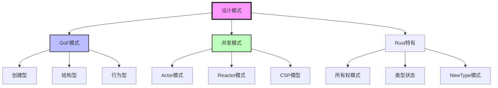
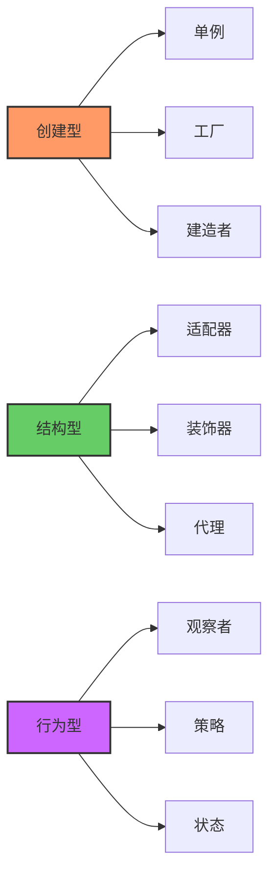
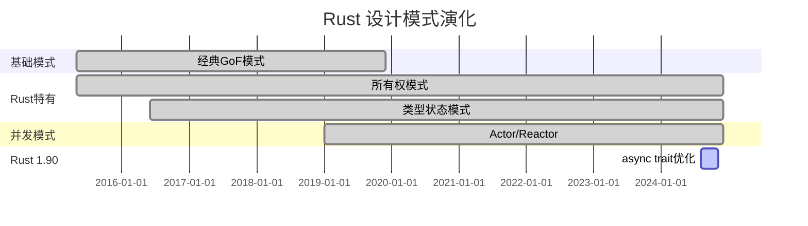

# C09 设计模式 知识图谱与概念关系（增强版）

> **文档定位**: Rust 1.90 设计模式的完整知识体系  
> **创建日期**: 2025-10-20  
> **适用版本**: Rust 1.90+ | Edition 2024  
> **文档类型**: 理论知识图谱 + 概念关系 + 可视化

---

## 📊 目录

- [C09 设计模式 知识图谱与概念关系（增强版）](#c09-设计模式-知识图谱与概念关系增强版)
  - [📊 目录](#-目录)
  - [1. 核心概念知识图谱](#1-核心概念知识图谱)
    - [设计模式体系总览](#设计模式体系总览)
    - [GoF模式分类](#gof模式分类)
  - [2. 概念属性矩阵](#2-概念属性矩阵)
    - [设计模式特性对比](#设计模式特性对比)
    - [并发模式对比](#并发模式对比)
  - [3. 技术演化与学习路径](#3-技术演化与学习路径)
    - [Rust设计模式演化](#rust设计模式演化)
    - [学习路径](#学习路径)
  - [4. 总结与索引](#4-总结与索引)
    - [快速查找](#快速查找)

---

## 1. 核心概念知识图谱

### 设计模式体系总览

### GoF模式分类

---

## 2. 概念属性矩阵

### 设计模式特性对比

| 模式 | 类型 | 复杂度 | Rust友好度 | 适用场景 |
|------|------|--------|-----------|---------|
| **单例** | 创建型 | ⭐⭐ | ⭐⭐⭐⭐⭐ | 全局状态 |
| **工厂** | 创建型 | ⭐⭐⭐ | ⭐⭐⭐⭐⭐ | 对象创建 |
| **建造者** | 创建型 | ⭐⭐⭐ | ⭐⭐⭐⭐⭐ | 复杂对象 |
| **适配器** | 结构型 | ⭐⭐ | ⭐⭐⭐⭐ | 接口兼容 |
| **观察者** | 行为型 | ⭐⭐⭐⭐ | ⭐⭐⭐ | 事件驱动 |
| **策略** | 行为型 | ⭐⭐ | ⭐⭐⭐⭐⭐ | 算法切换 |

### 并发模式对比

| 模式 | 复杂度 | 性能 | 适用场景 |
|------|--------|------|---------|
| **Actor** | ⭐⭐⭐⭐ | ⭐⭐⭐⭐ | 隔离并发 |
| **Reactor** | ⭐⭐⭐⭐⭐ | ⭐⭐⭐⭐⭐ | IO密集 |
| **CSP** | ⭐⭐⭐ | ⭐⭐⭐⭐ | 通信顺序 |

---

## 3. 技术演化与学习路径

### Rust设计模式演化

### 学习路径

**初学者 (2-3周)**:

- Week 1: 创建型模式（单例、工厂、建造者）
- Week 2: 结构型模式（适配器、装饰器、代理）
- Week 3: 行为型模式（观察者、策略、状态）

**中级 (3-4周)**:

- Week 4: Rust特有模式（所有权、类型状态、NewType）
- Week 5: 并发模式（Actor、Reactor）
- Week 6: 异步模式
- Week 7: 模式组合

**高级 (持续)**:

- 形式化验证、高级并发
- 性能优化、生产级模式
- 架构设计模式

---

## 4. 总结与索引

### 快速查找

**按问题查找**:

- GoF模式 → 2节特性对比
- 并发模式 → 2节并发对比
- Rust特有模式 → 相关文档

**相关文档**:

- [多维矩阵对比](MULTI_DIMENSIONAL_COMPARISON_MATRIX.md)
- [README](../../README.md)
- [知识图谱](../KNOWLEDGE_GRAPH.md)

---

**文档版本**: v1.0  
**最后更新**: 2025-10-20

---

*本知识图谱整合 C09 设计模式完整知识体系！*
