# C09 设计模式 思维导图与可视化

> **文档定位**: Rust 1.90 设计模式可视化学习  
> **创建日期**: 2025-10-20  
> **适用版本**: Rust 1.90+ | Edition 2024  
> **文档类型**: 思维导图 + 模式图 + 交互图

---

## 📊 目录

- [C09 设计模式 思维导图与可视化](#c09-设计模式-思维导图与可视化)
  - [📊 目录](#-目录)
  - [1. 设计模式全景思维导图](#1-设计模式全景思维导图)
    - [模式分类总览](#模式分类总览)
  - [2. 创建型模式可视化](#2-创建型模式可视化)
    - [单例模式结构](#单例模式结构)
    - [工厂模式演化](#工厂模式演化)
  - [3. 结构型模式可视化](#3-结构型模式可视化)
    - [适配器模式](#适配器模式)
    - [装饰器模式](#装饰器模式)
  - [4. 行为型模式可视化](#4-行为型模式可视化)
    - [策略模式](#策略模式)
    - [观察者模式](#观察者模式)
  - [5. 并发模式可视化](#5-并发模式可视化)
    - [Actor模式架构](#actor模式架构)
    - [Reactor模式流程](#reactor模式流程)
  - [6. Rust特有模式](#6-rust特有模式)
    - [类型状态模式](#类型状态模式)
    - [NewType模式](#newtype模式)
  - [7. 模式演化与关系](#7-模式演化与关系)
    - [模式演化时间线](#模式演化时间线)
    - [模式关系网络](#模式关系网络)
  - [相关文档](#相关文档)
  - [返回导航](#返回导航)

---

## 1. 设计模式全景思维导图

### 模式分类总览

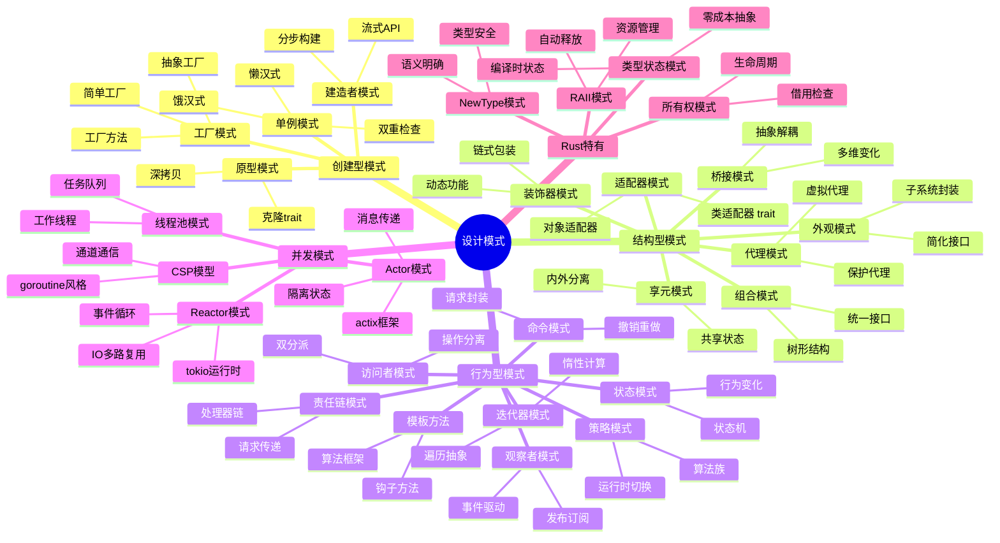

---

## 2. 创建型模式可视化

### 单例模式结构

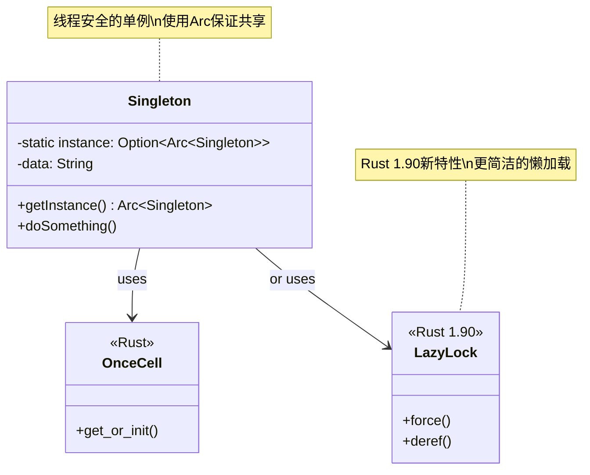

### 工厂模式演化

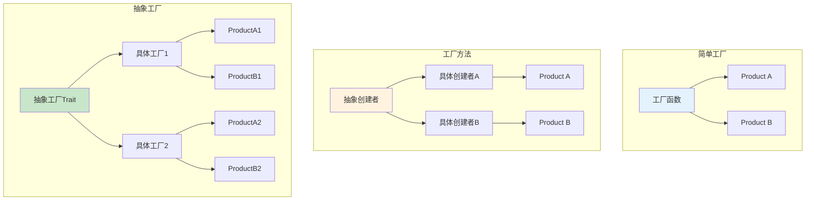

---

## 3. 结构型模式可视化

### 适配器模式

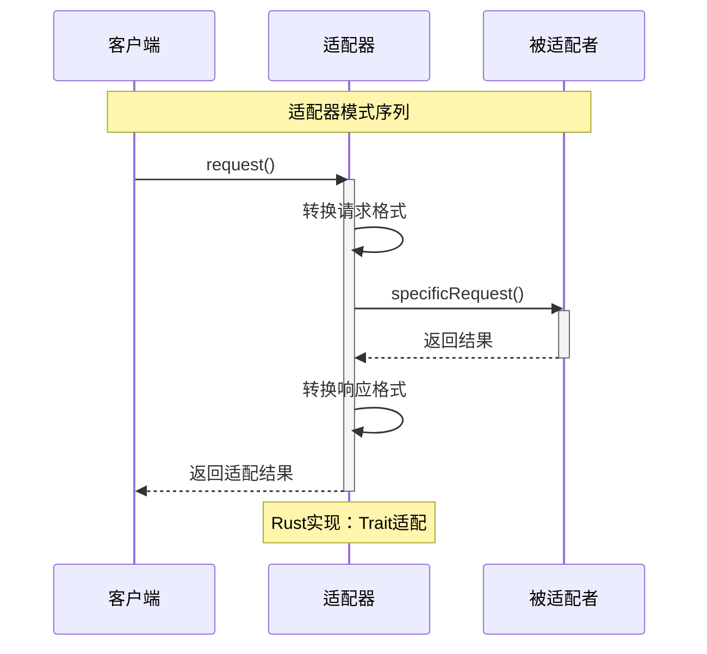

### 装饰器模式

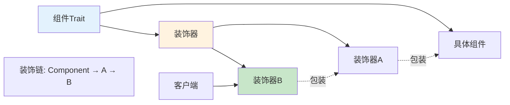

---

## 4. 行为型模式可视化

### 策略模式

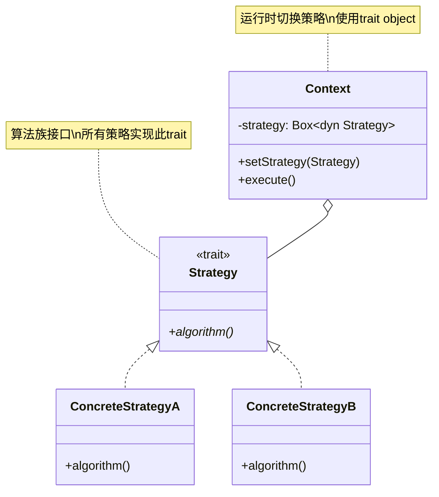

### 观察者模式

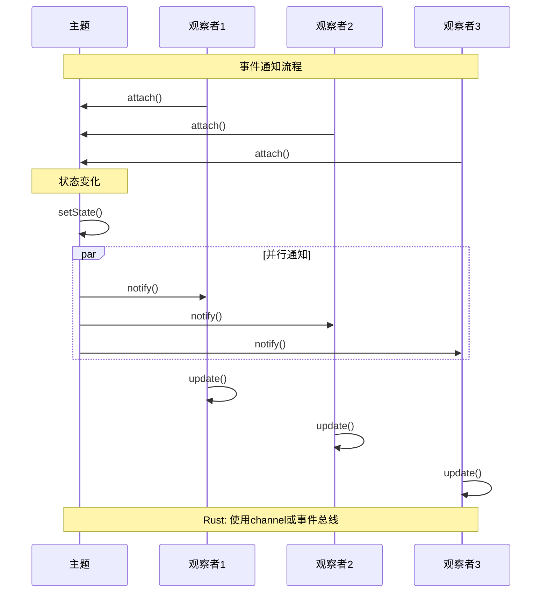

---

## 5. 并发模式可视化

### Actor模式架构

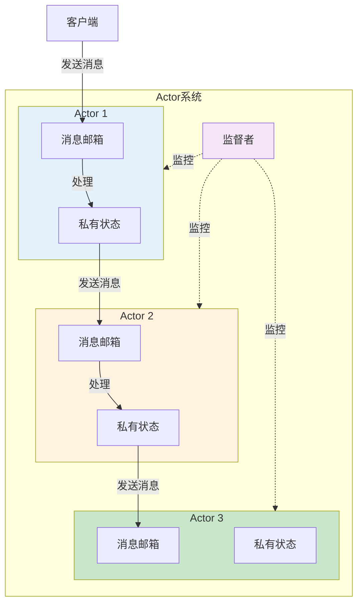

### Reactor模式流程

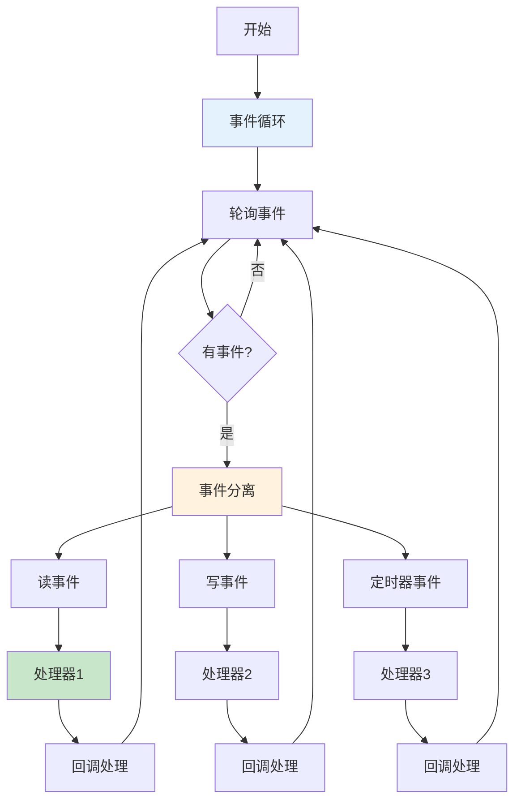

---

## 6. Rust特有模式

### 类型状态模式

```mermaid
stateDiagram-v2
    [*] --> New: Connection::new()
    New --> Connected: .connect()
    Connected --> Authenticated: .auth()
    Authenticated --> Active: .activate()
    
    Active --> Suspended: .suspend()
    Suspended --> Active: .resume()
    
    Active --> Disconnected: .disconnect()
    Authenticated --> Disconnected: .disconnect()
    Connected --> Disconnected: .disconnect()
    
    Disconnected --> [*]
    
    note right of New
        struct Connection~New~ { }
        编译时类型检查
    end note
    
    note right of Connected
        struct Connection~Connected~ { }
        只能调用auth()
    end note
    
    note right of Authenticated
        struct Connection~Authenticated~ { }
        只能调用activate()
    end note
```

### NewType模式

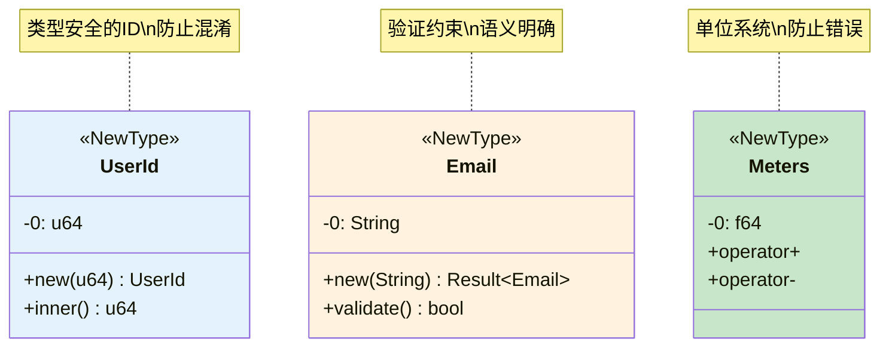

---

## 7. 模式演化与关系

### 模式演化时间线

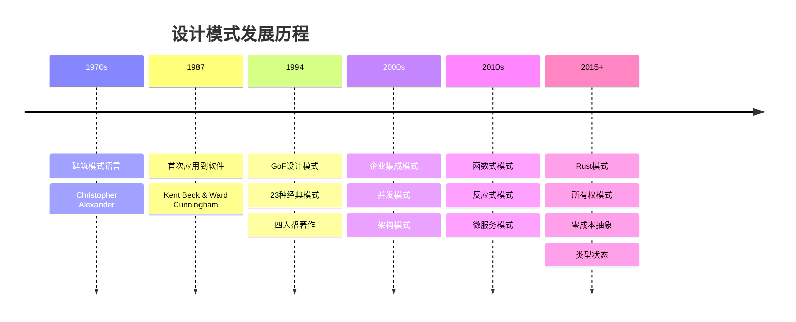

### 模式关系网络

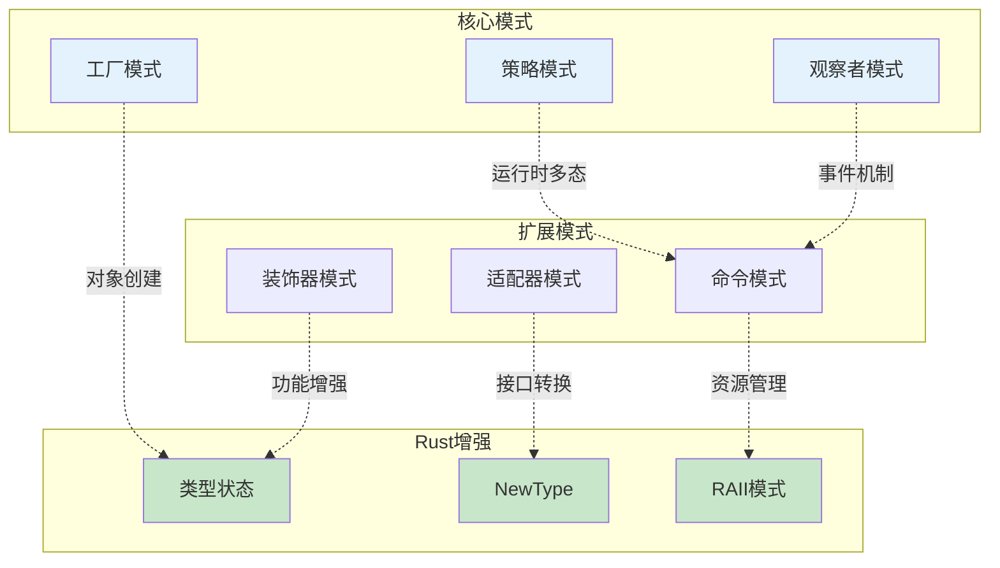

---

## 相关文档

- [知识图谱](./KNOWLEDGE_GRAPH_AND_CONCEPT_RELATIONS.md)
- [多维对比](./MULTI_DIMENSIONAL_COMPARISON_MATRIX.md)
- [异步递归分析](../ASYNC_RECURSION_ANALYSIS.md)
- [Actor/Reactor模式](../ACTOR_REACTOR_PATTERNS.md)
- [FAQ](../FAQ.md)

---

**文档版本**: v1.0  
**最后更新**: 2025-10-20  
**维护者**: Rust-lang项目组

---

## 返回导航

- [返回主索引](../00_MASTER_INDEX.md)
- [返回README](../README.md)
- [查看模式实现](../guides/)
