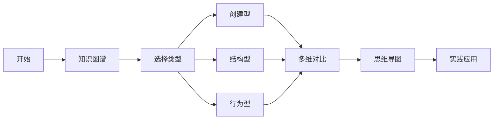
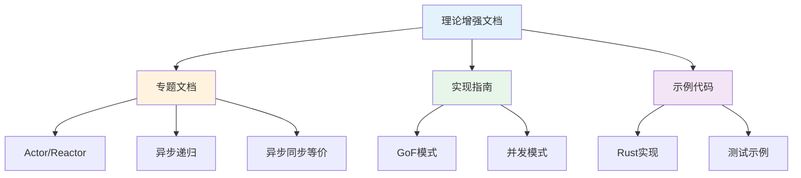

# C09 设计模式 理论增强文档

> **文档定位**: Rust 1.90 设计模式的高级理论体系  
> **创建日期**: 2025-10-20  
> **适用版本**: Rust 1.90+ | Edition 2024  
> **文档类型**: 理论增强 + 可视化 + 深度对比

---

## 📚 文档列表

### 1. [知识图谱与概念关系](./KNOWLEDGE_GRAPH_AND_CONCEPT_RELATIONS.md) ⭐ 推荐起点

**内容概述**:

- 设计模式体系知识图谱
- GoF模式分类
- 并发模式体系
- Rust特有模式

**适合人群**:

- 设计模式学习者
- 架构师
- 代码重构者

**预计时间**: 35分钟

---

### 2. [多维矩阵对比分析](./MULTI_DIMENSIONAL_COMPARISON_MATRIX.md)

**内容概述**:

- 设计模式特性对比
- 并发模式深度分析
- 适用场景决策
- 性能影响评估

**适合人群**:

- 架构设计师
- 技术决策者
- 性能优化工程师

**预计时间**: 40分钟

---

### 3. [思维导图与可视化](./MINDMAP_VISUALIZATION.md)

**内容概述**:

- 设计模式全景思维导图
- 模式结构可视化
- 交互序列图
- 模式演化历程

**适合人群**:

- 可视化学习者
- 教学工作者
- 模式理解困难者

**预计时间**: 35分钟

---

## 🎯 学习路径

### 快速入门路径

### 深度学习路径

1. **第1周**: GoF经典模式
   - 创建型模式（5个）
   - 结构型模式（7个）
   - 行为型模式（11个）

2. **第2周**: Rust特有模式
   - 所有权模式
   - 类型状态模式
   - NewType模式
   - RAII模式

3. **第3周**: 并发模式
   - Actor模式
   - Reactor模式
   - CSP模型
   - 线程池模式

4. **第4周**: 综合实践
   - 模式组合
   - 实际项目应用
   - 代码重构

---

## 📊 内容矩阵

| 文档 | 理论深度 | 实用性 | 可视化 | 推荐度 |
|------|---------|--------|--------|--------|
| 知识图谱 | ⭐⭐⭐⭐⭐ | ⭐⭐⭐ | ⭐⭐⭐⭐⭐ | ⭐⭐⭐⭐⭐ |
| 多维对比 | ⭐⭐⭐⭐ | ⭐⭐⭐⭐⭐ | ⭐⭐⭐ | ⭐⭐⭐⭐⭐ |
| 思维导图 | ⭐⭐⭐ | ⭐⭐⭐⭐ | ⭐⭐⭐⭐⭐ | ⭐⭐⭐⭐ |

---

## 🔍 按主题查找

### 创建型模式

- 知识图谱 → [创建型模式](./KNOWLEDGE_GRAPH_AND_CONCEPT_RELATIONS.md#gof模式分类)
- 多维对比 → [创建型对比](./MULTI_DIMENSIONAL_COMPARISON_MATRIX.md#1-创建型模式对比)
- 思维导图 → [创建型可视化](./MINDMAP_VISUALIZATION.md#2-创建型模式可视化)

### 结构型模式

- 知识图谱 → [结构型模式](./KNOWLEDGE_GRAPH_AND_CONCEPT_RELATIONS.md#gof模式分类)
- 多维对比 → [结构型对比](./MULTI_DIMENSIONAL_COMPARISON_MATRIX.md#2-结构型模式对比)
- 思维导图 → [结构型可视化](./MINDMAP_VISUALIZATION.md#3-结构型模式可视化)

### 行为型模式

- 知识图谱 → [行为型模式](./KNOWLEDGE_GRAPH_AND_CONCEPT_RELATIONS.md#gof模式分类)
- 多维对比 → [行为型对比](./MULTI_DIMENSIONAL_COMPARISON_MATRIX.md#3-行为型模式对比)
- 思维导图 → [行为型可视化](./MINDMAP_VISUALIZATION.md#4-行为型模式可视化)

### 并发模式

- 知识图谱 → [并发模式体系](./KNOWLEDGE_GRAPH_AND_CONCEPT_RELATIONS.md#设计模式体系总览)
- 多维对比 → [并发模式对比](./MULTI_DIMENSIONAL_COMPARISON_MATRIX.md#4-并发模式对比)
- 思维导图 → [并发可视化](./MINDMAP_VISUALIZATION.md#5-并发模式可视化)

### Rust特有模式

- 知识图谱 → [Rust模式](./KNOWLEDGE_GRAPH_AND_CONCEPT_RELATIONS.md#设计模式体系总览)
- 多维对比 → [Rust模式对比](./MULTI_DIMENSIONAL_COMPARISON_MATRIX.md#5-rust特有模式)
- 思维导图 → [Rust模式可视化](./MINDMAP_VISUALIZATION.md#6-rust特有模式)

---

## 💡 文档特色

### 1. 系统性

✅ **完整的模式体系**: GoF + 并发 + Rust特有  
✅ **结构化组织**: 清晰的分类和层次  
✅ **交叉引用**: 模式之间的关系网络

### 2. 可视化

✅ **Mermaid图表**: 15+个可视化图表  
✅ **思维导图**: 完整的模式分类  
✅ **序列图**: 清晰的交互流程  
✅ **状态图**: 类型状态演化

### 3. 实用性

✅ **模式对比**: 详尽的特性分析  
✅ **选型指南**: 实用的决策矩阵  
✅ **最佳实践**: Rust实现要点

---

## 📈 与其他文档的关系

---

## 🎓 适用场景

### 场景1: 模式学习

**阅读顺序**:

1. [知识图谱](./KNOWLEDGE_GRAPH_AND_CONCEPT_RELATIONS.md) - 建立体系
2. [思维导图](./MINDMAP_VISUALIZATION.md) - 可视化理解
3. [实现指南](../guides/)

### 场景2: 架构设计

**阅读顺序**:

1. [多维对比](./MULTI_DIMENSIONAL_COMPARISON_MATRIX.md) - 模式选择
2. [知识图谱](./KNOWLEDGE_GRAPH_AND_CONCEPT_RELATIONS.md) - 模式关系
3. [专题文档](../ACTOR_REACTOR_PATTERNS.md)

### 场景3: 代码重构

**阅读顺序**:

1. [模式对比](./MULTI_DIMENSIONAL_COMPARISON_MATRIX.md) - 识别问题
2. [思维导图](./MINDMAP_VISUALIZATION.md) - 选择方案
3. [实现示例](../guides/)

### 场景4: 教学培训

**阅读顺序**:

1. [思维导图](./MINDMAP_VISUALIZATION.md) - 可视化展示
2. [知识图谱](./KNOWLEDGE_GRAPH_AND_CONCEPT_RELATIONS.md) - 系统讲解
3. [示例代码](../examples/)

---

## 📚 相关资源

### 模块内文档

- [主索引](../00_MASTER_INDEX.md)
- [README](../README.md)
- [FAQ](../FAQ.md)
- [术语表](../Glossary.md)

### 专题文档

- [Actor/Reactor模式](../ACTOR_REACTOR_PATTERNS.md)
- [异步递归分析](../ASYNC_RECURSION_ANALYSIS.md)
- [异步同步等价](../ASYNC_SYNC_EQUIVALENCE_THEORY.md)

### 实现指南

- [创建型模式](../guides/)
- [结构型模式](../guides/)
- [行为型模式](../guides/)

---

## ✅ 文档状态

| 文档 | 状态 | 完成度 | 最后更新 |
|------|------|--------|----------|
| 知识图谱 | ✅ 完成 | 100% | 2025-10-20 |
| 多维对比 | ✅ 完成 | 100% | 2025-10-20 |
| 思维导图 | ✅ 完成 | 100% | 2025-10-20 |
| README | ✅ 完成 | 100% | 2025-10-20 |

---

## 🤝 贡献指南

### 文档改进

欢迎提交：

- 新模式添加
- 错误修正
- 图表优化
- 示例补充

### 反馈渠道

- Issue反馈
- Pull Request
- 邮件联系

---

**文档版本**: v1.0  
**总文档数**: 4篇  
**总图表数**: 15+个  
**模式覆盖**: 30+个  
**最后更新**: 2025-10-20  
**维护者**: Rust-lang项目组

---

## 返回导航

- [返回主索引](../00_MASTER_INDEX.md)
- [返回模块README](../README.md)
- [查看专题](../ACTOR_REACTOR_PATTERNS.md)
- [查看指南](../guides/)
