# C10 Networks 最佳实践指南

> 适用范围：Rust 1.90+，Tokio 1.35+。文档风格遵循 [`STYLE.md`](STYLE.md)。

## 📋 目录

- [C10 Networks 最佳实践指南](#c10-networks-最佳实践指南)
  - [📋 目录](#-目录)
  - [🎯 概述](#-概述)
    - [📚 理论基础](#-理论基础)
    - [🔬 实践原则](#-实践原则)
    - [📊 实践分类](#-实践分类)
  - [📝 代码质量](#-代码质量)
    - [模块化设计](#模块化设计)
      - [命名规范](#命名规范)
      - [类型安全](#类型安全)
    - [2. 内存管理](#2-内存管理)
      - [使用 Bytes 避免拷贝](#使用-bytes-避免拷贝)
      - [内存池使用](#内存池使用)
    - [3. 错误处理](#3-错误处理)
      - [使用 Result 类型](#使用-result-类型)
      - [错误恢复策略](#错误恢复策略)
  - [性能优化](#性能优化)
    - [1. 异步编程](#1-异步编程)
      - [使用 Tokio 运行时](#使用-tokio-运行时)
      - [连接池管理](#连接池管理)
    - [2. 内存优化](#2-内存优化)
      - [零拷贝操作](#零拷贝操作)
      - [缓冲区重用](#缓冲区重用)
    - [3. 网络优化](#3-网络优化)
      - [TCP 优化](#tcp-优化)
      - [HTTP 优化](#http-优化)
  - [安全实践](#安全实践)
    - [1. 输入验证](#1-输入验证)
      - [数据验证](#数据验证)
      - [边界检查](#边界检查)
    - [2. 认证和授权](#2-认证和授权)
      - [JWT 验证](#jwt-验证)
      - [权限控制](#权限控制)
    - [3. 加密和传输安全](#3-加密和传输安全)
      - [TLS 配置](#tls-配置)
  - [错误处理](#错误处理)
    - [1. 错误类型设计](#1-错误类型设计)
      - [分层错误处理](#分层错误处理)
      - [错误上下文](#错误上下文)
    - [2. 错误恢复](#2-错误恢复)
      - [重试机制](#重试机制)
      - [熔断器模式](#熔断器模式)
  - [测试策略](#测试策略)
    - [1. 单元测试](#1-单元测试)
      - [测试覆盖](#测试覆盖)
      - [边界测试](#边界测试)
    - [2. 集成测试](#2-集成测试)
      - [端到端测试](#端到端测试)
    - [3. 性能测试](#3-性能测试)
      - [基准测试](#基准测试)
      - [压力测试](#压力测试)
  - [部署实践](#部署实践)
    - [1. 容器化](#1-容器化)
      - [Docker 最佳实践](#docker-最佳实践)
      - [Docker Compose](#docker-compose)
    - [2. Kubernetes 部署](#2-kubernetes-部署)
      - [部署清单](#部署清单)
      - [水平 Pod 自动缩放](#水平-pod-自动缩放)
    - [3. 云平台部署](#3-云平台部署)
      - [AWS EKS](#aws-eks)
      - [Azure AKS](#azure-aks)
  - [监控和日志](#监控和日志)
    - [1. 监控指标](#1-监控指标)
      - [自定义指标](#自定义指标)
      - [Prometheus 集成](#prometheus-集成)
    - [2. 日志记录](#2-日志记录)
      - [结构化日志](#结构化日志)
      - [日志轮转](#日志轮转)
  - [代码审查](#代码审查)
    - [1. 审查清单](#1-审查清单)
      - [安全检查](#安全检查)
      - [性能检查](#性能检查)
      - [错误处理检查](#错误处理检查)
    - [2. 自动化检查](#2-自动化检查)
      - [CI/CD 流水线](#cicd-流水线)
      - [预提交钩子](#预提交钩子)
  - [文档维护](#文档维护)
    - [1. API 文档](#1-api-文档)
      - [文档注释](#文档注释)
    - [2. 用户文档](#2-用户文档)
      - [使用指南](#使用指南)
    - [基本用法](#基本用法)
      - [TCP 客户端](#tcp-客户端)
      - [TCP 服务器](#tcp-服务器)
  - [高级功能](#高级功能)
    - [错误处理1](#错误处理1)
    - [性能优化1](#性能优化1)
      - [使用连接池](#使用连接池)
  - [常见问题](#常见问题)
    - [Q: 如何处理连接超时？](#q-如何处理连接超时)
    - [Q: 如何优化大量并发连接的性能？](#q-如何优化大量并发连接的性能)
  - [团队协作](#团队协作)
    - [1. 开发流程](#1-开发流程)
      - [Git 工作流](#git-工作流)
      - [代码审查1](#代码审查1)
    - [2. 知识分享](#2-知识分享)
      - [技术分享](#技术分享)
  - [最佳实践总结](#最佳实践总结)
    - [代码审查指南](#代码审查指南)

## 🎯 概述

本文档提供了C10 Networks项目的最佳实践指南，涵盖代码质量、性能优化、安全实践、错误处理、测试策略、部署实践、监控和日志、代码审查、文档维护等方面。这些实践基于Rust语言特性和网络编程的最佳实践，旨在帮助开发者构建高质量、高性能、安全的网络应用程序。

### 📚 理论基础

最佳实践基于以下理论基础：

1. **软件工程理论**: 模块化设计、抽象、封装
2. **网络编程理论**: 协议实现、并发处理、错误恢复
3. **安全理论**: 防御性编程、最小权限原则
4. **性能理论**: 算法复杂度、内存管理、I/O优化
5. **测试理论**: 单元测试、集成测试、属性测试

### 🔬 实践原则

C10 Networks 遵循以下核心原则：

```mermaid
graph TB
    A[代码质量] --> B[模块化设计]
    A --> C[类型安全]
    A --> D[内存管理]
    
    E[性能优化] --> F[异步编程]
    E --> G[内存优化]
    E --> H[网络优化]
    
    I[安全实践] --> J[输入验证]
    I --> K[认证授权]
    I --> L[加密传输]
    
    M[错误处理] --> N[错误类型设计]
    M --> O[错误恢复]
    M --> P[错误传播]
    
    Q[测试策略] --> R[单元测试]
    Q --> S[集成测试]
    Q --> T[性能测试]
```



### 📊 实践分类

| 实践类别 | 核心内容 | 技术要点 |
|---------|---------|---------|
| 代码质量 | 模块化、类型安全 | Rust特性、所有权系统 |
| 性能优化 | 异步、内存、网络 | Tokio、零拷贝、连接池 |
| 安全实践 | 验证、认证、加密 | 输入验证、TLS、JWT |
| 错误处理 | 类型设计、恢复策略 | Result类型、重试机制 |
| 测试策略 | 单元、集成、性能 | 测试框架、基准测试 |
| 部署实践 | 容器化、K8s、云平台 | Docker、Kubernetes |
| 监控日志 | 指标、日志、追踪 | Prometheus、结构化日志 |

本指南提供了 C10 Networks 项目的最佳实践，涵盖了代码质量、性能优化、安全实践、错误处理、测试策略、部署实践、监控日志、代码审查、文档维护和团队协作等方面。遵循这些实践将帮助开发团队构建高质量、高性能、安全可靠的网络应用程序。

## 📝 代码质量

### 模块化设计

```rust
// 好的做法：清晰的模块结构
pub mod protocol {
    pub mod tcp {
        pub mod client;
        pub mod server;
        pub mod connection;
    }
    
    pub mod udp {
        pub mod socket;
        pub mod datagram;
    }
    
    pub mod http {
        pub mod client;
        pub mod server;
        pub mod request;
        pub mod response;
    }
}

// 避免：扁平化的模块结构
pub mod tcp_client;
pub mod tcp_server;
pub mod udp_socket;
pub mod http_client;
pub mod http_server;
```

#### 命名规范

```rust
// 好的做法：清晰的命名
pub struct TcpConnection {
    pub id: u64,
    pub state: TcpState,
    pub config: TcpConnectionConfig,
}

pub enum TcpState {
    Closed,
    Listen,
    SynSent,
    SynReceived,
    Established,
    FinWait1,
    FinWait2,
    CloseWait,
    LastAck,
    Closing,
    TimeWait,
}

// 避免：模糊的命名
pub struct Conn {
    pub i: u64,
    pub s: State,
    pub c: Config,
}

pub enum State {
    C,
    L,
    SS,
    SR,
    E,
    // ...
}
```

#### 类型安全

```rust
// 好的做法：使用强类型
#[derive(Debug, Clone, PartialEq)]
pub struct Port(u16);

impl Port {
    pub fn new(port: u16) -> Result<Self, String> {
        if port == 0 {
            Err("端口不能为 0".to_string())
        } else {
            Ok(Port(port))
        }
    }
    
    pub fn value(&self) -> u16 {
        self.0
    }
}

// 避免：使用原始类型
pub fn connect(host: &str, port: u16) -> Result<(), String> {
    // 没有类型检查
    if port == 0 {
        return Err("端口不能为 0".to_string());
    }
    // ...
}
```

### 2. 内存管理

#### 使用 Bytes 避免拷贝

```rust
use bytes::Bytes;

// 好的做法：使用 Bytes 避免数据拷贝
pub fn process_data(data: Bytes) -> Bytes {
    // Bytes 支持零拷贝操作
    data.slice(0..data.len())
}

// 避免：不必要的拷贝
pub fn process_data_bad(data: &[u8]) -> Vec<u8> {
    // 创建新的 Vec 导致内存拷贝
    data.to_vec()
}
```

#### 内存池使用

```rust
use c10_networks::performance::memory_pool::MemoryPool;
use std::sync::Arc;

// 好的做法：使用内存池
pub struct OptimizedHandler {
    memory_pool: Arc<MemoryPool>,
}

impl OptimizedHandler {
    pub fn new() -> Self {
        Self {
            memory_pool: Arc::new(MemoryPool::new(1024 * 1024, 1000)),
        }
    }
    
    pub fn handle_request(&self, data: &[u8]) -> Vec<u8> {
        let buffer = self.memory_pool.allocate(data.len());
        // 处理数据
        buffer
    }
}

// 避免：频繁的内存分配
pub fn handle_request_bad(data: &[u8]) -> Vec<u8> {
    // 每次都分配新内存
    let mut result = Vec::with_capacity(data.len());
    result.extend_from_slice(data);
    result
}
```

### 3. 错误处理

#### 使用 Result 类型

```rust
use c10_networks::error::{NetworkError, ErrorRecovery};

// 好的做法：明确的错误处理
pub async fn send_data(data: &[u8]) -> Result<(), NetworkError> {
    let mut client = TcpClient::new("127.0.0.1:8080").await?;
    client.write_all(data).await?;
    Ok(())
}

// 避免：使用 panic 或 unwrap
pub async fn send_data_bad(data: &[u8]) {
    let mut client = TcpClient::new("127.0.0.1:8080").await.unwrap();
    client.write_all(data).await.unwrap();
}
```

#### 错误恢复策略

```rust
// 好的做法：实现错误恢复
pub async fn retry_operation<F, T>(mut operation: F, max_retries: u32) -> Result<T, NetworkError>
where
    F: FnMut() -> Result<T, NetworkError>,
{
    let mut retries = 0;
    
    loop {
        match operation() {
            Ok(result) => return Ok(result),
            Err(e) => {
                if !e.is_retryable() || retries >= max_retries {
                    return Err(e);
                }
                
                retries += 1;
                tokio::time::sleep(e.retry_delay()).await;
            }
        }
    }
}

// 避免：简单的重试
pub async fn retry_operation_bad<F, T>(mut operation: F, max_retries: u32) -> Result<T, NetworkError>
where
    F: FnMut() -> Result<T, NetworkError>,
{
    for _ in 0..max_retries {
        if let Ok(result) = operation() {
            return Ok(result);
        }
        tokio::time::sleep(Duration::from_secs(1)).await;
    }
    Err(NetworkError::Timeout(Duration::from_secs(5)))
}
```

## 性能优化

### 1. 异步编程

#### 使用 Tokio 运行时

```rust
use tokio::io::{AsyncReadExt, AsyncWriteExt};

// 好的做法：充分利用异步
pub async fn handle_connection(mut client: TcpClient) -> Result<(), NetworkError> {
    let mut buffer = [0; 1024];
    
    loop {
        match client.read(&mut buffer).await {
            Ok(0) => break,
            Ok(n) => {
                // 异步写入
                client.write_all(&buffer[..n]).await?;
            }
            Err(e) => return Err(e.into()),
        }
    }
    
    Ok(())
}

// 避免：阻塞操作
pub fn handle_connection_bad(mut client: TcpClient) -> Result<(), NetworkError> {
    let mut buffer = [0; 1024];
    
    loop {
        match client.read(&mut buffer) { // 阻塞调用
            Ok(0) => break,
            Ok(n) => {
                client.write_all(&buffer[..n])?; // 阻塞调用
            }
            Err(e) => return Err(e.into()),
        }
    }
    
    Ok(())
}
```

#### 连接池管理

```rust
use std::sync::Arc;
use tokio::sync::Semaphore;

// 好的做法：连接池
pub struct ConnectionPool {
    clients: Vec<Arc<TcpClient>>,
    semaphore: Arc<Semaphore>,
}

impl ConnectionPool {
    pub async fn new(addr: &str, max_connections: usize) -> Result<Self, NetworkError> {
        let mut clients = Vec::new();
        
        for _ in 0..max_connections {
            let client = Arc::new(TcpClient::new(addr).await?);
            clients.push(client);
        }
        
        Ok(Self {
            clients,
            semaphore: Arc::new(Semaphore::new(max_connections)),
        })
    }
    
    pub async fn get_connection(&self) -> Arc<TcpClient> {
        let _permit = self.semaphore.acquire().await.unwrap();
        self.clients[0].clone() // 简单的轮询
    }
}

// 避免：每次创建新连接
pub async fn send_data_bad(data: &[u8]) -> Result<(), NetworkError> {
    let mut client = TcpClient::new("127.0.0.1:8080").await?; // 每次都创建新连接
    client.write_all(data).await?;
    Ok(())
}
```

### 2. 内存优化

#### 零拷贝操作

```rust
use bytes::Bytes;

// 好的做法：零拷贝
pub fn process_packet(packet: &Packet) -> Bytes {
    // 直接返回原始数据的切片
    packet.data.slice(0..packet.data.len())
}

// 避免：不必要的拷贝
pub fn process_packet_bad(packet: &Packet) -> Vec<u8> {
    // 创建新的 Vec 导致拷贝
    packet.data.to_vec()
}
```

#### 缓冲区重用

```rust
// 好的做法：缓冲区重用
pub struct BufferPool {
    buffers: Vec<Vec<u8>>,
}

impl BufferPool {
    pub fn new() -> Self {
        Self {
            buffers: Vec::new(),
        }
    }
    
    pub fn get_buffer(&mut self, size: usize) -> Vec<u8> {
        if let Some(mut buffer) = self.buffers.pop() {
            if buffer.capacity() >= size {
                buffer.clear();
                buffer
            } else {
                vec![0; size]
            }
        } else {
            vec![0; size]
        }
    }
    
    pub fn return_buffer(&mut self, buffer: Vec<u8>) {
        if buffer.capacity() <= 1024 * 1024 { // 限制池大小
            self.buffers.push(buffer);
        }
    }
}

// 避免：频繁分配
pub fn process_data_bad(data: &[u8]) -> Vec<u8> {
    let mut result = Vec::new(); // 每次都分配新内存
    result.extend_from_slice(data);
    result
}
```

### 3. 网络优化

#### TCP 优化

```rust
use c10_networks::protocol::tcp::TcpConnectionConfig;

// 好的做法：优化 TCP 配置
pub fn create_optimized_tcp_config() -> TcpConnectionConfig {
    TcpConnectionConfig::default()
        .keep_alive(true)
        .keep_alive_interval(Duration::from_secs(30))
        .keep_alive_timeout(Duration::from_secs(5))
        .nodelay(true) // 禁用 Nagle 算法
        .recv_buffer_size(64 * 1024) // 64KB 接收缓冲区
        .send_buffer_size(64 * 1024) // 64KB 发送缓冲区
}

// 避免：使用默认配置
pub fn create_default_config() -> TcpConnectionConfig {
    TcpConnectionConfig::default() // 可能不是最优配置
}
```

#### HTTP 优化

```rust
use c10_networks::protocol::http::{HttpClient, HttpVersion};

// 好的做法：使用 HTTP/2
pub async fn create_http2_client() -> Result<HttpClient, NetworkError> {
    let client = HttpClient::new()
        .version(HttpVersion::Http2)
        .max_connections(100)
        .keep_alive(true)
        .timeout(Duration::from_secs(30));
    
    Ok(client)
}

// 避免：使用 HTTP/1.1 且不优化
pub async fn create_http1_client() -> Result<HttpClient, NetworkError> {
    let client = HttpClient::new()
        .version(HttpVersion::Http1_1); // 默认配置
    Ok(client)
}
```

## 安全实践

### 1. 输入验证

#### 数据验证

```rust
// 好的做法：严格的输入验证
pub fn validate_packet_data(data: &[u8]) -> Result<(), String> {
    if data.is_empty() {
        return Err("数据不能为空".to_string());
    }
    
    if data.len() > 1024 * 1024 { // 1MB 限制
        return Err("数据太大".to_string());
    }
    
    // 检查恶意模式
    if data.contains(&0x00) {
        return Err("数据包含空字节".to_string());
    }
    
    Ok(())
}

// 避免：不验证输入
pub fn process_data_bad(data: &[u8]) -> Result<(), String> {
    // 直接处理，没有验证
    process_raw_data(data);
    Ok(())
}
```

#### 边界检查

```rust
// 好的做法：边界检查
pub fn safe_slice(data: &[u8], start: usize, end: usize) -> Result<&[u8], String> {
    if start >= data.len() {
        return Err("起始位置超出范围".to_string());
    }
    
    if end > data.len() {
        return Err("结束位置超出范围".to_string());
    }
    
    if start >= end {
        return Err("起始位置不能大于等于结束位置".to_string());
    }
    
    Ok(&data[start..end])
}

// 避免：不安全的切片
pub fn unsafe_slice(data: &[u8], start: usize, end: usize) -> &[u8] {
    &data[start..end] // 可能导致 panic
}
```

### 2. 认证和授权

#### JWT 验证

```rust
use c10_networks::security::auth::{AuthManager, JwtToken};

// 好的做法：JWT 验证
pub struct SecureHandler {
    auth_manager: AuthManager,
}

impl SecureHandler {
    pub fn new() -> Self {
        Self {
            auth_manager: AuthManager::new(),
        }
    }
    
    pub async fn handle_authenticated_request(&self, token: &str, request: &str) -> Result<String, String> {
        // 验证 token
        let claims = self.auth_manager.verify_token(token)?;
        
        // 检查权限
        if !self.auth_manager.has_permission(&claims, "read") {
            return Err("权限不足".to_string());
        }
        
        // 处理请求
        Ok(format!("处理请求: {}", request))
    }
}

// 避免：不验证身份
pub fn handle_request_bad(request: &str) -> String {
    format!("处理请求: {}", request) // 没有身份验证
}
```

#### 权限控制

```rust
// 好的做法：基于角色的访问控制
pub struct RoleBasedAccessControl {
    roles: HashMap<String, Vec<String>>,
}

impl RoleBasedAccessControl {
    pub fn new() -> Self {
        let mut roles = HashMap::new();
        roles.insert("admin".to_string(), vec!["read".to_string(), "write".to_string(), "delete".to_string()]);
        roles.insert("user".to_string(), vec!["read".to_string()]);
        roles.insert("guest".to_string(), vec![]);
        
        Self { roles }
    }
    
    pub fn has_permission(&self, role: &str, permission: &str) -> bool {
        self.roles.get(role)
            .map(|permissions| permissions.contains(&permission.to_string()))
            .unwrap_or(false)
    }
}

// 避免：硬编码权限
pub fn check_permission_bad(user: &str, action: &str) -> bool {
    match user {
        "admin" => true,
        "user" => action == "read",
        _ => false,
    }
}
```

### 3. 加密和传输安全

#### TLS 配置

```rust
use c10_networks::security::tls::{TlsConfig, TlsServer};
use std::path::Path;

// 好的做法：安全的 TLS 配置
pub fn create_secure_tls_config() -> Result<TlsConfig, String> {
    TlsConfig::new()
        .certificate_file(Path::new("cert.pem"))
        .private_key_file(Path::new("key.pem"))
        .ca_file(Path::new("ca.pem"))
        .min_protocol_version(tls::ProtocolVersion::TLSv1_2)
        .max_protocol_version(tls::ProtocolVersion::TLSv1_3)
        .build()
}

// 避免：不安全的 TLS 配置
pub fn create_insecure_tls_config() -> Result<TlsConfig, String> {
    TlsConfig::new()
        .certificate_file(Path::new("cert.pem"))
        .private_key_file(Path::new("key.pem"))
        .min_protocol_version(tls::ProtocolVersion::TLSv1_0) // 太旧
        .build()
}
```

## 错误处理

### 1. 错误类型设计

#### 分层错误处理

```rust
use c10_networks::error::{NetworkError, ProtocolError, PerformanceError, SecurityError};

// 好的做法：分层的错误类型
#[derive(Debug)]
pub enum ApplicationError {
    Network(NetworkError),
    Protocol(ProtocolError),
    Performance(PerformanceError),
    Security(SecurityError),
    Validation(String),
    Configuration(String),
}

impl From<NetworkError> for ApplicationError {
    fn from(error: NetworkError) -> Self {
        ApplicationError::Network(error)
    }
}

impl From<ProtocolError> for ApplicationError {
    fn from(error: ProtocolError) -> Self {
        ApplicationError::Protocol(error)
    }
}

impl std::fmt::Display for ApplicationError {
    fn fmt(&self, f: &mut std::fmt::Formatter<'_>) -> std::fmt::Result {
        match self {
            ApplicationError::Network(e) => write!(f, "网络错误: {}", e),
            ApplicationError::Protocol(e) => write!(f, "协议错误: {}", e),
            ApplicationError::Performance(e) => write!(f, "性能错误: {}", e),
            ApplicationError::Security(e) => write!(f, "安全错误: {}", e),
            ApplicationError::Validation(msg) => write!(f, "验证错误: {}", msg),
            ApplicationError::Configuration(msg) => write!(f, "配置错误: {}", msg),
        }
    }
}

impl std::error::Error for ApplicationError {}

// 避免：使用字符串作为错误类型
pub type BadError = String;
```

#### 错误上下文

```rust
// 好的做法：提供错误上下文
pub async fn process_request(request: &str) -> Result<String, ApplicationError> {
    let data = validate_request(request)
        .map_err(|e| ApplicationError::Validation(format!("请求验证失败: {}", e)))?;
    
    let response = send_to_backend(&data)
        .await
        .map_err(|e| ApplicationError::Network(e))?;
    
    Ok(response)
}

// 避免：丢失错误上下文
pub async fn process_request_bad(request: &str) -> Result<String, String> {
    let data = validate_request(request)?; // 错误信息丢失
    let response = send_to_backend(&data).await?; // 错误信息丢失
    Ok(response)
}
```

### 2. 错误恢复

#### 重试机制

```rust
use c10_networks::error::{NetworkError, ErrorRecovery};
use std::time::Duration;

// 好的做法：智能重试
pub async fn retry_with_exponential_backoff<F, T>(
    mut operation: F,
    max_retries: u32,
) -> Result<T, NetworkError>
where
    F: FnMut() -> Result<T, NetworkError>,
{
    let mut retries = 0;
    let mut delay = Duration::from_millis(100);
    
    loop {
        match operation() {
            Ok(result) => return Ok(result),
            Err(e) => {
                if !e.is_retryable() || retries >= max_retries {
                    return Err(e);
                }
                
                retries += 1;
                tokio::time::sleep(delay).await;
                delay = Duration::from_millis(delay.as_millis() as u64 * 2); // 指数退避
            }
        }
    }
}

// 避免：固定延迟重试
pub async fn retry_fixed_delay<F, T>(
    mut operation: F,
    max_retries: u32,
) -> Result<T, NetworkError>
where
    F: FnMut() -> Result<T, NetworkError>,
{
    for _ in 0..max_retries {
        if let Ok(result) = operation() {
            return Ok(result);
        }
        tokio::time::sleep(Duration::from_secs(1)).await; // 固定延迟
    }
    Err(NetworkError::Timeout(Duration::from_secs(5)))
}
```

#### 熔断器模式

```rust
use std::sync::Arc;
use tokio::sync::RwLock;
use std::time::{Duration, Instant};

// 好的做法：熔断器模式
pub struct CircuitBreaker {
    state: Arc<RwLock<CircuitState>>,
    failure_threshold: u32,
    timeout: Duration,
    last_failure: Arc<RwLock<Option<Instant>>>,
}

#[derive(Debug, Clone)]
pub enum CircuitState {
    Closed,
    Open,
    HalfOpen,
}

impl CircuitBreaker {
    pub fn new(failure_threshold: u32, timeout: Duration) -> Self {
        Self {
            state: Arc::new(RwLock::new(CircuitState::Closed)),
            failure_threshold,
            timeout,
            last_failure: Arc::new(RwLock::new(None)),
        }
    }
    
    pub async fn call<F, T>(&self, operation: F) -> Result<T, String>
    where
        F: FnOnce() -> Result<T, String>,
    {
        let state = self.state.read().await;
        
        match *state {
            CircuitState::Open => {
                let last_failure = self.last_failure.read().await;
                if let Some(last) = *last_failure {
                    if last.elapsed() >= self.timeout {
                        drop(state);
                        drop(last_failure);
                        self.try_half_open().await;
                        return self.call(operation).await;
                    }
                }
                Err("熔断器开启".to_string())
            }
            CircuitState::HalfOpen => {
                drop(state);
                match operation() {
                    Ok(result) => {
                        self.close().await;
                        Ok(result)
                    }
                    Err(e) => {
                        self.open().await;
                        Err(e)
                    }
                }
            }
            CircuitState::Closed => {
                drop(state);
                match operation() {
                    Ok(result) => Ok(result),
                    Err(e) => {
                        self.record_failure().await;
                        Err(e)
                    }
                }
            }
        }
    }
    
    async fn record_failure(&self) {
        let mut last_failure = self.last_failure.write().await;
        *last_failure = Some(Instant::now());
        
        // 检查是否需要开启熔断器
        // 这里简化了实现，实际应该统计失败次数
    }
    
    async fn open(&self) {
        let mut state = self.state.write().await;
        *state = CircuitState::Open;
    }
    
    async fn close(&self) {
        let mut state = self.state.write().await;
        *state = CircuitState::Closed;
    }
    
    async fn try_half_open(&self) {
        let mut state = self.state.write().await;
        *state = CircuitState::HalfOpen;
    }
}
```

## 测试策略

### 1. 单元测试

#### 测试覆盖

```rust
#[cfg(test)]
mod tests {
    use super::*;
    use c10_networks::packet::{Packet, PacketType};
    use bytes::Bytes;
    
    #[test]
    fn test_packet_creation() {
        let data = Bytes::from(b"test data");
        let packet = Packet::new(PacketType::Raw, data.clone());
        
        assert_eq!(packet.packet_type, PacketType::Raw);
        assert_eq!(packet.data, data);
    }
    
    #[test]
    fn test_packet_serialization() {
        let data = Bytes::from(b"test data");
        let packet = Packet::new(PacketType::Raw, data);
        let serialized = packet.serialize();
        
        assert!(!serialized.is_empty());
        assert_eq!(serialized.len(), 8); // 假设序列化后长度为 8
    }
    
    #[test]
    fn test_packet_deserialization() {
        let original_data = Bytes::from(b"test data");
        let packet = Packet::new(PacketType::Raw, original_data);
        let serialized = packet.serialize();
        
        let deserialized = Packet::deserialize(serialized).unwrap();
        assert_eq!(deserialized.packet_type, PacketType::Raw);
        assert_eq!(deserialized.data, Bytes::from(b"test data"));
    }
    
    #[test]
    fn test_packet_deserialization_invalid_data() {
        let invalid_data = Bytes::from(b"invalid");
        let result = Packet::deserialize(invalid_data);
        
        assert!(result.is_err());
        assert!(result.unwrap_err().contains("无效"));
    }
}
```

#### 边界测试

```rust
#[cfg(test)]
mod boundary_tests {
    use super::*;
    
    #[test]
    fn test_empty_packet() {
        let data = Bytes::new();
        let packet = Packet::new(PacketType::Raw, data);
        
        assert_eq!(packet.data.len(), 0);
    }
    
    #[test]
    fn test_large_packet() {
        let large_data = vec![0u8; 1024 * 1024]; // 1MB
        let data = Bytes::from(large_data);
        let packet = Packet::new(PacketType::Raw, data);
        
        assert_eq!(packet.data.len(), 1024 * 1024);
    }
    
    #[test]
    fn test_maximum_packet_size() {
        let max_data = vec![0u8; u16::MAX as usize];
        let data = Bytes::from(max_data);
        let packet = Packet::new(PacketType::Raw, data);
        
        assert_eq!(packet.data.len(), u16::MAX as usize);
    }
}
```

### 2. 集成测试

#### 端到端测试

```rust
#[cfg(test)]
mod integration_tests {
    use super::*;
    use c10_networks::protocol::tcp::{TcpServer, TcpClient};
    use tokio::io::{AsyncReadExt, AsyncWriteExt};
    
    #[tokio::test]
    async fn test_tcp_server_client_integration() {
        // 启动服务器
        let server = TcpServer::new("127.0.0.1:0").await.unwrap();
        let server_addr = server.local_addr().unwrap();
        
        // 启动客户端
        let mut client = TcpClient::new(&server_addr.to_string()).await.unwrap();
        
        // 测试通信
        let test_message = b"Hello, Server!";
        client.write_all(test_message).await.unwrap();
        
        let mut server_client = server.accept().await.unwrap();
        let mut buffer = [0; 1024];
        let n = server_client.read(&mut buffer).await.unwrap();
        
        assert_eq!(&buffer[..n], test_message);
        
        // 发送响应
        let response = b"Hello, Client!";
        server_client.write_all(response).await.unwrap();
        
        let mut client_buffer = [0; 1024];
        let n = client.read(&mut client_buffer).await.unwrap();
        assert_eq!(&client_buffer[..n], response);
    }
    
    #[tokio::test]
    async fn test_concurrent_connections() {
        let server = TcpServer::new("127.0.0.1:0").await.unwrap();
        let server_addr = server.local_addr().unwrap();
        
        let mut handles = Vec::new();
        
        // 创建多个并发连接
        for i in 0..10 {
            let addr = server_addr.clone();
            let handle = tokio::spawn(async move {
                let mut client = TcpClient::new(&addr.to_string()).await.unwrap();
                let message = format!("Message {}", i);
                client.write_all(message.as_bytes()).await.unwrap();
                
                let mut buffer = [0; 1024];
                let n = client.read(&mut buffer).await.unwrap();
                String::from_utf8_lossy(&buffer[..n]).to_string()
            });
            handles.push(handle);
        }
        
        // 处理所有连接
        for _ in 0..10 {
            let mut server_client = server.accept().await.unwrap();
            let mut buffer = [0; 1024];
            let n = server_client.read(&mut buffer).await.unwrap();
            let message = String::from_utf8_lossy(&buffer[..n]);
            
            let response = format!("Echo: {}", message);
            server_client.write_all(response.as_bytes()).await.unwrap();
        }
        
        // 等待所有客户端完成
        for handle in handles {
            let response = handle.await.unwrap();
            assert!(response.starts_with("Echo: Message"));
        }
    }
}
```

### 3. 性能测试

#### 基准测试

```rust
use criterion::{Criterion, criterion_group, criterion_main};
use c10_networks::packet::{Packet, PacketType};
use bytes::Bytes;

fn bench_packet_creation(c: &mut Criterion) {
    c.bench_function("packet_creation", |b| {
        b.iter(|| {
            let data = Bytes::from(b"test data");
            Packet::new(PacketType::Raw, data)
        })
    });
}

fn bench_packet_serialization(c: &mut Criterion) {
    let packet = Packet::new(PacketType::Raw, Bytes::from(b"test data"));
    
    c.bench_function("packet_serialization", |b| {
        b.iter(|| {
            packet.serialize()
        })
    });
}

criterion_group!(benches, bench_packet_creation, bench_packet_serialization);
criterion_main!(benches);
```

#### 压力测试

```rust
#[cfg(test)]
mod stress_tests {
    use super::*;
    use std::sync::Arc;
    use tokio::sync::Semaphore;
    
    #[tokio::test]
    async fn test_high_concurrency() {
        let semaphore = Arc::new(Semaphore::new(1000));
        let mut handles = Vec::new();
        
        for i in 0..1000 {
            let semaphore_clone = Arc::clone(&semaphore);
            let handle = tokio::spawn(async move {
                let _permit = semaphore_clone.acquire().await.unwrap();
                
                // 模拟网络操作
                tokio::time::sleep(tokio::time::Duration::from_millis(10)).await;
                
                i
            });
            handles.push(handle);
        }
        
        let mut results = Vec::new();
        for handle in handles {
            results.push(handle.await.unwrap());
        }
        
        assert_eq!(results.len(), 1000);
    }
    
    #[tokio::test]
    async fn test_memory_usage() {
        let mut packets = Vec::new();
        
        // 创建大量数据包
        for i in 0..10000 {
            let data = vec![0u8; 1024]; // 1KB per packet
            let packet = Packet::new(PacketType::Raw, Bytes::from(data));
            packets.push(packet);
        }
        
        assert_eq!(packets.len(), 10000);
        
        // 验证内存使用
        let total_size: usize = packets.iter()
            .map(|p| p.data.len())
            .sum();
        
        assert_eq!(total_size, 10000 * 1024);
    }
}
```

## 部署实践

### 1. 容器化

#### Docker 最佳实践

```dockerfile
# 多阶段构建
FROM rust:1.70-slim as builder

# 设置工作目录
WORKDIR /app

# 复制依赖文件
COPY Cargo.toml Cargo.lock ./

# 构建依赖
RUN cargo build --release --dependencies-only

# 复制源代码
COPY src ./src

# 构建应用
RUN cargo build --release

# 运行时镜像
FROM debian:bullseye-slim

# 安装运行时依赖
RUN apt-get update && apt-get install -y \
    ca-certificates \
    && rm -rf /var/lib/apt/lists/*

# 创建非 root 用户
RUN useradd -r -s /bin/false appuser

# 复制二进制文件
COPY --from=builder /app/target/release/c10_networks /usr/local/bin/c10_networks

# 设置权限
RUN chmod +x /usr/local/bin/c10_networks

# 切换到非 root 用户
USER appuser

# 暴露端口
EXPOSE 8080

# 健康检查
HEALTHCHECK --interval=30s --timeout=3s --start-period=5s --retries=3 \
    CMD curl -f http://localhost:8080/health || exit 1

# 启动命令
CMD ["c10_networks"]
```

#### Docker Compose

```yaml
version: '3.8'

services:
  c10-networks:
    build: .
    ports:
      - "8080:8080"
    environment:
      - RUST_LOG=info
      - DATABASE_URL=postgres://user:pass@db:5432/c10_networks
    depends_on:
      - db
      - redis
    volumes:
      - ./config:/app/config:ro
    restart: unless-stopped
    healthcheck:
      test: ["CMD", "curl", "-f", "http://localhost:8080/health"]
      interval: 30s
      timeout: 10s
      retries: 3
      start_period: 40s

  db:
    image: postgres:13
    environment:
      - POSTGRES_DB=c10_networks
      - POSTGRES_USER=user
      - POSTGRES_PASSWORD=pass
    volumes:
      - postgres_data:/var/lib/postgresql/data
    restart: unless-stopped

  redis:
    image: redis:6-alpine
    volumes:
      - redis_data:/data
    restart: unless-stopped

volumes:
  postgres_data:
  redis_data:
```

### 2. Kubernetes 部署

#### 部署清单

```yaml
# deployment.yaml
apiVersion: apps/v1
kind: Deployment
metadata:
  name: c10-networks
  labels:
    app: c10-networks
spec:
  replicas: 3
  selector:
    matchLabels:
      app: c10-networks
  template:
    metadata:
      labels:
        app: c10-networks
    spec:
      containers:
      - name: c10-networks
        image: c10-networks:latest
        ports:
        - containerPort: 8080
        env:
        - name: RUST_LOG
          value: "info"
        - name: DATABASE_URL
          valueFrom:
            secretKeyRef:
              name: c10-networks-secrets
              key: database-url
        resources:
          requests:
            memory: "128Mi"
            cpu: "100m"
          limits:
            memory: "256Mi"
            cpu: "200m"
        livenessProbe:
          httpGet:
            path: /health
            port: 8080
          initialDelaySeconds: 30
          periodSeconds: 10
        readinessProbe:
          httpGet:
            path: /ready
            port: 8080
          initialDelaySeconds: 5
          periodSeconds: 5
        volumeMounts:
        - name: config
          mountPath: /app/config
          readOnly: true
      volumes:
      - name: config
        configMap:
          name: c10-networks-config
      restartPolicy: Always
---
# service.yaml
apiVersion: v1
kind: Service
metadata:
  name: c10-networks-service
spec:
  selector:
    app: c10-networks
  ports:
  - port: 80
    targetPort: 8080
  type: LoadBalancer
---
# configmap.yaml
apiVersion: v1
kind: ConfigMap
metadata:
  name: c10-networks-config
data:
  config.toml: |
    [server]
    host = "0.0.0.0"
    port = 8080
    max_connections = 1000
    
    [tls]
    enabled = true
    cert_file = "/app/certs/cert.pem"
    key_file = "/app/certs/key.pem"
---
# secret.yaml
apiVersion: v1
kind: Secret
metadata:
  name: c10-networks-secrets
type: Opaque
data:
  database-url: cG9zdGdyZXM6Ly91c2VyOnBhc3NAZGI6NTQzMi9jMTBfbmV0d29ya3M= # base64 encoded
```

#### 水平 Pod 自动缩放

```yaml
# hpa.yaml
apiVersion: autoscaling/v2
kind: HorizontalPodAutoscaler
metadata:
  name: c10-networks-hpa
spec:
  scaleTargetRef:
    apiVersion: apps/v1
    kind: Deployment
    name: c10-networks
  minReplicas: 3
  maxReplicas: 10
  metrics:
  - type: Resource
    resource:
      name: cpu
      target:
        type: Utilization
        averageUtilization: 70
  - type: Resource
    resource:
      name: memory
      target:
        type: Utilization
        averageUtilization: 80
  behavior:
    scaleDown:
      stabilizationWindowSeconds: 300
      policies:
      - type: Percent
        value: 10
        periodSeconds: 60
    scaleUp:
      stabilizationWindowSeconds: 60
      policies:
      - type: Percent
        value: 50
        periodSeconds: 60
```

### 3. 云平台部署

#### AWS EKS

```yaml
# eks-cluster.yaml
apiVersion: eksctl.io/v1alpha5
kind: ClusterConfig

metadata:
  name: c10-networks-cluster
  region: us-west-2

nodeGroups:
  - name: c10-networks-nodes
    instanceType: t3.medium
    desiredCapacity: 3
    minSize: 2
    maxSize: 10
    volumeSize: 50
    ssh:
      allow: true
    iam:
      withAddonPolicies:
        imageBuilder: true
        autoScaler: true
        externalDNS: true
        certManager: true
        appMesh: true
        ebs: true
        fsx: true
        efs: true
        awsLoadBalancerController: true

addons:
  - name: vpc-cni
    version: latest
  - name: coredns
    version: latest
  - name: kube-proxy
    version: latest
  - name: aws-ebs-csi-driver
    version: latest
```

#### Azure AKS

```yaml
# aks-cluster.yaml
apiVersion: v1
kind: ConfigMap
metadata:
  name: aks-cluster-config
data:
  cluster.yaml: |
    apiVersion: v1
    kind: ConfigMap
    metadata:
      name: aks-cluster-config
    data:
      resource-group: "c10-networks-rg"
      cluster-name: "c10-networks-aks"
      location: "eastus"
      node-count: "3"
      node-vm-size: "Standard_D2s_v3"
      kubernetes-version: "1.24.0"
      enable-addons: "monitoring,http_application_routing"
      enable-managed-identity: "true"
      enable-azure-rbac: "true"
```

## 监控和日志

### 1. 监控指标

#### 自定义指标

```rust
use c10_networks::performance::metrics::NetworkMetrics;
use std::sync::Arc;
use tokio::sync::RwLock;
use std::time::{Duration, Instant};

pub struct MetricsCollector {
    metrics: Arc<RwLock<NetworkMetrics>>,
    start_time: Instant,
}

impl MetricsCollector {
    pub fn new() -> Self {
        Self {
            metrics: Arc::new(RwLock::new(NetworkMetrics::new())),
            start_time: Instant::now(),
        }
    }
    
    pub async fn record_connection(&self) {
        let mut metrics = self.metrics.write().await;
        metrics.increment_connections();
    }
    
    pub async fn record_bytes_sent(&self, bytes: usize) {
        let mut metrics = self.metrics.write().await;
        metrics.add_bytes_sent(bytes);
    }
    
    pub async fn record_bytes_received(&self, bytes: usize) {
        let mut metrics = self.metrics.write().await;
        metrics.add_bytes_received(bytes);
    }
    
    pub async fn record_error(&self, error: &NetworkError) {
        let mut metrics = self.metrics.write().await;
        metrics.increment_errors();
    }
    
    pub async fn get_metrics(&self) -> NetworkMetrics {
        let metrics = self.metrics.read().await;
        metrics.clone()
    }
    
    pub fn uptime(&self) -> Duration {
        self.start_time.elapsed()
    }
}
```

#### Prometheus 集成

```rust
use prometheus::{Counter, Histogram, Gauge, Registry};

pub struct PrometheusMetrics {
    pub connections_total: Counter,
    pub bytes_sent_total: Counter,
    pub bytes_received_total: Counter,
    pub errors_total: Counter,
    pub response_time: Histogram,
    pub active_connections: Gauge,
}

impl PrometheusMetrics {
    pub fn new(registry: &Registry) -> Result<Self, prometheus::Error> {
        let connections_total = Counter::new(
            "c10_networks_connections_total",
            "Total number of connections"
        )?;
        
        let bytes_sent_total = Counter::new(
            "c10_networks_bytes_sent_total",
            "Total bytes sent"
        )?;
        
        let bytes_received_total = Counter::new(
            "c10_networks_bytes_received_total",
            "Total bytes received"
        )?;
        
        let errors_total = Counter::new(
            "c10_networks_errors_total",
            "Total number of errors"
        )?;
        
        let response_time = Histogram::new(
            "c10_networks_response_time_seconds",
            "Response time in seconds"
        )?;
        
        let active_connections = Gauge::new(
            "c10_networks_active_connections",
            "Number of active connections"
        )?;
        
        registry.register(Box::new(connections_total.clone()))?;
        registry.register(Box::new(bytes_sent_total.clone()))?;
        registry.register(Box::new(bytes_received_total.clone()))?;
        registry.register(Box::new(errors_total.clone()))?;
        registry.register(Box::new(response_time.clone()))?;
        registry.register(Box::new(active_connections.clone()))?;
        
        Ok(Self {
            connections_total,
            bytes_sent_total,
            bytes_received_total,
            errors_total,
            response_time,
            active_connections,
        })
    }
}
```

### 2. 日志记录

#### 结构化日志

```rust
use tracing::{info, warn, error, debug};
use tracing_subscriber::{layer::SubscriberExt, util::SubscriberInitExt};

pub fn init_logging() {
    tracing_subscriber::registry()
        .with(
            tracing_subscriber::EnvFilter::try_from_default_env()
                .unwrap_or_else(|_| "c10_networks=info".into())
        )
        .with(tracing_subscriber::fmt::layer())
        .init();
}

pub struct RequestLogger {
    request_id: String,
    start_time: Instant,
}

impl RequestLogger {
    pub fn new(request_id: String) -> Self {
        Self {
            request_id,
            start_time: Instant::now(),
        }
    }
    
    pub fn log_request(&self, method: &str, path: &str) {
        info!(
            request_id = %self.request_id,
            method = %method,
            path = %path,
            "处理请求"
        );
    }
    
    pub fn log_response(&self, status_code: u16, response_time: Duration) {
        info!(
            request_id = %self.request_id,
            status_code = %status_code,
            response_time_ms = response_time.as_millis(),
            "请求完成"
        );
    }
    
    pub fn log_error(&self, error: &str) {
        error!(
            request_id = %self.request_id,
            error = %error,
            "请求错误"
        );
    }
}
```

#### 日志轮转

```rust
use tracing_appender::{rolling, non_blocking};
use tracing_subscriber::{layer::SubscriberExt, util::SubscriberInitExt};

pub fn init_logging_with_rotation() {
    let file_appender = rolling::daily("logs", "c10_networks.log");
    let (non_blocking_appender, _guard) = non_blocking(file_appender);
    
    tracing_subscriber::registry()
        .with(
            tracing_subscriber::EnvFilter::try_from_default_env()
                .unwrap_or_else(|_| "c10_networks=info".into())
        )
        .with(tracing_subscriber::fmt::layer())
        .with(
            tracing_subscriber::fmt::layer()
                .with_writer(non_blocking_appender)
                .with_ansi(false)
        )
        .init();
}
```

## 代码审查

### 1. 审查清单

#### 安全检查

```rust
// ✅ 好的做法：输入验证
pub fn validate_input(data: &[u8]) -> Result<(), String> {
    if data.is_empty() {
        return Err("数据不能为空".to_string());
    }
    
    if data.len() > MAX_PACKET_SIZE {
        return Err("数据太大".to_string());
    }
    
    Ok(())
}

// ❌ 避免：不验证输入
pub fn process_data(data: &[u8]) -> Result<(), String> {
    // 直接处理，没有验证
    process_raw_data(data);
    Ok(())
}
```

#### 性能检查

```rust
// ✅ 好的做法：使用 Bytes 避免拷贝
pub fn process_packet(packet: &Packet) -> Bytes {
    packet.data.slice(0..packet.data.len())
}

// ❌ 避免：不必要的拷贝
pub fn process_packet_bad(packet: &Packet) -> Vec<u8> {
    packet.data.to_vec() // 创建新的 Vec
}
```

#### 错误处理检查

```rust
// ✅ 好的做法：明确的错误处理
pub async fn send_data(data: &[u8]) -> Result<(), NetworkError> {
    let mut client = TcpClient::new("127.0.0.1:8080").await?;
    client.write_all(data).await?;
    Ok(())
}

// ❌ 避免：使用 unwrap
pub async fn send_data_bad(data: &[u8]) {
    let mut client = TcpClient::new("127.0.0.1:8080").await.unwrap();
    client.write_all(data).await.unwrap();
}
```

### 2. 自动化检查

#### CI/CD 流水线

```yaml
# .github/workflows/ci.yml
name: CI

on:
  push:
    branches: [ main, develop ]
  pull_request:
    branches: [ main ]

jobs:
  test:
    runs-on: ubuntu-latest
    
    steps:
    - uses: actions/checkout@v3
    
    - name: Install Rust
      uses: actions-rs/toolchain@v1
      with:
        toolchain: stable
        components: rustfmt, clippy
    
    - name: Cache dependencies
      uses: actions/cache@v3
      with:
        path: |
          ~/.cargo/registry
          ~/.cargo/git
          target
        key: ${{ runner.os }}-cargo-${{ hashFiles('**/Cargo.lock') }}
    
    - name: Run tests
      run: cargo test --all-features
    
    - name: Run clippy
      run: cargo clippy --all-features -- -D warnings
    
    - name: Run rustfmt
      run: cargo fmt -- --check
    
    - name: Run security audit
      run: cargo audit
    
    - name: Run benchmarks
      run: cargo bench --no-run
    
    - name: Generate documentation
      run: cargo doc --no-deps --all-features
    
    - name: Upload coverage
      uses: codecov/codecov-action@v3
      with:
        file: ./target/coverage/lcov.info
```

#### 预提交钩子

```bash
#!/bin/bash
# .git/hooks/pre-commit

set -e

echo "Running pre-commit checks..."

# 运行 clippy
echo "Running clippy..."
cargo clippy --all-features -- -D warnings

# 运行 rustfmt
echo "Running rustfmt..."
cargo fmt -- --check

# 运行测试
echo "Running tests..."
cargo test --all-features

# 运行安全审计
echo "Running security audit..."
cargo audit

echo "All checks passed!"
```

## 文档维护

### 1. API 文档

#### 文档注释

```rust
/// TCP 客户端连接
///
/// 这个结构体表示一个 TCP 客户端连接，提供了与远程服务器通信的功能。
///
/// # 示例
///
/// ```rust
/// use c10_networks::protocol::tcp::TcpClient;
///
/// #[tokio::main]
/// async fn main() -> Result<(), Box<dyn std::error::Error>> {
///     let mut client = TcpClient::new("127.0.0.1:8080").await?;
///     client.write_all(b"Hello, Server!").await?;
///     
///     let mut buffer = [0; 1024];
///     let n = client.read(&mut buffer).await?;
///     println!("收到响应: {}", String::from_utf8_lossy(&buffer[..n]));
///     
///     Ok(())
/// }
/// ```
///
/// # 错误处理
///
/// 所有方法都返回 `Result` 类型，可能的错误包括：
/// - `NetworkError::ConnectionRefused`: 连接被拒绝
/// - `NetworkError::Timeout`: 连接超时
/// - `NetworkError::Io`: I/O 错误
///
/// # 线程安全
///
/// `TcpClient` 实现了 `Send` 和 `Sync`，可以在多线程环境中安全使用。
pub struct TcpClient {
    // ... 字段定义
}

impl TcpClient {
    /// 创建新的 TCP 客户端连接
    ///
    /// # 参数
    ///
    /// * `addr` - 服务器地址，格式为 "host:port"
    ///
    /// # 返回值
    ///
    /// 返回 `Result<TcpClient, NetworkError>`，成功时返回客户端实例
    ///
    /// # 示例
    ///
    /// ```rust
    /// let client = TcpClient::new("127.0.0.1:8080").await?;
    /// ```
    pub async fn new(addr: &str) -> Result<Self, NetworkError> {
        // ... 实现
    }
    
    /// 发送数据到服务器
    ///
    /// # 参数
    ///
    /// * `data` - 要发送的数据
    ///
    /// # 返回值
    ///
    /// 返回 `Result<(), NetworkError>`，成功时返回 `Ok(())`
    ///
    /// # 示例
    ///
    /// ```rust
    /// client.write_all(b"Hello, World!").await?;
    /// ```
    pub async fn write_all(&mut self, data: &[u8]) -> Result<(), NetworkError> {
        // ... 实现
    }
}
```

### 2. 用户文档

#### 使用指南

```markdown
# c10_networks 使用指南

## 快速开始

### 安装

在 `Cargo.toml` 中添加依赖：

```toml
[dependencies]
c10_networks = "0.1.0"
tokio = { version = "1.0", features = ["full"] }
```

### 基本用法

#### TCP 客户端

```rust
use c10_networks::protocol::tcp::TcpClient;

#[tokio::main]
async fn main() -> Result<(), Box<dyn std::error::Error>> {
    let mut client = TcpClient::new("127.0.0.1:8080").await?;
    client.write_all(b"Hello, Server!").await?;
    
    let mut buffer = [0; 1024];
    let n = client.read(&mut buffer).await?;
    println!("收到响应: {}", String::from_utf8_lossy(&buffer[..n]));
    
    Ok(())
}
```

#### TCP 服务器

```rust
use c10_networks::protocol::tcp::TcpServer;

#[tokio::main]
async fn main() -> Result<(), Box<dyn std::error::Error>> {
    let server = TcpServer::new("127.0.0.1:8080").await?;
    
    loop {
        let mut client = server.accept().await?;
        
        tokio::spawn(async move {
            let mut buffer = [0; 1024];
            loop {
                match client.read(&mut buffer).await {
                    Ok(0) => break,
                    Ok(n) => {
                        if let Err(_) = client.write_all(&buffer[..n]).await {
                            break;
                        }
                    }
                    Err(_) => break,
                }
            }
        });
    }
}
```

## 高级功能

### 错误处理1

c10_networks 提供了丰富的错误类型和恢复机制：

```rust
use c10_networks::error::{NetworkError, ErrorRecovery};

async fn handle_network_error() -> Result<(), NetworkError> {
    let result = some_network_operation().await;
    
    match result {
        Ok(data) => Ok(data),
        Err(e) => {
            if e.is_retryable() {
                println!("错误可重试，延迟: {:?}", e.retry_delay());
                // 实现重试逻辑
                Err(e)
            } else {
                Err(e)
            }
        }
    }
}
```

### 性能优化1

#### 使用连接池

```rust
use c10_networks::protocol::tcp::TcpClient;
use std::sync::Arc;
use tokio::sync::Semaphore;

struct ConnectionPool {
    clients: Vec<Arc<TcpClient>>,
    semaphore: Arc<Semaphore>,
}

impl ConnectionPool {
    async fn new(addr: &str, max_connections: usize) -> Result<Self, NetworkError> {
        let mut clients = Vec::new();
        
        for _ in 0..max_connections {
            let client = Arc::new(TcpClient::new(addr).await?);
            clients.push(client);
        }
        
        Ok(Self {
            clients,
            semaphore: Arc::new(Semaphore::new(max_connections)),
        })
    }
    
    async fn get_connection(&self) -> Arc<TcpClient> {
        let _permit = self.semaphore.acquire().await.unwrap();
        self.clients[0].clone()
    }
}
```

## 常见问题

### Q: 如何处理连接超时？

A: 使用 `ErrorRecovery` trait 提供的重试机制：

```rust
use c10_networks::error::{NetworkError, ErrorRecovery};

async fn handle_timeout() -> Result<(), NetworkError> {
    let result = some_network_operation().await;
    
    match result {
        Ok(data) => Ok(data),
        Err(e) => {
            if e.is_retryable() {
                println!("操作超时，将在 {:?} 后重试", e.retry_delay());
                // 实现重试逻辑
                Err(e)
            } else {
                Err(e)
            }
        }
    }
}
```

### Q: 如何优化大量并发连接的性能？

A: 使用连接池和异步处理：

```rust
use c10_networks::protocol::tcp::TcpServer;
use tokio::sync::Semaphore;

struct HighPerformanceServer {
    semaphore: Arc<Semaphore>,
}

impl HighPerformanceServer {
    fn new(max_connections: usize) -> Self {
        Self {
            semaphore: Arc::new(Semaphore::new(max_connections)),
        }
    }
    
    async fn handle_connection(&self, mut client: TcpClient) {
        let _permit = self.semaphore.acquire().await.unwrap();
        
        // 处理连接
        let mut buffer = [0; 1024];
        loop {
            match client.read(&mut buffer).await {
                Ok(0) => break,
                Ok(n) => {
                    // 快速处理
                    if let Err(_) = client.write_all(&buffer[..n]).await {
                        break;
                    }
                }
                Err(_) => break,
            }
        }
    }
}
```

## 团队协作

### 1. 开发流程

#### Git 工作流

```bash
# 功能开发流程
git checkout -b feature/new-protocol
# 开发代码
git add .
git commit -m "feat: 添加新的网络协议支持"
git push origin feature/new-protocol
# 创建 Pull Request

# 修复流程
git checkout -b fix/connection-timeout
# 修复代码
git add .
git commit -m "fix: 修复连接超时问题"
git push origin fix/connection-timeout
# 创建 Pull Request
```

#### 代码审查1

```markdown
    ## Pull Request 模板

    ### 变更描述
    简要描述此 PR 的变更内容

    ### 变更类型
    - [ ] 新功能
    - [ ] 修复
    - [ ] 重构
    - [ ] 文档更新
    - [ ] 测试更新

    ### 测试
    - [ ] 单元测试
    - [ ] 集成测试
    - [ ] 性能测试
    - [ ] 手动测试

    ### 检查清单
    - [ ] 代码符合项目规范
    - [ ] 所有测试通过
    - [ ] 文档已更新
    - [ ] 没有引入安全漏洞
    - [ ] 性能没有退化

    ### 相关 Issue
    Closes #123
```

### 2. 知识分享

#### 技术分享

```markdown
    # 技术分享：c10_networks 性能优化

    ## 分享内容

    ### 1. 异步编程最佳实践
    - Tokio 运行时使用
    - Future 链式调用
    - 错误处理模式

    ### 2. 内存管理优化
    - Bytes 零拷贝操作
    - 内存池使用
    - 缓冲区重用

    ### 3. 网络性能调优
    - TCP 参数优化
    - 连接池管理
    - 负载均衡策略

    ### 4. 监控和调试
    - 性能指标收集
    - 日志记录策略
    - 故障排查方法

    ## 示例代码

    ### 异步处理示例
    ```rust
    use tokio::io::{AsyncReadExt, AsyncWriteExt};

    async fn handle_connection(mut client: TcpClient) -> Result<(), NetworkError> {
        let mut buffer = [0; 1024];
        
        loop {
            match client.read(&mut buffer).await {
                Ok(0) => break,
                Ok(n) => {
                    client.write_all(&buffer[..n]).await?;
                }
                Err(e) => return Err(e.into()),
            }
        }
        
        Ok(())
    }
    ```

    ### 内存优化示例

    ```rust
    use bytes::Bytes;

    fn process_packet(packet: &Packet) -> Bytes {
        // 使用 Bytes 避免数据拷贝
        packet.data.slice(0..packet.data.len())
    }
    ```
```

## 最佳实践总结

1. **优先使用异步操作**：避免阻塞调用
2. **合理使用内存池**：减少内存分配开销
3. **实现错误恢复**：提高系统稳定性
4. **监控关键指标**：及时发现问题
5. **编写高质量测试**：确保代码质量

### 代码审查指南

```markdown
    # 代码审查指南

    ## 审查重点

    ### 1. 功能正确性
    - [ ] 代码是否实现了预期功能
    - [ ] 边界条件是否处理正确
    - [ ] 错误情况是否考虑周全

    ### 2. 代码质量
    - [ ] 代码是否清晰易读
    - [ ] 命名是否规范
    - [ ] 是否有重复代码

    ### 3. 性能考虑
    - [ ] 是否有性能瓶颈
    - [ ] 内存使用是否合理
    - [ ] 是否有不必要的拷贝

    ### 4. 安全性
    - [ ] 输入验证是否充分
    - [ ] 是否有安全漏洞
    - [ ] 错误处理是否安全

    ### 5. 测试覆盖
    - [ ] 测试是否充分
    - [ ] 边界测试是否包含
    - [ ] 集成测试是否通过

    ## 审查流程

    1. **初步审查**：检查代码结构和基本功能
    2. **详细审查**：逐行检查代码逻辑
    3. **测试验证**：运行测试确保功能正确
    4. **性能检查**：运行基准测试检查性能
    5. **安全审查**：检查安全相关问题

    ## 审查意见

    ### 必须修复
    - 功能错误
    - 安全漏洞
    - 性能问题
    - 测试失败

    ### 建议改进
    - 代码可读性
    - 错误处理
    - 文档完善
    - 代码复用

    ### 可选优化
    - 性能优化
    - 代码简化
    - 注释补充
    - 风格统一
```

这个最佳实践指南涵盖了 c10_networks 项目开发、测试、部署和维护的各个方面，为团队提供了全面的指导原则和具体实施方法。
通过遵循这些最佳实践，可以确保项目的质量、性能和可维护性。
