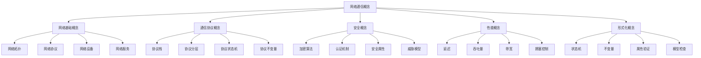
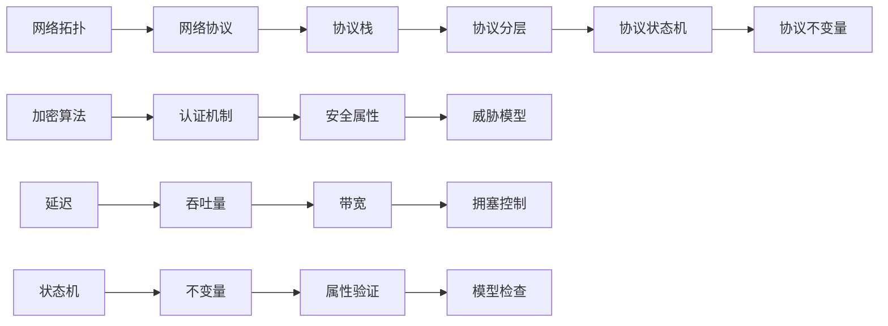
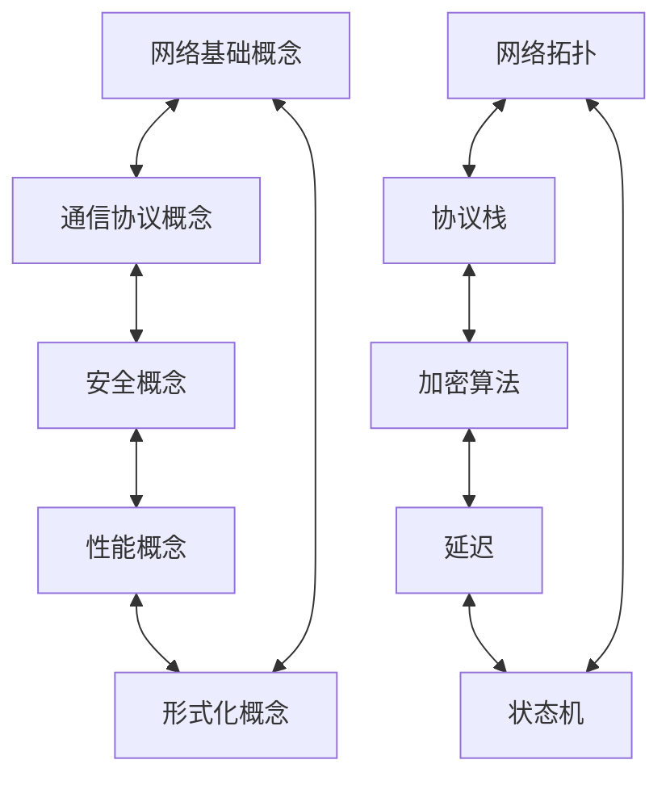
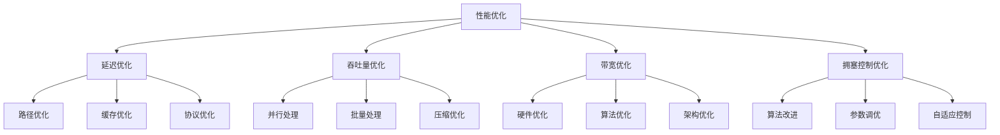

# C10 Networks 网络通信概念详解

> 适用范围：Rust 1.90+，Tokio 1.35+。文档风格遵循 [`DOCUMENTATION_STYLE_GUIDE.md`](DOCUMENTATION_STYLE_GUIDE.md)。


## 📊 目录

- [📋 目录](#目录)
- [🎯 概述](#概述)
  - [1. 概念分类体系](#1-概念分类体系)
  - [2. 理论基础](#2-理论基础)
  - [3. 应用场景](#3-应用场景)
- [🌐 网络基础概念](#网络基础概念)
  - [1. 网络拓扑](#1-网络拓扑)
    - [1.1 拓扑定义](#11-拓扑定义)
    - [1.2 拓扑类型](#12-拓扑类型)
    - [1.3 拓扑属性](#13-拓扑属性)
    - [1.4 拓扑优化](#14-拓扑优化)
  - [2. 网络协议](#2-网络协议)
    - [2.1 协议定义](#21-协议定义)
    - [2.2 协议分类](#22-协议分类)
    - [2.3 协议属性](#23-协议属性)
    - [2.4 协议验证](#24-协议验证)
- [📡 通信协议概念](#通信协议概念)
  - [1. 协议栈](#1-协议栈)
    - [1.1 协议栈定义](#11-协议栈定义)
    - [1.2 协议栈模型](#12-协议栈模型)
    - [1.3 协议栈实现](#13-协议栈实现)
    - [1.4 协议栈优化](#14-协议栈优化)
  - [2. 协议分层](#2-协议分层)
    - [2.1 分层原理](#21-分层原理)
    - [2.2 分层设计](#22-分层设计)
    - [2.3 分层验证](#23-分层验证)
    - [2.4 分层优化](#24-分层优化)
- [🔒 安全概念](#安全概念)
  - [1. 加密算法](#1-加密算法)
    - [1.1 算法分类](#11-算法分类)
    - [1.2 算法属性](#12-算法属性)
    - [1.3 算法实现](#13-算法实现)
    - [1.4 算法优化](#14-算法优化)
  - [2. 认证机制](#2-认证机制)
    - [2.1 认证类型](#21-认证类型)
    - [2.2 认证流程](#22-认证流程)
    - [2.3 认证安全](#23-认证安全)
    - [2.4 认证优化](#24-认证优化)
- [⚡ 性能概念](#性能概念)
  - [1. 延迟](#1-延迟)
    - [1.1 延迟定义](#11-延迟定义)
    - [1.2 延迟组成](#12-延迟组成)
    - [1.3 延迟测量](#13-延迟测量)
    - [1.4 延迟优化](#14-延迟优化)
  - [2. 吞吐量](#2-吞吐量)
    - [2.1 吞吐量定义](#21-吞吐量定义)
    - [2.2 吞吐量计算](#22-吞吐量计算)
    - [2.3 吞吐量测量](#23-吞吐量测量)
    - [2.4 吞吐量优化](#24-吞吐量优化)
- [🧮 形式化概念](#形式化概念)
  - [1. 状态机](#1-状态机)
    - [1.1 状态机定义](#11-状态机定义)
    - [1.2 状态机类型](#12-状态机类型)
    - [1.3 状态机验证](#13-状态机验证)
    - [1.4 状态机优化](#14-状态机优化)
  - [2. 不变量](#2-不变量)
    - [2.1 不变量定义](#21-不变量定义)
    - [2.2 不变量类型](#22-不变量类型)
    - [2.3 不变量验证](#23-不变量验证)
    - [2.4 不变量维护](#24-不变量维护)
- [📊 概念关系图](#概念关系图)
  - [1. 层次关系](#1-层次关系)
  - [2. 依赖关系](#2-依赖关系)
  - [3. 交互关系](#3-交互关系)
  - [4. 优化关系](#4-优化关系)
- [🔗 相关文档](#相关文档)


## 📋 目录

- [C10 Networks 网络通信概念详解](#c10-networks-网络通信概念详解)
  - [📋 目录](#-目录)
  - [🎯 概述](#-概述)
    - [1. 概念分类体系](#1-概念分类体系)
    - [2. 理论基础](#2-理论基础)
    - [3. 应用场景](#3-应用场景)
  - [🌐 网络基础概念](#-网络基础概念)
    - [1. 网络拓扑](#1-网络拓扑)
      - [1.1 拓扑定义](#11-拓扑定义)
      - [1.2 拓扑类型](#12-拓扑类型)
      - [1.3 拓扑属性](#13-拓扑属性)
      - [1.4 拓扑优化](#14-拓扑优化)
    - [2. 网络协议](#2-网络协议)
      - [2.1 协议定义](#21-协议定义)
      - [2.2 协议分类](#22-协议分类)
      - [2.3 协议属性](#23-协议属性)
      - [2.4 协议验证](#24-协议验证)
  - [📡 通信协议概念](#-通信协议概念)
    - [1. 协议栈](#1-协议栈)
      - [1.1 协议栈定义](#11-协议栈定义)
      - [1.2 协议栈模型](#12-协议栈模型)
      - [1.3 协议栈实现](#13-协议栈实现)
      - [1.4 协议栈优化](#14-协议栈优化)
    - [2. 协议分层](#2-协议分层)
      - [2.1 分层原理](#21-分层原理)
      - [2.2 分层设计](#22-分层设计)
      - [2.3 分层验证](#23-分层验证)
      - [2.4 分层优化](#24-分层优化)
  - [🔒 安全概念](#-安全概念)
    - [1. 加密算法](#1-加密算法)
      - [1.1 算法分类](#11-算法分类)
      - [1.2 算法属性](#12-算法属性)
      - [1.3 算法实现](#13-算法实现)
      - [1.4 算法优化](#14-算法优化)
    - [2. 认证机制](#2-认证机制)
      - [2.1 认证类型](#21-认证类型)
      - [2.2 认证流程](#22-认证流程)
      - [2.3 认证安全](#23-认证安全)
      - [2.4 认证优化](#24-认证优化)
  - [⚡ 性能概念](#-性能概念)
    - [1. 延迟](#1-延迟)
      - [1.1 延迟定义](#11-延迟定义)
      - [1.2 延迟组成](#12-延迟组成)
      - [1.3 延迟测量](#13-延迟测量)
      - [1.4 延迟优化](#14-延迟优化)
    - [2. 吞吐量](#2-吞吐量)
      - [2.1 吞吐量定义](#21-吞吐量定义)
      - [2.2 吞吐量计算](#22-吞吐量计算)
      - [2.3 吞吐量测量](#23-吞吐量测量)
      - [2.4 吞吐量优化](#24-吞吐量优化)
  - [🧮 形式化概念](#-形式化概念)
    - [1. 状态机](#1-状态机)
      - [1.1 状态机定义](#11-状态机定义)
      - [1.2 状态机类型](#12-状态机类型)
      - [1.3 状态机验证](#13-状态机验证)
      - [1.4 状态机优化](#14-状态机优化)
    - [2. 不变量](#2-不变量)
      - [2.1 不变量定义](#21-不变量定义)
      - [2.2 不变量类型](#22-不变量类型)
      - [2.3 不变量验证](#23-不变量验证)
      - [2.4 不变量维护](#24-不变量维护)
  - [📊 概念关系图](#-概念关系图)
    - [1. 层次关系](#1-层次关系)
    - [2. 依赖关系](#2-依赖关系)
    - [3. 交互关系](#3-交互关系)
    - [4. 优化关系](#4-优化关系)
  - [🔗 相关文档](#-相关文档)

## 🎯 概述

本文档详细定义了C10 Networks项目中涉及的所有网络通信概念，包括概念的定义、属性、关系、验证方法和优化策略。这些概念构成了网络编程的理论基础，为理解和实现网络协议提供了清晰的框架。

### 1. 概念分类体系

网络通信概念按照以下体系进行分类：



### 2. 理论基础

网络通信概念基于以下理论基础：

1. **信息论**: 信道容量、编码理论、数据传输
2. **排队论**: 网络延迟、吞吐量分析、拥塞控制
3. **图论**: 网络拓扑、路由算法、连通性分析
4. **概率论**: 随机过程、可靠性分析、故障模型
5. **形式化方法**: 协议验证、状态机、时序逻辑

### 3. 应用场景

| 概念类别 | 应用场景 | 具体实现 |
|---------|---------|---------|
| 网络基础概念 | 网络设计、拓扑规划 | 路由器配置、交换机管理 |
| 通信协议概念 | 协议实现、协议验证 | TCP/IP栈、HTTP客户端 |
| 安全概念 | 安全通信、身份认证 | TLS/SSL、JWT认证 |
| 性能概念 | 性能优化、容量规划 | 负载均衡、缓存策略 |
| 形式化概念 | 协议验证、系统验证 | 模型检查、定理证明 |

## 🌐 网络基础概念

### 1. 网络拓扑

#### 1.1 拓扑定义

网络拓扑是指网络中节点（设备）和链路（连接）的物理或逻辑布局结构。

**形式化定义**：
设网络为 $N = (V, E)$，其中：

- $V$: 节点集合，$V = \{v_1, v_2, ..., v_n\}$
- $E$: 边集合，$E = \{(v_i, v_j) | v_i, v_j \in V\}$

**拓扑属性**：

- **连通性**: $\forall v_i, v_j \in V: \exists \text{path}(v_i, v_j)$
- **完整性**: $|E| \leq \frac{|V|(|V|-1)}{2}$
- **对称性**: $(v_i, v_j) \in E \Leftrightarrow (v_j, v_i) \in E$

#### 1.2 拓扑类型

1. **星型拓扑**
   - 定义: 所有节点连接到中心节点
   - 数学表示: $E = \{(v_0, v_i) | i = 1, 2, ..., n-1\}$
   - 优点: 简单、易于管理
   - 缺点: 中心节点单点故障
   - 应用: 以太网交换机

2. **总线拓扑**
   - 定义: 所有节点共享同一条通信线路
   - 数学表示: $E = \{(v_i, v_{i+1}) | i = 0, 1, ..., n-2\}$
   - 优点: 成本低、简单
   - 缺点: 冲突、难以扩展
   - 应用: 早期以太网

3. **环型拓扑**
   - 定义: 节点按环形连接
   - 数学表示: $E = \{(v_i, v_{(i+1)\bmod n}) | i = 0, 1, ..., n-1\}$
   - 优点: 无冲突、确定性
   - 缺点: 单点故障影响整个网络
   - 应用: 令牌环网络

4. **网状拓扑**
   - 定义: 节点间有多个连接路径
   - 数学表示: $E = \{(v_i, v_j) | i \neq j, \text{probability}(v_i, v_j) > 0\}$
   - 优点: 高可靠性、冗余
   - 缺点: 成本高、复杂
   - 应用: 互联网骨干网

#### 1.3 拓扑属性

**度分布**：
$$P(k) = \frac{\text{节点度为k的节点数}}{\text{总节点数}}$$

**聚类系数**：
$$C = \frac{\text{实际三角形数}}{\text{可能三角形数}}$$

**平均路径长度**：
$$L = \frac{1}{n(n-1)} \sum_{i \neq j} d(v_i, v_j)$$

**网络效率**：
$$E = \frac{1}{n(n-1)} \sum_{i \neq j} \frac{1}{d(v_i, v_j)}$$

#### 1.4 拓扑优化

**优化目标**：
$$\min \sum_{e \in E} c(e) \cdot x(e)$$

**约束条件**：

- 连通性约束: $\sum_{e \in E} x(e) \geq n-1$
- 容量约束: $\sum_{e \in E} f(e) \leq c(e) \cdot x(e)$
- 流量平衡: $\sum_{e \in E} f(e) = \sum_{e \in E} f(e)$

### 2. 网络协议

#### 2.1 协议定义

网络协议是网络中设备间通信的规则和约定，定义了数据格式、传输方式、错误处理等。

**形式化定义**：
协议 $\mathcal{P} = (\mathcal{S}, \mathcal{E}, \mathcal{A}, \delta, \lambda, s_0, \mathcal{F})$，其中：

- $\mathcal{S}$: 状态集合
- $\mathcal{E}$: 事件集合
- $\mathcal{A}$: 动作集合
- $\delta: \mathcal{S} \times \mathcal{E} \rightarrow \mathcal{S}$: 状态转换函数
- $\lambda: \mathcal{S} \times \mathcal{E} \rightarrow \mathcal{A}$: 输出函数
- $s_0 \in \mathcal{S}$: 初始状态
- $\mathcal{F} \subseteq \mathcal{S}$: 接受状态集合

#### 2.2 协议分类

1. **按层次分类**
   - **物理层**: 比特传输
   - **数据链路层**: 帧传输
   - **网络层**: 数据包路由
   - **传输层**: 端到端通信
   - **应用层**: 用户服务

2. **按功能分类**
   - **路由协议**: 路径选择
   - **传输协议**: 数据传输
   - **应用协议**: 用户服务
   - **管理协议**: 网络管理

3. **按可靠性分类**
   - **可靠协议**: 保证数据完整性和顺序
   - **不可靠协议**: 不保证数据完整性

#### 2.3 协议属性

**安全性属性**：
$$\text{Safety}(\mathcal{P}) = \forall \pi \in \text{exec}(\mathcal{P}): \forall i \geq 0: \text{safe}(s_i)$$

**活性属性**：
$$\text{Liveness}(\mathcal{P}) = \forall \pi \in \text{exec}(\mathcal{P}): \exists i \geq 0: \text{live}(s_i)$$

**公平性属性**：
$$\text{Fairness}(\mathcal{P}) = \forall \pi \in \text{exec}(\mathcal{P}): \forall e \in \mathcal{E}: \text{enabled}(e) \Rightarrow \text{eventually}(e)$$

**终止性属性**：
$$\text{Termination}(\mathcal{P}) = \forall \pi \in \text{exec}(\mathcal{P}): \exists i \geq 0: s_i \in \mathcal{F}$$

#### 2.4 协议验证

**模型检查**：
$$\mathcal{M} \models \phi$$

**定理证明**：
$$\vdash \phi$$

**符号执行**：
$$\text{SymbolicExecution}(P) = \{(path, condition, state)\}$$

## 📡 通信协议概念

### 1. 协议栈

#### 1.1 协议栈定义

协议栈是一组分层协议，每层协议为上层提供服务，同时使用下层协议的服务。

**形式化定义**：
设协议栈为 $S = \{L_1, L_2, ..., L_n\}$，其中 $L_i$ 表示第 $i$ 层。

**层间接口函数**：
$$f_{i,i+1}: L_i \rightarrow L_{i+1}$$

**协议处理函数**：
$$P_i: L_i \times Data \rightarrow L_i \times Data$$

#### 1.2 协议栈模型

1. **OSI 七层模型**

   ```text
   应用层     (Application Layer)
   表示层     (Presentation Layer)
   会话层     (Session Layer)
   传输层     (Transport Layer)
   网络层     (Network Layer)
   数据链路层 (Data Link Layer)
   物理层     (Physical Layer)
   ```

2. **TCP/IP 四层模型**

   ```text
   应用层     (Application Layer)
   传输层     (Transport Layer)
   网络层     (Internet Layer)
   网络接口层 (Network Interface Layer)
   ```

#### 1.3 协议栈实现

```rust
// 协议栈形式化定义
pub struct ProtocolStack {
    layers: Vec<Box<dyn ProtocolLayer>>,
    interfaces: Vec<LayerInterface>,
}

impl ProtocolStack {
    pub fn process_packet(&mut self, packet: &mut Packet) -> Result<(), ProtocolError> {
        // 自底向上处理数据包
        for layer in &mut self.layers {
            layer.process(packet)?;
        }
        Ok(())
    }
    
    pub fn encapsulate_data(&self, data: &[u8], protocol: ProtocolType) -> Result<Packet, ProtocolError> {
        // 数据封装过程
        let mut packet = Packet::new(data);
        for layer in &self.layers {
            packet = layer.encapsulate(packet)?;
        }
        Ok(packet)
    }
}
```

#### 1.4 协议栈优化

**优化策略**：

1. **零拷贝**: 减少内存拷贝开销
2. **批处理**: 批量处理数据包
3. **缓存优化**: 智能缓存策略
4. **并行处理**: 多线程处理

### 2. 协议分层

#### 2.1 分层原理

协议分层是将网络功能按层次组织，每层负责特定的功能，层间通过接口交互。

**分层优势**：

1. **模块化**: 每层独立实现和测试
2. **抽象**: 隐藏底层实现细节
3. **复用**: 上层协议可以复用下层服务
4. **标准化**: 接口标准化，便于互操作

#### 2.2 分层设计

**设计原则**：

1. **单一职责原则**: 每层只负责特定的功能
2. **接口隔离原则**: 层间接口最小化
3. **依赖倒置原则**: 上层依赖下层抽象
4. **开闭原则**: 对扩展开放，对修改封闭

**分层数学模型**：
设协议栈为 $L = \{L_1, L_2, \ldots, L_n\}$，其中 $L_i$ 表示第 $i$ 层。

**分层处理函数**：
$$\phi_i: L_i \times D_i \rightarrow L_i \times D_{i+1}$$

**层间接口函数**：
$$f_{i,i+1}: L_i \rightarrow L_{i+1}$$

#### 2.3 分层验证

**分层正确性**：
$$\forall i \in [1, n]: \text{correct}(L_i) \Rightarrow \text{correct}(L)$$

**分层一致性**：
$$\forall i \in [1, n-1]: \text{consistent}(L_i, L_{i+1})$$

**分层完整性**：
$$\forall i \in [1, n]: \text{complete}(L_i) \Rightarrow \text{complete}(L)$$

#### 2.4 分层优化

**优化方法**：

1. **接口优化**: 减少层间调用开销
2. **数据优化**: 优化数据传递方式
3. **缓存优化**: 层间数据缓存
4. **并行优化**: 层间并行处理

## 🔒 安全概念

### 1. 加密算法

#### 1.1 算法分类

**对称加密**：
$$E_k(m) = c, \quad D_k(c) = m$$

**非对称加密**：
$$E_{pk}(m) = c, \quad D_{sk}(c) = m$$

**哈希函数**：
$$H: \{0,1\}^* \rightarrow \{0,1\}^n$$

#### 1.2 算法属性

**安全性**：
$$\text{Security} = \min(\text{Key\_Length}, \text{Hash\_Length}, \text{Block\_Size})$$

**性能**：
$$\text{Performance} = \frac{\text{Throughput}}{\text{Latency}}$$

**可靠性**：
$$\text{Reliability} = 1 - \text{Error\_Rate}$$

#### 1.3 算法实现

```rust
// 加密算法接口
pub trait EncryptionAlgorithm {
    type Key;
    type Ciphertext;
    type Plaintext;
    
    fn encrypt(&self, key: &Self::Key, plaintext: &Self::Plaintext) -> Self::Ciphertext;
    fn decrypt(&self, key: &Self::Key, ciphertext: &Self::Ciphertext) -> Self::Plaintext;
}

// AES加密实现
pub struct AesEncryption {
    key: [u8; 32],
}

impl EncryptionAlgorithm for AesEncryption {
    type Key = [u8; 32];
    type Ciphertext = Vec<u8>;
    type Plaintext = Vec<u8>;
    
    fn encrypt(&self, key: &Self::Key, plaintext: &Self::Plaintext) -> Self::Ciphertext {
        // AES加密实现
        aes_encrypt(key, plaintext)
    }
    
    fn decrypt(&self, key: &Self::Key, ciphertext: &Self::Ciphertext) -> Self::Plaintext {
        // AES解密实现
        aes_decrypt(key, ciphertext)
    }
}
```

#### 1.4 算法优化

**优化策略**：

1. **硬件加速**: 使用专用硬件
2. **并行处理**: 多线程加密
3. **缓存优化**: 密钥缓存
4. **算法优化**: 优化算法实现

### 2. 认证机制

#### 2.1 认证类型

1. **单向认证**
   $$\text{Authenticate}(A, B) = \text{Verify}(A, B)$$

2. **双向认证**
   $$\text{MutualAuthenticate}(A, B) = \text{Verify}(A, B) \land \text{Verify}(B, A)$$

3. **第三方认证**
   $$\text{ThirdPartyAuth}(A, B, T) = \text{Verify}(T, A) \land \text{Verify}(T, B)$$

#### 2.2 认证流程

**认证协议**：

1. $A \rightarrow B: \text{Challenge}$
2. $B \rightarrow A: \text{Response}$
3. $A \rightarrow B: \text{Verify}(\text{Response})$

**认证属性**：

- **新鲜性**: $\forall m \in Messages: \text{fresh}(m) \Rightarrow \neg \text{replay}(m)$
- **完整性**: $\forall m \in Messages: \text{modified}(m) \Rightarrow \text{detected}(m)$
- **机密性**: $\forall m \in Messages: \text{sensitive}(m) \Rightarrow \text{encrypted}(m)$

#### 2.3 认证安全

**安全定义**：
$$\text{Secure}(\mathcal{P}) = \forall \mathcal{A}: \text{Adv}_{\mathcal{A}}^{\mathcal{P}} \leq \text{negl}(\lambda)$$

**攻击模型**：

- **被动攻击**: 窃听通信
- **主动攻击**: 修改、重放消息
- **中间人攻击**: 拦截并修改通信

#### 2.4 认证优化

**优化方法**：

1. **缓存优化**: 认证结果缓存
2. **批量认证**: 批量处理认证请求
3. **异步认证**: 异步处理认证
4. **硬件加速**: 使用硬件安全模块

## ⚡ 性能概念

### 1. 延迟

#### 1.1 延迟定义

延迟是数据从源端传输到目标端所需的时间，是网络性能的重要指标。

**延迟组成**：
$$T_{total} = T_{processing} + T_{queueing} + T_{transmission} + T_{propagation}$$

#### 1.2 延迟组成

**处理延迟**：
$$T_{processing} = \frac{L_{packet}}{R_{processing}}$$

**排队延迟**：
$$T_{queueing} = \frac{L_{queue}}{R_{service}}$$

**传输延迟**：
$$T_{transmission} = \frac{L_{packet}}{R_{link}}$$

**传播延迟**：
$$T_{propagation} = \frac{d}{c}$$

#### 1.3 延迟测量

**测量方法**：

1. **主动测量**: 发送测试数据包
2. **被动测量**: 监控实际流量
3. **混合测量**: 结合主动和被动方法

**测量指标**：

- **瞬时延迟**: $T(t) = \frac{\Delta Time}{\Delta Packets}$
- **平均延迟**: $\bar{T} = \frac{1}{n} \sum_{i=1}^{n} T_i$
- **延迟方差**: $\text{Var}[T] = E[T^2] - (E[T])^2$

#### 1.4 延迟优化

**优化策略**：

1. **路径优化**: 选择最短路径
2. **缓存优化**: 减少重复传输
3. **协议优化**: 减少协议开销
4. **硬件优化**: 使用高速硬件

### 2. 吞吐量

#### 2.1 吞吐量定义

吞吐量是单位时间内成功传输的数据量，是网络性能的重要指标。

**吞吐量定义**：
$$Throughput = \frac{Successful\_Packets}{Time}$$

**有效吞吐量**：
$$Throughput_{effective} = \frac{Data\_Bits}{Time} \times (1 - Error\_Rate)$$

#### 2.2 吞吐量计算

**TCP吞吐量模型**：
$$Throughput_{TCP} = \frac{MSS \times C}{RTT \times \sqrt{p}}$$

**UDP吞吐量模型**：
$$Throughput_{UDP} = \frac{Data\_Rate}{1 + Error\_Rate}$$

**HTTP吞吐量模型**：
$$Throughput_{HTTP} = \frac{Concurrent\_Connections \times Throughput_{TCP}}{Connection\_Overhead}$$

#### 2.3 吞吐量测量

**测量方法**：

1. **带宽测试**: 测量最大吞吐量
2. **负载测试**: 测量不同负载下的吞吐量
3. **压力测试**: 测量极限吞吐量

#### 2.4 吞吐量优化

**优化策略**：

1. **并行处理**: 增加并行连接数
2. **批量处理**: 批量传输数据
3. **压缩优化**: 数据压缩传输
4. **缓存优化**: 智能缓存策略

## 🧮 形式化概念

### 1. 状态机

#### 1.1 状态机定义

状态机是描述系统行为的形式化模型，由状态、事件、转移和动作组成。

**形式化定义**：
$$\mathcal{M} = (S, S_0, R, L)$$

其中：

- $S$: 状态集合
- $S_0 \subseteq S$: 初始状态集合
- $R \subseteq S \times S$: 转移关系
- $L: S \rightarrow 2^{AP}$: 标签函数

#### 1.2 状态机类型

1. **有限状态机 (FSM)**
   - 定义: 状态和事件都是有限的
   - 应用: 协议状态机
   - 验证: 可达性分析

2. **下推状态机 (PDA)**
   - 定义: 带有栈的状态机
   - 应用: 语法分析
   - 验证: 上下文无关语言

3. **图灵机 (TM)**
   - 定义: 带有无限带的状态机
   - 应用: 计算理论
   - 验证: 可计算性

#### 1.3 状态机验证

**验证方法**：

1. **模型检查**: 自动验证属性
2. **定理证明**: 数学证明属性
3. **符号执行**: 符号化执行验证

**验证属性**：

- **安全性**: $\Box \phi$ (总是满足属性 $\phi$)
- **活性**: $\diamond \phi$ (最终满足属性 $\phi$)
- **公平性**: $\Box \diamond \phi$ (无限次满足属性 $\phi$)

#### 1.4 状态机优化

**优化策略**：

1. **状态压缩**: 减少状态数量
2. **转移优化**: 优化状态转移
3. **并行处理**: 并行状态机
4. **缓存优化**: 状态缓存

### 2. 不变量

#### 2.1 不变量定义

不变量是系统在任何状态下都必须满足的性质，用于保证系统的正确性。

**形式化定义**：
$$\text{Invariant}(I) = \forall s \in S: I(s) \land \forall s, s' \in S: (s, s') \in R \Rightarrow I(s')$$

#### 2.2 不变量类型

1. **安全性不变量**
   - 定义: 保证系统不会进入错误状态
   - 示例: 死锁避免
   - 验证: 模型检查

2. **活性不变量**
   - 定义: 保证系统最终会达到期望状态
   - 示例: 最终一致性
   - 验证: 时序逻辑

3. **公平性不变量**
   - 定义: 保证系统公平处理请求
   - 示例: 饥饿避免
   - 验证: 公平性检查

#### 2.3 不变量验证

**验证方法**：

1. **归纳法**: 数学归纳证明
2. **模型检查**: 自动验证
3. **定理证明**: 形式化证明

**验证流程**：

1. **识别不变量**: 分析系统性质
2. **形式化描述**: 用逻辑公式描述
3. **验证证明**: 证明不变量成立
4. **维护更新**: 系统变更时更新

#### 2.4 不变量维护

**维护策略**：

1. **自动检测**: 运行时检测违反
2. **静态分析**: 编译时分析
3. **形式化验证**: 数学证明
4. **测试验证**: 测试用例验证

## 📊 概念关系图

### 1. 层次关系


### 2. 依赖关系



### 3. 交互关系



### 4. 优化关系



## 🔗 相关文档

- [网络通信理论](NETWORK_COMMUNICATION_THEORY.md) - 网络通信的理论基础
- [数学基础](MATHEMATICAL_FOUNDATIONS.md) - 网络编程的数学基础
- [协议实现指南](PROTOCOL_IMPLEMENTATION_GUIDE.md) - 协议实现的具体指导
- [形式化协议规范](FORMAL_PROTOCOL_SPECIFICATIONS.md) - 协议的形式化规范
- [示例指南](EXAMPLES_GUIDE.md) - 示例代码的详细解释
- [API文档](API_DOCUMENTATION.md) - API接口的详细说明

---

**C10 Networks 网络通信概念详解** - 为网络编程提供清晰的概念框架！

*最后更新: 2025年1月*  
*文档版本: v1.0*  
*维护者: C10 Networks 开发团队*
