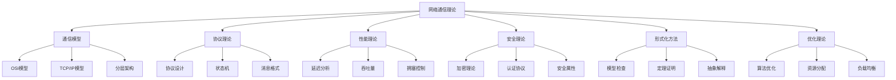
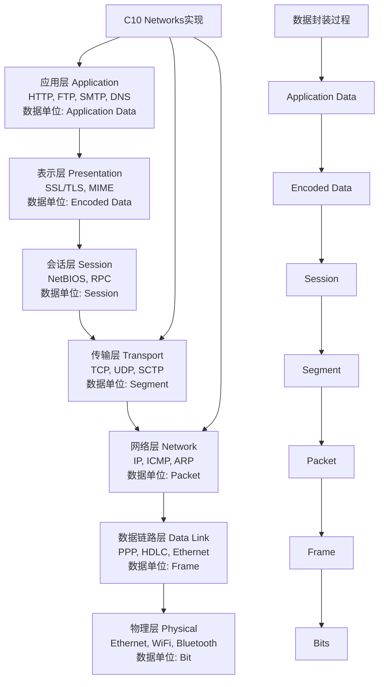

# C10 Networks 网络通信理论

> 适用范围：Rust 1.90+，Tokio 1.35+。文档风格遵循 [`DOCUMENTATION_STYLE_GUIDE.md`](DOCUMENTATION_STYLE_GUIDE.md)。


## 📊 目录

- [📋 目录](#目录)
- [🎯 概述](#概述)
  - [📚 理论基础](#理论基础)
  - [🔬 理论框架](#理论框架)
  - [📊 理论应用映射](#理论应用映射)
- [🔬 通信模型](#通信模型)
  - [1. OSI七层模型](#1-osi七层模型)
    - [各层功能与C10 Networks对应](#各层功能与c10-networks对应)
  - [2. TCP/IP协议栈](#2-tcpip协议栈)
  - [3. 协议分层原理](#3-协议分层原理)
    - [分层优势](#分层优势)
    - [分层数学模型](#分层数学模型)
    - [分层设计原则](#分层设计原则)
    - [分层验证](#分层验证)
- [📊 协议理论](#协议理论)
  - [1. 协议设计原则](#1-协议设计原则)
    - [1.1 协议定义](#11-协议定义)
    - [1.2 协议属性](#12-协议属性)
    - [1.3 协议验证](#13-协议验证)
    - [1.4 协议正确性](#14-协议正确性)
  - [2. TCP协议理论](#2-tcp协议理论)
    - [2.1 TCP状态机](#21-tcp状态机)
    - [2.2 TCP不变量](#22-tcp不变量)
    - [2.3 TCP拥塞控制](#23-tcp拥塞控制)
    - [2.4 TCP可靠性](#24-tcp可靠性)
  - [3. HTTP协议理论](#3-http协议理论)
    - [3.1 HTTP状态机](#31-http状态机)
    - [3.2 HTTP协议不变量](#32-http协议不变量)
    - [3.3 HTTP/2协议理论](#33-http2协议理论)
    - [3.4 WebSocket协议理论](#34-websocket协议理论)
- [⚡ 性能理论](#性能理论)
  - [1. 排队论基础](#1-排队论基础)
    - [1.1 M/M/1 队列模型](#11-mm1-队列模型)
    - [1.2 性能指标](#12-性能指标)
    - [1.3 稳定性条件](#13-稳定性条件)
    - [1.4 M/M/c 队列模型](#14-mmc-队列模型)
    - [1.5 网络排队模型](#15-网络排队模型)
  - [2. 网络延迟分析](#2-网络延迟分析)
    - [2.1 延迟组成](#21-延迟组成)
    - [2.2 延迟模型](#22-延迟模型)
    - [2.3 端到端延迟](#23-端到端延迟)
    - [2.4 延迟分布](#24-延迟分布)
    - [2.5 延迟优化](#25-延迟优化)
  - [3. 吞吐量理论](#3-吞吐量理论)
    - [3.1 吞吐量定义](#31-吞吐量定义)
    - [3.2 吞吐量模型](#32-吞吐量模型)
    - [3.3 吞吐量优化](#33-吞吐量优化)
    - [3.4 吞吐量界限](#34-吞吐量界限)
    - [3.5 吞吐量测量](#35-吞吐量测量)
- [🔒 安全理论](#安全理论)
  - [1. 密码学基础](#1-密码学基础)
    - [1.1 加密算法分类](#11-加密算法分类)
    - [1.2 安全属性](#12-安全属性)
    - [1.3 密码学原语](#13-密码学原语)
    - [1.4 安全强度](#14-安全强度)
  - [2. 认证协议理论](#2-认证协议理论)
    - [2.1 认证协议分类](#21-认证协议分类)
    - [2.2 认证协议属性](#22-认证协议属性)
    - [2.3 认证协议模型](#23-认证协议模型)
    - [2.4 认证协议安全性](#24-认证协议安全性)
  - [3. 安全属性验证](#3-安全属性验证)
    - [3.1 形式化安全属性](#31-形式化安全属性)
    - [3.2 安全验证方法](#32-安全验证方法)
    - [3.3 安全验证工具](#33-安全验证工具)
    - [3.4 安全验证流程](#34-安全验证流程)
- [🧮 形式化方法](#形式化方法)
  - [1. 模型检查](#1-模型检查)
    - [1.1 模型检查原理](#11-模型检查原理)
    - [1.2 模型检查算法](#12-模型检查算法)
    - [1.3 模型检查工具](#13-模型检查工具)
  - [2. 定理证明](#2-定理证明)
    - [2.1 定理证明原理](#21-定理证明原理)
    - [2.2 定理证明工具](#22-定理证明工具)
    - [2.3 定理证明应用](#23-定理证明应用)
  - [3. 抽象解释](#3-抽象解释)
    - [3.1 抽象解释原理](#31-抽象解释原理)
    - [3.2 抽象域](#32-抽象域)
    - [3.3 抽象解释应用](#33-抽象解释应用)
    - [3.4 抽象解释工具](#34-抽象解释工具)
- [📈 优化理论](#优化理论)
  - [1. 算法优化](#1-算法优化)
    - [1.1 复杂度分析](#11-复杂度分析)
    - [1.2 优化策略](#12-优化策略)
  - [2. 资源分配](#2-资源分配)
    - [2.1 资源分配问题](#21-资源分配问题)
    - [2.2 优化算法](#22-优化算法)
  - [3. 负载均衡](#3-负载均衡)
    - [3.1 负载均衡策略](#31-负载均衡策略)
    - [3.2 负载均衡算法](#32-负载均衡算法)
- [📚 参考文献](#参考文献)
  - [1. 技术标准](#1-技术标准)
  - [2. 学术论文](#2-学术论文)
  - [3. 技术书籍](#3-技术书籍)
  - [4. 在线资源](#4-在线资源)


## 📋 目录

- [C10 Networks 网络通信理论](#c10-networks-网络通信理论)
  - [📋 目录](#-目录)
  - [🎯 概述](#-概述)
    - [📚 理论基础](#-理论基础)
    - [🔬 理论框架](#-理论框架)
    - [📊 理论应用映射](#-理论应用映射)
  - [🔬 通信模型](#-通信模型)
    - [1. OSI七层模型](#1-osi七层模型)
      - [各层功能与C10 Networks对应](#各层功能与c10-networks对应)
    - [2. TCP/IP协议栈](#2-tcpip协议栈)
    - [3. 协议分层原理](#3-协议分层原理)
      - [分层优势](#分层优势)
      - [分层数学模型](#分层数学模型)
      - [分层设计原则](#分层设计原则)
      - [分层验证](#分层验证)
  - [📊 协议理论](#-协议理论)
    - [1. 协议设计原则](#1-协议设计原则)
      - [1.1 协议定义](#11-协议定义)
      - [1.2 协议属性](#12-协议属性)
      - [1.3 协议验证](#13-协议验证)
      - [1.4 协议正确性](#14-协议正确性)
    - [2. TCP协议理论](#2-tcp协议理论)
      - [2.1 TCP状态机](#21-tcp状态机)
      - [2.2 TCP不变量](#22-tcp不变量)
      - [2.3 TCP拥塞控制](#23-tcp拥塞控制)
      - [2.4 TCP可靠性](#24-tcp可靠性)
    - [3. HTTP协议理论](#3-http协议理论)
      - [3.1 HTTP状态机](#31-http状态机)
      - [3.2 HTTP协议不变量](#32-http协议不变量)
      - [3.3 HTTP/2协议理论](#33-http2协议理论)
      - [3.4 WebSocket协议理论](#34-websocket协议理论)
  - [⚡ 性能理论](#-性能理论)
    - [1. 排队论基础](#1-排队论基础)
      - [1.1 M/M/1 队列模型](#11-mm1-队列模型)
      - [1.2 性能指标](#12-性能指标)
      - [1.3 稳定性条件](#13-稳定性条件)
      - [1.4 M/M/c 队列模型](#14-mmc-队列模型)
      - [1.5 网络排队模型](#15-网络排队模型)
    - [2. 网络延迟分析](#2-网络延迟分析)
      - [2.1 延迟组成](#21-延迟组成)
      - [2.2 延迟模型](#22-延迟模型)
      - [2.3 端到端延迟](#23-端到端延迟)
      - [2.4 延迟分布](#24-延迟分布)
      - [2.5 延迟优化](#25-延迟优化)
    - [3. 吞吐量理论](#3-吞吐量理论)
      - [3.1 吞吐量定义](#31-吞吐量定义)
      - [3.2 吞吐量模型](#32-吞吐量模型)
      - [3.3 吞吐量优化](#33-吞吐量优化)
      - [3.4 吞吐量界限](#34-吞吐量界限)
      - [3.5 吞吐量测量](#35-吞吐量测量)
  - [🔒 安全理论](#-安全理论)
    - [1. 密码学基础](#1-密码学基础)
      - [1.1 加密算法分类](#11-加密算法分类)
      - [1.2 安全属性](#12-安全属性)
      - [1.3 密码学原语](#13-密码学原语)
      - [1.4 安全强度](#14-安全强度)
    - [2. 认证协议理论](#2-认证协议理论)
      - [2.1 认证协议分类](#21-认证协议分类)
      - [2.2 认证协议属性](#22-认证协议属性)
      - [2.3 认证协议模型](#23-认证协议模型)
      - [2.4 认证协议安全性](#24-认证协议安全性)
    - [3. 安全属性验证](#3-安全属性验证)
      - [3.1 形式化安全属性](#31-形式化安全属性)
      - [3.2 安全验证方法](#32-安全验证方法)
      - [3.3 安全验证工具](#33-安全验证工具)
      - [3.4 安全验证流程](#34-安全验证流程)
  - [🧮 形式化方法](#-形式化方法)
    - [1. 模型检查](#1-模型检查)
      - [1.1 模型检查原理](#11-模型检查原理)
      - [1.2 模型检查算法](#12-模型检查算法)
      - [1.3 模型检查工具](#13-模型检查工具)
    - [2. 定理证明](#2-定理证明)
      - [2.1 定理证明原理](#21-定理证明原理)
      - [2.2 定理证明工具](#22-定理证明工具)
      - [2.3 定理证明应用](#23-定理证明应用)
    - [3. 抽象解释](#3-抽象解释)
      - [3.1 抽象解释原理](#31-抽象解释原理)
      - [3.2 抽象域](#32-抽象域)
      - [3.3 抽象解释应用](#33-抽象解释应用)
      - [3.4 抽象解释工具](#34-抽象解释工具)
  - [📈 优化理论](#-优化理论)
    - [1. 算法优化](#1-算法优化)
      - [1.1 复杂度分析](#11-复杂度分析)
      - [1.2 优化策略](#12-优化策略)
    - [2. 资源分配](#2-资源分配)
      - [2.1 资源分配问题](#21-资源分配问题)
      - [2.2 优化算法](#22-优化算法)
    - [3. 负载均衡](#3-负载均衡)
      - [3.1 负载均衡策略](#31-负载均衡策略)
      - [3.2 负载均衡算法](#32-负载均衡算法)
  - [📚 参考文献](#-参考文献)
    - [1. 技术标准](#1-技术标准)
    - [2. 学术论文](#2-学术论文)
    - [3. 技术书籍](#3-技术书籍)
    - [4. 在线资源](#4-在线资源)

## 🎯 概述

本文档提供了C10 Networks项目的网络通信理论基础，涵盖通信模型、协议理论、性能分析、安全保证、形式化方法和优化理论等核心概念。这些理论为网络编程的实现提供了坚实的数学和工程基础。

### 📚 理论基础

网络通信理论基于以下数学和计算机科学理论：

1. **信息论**: 信道容量、编码理论、数据传输
2. **排队论**: 网络延迟、吞吐量分析、拥塞控制
3. **图论**: 网络拓扑、路由算法、连通性分析
4. **概率论**: 随机过程、可靠性分析、故障模型
5. **形式化方法**: 协议验证、状态机、时序逻辑

### 🔬 理论框架

C10 Networks 基于以下理论框架：



### 📊 理论应用映射

| 理论领域 | 应用场景 | 具体实现 |
|---------|---------|---------|
| 信息论 | 数据压缩、编码 | 霍夫曼编码、LZ77 |
| 排队论 | 网络延迟、拥塞 | M/M/1队列、RED算法 |
| 图论 | 路由、拓扑 | Dijkstra算法、最小生成树 |
| 概率论 | 可靠性、故障 | 马尔可夫链、泊松过程 |
| 形式化方法 | 协议验证 | TLA+、Coq、模型检查 |

## 🔬 通信模型

### 1. OSI七层模型

OSI（Open Systems Interconnection）七层模型是网络通信的标准化框架，提供了网络通信的抽象层次结构：

**形式化定义**：

设网络系统为 $N = (L_1, L_2, ..., L_7)$，其中 $L_i$ 表示第 $i$ 层：

$$N = \bigcup_{i=1}^{7} L_i$$

层间接口函数：
$$f_{i,i+1}: L_i \rightarrow L_{i+1}$$

协议处理函数：
$$P_i: L_i \times Data \rightarrow L_i \times Data$$

**各层功能形式化描述**：

1. **物理层 (Physical Layer)**：
   - 功能：$P_1: Bits \rightarrow ElectricalSignals$
   - 协议：Ethernet, WiFi, Bluetooth
   - 数据单位：Bit
   - 理论依据：信号处理理论、电磁学

2. **数据链路层 (Data Link Layer)**：
   - 功能：$P_2: Bits \rightarrow Frames$
   - 协议：PPP, HDLC, Ethernet MAC
   - 数据单位：Frame
   - 理论依据：错误检测码理论、帧同步理论

3. **网络层 (Network Layer)**：
   - 功能：$P_3: Frames \rightarrow Packets$
   - 协议：IP, ICMP, ARP
   - 数据单位：Packet
   - 理论依据：图论、路由算法、寻址理论

4. **传输层 (Transport Layer)**：
   - 功能：$P_4: Packets \rightarrow Segments$
   - 协议：TCP, UDP, SCTP
   - 数据单位：Segment
   - 理论依据：可靠性理论、拥塞控制理论

5. **会话层 (Session Layer)**：
   - 功能：$P_5: Segments \rightarrow Sessions$
   - 协议：NetBIOS, RPC
   - 数据单位：Session
   - 理论依据：状态机理论、会话管理理论

6. **表示层 (Presentation Layer)**：
   - 功能：$P_6: Sessions \rightarrow EncodedData$
   - 协议：SSL/TLS, MIME
   - 数据单位：Encoded Data
   - 理论依据：密码学理论、数据压缩理论

7. **应用层 (Application Layer)**：
   - 功能：$P_7: EncodedData \rightarrow ApplicationData$
   - 协议：HTTP, FTP, SMTP, DNS
   - 数据单位：Application Data
   - 理论依据：RESTful API理论、应用协议理论



#### 各层功能与C10 Networks对应

| OSI层 | 功能 | C10 Networks组件 | 理论依据 | 形式化定义 |
|-------|------|------------------|----------|------------|
| 应用层 | 用户接口、网络服务 | HTTP/WebSocket/gRPC | RESTful API理论 | $P_7: EncodedData \rightarrow ApplicationData$ |
| 表示层 | 数据格式转换、加密 | TLS/序列化 | 密码学理论 | $P_6: Sessions \rightarrow EncodedData$ |
| 会话层 | 会话管理、同步 | 连接管理 | 状态机理论 | $P_5: Segments \rightarrow Sessions$ |
| 传输层 | 端到端通信、可靠性 | TCP/UDP实现 | 可靠性理论 | $P_4: Packets \rightarrow Segments$ |
| 网络层 | 路由、寻址 | IP处理 | 图论、路由算法 | $P_3: Frames \rightarrow Packets$ |
| 数据链路层 | 帧传输、错误检测 | 以太网处理 | 错误检测码理论 | $P_2: Bits \rightarrow Frames$ |
| 物理层 | 信号传输 | 底层I/O | 信号处理理论 | $P_1: Bits \rightarrow ElectricalSignals$ |

### 2. TCP/IP协议栈

TCP/IP协议栈是互联网的核心协议，采用四层架构：

**形式化定义**：

设TCP/IP协议栈为 $S = (L_{app}, L_{trans}, L_{net}, L_{link})$：

$$S = \{L_{app}, L_{trans}, L_{net}, L_{link}\}$$

协议栈处理函数：
$$\Phi: S \times Data \rightarrow S \times Data$$

**各层协议形式化描述**：

1. **应用层 (Application Layer)**：
   - 协议集合：$\mathcal{P}_{app} = \{HTTP, FTP, SMTP, DNS, SSH, Telnet\}$
   - 功能：$f_{app}: ApplicationData \rightarrow NetworkData$
   - 端口映射：$port: \mathcal{P}_{app} \rightarrow \mathbb{N}$
   - 理论依据：RESTful API理论、应用协议理论

2. **传输层 (Transport Layer)**：
   - 协议集合：$\mathcal{P}_{trans} = \{TCP, UDP, SCTP\}$
   - TCP功能：$f_{tcp}: Data \rightarrow ReliableSegments$
   - UDP功能：$f_{udp}: Data \rightarrow UnreliableDatagrams$
   - 理论依据：可靠性理论、拥塞控制理论

3. **网络层 (Network Layer)**：
   - 协议集合：$\mathcal{P}_{net} = \{IPv4, IPv6, ICMP, ARP\}$
   - IP功能：$f_{ip}: Segments \rightarrow Packets$
   - 路由功能：$route: Packet \times RoutingTable \rightarrow NextHop$
   - 理论依据：图论、路由算法、寻址理论

4. **数据链路层 (Data Link Layer)**：
   - 协议集合：$\mathcal{P}_{link} = \{Ethernet, WiFi, PPP\}$
   - 功能：$f_{link}: Packets \rightarrow Frames$
   - 理论依据：错误检测码理论、帧同步理论

**协议栈处理流程**：

数据封装过程：
$$encapsulate: Data \rightarrow Frame$$

1. 应用层：$data \rightarrow application\_data$
2. 传输层：$application\_data \rightarrow segment$
3. 网络层：$segment \rightarrow packet$
4. 数据链路层：$packet \rightarrow frame$

数据解封装过程：
$$decapsulate: Frame \rightarrow Data$$

1. 数据链路层：$frame \rightarrow packet$
2. 网络层：$packet \rightarrow segment$
3. 传输层：$segment \rightarrow application\_data$
4. 应用层：$application\_data \rightarrow data$

```rust
// TCP/IP协议栈形式化定义
pub struct TcpIpStack {
    // 应用层协议
    application_protocols: HashMap<String, Box<dyn ApplicationProtocol>>,
    // 传输层协议
    transport_protocols: HashMap<String, Box<dyn TransportProtocol>>,
    // 网络层协议
    network_protocols: HashMap<String, Box<dyn NetworkProtocol>>,
    // 数据链路层协议
    data_link_protocols: HashMap<String, Box<dyn DataLinkProtocol>>,
}

// 协议栈处理函数
impl TcpIpStack {
    /// 协议栈处理函数 Φ: S × Data → S × Data
    pub fn process_packet(&mut self, packet: &mut Packet) -> Result<(), ProtocolError> {
        // 自底向上处理数据包
        self.data_link_protocols
            .get_mut(&packet.data_link_type)
            .ok_or(ProtocolError::UnsupportedProtocol)?
            .process(packet)?;
            
        self.network_protocols
            .get_mut(&packet.network_type)
            .ok_or(ProtocolError::UnsupportedProtocol)?
            .process(packet)?;
            
        self.transport_protocols
            .get_mut(&packet.transport_type)
            .ok_or(ProtocolError::UnsupportedProtocol)?
            .process(packet)?;
            
        self.application_protocols
            .get_mut(&packet.application_type)
            .ok_or(ProtocolError::UnsupportedProtocol)?
            .process(packet)?;
            
        Ok(())
    }
    
    /// 数据封装过程
    pub fn encapsulate_data(&self, data: &[u8], protocol: ProtocolType) -> Result<Packet, ProtocolError> {
        match protocol {
            ProtocolType::TCP => {
                let segment = self.transport_protocols
                    .get("TCP")
                    .ok_or(ProtocolError::UnsupportedProtocol)?
                    .create_segment(data)?;
                let packet = self.network_protocols
                    .get("IP")
                    .ok_or(ProtocolError::UnsupportedProtocol)?
                    .create_packet(segment)?;
                let frame = self.data_link_protocols
                    .get("Ethernet")
                    .ok_or(ProtocolError::UnsupportedProtocol)?
                    .create_frame(packet)?;
                Ok(frame)
            }
            ProtocolType::UDP => {
                let datagram = self.transport_protocols
                    .get("UDP")
                    .ok_or(ProtocolError::UnsupportedProtocol)?
                    .create_datagram(data)?;
                let packet = self.network_protocols
                    .get("IP")
                    .ok_or(ProtocolError::UnsupportedProtocol)?
                    .create_packet(datagram)?;
                let frame = self.data_link_protocols
                    .get("Ethernet")
                    .ok_or(ProtocolError::UnsupportedProtocol)?
                    .create_frame(packet)?;
                Ok(frame)
            }
            _ => Err(ProtocolError::UnsupportedProtocol)
        }
    }
    
    /// 数据解封装过程
    pub fn decapsulate_data(&self, frame: &Frame) -> Result<Vec<u8>, ProtocolError> {
        let packet = self.data_link_protocols
            .get(&frame.protocol_type)
            .ok_or(ProtocolError::UnsupportedProtocol)?
            .extract_packet(frame)?;
            
        let segment = self.network_protocols
            .get(&packet.protocol_type)
            .ok_or(ProtocolError::UnsupportedProtocol)?
            .extract_segment(packet)?;
            
        let data = self.transport_protocols
            .get(&segment.protocol_type)
            .ok_or(ProtocolError::UnsupportedProtocol)?
            .extract_data(segment)?;
            
        Ok(data)
    }
}
```

### 3. 协议分层原理

#### 分层优势

1. **模块化**: 每层独立实现和测试
2. **抽象**: 隐藏底层实现细节
3. **复用**: 上层协议可以复用下层服务
4. **标准化**: 接口标准化，便于互操作
5. **可维护性**: 层间接口清晰，便于维护和升级
6. **可扩展性**: 新协议可以在相应层添加

#### 分层数学模型

设协议栈为 $L = \{L_1, L_2, \ldots, L_n\}$，其中 $L_i$ 表示第 $i$ 层。

**分层处理函数**：
$$\phi_i: L_i \times D_i \rightarrow L_i \times D_{i+1}$$

其中 $D_i$ 表示第 $i$ 层的数据格式。

**层间接口函数**：
$$f_{i,i+1}: L_i \rightarrow L_{i+1}$$

**协议栈完整性**：
$$\forall i \in [1, n-1]: \exists f_{i,i+1} \text{ 使得 } f_{i,i+1}(L_i) \subseteq L_{i+1}$$

**分层不变量**：
$$\forall i \in [1, n]: \forall d \in D_i: \phi_i(d) \in D_{i+1}$$

**分层安全性**：
$$\forall i \in [1, n]: \forall d \in D_i: \text{valid}(d) \Rightarrow \text{valid}(\phi_i(d))$$

**分层活性**：
$$\forall i \in [1, n]: \forall d \in D_i: \exists d' \in D_{i+1}: \phi_i(d) = d'$$

#### 分层设计原则

1. **单一职责原则**: 每层只负责特定的功能
2. **接口隔离原则**: 层间接口最小化
3. **依赖倒置原则**: 上层依赖下层抽象
4. **开闭原则**: 对扩展开放，对修改封闭

#### 分层验证

**分层正确性**：
$$\forall i \in [1, n]: \text{correct}(L_i) \Rightarrow \text{correct}(L)$$

**分层一致性**：
$$\forall i \in [1, n-1]: \text{consistent}(L_i, L_{i+1})$$

**分层完整性**：
$$\forall i \in [1, n]: \text{complete}(L_i) \Rightarrow \text{complete}(L)$$

## 📊 协议理论

### 1. 协议设计原则

#### 1.1 协议定义

协议可以形式化定义为：
$$\mathcal{P} = (\mathcal{S}, \mathcal{E}, \mathcal{A}, \delta, \lambda, s_0, \mathcal{F})$$

其中：

- $\mathcal{S}$: 状态集合
- $\mathcal{E}$: 事件集合
- $\mathcal{A}$: 动作集合
- $\delta: \mathcal{S} \times \mathcal{E} \rightarrow \mathcal{S}$: 状态转换函数
- $\lambda: \mathcal{S} \times \mathcal{E} \rightarrow \mathcal{A}$: 输出函数
- $s_0 \in \mathcal{S}$: 初始状态
- $\mathcal{F} \subseteq \mathcal{S}$: 接受状态集合

**协议执行**：
$$\text{exec}(\mathcal{P}) = s_0 \xrightarrow{e_1} s_1 \xrightarrow{e_2} s_2 \xrightarrow{e_3} \cdots$$

其中 $s_i \in \mathcal{S}$，$e_i \in \mathcal{E}$，且 $\delta(s_{i-1}, e_i) = s_i$。

#### 1.2 协议属性

**安全性属性**：
$$\text{Safety}(\mathcal{P}) = \forall \pi \in \text{exec}(\mathcal{P}): \forall i \geq 0: \text{safe}(s_i)$$

**活性属性**：
$$\text{Liveness}(\mathcal{P}) = \forall \pi \in \text{exec}(\mathcal{P}): \exists i \geq 0: \text{live}(s_i)$$

**公平性属性**：
$$\text{Fairness}(\mathcal{P}) = \forall \pi \in \text{exec}(\mathcal{P}): \forall e \in \mathcal{E}: \text{enabled}(e) \Rightarrow \text{eventually}(e)$$

**终止性属性**：
$$\text{Termination}(\mathcal{P}) = \forall \pi \in \text{exec}(\mathcal{P}): \exists i \geq 0: s_i \in \mathcal{F}$$

#### 1.3 协议验证

使用时序逻辑描述协议属性：

**线性时序逻辑 (LTL)**：

- **安全性**: $\Box \phi$ (总是满足属性 $\phi$)
- **活性**: $\diamond \phi$ (最终满足属性 $\phi$)
- **公平性**: $\Box \diamond \phi$ (无限次满足属性 $\phi$)
- **响应性**: $\Box(\phi \Rightarrow \diamond \psi)$ (总是 $\phi$ 导致最终 $\psi$)

**计算树逻辑 (CTL)**：

- **存在性**: $\exists \Box \phi$ (存在路径总是满足 $\phi$)
- **全局性**: $\forall \Box \phi$ (所有路径总是满足 $\phi$)
- **可能性**: $\exists \diamond \phi$ (存在路径最终满足 $\phi$)
- **必然性**: $\forall \diamond \phi$ (所有路径最终满足 $\phi$)

#### 1.4 协议正确性

**协议正确性**：
$$\text{Correct}(\mathcal{P}) = \text{Safety}(\mathcal{P}) \land \text{Liveness}(\mathcal{P}) \land \text{Fairness}(\mathcal{P})$$

**协议完备性**：
$$\text{Complete}(\mathcal{P}) = \forall s \in \mathcal{S}: \forall e \in \mathcal{E}: \text{enabled}(s, e) \Rightarrow \delta(s, e) \text{ 定义}$$

**协议一致性**：
$$\text{Consistent}(\mathcal{P}) = \forall s \in \mathcal{S}: \forall e \in \mathcal{E}: \delta(s, e) \in \mathcal{S}$$

### 2. TCP协议理论

#### 2.1 TCP状态机

TCP连接的状态机可以定义为：

$$\mathcal{M}_{TCP} = (\mathcal{S}_{TCP}, \mathcal{E}_{TCP}, \delta_{TCP}, \lambda_{TCP}, s_0, \mathcal{F}_{TCP})$$

其中：

- $\mathcal{S}_{TCP} = \{CLOSED, LISTEN, SYN\_SENT, SYN\_RECEIVED, ESTABLISHED, FIN\_WAIT\_1, FIN\_WAIT\_2, CLOSE\_WAIT, LAST\_ACK, CLOSING, TIME\_WAIT\}$
- $\mathcal{E}_{TCP} = \{SYN, SYN+ACK, ACK, FIN, FIN+ACK, RST, TIMEOUT, DATA\}$
- $\delta_{TCP}: \mathcal{S}_{TCP} \times \mathcal{E}_{TCP} \rightarrow \mathcal{S}_{TCP}$: 状态转换函数
- $\lambda_{TCP}: \mathcal{S}_{TCP} \times \mathcal{E}_{TCP} \rightarrow \mathcal{A}_{TCP}$: 输出函数
- $s_0 = CLOSED$: 初始状态
- $\mathcal{F}_{TCP} = \{CLOSED\}$: 接受状态集合

**TCP状态转换规则**：

1. **连接建立**：
   - $CLOSED \xrightarrow{SYN} SYN\_SENT$
   - $LISTEN \xrightarrow{SYN} SYN\_RECEIVED$
   - $SYN\_SENT \xrightarrow{SYN+ACK} ESTABLISHED$

2. **连接终止**：
   - $ESTABLISHED \xrightarrow{FIN} FIN\_WAIT\_1$
   - $FIN\_WAIT\_1 \xrightarrow{ACK} FIN\_WAIT\_2$
   - $FIN\_WAIT\_2 \xrightarrow{FIN} TIME\_WAIT$

3. **异常处理**：
   - $\forall s \in \mathcal{S}_{TCP}: s \xrightarrow{RST} CLOSED$

#### 2.2 TCP不变量

**序列号单调性**：
$$\forall c \in Connections: \forall m_1, m_2 \in c.messages: m_1.seq\_num < m_2.seq\_num \Rightarrow m_1.ack\_num \leq m_2.ack\_num$$

**窗口大小有效性**：
$$\forall c \in Connections: c.window\_size > 0 \land c.window\_size \leq 65535$$

**状态一致性**：
$$\forall c \in Connections: c.state = ESTABLISHED \Rightarrow c.seq\_num > 0 \land c.ack\_num > 0$$

**连接唯一性**：
$$\forall c_1, c_2 \in Connections: c_1 \neq c_2 \Rightarrow (c_1.local\_addr, c_1.local\_port, c_1.remote\_addr, c_1.remote\_port) \neq (c_2.local\_addr, c_2.local\_port, c_2.remote\_addr, c_2.remote\_port)$$

**数据完整性**：
$$\forall c \in Connections: \forall m \in c.messages: \text{checksum}(m) = \text{compute\_checksum}(m)$$

#### 2.3 TCP拥塞控制

**拥塞窗口**：
$$
cwnd(t+1) = \begin{cases}
cwnd(t) + 1 & \text{if } cwnd(t) < ssthresh \\
cwnd(t) + \frac{1}{cwnd(t)} & \text{if } cwnd(t) \geq ssthresh
\end{cases}
$$

**慢启动**：
$$cwnd(t+1) = cwnd(t) \times 2$$

**拥塞避免**：
$$cwnd(t+1) = cwnd(t) + \frac{1}{cwnd(t)}$$

**快速重传**：
$$cwnd(t+1) = \frac{cwnd(t)}{2}$$

#### 2.4 TCP可靠性

**数据确认**：
$$\forall m \in Messages: \text{sent}(m) \Rightarrow \text{eventually}(\text{ack}(m))$$

**重传机制**：
$$\forall m \in Messages: \text{timeout}(m) \Rightarrow \text{retransmit}(m)$$

**顺序保证**：
$$\forall m_1, m_2 \in Messages: \text{seq}(m_1) < \text{seq}(m_2) \Rightarrow \text{deliver}(m_1) \text{ before } \text{deliver}(m_2)$$

### 3. HTTP协议理论

#### 3.1 HTTP状态机

HTTP协议可以建模为状态机：

$$\mathcal{M}_{HTTP} = (\mathcal{S}_{HTTP}, \mathcal{E}_{HTTP}, \delta_{HTTP}, \lambda_{HTTP}, s_0, \mathcal{F}_{HTTP})$$

其中：

- $\mathcal{S}_{HTTP} = \{\text{IDLE}, \text{REQUEST\_SENT}, \text{RESPONSE\_RECEIVED}, \text{CLOSED}, \text{ERROR}\}$
- $\mathcal{E}_{HTTP} = \{\text{send\_request}, \text{receive\_response}, \text{timeout}, \text{error}, \text{close}\}$
- $\delta_{HTTP}: \mathcal{S}_{HTTP} \times \mathcal{E}_{HTTP} \rightarrow \mathcal{S}_{HTTP}$: 状态转换函数
- $\lambda_{HTTP}: \mathcal{S}_{HTTP} \times \mathcal{E}_{HTTP} \rightarrow \mathcal{A}_{HTTP}$: 输出函数
- $s_0 = \text{IDLE}$: 初始状态
- $\mathcal{F}_{HTTP} = \{\text{CLOSED}\}$: 接受状态集合

**HTTP状态转换规则**：

1. **请求发送**：
   - $\text{IDLE} \xrightarrow{\text{send\_request}} \text{REQUEST\_SENT}$

2. **响应接收**：
   - $\text{REQUEST\_SENT} \xrightarrow{\text{receive\_response}} \text{RESPONSE\_RECEIVED}$

3. **连接关闭**：
   - $\forall s \in \mathcal{S}_{HTTP}: s \xrightarrow{\text{close}} \text{CLOSED}$

4. **错误处理**：
   - $\forall s \in \mathcal{S}_{HTTP}: s \xrightarrow{\text{error}} \text{ERROR}$

#### 3.2 HTTP协议不变量

**请求-响应对应性**：
$$\forall r \in \text{Requests}: \exists s \in \text{Responses}: r.id = s.id$$

**状态转换有效性**：
$$\forall s \in \mathcal{S}_{HTTP}: \delta_{HTTP}(s, e) \neq \emptyset \Rightarrow e \in \text{valid\_events}(s)$$

**头部字段完整性**：
$$\forall h \in \text{Headers}: h.name \neq \emptyset \land h.value \neq \emptyset$$

**HTTP版本一致性**：
$$\forall r \in \text{Requests}: \forall s \in \text{Responses}: r.version = s.version$$

**方法有效性**：
$$\forall r \in \text{Requests}: r.method \in \{\text{GET}, \text{POST}, \text{PUT}, \text{DELETE}, \text{HEAD}, \text{OPTIONS}\}$$

**状态码有效性**：
$$\forall s \in \text{Responses}: s.status\_code \in [100, 599]$$

#### 3.3 HTTP/2协议理论

**多路复用**：
$$\forall c \in \text{Connections}: \forall s \in \text{Streams}: s.connection\_id = c.id$$

**流控制**：
$$\forall s \in \text{Streams}: s.window\_size \geq 0 \land s.window\_size \leq 2^{31} - 1$$

**头部压缩**：
$$\forall h \in \text{Headers}: \text{compressed\_size}(h) \leq \text{original\_size}(h)$$

#### 3.4 WebSocket协议理论

**握手协议**：
$$\text{WebSocket\_Handshake} = \text{HTTP\_Request} \rightarrow \text{HTTP\_Response}$$

**帧格式**：
$$\text{WebSocket\_Frame} = (\text{fin}, \text{rsv}, \text{opcode}, \text{mask}, \text{payload\_length}, \text{payload\_data})$$

**连接状态**：
$$\mathcal{S}_{WebSocket} = \{\text{CONNECTING}, \text{OPEN}, \text{CLOSING}, \text{CLOSED}\}$$

**消息传递**：
$$\forall m \in \text{Messages}: \text{sent}(m) \Rightarrow \text{eventually}(\text{received}(m))$$

## ⚡ 性能理论

### 1. 排队论基础

#### 1.1 M/M/1 队列模型

M/M/1 队列是最简单的排队模型：

**模型定义**：

- **到达过程**: 泊松过程，参数 $\lambda$ (packets/second)
- **服务过程**: 指数分布，参数 $\mu$ (packets/second)
- **服务台数**: 1
- **队列容量**: 无限

**状态概率**：
$$P_n = \rho^n (1 - \rho)$$

其中 $\rho = \frac{\lambda}{\mu}$ 是系统利用率。

#### 1.2 性能指标

**平均等待时间**：
$$W = \frac{1}{\mu - \lambda} = \frac{\rho}{\mu(1 - \rho)}$$

**平均队列长度**：
$$L = \frac{\lambda}{\mu - \lambda} = \frac{\rho}{1 - \rho}$$

**系统利用率**：
$$\rho = \frac{\lambda}{\mu}$$

**平均响应时间**：
$$T = W + \frac{1}{\mu} = \frac{1}{\mu - \lambda}$$

**吞吐量**：
$$X = \lambda$$

#### 1.3 稳定性条件

系统稳定的条件是：
$$\rho = \frac{\lambda}{\mu} < 1$$

**稳定性证明**：
$$\lim_{n \to \infty} P_n = \lim_{n \to \infty} \rho^n (1 - \rho) = 0$$

当 $\rho < 1$ 时，系统达到稳态。

#### 1.4 M/M/c 队列模型

**模型定义**：

- **到达过程**: 泊松过程，参数 $\lambda$
- **服务过程**: 指数分布，参数 $\mu$
- **服务台数**: $c$

**状态概率**：
$$
P_n = \begin{cases}
\frac{(\lambda/\mu)^n}{n!} P_0 & \text{if } n \leq c \\
\frac{(\lambda/\mu)^n}{c! c^{n-c}} P_0 & \text{if } n > c
\end{cases}
$$

其中：
$$P_0 = \left[\sum_{n=0}^{c-1} \frac{(\lambda/\mu)^n}{n!} + \frac{(\lambda/\mu)^c}{c!(1-\rho)}\right]^{-1}$$

**性能指标**：

- **平均等待时间**: $W = \frac{P_c}{c\mu(1-\rho)}$
- **平均队列长度**: $L = \frac{P_c \rho}{1-\rho}$
- **系统利用率**: $\rho = \frac{\lambda}{c\mu}$

#### 1.5 网络排队模型

**多级排队网络**：
$$\mathcal{N} = (N_1, N_2, ..., N_k)$$

其中 $N_i$ 是第 $i$ 个队列节点。

**流量平衡方程**：
$$\lambda_i = \lambda_{0i} + \sum_{j=1}^k \lambda_j p_{ji}$$

其中：

- $\lambda_i$: 节点 $i$ 的总到达率
- $\lambda_{0i}$: 外部到达率
- $p_{ji}$: 从节点 $j$ 到节点 $i$ 的路由概率

**Jackson网络**：
如果所有节点都是M/M/1队列，且路由概率独立，则网络达到稳态。

### 2. 网络延迟分析

#### 2.1 延迟组成

网络延迟由以下部分组成：

$$T_{total} = T_{processing} + T_{queueing} + T_{transmission} + T_{propagation}$$

其中：

- $T_{processing}$: 处理延迟
- $T_{queueing}$: 排队延迟
- $T_{transmission}$: 传输延迟
- $T_{propagation}$: 传播延迟

#### 2.2 延迟模型

**处理延迟**：
$$T_{processing} = \frac{L_{packet}}{R_{processing}}$$

其中：

- $L_{packet}$: 数据包长度 (bits)
- $R_{processing}$: 处理速率 (bits/second)

**排队延迟**：
$$T_{queueing} = \frac{L_{queue}}{R_{service}}$$

其中：

- $L_{queue}$: 队列长度 (packets)
- $R_{service}$: 服务速率 (packets/second)

**传输延迟**：
$$T_{transmission} = \frac{L_{packet}}{R_{link}}$$

其中：

- $L_{packet}$: 数据包长度 (bits)
- $R_{link}$: 链路速率 (bits/second)

**传播延迟**：
$$T_{propagation} = \frac{d}{c}$$

其中：

- $d$: 距离 (meters)
- $c$: 光速 (meters/second)

#### 2.3 端到端延迟

**端到端延迟**：
$$T_{e2e} = \sum_{i=1}^n T_{node,i} + \sum_{i=1}^{n-1} T_{link,i}$$

其中：

- $T_{node,i}$: 第 $i$ 个节点的延迟
- $T_{link,i}$: 第 $i$ 条链路的延迟

**延迟界限**：
$$T_{e2e} \leq T_{max} = \sum_{i=1}^n T_{node,max,i} + \sum_{i=1}^{n-1} T_{link,max,i}$$

#### 2.4 延迟分布

**延迟分布**：
$$F_T(t) = P(T \leq t)$$

**平均延迟**：
$$E[T] = \int_0^{\infty} t f_T(t) dt$$

**延迟方差**：
$$\text{Var}[T] = E[T^2] - (E[T])^2$$

**延迟百分位数**：
$$P(T \leq t_{p}) = p$$

其中 $t_p$ 是第 $p$ 百分位数。

#### 2.5 延迟优化

**延迟优化目标**：
$$\min T_{e2e} = \min \left(\sum_{i=1}^n T_{node,i} + \sum_{i=1}^{n-1} T_{link,i}\right)$$

**约束条件**：

- 带宽约束：$R_{link,i} \leq R_{max,i}$
- 处理能力约束：$R_{processing,i} \leq R_{max,processing,i}$
- 队列长度约束：$L_{queue,i} \leq L_{max,i}$

**优化算法**：

1. **最短路径算法**: Dijkstra算法
2. **负载均衡**: 分散流量到多个路径
3. **缓存优化**: 减少重复传输
4. **协议优化**: 减少协议开销

### 3. 吞吐量理论

#### 3.1 吞吐量定义

**吞吐量定义**：
$$Throughput = \frac{Successful\_Packets}{Time}$$

**有效吞吐量**：
$$Throughput_{effective} = \frac{Data\_Bits}{Time} \times (1 - Error\_Rate)$$

**理论最大吞吐量**：
$$Throughput_{max} = \min(Bandwidth, \frac{Window\_Size}{RTT})$$

其中：

- $Bandwidth$: 链路带宽
- $Window\_Size$: 拥塞窗口大小
- $RTT$: 往返时间

#### 3.2 吞吐量模型

**TCP吞吐量模型**：
$$Throughput_{TCP} = \frac{MSS \times C}{RTT \times \sqrt{p}}$$

其中：

- $MSS$: 最大段大小
- $C$: 常数 (通常为 1.22)
- $RTT$: 往返时间
- $p$: 丢包率

**UDP吞吐量模型**：
$$Throughput_{UDP} = \frac{Data\_Rate}{1 + Error\_Rate}$$

**HTTP吞吐量模型**：
$$Throughput_{HTTP} = \frac{Concurrent\_Connections \times Throughput_{TCP}}{Connection\_Overhead}$$

#### 3.3 吞吐量优化

**并行处理**：
$$Throughput_{parallel} = n \times Throughput_{single}$$

其中 $n$ 是并行连接数。

**批量处理**：
$$Throughput_{batch} = \frac{Batch\_Size}{Processing\_Time}$$

**缓存优化**：
$$Throughput_{cache} = \frac{Hit\_Rate \times Cache\_Speed + (1 - Hit\_Rate) \times Disk\_Speed}{1}$$

**协议优化**：
$$Throughput_{optimized} = \frac{Throughput_{original}}{1 + Protocol\_Overhead}$$

#### 3.4 吞吐量界限

**带宽界限**：
$$Throughput \leq Bandwidth$$

**延迟界限**：
$$Throughput \leq \frac{Window\_Size}{RTT}$$

**处理能力界限**：
$$Throughput \leq Processing\_Capacity$$

**存储界限**：
$$Throughput \leq \frac{Storage\_Capacity}{Access\_Time}$$

#### 3.5 吞吐量测量

**测量方法**：

1. **主动测量**: 发送测试数据包
2. **被动测量**: 监控实际流量
3. **混合测量**: 结合主动和被动方法

**测量指标**：

- **瞬时吞吐量**: $T(t) = \frac{\Delta Data}{\Delta t}$
- **平均吞吐量**: $\bar{T} = \frac{1}{T} \int_0^T T(t) dt$
- **峰值吞吐量**: $T_{peak} = \max_t T(t)$
- **最小吞吐量**: $T_{min} = \min_t T(t)$

**测量精度**：
$$\text{Accuracy} = 1 - \frac{|T_{measured} - T_{actual}|}{T_{actual}}$$

## 🔒 安全理论

### 1. 密码学基础

#### 1.1 加密算法分类

**对称加密**：
$$E_k(m) = c, \quad D_k(c) = m$$

其中 $k$ 是密钥，$m$ 是明文，$c$ 是密文。

**非对称加密**：
$$E_{pk}(m) = c, \quad D_{sk}(c) = m$$

其中 $pk$ 是公钥，$sk$ 是私钥。

**哈希函数**：
$$H: \{0,1\}^* \rightarrow \{0,1\}^n$$

其中 $n$ 是哈希长度。

#### 1.2 安全属性

**机密性**：
$$\forall m \in Messages: \text{authorized}(m) \Rightarrow \text{encrypted}(m)$$

**完整性**：
$$\forall m \in Messages: \text{modified}(m) \Rightarrow \text{detected}(m)$$

**可用性**：
$$\forall s \in Services: \text{available}(s) \Rightarrow \text{accessible}(s)$$

**认证**：
$$\forall u \in Users: \text{authenticated}(u) \Rightarrow \text{verified}(u)$$

**授权**：
$$\forall u \in Users: \forall r \in Resources: \text{authorized}(u, r) \Rightarrow \text{permitted}(u, r)$$

#### 1.3 密码学原语

**数字签名**：
$$Sign_{sk}(m) = \sigma, \quad Verify_{pk}(m, \sigma) = \text{true/false}$$

**消息认证码**：
$$MAC_k(m) = tag, \quad Verify_k(m, tag) = \text{true/false}$$

**密钥交换**：
$$KeyExchange(A, B) = (k_A, k_B)$$

其中 $k_A = k_B$ 是共享密钥。

#### 1.4 安全强度

**安全强度**：
$$Security\_Strength = \min(Key\_Length, Hash\_Length, Block\_Size)$$

**攻击复杂度**：
$$Attack\_Complexity = 2^{Security\_Strength}$$

**安全参数**：
$$\lambda \geq 128 \text{ bits}$$

### 2. 认证协议理论

#### 2.1 认证协议分类

**单向认证**：
$$\text{Authenticate}(A, B) = \text{Verify}(A, B)$$

**双向认证**：
$$\text{MutualAuthenticate}(A, B) = \text{Verify}(A, B) \land \text{Verify}(B, A)$$

**第三方认证**：
$$\text{ThirdPartyAuth}(A, B, T) = \text{Verify}(T, A) \land \text{Verify}(T, B)$$

#### 2.2 认证协议属性

**新鲜性**：
$$\forall m \in Messages: \text{fresh}(m) \Rightarrow \neg \text{replay}(m)$$

**完整性**：
$$\forall m \in Messages: \text{modified}(m) \Rightarrow \text{detected}(m)$$

**机密性**：
$$\forall m \in Messages: \text{sensitive}(m) \Rightarrow \text{encrypted}(m)$$

**认证性**：
$$\forall u \in Users: \text{authenticated}(u) \Rightarrow \text{verified}(u)$$

#### 2.3 认证协议模型

**Needham-Schroeder协议**：

1. $A \rightarrow KDC: A, B, N_A$
2. $KDC \rightarrow A: \{K_{AB}, N_A, B, \{K_{AB}, A\}_{K_B}\}_{K_A}$
3. $A \rightarrow B: \{K_{AB}, A\}_{K_B}$
4. $B \rightarrow A: \{N_B\}_{K_{AB}}$
5. $A \rightarrow B: \{N_B - 1\}_{K_{AB}}$

**Kerberos协议**：

1. $A \rightarrow KDC: A, B, N_A$
2. $KDC \rightarrow A: \{K_{AB}, N_A, B, \{K_{AB}, A\}_{K_B}\}_{K_A}$
3. $A \rightarrow B: \{K_{AB}, A\}_{K_B}, \{N_A\}_{K_{AB}}$
4. $B \rightarrow A: \{N_A + 1\}_{K_{AB}}$

#### 2.4 认证协议安全性

**安全性定义**：
$$\text{Secure}(\mathcal{P}) = \forall \mathcal{A}: \text{Adv}_{\mathcal{A}}^{\mathcal{P}} \leq \text{negl}(\lambda)$$

**攻击模型**：

- **被动攻击**: 窃听通信
- **主动攻击**: 修改、重放消息
- **中间人攻击**: 拦截并修改通信

**安全目标**：

- **认证**: 验证身份
- **密钥建立**: 建立共享密钥
- **前向安全**: 过去通信的安全性

### 3. 安全属性验证

#### 3.1 形式化安全属性

**机密性**：
$$\Box \neg \text{leak}(secret)$$

**完整性**：
$$\Box (\text{modify}(data) \Rightarrow \text{authorized}(modifier))$$

**可用性**：
$$\Box \diamond \text{available}(service)$$

**认证性**：
$$\Box (\text{access}(resource) \Rightarrow \text{authenticated}(user))$$

**授权性**：
$$\Box (\text{access}(resource) \Rightarrow \text{authorized}(user, resource))$$

**不可否认性**：
$$\Box (\text{action}(user) \Rightarrow \text{non\_repudiable}(user))$$

#### 3.2 安全验证方法

**模型检查**：
$$\mathcal{M} \models \phi$$

其中 $\mathcal{M}$ 是系统模型，$\phi$ 是安全属性。

**定理证明**：
$$\vdash \phi$$

其中 $\phi$ 是安全性质。

**符号执行**：
$$\text{SymbolicExecution}(P) = \{(path, condition, state)\}$$

其中 $P$ 是程序。

#### 3.3 安全验证工具

**模型检查工具**：

- **TLA+**: 并发系统验证
- **Alloy**: 软件设计验证
- **SPIN**: 协议验证
- **NuSMV**: 符号模型验证

**定理证明工具**：

- **Coq**: 交互式定理证明
- **Lean**: 现代定理证明
- **Isabelle**: 通用定理证明
- **ACL2**: 计算逻辑

**符号执行工具**：

- **KLEE**: LLVM字节码符号执行
- **SAGE**: 二进制代码符号执行
- **DART**: 动态分析工具

#### 3.4 安全验证流程

**验证流程**：

1. **需求分析**: 识别安全需求
2. **模型构建**: 构建系统模型
3. **属性规约**: 形式化安全属性
4. **验证执行**: 运行验证工具
5. **结果分析**: 分析验证结果
6. **修复迭代**: 修复发现的问题

**验证覆盖**：
$$\text{Coverage} = \frac{\text{Verified\_Properties}}{\text{Total\_Properties}}$$

**验证置信度**：
$$\text{Confidence} = 1 - \frac{\text{False\_Positives}}{\text{Total\_Alerts}}$$

## 🧮 形式化方法

### 1. 模型检查

#### 1.1 模型检查原理

**模型检查问题**：
给定模型 $\mathcal{M}$ 和性质 $\phi$，验证 $\mathcal{M} \models \phi$

**模型定义**：
$$\mathcal{M} = (S, S_0, R, L)$$

其中：

- $S$: 状态集合
- $S_0 \subseteq S$: 初始状态集合
- $R \subseteq S \times S$: 转移关系
- $L: S \rightarrow 2^{AP}$: 标签函数

**性质规约**：
使用时序逻辑描述性质：

- **安全性**: $\Box \phi$ (总是满足 $\phi$)
- **活性**: $\diamond \phi$ (最终满足 $\phi$)
- **公平性**: $\Box \diamond \phi$ (无限次满足 $\phi$)

#### 1.2 模型检查算法

**显式状态搜索**：

```rust
fn explicit_state_search(model: &Model, property: &Property) -> VerificationResult {
    let mut visited = HashSet::new();
    let mut queue = VecDeque::new();
    let mut violations = Vec::new();

    queue.push_back(model.initial_state());
    visited.insert(model.initial_state());

    while let Some(state) = queue.pop_front() {
        if !property.check(&state) {
            violations.push(Violation {
                state: state.clone(),
                property: property.clone(),
            });
        }

        for next_state in model.successors(&state) {
            if !visited.contains(&next_state) {
                visited.insert(next_state.clone());
                queue.push_back(next_state);
            }
        }
    }

    VerificationResult {
        verified: violations.is_empty(),
        violations,
    }
}
```

**符号模型检查**：
使用BDD (Binary Decision Diagram) 表示状态集合：
$$\text{BDD}(f) = \text{ite}(x, \text{BDD}(f|_{x=1}), \text{BDD}(f|_{x=0}))$$

#### 1.3 模型检查工具

**TLA+**：

```tla
VARIABLES
    state,    // 连接状态
    seq_num,  // 序列号
    ack_num   // 确认号

INIT
    state = "CLOSED" /\ seq_num = 0 /\ ack_num = 0

NEXT
    \/ /\ state = "CLOSED"
       /\ state' = "SYN_SENT"
       /\ seq_num' = seq_num + 1
       /\ ack_num' = ack_num
    \/ /\ state = "SYN_SENT"
       /\ state' = "ESTABLISHED"
       /\ seq_num' = seq_num
       /\ ack_num' = ack_num + 1

INVARIANTS
    seq_num >= 0 /\ ack_num >= 0
    state \in {"CLOSED", "SYN_SENT", "ESTABLISHED"}
```

**Alloy**：

```alloy
sig Connection {
    state: State,
    seq_num: Int,
    ack_num: Int
}

sig State {}

fact {
    all c: Connection | c.seq_num >= 0 and c.ack_num >= 0
    all c: Connection | c.state in State
}

pred establish_connection[c: Connection] {
    c.state = CLOSED => c.state' = SYN_SENT
    c.seq_num' = c.seq_num + 1
    c.ack_num' = c.ack_num
}
```

**SPIN**：

```promela
mtype = {CLOSED, SYN_SENT, ESTABLISHED};

chan request = [1] of {mtype};

active proctype Client() {
    state = CLOSED;
    seq_num = 0;
    ack_num = 0;

    do
    :: state == CLOSED ->
        state = SYN_SENT;
        seq_num = seq_num + 1;
    :: state == SYN_SENT ->
        state = ESTABLISHED;
    od
}
```

### 2. 定理证明

#### 2.1 定理证明原理

**定理证明系统**：
$$\Gamma \vdash \phi$$

其中：

- $\Gamma$: 假设集合
- $\phi$: 要证明的命题
- $\vdash$: 推导关系

**证明规则**：

- **引入规则**: $\frac{\Gamma, \phi \vdash \psi}{\Gamma \vdash \phi \Rightarrow \psi}$
- **消除规则**: $\frac{\Gamma \vdash \phi \Rightarrow \psi \quad \Gamma \vdash \phi}{\Gamma \vdash \psi}$
- **全称引入**: $\frac{\Gamma \vdash \phi}{\Gamma \vdash \forall x. \phi}$ (x不在Γ中自由出现)
- **全称消除**: $\frac{\Gamma \vdash \forall x. \phi}{\Gamma \vdash \phi[t/x]}$

#### 2.2 定理证明工具

**Coq**：

```coq
(* Coq证明示例 *)
Theorem tcp_connection_establishment:
  forall (c: connection),
    c.state = CLOSED ->
    exists (c': connection),
      c'.state = ESTABLISHED /\
      c'.seq_num > c.seq_num /\
      c'.ack_num > c.ack_num.
Proof.
  intros c H.
  (* 证明过程 *)
  exists (establish_connection c).
  split.
  - apply connection_established.
  - apply seq_num_increased.
  - apply ack_num_increased.
Qed.
```

**Lean**：

```lean
-- Lean证明示例
theorem tcp_connection_establishment (c : connection) :
  c.state = CLOSED →
  ∃ c' : connection, c'.state = ESTABLISHED ∧
                     c'.seq_num > c.seq_num ∧
                     c'.ack_num > c.ack_num :=
begin
  intro h,
  use establish_connection c,
  split,
  { exact connection_established },
  { split,
    { exact seq_num_increased },
    { exact ack_num_increased } }
end
```

**Isabelle**：

```isabelle
(* Isabelle证明示例 *)
theorem tcp_connection_establishment:
  assumes "c.state = CLOSED"
  shows "∃c'. c'.state = ESTABLISHED ∧
               c'.seq_num > c.seq_num ∧
               c'.ack_num > c.ack_num"
proof -
  let ?c' = "establish_connection c"
  have "?c'.state = ESTABLISHED" by (rule connection_established)
  moreover have "?c'.seq_num > c.seq_num" by (rule seq_num_increased)
  moreover have "?c'.ack_num > c.ack_num" by (rule ack_num_increased)
  ultimately show ?thesis by blast
qed
```

#### 2.3 定理证明应用

**协议正确性证明**：

```coq
(* 协议不变量证明 *)
Theorem protocol_invariant:
  forall (s: state),
    invariant s ->
    forall (s': state),
      transition s s' ->
      invariant s'.
Proof.
  intros s H s' H0.
  (* 证明不变性保持 *)
  apply invariant_preserved.
  exact H.
  exact H0.
Qed.
```

**安全性证明**：

```coq
(* 安全性证明 *)
Theorem security_property:
  forall (trace: list event),
    valid_trace trace ->
    forall (e: event),
      In e trace ->
      safe e.
Proof.
  intros trace H e H0.
  (* 证明安全性 *)
  apply safety_lemma.
  exact H.
  exact H0.
Qed.
```

**活性证明**：

```coq
(* 活性证明 *)
Theorem liveness_property:
  forall (trace: list event),
    valid_trace trace ->
    eventually (fun e => goal e) trace.
Proof.
  intros trace H.
  (* 证明活性 *)
  apply liveness_lemma.
  exact H.
Qed.
```

### 3. 抽象解释

#### 3.1 抽象解释原理

**抽象解释框架**：
$$\mathcal{A} = (D, D^{\#}, \alpha, \gamma, F, F^{\#})$$

其中：

- $D$: 具体域
- $D^{\#}$: 抽象域
- $\alpha: D \rightarrow D^{\#}$: 抽象函数
- $\gamma: D^{\#} \rightarrow D$: 具体化函数
- $F: D \rightarrow D$: 具体语义函数
- $F^{\#}: D^{\#} \rightarrow D^{\#}$: 抽象语义函数

**Galois连接**：
$$\alpha \circ \gamma \sqsubseteq \text{id}_{D^{\#}} \quad \text{and} \quad \text{id}_D \sqsubseteq \gamma \circ \alpha$$

**最佳抽象**：
$$F^{\#} = \alpha \circ F \circ \gamma$$

#### 3.2 抽象域

**区间抽象域**：
$$D^{\#} = \{[a, b] | a \leq b, a, b \in \mathbb{Z} \cup \{-\infty, +\infty\}\}$$

**抽象操作**：

- **加法**: $[a_1, b_1] + [a_2, b_2] = [a_1 + a_2, b_1 + b_2]$
- **乘法**: $[a_1, b_1] \times [a_2, b_2] = [\min(a_1a_2, a_1b_2, b_1a_2, b_1b_2), \max(a_1a_2, a_1b_2, b_1a_2, b_1b_2)]$
- **比较**: $[a_1, b_1] \leq [a_2, b_2] \Leftrightarrow b_1 \leq a_2$

**符号抽象域**：
$$D^{\#} = \{x = c | c \in \mathbb{Z}\} \cup \{x = y + c | y \in \text{Vars}, c \in \mathbb{Z}\} \cup \{\top\}$$

#### 3.3 抽象解释应用

**类型检查**：

```rust
// 类型安全分析
fn type_check(expr: &Expr) -> TypeResult {
    match expr {
        Expr::Var(name) => {
            // 查找变量类型
            lookup_type(name)
        }
        Expr::Add(left, right) => {
            let left_type = type_check(left)?;
            let right_type = type_check(right)?;
            // 检查类型兼容性
            if left_type == right_type {
                Ok(left_type)
            } else {
                Err(TypeError::IncompatibleTypes)
            }
        }
        Expr::Call(func, args) => {
            let func_type = type_check(func)?;
            let arg_types: Vec<Type> = args.iter()
                .map(|arg| type_check(arg))
                .collect::<Result<Vec<_>, _>>()?;
            // 检查函数调用类型
            check_function_call(func_type, arg_types)
        }
    }
}
```

**内存安全**：

```rust
// 内存安全分析
fn memory_safety_check(program: &Program) -> SafetyResult {
    let mut memory_map = HashMap::new();
    let mut violations = Vec::new();

    for statement in &program.statements {
        match statement {
            Statement::Alloc(var, size) => {
                // 检查内存分配
                if memory_map.contains_key(var) {
                    violations.push(SafetyViolation::DoubleAllocation(var.clone()));
                } else {
                    memory_map.insert(var.clone(), MemoryRegion::new(size));
                }
            }
            Statement::Free(var) => {
                // 检查内存释放
                if let Some(region) = memory_map.get(var) {
                    if region.is_freed() {
                        violations.push(SafetyViolation::DoubleFree(var.clone()));
                    } else {
                        region.mark_freed();
                    }
                } else {
                    violations.push(SafetyViolation::InvalidFree(var.clone()));
                }
            }
            Statement::Access(var, offset) => {
                // 检查内存访问
                if let Some(region) = memory_map.get(var) {
                    if region.is_freed() {
                        violations.push(SafetyViolation::UseAfterFree(var.clone()));
                    } else if offset >= region.size() {
                        violations.push(SafetyViolation::OutOfBounds(var.clone()));
                    }
                } else {
                    violations.push(SafetyViolation::InvalidAccess(var.clone()));
                }
            }
        }
    }

    if violations.is_empty() {
        Ok(())
    } else {
        Err(SafetyError::Violations(violations))
    }
}
```

**并发安全**：

```rust
// 并发安全分析
fn concurrency_safety_check(program: &Program) -> SafetyResult {
    let mut lock_graph = LockGraph::new();
    let mut violations = Vec::new();
    
    for thread in &program.threads {
        let mut locks_held = HashSet::new();
        
        for statement in &thread.statements {
            match statement {
                Statement::Lock(lock) => {
                    // 检查锁获取
                    if locks_held.contains(lock) {
                        violations.push(SafetyViolation::DoubleLock(lock.clone()));
                    } else {
                        locks_held.insert(lock.clone());
                        lock_graph.add_lock(thread.id, lock.clone());
                    }
                }
                Statement::Unlock(lock) => {
                    // 检查锁释放
                    if locks_held.contains(lock) {
                        locks_held.remove(lock);
                        lock_graph.remove_lock(thread.id, lock.clone());
                    } else {
                        violations.push(SafetyViolation::InvalidUnlock(lock.clone()));
                    }
                }
                Statement::Access(resource) => {
                    // 检查资源访问
                    if !locks_held.contains(&resource.required_lock()) {
                        violations.push(SafetyViolation::UnprotectedAccess(resource.clone()));
                    }
                }
            }
        }
    }
    
    // 检查死锁
    if let Some(cycle) = lock_graph.detect_deadlock() {
        violations.push(SafetyViolation::Deadlock(cycle));
    }
    
    if violations.is_empty() {
        Ok(())
    } else {
        Err(SafetyError::Violations(violations))
    }
}
```

#### 3.4 抽象解释工具

**静态分析工具**：

- **Clang Static Analyzer**: C/C++静态分析
- **Infer**: Facebook的静态分析工具
- **SpotBugs**: Java静态分析
- **SonarQube**: 代码质量分析

**抽象解释工具**：

- **Astrée**: 实时系统分析
- **Polyspace**: 代码验证工具
- **Frama-C**: C代码分析框架
- **CBMC**: 有界模型检查器

## 📈 优化理论

### 1. 算法优化

#### 1.1 复杂度分析

算法复杂度使用大O记号表示：

- **时间复杂度**: $O(f(n))$
- **空间复杂度**: $O(f(n))$

#### 1.2 优化策略

1. **时间复杂度优化**: 选择更高效的算法
2. **空间复杂度优化**: 减少内存使用
3. **常数因子优化**: 优化实现细节

### 2. 资源分配

#### 2.1 资源分配问题

资源分配问题可以建模为优化问题：

$$\max \sum_{i=1}^{n} u_i(x_i)$$

约束条件：
$$\sum_{i=1}^{n} x_i \leq R$$
$$x_i \geq 0, \forall i$$

其中：

- $u_i(x_i)$: 用户 $i$ 的效用函数
- $x_i$: 分配给用户 $i$ 的资源
- $R$: 总资源量

#### 2.2 优化算法

1. **线性规划**: 单纯形法
2. **动态规划**: 最优子结构
3. **贪心算法**: 局部最优选择

### 3. 负载均衡

#### 3.1 负载均衡策略

1. **轮询**: 依次分配请求
2. **加权轮询**: 根据权重分配
3. **最少连接**: 选择连接数最少的服务器
4. **响应时间**: 选择响应时间最短的服务器

#### 3.2 负载均衡算法

```rust
// 负载均衡算法实现
pub struct LoadBalancer {
    servers: Vec<Server>,
    strategy: LoadBalanceStrategy,
}

impl LoadBalancer {
    pub fn select_server(&self) -> Option<&Server> {
        match self.strategy {
            LoadBalanceStrategy::RoundRobin => self.round_robin(),
            LoadBalanceStrategy::LeastConnections => self.least_connections(),
            LoadBalanceStrategy::WeightedRoundRobin => self.weighted_round_robin(),
            LoadBalanceStrategy::ResponseTime => self.response_time(),
        }
    }
    
    fn round_robin(&self) -> Option<&Server> {
        // 轮询算法实现
        self.servers.iter().next()
    }
    
    fn least_connections(&self) -> Option<&Server> {
        // 最少连接算法实现
        self.servers.iter().min_by_key(|s| s.connection_count)
    }
}
```

## 📚 参考文献

### 1. 技术标准

- [RFC 793: Transmission Control Protocol](https://tools.ietf.org/html/rfc793)
- [RFC 7230: HTTP/1.1 Message Syntax and Routing](https://tools.ietf.org/html/rfc7230)
- [RFC 6455: The WebSocket Protocol](https://tools.ietf.org/html/rfc6455)
- [RFC 8446: The Transport Layer Security (TLS) Protocol Version 1.3](https://tools.ietf.org/html/rfc8446)

### 2. 学术论文

- Lamport, L. (1977). Proving the correctness of multiprocess programs. IEEE Transactions on Software Engineering, 3(2), 125-143.
- Hoare, C. A. R. (1978). Communicating sequential processes. Communications of the ACM, 21(8), 666-677.
- Clarke, E. M., Grumberg, O., & Peled, D. A. (1999). Model checking. MIT press.
- Cousot, P., & Cousot, R. (1977). Abstract interpretation: a unified lattice model for static analysis of programs by construction or approximation of fixpoints. In Proceedings of the 4th ACM SIGACT-SIGPLAN symposium on Principles of programming languages (pp. 238-252).

### 3. 技术书籍

- Tanenbaum, A. S., & Wetherall, D. (2011). Computer networks. Prentice Hall.
- Kurose, J. F., & Ross, K. W. (2017). Computer networking: a top-down approach. Pearson.
- Kleinberg, J., & Tardos, É. (2006). Algorithm design. Pearson Education India.
- Cormen, T. H., Leiserson, C. E., Rivest, R. L., & Stein, C. (2009). Introduction to algorithms. MIT press.

### 4. 在线资源

- [Rust官方文档](https://doc.rust-lang.org/)
- [Tokio文档](https://tokio.rs/)
- [形式化方法Wiki](https://en.wikipedia.org/wiki/Formal_methods)
- [网络协议分析](https://www.wireshark.org/)

---

**C10 Networks 网络通信理论** - 为网络编程提供坚实的理论基础！

*最后更新: 2025年1月*  
*文档版本: v1.0*  
*维护者: C10 Networks 开发团队*
