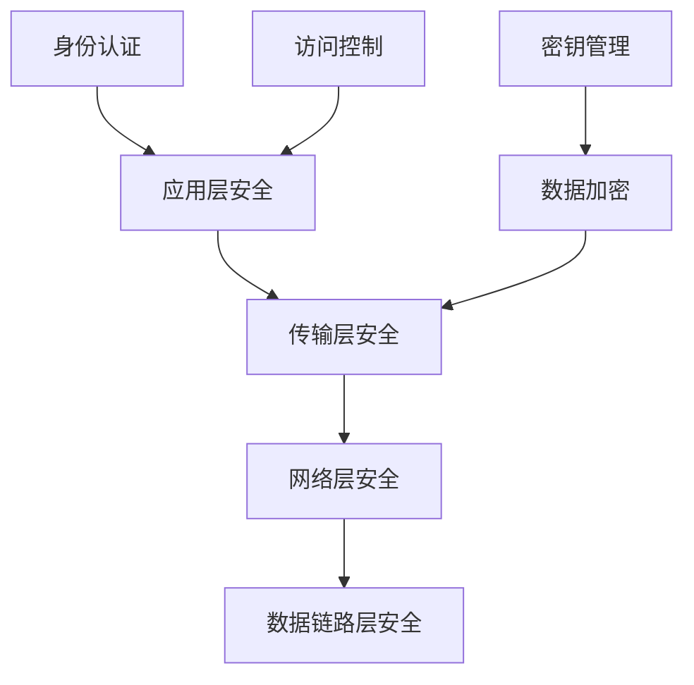

# C10 Networks 安全指南

> 适用范围：Rust 1.90+，Tokio 1.35+。文档风格遵循 [`STYLE.md`](STYLE.md)。


## 📊 目录

- [📋 目录](#目录)
- [🎯 概述](#概述)
- [🔒 安全架构](#安全架构)
  - [安全层次](#安全层次)
  - [安全组件](#安全组件)
- [🔐 加密通信](#加密通信)
  - [TLS/SSL实现](#tlsssl实现)
  - [对称加密](#对称加密)
  - [非对称加密](#非对称加密)
- [🛡️ 身份认证](#️-身份认证)
  - [JWT认证](#jwt认证)
  - [OAuth2认证](#oauth2认证)
- [🔍 安全配置](#安全配置)
  - [安全配置管理](#安全配置管理)
  - [环境变量配置](#环境变量配置)
- [🚨 安全监控](#安全监控)
  - [安全事件监控](#安全事件监控)
  - [入侵检测](#入侵检测)
- [📋 安全最佳实践](#安全最佳实践)
  - [代码安全](#代码安全)
  - [网络安全](#网络安全)
- [🧪 安全测试](#安全测试)
  - [安全测试框架](#安全测试框架)
  - [安全审计](#安全审计)
- [📚 参考资源](#参考资源)


## 📋 目录

- [C10 Networks 安全指南](#c10-networks-安全指南)
  - [📋 目录](#-目录)
  - [🎯 概述](#-概述)
  - [🔒 安全架构](#-安全架构)
    - [安全层次](#安全层次)
    - [安全组件](#安全组件)
  - [🔐 加密通信](#-加密通信)
    - [TLS/SSL实现](#tlsssl实现)
    - [对称加密](#对称加密)
    - [非对称加密](#非对称加密)
  - [🛡️ 身份认证](#️-身份认证)
    - [JWT认证](#jwt认证)
    - [OAuth2认证](#oauth2认证)
  - [🔍 安全配置](#-安全配置)
    - [安全配置管理](#安全配置管理)
    - [环境变量配置](#环境变量配置)
  - [🚨 安全监控](#-安全监控)
    - [安全事件监控](#安全事件监控)
    - [入侵检测](#入侵检测)
  - [📋 安全最佳实践](#-安全最佳实践)
    - [代码安全](#代码安全)
    - [网络安全](#网络安全)
  - [🧪 安全测试](#-安全测试)
    - [安全测试框架](#安全测试框架)
    - [安全审计](#安全审计)
  - [📚 参考资源](#-参考资源)

## 🎯 概述

本指南提供了C10 Networks的安全实现指南，涵盖加密通信、身份认证、安全配置、监控和最佳实践。

## 🔒 安全架构

### 安全层次



### 安全组件

```rust
// 安全组件架构
pub struct SecurityArchitecture {
    // 加密模块
    encryption: EncryptionModule,
    // 认证模块
    authentication: AuthenticationModule,
    // 访问控制模块
    access_control: AccessControlModule,
    // 密钥管理模块
    key_management: KeyManagementModule,
    // 安全监控模块
    security_monitoring: SecurityMonitoringModule,
}

// 安全策略
pub struct SecurityPolicy {
    // 加密策略
    encryption_policy: EncryptionPolicy,
    // 认证策略
    authentication_policy: AuthenticationPolicy,
    // 访问控制策略
    access_control_policy: AccessControlPolicy,
    // 审计策略
    audit_policy: AuditPolicy,
}
```

## 🔐 加密通信

### TLS/SSL实现

```rust
// TLS配置
pub struct TlsConfig {
    // 支持的TLS版本
    min_version: TlsVersion,
    max_version: TlsVersion,
    // 支持的密码套件
    cipher_suites: Vec<CipherSuite>,
    // 证书验证
    verify_certificates: bool,
    verify_hostname: bool,
    // 客户端证书
    client_certificate: Option<ClientCertificate>,
    // CA证书
    ca_certificates: Vec<Certificate>,
}

// TLS连接
pub struct TlsConnection {
    config: TlsConfig,
    session: TlsSession,
    state: TlsState,
}

impl TlsConnection {
    // 建立TLS连接
    pub async fn establish(&mut self, stream: &mut TcpStream) -> NetworkResult<()> {
        // TLS握手
        self.perform_handshake(stream).await?;
        
        // 验证证书
        if self.config.verify_certificates {
            self.verify_certificate_chain().await?;
        }
        
        // 验证主机名
        if self.config.verify_hostname {
            self.verify_hostname().await?;
        }
        
        Ok(())
    }
    
    // 加密数据
    pub async fn encrypt(&mut self, data: &[u8]) -> NetworkResult<Vec<u8>> {
        self.session.encrypt(data).await
    }
    
    // 解密数据
    pub async fn decrypt(&mut self, data: &[u8]) -> NetworkResult<Vec<u8>> {
        self.session.decrypt(data).await
    }
}
```

### 对称加密

```rust
// AES-GCM加密
pub struct AesGcmEncryption {
    key: [u8; 32], // 256位密钥
    nonce: [u8; 12], // 96位随机数
}

impl AesGcmEncryption {
    pub fn new(key: [u8; 32]) -> Self {
        Self {
            key,
            nonce: Self::generate_nonce(),
        }
    }
    
    // 加密数据
    pub fn encrypt(&self, plaintext: &[u8], additional_data: &[u8]) -> NetworkResult<(Vec<u8>, [u8; 16])> {
        let cipher = Aes256Gcm::new(&self.key.into());
        let nonce = Nonce::from_slice(&self.nonce);
        
        let ciphertext = cipher.encrypt(nonce, Payload {
            msg: plaintext,
            aad: additional_data,
        })?;
        
        let tag = ciphertext[ciphertext.len() - 16..].try_into().unwrap();
        let ciphertext = ciphertext[..ciphertext.len() - 16].to_vec();
        
        Ok((ciphertext, tag))
    }
    
    // 解密数据
    pub fn decrypt(&self, ciphertext: &[u8], tag: &[u8; 16], additional_data: &[u8]) -> NetworkResult<Vec<u8>> {
        let cipher = Aes256Gcm::new(&self.key.into());
        let nonce = Nonce::from_slice(&self.nonce);
        
        let mut full_ciphertext = ciphertext.to_vec();
        full_ciphertext.extend_from_slice(tag);
        
        let plaintext = cipher.decrypt(nonce, Payload {
            msg: &full_ciphertext,
            aad: additional_data,
        })?;
        
        Ok(plaintext)
    }
    
    fn generate_nonce() -> [u8; 12] {
        let mut nonce = [0u8; 12];
        thread_rng().fill(&mut nonce);
        nonce
    }
}
```

### 非对称加密

```rust
// RSA加密
pub struct RsaEncryption {
    public_key: RsaPublicKey,
    private_key: Option<RsaPrivateKey>,
}

impl RsaEncryption {
    pub fn new(key_size: usize) -> NetworkResult<Self> {
        let mut rng = thread_rng();
        let private_key = RsaPrivateKey::new(&mut rng, key_size)?;
        let public_key = RsaPublicKey::from(&private_key);
        
        Ok(Self {
            public_key,
            private_key: Some(private_key),
        })
    }
    
    // 使用公钥加密
    pub fn encrypt_public(&self, data: &[u8]) -> NetworkResult<Vec<u8>> {
        let mut rng = thread_rng();
        let padding = PaddingScheme::new_pkcs1v15_encrypt();
        
        let ciphertext = self.public_key.encrypt(&mut rng, padding, data)?;
        Ok(ciphertext)
    }
    
    // 使用私钥解密
    pub fn decrypt_private(&self, ciphertext: &[u8]) -> NetworkResult<Vec<u8>> {
        let private_key = self.private_key.as_ref().ok_or(NetworkError::NoPrivateKey)?;
        let padding = PaddingScheme::new_pkcs1v15_encrypt();
        
        let plaintext = private_key.decrypt(padding, ciphertext)?;
        Ok(plaintext)
    }
}
```

## 🛡️ 身份认证

### JWT认证

```rust
// JWT令牌
pub struct JwtToken {
    header: JwtHeader,
    payload: JwtPayload,
    signature: String,
}

// JWT载荷
#[derive(Serialize, Deserialize)]
pub struct JwtPayload {
    // 标准声明
    iss: String, // 签发者
    sub: String, // 主题
    aud: String, // 受众
    exp: u64,    // 过期时间
    nbf: u64,    // 生效时间
    iat: u64,    // 签发时间
    jti: String, // JWT ID
    
    // 自定义声明
    user_id: String,
    roles: Vec<String>,
    permissions: Vec<String>,
}

// JWT认证器
pub struct JwtAuthenticator {
    secret_key: String,
    algorithm: JwtAlgorithm,
    expiration: Duration,
}

impl JwtAuthenticator {
    pub fn new(secret_key: String) -> Self {
        Self {
            secret_key,
            algorithm: JwtAlgorithm::HS256,
            expiration: Duration::from_secs(3600), // 1小时
        }
    }
    
    // 生成JWT令牌
    pub fn generate_token(&self, user_id: String, roles: Vec<String>, permissions: Vec<String>) -> NetworkResult<String> {
        let now = SystemTime::now().duration_since(UNIX_EPOCH)?.as_secs();
        
        let payload = JwtPayload {
            iss: "c10_networks".to_string(),
            sub: user_id.clone(),
            aud: "c10_networks_api".to_string(),
            exp: now + self.expiration.as_secs(),
            nbf: now,
            iat: now,
            jti: Uuid::new_v4().to_string(),
            user_id,
            roles,
            permissions,
        };
        
        let header = JwtHeader::new(self.algorithm);
        
        let token = encode(&header, &payload, &EncodingKey::from_secret(self.secret_key.as_ref()))?;
        Ok(token)
    }
    
    // 验证JWT令牌
    pub fn verify_token(&self, token: &str) -> NetworkResult<JwtPayload> {
        let validation = Validation::new(self.algorithm);
        
        let payload: JwtPayload = decode(
            token,
            &DecodingKey::from_secret(self.secret_key.as_ref()),
            &validation,
        )?.claims;
        
        Ok(payload)
    }
}
```

### OAuth2认证

```rust
// OAuth2客户端
pub struct OAuth2Client {
    client_id: String,
    client_secret: String,
    redirect_uri: String,
    authorization_endpoint: String,
    token_endpoint: String,
    userinfo_endpoint: String,
}

impl OAuth2Client {
    // 生成授权URL
    pub fn generate_authorization_url(&self, state: &str) -> String {
        let mut params = HashMap::new();
        params.insert("response_type", "code");
        params.insert("client_id", &self.client_id);
        params.insert("redirect_uri", &self.redirect_uri);
        params.insert("state", state);
        params.insert("scope", "read write");
        
        let query_string = params.iter()
            .map(|(k, v)| format!("{}={}", k, v))
            .collect::<Vec<_>>()
            .join("&");
        
        format!("{}?{}", self.authorization_endpoint, query_string)
    }
    
    // 交换授权码
    pub async fn exchange_code(&self, code: &str) -> NetworkResult<OAuth2Token> {
        let mut params = HashMap::new();
        params.insert("grant_type", "authorization_code");
        params.insert("code", code);
        params.insert("redirect_uri", &self.redirect_uri);
        params.insert("client_id", &self.client_id);
        params.insert("client_secret", &self.client_secret);
        
        let client = reqwest::Client::new();
        let response = client
            .post(&self.token_endpoint)
            .form(&params)
            .send()
            .await?;
        
        let token: OAuth2Token = response.json().await?;
        Ok(token)
    }
    
    // 获取用户信息
    pub async fn get_user_info(&self, access_token: &str) -> NetworkResult<UserInfo> {
        let client = reqwest::Client::new();
        let response = client
            .get(&self.userinfo_endpoint)
            .bearer_auth(access_token)
            .send()
            .await?;
        
        let user_info: UserInfo = response.json().await?;
        Ok(user_info)
    }
}
```

## 🔍 安全配置

### 安全配置管理

```rust
// 安全配置
pub struct SecurityConfig {
    // TLS配置
    tls: TlsConfig,
    // 认证配置
    authentication: AuthenticationConfig,
    // 访问控制配置
    access_control: AccessControlConfig,
    // 审计配置
    audit: AuditConfig,
    // 密钥管理配置
    key_management: KeyManagementConfig,
}

// 配置验证
impl SecurityConfig {
    pub fn validate(&self) -> NetworkResult<()> {
        // 验证TLS配置
        self.validate_tls_config()?;
        
        // 验证认证配置
        self.validate_authentication_config()?;
        
        // 验证访问控制配置
        self.validate_access_control_config()?;
        
        // 验证密钥管理配置
        self.validate_key_management_config()?;
        
        Ok(())
    }
    
    fn validate_tls_config(&self) -> NetworkResult<()> {
        // 检查TLS版本
        if self.tls.min_version < TlsVersion::Tls12 {
            return Err(NetworkError::InsecureTlsVersion);
        }
        
        // 检查密码套件
        if self.tls.cipher_suites.is_empty() {
            return Err(NetworkError::NoCipherSuites);
        }
        
        // 检查是否包含弱密码套件
        for suite in &self.tls.cipher_suites {
            if suite.is_weak() {
                return Err(NetworkError::WeakCipherSuite);
            }
        }
        
        Ok(())
    }
}
```

### 环境变量配置

```bash
# TLS配置
export C10_TLS_MIN_VERSION=TLS12
export C10_TLS_MAX_VERSION=TLS13
export C10_TLS_VERIFY_CERTIFICATES=true
export C10_TLS_VERIFY_HOSTNAME=true

# 认证配置
export C10_JWT_SECRET_KEY=your-secret-key
export C10_JWT_EXPIRATION=3600
export C10_OAUTH2_CLIENT_ID=your-client-id
export C10_OAUTH2_CLIENT_SECRET=your-client-secret

# 访问控制配置
export C10_ACCESS_CONTROL_ENABLED=true
export C10_RATE_LIMITING_ENABLED=true
export C10_RATE_LIMIT_REQUESTS_PER_MINUTE=1000

# 审计配置
export C10_AUDIT_ENABLED=true
export C10_AUDIT_LOG_LEVEL=INFO
export C10_AUDIT_LOG_FILE=/var/log/c10_networks/audit.log
```

## 🚨 安全监控

### 安全事件监控

```rust
// 安全事件
#[derive(Debug, Clone)]
pub struct SecurityEvent {
    pub event_id: String,
    pub event_type: SecurityEventType,
    pub severity: SecuritySeverity,
    pub timestamp: DateTime<Utc>,
    pub source_ip: Option<IpAddr>,
    pub user_id: Option<String>,
    pub description: String,
    pub metadata: HashMap<String, String>,
}

#[derive(Debug, Clone)]
pub enum SecurityEventType {
    AuthenticationFailure,
    AuthorizationFailure,
    SuspiciousActivity,
    BruteForceAttack,
    DdosAttack,
    MaliciousRequest,
    DataBreach,
    SystemCompromise,
}

// 安全监控器
pub struct SecurityMonitor {
    event_receiver: mpsc::Receiver<SecurityEvent>,
    alert_sender: mpsc::Sender<SecurityAlert>,
    rules: Vec<SecurityRule>,
    thresholds: SecurityThresholds,
}

impl SecurityMonitor {
    pub async fn start_monitoring(&mut self) -> NetworkResult<()> {
        while let Some(event) = self.event_receiver.recv().await {
            // 分析安全事件
            self.analyze_event(&event).await?;
            
            // 检查安全规则
            self.check_security_rules(&event).await?;
            
            // 更新统计信息
            self.update_statistics(&event).await?;
            
            // 生成告警
            if self.should_generate_alert(&event) {
                self.generate_alert(&event).await?;
            }
        }
        
        Ok(())
    }
    
    async fn analyze_event(&self, event: &SecurityEvent) -> NetworkResult<()> {
        match event.event_type {
            SecurityEventType::AuthenticationFailure => {
                // 分析认证失败模式
                self.analyze_authentication_failure(event).await?;
            }
            SecurityEventType::SuspiciousActivity => {
                // 分析可疑活动
                self.analyze_suspicious_activity(event).await?;
            }
            SecurityEventType::BruteForceAttack => {
                // 检测暴力攻击
                self.detect_brute_force_attack(event).await?;
            }
            _ => {}
        }
        
        Ok(())
    }
}
```

### 入侵检测

```rust
// 入侵检测系统
pub struct IntrusionDetectionSystem {
    // 异常检测器
    anomaly_detector: AnomalyDetector,
    // 模式匹配器
    pattern_matcher: PatternMatcher,
    // 行为分析器
    behavior_analyzer: BehaviorAnalyzer,
    // 威胁情报
    threat_intelligence: ThreatIntelligence,
}

impl IntrusionDetectionSystem {
    // 检测异常行为
    pub async fn detect_anomalies(&self, network_traffic: &NetworkTraffic) -> NetworkResult<Vec<Anomaly>> {
        let mut anomalies = Vec::new();
        
        // 检测流量异常
        if let Some(anomaly) = self.anomaly_detector.detect_traffic_anomaly(network_traffic).await? {
            anomalies.push(anomaly);
        }
        
        // 检测连接异常
        if let Some(anomaly) = self.anomaly_detector.detect_connection_anomaly(network_traffic).await? {
            anomalies.push(anomaly);
        }
        
        // 检测协议异常
        if let Some(anomaly) = self.anomaly_detector.detect_protocol_anomaly(network_traffic).await? {
            anomalies.push(anomaly);
        }
        
        Ok(anomalies)
    }
    
    // 匹配攻击模式
    pub async fn match_attack_patterns(&self, event: &SecurityEvent) -> NetworkResult<Vec<AttackPattern>> {
        let mut patterns = Vec::new();
        
        // SQL注入检测
        if let Some(pattern) = self.pattern_matcher.match_sql_injection(event).await? {
            patterns.push(pattern);
        }
        
        // XSS攻击检测
        if let Some(pattern) = self.pattern_matcher.match_xss_attack(event).await? {
            patterns.push(pattern);
        }
        
        // 路径遍历检测
        if let Some(pattern) = self.pattern_matcher.match_path_traversal(event).await? {
            patterns.push(pattern);
        }
        
        Ok(patterns)
    }
}
```

## 📋 安全最佳实践

### 代码安全

```rust
// 安全编码实践
pub struct SecureCodingPractices;

impl SecureCodingPractices {
    // 输入验证
    pub fn validate_input(input: &str, max_length: usize) -> NetworkResult<()> {
        if input.len() > max_length {
            return Err(NetworkError::InputTooLong);
        }
        
        // 检查危险字符
        if input.contains("..") || input.contains("//") {
            return Err(NetworkError::InvalidInput);
        }
        
        Ok(())
    }
    
    // 安全字符串处理
    pub fn sanitize_string(input: &str) -> String {
        input
            .chars()
            .filter(|c| c.is_alphanumeric() || c.is_whitespace())
            .collect()
    }
    
    // 安全内存操作
    pub fn secure_memory_clear(data: &mut [u8]) {
        for byte in data.iter_mut() {
            *byte = 0;
        }
    }
    
    // 常量时间比较
    pub fn constant_time_compare(a: &[u8], b: &[u8]) -> bool {
        if a.len() != b.len() {
            return false;
        }
        
        let mut result = 0u8;
        for (x, y) in a.iter().zip(b.iter()) {
            result |= x ^ y;
        }
        
        result == 0
    }
}
```

### 网络安全

```rust
// 网络安全实践
pub struct NetworkSecurityPractices;

impl NetworkSecurityPractices {
    // 速率限制
    pub fn rate_limit_check(&self, client_ip: IpAddr, endpoint: &str) -> NetworkResult<()> {
        let key = format!("{}:{}", client_ip, endpoint);
        let current_time = SystemTime::now().duration_since(UNIX_EPOCH)?.as_secs();
        
        // 检查请求频率
        if self.is_rate_limited(&key, current_time) {
            return Err(NetworkError::RateLimitExceeded);
        }
        
        // 记录请求
        self.record_request(&key, current_time);
        
        Ok(())
    }
    
    // IP白名单检查
    pub fn check_ip_whitelist(&self, client_ip: IpAddr) -> NetworkResult<()> {
        if !self.is_ip_whitelisted(client_ip) {
            return Err(NetworkError::IpNotWhitelisted);
        }
        
        Ok(())
    }
    
    // 请求大小限制
    pub fn check_request_size(&self, size: usize) -> NetworkResult<()> {
        const MAX_REQUEST_SIZE: usize = 10 * 1024 * 1024; // 10MB
        
        if size > MAX_REQUEST_SIZE {
            return Err(NetworkError::RequestTooLarge);
        }
        
        Ok(())
    }
}
```

## 🧪 安全测试

### 安全测试框架

```rust
// 安全测试
pub struct SecurityTestSuite;

impl SecurityTestSuite {
    // 渗透测试
    pub async fn penetration_test(&self, target: &str) -> NetworkResult<PenetrationTestReport> {
        let mut report = PenetrationTestReport::new();
        
        // SQL注入测试
        self.test_sql_injection(target, &mut report).await?;
        
        // XSS测试
        self.test_xss(target, &mut report).await?;
        
        // 路径遍历测试
        self.test_path_traversal(target, &mut report).await?;
        
        // 认证绕过测试
        self.test_authentication_bypass(target, &mut report).await?;
        
        // 权限提升测试
        self.test_privilege_escalation(target, &mut report).await?;
        
        Ok(report)
    }
    
    // 漏洞扫描
    pub async fn vulnerability_scan(&self, target: &str) -> NetworkResult<VulnerabilityReport> {
        let mut report = VulnerabilityReport::new();
        
        // 端口扫描
        self.scan_ports(target, &mut report).await?;
        
        // 服务识别
        self.identify_services(target, &mut report).await?;
        
        // 漏洞检测
        self.detect_vulnerabilities(target, &mut report).await?;
        
        Ok(report)
    }
}
```

### 安全审计

```rust
// 安全审计
pub struct SecurityAudit;

impl SecurityAudit {
    // 配置审计
    pub fn audit_configuration(&self, config: &SecurityConfig) -> NetworkResult<AuditReport> {
        let mut report = AuditReport::new();
        
        // 审计TLS配置
        self.audit_tls_config(&config.tls, &mut report)?;
        
        // 审计认证配置
        self.audit_authentication_config(&config.authentication, &mut report)?;
        
        // 审计访问控制配置
        self.audit_access_control_config(&config.access_control, &mut report)?;
        
        // 审计密钥管理配置
        self.audit_key_management_config(&config.key_management, &mut report)?;
        
        Ok(report)
    }
    
    // 代码审计
    pub fn audit_code(&self, code: &str) -> NetworkResult<CodeAuditReport> {
        let mut report = CodeAuditReport::new();
        
        // 检查安全漏洞
        self.check_security_vulnerabilities(code, &mut report)?;
        
        // 检查编码规范
        self.check_coding_standards(code, &mut report)?;
        
        // 检查最佳实践
        self.check_best_practices(code, &mut report)?;
        
        Ok(report)
    }
}
```

## 📚 参考资源

1. [OWASP Top 10](https://owasp.org/www-project-top-ten/)
2. [NIST Cybersecurity Framework](https://www.nist.gov/cyberframework)
3. [RFC 8446 - TLS 1.3](https://tools.ietf.org/html/rfc8446)
4. [RFC 7519 - JSON Web Token](https://tools.ietf.org/html/rfc7519)
5. [RFC 6749 - OAuth 2.0](https://tools.ietf.org/html/rfc6749)
6. [CIS Controls](https://www.cisecurity.org/controls/)
7. [ISO/IEC 27001](https://www.iso.org/isoiec-27001-information-security.html)

---

**安全指南版本**: v1.0  
**最后更新**: 2025年1月  
**维护者**: C10 Networks 安全团队
