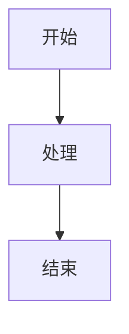

# C10 Networks 文档风格指南

> 适用范围：Rust 1.90+，Tokio 1.35+。本文档定义了C10 Networks项目的文档编写规范和风格约定。

## 📋 目录

- [C10 Networks 文档风格指南](#c10-networks-文档风格指南)
  - [📋 目录](#-目录)
  - [🎯 概述](#-概述)
    - [📚 理论基础](#-理论基础)
    - [🔬 文档分类](#-文档分类)
  - [🔬 文档结构规范](#-文档结构规范)
    - [1. 标准文档结构](#1-标准文档结构)
    - [2. 章节编号规范](#2-章节编号规范)
    - [3. 目录生成规范](#3-目录生成规范)
  - [📝 内容编写规范](#-内容编写规范)
    - [1. 语言规范](#1-语言规范)
    - [2. 术语统一](#2-术语统一)
    - [3. 数学公式规范](#3-数学公式规范)
    - [4. 代码示例规范](#4-代码示例规范)
  - [🎨 格式规范](#-格式规范)
    - [1. 标题格式](#1-标题格式)
    - [2. 列表格式](#2-列表格式)
    - [3. 表格格式](#3-表格格式)
    - [4. 链接格式](#4-链接格式)
    - [5. 图片格式](#5-图片格式)
  - [🔧 技术规范](#-技术规范)
    - [1. 代码块规范](#1-代码块规范)
    - [2. 数学公式规范](#2-数学公式规范)
    - [3. 图表规范](#3-图表规范)
  - [📊 质量检查](#-质量检查)
    - [1. 内容检查](#1-内容检查)
    - [2. 格式检查](#2-格式检查)
    - [3. 结构检查](#3-结构检查)
    - [4. 自动化检查](#4-自动化检查)
  - [📚 参考文献](#-参考文献)
    - [1. 技术标准](#1-技术标准)
    - [2. 学术论文](#2-学术论文)
    - [3. 技术书籍](#3-技术书籍)
    - [4. 在线资源](#4-在线资源)

## 🎯 概述

本文档定义了C10 Networks项目的文档编写规范和风格约定，确保所有文档具有一致性、可读性和专业性。

### 📚 理论基础

文档风格基于以下理论基础：

1. **技术写作理论**: 清晰表达、结构化写作、用户中心设计
2. **信息架构理论**: 信息组织、导航设计、内容层次
3. **可用性理论**: 易用性、可访问性、用户体验
4. **版本控制理论**: 文档版本管理、变更追踪、协作流程

### 🔬 文档分类

| 文档类型 | 用途 | 目标读者 | 更新频率 |
|---------|------|---------|---------|
| 理论文档 | 概念解释、数学基础 | 研究人员、高级开发者 | 低 |
| 实现文档 | 代码示例、API说明 | 开发者、集成人员 | 中 |
| 用户文档 | 使用指南、教程 | 最终用户、初学者 | 高 |
| 参考文档 | API参考、规范说明 | 开发者、维护人员 | 中 |

## 🔬 文档结构规范

### 1. 标准文档结构

每个文档应包含以下标准结构：

```markdown
# 文档标题

> 适用范围：Rust 1.90+，Tokio 1.35+。文档风格遵循 [`DOCUMENTATION_STYLE_GUIDE.md`](DOCUMENTATION_STYLE_GUIDE.md)。

## 📋 目录

- [文档标题](#文档标题)
  - [📋 目录](#-目录)
  - [🎯 概述](#-概述)
  - [📚 理论基础](#-理论基础)
  - [🔬 具体内容](#-具体内容)
  - [📚 参考文献](#-参考文献)

## 🎯 概述

文档概述和目的说明。

### 📚 理论基础

相关理论基础和概念。

### 🔬 技术架构

技术架构图和说明。

### 📊 特性对比

特性对比表格。

## 🔬 具体内容

详细内容说明。

## 📚 参考文献

相关参考资料。
```

### 2. 章节编号规范

- 使用emoji图标标识章节类型
- 保持层次结构清晰
- 避免过深的嵌套（最多3层）

### 3. 目录生成规范

- 自动生成目录
- 保持目录结构完整
- 使用相对链接

## 📝 内容编写规范

### 1. 语言规范

- **主要语言**: 中文
- **技术术语**: 保持英文原文
- **代码注释**: 英文
- **变量名**: 英文

### 2. 术语统一

| 中文术语 | 英文术语 | 使用场景 |
|---------|---------|---------|
| 形式化验证 | Formal Verification | 理论文档 |
| 状态机 | State Machine | 技术文档 |
| 协议 | Protocol | 所有文档 |
| 异步 | Async | 技术文档 |
| 并发 | Concurrency | 技术文档 |

### 3. 数学公式规范

- 使用LaTeX语法
- 公式居中显示
- 提供必要的解释

```latex
$$\text{Protocol} = (\text{States}, \text{Events}, \text{Transitions})$$
```

### 4. 代码示例规范

- 使用Rust代码
- 提供完整可运行的示例
- 包含必要的注释
- 使用适当的错误处理

```rust
// 示例代码
pub struct Example {
    field: String,
}

impl Example {
    pub fn new(value: String) -> Self {
        Self { field: value }
    }
}
```

## 🎨 格式规范

### 1. 标题格式

- **一级标题**: `# 标题`
- **二级标题**: `## 标题`
- **三级标题**: `### 标题`
- **四级标题**: `#### 标题`

### 2. 列表格式

- **无序列表**: 使用 `-` 或 `*`
- **有序列表**: 使用数字
- **嵌套列表**: 使用缩进

### 3. 表格格式

- 使用Markdown表格语法
- 保持列对齐
- 提供表头

### 4. 链接格式

- **内部链接**: `[文本](相对路径)`
- **外部链接**: `[文本](https://example.com)`
- **锚点链接**: `[文本](#锚点)`

### 5. 图片格式

- 使用相对路径
- 提供alt文本
- 保持图片清晰

```markdown

```

## 🔧 技术规范

### 1. 代码块规范

- 指定语言类型
- 使用语法高亮
- 提供必要的上下文

```rust
// Rust代码示例
use std::collections::HashMap;

pub fn example_function() -> Result<(), Box<dyn std::error::Error>> {
    let mut map = HashMap::new();
    map.insert("key", "value");
    Ok(())
}
```

### 2. 数学公式规范

- 使用LaTeX语法
- 公式居中显示
- 提供必要的解释

```latex
$$\mathcal{M} = (\mathcal{S}, \mathcal{E}, \delta, s_0)$$
```

### 3. 图表规范

- 使用Mermaid语法
- 保持图表简洁
- 提供必要的说明



## 📊 质量检查

### 1. 内容检查

- [ ] 内容准确性
- [ ] 逻辑一致性
- [ ] 术语统一性
- [ ] 示例可运行性

### 2. 格式检查

- [ ] 标题层次正确
- [ ] 链接有效性
- [ ] 表格格式正确
- [ ] 代码语法正确

### 3. 结构检查

- [ ] 目录完整
- [ ] 章节编号正确
- [ ] 引用格式正确
- [ ] 参考文献完整

### 4. 自动化检查

```bash
# 检查Markdown语法
markdownlint docs/*.md

# 检查链接有效性
markdown-link-check docs/*.md

# 检查代码示例
cargo test --doc
```

## 📚 参考文献

### 1. 技术标准

- [RFC 7230: HTTP/1.1 Message Syntax and Routing](https://tools.ietf.org/html/rfc7230)
- [RFC 6455: The WebSocket Protocol](https://tools.ietf.org/html/rfc6455)
- [RFC 793: Transmission Control Protocol](https://tools.ietf.org/html/rfc793)

### 2. 学术论文

- Lamport, L. (1977). Proving the correctness of multiprocess programs. IEEE Transactions on Software Engineering, 3(2), 125-143.
- Hoare, C. A. R. (1978). Communicating sequential processes. Communications of the ACM, 21(8), 666-677.

### 3. 技术书籍

- Tanenbaum, A. S., & Wetherall, D. (2011). Computer networks. Prentice Hall.
- Kurose, J. F., & Ross, K. W. (2017). Computer networking: a top-down approach. Pearson.

### 4. 在线资源

- [Rust官方文档](https://doc.rust-lang.org/)
- [Tokio文档](https://tokio.rs/)
- [形式化方法Wiki](https://en.wikipedia.org/wiki/Formal_methods)

---

**C10 Networks 文档风格指南** - 确保文档质量的一致性、可读性和专业性！

*最后更新: 2025年1月*  
*文档版本: v1.0*  
*维护者: C10 Networks 开发团队*
