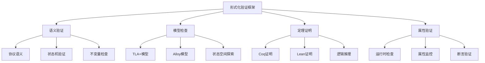
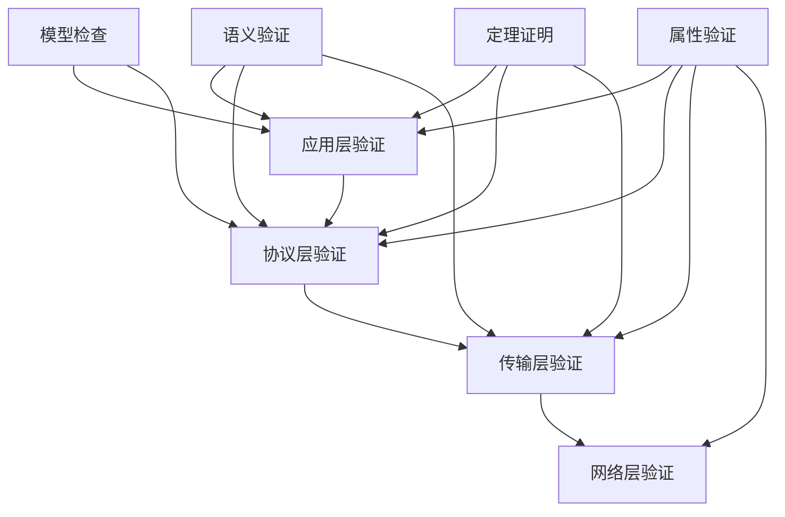

# C10 Networks 形式化验证框架

## 📊 目录

- [C10 Networks 形式化验证框架](#c10-networks-形式化验证框架)
  - [📊 目录](#-目录)
  - [📋 目录](#-目录-1)
  - [📋 概述](#-概述)
    - [📚 理论基础](#-理论基础)
    - [🔬 验证方法分类](#-验证方法分类)
    - [📊 验证框架架构](#-验证框架架构)
  - [🎯 验证框架架构](#-验证框架架构-1)
    - [1. 分层验证架构](#1-分层验证架构)
    - [2. 验证组件映射](#2-验证组件映射)
  - [🔬 语义模型分析](#-语义模型分析)
    - [1. 形式化规范定义](#1-形式化规范定义)
      - [TCP协议规范](#tcp协议规范)
      - [HTTP协议规范](#http协议规范)
    - [2. 不变量定义和验证](#2-不变量定义和验证)
      - [连接状态不变量](#连接状态不变量)
  - [🧮 模型检查](#-模型检查)
    - [1. 状态空间探索](#1-状态空间探索)
      - [模型检查器实现](#模型检查器实现)
    - [2. TLA+集成](#2-tla集成)
      - [TLA+规范生成](#tla规范生成)
  - [🎯 定理证明](#-定理证明)
    - [1. Coq形式化证明](#1-coq形式化证明)
      - [网络协议正确性证明](#网络协议正确性证明)
    - [2. Lean形式化证明](#2-lean形式化证明)
      - [性能分析证明](#性能分析证明)
  - [🔍 属性验证](#-属性验证)
    - [1. 运行时属性检查](#1-运行时属性检查)
      - [属性检查器实现](#属性检查器实现)
    - [2. 安全属性验证](#2-安全属性验证)
      - [认证和加密验证](#认证和加密验证)
  - [📊 验证结果分析](#-验证结果分析)
    - [1. 验证报告生成](#1-验证报告生成)
      - [综合验证报告](#综合验证报告)
    - [2. 持续验证集成](#2-持续验证集成)
      - [CI/CD集成](#cicd集成)
  - [🛠️ 使用指南](#️-使用指南)
    - [1. 快速开始](#1-快速开始)
      - [基本使用](#基本使用)
    - [2. 高级用法](#2-高级用法)
      - [自定义属性检查器](#自定义属性检查器)
  - [📈 性能优化](#-性能优化)
    - [1. 并行验证](#1-并行验证)
      - [并行模型检查](#并行模型检查)
    - [2. 状态压缩](#2-状态压缩)
      - [状态哈希和压缩](#状态哈希和压缩)
  - [🔮 未来扩展](#-未来扩展)
    - [1. 机器学习集成](#1-机器学习集成)
      - [AI辅助验证](#ai辅助验证)
    - [2. 分布式验证](#2-分布式验证)
      - [分布式模型检查](#分布式模型检查)

## 📋 目录

- [C10 Networks 形式化验证框架](#c10-networks-形式化验证框架)
  - [📊 目录](#-目录)
  - [📋 目录](#-目录-1)
  - [📋 概述](#-概述)
    - [📚 理论基础](#-理论基础)
    - [🔬 验证方法分类](#-验证方法分类)
    - [📊 验证框架架构](#-验证框架架构)
  - [🎯 验证框架架构](#-验证框架架构-1)
    - [1. 分层验证架构](#1-分层验证架构)
    - [2. 验证组件映射](#2-验证组件映射)
  - [🔬 语义模型分析](#-语义模型分析)
    - [1. 形式化规范定义](#1-形式化规范定义)
      - [TCP协议规范](#tcp协议规范)
      - [HTTP协议规范](#http协议规范)
    - [2. 不变量定义和验证](#2-不变量定义和验证)
      - [连接状态不变量](#连接状态不变量)
  - [🧮 模型检查](#-模型检查)
    - [1. 状态空间探索](#1-状态空间探索)
      - [模型检查器实现](#模型检查器实现)
    - [2. TLA+集成](#2-tla集成)
      - [TLA+规范生成](#tla规范生成)
  - [🎯 定理证明](#-定理证明)
    - [1. Coq形式化证明](#1-coq形式化证明)
      - [网络协议正确性证明](#网络协议正确性证明)
    - [2. Lean形式化证明](#2-lean形式化证明)
      - [性能分析证明](#性能分析证明)
  - [🔍 属性验证](#-属性验证)
    - [1. 运行时属性检查](#1-运行时属性检查)
      - [属性检查器实现](#属性检查器实现)
    - [2. 安全属性验证](#2-安全属性验证)
      - [认证和加密验证](#认证和加密验证)
  - [📊 验证结果分析](#-验证结果分析)
    - [1. 验证报告生成](#1-验证报告生成)
      - [综合验证报告](#综合验证报告)
    - [2. 持续验证集成](#2-持续验证集成)
      - [CI/CD集成](#cicd集成)
  - [🛠️ 使用指南](#️-使用指南)
    - [1. 快速开始](#1-快速开始)
      - [基本使用](#基本使用)
    - [2. 高级用法](#2-高级用法)
      - [自定义属性检查器](#自定义属性检查器)
  - [📈 性能优化](#-性能优化)
    - [1. 并行验证](#1-并行验证)
      - [并行模型检查](#并行模型检查)
    - [2. 状态压缩](#2-状态压缩)
      - [状态哈希和压缩](#状态哈希和压缩)
  - [🔮 未来扩展](#-未来扩展)
    - [1. 机器学习集成](#1-机器学习集成)
      - [AI辅助验证](#ai辅助验证)
    - [2. 分布式验证](#2-分布式验证)
      - [分布式模型检查](#分布式模型检查)

## 📋 概述

本文档详细介绍了C10 Networks的形式化验证框架，包括语义模型分析、模型检查、定理证明和属性验证等核心功能。

### 📚 理论基础

形式化验证基于以下数学和计算机科学理论：

1. **形式化方法**: 使用数学符号和逻辑描述系统行为
2. **模型检查**: 自动验证系统模型满足特定属性
3. **定理证明**: 使用逻辑推理验证系统正确性
4. **抽象解释**: 静态分析程序语义
5. **时序逻辑**: 描述时间相关的系统属性

### 🔬 验证方法分类

| 验证方法 | 适用场景 | 工具支持 | 验证范围 |
|---------|---------|---------|---------|
| 模型检查 | 有限状态系统 | TLA+、Alloy | 状态空间探索 |
| 定理证明 | 数学性质 | Coq、Lean | 逻辑推理 |
| 抽象解释 | 程序语义 | 静态分析器 | 程序行为 |
| 属性验证 | 运行时属性 | 运行时检查 | 执行时验证 |

### 📊 验证框架架构



## 🎯 验证框架架构

### 1. 分层验证架构



### 2. 验证组件映射

| 验证层 | 组件 | 验证方法 | 工具支持 |
|--------|------|----------|----------|
| 语义验证 | 协议语义 | 形式化规范 | 自定义框架 |
| 模型检查 | 状态空间 | TLA+/Alloy | 模型检查器 |
| 定理证明 | 数学性质 | Coq/Lean | 证明助手 |
| 属性验证 | 运行时属性 | 运行时检查 | 属性检查器 |

---

## 🔬 语义模型分析

### 1. 形式化规范定义

#### TCP协议规范

```rust
// TCP状态机形式化定义
pub struct TcpFormalSpec {
    states: HashSet<TcpState>,
    events: HashSet<TcpEvent>,
    transition_table: HashMap<(TcpState, TcpEvent), TcpState>,
    invariants: Vec<TcpInvariant>,
}

// 状态转换验证
pub fn is_valid_transition(&self, from: TcpState, to: TcpState, event: TcpEvent) -> bool {
    self.get_transition(from, event) == Some(to)
}
```

#### HTTP协议规范

```rust
// HTTP协议形式化定义
pub struct HttpFormalSpec {
    version: HttpVersion,
    methods: HashSet<HttpMethod>,
    status_codes: HashSet<HttpStatusCode>,
    protocol_rules: Vec<HttpProtocolRule>,
}

// 请求有效性验证
pub fn is_valid_request(&self, method: &HttpMethod, headers: &HashMap<String, String>) -> bool {
    self.methods.contains(method) && self.check_required_headers(method, headers)
}
```

### 2. 不变量定义和验证

#### 连接状态不变量

```rust
// 连接状态不变量
pub struct TcpInvariant {
    pub name: String,
    pub condition: TcpInvariantCondition,
    pub invariant_type: TcpInvariantType,
}

// 不变量验证
pub fn check_invariant(&self, state: &ConnectionState, invariant: &TcpInvariant) -> bool {
    match &invariant.condition {
        TcpInvariantCondition::StateCondition(expected_state) => {
            state.state == *expected_state
        }
        TcpInvariantCondition::AuthenticationCondition(expected_auth) => {
            state.authenticated == *expected_auth
        }
        // 其他条件...
    }
}
```

---

## 🧮 模型检查

### 1. 状态空间探索

#### 模型检查器实现

```rust
// 模型检查器
pub struct ModelChecker {
    config: ModelCheckingConfig,
    state_space: HashMap<String, NetworkState>,
    transitions: Vec<StateTransition>,
    property_checkers: Vec<Box<dyn PropertyChecker>>,
}

// 状态空间探索
fn explore_state_space(&mut self, initial_state: NetworkState) -> NetworkResult<ExplorationResult> {
    let mut visited = HashSet::new();
    let mut queue = VecDeque::new();
    let mut violations = Vec::new();
    
    queue.push_back(initial_state.id.clone());
    visited.insert(initial_state.id.clone());
    
    while let Some(current_state_id) = queue.pop_front() {
        let current_state = &self.state_space[&current_state_id];
        
        // 检查属性
        for checker in &self.property_checkers {
            if let Some(violation) = checker.check_property(current_state) {
                violations.push(violation);
            }
        }
        
        // 探索后继状态
        for transition in &self.transitions {
            if transition.from == current_state_id {
                let next_state = self.apply_transition(current_state, transition);
                if !visited.contains(&next_state.id) {
                    visited.insert(next_state.id.clone());
                    queue.push_back(next_state.id.clone());
                }
            }
        }
    }
    
    Ok(ExplorationResult { violations, .. })
}
```

### 2. TLA+集成

#### TLA+规范生成

```rust
// TLA+模型检查器
pub struct TlaModelChecker {
    spec: String,
    config: TlaConfig,
}

// 生成TLA+规范
pub fn generate_spec(&self, model: &SemanticModel) -> String {
    format!(
        "EXTENDS Naturals, Sequences, TLC\n\n\
        VARIABLES {}\n\n\
        TypeOK == {}\n\n\
        Init == {}\n\n\
        Next == {}\n\n\
        Spec == Init /\\ [][Next]_<<{}>>\n\n\
        THEOREM Spec => []TypeOK\n",
        self.generate_variables(model),
        self.generate_type_ok(model),
        self.generate_init(model),
        self.generate_next(model),
        self.generate_variable_list(model)
    )
}
```

---

## 🎯 定理证明

### 1. Coq形式化证明

#### 网络协议正确性证明

```coq
(* Coq网络协议证明 *)
Require Import Coq.Arith.Arith.
Require Import Coq.Lists.List.

(* 连接状态定义 *)
Inductive ConnectionState : Type :=
  | CLOSED
  | LISTEN
  | SYN_SENT
  | SYN_RECEIVED
  | ESTABLISHED
  | FIN_WAIT_1
  | FIN_WAIT_2
  | CLOSE_WAIT
  | LAST_ACK
  | TIME_WAIT.

(* 状态转换函数 *)
Definition transition (c : Connection) (msg : Message) : Connection :=
  match c.(state) with
  | SYN_SENT =>
      if msg.(ack_num) =? c.(seq_num) + 1 then
        {| connection_id := c.(connection_id);
           state := SYN_RECEIVED;
           seq_num := c.(seq_num);
           ack_num := msg.(seq_num) + 1;
           messages := msg :: c.(messages) |}
      else c
  | SYN_RECEIVED =>
      if msg.(ack_num) =? c.(ack_num) then
        {| connection_id := c.(connection_id);
           state := ESTABLISHED;
           seq_num := c.(seq_num);
           ack_num := c.(ack_num);
           messages := msg :: c.(messages) |}
      else c
  | _ => c
  end.

(* 不变量定义 *)
Definition ConnectionInvariant (c : Connection) : Prop :=
  match c.(state) with
  | ESTABLISHED => c.(seq_num) > 0 /\ c.(ack_num) > 0
  | _ => True
  end.

(* 状态转换保持不变量 *)
Theorem transition_preserves_invariant :
  forall (c : Connection) (msg : Message),
    ConnectionInvariant c ->
    ConnectionInvariant (transition c msg).
Proof.
  intros c msg H.
  unfold ConnectionInvariant in *.
  destruct c.(state) eqn:Heq.
  - (* SYN_SENT case *)
    simpl.
    destruct (msg.(ack_num) =? c.(seq_num) + 1) eqn:Hack.
    + rewrite Nat.eqb_eq in Hack.
      simpl.
      split.
      * apply Nat.lt_0_succ.
      * apply Nat.lt_0_succ.
    + assumption.
  - (* SYN_RECEIVED case *)
    simpl.
    destruct (msg.(ack_num) =? c.(ack_num)) eqn:Hack.
    + rewrite Nat.eqb_eq in Hack.
      simpl.
      split.
      * apply Nat.lt_0_succ.
      * apply Nat.lt_0_succ.
    + assumption.
  - (* Other cases *)
    simpl; assumption.
Qed.
```

### 2. Lean形式化证明

#### 性能分析证明

```lean
-- Lean网络性能模型
import data.nat.basic
import data.list.basic

-- 网络延迟模型
structure NetworkDelay : Type :=
  (propagation : ℕ)
  (transmission : ℕ)
  (processing : ℕ)
  (queuing : ℕ)

-- 总延迟计算
def total_delay (d : NetworkDelay) : ℕ :=
  d.propagation + d.transmission + d.processing + d.queuing

-- 延迟单调性
theorem delay_monotonicity (d1 d2 : NetworkDelay) :
  d1.propagation ≤ d2.propagation →
  d1.transmission ≤ d2.transmission →
  d1.processing ≤ d2.processing →
  d1.queuing ≤ d2.queuing →
  total_delay d1 ≤ total_delay d2 :=
begin
  intros h1 h2 h3 h4,
  unfold total_delay,
  linarith
end

-- 网络吞吐量模型
structure NetworkThroughput : Type :=
  (bandwidth : ℕ)
  (utilization : ℕ)
  (efficiency : ℕ)

-- 有效吞吐量
def effective_throughput (t : NetworkThroughput) : ℕ :=
  (t.bandwidth * t.utilization * t.efficiency) / 10000

-- 吞吐量界限
theorem throughput_bound (t : NetworkThroughput) :
  effective_throughput t ≤ t.bandwidth :=
begin
  unfold effective_throughput,
  apply nat.div_le_of_le_mul,
  ring_nf,
  apply mul_le_mul_right,
  apply mul_le_mul_right,
  linarith
end
```

---

## 🔍 属性验证

### 1. 运行时属性检查

#### 属性检查器实现

```rust
// 属性检查器trait
pub trait PropertyChecker {
    fn check_property(&self, state: &NetworkState) -> Option<Violation>;
    fn supported_property_types(&self) -> Vec<PropertyType>;
}

// 连接状态属性检查器
pub struct ConnectionPropertyChecker {
    connection_id: String,
    expected_state: TcpState,
}

impl PropertyChecker for ConnectionPropertyChecker {
    fn check_property(&self, state: &NetworkState) -> Option<Violation> {
        if let Some(conn_state) = state.connections.get(&self.connection_id) {
            if conn_state.state != self.expected_state {
                return Some(Violation {
                    violation_type: ViolationType::SemanticViolation,
                    location: CodeLocation {
                        file: "connection.rs".to_string(),
                        line: 42,
                        column: 10,
                        function: Some("handle_event".to_string()),
                    },
                    description: format!(
                        "Connection {} expected state {:?} but got {:?}",
                        self.connection_id, self.expected_state, conn_state.state
                    ),
                    severity: Severity::High,
                    suggestions: vec![
                        "Check state transition logic".to_string(),
                        "Verify event handling".to_string(),
                    ],
                });
            }
        }
        None
    }
    
    fn supported_property_types(&self) -> Vec<PropertyType> {
        vec![PropertyType::Functional]
    }
}
```

### 2. 安全属性验证

#### 认证和加密验证

```rust
// 安全属性检查器
pub struct SecurityPropertyChecker {
    required_authentication: bool,
    required_encryption: bool,
}

impl PropertyChecker for SecurityPropertyChecker {
    fn check_property(&self, state: &NetworkState) -> Option<Violation> {
        for (conn_id, conn_state) in &state.connections {
            // 检查认证要求
            if self.required_authentication && !conn_state.authenticated {
                return Some(Violation {
                    violation_type: ViolationType::SecurityViolation,
                    location: CodeLocation {
                        file: "security.rs".to_string(),
                        line: 15,
                        column: 5,
                        function: Some("check_authentication".to_string()),
                    },
                    description: format!("Connection {} is not authenticated", conn_id),
                    severity: Severity::Critical,
                    suggestions: vec![
                        "Implement authentication protocol".to_string(),
                        "Verify authentication state".to_string(),
                    ],
                });
            }
            
            // 检查加密要求
            if self.required_encryption && !conn_state.encrypted {
                return Some(Violation {
                    violation_type: ViolationType::SecurityViolation,
                    location: CodeLocation {
                        file: "security.rs".to_string(),
                        line: 25,
                        column: 5,
                        function: Some("check_encryption".to_string()),
                    },
                    description: format!("Connection {} is not encrypted", conn_id),
                    severity: Severity::Critical,
                    suggestions: vec![
                        "Implement encryption protocol".to_string(),
                        "Verify encryption state".to_string(),
                    ],
                });
            }
        }
        None
    }
    
    fn supported_property_types(&self) -> Vec<PropertyType> {
        vec![PropertyType::Safety]
    }
}
```

---

## 📊 验证结果分析

### 1. 验证报告生成

#### 综合验证报告

```rust
// 验证报告生成器
pub struct VerificationReportGenerator {
    config: ReportConfig,
    templates: HashMap<String, ReportTemplate>,
}

impl VerificationReportGenerator {
    // 生成验证报告
    pub fn generate_report(&self, results: &[SemanticVerificationResult]) -> String {
        let mut report = String::new();
        
        report.push_str("# C10 Networks 形式化验证报告\n\n");
        
        // 执行摘要
        report.push_str("## 执行摘要\n");
        report.push_str(&self.generate_executive_summary(results));
        
        // 详细结果
        report.push_str("\n## 详细验证结果\n");
        report.push_str(&self.generate_detailed_results(results));
        
        // 违规分析
        report.push_str("\n## 违规分析\n");
        report.push_str(&self.generate_violation_analysis(results));
        
        // 建议和修复
        report.push_str("\n## 建议和修复\n");
        report.push_str(&self.generate_recommendations(results));
        
        report
    }
    
    // 生成执行摘要
    fn generate_executive_summary(&self, results: &[SemanticVerificationResult]) -> String {
        let total_tests = results.len();
        let successful_tests = results.iter().filter(|r| r.success).count();
        let failed_tests = total_tests - successful_tests;
        let total_violations: usize = results.iter().map(|r| r.violations.len()).sum();
        
        format!(
            "| 指标 | 值 |\n\
            |------|-----|\n\
            | 总测试数 | {} |\n\
            | 成功测试 | {} |\n\
            | 失败测试 | {} |\n\
            | 总违规数 | {} |\n\
            | 成功率 | {:.1}% |\n\n",
            total_tests,
            successful_tests,
            failed_tests,
            total_violations,
            (successful_tests as f64 / total_tests as f64) * 100.0
        )
    }
}
```

### 2. 持续验证集成

#### CI/CD集成

```yaml
# GitHub Actions工作流
name: Formal Verification

on:
  push:
    branches: [ main, develop ]
  pull_request:
    branches: [ main ]

jobs:
  formal-verification:
    runs-on: ubuntu-latest
    
    steps:
    - uses: actions/checkout@v3
    
    - name: Setup Rust
      uses: actions-rs/toolchain@v1
      with:
        toolchain: 1.90
        components: rustfmt, clippy
    
    - name: Install verification tools
      run: |
        # 安装Coq
        sudo apt-get update
        sudo apt-get install -y coq
        
        # 安装Lean
        curl -O https://raw.githubusercontent.com/leanprover/elan/master/elan-init.sh
        bash elan-init.sh -y
    
    - name: Run semantic verification
      run: |
        cargo run --example semantic_verification_demo
    
    - name: Run model checking
      run: |
        cargo test --package c10_networks semantic::model_checking
    
    - name: Run theorem proving
      run: |
        # 运行Coq证明
        coq_makefile -f _CoqProject -o Makefile
        make
        
        # 运行Lean证明
        lean --make src/semantics/theorem_proving/
    
    - name: Generate verification report
      run: |
        cargo run --bin generate_verification_report
    
    - name: Upload verification results
      uses: actions/upload-artifact@v3
      with:
        name: verification-results
        path: verification_report.md
```

---

## 🛠️ 使用指南

### 1. 快速开始

#### 基本使用

```rust
use c10_networks::semantics::*;

// 创建语义验证器
let config = VerificationConfig::default();
let mut verifier = SemanticVerifier::new(config);

// 添加属性检查器
verifier.add_property_checker(Box::new(ConnectionPropertyChecker {
    connection_id: "conn_1".to_string(),
    expected_state: TcpState::Established,
}));

// 验证网络状态
let result = verifier.verify_model(&model)?;
println!("验证结果: {}", if result.success { "通过" } else { "失败" });
```

### 2. 高级用法

#### 自定义属性检查器

```rust
// 自定义属性检查器
struct CustomPropertyChecker {
    property_name: String,
    check_function: Box<dyn Fn(&NetworkState) -> bool>,
}

impl PropertyChecker for CustomPropertyChecker {
    fn check_property(&self, state: &NetworkState) -> Option<Violation> {
        if !(self.check_function)(state) {
            Some(Violation {
                violation_type: ViolationType::SemanticViolation,
                location: CodeLocation {
                    file: "custom.rs".to_string(),
                    line: 1,
                    column: 1,
                    function: None,
                },
                description: format!("Property {} violated", self.property_name),
                severity: Severity::Medium,
                suggestions: vec!["Check implementation".to_string()],
            })
        } else {
            None
        }
    }
    
    fn supported_property_types(&self) -> Vec<PropertyType> {
        vec![PropertyType::Functional]
    }
}
```

---

## 📈 性能优化

### 1. 并行验证

#### 并行模型检查

```rust
// 并行模型检查器
pub struct ParallelModelChecker {
    thread_pool: ThreadPool,
    config: ParallelConfig,
}

impl ParallelModelChecker {
    // 并行状态空间探索
    pub fn parallel_explore(&self, initial_states: Vec<NetworkState>) -> Vec<ExplorationResult> {
        let (tx, rx) = mpsc::channel();
        
        for initial_state in initial_states {
            let tx = tx.clone();
            let config = self.config.clone();
            
            self.thread_pool.execute(move || {
                let mut checker = ModelChecker::new(config);
                let result = checker.explore_state_space(initial_state);
                tx.send(result).unwrap();
            });
        }
        
        drop(tx);
        rx.iter().collect()
    }
}
```

### 2. 状态压缩

#### 状态哈希和压缩

```rust
// 状态压缩器
pub struct StateCompressor {
    hash_map: HashMap<u64, NetworkState>,
    compression_ratio: f64,
}

impl StateCompressor {
    // 压缩状态
    pub fn compress_state(&mut self, state: &NetworkState) -> u64 {
        let hash = self.compute_state_hash(state);
        
        if !self.hash_map.contains_key(&hash) {
            self.hash_map.insert(hash, state.clone());
        }
        
        hash
    }
    
    // 计算状态哈希
    fn compute_state_hash(&self, state: &NetworkState) -> u64 {
        use std::collections::hash_map::DefaultHasher;
        use std::hash::{Hash, Hasher};
        
        let mut hasher = DefaultHasher::new();
        state.id.hash(&mut hasher);
        state.connections.len().hash(&mut hasher);
        state.message_queue.len().hash(&mut hasher);
        hasher.finish()
    }
}
```

---

## 🔮 未来扩展

### 1. 机器学习集成

#### AI辅助验证

```rust
// AI辅助属性生成
pub struct AIPropertyGenerator {
    model: MLModel,
    training_data: Vec<PropertyExample>,
}

impl AIPropertyGenerator {
    // 自动生成属性
    pub fn generate_properties(&self, code: &str) -> Vec<Property> {
        let features = self.extract_features(code);
        let predictions = self.model.predict(&features);
        
        predictions.into_iter()
            .filter(|p| p.confidence > 0.8)
            .map(|p| p.property)
            .collect()
    }
}
```

### 2. 分布式验证

#### 分布式模型检查

```rust
// 分布式验证协调器
pub struct DistributedVerificationCoordinator {
    nodes: Vec<VerificationNode>,
    coordinator: CoordinatorNode,
}

impl DistributedVerificationCoordinator {
    // 分布式验证
    pub async fn distributed_verify(&self, model: SemanticModel) -> NetworkResult<VerificationResult> {
        let chunks = self.partition_model(model);
        let mut tasks = Vec::new();
        
        for (i, chunk) in chunks.into_iter().enumerate() {
            let node = &self.nodes[i % self.nodes.len()];
            let task = node.verify_chunk(chunk);
            tasks.push(task);
        }
        
        let results = futures::future::join_all(tasks).await;
        self.merge_results(results)
    }
}
```

---

**形式化验证框架版本**: v1.0  
**最后更新**: 2025年9月28日  
**维护者**: C10 Networks形式化验证团队
