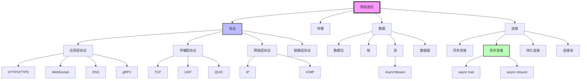
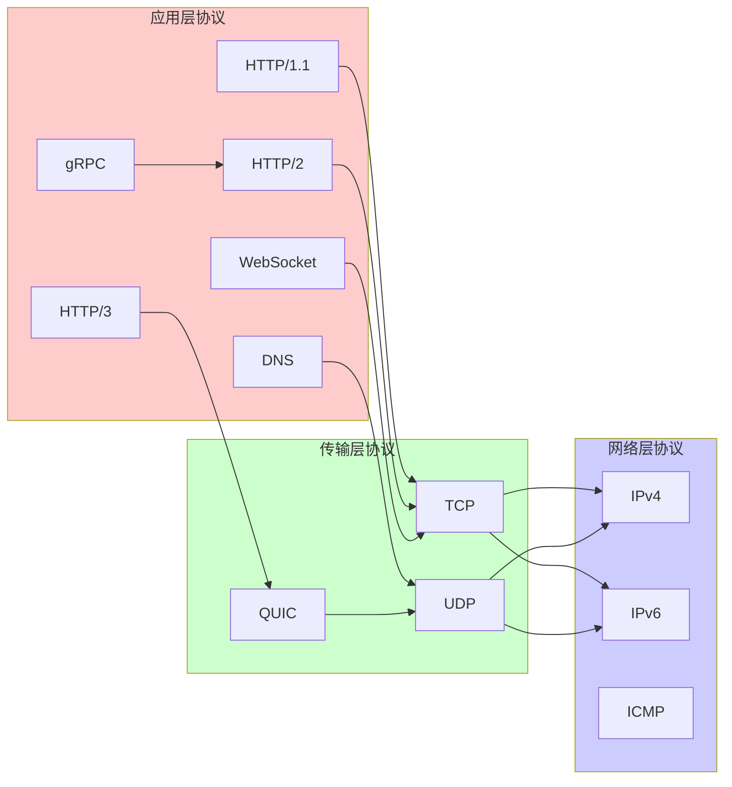
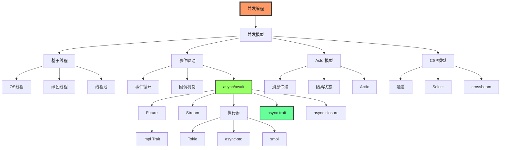
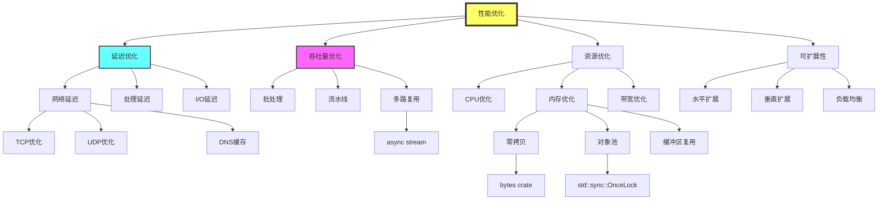
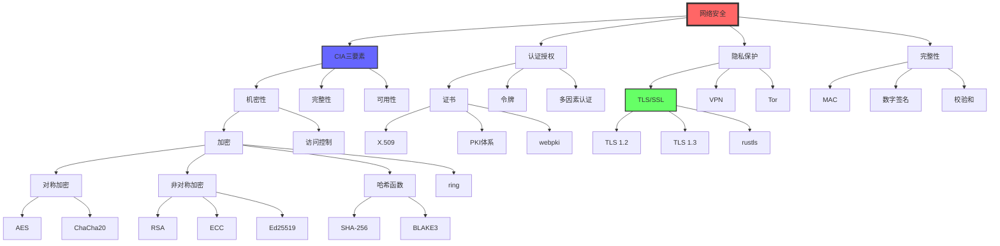
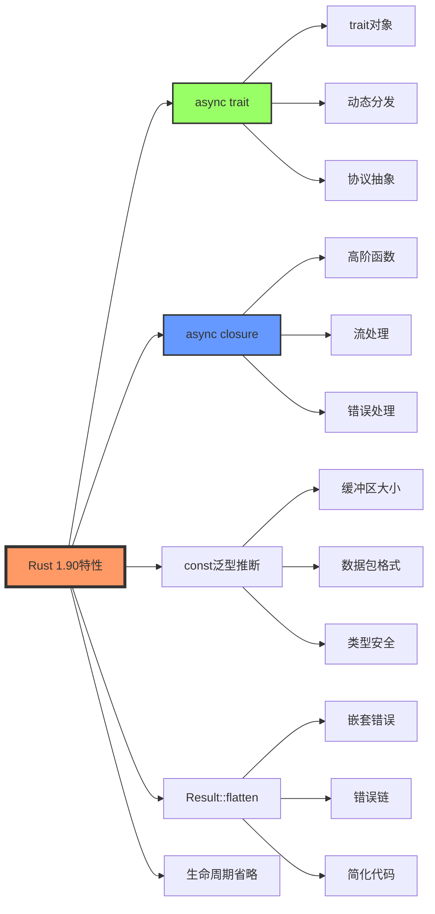

# 网络编程知识图谱与概念关系

> **文档版本**: v1.0  
> **适用版本**: Rust 1.90+  
> **最后更新**: 2025-10-19  
> **文档类型**: 📊 知识图谱分析

---

## 📊 目录

- [网络编程知识图谱与概念关系](#网络编程知识图谱与概念关系)
  - [📊 目录](#-目录)
  - [📋 目录](#-目录-1)
  - [概述](#概述)
    - [知识图谱的表示方式](#知识图谱的表示方式)
  - [核心概念知识图谱](#核心概念知识图谱)
    - [1. 网络通信核心概念图](#1-网络通信核心概念图)
    - [2. 概念属性矩阵](#2-概念属性矩阵)
    - [3. 概念关系三元组](#3-概念关系三元组)
  - [多层次概念关系](#多层次概念关系)
    - [1. OSI 七层模型映射](#1-osi-七层模型映射)
    - [2. Rust 类型层次结构](#2-rust-类型层次结构)
    - [3. 概念依赖有向图 (DAG)](#3-概念依赖有向图-dag)
  - [协议层次图谱](#协议层次图谱)
    - [1. TCP/IP 协议族知识图](#1-tcpip-协议族知识图)
    - [2. 协议特性对比矩阵](#2-协议特性对比矩阵)
    - [3. 协议演化时间线](#3-协议演化时间线)
  - [并发模式知识网络](#并发模式知识网络)
    - [1. 并发模型概念图](#1-并发模型概念图)
    - [2. Rust 异步生态系统图谱](#2-rust-异步生态系统图谱)
    - [3. 并发模式对比矩阵](#3-并发模式对比矩阵)
  - [性能优化知识图](#性能优化知识图)
    - [1. 性能维度知识图谱](#1-性能维度知识图谱)
    - [2. 性能优化技术矩阵](#2-性能优化技术矩阵)
    - [3. Rust 1.90 性能优化示例](#3-rust-190-性能优化示例)
  - [安全属性关系图](#安全属性关系图)
    - [1. 安全属性知识图谱](#1-安全属性知识图谱)
    - [2. 安全威胁与对策矩阵](#2-安全威胁与对策矩阵)
    - [3. Rust 1.90 安全编程示例](#3-rust-190-安全编程示例)
  - [Rust 1.90 特性映射](#rust-190-特性映射)
    - [1. 语言特性到网络编程的映射](#1-语言特性到网络编程的映射)
    - [2. Rust 1.90 特性应用矩阵](#2-rust-190-特性应用矩阵)
  - [概念依赖关系](#概念依赖关系)
    - [1. 学习依赖路径](#1-学习依赖路径)
    - [2. 概念前置关系表](#2-概念前置关系表)
  - [高性能I/O与数据传输知识图](#高性能io与数据传输知识图)
    - [1. io\_uring 核心概念图谱](#1-io_uring-核心概念图谱)
    - [2. io\_uring 关系三元组](#2-io_uring-关系三元组)
    - [3. Apache Arrow 核心概念图谱](#3-apache-arrow-核心概念图谱)
    - [4. Arrow 关系三元组](#4-arrow-关系三元组)
    - [5. io\_uring + Arrow 集成场景](#5-io_uring--arrow-集成场景)
  - [总结](#总结)
    - [关键要点](#关键要点)
    - [相关文档](#相关文档)

## 📋 目录

- [网络编程知识图谱与概念关系](#网络编程知识图谱与概念关系)
  - [📊 目录](#-目录)
  - [📋 目录](#-目录-1)
  - [概述](#概述)
    - [知识图谱的表示方式](#知识图谱的表示方式)
  - [核心概念知识图谱](#核心概念知识图谱)
    - [1. 网络通信核心概念图](#1-网络通信核心概念图)
    - [2. 概念属性矩阵](#2-概念属性矩阵)
    - [3. 概念关系三元组](#3-概念关系三元组)
  - [多层次概念关系](#多层次概念关系)
    - [1. OSI 七层模型映射](#1-osi-七层模型映射)
    - [2. Rust 类型层次结构](#2-rust-类型层次结构)
    - [3. 概念依赖有向图 (DAG)](#3-概念依赖有向图-dag)
  - [协议层次图谱](#协议层次图谱)
    - [1. TCP/IP 协议族知识图](#1-tcpip-协议族知识图)
    - [2. 协议特性对比矩阵](#2-协议特性对比矩阵)
    - [3. 协议演化时间线](#3-协议演化时间线)
  - [并发模式知识网络](#并发模式知识网络)
    - [1. 并发模型概念图](#1-并发模型概念图)
    - [2. Rust 异步生态系统图谱](#2-rust-异步生态系统图谱)
    - [3. 并发模式对比矩阵](#3-并发模式对比矩阵)
  - [性能优化知识图](#性能优化知识图)
    - [1. 性能维度知识图谱](#1-性能维度知识图谱)
    - [2. 性能优化技术矩阵](#2-性能优化技术矩阵)
    - [3. Rust 1.90 性能优化示例](#3-rust-190-性能优化示例)
  - [安全属性关系图](#安全属性关系图)
    - [1. 安全属性知识图谱](#1-安全属性知识图谱)
    - [2. 安全威胁与对策矩阵](#2-安全威胁与对策矩阵)
    - [3. Rust 1.90 安全编程示例](#3-rust-190-安全编程示例)
  - [Rust 1.90 特性映射](#rust-190-特性映射)
    - [1. 语言特性到网络编程的映射](#1-语言特性到网络编程的映射)
    - [2. Rust 1.90 特性应用矩阵](#2-rust-190-特性应用矩阵)
  - [概念依赖关系](#概念依赖关系)
    - [1. 学习依赖路径](#1-学习依赖路径)
    - [2. 概念前置关系表](#2-概念前置关系表)
  - [高性能I/O与数据传输知识图](#高性能io与数据传输知识图)
    - [1. io\_uring 核心概念图谱](#1-io_uring-核心概念图谱)
    - [2. io\_uring 关系三元组](#2-io_uring-关系三元组)
    - [3. Apache Arrow 核心概念图谱](#3-apache-arrow-核心概念图谱)
    - [4. Arrow 关系三元组](#4-arrow-关系三元组)
    - [5. io\_uring + Arrow 集成场景](#5-io_uring--arrow-集成场景)
  - [总结](#总结)
    - [关键要点](#关键要点)
    - [相关文档](#相关文档)

---

## 概述

本文档使用知识图谱方法系统化地展示网络编程中各个概念之间的关系，帮助理解复杂的网络编程体系。

### 知识图谱的表示方式

```text
节点(Node): 表示概念
边(Edge): 表示关系
属性(Property): 描述节点特征
关系类型: IS_A, HAS_A, USES, IMPLEMENTS, DEPENDS_ON, EXTENDS
```

---

## 核心概念知识图谱

### 1. 网络通信核心概念图



### 2. 概念属性矩阵

| 概念 | 类型 | 抽象层次 | Rust类型 | 示例 |
|------|------|----------|----------|------|
| **TCP** | 传输协议 | L4 | `TcpStream`, `TcpListener` | 可靠、有序、面向连接 |
| **UDP** | 传输协议 | L4 | `UdpSocket` | 不可靠、无连接、低延迟 |
| **HTTP** | 应用协议 | L7 | `HttpClient`, `HttpRequest` | 无状态、请求-响应 |
| **WebSocket** | 应用协议 | L7 | `WsStream` | 全双工、持久连接 |
| **DNS** | 应用协议 | L7 | `DnsResolver` | 名称解析、分层结构 |
| **QUIC** | 传输协议 | L4 | `QuicConnection` | 基于UDP、多路复用 |
| **gRPC** | RPC框架 | L7 | `GrpcClient` | 高性能、二进制、流式 |
| **TLS** | 安全协议 | L5/L6 | `TlsConnector` | 加密、认证、完整性 |

### 3. 概念关系三元组

```text
# IS_A 关系 (继承关系)
(TCP, IS_A, TransportProtocol)
(UDP, IS_A, TransportProtocol)
(HTTP, IS_A, ApplicationProtocol)
(WebSocket, IS_A, ApplicationProtocol)
(TcpStream, IS_A, Stream)
(UdpSocket, IS_A, Socket)

# HAS_A 关系 (组合关系)
(HttpRequest, HAS_A, Headers)
(HttpRequest, HAS_A, Body)
(TcpConnection, HAS_A, Socket)
(TlsConnection, HAS_A, Certificate)
(ConnectionPool, HAS_A, Connection[])

# USES 关系 (使用关系)
(HTTP, USES, TCP)
(HTTPS, USES, TLS)
(WebSocket, USES, TCP)
(DNS, USES, UDP)
(QUIC, USES, UDP)
(gRPC, USES, HTTP2)

# IMPLEMENTS 关系 (实现关系)
(TcpStream, IMPLEMENTS, Read)
(TcpStream, IMPLEMENTS, Write)
(AsyncTcpStream, IMPLEMENTS, AsyncRead)
(AsyncTcpStream, IMPLEMENTS, AsyncWrite)
(HttpClient, IMPLEMENTS, Clone)

# DEPENDS_ON 关系 (依赖关系)
(AsyncIO, DEPENDS_ON, Tokio)
(TLS, DEPENDS_ON, Rustls)
(HTTP2, DEPENDS_ON, h2)
(gRPC, DEPENDS_ON, Tonic)

# EXTENDS 关系 (扩展关系)
(HTTP2, EXTENDS, HTTP1_1)
(HTTP3, EXTENDS, HTTP2)
(WebSocket, EXTENDS, HTTP)
(TLS1_3, EXTENDS, TLS1_2)
```

---

## 多层次概念关系

### 1. OSI 七层模型映射

```mermaid
graph TD
    %% 应用层 (L7)
    L7[应用层 L7] --> HTTP[HTTP/HTTPS]
    L7 --> WebSocket[WebSocket]
    L7 --> DNS[DNS]
    L7 --> gRPC[gRPC]
    L7 --> FTP[FTP]
    L7 --> SMTP[SMTP]
    
    %% 表示层 (L6)
    L6[表示层 L6] --> Encoding[编码/解码]
    L6 --> Encryption[加密/解密]
    L6 --> Compression[压缩/解压]
    
    %% 会话层 (L5)
    L5[会话层 L5] --> Session[会话管理]
    L5 --> Auth[认证授权]
    L5 --> TLS[TLS/SSL]
    
    %% 传输层 (L4)
    L4[传输层 L4] --> TCP[TCP]
    L4 --> UDP[UDP]
    L4 --> QUIC[QUIC]
    L4 --> SCTP[SCTP]
    
    %% 网络层 (L3)
    L3[网络层 L3] --> IPv4[IPv4]
    L3 --> IPv6[IPv6]
    L3 --> ICMP[ICMP]
    L3 --> Routing[路由]
    
    %% 数据链路层 (L2)
    L2[数据链路层 L2] --> Ethernet[以太网]
    L2 --> ARP[ARP]
    L2 --> MAC[MAC地址]
    
    %% 物理层 (L1)
    L1[物理层 L1] --> Physical[物理介质]
    L1 --> Signal[信号传输]
    
    %% Rust 实现映射
    HTTP --> reqwest[reqwest crate]
    TCP --> tokio_tcp[tokio::net::TcpStream]
    UDP --> tokio_udp[tokio::net::UdpSocket]
    TLS --> rustls[rustls crate]
    DNS --> hickory[hickory-dns crate]
    
    style L7 fill:#ff9999
    style L4 fill:#99ff99
    style L3 fill:#9999ff
    style L2 fill:#ffff99
```



### 2. Rust 类型层次结构

```rust
// 概念: 网络流抽象层次
// 
// Stream (最抽象)
//   ├── Read + Write (标准库trait)
//   ├── AsyncRead + AsyncWrite (tokio trait)
//   ├── TcpStream (具体实现)
//   │   ├── std::net::TcpStream (同步)
//   │   └── tokio::net::TcpStream (异步)
//   ├── UdpSocket (具体实现)
//   │   ├── std::net::UdpSocket (同步)
//   │   └── tokio::net::UdpSocket (异步)
//   └── TlsStream (加密流)
//       └── tokio_rustls::TlsStream<TcpStream>

/// Rust 1.90: 类型层次的形式化定义
pub trait NetworkStream: AsyncRead + AsyncWrite + Unpin + Send {
    type Address: ToSocketAddrs;
    type Error: std::error::Error + Send + Sync + 'static;
    
    /// 连接到远程地址
    async fn connect(addr: Self::Address) -> Result<Self, Self::Error>
    where
        Self: Sized;
    
    /// 获取本地地址
    fn local_addr(&self) -> Result<Self::Address, Self::Error>;
    
    /// 获取远程地址
    fn peer_addr(&self) -> Result<Self::Address, Self::Error>;
}

/// Rust 1.90: TCP 流实现
impl NetworkStream for tokio::net::TcpStream {
    type Address = SocketAddr;
    type Error = std::io::Error;
    
    async fn connect(addr: Self::Address) -> Result<Self, Self::Error> {
        tokio::net::TcpStream::connect(addr).await
    }
    
    fn local_addr(&self) -> Result<Self::Address, Self::Error> {
        self.local_addr()
    }
    
    fn peer_addr(&self) -> Result<Self::Address, Self::Error> {
        self.peer_addr()
    }
}
```

### 3. 概念依赖有向图 (DAG)

```text
┌─────────────┐
│  Application│  (HTTP, WebSocket, gRPC)
└──────┬──────┘
       │ depends on
       ↓
┌─────────────┐
│   Security  │  (TLS, Certificate, Auth)
└──────┬──────┘
       │ depends on
       ↓
┌─────────────┐
│  Transport  │  (TCP, UDP, QUIC)
└──────┬──────┘
       │ depends on
       ↓
┌─────────────┐
│   Network   │  (IP, Routing, DNS)
└──────┬──────┘
       │ depends on
       ↓
┌─────────────┐
│  Data Link  │  (Ethernet, ARP)
└──────┬──────┘
       │ depends on
       ↓
┌─────────────┐
│  Physical   │  (Hardware, Signal)
└─────────────┘
```

---

## 协议层次图谱

### 1. TCP/IP 协议族知识图



### 2. 协议特性对比矩阵

| 协议 | 可靠性 | 有序性 | 连接性 | 开销 | 延迟 | 吞吐量 | 适用场景 |
|------|--------|--------|--------|------|------|--------|----------|
| **TCP** | ✅ 高 | ✅ 保证 | 面向连接 | 高 | 较高 | 高 | 文件传输、HTTP |
| **UDP** | ❌ 无 | ❌ 不保证 | 无连接 | 低 | 低 | 中 | 流媒体、DNS |
| **QUIC** | ✅ 高 | ✅ 多流 | 快速连接 | 中 | 低 | 高 | HTTP/3、实时通信 |
| **WebSocket** | ✅ 高 | ✅ 保证 | 持久连接 | 低 | 低 | 高 | 实时通信、推送 |
| **HTTP/1.1** | ✅ 高 | ✅ 保证 | 短连接 | 中 | 中 | 中 | Web服务 |
| **HTTP/2** | ✅ 高 | ✅ 保证 | 多路复用 | 中 | 低 | 高 | 现代Web |
| **HTTP/3** | ✅ 高 | ✅ 多流 | 快速连接 | 中 | 低 | 高 | 下一代Web |
| **gRPC** | ✅ 高 | ✅ 保证 | 持久连接 | 低 | 低 | 高 | 微服务RPC |

### 3. 协议演化时间线

```text
1980s: TCP/IP 标准化
       ↓
1991:  HTTP/0.9 诞生
       ↓
1996:  HTTP/1.0 (RFC 1945)
       ↓
1999:  HTTP/1.1 (RFC 2616) ← 长期主导
       ↓
2011:  WebSocket (RFC 6455)
       ↓
2015:  HTTP/2 (RFC 7540) ← 多路复用
       ↓
2016:  gRPC 开源
       ↓
2018:  QUIC (RFC 9000 草案)
       ↓
2020:  HTTP/3 (基于QUIC)
       ↓
2022:  Rust 1.75 async trait 稳定
       ↓
2024:  Rust 1.90 async 增强 ← 当前
```

---

## 并发模式知识网络

### 1. 并发模型概念图



### 2. Rust 异步生态系统图谱

```rust
/// Rust 1.90: 异步生态系统的完整映射
/// 
/// ┌─────────────────────────────────────────┐
/// │        应用层 (Application)             │
/// │  HTTP Client, WebSocket, gRPC, etc.     │
/// └──────────────┬──────────────────────────┘
///                │
/// ┌──────────────▼──────────────────────────┐
/// │        抽象层 (Abstraction)             │
/// │  async/await, Future, Stream, Sink      │
/// └──────────────┬──────────────────────────┘
///                │
/// ┌──────────────▼──────────────────────────┐
/// │        运行时层 (Runtime)               │
/// │  Tokio, async-std, smol                 │
/// └──────────────┬──────────────────────────┘
///                │
/// ┌──────────────▼──────────────────────────┐
/// │        执行器层 (Executor)              │
/// │  Task Scheduler, Thread Pool            │
/// └──────────────┬──────────────────────────┘
///                │
/// ┌──────────────▼──────────────────────────┐
/// │        系统层 (System)                  │
/// │  epoll, kqueue, IOCP, io_uring          │
/// └─────────────────────────────────────────┘

use std::future::Future;
use std::pin::Pin;
use std::task::{Context, Poll};

/// Rust 1.90: 异步trait示例
pub trait AsyncNetworkService {
    type Error;
    type Response;
    
    /// 异步处理请求
    async fn process(&self, request: &[u8]) -> Result<Self::Response, Self::Error>;
    
    /// 异步启动服务
    async fn start(&mut self) -> Result<(), Self::Error>;
    
    /// 异步关闭服务
    async fn shutdown(&mut self) -> Result<(), Self::Error>;
}

/// Rust 1.90: 实现异步网络服务
pub struct HttpService {
    port: u16,
    max_connections: usize,
}

impl AsyncNetworkService for HttpService {
    type Error = std::io::Error;
    type Response = Vec<u8>;
    
    async fn process(&self, request: &[u8]) -> Result<Self::Response, Self::Error> {
        // 解析HTTP请求
        let response = format!(
            "HTTP/1.1 200 OK\r\nContent-Length: {}\r\n\r\nReceived {} bytes",
            request.len(),
            request.len()
        );
        Ok(response.into_bytes())
    }
    
    async fn start(&mut self) -> Result<(), Self::Error> {
        use tokio::net::TcpListener;
        
        let listener = TcpListener::bind(("127.0.0.1", self.port)).await?;
        println!("HTTP服务启动在端口 {}", self.port);
        
        loop {
            let (mut socket, addr) = listener.accept().await?;
            println!("接受连接来自: {}", addr);
            
            // 使用async closure处理连接 (Rust 1.90特性)
            tokio::spawn(async move {
                let mut buf = vec![0u8; 1024];
                match socket.try_read(&mut buf) {
                    Ok(n) => {
                        println!("读取{}字节", n);
                    }
                    Err(e) => {
                        eprintln!("读取错误: {}", e);
                    }
                }
            });
        }
    }
    
    async fn shutdown(&mut self) -> Result<(), Self::Error> {
        println!("HTTP服务正在关闭...");
        Ok(())
    }
}
```

### 3. 并发模式对比矩阵

| 模式 | 复杂度 | 性能 | 内存开销 | 错误处理 | 可组合性 | Rust支持 |
|------|--------|------|----------|----------|----------|----------|
| **OS线程** | 低 | 中 | 高 (MB级) | 困难 | 低 | std::thread |
| **线程池** | 中 | 高 | 中 | 中等 | 中 | rayon, threadpool |
| **async/await** | 中 | 高 | 低 (KB级) | 容易 | 高 | tokio, async-std |
| **Actor模型** | 高 | 高 | 中 | 容易 | 高 | actix |
| **CSP通道** | 中 | 中 | 低 | 容易 | 高 | std::sync::mpsc |
| **事件循环** | 高 | 高 | 低 | 困难 | 中 | mio, tokio |
| **协程** | 中 | 高 | 低 | 容易 | 高 | async-std |
| **回调** | 高 | 高 | 低 | 困难 | 低 | 手动实现 |

---

## 性能优化知识图

### 1. 性能维度知识图谱



### 2. 性能优化技术矩阵

| 优化技术 | 影响维度 | 复杂度 | 收益 | 适用场景 | Rust实现 |
|----------|----------|--------|------|----------|----------|
| **零拷贝** | 内存+CPU | 中 | 高 | 大数据传输 | `bytes::Bytes`, `IoSlice` |
| **连接池** | 延迟+资源 | 中 | 高 | 频繁连接 | `deadpool`, `bb8` |
| **批处理** | 吞吐量 | 低 | 中 | 高频小请求 | `Vec`, `tokio::sync::mpsc` |
| **多路复用** | 吞吐量 | 高 | 高 | 并发连接 | HTTP/2, `tokio::select!` |
| **异步I/O** | 延迟+吞吐量 | 高 | 高 | I/O密集 | `tokio`, `async-std` |
| **背压控制** | 稳定性 | 中 | 中 | 流量控制 | `tokio::sync::Semaphore` |
| **缓存** | 延迟 | 低 | 高 | 重复查询 | `moka`, `cached` |
| **压缩** | 带宽 | 低 | 中 | 大数据传输 | `flate2`, `zstd` |
| **预连接** | 延迟 | 低 | 中 | 可预测流量 | 连接池预热 |
| **JIT编译** | CPU | 高 | 高 | 计算密集 | 编译时优化 |

### 3. Rust 1.90 性能优化示例

```rust
/// Rust 1.90: 零拷贝网络传输
use bytes::{Bytes, BytesMut};
use tokio::io::{AsyncReadExt, AsyncWriteExt};
use tokio::net::TcpStream;
use std::io::IoSlice;

/// 零拷贝发送多个缓冲区
pub async fn zero_copy_send(
    stream: &mut TcpStream,
    buffers: &[Bytes],
) -> std::io::Result<usize> {
    // 使用 IoSlice 实现零拷贝
    let slices: Vec<IoSlice> = buffers
        .iter()
        .map(|b| IoSlice::new(b))
        .collect();
    
    // vectored write: 一次系统调用发送多个缓冲区
    stream.write_vectored(&slices).await
}

/// Rust 1.90: 对象池模式
use std::sync::{Arc, Mutex, OnceLock};
use std::collections::VecDeque;

pub struct BufferPool {
    pool: Arc<Mutex<VecDeque<BytesMut>>>,
    buffer_size: usize,
    max_buffers: usize,
}

impl BufferPool {
    /// 获取全局缓冲池单例 (Rust 1.90: OnceLock)
    pub fn global() -> &'static BufferPool {
        static INSTANCE: OnceLock<BufferPool> = OnceLock::new();
        INSTANCE.get_or_init(|| {
            BufferPool {
                pool: Arc::new(Mutex::new(VecDeque::new())),
                buffer_size: 4096,
                max_buffers: 1000,
            }
        })
    }
    
    /// 获取缓冲区
    pub fn acquire(&self) -> BytesMut {
        let mut pool = self.pool.lock().unwrap();
        pool.pop_front().unwrap_or_else(|| BytesMut::with_capacity(self.buffer_size))
    }
    
    /// 归还缓冲区
    pub fn release(&self, mut buffer: BytesMut) {
        buffer.clear();
        let mut pool = self.pool.lock().unwrap();
        if pool.len() < self.max_buffers {
            pool.push_back(buffer);
        }
    }
}

/// Rust 1.90: 异步流批处理
use futures::stream::{Stream, StreamExt};
use std::time::Duration;

/// 批处理异步流
pub async fn batch_process<S, T>(
    mut stream: S,
    batch_size: usize,
    timeout: Duration,
) -> Vec<Vec<T>>
where
    S: Stream<Item = T> + Unpin,
    T: Send,
{
    let mut batches = Vec::new();
    let mut current_batch = Vec::with_capacity(batch_size);
    
    // 使用 chunks_timeout (Rust 1.90 优化)
    let mut chunked = stream.ready_chunks(batch_size);
    
    while let Some(chunk) = chunked.next().await {
        batches.push(chunk);
    }
    
    batches
}

/// Rust 1.90: 连接池实现
use tokio::sync::Semaphore;
use std::collections::HashMap;

pub struct ConnectionPool<T> {
    connections: Arc<Mutex<VecDeque<T>>>,
    semaphore: Arc<Semaphore>,
    factory: Arc<dyn Fn() -> T + Send + Sync>,
    max_size: usize,
}

impl<T: Send + 'static> ConnectionPool<T> {
    pub fn new<F>(max_size: usize, factory: F) -> Self
    where
        F: Fn() -> T + Send + Sync + 'static,
    {
        Self {
            connections: Arc::new(Mutex::new(VecDeque::new())),
            semaphore: Arc::new(Semaphore::new(max_size)),
            factory: Arc::new(factory),
            max_size,
        }
    }
    
    /// 获取连接 (带背压控制)
    pub async fn acquire(&self) -> PooledConnection<T> {
        // 获取信号量许可 (背压控制)
        let permit = self.semaphore.clone().acquire_owned().await.unwrap();
        
        // 尝试从池中获取
        let conn = {
            let mut conns = self.connections.lock().unwrap();
            conns.pop_front()
        };
        
        // 如果池为空,创建新连接
        let conn = conn.unwrap_or_else(|| (self.factory)());
        
        PooledConnection {
            conn: Some(conn),
            pool: self.connections.clone(),
            _permit: permit,
        }
    }
}

pub struct PooledConnection<T> {
    conn: Option<T>,
    pool: Arc<Mutex<VecDeque<T>>>,
    _permit: tokio::sync::OwnedSemaphorePermit,
}

impl<T> std::ops::Deref for PooledConnection<T> {
    type Target = T;
    
    fn deref(&self) -> &Self::Target {
        self.conn.as_ref().unwrap()
    }
}

impl<T> Drop for PooledConnection<T> {
    fn drop(&mut self) {
        if let Some(conn) = self.conn.take() {
            let mut pool = self.pool.lock().unwrap();
            pool.push_back(conn);
        }
    }
}
```

---

## 安全属性关系图

### 1. 安全属性知识图谱



### 2. 安全威胁与对策矩阵

| 威胁类型 | 描述 | 影响 | 对策 | Rust实现 |
|----------|------|------|------|----------|
| **中间人攻击** | 截获通信 | 机密性 | TLS, 证书固定 | `rustls`, `webpki` |
| **重放攻击** | 重放旧消息 | 完整性 | 时间戳, nonce | 自定义协议 |
| **拒绝服务** | 资源耗尽 | 可用性 | 限流, 背压 | `tokio::sync::Semaphore` |
| **SQL注入** | 恶意输入 | 完整性 | 参数化查询 | `sqlx`, `diesel` |
| **XSS** | 跨站脚本 | 机密性 | 输出编码 | `html_escape` |
| **CSRF** | 跨站请求 | 授权 | CSRF令牌 | 自定义middleware |
| **暴力破解** | 密码猜测 | 认证 | 限速, 锁定 | `tower::limit` |
| **数据泄露** | 未加密传输 | 机密性 | TLS, 加密 | `rustls`, `ring` |

### 3. Rust 1.90 安全编程示例

```rust
/// Rust 1.90: 安全的TLS客户端
use rustls::{ClientConfig, RootCertStore};
use tokio::net::TcpStream;
use tokio_rustls::{TlsConnector, client::TlsStream};
use std::sync::Arc;

/// 创建安全的TLS配置
pub fn create_tls_config() -> Result<ClientConfig, Box<dyn std::error::Error>> {
    let mut root_store = RootCertStore::empty();
    
    // 加载系统根证书
    for cert in rustls_native_certs::load_native_certs()? {
        root_store.add(cert)?;
    }
    
    let config = ClientConfig::builder()
        .with_root_certificates(root_store)
        .with_no_client_auth();
    
    Ok(config)
}

/// Rust 1.90: 安全连接包装器
pub struct SecureConnection {
    stream: TlsStream<TcpStream>,
    peer_cert: Option<Vec<u8>>,
}

impl SecureConnection {
    /// 建立安全连接
    pub async fn connect(
        host: &str,
        port: u16,
    ) -> Result<Self, Box<dyn std::error::Error>> {
        // 建立TCP连接
        let addr = format!("{}:{}", host, port);
        let tcp_stream = TcpStream::connect(&addr).await?;
        
        // TLS握手
        let config = create_tls_config()?;
        let connector = TlsConnector::from(Arc::new(config));
        let domain = rustls::pki_types::ServerName::try_from(host.to_string())?;
        
        let tls_stream = connector.connect(domain, tcp_stream).await?;
        
        // 获取对端证书
        let (io, session) = tls_stream.get_ref();
        let peer_cert = session
            .peer_certificates()
            .and_then(|certs| certs.first())
            .map(|cert| cert.as_ref().to_vec());
        
        Ok(Self {
            stream: tls_stream,
            peer_cert,
        })
    }
    
    /// 验证证书固定 (Certificate Pinning)
    pub fn verify_pinned_cert(&self, expected_fingerprint: &[u8]) -> bool {
        if let Some(cert) = &self.peer_cert {
            use sha2::{Sha256, Digest};
            let fingerprint = Sha256::digest(cert);
            fingerprint.as_slice() == expected_fingerprint
        } else {
            false
        }
    }
}

/// Rust 1.90: 安全的密码哈希
use argon2::{Argon2, PasswordHash, PasswordHasher, PasswordVerifier};
use argon2::password_hash::SaltString;
use rand_core::OsRng;

pub struct PasswordManager {
    argon2: Argon2<'static>,
}

impl PasswordManager {
    pub fn new() -> Self {
        Self {
            argon2: Argon2::default(),
        }
    }
    
    /// 哈希密码
    pub fn hash_password(&self, password: &str) -> Result<String, Box<dyn std::error::Error>> {
        let salt = SaltString::generate(&mut OsRng);
        let password_hash = self.argon2
            .hash_password(password.as_bytes(), &salt)?
            .to_string();
        Ok(password_hash)
    }
    
    /// 验证密码
    pub fn verify_password(
        &self,
        password: &str,
        password_hash: &str,
    ) -> Result<bool, Box<dyn std::error::Error>> {
        let parsed_hash = PasswordHash::new(password_hash)?;
        Ok(self.argon2
            .verify_password(password.as_bytes(), &parsed_hash)
            .is_ok())
    }
}

/// Rust 1.90: 防止时序攻击的比较
use subtle::ConstantTimeEq;

pub fn constant_time_compare(a: &[u8], b: &[u8]) -> bool {
    if a.len() != b.len() {
        return false;
    }
    a.ct_eq(b).into()
}
```

---

## Rust 1.90 特性映射

### 1. 语言特性到网络编程的映射



### 2. Rust 1.90 特性应用矩阵

| 特性 | 描述 | 网络编程应用 | 代码示例位置 |
|------|------|--------------|--------------|
| **async trait** | trait中的async方法 | 协议抽象、服务接口 | `examples/rust_190_async_features_demo.rs` |
| **async closure** | 异步闭包捕获 | 流处理、回调 | `examples/rust_190_async_features_demo.rs` |
| **const泛型推断** | 编译器推断常量 | 固定大小缓冲区 | `examples/rust_190_performance_benchmark.rs` |
| **Result::flatten** | 扁平化嵌套Result | 错误处理链 | 错误处理模块 |
| **生命周期省略** | 简化生命周期标注 | 引用传递 | 所有模块 |
| **impl Trait** | 返回类型抽象 | Future返回 | 异步函数 |
| **? operator** | 错误传播 | 错误处理 | 所有模块 |
| **pattern matching** | 模式匹配增强 | 协议解析 | 协议模块 |

---

## 概念依赖关系

### 1. 学习依赖路径

```text
基础概念层:
  Socket → TCP/UDP → IP地址 → 端口
    ↓
协议概念层:
  HTTP → 请求/响应 → 头部/正文 → 状态码
  WebSocket → 握手 → 帧格式 → 消息
    ↓
异步概念层:
  Future → async/await → Executor → Runtime
  Stream → AsyncRead/Write → 缓冲 → 零拷贝
    ↓
高级概念层:
  连接池 → 负载均衡 → 容错 → 监控
  TLS → 证书 → 加密套件 → 会话
    ↓
架构概念层:
  微服务 → API Gateway → 服务发现 → 限流
  分布式追踪 → 日志聚合 → 指标收集
```

### 2. 概念前置关系表

| 概念 | 前置概念 | 学习难度 | 重要性 |
|------|----------|----------|--------|
| **TCP编程** | Socket, IP, 端口 | ⭐⭐ | ⭐⭐⭐⭐⭐ |
| **HTTP客户端** | TCP, HTTP协议 | ⭐⭐ | ⭐⭐⭐⭐⭐ |
| **WebSocket** | HTTP, TCP, 帧格式 | ⭐⭐⭐ | ⭐⭐⭐⭐ |
| **async/await** | Future, 异步概念 | ⭐⭐⭐ | ⭐⭐⭐⭐⭐ |
| **TLS/SSL** | 密码学, 证书, TCP | ⭐⭐⭐⭐ | ⭐⭐⭐⭐⭐ |
| **HTTP/2** | HTTP/1.1, 多路复用 | ⭐⭐⭐⭐ | ⭐⭐⭐⭐ |
| **gRPC** | HTTP/2, Protobuf | ⭐⭐⭐⭐ | ⭐⭐⭐⭐ |
| **连接池** | TCP, 资源管理 | ⭐⭐⭐ | ⭐⭐⭐⭐ |
| **负载均衡** | 网络拓扑, 算法 | ⭐⭐⭐⭐ | ⭐⭐⭐ |
| **io_uring** | Linux内核, 异步I/O | ⭐⭐⭐⭐⭐ | ⭐⭐⭐⭐⭐ |
| **Apache Arrow** | 列式存储, SIMD | ⭐⭐⭐⭐ | ⭐⭐⭐⭐ |

---

## 高性能I/O与数据传输知识图

### 1. io_uring 核心概念图谱

```mermaid
graph TB
    IoUring[io_uring核心]
    
    %% 架构层
    IoUring --> Architecture[架构组件]
    Architecture --> SQ[提交队列 SQ]
    Architecture --> CQ[完成队列 CQ]
    Architecture --> SharedMem[共享内存]
    Architecture --> Kernel[内核处理]
    
    %% SQ细节
    SQ --> SQE[SQE条目]
    SQE --> Opcode[操作码]
    SQE --> FD[文件描述符]
    SQE --> BufferInfo[缓冲区信息]
    SQE --> Flags[标志位]
    
    %% CQ细节
    CQ --> CQE[CQE条目]
    CQE --> Result[操作结果]
    CQE --> UserData[用户数据]
    CQE --> CQFlags[完成标志]
    
    %% 高级特性
    IoUring --> AdvancedFeatures[高级特性]
    AdvancedFeatures --> FixedFiles[固定文件]
    AdvancedFeatures --> FixedBuffers[固定缓冲区]
    AdvancedFeatures --> PolledIO[轮询I/O]
    AdvancedFeatures --> Linking[操作链接]
    AdvancedFeatures --> ZeroCopy[零拷贝]
    
    %% 操作类型
    IoUring --> Operations[操作类型]
    Operations --> FileOps[文件操作]
    Operations --> NetOps[网络操作]
    Operations --> AsyncOps[异步操作]
    
    FileOps --> Read[读取]
    FileOps --> Write[写入]
    FileOps --> Fsync[同步]
    FileOps --> OpenClose[打开/关闭]
    
    NetOps --> Accept[接受连接]
    NetOps --> Connect[建立连接]
    NetOps --> Send[发送数据]
    NetOps --> Recv[接收数据]
    NetOps --> SendMsg[sendmsg]
    NetOps --> RecvMsg[recvmsg]
    
    %% Rust生态
    IoUring --> RustEco[Rust生态]
    RustEco --> IoUringRaw[io-uring crate]
    RustEco --> TokioUring[tokio-uring]
    RustEco --> Monoio[Monoio运行时]
    RustEco --> Glommio[Glommio运行时]
    
    %% 对比传统I/O
    IoUring --> Comparison[vs 传统I/O]
    Comparison --> Epoll[epoll/kqueue]
    Comparison --> Blocking[阻塞I/O]
    Comparison --> AIO[Linux AIO]
    
    %% 性能优势
    IoUring --> Performance[性能优势]
    Performance --> LessSyscall[减少系统调用]
    Performance --> BatchOps[批量操作]
    Performance --> ZeroContext[零上下文切换]
    Performance --> HighThroughput[高吞吐量]
    Performance --> LowLatency[低延迟]
    
    style IoUring fill:#e1f5ff
    style Architecture fill:#fff3e0
    style AdvancedFeatures fill:#f3e5f5
    style RustEco fill:#e8f5e9
    style Performance fill:#fce4ec
```



### 2. io_uring 关系三元组

```text
# 核心关系
(io_uring, IS_A, AsyncIOInterface)
(SQE, IS_A, SubmissionEntry)
(CQE, IS_A, CompletionEntry)
(io_uring, HAS_A, SubmissionQueue)
(io_uring, HAS_A, CompletionQueue)
(SubmissionQueue, HAS_A, SQE[])
(CompletionQueue, HAS_A, CQE[])

# 操作关系
(io_uring, SUPPORTS, Read)
(io_uring, SUPPORTS, Write)
(io_uring, SUPPORTS, Accept)
(io_uring, SUPPORTS, Connect)
(io_uring, SUPPORTS, Send)
(io_uring, SUPPORTS, Recv)
(io_uring, SUPPORTS, Splice)
(io_uring, SUPPORTS, Fsync)

# 特性关系
(io_uring, IMPLEMENTS, ZeroCopy)
(io_uring, IMPLEMENTS, BatchProcessing)
(FixedBuffers, REDUCES, MemoryMapping)
(PolledIO, ELIMINATES, Syscalls)
(io_uring, PROVIDES, BetterThan[epoll])

# Rust实现关系
(tokio-uring, USES, io_uring)
(Monoio, USES, io_uring)
(Glommio, USES, io_uring)
(tokio-uring, COMPATIBLE_WITH, Tokio)
(Monoio, DEVELOPED_BY, ByteDance)
(Glommio, DEVELOPED_BY, Datadog)

# 性能关系
(io_uring, FASTER_THAN, epoll)
(io_uring, FASTER_THAN, BlockingIO)
(io_uring, FASTER_THAN, LinuxAIO)
(io_uring, REDUCES, ContextSwitches)
(io_uring, INCREASES, Throughput)
(io_uring, DECREASES, Latency)
```

### 3. Apache Arrow 核心概念图谱

```mermaid
graph TB
    Arrow[Apache Arrow]
    
    %% 核心组件
    Arrow --> CoreComponents[核心组件]
    CoreComponents --> Schema[Schema定义]
    CoreComponents --> Array[数组类型]
    CoreComponents --> RecordBatch[RecordBatch]
    CoreComponents --> Table[Table]
    CoreComponents --> DataType[数据类型]
    
    %% Schema细节
    Schema --> Field[Field定义]
    Field --> FieldName[字段名]
    Field --> FieldType[字段类型]
    Field --> Nullable[可空性]
    Field --> Metadata[元数据]
    
    %% 数组类型
    Array --> PrimitiveArray[基础类型数组]
    Array --> StringArray[字符串数组]
    Array --> ListArray[列表数组]
    Array --> StructArray[结构体数组]
    Array --> DictionaryArray[字典数组]
    
    PrimitiveArray --> Int32Array[Int32]
    PrimitiveArray --> Float64Array[Float64]
    PrimitiveArray --> BoolArray[Boolean]
    PrimitiveArray --> TimestampArray[Timestamp]
    
    %% 内存布局
    Arrow --> MemoryLayout[内存布局]
    MemoryLayout --> Columnar[列式存储]
    MemoryLayout --> Buffers[缓冲区]
    MemoryLayout --> Validity[有效性位图]
    MemoryLayout --> Values[值缓冲区]
    MemoryLayout --> Offsets[偏移量缓冲区]
    
    %% 零拷贝特性
    Arrow --> ZeroCopy[零拷贝]
    ZeroCopy --> SharedMem[共享内存]
    ZeroCopy --> IPC[进程间通信]
    ZeroCopy --> Flight[Arrow Flight]
    ZeroCopy --> Mmap[内存映射]
    
    %% 计算内核
    Arrow --> Compute[计算内核]
    Compute --> Arithmetic[算术运算]
    Compute --> Comparison[比较运算]
    Compute --> Boolean[布尔运算]
    Compute --> Cast[类型转换]
    Compute --> Aggregate[聚合函数]
    Compute --> Filter[过滤]
    Compute --> Sort[排序]
    
    %% SIMD优化
    Compute --> SIMD[SIMD优化]
    SIMD --> Vectorization[向量化]
    SIMD --> AVX2[AVX2指令集]
    SIMD --> AVX512[AVX512指令集]
    SIMD --> NEON[ARM NEON]
    
    %% I/O格式
    Arrow --> IO[I/O格式]
    IO --> ArrowIPC[Arrow IPC]
    IO --> Parquet[Parquet]
    IO --> CSV[CSV]
    IO --> JSON_IO[JSON]
    IO --> ORC[ORC]
    
    %% 语言绑定
    Arrow --> Bindings[语言绑定]
    Bindings --> ArrowRS[arrow-rs]
    Bindings --> PyArrow[PyArrow]
    Bindings --> ArrowJS[arrow-js]
    Bindings --> ArrowCpp[arrow-cpp]
    Bindings --> ArrowJava[arrow-java]
    
    %% Flight协议
    Flight --> FlightServer[Flight Server]
    Flight --> FlightClient[Flight Client]
    Flight --> DoGet[DoGet]
    Flight --> DoPut[DoPut]
    Flight --> DoExchange[DoExchange]
    
    %% 应用场景
    Arrow --> UseCases[应用场景]
    UseCases --> Analytics[数据分析]
    UseCases --> BigData[大数据传输]
    UseCases --> ML[机器学习]
    UseCases --> DataWarehouse[数据仓库]
    UseCases --> StreamProcessing[流式处理]
    
    style Arrow fill:#e1f5ff
    style CoreComponents fill:#fff3e0
    style ZeroCopy fill:#f3e5f5
    style Compute fill:#e8f5e9
    style SIMD fill:#fce4ec
```



### 4. Arrow 关系三元组

```text
# 核心关系
(Arrow, IS_A, ColumnarFormat)
(RecordBatch, IS_A, DataContainer)
(Array, IS_A, ColumnarData)
(Schema, DEFINES, DataStructure)
(RecordBatch, HAS_A, Schema)
(RecordBatch, HAS_A, Array[])
(Table, HAS_A, RecordBatch[])

# 类型关系
(Int32Array, IS_A, PrimitiveArray)
(StringArray, IS_A, Array)
(ListArray, IS_A, NestedArray)
(StructArray, IS_A, NestedArray)
(DictionaryArray, IS_A, EncodedArray)

# 特性关系
(Arrow, IMPLEMENTS, ZeroCopy)
(Arrow, IMPLEMENTS, SIMD)
(Arrow, IMPLEMENTS, CrossLanguage)
(Arrow, SUPPORTS, StreamProcessing)
(Arrow, OPTIMIZED_FOR, Analytics)

# 内存关系
(Array, USES, Buffers)
(Buffer, STORED_IN, ContiguousMemory)
(Validity, IS_A, Bitmap)
(Arrow, ENABLES, SharedMemory)

# I/O关系
(Arrow, SUPPORTS, IPC)
(Arrow, SUPPORTS, Parquet)
(Arrow, SUPPORTS, CSV)
(ArrowFlight, USES, gRPC)
(ArrowFlight, TRANSMITS, RecordBatch)

# 计算关系
(ComputeKernels, OPERATE_ON, Array)
(SIMD, ACCELERATES, ComputeKernels)
(Vectorization, IMPROVES, Performance)
(Filter, RETURNS, Array)
(Aggregate, RETURNS, Scalar)

# 生态关系
(arrow-rs, IMPLEMENTS, Arrow)
(PyArrow, BRIDGES, [Rust, Python])
(DataFusion, USES, arrow-rs)
(Ballista, USES, arrow-rs)
(arrow-rs, INTEROPERABLE_WITH, PyArrow)

# 性能关系
(Arrow, FASTER_THAN, JSON)
(Arrow, FASTER_THAN, ProtocolBuffers)
(Arrow, MORE_EFFICIENT_THAN, RowFormat)
(SIMD, PROVIDES, 4x-8x[Speedup])
(ZeroCopy, ELIMINATES, Serialization)
```

### 5. io_uring + Arrow 集成场景


**集成优势**:

| 组合 | 优势 | 性能提升 | 适用场景 |
|------|------|---------|---------|
| **io_uring + Arrow IPC** | 网络零拷贝 + 数据零拷贝 | 5-10x | 大数据传输 |
| **io_uring + Arrow Flight** | 异步I/O + gRPC流式 | 3-8x | 分布式查询 |
| **io_uring + Parquet** | 高效文件I/O + 列式存储 | 4-6x | 数据仓库 |
| **Monoio + arrow-rs** | 高性能运行时 + SIMD | 8-15x | 实时分析 |

**实战代码模式**:

```rust
// io_uring + Arrow Flight 高性能数据服务
use tokio_uring::net::TcpListener;
use arrow_flight::{FlightData, FlightDescriptor};
use arrow::record_batch::RecordBatch;

async fn serve_arrow_data() -> Result<()> {
    tokio_uring::start(async {
        let listener = TcpListener::bind("0.0.0.0:8080".parse()?)?;
        
        loop {
            let (stream, _) = listener.accept().await?;
            
            tokio_uring::spawn(async move {
                // io_uring 零拷贝接收请求
                let request = receive_request_zero_copy(stream).await?;
                
                // Arrow 查询数据（SIMD加速）
                let batch = execute_arrow_query(&request).await?;
                
                // Arrow Flight 零拷贝序列化
                let flight_data = batch.into_flight_data()?;
                
                // io_uring 零拷贝发送响应
                send_response_zero_copy(stream, &flight_data).await?;
                
                Ok::<_, Error>(())
            });
        }
    })
}

// SIMD加速的Arrow计算
use arrow::compute::kernels::arithmetic::add;
use arrow::array::Int32Array;

fn simd_computation(a: &Int32Array, b: &Int32Array) -> Result<Int32Array> {
    // 自动使用SIMD指令加速
    let result = add(a, b)?;
    Ok(result)
}
```

---

## 总结

本文档通过知识图谱的方式系统性地展示了网络编程中的核心概念及其关系：

### 关键要点

1. **多层次结构**: OSI七层模型、协议栈、Rust类型层次
2. **关系类型**: IS_A、HAS_A、USES、IMPLEMENTS、DEPENDS_ON
3. **概念图谱**: 协议、并发、性能、安全等维度
4. **Rust 1.90映射**: 语言特性到网络编程的应用

### 相关文档

- [多维矩阵对比](MULTI_DIMENSIONAL_COMPARISON_MATRIX.md)
- [Rust 1.90 实战指南](RUST_190_PRACTICAL_GUIDE.md)
- [思维导图](MIND_MAP_KNOWLEDGE_STRUCTURE.md)

---

**文档维护**: C10 Networks 团队  
**最后更新**: 2025-10-19  
**文档版本**: v1.0
