# C10 Networks 思维导图与可视化

> **文档定位**: Rust 1.90 网络编程技术可视化学习  
> **创建日期**: 2025-10-20  
> **适用版本**: Rust 1.90+ | Edition 2024  
> **文档类型**: 思维导图 + 流程图 + 架构图

---

## 📊 目录

- [C10 Networks 思维导图与可视化](#c10-networks-思维导图与可视化)
  - [📊 目录](#-目录)
  - [1. 网络编程全景思维导图](#1-网络编程全景思维导图)
    - [技术栈总览](#技术栈总览)
  - [2. TCP/IP协议栈架构](#2-tcpip协议栈架构)
    - [TCP连接生命周期](#tcp连接生命周期)
    - [数据传输流程](#数据传输流程)
  - [3. 异步网络编程架构](#3-异步网络编程架构)
    - [Tokio运行时架构](#tokio运行时架构)
    - [异步I/O处理流程](#异步io处理流程)
  - [4. HTTP服务器架构](#4-http服务器架构)
    - [请求处理管道](#请求处理管道)
    - [并发连接管理](#并发连接管理)
  - [5. WebSocket架构](#5-websocket架构)
    - [WebSocket握手流程](#websocket握手流程)
    - [双向通信架构](#双向通信架构)
  - [6. gRPC架构图](#6-grpc架构图)
    - [gRPC通信流程](#grpc通信流程)
  - [7. 网络安全架构](#7-网络安全架构)
    - [TLS握手流程](#tls握手流程)
  - [8. 性能优化架构](#8-性能优化架构)
    - [零拷贝技术](#零拷贝技术)
  - [9. io\_uring 革命性I/O架构](#9-io_uring-革命性io架构)
    - [io\_uring 工作原理](#io_uring-工作原理)
    - [io\_uring vs 传统I/O 对比](#io_uring-vs-传统io-对比)
    - [io\_uring 高级特性架构](#io_uring-高级特性架构)
  - [10. Apache Arrow 高性能数据传输](#10-apache-arrow-高性能数据传输)
    - [Arrow 列式存储架构](#arrow-列式存储架构)
    - [Arrow 零拷贝数据流](#arrow-零拷贝数据流)
    - [Arrow 计算架构](#arrow-计算架构)
    - [io\_uring + Arrow 终极组合](#io_uring--arrow-终极组合)
  - [相关文档](#相关文档)
  - [返回导航](#返回导航)

---

## 1. 网络编程全景思维导图

### 技术栈总览

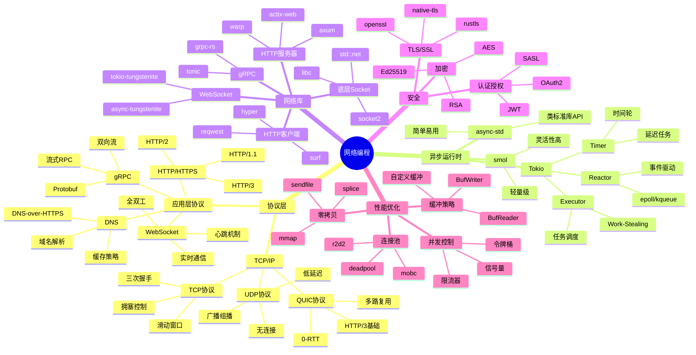

---

## 2. TCP/IP协议栈架构

### TCP连接生命周期

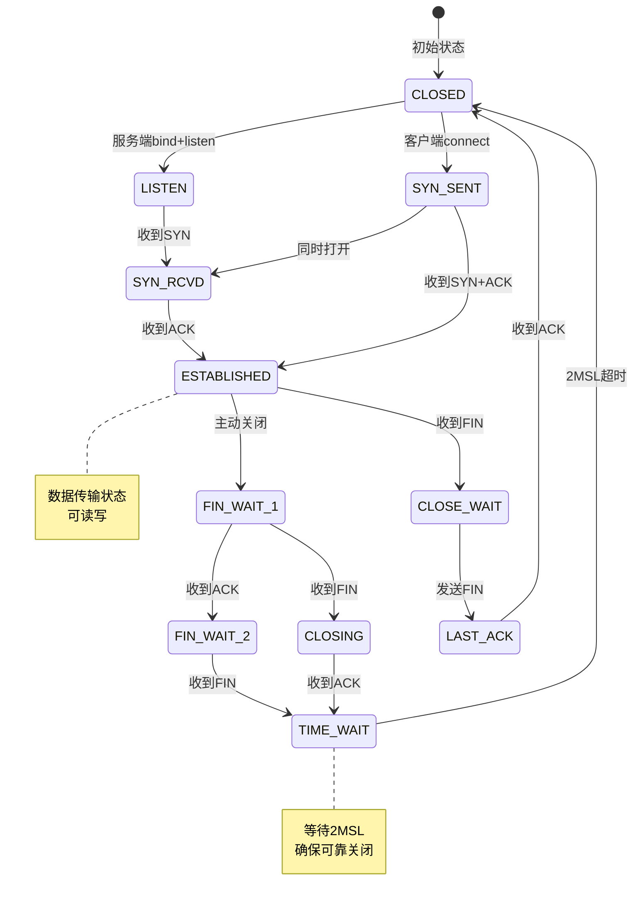

### 数据传输流程

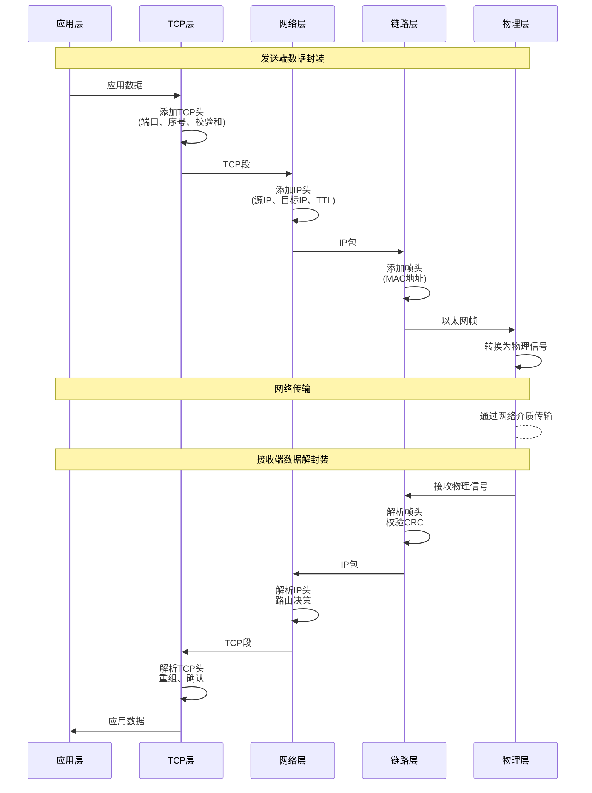

---

## 3. 异步网络编程架构

### Tokio运行时架构

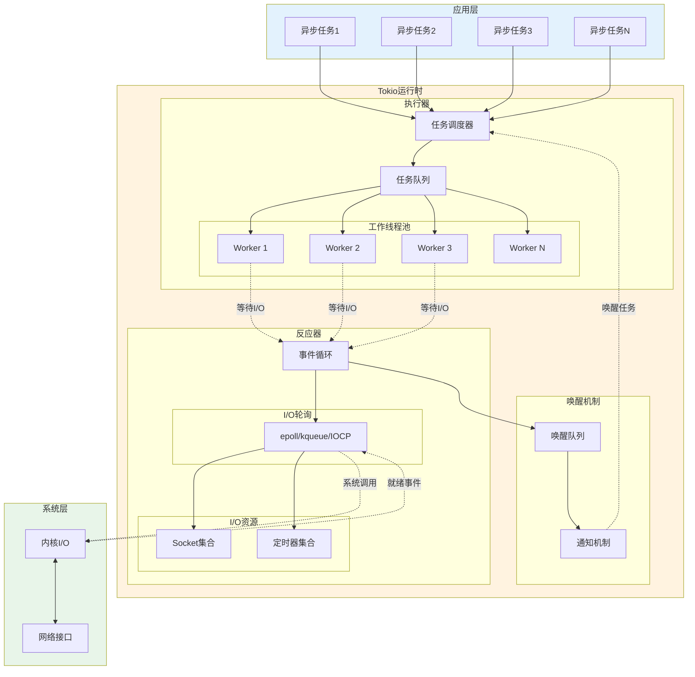

### 异步I/O处理流程

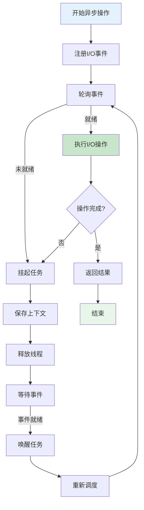

---

## 4. HTTP服务器架构

### 请求处理管道

```mermaid
graph TB
    subgraph Client [客户端]
        Browser[浏览器]
    end
    
    subgraph Server [HTTP服务器 - axum]
        subgraph Transport [传输层]
            TcpListener[TcpListener]
            TcpStream[TcpStream]
        end
        
        subgraph HTTP [HTTP层]
            Parser[HTTP解析器]
            Request[Request对象]
        end
        
        subgraph Router [路由层]
            Router[路由匹配]
            Middleware[中间件链]
        end
        
        subgraph Handler [处理层]
            Auth[认证]
            Validation[验证]
            Business[业务逻辑]
            Response[Response构建]
        end
        
        subgraph Serialization [序列化层]
            JSON[JSON序列化]
            Compression[压缩]
        end
    end
    
    Browser -->|HTTP请求| TcpListener
    TcpListener --> TcpStream
    TcpStream --> Parser
    Parser --> Request
    
    Request --> Router
    Router --> Middleware
    
    Middleware --> Auth
    Auth --> Validation
    Validation --> Business
    Business --> Response
    
    Response --> JSON
    JSON --> Compression
    Compression --> TcpStream
    TcpStream -->|HTTP响应| Browser
    
    style Client fill:#e3f2fd
    style Server fill:#fff3e0
```

### 并发连接管理

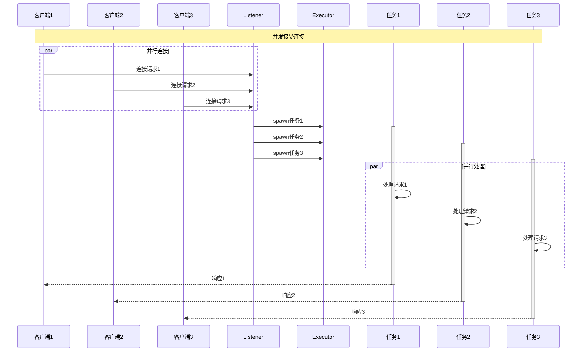

---

## 5. WebSocket架构

### WebSocket握手流程

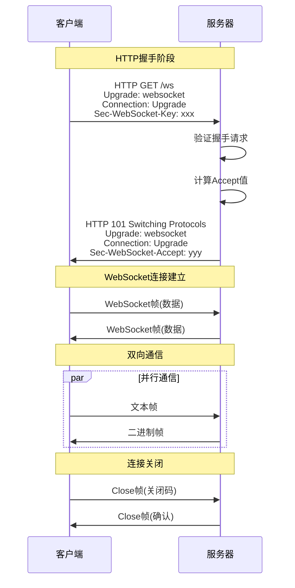

### 双向通信架构

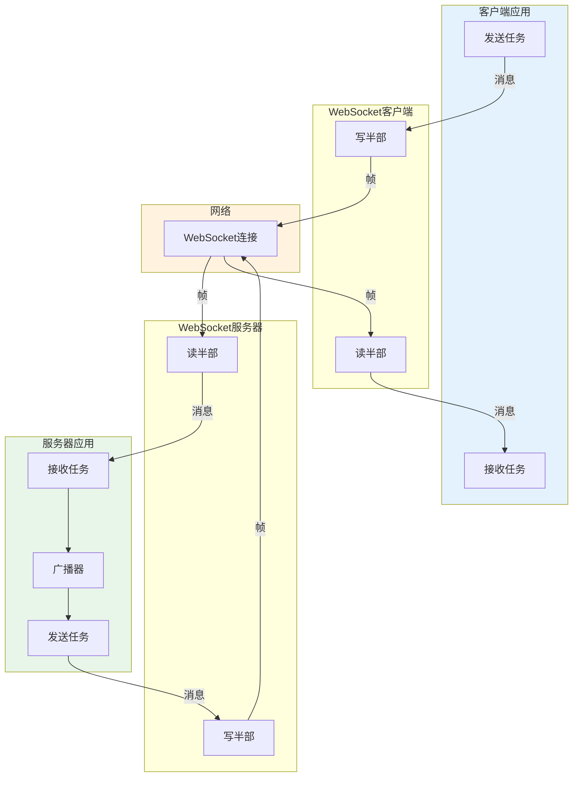

---

## 6. gRPC架构图

### gRPC通信流程

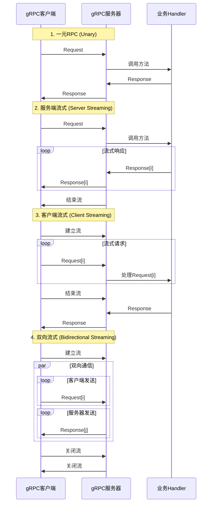

---

## 7. 网络安全架构

### TLS握手流程

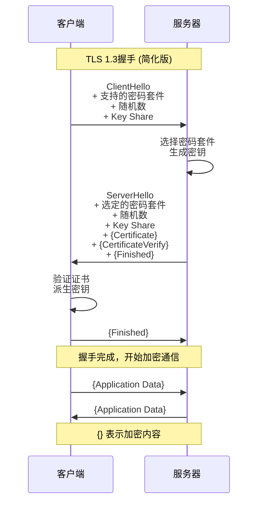

---

## 8. 性能优化架构

### 零拷贝技术

```mermaid
graph TB
    subgraph Traditional [传统方式]
        D1[磁盘]
        K1[内核缓冲区]
        U1[用户空间缓冲区]
        K2[内核Socket缓冲区]
        N1[网卡]
        
        D1 -->|DMA拷贝| K1
        K1 -->|CPU拷贝| U1
        U1 -->|CPU拷贝| K2
        K2 -->|DMA拷贝| N1
    end
    
    subgraph ZeroCopy [零拷贝 - sendfile]
        D2[磁盘]
        K3[内核缓冲区]
        K4[内核Socket缓冲区]
        N2[网卡]
        
        D2 -->|DMA拷贝| K3
        K3 -.->|描述符拷贝| K4
        K4 -->|DMA拷贝| N2
    end
    
    subgraph MMap [内存映射 - mmap]
        D3[磁盘]
        Shared[共享内存]
        K5[内核Socket缓冲区]
        N3[网卡]
        
        D3 -->|映射| Shared
        Shared -->|引用| K5
        K5 -->|DMA拷贝| N3
    end
    
    style Traditional fill:#ffcdd2
    style ZeroCopy fill:#c8e6c9
    style MMap fill:#e1f5ff
    
    Note1[传统: 4次拷贝<br/>2次DMA + 2次CPU]
    Note2[sendfile: 3次拷贝<br/>2次DMA + 1次CPU]
    Note3[mmap: 2次拷贝<br/>1次映射 + 1次DMA]
```

---

## 9. io_uring 革命性I/O架构

### io_uring 工作原理

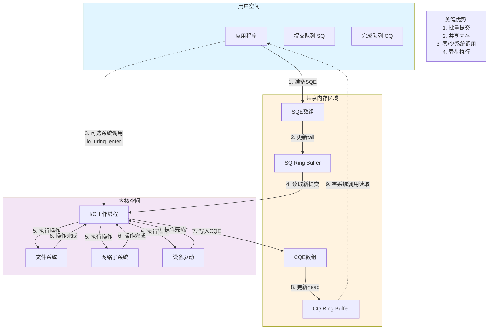

### io_uring vs 传统I/O 对比

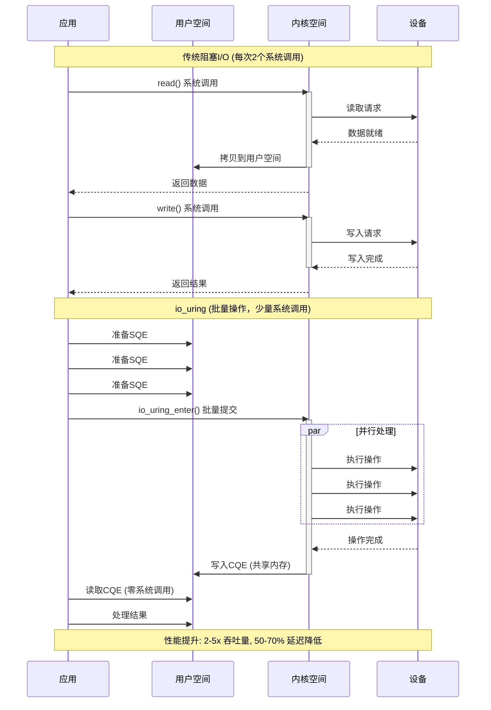

### io_uring 高级特性架构

```mermaid
graph TB
    IoUring[io_uring核心]
    
    %% 高级特性分支
    IoUring --> FixedFiles[固定文件描述符]
    IoUring --> FixedBuffers[固定缓冲区]
    IoUring --> PolledIO[轮询I/O]
    IoUring --> Linking[操作链接]
    IoUring --> Timeout[超时控制]
    
    %% 固定文件
    FixedFiles --> PreRegister[预注册FD数组]
    FixedFiles --> FastLookup[快速查找]
    FixedFiles --> NoRefCount[无引用计数]
    
    %% 固定缓冲区
    FixedBuffers --> PreMap[预映射内存]
    FixedBuffers --> ZeroMapping[零虚拟地址映射]
    FixedBuffers --> DirectDMA[直接DMA]
    
    %% 轮询I/O
    PolledIO --> BusyPoll[忙等待]
    PolledIO --> ZeroSyscall[零系统调用]
    PolledIO --> UltraLowLatency[超低延迟<10μs]
    
    %% 操作链接
    Linking --> Pipeline[流水线操作]
    Linking --> Dependency[依赖关系]
    Linking --> AtomicExec[原子执行]
    
    %% Rust运行时集成
    IoUring --> TokioUring[tokio-uring]
    IoUring --> Monoio[Monoio]
    IoUring --> Glommio[Glommio]
    
    TokioUring --> TokioCompat[Tokio兼容]
    TokioUring --> EasyMigration[易于迁移]
    
    Monoio --> ByteDance[字节跳动]
    Monoio --> HighPerf[极致性能]
    Monoio --> ThreadLocal[线程本地]
    
    Glommio --> Datadog[Datadog]
    Glommio --> TaskScheduler[任务调度器]
    Glommio --> NUMA[NUMA感知]
    
    style IoUring fill:#e1f5ff
    style FixedFiles fill:#fff3e0
    style FixedBuffers fill:#f3e5f5
    style PolledIO fill:#e8f5e9
    style Linking fill:#fce4ec
```

---

## 10. Apache Arrow 高性能数据传输

### Arrow 列式存储架构

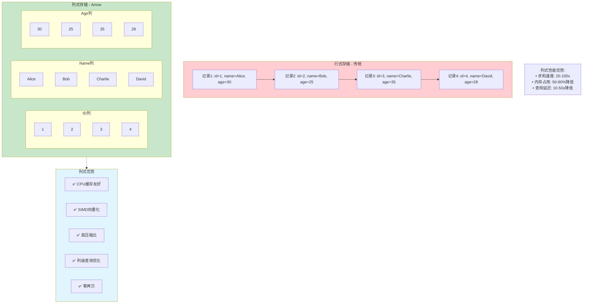

### Arrow 零拷贝数据流

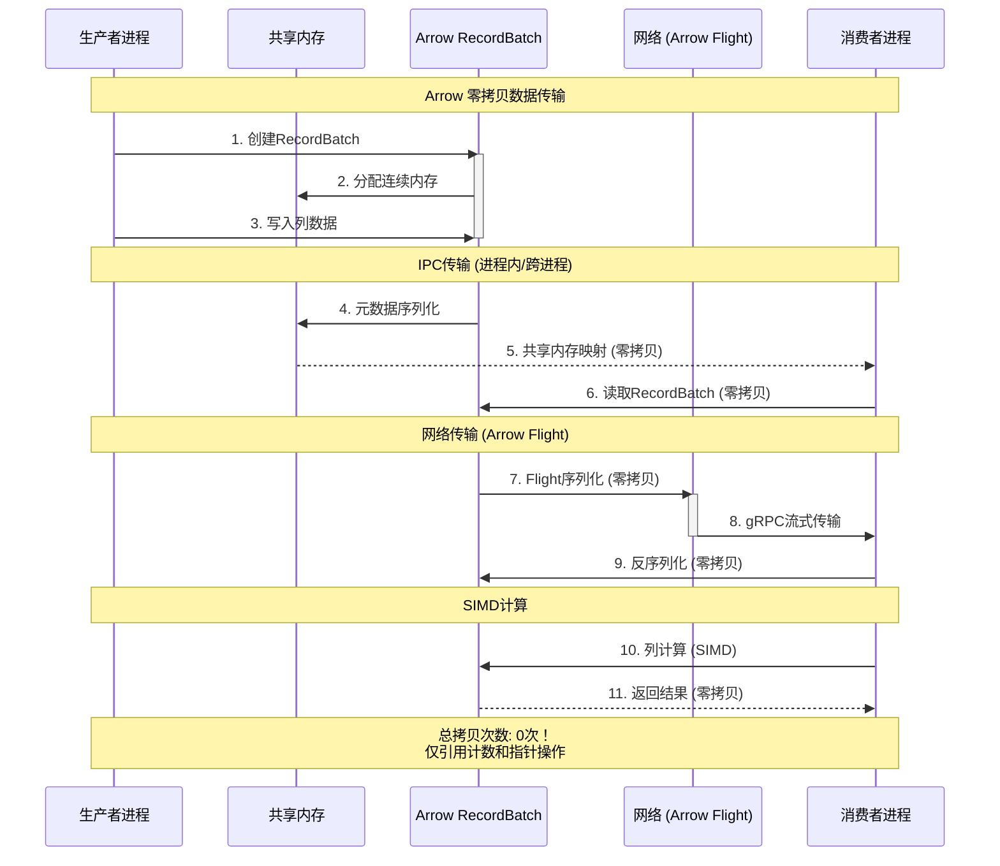

### Arrow 计算架构

```mermaid
graph TB
    Arrow[Arrow RecordBatch]
    
    %% 核心组件
    Arrow --> Schema[Schema定义]
    Arrow --> Arrays[数组集合]
    Arrow --> Metadata[元数据]
    
    %% 内存布局
    Arrays --> Layout[内存布局]
    Layout --> Validity[有效性位图]
    Layout --> Values[值缓冲区]
    Layout --> Offsets[偏移量]
    
    %% 计算内核
    Arrow --> Compute[计算内核]
    Compute --> Arithmetic[算术运算]
    Compute --> Comparison[比较运算]
    Compute --> Aggregate[聚合函数]
    Compute --> Filter[过滤操作]
    Compute --> Sort[排序操作]
    Compute --> Join[连接操作]
    
    %% SIMD优化
    Compute --> SIMD[SIMD优化]
    SIMD --> AVX2[AVX2指令]
    SIMD --> AVX512[AVX512指令]
    SIMD --> NEON[ARM NEON]
    SIMD --> Vectorization[自动向量化]
    
    %% 数据类型
    Arrays --> Types[数据类型]
    Types --> Primitive[基础类型]
    Types --> String[字符串]
    Types --> List[列表]
    Types --> Struct[结构体]
    Types --> Dictionary[字典编码]
    
    Primitive --> Int32[Int32]
    Primitive --> Float64[Float64]
    Primitive --> Boolean[Boolean]
    Primitive --> Timestamp[Timestamp]
    
    %% I/O格式
    Arrow --> IO[I/O支持]
    IO --> IPC[Arrow IPC]
    IO --> Flight[Arrow Flight]
    IO --> Parquet[Parquet]
    IO --> CSV_IO[CSV]
    IO --> JSON_IO[JSON]
    
    %% 语言绑定
    Arrow --> Bindings[多语言]
    Bindings --> Rust[arrow-rs]
    Bindings --> Python[PyArrow]
    Bindings --> JavaScript[arrow-js]
    Bindings --> CPP[arrow-cpp]
    Bindings --> Java[arrow-java]
    
    %% 应用场景
    Arrow --> UseCases[应用场景]
    UseCases --> Analytics[实时分析]
    UseCases --> BigData[大数据传输]
    UseCases --> ML[机器学习]
    UseCases --> Database[数据库引擎]
    UseCases --> Streaming[流式处理]
    
    style Arrow fill:#e1f5ff
    style Compute fill:#fff3e0
    style SIMD fill:#f3e5f5
    style Bindings fill:#e8f5e9
    style UseCases fill:#fce4ec
```

### io_uring + Arrow 终极组合

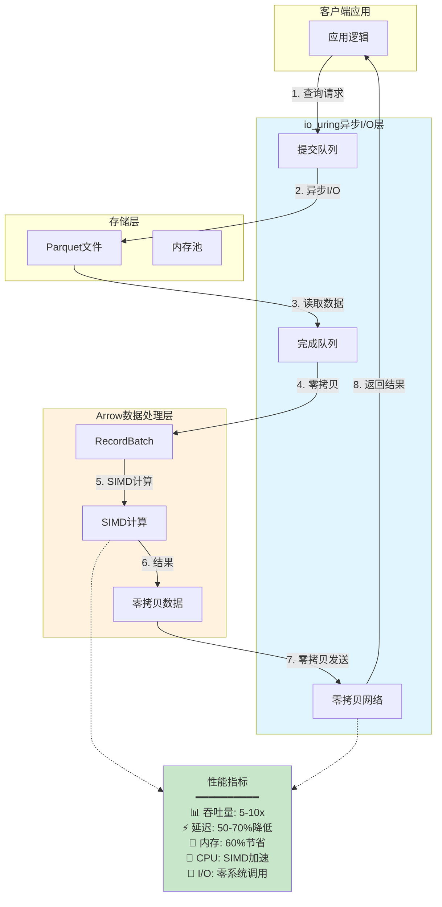

**关键优势总结**:

| 技术组合 | 核心优势 | 性能提升 | 应用场景 |
|---------|---------|---------|---------|
| **io_uring** | 批量I/O、零系统调用 | 2-5x | 文件/网络I/O |
| **Apache Arrow** | 列式存储、SIMD | 10-100x | 数据分析 |
| **io_uring + Arrow** | 双重零拷贝 | 5-15x | 高性能数据服务 |
| **Monoio + arrow-rs** | Rust生态集成 | 8-20x | 实时数据处理 |

---

## 相关文档

- [知识图谱](./KNOWLEDGE_GRAPH_AND_CONCEPT_RELATIONS.md)
- [多维对比矩阵](./MULTI_DIMENSIONAL_COMPARISON_MATRIX.md)
- [形式化验证框架](./FORMAL_VERIFICATION_FRAMEWORK.md)
- [数学基础](./MATHEMATICAL_FOUNDATIONS.md)

---

**文档版本**: v1.0  
**最后更新**: 2025-10-20  
**维护者**: Rust-lang项目组

---

## 返回导航

- [返回理论目录](README.md)
- [返回主索引](../00_MASTER_INDEX.md)
- [返回模块README](../README.md)
