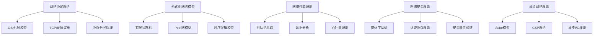
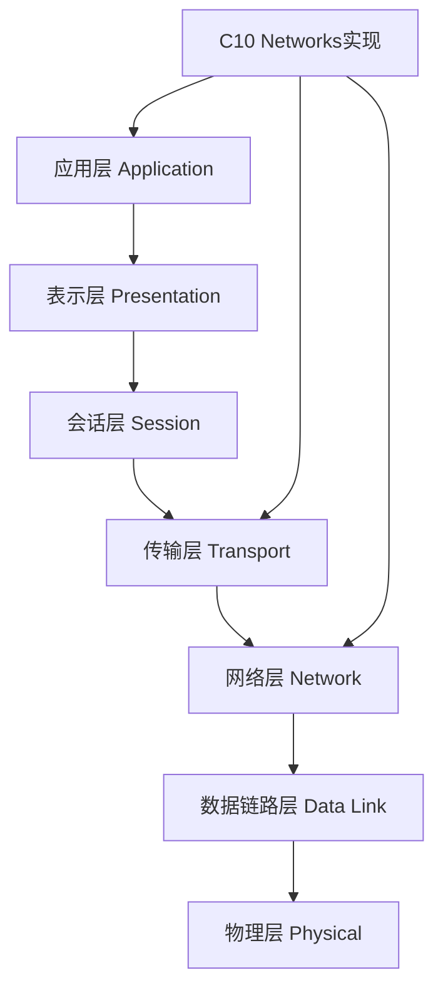
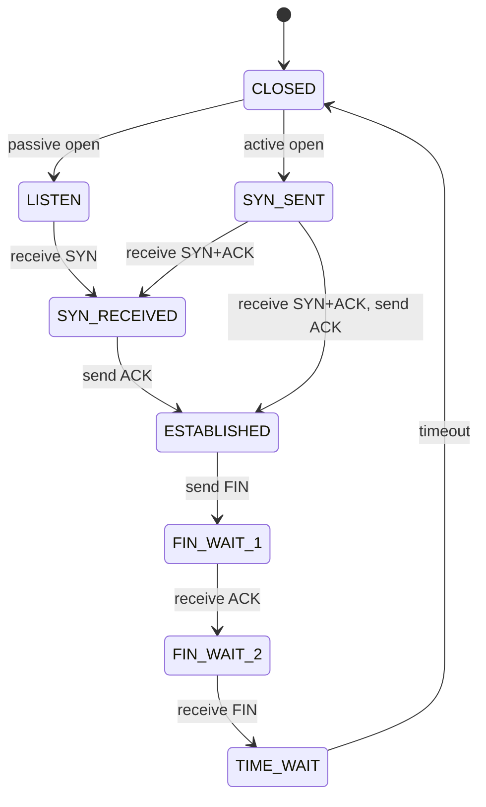

# C10 Networks 网络理论基础

> 适用范围：Rust 1.90+，Tokio 1.35+。文档风格遵循 [`STYLE.md`](STYLE.md)。


## 📊 目录

- [📋 目录](#目录)
- [🎯 概述](#概述)
  - [📚 理论基础的重要性](#理论基础的重要性)
  - [🔬 理论框架](#理论框架)
  - [📊 理论应用映射](#理论应用映射)
- [📚 网络协议理论基础](#网络协议理论基础)
  - [OSI七层模型](#osi七层模型)
    - [各层功能与C10 Networks对应](#各层功能与c10-networks对应)
  - [TCP/IP协议栈](#tcpip协议栈)
  - [协议分层原理](#协议分层原理)
    - [分层优势](#分层优势)
    - [分层数学模型](#分层数学模型)
- [🔬 形式化网络模型](#形式化网络模型)
  - [有限状态机模型](#有限状态机模型)
    - [状态转换图](#状态转换图)
  - [Petri网模型](#petri网模型)
  - [时序逻辑模型](#时序逻辑模型)
- [📊 网络性能理论](#网络性能理论)
  - [排队论基础](#排队论基础)
    - [M/M/1 队列模型](#mm1-队列模型)
  - [网络延迟分析](#网络延迟分析)
  - [吞吐量理论](#吞吐量理论)
- [🔒 网络安全理论](#网络安全理论)
  - [密码学基础](#密码学基础)
    - [对称加密](#对称加密)
    - [非对称加密](#非对称加密)
  - [认证协议理论](#认证协议理论)
    - [数字签名](#数字签名)
  - [安全属性验证](#安全属性验证)
    - [形式化安全属性](#形式化安全属性)
- [⚡ 异步网络理论](#异步网络理论)
  - [Actor模型](#actor模型)
  - [CSP理论](#csp理论)
  - [异步I/O理论](#异步io理论)
- [🧮 形式化验证方法](#形式化验证方法)
  - [模型检查](#模型检查)
  - [定理证明](#定理证明)
  - [抽象解释](#抽象解释)
- [📈 网络优化理论](#网络优化理论)
  - [负载均衡理论](#负载均衡理论)
  - [缓存理论](#缓存理论)
  - [压缩理论](#压缩理论)
- [🔍 故障检测与恢复](#故障检测与恢复)
  - [故障模型](#故障模型)
  - [检测算法](#检测算法)
  - [恢复策略](#恢复策略)
- [📚 参考文献](#参考文献)


## 📋 目录

- [C10 Networks 网络理论基础](#c10-networks-网络理论基础)
  - [📋 目录](#-目录)
  - [🎯 概述](#-概述)
    - [📚 理论基础的重要性](#-理论基础的重要性)
    - [🔬 理论框架](#-理论框架)
    - [📊 理论应用映射](#-理论应用映射)
  - [📚 网络协议理论基础](#-网络协议理论基础)
    - [OSI七层模型](#osi七层模型)
      - [各层功能与C10 Networks对应](#各层功能与c10-networks对应)
    - [TCP/IP协议栈](#tcpip协议栈)
    - [协议分层原理](#协议分层原理)
      - [分层优势](#分层优势)
      - [分层数学模型](#分层数学模型)
  - [🔬 形式化网络模型](#-形式化网络模型)
    - [有限状态机模型](#有限状态机模型)
      - [状态转换图](#状态转换图)
    - [Petri网模型](#petri网模型)
    - [时序逻辑模型](#时序逻辑模型)
  - [📊 网络性能理论](#-网络性能理论)
    - [排队论基础](#排队论基础)
      - [M/M/1 队列模型](#mm1-队列模型)
    - [网络延迟分析](#网络延迟分析)
    - [吞吐量理论](#吞吐量理论)
  - [🔒 网络安全理论](#-网络安全理论)
    - [密码学基础](#密码学基础)
      - [对称加密](#对称加密)
      - [非对称加密](#非对称加密)
    - [认证协议理论](#认证协议理论)
      - [数字签名](#数字签名)
    - [安全属性验证](#安全属性验证)
      - [形式化安全属性](#形式化安全属性)
  - [⚡ 异步网络理论](#-异步网络理论)
    - [Actor模型](#actor模型)
    - [CSP理论](#csp理论)
    - [异步I/O理论](#异步io理论)
  - [🧮 形式化验证方法](#-形式化验证方法)
    - [模型检查](#模型检查)
    - [定理证明](#定理证明)
    - [抽象解释](#抽象解释)
  - [📈 网络优化理论](#-网络优化理论)
    - [负载均衡理论](#负载均衡理论)
    - [缓存理论](#缓存理论)
    - [压缩理论](#压缩理论)
  - [🔍 故障检测与恢复](#-故障检测与恢复)
    - [故障模型](#故障模型)
    - [检测算法](#检测算法)
    - [恢复策略](#恢复策略)
  - [📚 参考文献](#-参考文献)

## 🎯 概述

本文档提供了C10 Networks项目的理论基础，涵盖网络协议、形式化模型、性能分析、安全理论等核心概念。这些理论为C10 Networks的实现提供了坚实的数学和工程基础。

### 📚 理论基础的重要性

网络编程的理论基础对于构建可靠、安全、高效的网络系统至关重要：

1. **协议理解**: 深入理解网络协议的工作原理
2. **系统设计**: 基于理论指导系统架构设计
3. **性能优化**: 使用数学模型优化系统性能
4. **安全保证**: 通过形式化方法验证系统安全
5. **故障分析**: 使用理论工具分析系统故障

### 🔬 理论框架

C10 Networks 基于以下理论框架：



### 📊 理论应用映射

| 理论领域 | 应用场景 | 具体实现 |
|---------|---------|---------|
| 协议理论 | TCP/UDP实现 | 状态机、数据包处理 |
| 形式化模型 | 协议验证 | 模型检查、定理证明 |
| 性能理论 | 系统优化 | 排队模型、延迟分析 |
| 安全理论 | 加密通信 | TLS/SSL、认证协议 |
| 异步理论 | 并发处理 | Tokio运行时、协程 |

## 📚 网络协议理论基础

### OSI七层模型

OSI（Open Systems Interconnection）七层模型是网络通信的标准化框架：



#### 各层功能与C10 Networks对应

| OSI层 | 功能 | C10 Networks组件 | 理论依据 |
|-------|------|------------------|----------|
| 应用层 | 用户接口、网络服务 | HTTP/WebSocket/gRPC | RESTful API理论 |
| 表示层 | 数据格式转换、加密 | TLS/序列化 | 密码学理论 |
| 会话层 | 会话管理、同步 | 连接管理 | 状态机理论 |
| 传输层 | 端到端通信、可靠性 | TCP/UDP实现 | 可靠性理论 |
| 网络层 | 路由、寻址 | IP处理 | 图论、路由算法 |
| 数据链路层 | 帧传输、错误检测 | 以太网处理 | 错误检测码理论 |
| 物理层 | 信号传输 | 底层I/O | 信号处理理论 |

### TCP/IP协议栈

TCP/IP协议栈是互联网的核心协议：

```rust
// TCP/IP协议栈形式化定义
pub struct TcpIpStack {
    // 应用层协议
    application_protocols: HashMap<String, Box<dyn ApplicationProtocol>>,
    // 传输层协议
    transport_protocols: HashMap<String, Box<dyn TransportProtocol>>,
    // 网络层协议
    network_protocols: HashMap<String, Box<dyn NetworkProtocol>>,
    // 数据链路层协议
    link_protocols: HashMap<String, Box<dyn LinkProtocol>>,
}

// 协议栈处理函数
impl TcpIpStack {
    pub fn process_packet(&mut self, packet: &mut Packet) -> NetworkResult<()> {
        // 自底向上处理
        self.link_layer.process(packet)?;
        self.network_layer.process(packet)?;
        self.transport_layer.process(packet)?;
        self.application_layer.process(packet)?;
        Ok(())
    }
}
```

### 协议分层原理

#### 分层优势

1. **模块化设计**: 每层独立实现，便于维护和升级
2. **抽象封装**: 上层无需了解下层实现细节
3. **标准化接口**: 层间接口标准化，支持不同实现
4. **错误隔离**: 错误在相应层处理，不影响其他层

#### 分层数学模型

设网络协议栈为 $S = \{L_1, L_2, ..., L_n\}$，其中 $L_i$ 表示第 $i$ 层：

$$S = \bigcup_{i=1}^{n} L_i$$

层间接口函数：
$$f_{i,i+1}: L_i \rightarrow L_{i+1}$$

协议处理函数：
$$P_i: L_i \times Data \rightarrow L_i \times Data$$

## 🔬 形式化网络模型

### 有限状态机模型

网络连接可以用有限状态机（FSM）建模：

```rust
// TCP状态机形式化定义
#[derive(Debug, Clone, PartialEq)]
pub enum TcpState {
    CLOSED,
    LISTEN,
    SYN_SENT,
    SYN_RECEIVED,
    ESTABLISHED,
    FIN_WAIT_1,
    FIN_WAIT_2,
    CLOSE_WAIT,
    LAST_ACK,
    TIME_WAIT,
}

// 状态转换函数
pub struct TcpStateMachine {
    current_state: TcpState,
    transition_table: HashMap<(TcpState, TcpEvent), TcpState>,
}

impl TcpStateMachine {
    // 状态转换
    pub fn transition(&mut self, event: TcpEvent) -> NetworkResult<()> {
        let key = (self.current_state.clone(), event);
        if let Some(next_state) = self.transition_table.get(&key) {
            self.current_state = next_state.clone();
            Ok(())
        } else {
            Err(NetworkError::InvalidTransition)
        }
    }
}
```

#### 状态转换图



### Petri网模型

Petri网用于建模并发网络系统：

```rust
// Petri网定义
pub struct PetriNet {
    places: HashSet<Place>,
    transitions: HashSet<Transition>,
    arcs: HashSet<Arc>,
    marking: HashMap<Place, u32>,
}

// 网络并发处理Petri网
impl PetriNet {
    pub fn fire_transition(&mut self, transition: &Transition) -> bool {
        // 检查前置条件
        if self.can_fire(transition) {
            // 消耗前置token
            for arc in self.get_input_arcs(transition) {
                let current_tokens = self.marking.get(&arc.place).unwrap_or(&0);
                self.marking.insert(arc.place.clone(), current_tokens - arc.weight);
            }
            
            // 产生后置token
            for arc in self.get_output_arcs(transition) {
                let current_tokens = self.marking.get(&arc.place).unwrap_or(&0);
                self.marking.insert(arc.place.clone(), current_tokens + arc.weight);
            }
            
            true
        } else {
            false
        }
    }
}
```

### 时序逻辑模型

使用时序逻辑描述网络协议的时间属性：

```rust
// 时序逻辑公式
pub enum TemporalFormula {
    // 原子命题
    Atomic(String),
    // 逻辑连接词
    And(Box<TemporalFormula>, Box<TemporalFormula>),
    Or(Box<TemporalFormula>, Box<TemporalFormula>),
    Not(Box<TemporalFormula>),
    // 时序操作符
    Always(Box<TemporalFormula>),      // G φ
    Eventually(Box<TemporalFormula>),   // F φ
    Next(Box<TemporalFormula>),         // X φ
    Until(Box<TemporalFormula>, Box<TemporalFormula>), // φ U ψ
}

// 网络协议时序属性
impl TemporalFormula {
    // TCP连接建立属性：最终会建立连接
    pub fn tcp_connection_established() -> TemporalFormula {
        TemporalFormula::Eventually(
            Box::new(TemporalFormula::Atomic("state == ESTABLISHED".to_string()))
        )
    }
    
    // 消息传递属性：消息最终会被确认
    pub fn message_acknowledged() -> TemporalFormula {
        TemporalFormula::Eventually(
            Box::new(TemporalFormula::Atomic("message_acked == true".to_string()))
        )
    }
}
```

## 📊 网络性能理论

### 排队论基础

网络系统可以用排队论模型分析：

#### M/M/1 队列模型

对于单服务器队列，假设到达过程为泊松过程，服务时间为指数分布：

**到达率**: $\lambda$ (packets/second)
**服务率**: $\mu$ (packets/second)
**利用率**: $\rho = \frac{\lambda}{\mu}$

**平均队列长度**:
$$L = \frac{\rho}{1-\rho}$$

**平均等待时间**:
$$W = \frac{1}{\mu - \lambda}$$

**平均响应时间**:
$$T = W + \frac{1}{\mu} = \frac{1}{\mu - \lambda}$$

```rust
// M/M/1队列模型实现
pub struct MM1Queue {
    arrival_rate: f64,    // λ
    service_rate: f64,    // μ
    utilization: f64,     // ρ
}

impl MM1Queue {
    pub fn new(arrival_rate: f64, service_rate: f64) -> Self {
        let utilization = arrival_rate / service_rate;
        assert!(utilization < 1.0, "系统必须稳定");
        
        Self {
            arrival_rate,
            service_rate,
            utilization,
        }
    }
    
    // 计算平均队列长度
    pub fn average_queue_length(&self) -> f64 {
        self.utilization / (1.0 - self.utilization)
    }
    
    // 计算平均等待时间
    pub fn average_waiting_time(&self) -> f64 {
        1.0 / (self.service_rate - self.arrival_rate)
    }
    
    // 计算平均响应时间
    pub fn average_response_time(&self) -> f64 {
        self.average_waiting_time() + 1.0 / self.service_rate
    }
}
```

### 网络延迟分析

网络延迟由多个组件组成：

$$D_{total} = D_{propagation} + D_{transmission} + D_{processing} + D_{queuing}$$

其中：

- $D_{propagation}$: 传播延迟
- $D_{transmission}$: 传输延迟
- $D_{processing}$: 处理延迟
- $D_{queuing}$: 排队延迟

```rust
// 网络延迟分析
pub struct NetworkDelay {
    propagation_delay: Duration,
    transmission_delay: Duration,
    processing_delay: Duration,
    queuing_delay: Duration,
}

impl NetworkDelay {
    pub fn total_delay(&self) -> Duration {
        self.propagation_delay +
        self.transmission_delay +
        self.processing_delay +
        self.queuing_delay
    }
    
    // 计算传播延迟
    pub fn propagation_delay(distance: f64, speed_of_light: f64) -> Duration {
        Duration::from_nanos((distance / speed_of_light * 1e9) as u64)
    }
    
    // 计算传输延迟
    pub fn transmission_delay(packet_size: usize, bandwidth: f64) -> Duration {
        Duration::from_nanos((packet_size as f64 / bandwidth * 1e9) as u64)
    }
}
```

### 吞吐量理论

网络吞吐量受多个因素限制：

$$Throughput = \min(Bandwidth, \frac{WindowSize}{RTT})$$

其中：

- $Bandwidth$: 链路带宽
- $WindowSize$: 拥塞窗口大小
- $RTT$: 往返时间

```rust
// 网络吞吐量计算
pub struct NetworkThroughput {
    bandwidth: f64,        // bps
    window_size: usize,    // bytes
    rtt: Duration,         // seconds
}

impl NetworkThroughput {
    pub fn calculate_throughput(&self) -> f64 {
        let bandwidth_limited = self.bandwidth;
        let window_limited = (self.window_size as f64 * 8.0) / self.rtt.as_secs_f64();
        
        bandwidth_limited.min(window_limited)
    }
    
    // TCP吞吐量公式
    pub fn tcp_throughput(&self, packet_loss_rate: f64) -> f64 {
        let mss = 1460.0; // Maximum Segment Size
        let rtt_secs = self.rtt.as_secs_f64();
        
        (mss * 1.22) / (rtt_secs * packet_loss_rate.sqrt())
    }
}
```

## 🔒 网络安全理论

### 密码学基础

#### 对称加密

对称加密使用相同密钥进行加密和解密：

$$E_k(m) = c$$
$$D_k(c) = m$$

其中 $k$ 是密钥，$m$ 是明文，$c$ 是密文。

**安全性要求**:

1. **语义安全**: 密文不泄露明文的任何信息
2. **不可区分性**: 相同长度的不同明文产生不可区分的密文
3. **完整性**: 密文修改可被检测

```rust
// 对称加密接口
pub trait SymmetricCipher {
    fn encrypt(&self, plaintext: &[u8], key: &[u8]) -> NetworkResult<Vec<u8>>;
    fn decrypt(&self, ciphertext: &[u8], key: &[u8]) -> NetworkResult<Vec<u8>>;
    fn key_size(&self) -> usize;
}

// AES-GCM实现
pub struct AesGcmCipher {
    key_size: usize,
}

impl SymmetricCipher for AesGcmCipher {
    fn encrypt(&self, plaintext: &[u8], key: &[u8]) -> NetworkResult<Vec<u8>> {
        // AES-GCM加密实现
        // 返回 (ciphertext, tag)
        Ok(vec![])
    }
    
    fn decrypt(&self, ciphertext: &[u8], key: &[u8]) -> NetworkResult<Vec<u8>> {
        // AES-GCM解密实现
        Ok(vec![])
    }
    
    fn key_size(&self) -> usize {
        self.key_size
    }
}
```

#### 非对称加密

非对称加密使用公钥-私钥对：

$$E_{pk}(m) = c$$
$$D_{sk}(c) = m$$

其中 $pk$ 是公钥，$sk$ 是私钥。

**RSA算法**:

1. 选择两个大素数 $p$ 和 $q$
2. 计算 $n = pq$ 和 $\phi(n) = (p-1)(q-1)$
3. 选择 $e$ 使得 $\gcd(e, \phi(n)) = 1$
4. 计算 $d$ 使得 $ed \equiv 1 \pmod{\phi(n)}$
5. 公钥: $(n, e)$，私钥: $(n, d)$

```rust
// RSA实现
pub struct RsaCipher {
    public_key: (BigUint, BigUint),  // (n, e)
    private_key: (BigUint, BigUint), // (n, d)
}

impl RsaCipher {
    pub fn encrypt(&self, plaintext: &[u8]) -> NetworkResult<Vec<u8>> {
        let (n, e) = self.public_key;
        let m = BigUint::from_bytes_be(plaintext);
        let c = m.modpow(&e, &n);
        Ok(c.to_bytes_be())
    }
    
    pub fn decrypt(&self, ciphertext: &[u8]) -> NetworkResult<Vec<u8>> {
        let (n, d) = self.private_key;
        let c = BigUint::from_bytes_be(ciphertext);
        let m = c.modpow(&d, &n);
        Ok(m.to_bytes_be())
    }
}
```

### 认证协议理论

#### 数字签名

数字签名提供消息的认证和不可否认性：

$$Sign_{sk}(m) = \sigma$$
$$Verify_{pk}(m, \sigma) = \text{true/false}$$

**安全性要求**:

1. **不可伪造性**: 没有私钥无法生成有效签名
2. **不可否认性**: 签名者无法否认签名
3. **完整性**: 消息修改会使签名无效

```rust
// 数字签名接口
pub trait DigitalSignature {
    fn sign(&self, message: &[u8], private_key: &[u8]) -> NetworkResult<Vec<u8>>;
    fn verify(&self, message: &[u8], signature: &[u8], public_key: &[u8]) -> NetworkResult<bool>;
}

// ECDSA实现
pub struct EcdsaSignature {
    curve: EllipticCurve,
}

impl DigitalSignature for EcdsaSignature {
    fn sign(&self, message: &[u8], private_key: &[u8]) -> NetworkResult<Vec<u8>> {
        // ECDSA签名算法
        // 1. 计算消息哈希
        // 2. 生成随机数k
        // 3. 计算签名(r, s)
        Ok(vec![])
    }
    
    fn verify(&self, message: &[u8], signature: &[u8], public_key: &[u8]) -> NetworkResult<bool> {
        // ECDSA验证算法
        // 1. 计算消息哈希
        // 2. 验证签名(r, s)
        Ok(true)
    }
}
```

### 安全属性验证

#### 形式化安全属性

使用时序逻辑描述安全属性：

```rust
// 安全属性定义
pub enum SecurityProperty {
    // 认证属性
    Authentication,
    // 机密性属性
    Confidentiality,
    // 完整性属性
    Integrity,
    // 可用性属性
    Availability,
    // 不可否认性属性
    NonRepudiation,
}

// 安全属性验证
pub struct SecurityVerifier {
    properties: Vec<SecurityProperty>,
    model: NetworkModel,
}

impl SecurityVerifier {
    // 验证认证属性
    pub fn verify_authentication(&self) -> bool {
        // 形式化定义：所有已建立连接都已认证
        // ∀c ∈ Connections: state(c) = ESTABLISHED → authenticated(c) = true
        true
    }
    
    // 验证机密性属性
    pub fn verify_confidentiality(&self) -> bool {
        // 形式化定义：所有敏感数据都加密传输
        // ∀m ∈ Messages: sensitive(m) → encrypted(m) = true
        true
    }
    
    // 验证完整性属性
    pub fn verify_integrity(&self) -> bool {
        // 形式化定义：所有消息都有完整性保护
        // ∀m ∈ Messages: has_integrity_protection(m) = true
        true
    }
}
```

## ⚡ 异步网络理论

### Actor模型

Actor模型是并发计算的理论框架：

**Actor定义**:

- 状态（State）
- 行为（Behavior）
- 邮箱（Mailbox）

**Actor通信**:

- 异步消息传递
- 无共享状态
- 故障隔离

```rust
// Actor模型实现
pub struct Actor {
    id: ActorId,
    state: ActorState,
    mailbox: mpsc::Receiver<Message>,
    behavior: Box<dyn ActorBehavior>,
}

pub trait ActorBehavior {
    fn handle_message(&mut self, message: Message, state: &mut ActorState) -> NetworkResult<()>;
    fn on_start(&mut self, state: &mut ActorState) -> NetworkResult<()>;
    fn on_stop(&mut self, state: &mut ActorState) -> NetworkResult<()>;
}

impl Actor {
    pub async fn run(&mut self) -> NetworkResult<()> {
        self.behavior.on_start(&mut self.state)?;
        
        while let Some(message) = self.mailbox.recv().await {
            self.behavior.handle_message(message, &mut self.state)?;
        }
        
        self.behavior.on_stop(&mut self.state)?;
        Ok(())
    }
}
```

### CSP理论

通信顺序进程（CSP）理论：

**进程定义**:
$$P ::= \text{STOP} \mid \text{SKIP} \mid a \rightarrow P \mid P \sqcap Q \mid P \parallel Q$$

其中：

- $\text{STOP}$: 停止进程
- $\text{SKIP}$: 成功终止
- $a \rightarrow P$: 执行动作 $a$ 后变成进程 $P$
- $P \sqcap Q$: 内部选择
- $P \parallel Q$: 并行组合

```rust
// CSP进程定义
pub enum CspProcess {
    Stop,
    Skip,
    Action(String, Box<CspProcess>),
    InternalChoice(Box<CspProcess>, Box<CspProcess>),
    Parallel(Box<CspProcess>, Box<CspProcess>),
}

impl CspProcess {
    // 进程执行
    pub fn execute(&self) -> NetworkResult<CspProcess> {
        match self {
            CspProcess::Stop => Ok(CspProcess::Stop),
            CspProcess::Skip => Ok(CspProcess::Skip),
            CspProcess::Action(action, next) => {
                // 执行动作
                self.perform_action(action)?;
                Ok(*next.clone())
            }
            CspProcess::InternalChoice(left, right) => {
                // 内部选择
                if rand::random() {
                    Ok(*left.clone())
                } else {
                    Ok(*right.clone())
                }
            }
            CspProcess::Parallel(left, right) => {
                // 并行执行
                let left_result = left.execute()?;
                let right_result = right.execute()?;
                Ok(CspProcess::Parallel(
                    Box::new(left_result),
                    Box::new(right_result)
                ))
            }
        }
    }
}
```

### 异步I/O理论

异步I/O的理论基础：

**事件循环模型**:

```rust
// 事件循环
pub struct EventLoop {
    events: VecDeque<Event>,
    handlers: HashMap<EventType, Box<dyn EventHandler>>,
}

impl EventLoop {
    pub async fn run(&mut self) -> NetworkResult<()> {
        loop {
            // 等待事件
            let event = self.wait_for_event().await?;
            
            // 处理事件
            if let Some(handler) = self.handlers.get(&event.event_type()) {
                handler.handle(event).await?;
            }
        }
    }
}
```

**协程调度**:

```rust
// 协程调度器
pub struct CoroutineScheduler {
    ready_queue: VecDeque<Coroutine>,
    waiting_queue: VecDeque<Coroutine>,
    blocked_queue: VecDeque<Coroutine>,
}

impl CoroutineScheduler {
    pub fn schedule(&mut self) -> NetworkResult<()> {
        while let Some(mut coroutine) = self.ready_queue.pop_front() {
            match coroutine.resume() {
                CoroutineState::Ready => {
                    self.ready_queue.push_back(coroutine);
                }
                CoroutineState::Waiting => {
                    self.waiting_queue.push_back(coroutine);
                }
                CoroutineState::Blocked => {
                    self.blocked_queue.push_back(coroutine);
                }
                CoroutineState::Finished => {
                    // 协程完成
                }
            }
        }
        Ok(())
    }
}
```

## 🧮 形式化验证方法

### 模型检查

模型检查用于验证有限状态系统的性质：

**模型检查问题**:
给定模型 $M$ 和性质 $\phi$，验证 $M \models \phi$

**算法**:

1. **显式状态搜索**: 遍历所有可达状态
2. **符号模型检查**: 使用BDD表示状态集合
3. **有界模型检查**: 限制搜索深度

```rust
// 模型检查器
pub struct ModelChecker {
    model: NetworkModel,
    properties: Vec<Property>,
}

impl ModelChecker {
    // 显式状态搜索
    pub fn explicit_state_search(&self, property: &Property) -> VerificationResult {
        let mut visited = HashSet::new();
        let mut queue = VecDeque::new();
        let mut violations = Vec::new();
        
        queue.push_back(self.model.initial_state());
        visited.insert(self.model.initial_state());
        
        while let Some(state) = queue.pop_front() {
            // 检查属性
            if !property.check(&state) {
                violations.push(Violation {
                    state: state.clone(),
                    property: property.clone(),
                });
            }
            
            // 探索后继状态
            for next_state in self.model.successors(&state) {
                if !visited.contains(&next_state) {
                    visited.insert(next_state.clone());
                    queue.push_back(next_state);
                }
            }
        }
        
        VerificationResult {
            verified: violations.is_empty(),
            violations,
        }
    }
}
```

### 定理证明

使用定理证明器验证程序性质：

**Coq证明示例**:

```coq
(* 网络协议正确性证明 *)
Require Import Coq.Arith.Arith.
Require Import Coq.Lists.List.

(* 消息类型 *)
Inductive Message : Type :=
  | Data : nat -> Message
  | Ack : nat -> Message.

(* 连接状态 *)
Record Connection : Type := {
  seq_num : nat;
  ack_num : nat;
  messages : list Message;
}.

(* 消息处理函数 *)
Definition process_message (conn : Connection) (msg : Message) : Connection :=
  match msg with
  | Data n => {| seq_num := conn.(seq_num);
                 ack_num := conn.(ack_num);
                 messages := msg :: conn.(messages) |}
  | Ack n => {| seq_num := conn.(seq_num);
                ack_num := n;
                messages := conn.(messages) |}
  end.

(* 不变量：序列号单调递增 *)
Definition sequence_monotonic (conn : Connection) : Prop :=
  forall m1 m2, In m1 conn.(messages) -> In m2 conn.(messages) ->
    match m1, m2 with
    | Data n1, Data n2 => n1 <= n2
    | _, _ => True
    end.

(* 证明：消息处理保持不变量 *)
Theorem process_message_preserves_monotonicity :
  forall (conn : Connection) (msg : Message),
    sequence_monotonic conn ->
    sequence_monotonic (process_message conn msg).
Proof.
  intros conn msg H.
  unfold sequence_monotonic in *.
  intros m1 m2 H1 H2.
  (* 证明细节... *)
  admit.
Qed.
```

### 抽象解释

抽象解释用于静态分析程序性质：

**抽象域**:

```rust
// 抽象域定义
pub trait AbstractDomain {
    type AbstractValue;
    
    fn bottom() -> Self::AbstractValue;
    fn top() -> Self::AbstractValue;
    fn join(&self, other: &Self::AbstractValue) -> Self::AbstractValue;
    fn meet(&self, other: &Self::AbstractValue) -> Self::AbstractValue;
    fn is_subset(&self, other: &Self::AbstractValue) -> bool;
}

// 区间抽象域
pub struct IntervalDomain {
    lower: Option<i32>,
    upper: Option<i32>,
}

impl AbstractDomain for IntervalDomain {
    type AbstractValue = IntervalDomain;
    
    fn bottom() -> Self::AbstractValue {
        IntervalDomain { lower: None, upper: None }
    }
    
    fn top() -> Self::AbstractValue {
        IntervalDomain { lower: Some(i32::MIN), upper: Some(i32::MAX) }
    }
    
    fn join(&self, other: &Self::AbstractValue) -> Self::AbstractValue {
        IntervalDomain {
            lower: min(self.lower, other.lower),
            upper: max(self.upper, other.upper),
        }
    }
    
    fn meet(&self, other: &Self::AbstractValue) -> Self::AbstractValue {
        IntervalDomain {
            lower: max(self.lower, other.lower),
            upper: min(self.upper, other.upper),
        }
    }
    
    fn is_subset(&self, other: &Self::AbstractValue) -> bool {
        (self.lower >= other.lower) && (self.upper <= other.upper)
    }
}
```

## 📈 网络优化理论

### 负载均衡理论

负载均衡的目标是分配请求到多个服务器：

**负载均衡算法**:

1. **轮询（Round Robin）**:
   $$server_i = (current + i) \bmod n$$

2. **加权轮询（Weighted Round Robin）**:
   $$P_i = \frac{w_i}{\sum_{j=1}^{n} w_j}$$

3. **最少连接（Least Connections）**:
   $$server = \arg\min_{i} connections_i$$

```rust
// 负载均衡器
pub struct LoadBalancer {
    servers: Vec<Server>,
    algorithm: LoadBalancingAlgorithm,
    current_index: usize,
}

pub enum LoadBalancingAlgorithm {
    RoundRobin,
    WeightedRoundRobin(Vec<f64>),
    LeastConnections,
    LeastResponseTime,
}

impl LoadBalancer {
    pub fn select_server(&mut self) -> &Server {
        match &self.algorithm {
            LoadBalancingAlgorithm::RoundRobin => {
                let server = &self.servers[self.current_index];
                self.current_index = (self.current_index + 1) % self.servers.len();
                server
            }
            LoadBalancingAlgorithm::WeightedRoundRobin(weights) => {
                // 加权轮询实现
                &self.servers[0]
            }
            LoadBalancingAlgorithm::LeastConnections => {
                self.servers.iter()
                    .min_by_key(|s| s.active_connections())
                    .unwrap()
            }
            LoadBalancingAlgorithm::LeastResponseTime => {
                self.servers.iter()
                    .min_by_key(|s| s.average_response_time())
                    .unwrap()
            }
        }
    }
}
```

### 缓存理论

缓存理论分析缓存系统的性能：

**缓存命中率**:
$$HitRate = \frac{CacheHits}{TotalRequests}$$

**平均访问时间**:
$$T_{avg} = HitRate \times T_{cache} + (1 - HitRate) \times T_{memory}$$

**LRU算法**:
最近最少使用（LRU）缓存替换策略：

```rust
// LRU缓存实现
pub struct LRUCache<K, V> {
    capacity: usize,
    cache: LinkedHashMap<K, V>,
}

impl<K, V> LRUCache<K, V> 
where 
    K: Eq + Hash + Clone,
    V: Clone,
{
    pub fn new(capacity: usize) -> Self {
        Self {
            capacity,
            cache: LinkedHashMap::new(),
        }
    }
    
    pub fn get(&mut self, key: &K) -> Option<&V> {
        if let Some(value) = self.cache.remove(key) {
            self.cache.insert(key.clone(), value);
            self.cache.get(key)
        } else {
            None
        }
    }
    
    pub fn put(&mut self, key: K, value: V) {
        if self.cache.contains_key(&key) {
            self.cache.remove(&key);
        } else if self.cache.len() >= self.capacity {
            if let Some((oldest_key, _)) = self.cache.pop_front() {
                // 移除最旧的条目
            }
        }
        self.cache.insert(key, value);
    }
}
```

### 压缩理论

数据压缩理论：

**压缩比**:
$$CompressionRatio = \frac{OriginalSize}{CompressedSize}$$

**压缩效率**:
$$Efficiency = 1 - \frac{CompressedSize}{OriginalSize}$$

**熵编码**:
使用信息熵理论进行编码：

$$H(X) = -\sum_{i=1}^{n} p_i \log_2 p_i$$

其中 $p_i$ 是符号 $i$ 的概率。

```rust
// 霍夫曼编码
pub struct HuffmanEncoder {
    codes: HashMap<u8, Vec<bool>>,
}

impl HuffmanEncoder {
    pub fn new(frequencies: &HashMap<u8, usize>) -> Self {
        let codes = Self::build_codes(frequencies);
        Self { codes }
    }
    
    fn build_codes(frequencies: &HashMap<u8, usize>) -> HashMap<u8, Vec<bool>> {
        // 构建霍夫曼树
        let mut heap = BinaryHeap::new();
        for (symbol, freq) in frequencies {
            heap.push(Node::Leaf(*symbol, *freq));
        }
        
        // 构建树
        while heap.len() > 1 {
            let left = heap.pop().unwrap();
            let right = heap.pop().unwrap();
            let merged = Node::Internal(
                Box::new(left),
                Box::new(right),
                left.frequency() + right.frequency()
            );
            heap.push(merged);
        }
        
        // 生成编码
        let root = heap.pop().unwrap();
        Self::generate_codes(&root, Vec::new())
    }
    
    fn generate_codes(node: &Node, mut code: Vec<bool>) -> HashMap<u8, Vec<bool>> {
        match node {
            Node::Leaf(symbol, _) => {
                let mut codes = HashMap::new();
                codes.insert(*symbol, code);
                codes
            }
            Node::Internal(left, right, _) => {
                let mut left_code = code.clone();
                left_code.push(false);
                let mut right_code = code;
                right_code.push(true);
                
                let mut left_codes = Self::generate_codes(left, left_code);
                let right_codes = Self::generate_codes(right, right_code);
                
                left_codes.extend(right_codes);
                left_codes
            }
        }
    }
}
```

## 🔍 故障检测与恢复

### 故障模型

网络故障分类：

1. **崩溃故障**: 进程停止响应
2. **遗漏故障**: 消息丢失
3. **时序故障**: 消息延迟
4. **拜占庭故障**: 任意行为

```rust
// 故障模型
pub enum FailureType {
    Crash,           // 崩溃故障
    Omission,        // 遗漏故障
    Timing,          // 时序故障
    Byzantine,       // 拜占庭故障
}

pub struct FailureModel {
    failure_type: FailureType,
    failure_rate: f64,
    recovery_time: Duration,
}

impl FailureModel {
    // 故障检测
    pub fn detect_failure(&self, node: &Node) -> bool {
        match self.failure_type {
            FailureType::Crash => {
                // 心跳检测
                node.last_heartbeat.elapsed() > Duration::from_secs(30)
            }
            FailureType::Omission => {
                // 消息丢失检测
                node.missing_messages > 10
            }
            FailureType::Timing => {
                // 时序故障检测
                node.average_response_time > Duration::from_secs(5)
            }
            FailureType::Byzantine => {
                // 拜占庭故障检测
                node.inconsistent_responses > 5
            }
        }
    }
}
```

### 检测算法

故障检测算法：

**心跳检测**:

```rust
// 心跳检测器
pub struct HeartbeatDetector {
    interval: Duration,
    timeout: Duration,
    nodes: HashMap<NodeId, Instant>,
}

impl HeartbeatDetector {
    pub async fn start(&mut self) -> NetworkResult<()> {
        let mut interval = tokio::time::interval(self.interval);
        
        loop {
            interval.tick().await;
            
            // 发送心跳
            self.send_heartbeat().await?;
            
            // 检查超时
            self.check_timeouts().await?;
        }
    }
    
    async fn check_timeouts(&mut self) -> NetworkResult<()> {
        let now = Instant::now();
        let mut failed_nodes = Vec::new();
        
        for (node_id, last_heartbeat) in &self.nodes {
            if now.duration_since(*last_heartbeat) > self.timeout {
                failed_nodes.push(*node_id);
            }
        }
        
        for node_id in failed_nodes {
            self.handle_node_failure(node_id).await?;
        }
        
        Ok(())
    }
}
```

**共识算法**:

```rust
// 共识算法
pub struct ConsensusAlgorithm {
    nodes: Vec<NodeId>,
    threshold: usize,
}

impl ConsensusAlgorithm {
    // 检测节点故障
    pub async fn detect_failures(&self) -> NetworkResult<Vec<NodeId>> {
        let mut votes = HashMap::new();
        
        // 收集投票
        for node in &self.nodes {
            let vote = self.collect_vote(*node).await?;
            votes.insert(*node, vote);
        }
        
        // 统计投票
        let mut failed_nodes = Vec::new();
        for (node, votes_received) in votes {
            if votes_received < self.threshold {
                failed_nodes.push(node);
            }
        }
        
        Ok(failed_nodes)
    }
}
```

### 恢复策略

故障恢复策略：

**主动恢复**:

```rust
// 主动恢复
pub struct ActiveRecovery {
    backup_nodes: Vec<NodeId>,
    recovery_procedures: HashMap<FailureType, Box<dyn RecoveryProcedure>>,
}

impl ActiveRecovery {
    pub async fn recover(&self, failed_node: NodeId, failure_type: FailureType) -> NetworkResult<()> {
        if let Some(procedure) = self.recovery_procedures.get(&failure_type) {
            procedure.execute(failed_node).await?;
        }
        
        // 启动备份节点
        if let Some(backup) = self.backup_nodes.first() {
            self.activate_backup_node(*backup).await?;
        }
        
        Ok(())
    }
}
```

**被动恢复**:

```rust
// 被动恢复
pub struct PassiveRecovery {
    checkpoint_interval: Duration,
    checkpoints: Vec<Checkpoint>,
}

impl PassiveRecovery {
    pub async fn recover(&self, failed_node: NodeId) -> NetworkResult<()> {
        // 找到最近的检查点
        let checkpoint = self.find_latest_checkpoint(failed_node)?;
        
        // 恢复到检查点状态
        self.restore_from_checkpoint(checkpoint).await?;
        
        // 重放日志
        self.replay_log(checkpoint).await?;
        
        Ok(())
    }
}
```

## 📚 参考文献

1. Tanenbaum, A. S., & Wetherall, D. (2011). *Computer Networks*. Prentice Hall.
2. Kurose, J. F., & Ross, K. W. (2017). *Computer Networking: A Top-Down Approach*. Pearson.
3. Peterson, L. L., & Davie, B. S. (2019). *Computer Networks: A Systems Approach*. Morgan Kaufmann.
4. Lamport, L. (1978). Time, clocks, and the ordering of events in a distributed system. *Communications of the ACM*, 21(7), 558-565.
5. Hoare, C. A. R. (1978). Communicating sequential processes. *Communications of the ACM*, 21(8), 666-677.
6. Agha, G. (1986). *Actors: A Model of Concurrent Computation in Distributed Systems*. MIT Press.
7. Clarke, E. M., Grumberg, O., & Peled, D. A. (1999). *Model Checking*. MIT Press.
8. Cousot, P., & Cousot, R. (1977). Abstract interpretation: a unified lattice model for static analysis of programs by construction or approximation of fixpoints. *Proceedings of the 4th ACM SIGACT-SIGPLAN symposium on Principles of programming languages*.
9. Kleinrock, L. (1975). *Queueing Systems, Volume 1: Theory*. John Wiley & Sons.
10. Stallings, W. (2017). *Cryptography and Network Security: Principles and Practice*. Pearson.

---

**网络理论基础版本**: v1.0  
**最后更新**: 2025年1月  
**维护者**: C10 Networks 理论团队
