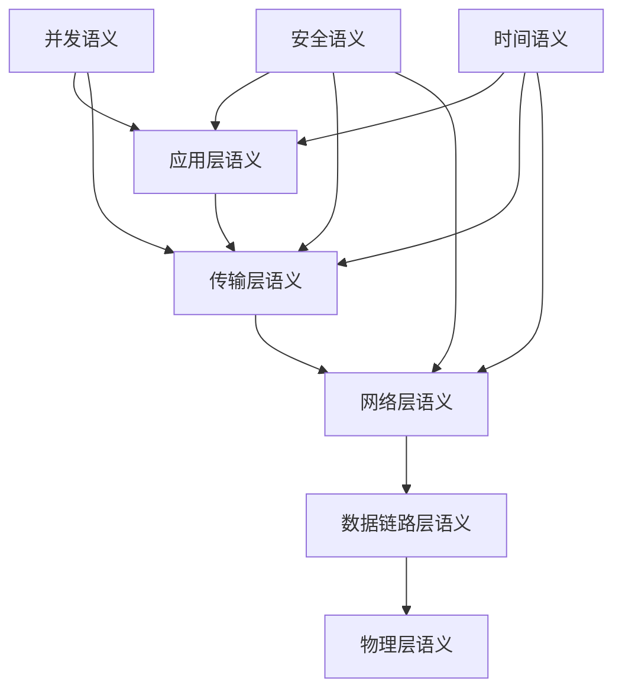

# C10 Networks 语义模型分析

## 📊 目录

- [C10 Networks 语义模型分析](#c10-networks-语义模型分析)
  - [📊 目录](#-目录)
  - [📋 目录](#-目录-1)
  - [📋 概述](#-概述)
  - [🎯 语义模型目标](#-语义模型目标)
    - [核心目标](#核心目标)
    - [形式化方法](#形式化方法)
  - [🏗️ 语义模型架构](#️-语义模型架构)
    - [1. 分层语义模型](#1-分层语义模型)
    - [2. 语义组件映射](#2-语义组件映射)
  - [🔬 形式化规范](#-形式化规范)
    - [1. 网络连接语义](#1-网络连接语义)
      - [类型定义](#类型定义)
      - [状态转换语义](#状态转换语义)
    - [2. 异步通信语义](#2-异步通信语义)
      - [Actor模型规范](#actor模型规范)
    - [3. 安全协议语义](#3-安全协议语义)
      - [TLS握手语义](#tls握手语义)
  - [🧮 模型检查](#-模型检查)
    - [1. TLA+规范](#1-tla规范)
      - [网络协议模型](#网络协议模型)
      - [并发安全性](#并发安全性)
    - [2. Alloy模型](#2-alloy模型)
      - [网络拓扑分析](#网络拓扑分析)
  - [🎯 定理证明](#-定理证明)
    - [1. Coq形式化证明](#1-coq形式化证明)
      - [网络协议正确性](#网络协议正确性)
      - [异步安全性证明](#异步安全性证明)
    - [2. Lean形式化证明](#2-lean形式化证明)
      - [网络性能分析](#网络性能分析)
  - [🔍 抽象解释](#-抽象解释)
    - [1. 静态语义分析](#1-静态语义分析)
      - [数据流分析](#数据流分析)
      - [类型语义分析](#类型语义分析)
    - [2. 语义不变量分析](#2-语义不变量分析)
      - [网络协议不变量](#网络协议不变量)
  - [🔐 安全语义验证](#-安全语义验证)
    - [1. 密码学语义](#1-密码学语义)
      - [加密协议语义](#加密协议语义)
      - [认证协议语义](#认证协议语义)
  - [📊 性能语义分析](#-性能语义分析)
    - [1. 时间复杂度分析](#1-时间复杂度分析)
      - [算法复杂度证明](#算法复杂度证明)
    - [2. 空间复杂度分析](#2-空间复杂度分析)
      - [内存使用分析](#内存使用分析)
  - [🧪 语义测试框架](#-语义测试框架)
    - [1. 属性测试](#1-属性测试)
      - [网络协议属性](#网络协议属性)
      - [安全属性测试](#安全属性测试)
    - [2. 模型检查测试](#2-模型检查测试)
      - [状态空间探索](#状态空间探索)
  - [📈 语义验证报告](#-语义验证报告)
    - [1. 验证结果汇总](#1-验证结果汇总)
    - [2. 持续验证集成](#2-持续验证集成)

## 📋 目录

- [C10 Networks 语义模型分析](#c10-networks-语义模型分析)
  - [📊 目录](#-目录)
  - [📋 目录](#-目录-1)
  - [📋 概述](#-概述)
  - [🎯 语义模型目标](#-语义模型目标)
    - [核心目标](#核心目标)
    - [形式化方法](#形式化方法)
  - [🏗️ 语义模型架构](#️-语义模型架构)
    - [1. 分层语义模型](#1-分层语义模型)
    - [2. 语义组件映射](#2-语义组件映射)
  - [🔬 形式化规范](#-形式化规范)
    - [1. 网络连接语义](#1-网络连接语义)
      - [类型定义](#类型定义)
      - [状态转换语义](#状态转换语义)
    - [2. 异步通信语义](#2-异步通信语义)
      - [Actor模型规范](#actor模型规范)
    - [3. 安全协议语义](#3-安全协议语义)
      - [TLS握手语义](#tls握手语义)
  - [🧮 模型检查](#-模型检查)
    - [1. TLA+规范](#1-tla规范)
      - [网络协议模型](#网络协议模型)
      - [并发安全性](#并发安全性)
    - [2. Alloy模型](#2-alloy模型)
      - [网络拓扑分析](#网络拓扑分析)
  - [🎯 定理证明](#-定理证明)
    - [1. Coq形式化证明](#1-coq形式化证明)
      - [网络协议正确性](#网络协议正确性)
      - [异步安全性证明](#异步安全性证明)
    - [2. Lean形式化证明](#2-lean形式化证明)
      - [网络性能分析](#网络性能分析)
  - [🔍 抽象解释](#-抽象解释)
    - [1. 静态语义分析](#1-静态语义分析)
      - [数据流分析](#数据流分析)
      - [类型语义分析](#类型语义分析)
    - [2. 语义不变量分析](#2-语义不变量分析)
      - [网络协议不变量](#网络协议不变量)
  - [🔐 安全语义验证](#-安全语义验证)
    - [1. 密码学语义](#1-密码学语义)
      - [加密协议语义](#加密协议语义)
      - [认证协议语义](#认证协议语义)
  - [📊 性能语义分析](#-性能语义分析)
    - [1. 时间复杂度分析](#1-时间复杂度分析)
      - [算法复杂度证明](#算法复杂度证明)
    - [2. 空间复杂度分析](#2-空间复杂度分析)
      - [内存使用分析](#内存使用分析)
  - [🧪 语义测试框架](#-语义测试框架)
    - [1. 属性测试](#1-属性测试)
      - [网络协议属性](#网络协议属性)
      - [安全属性测试](#安全属性测试)
    - [2. 模型检查测试](#2-模型检查测试)
      - [状态空间探索](#状态空间探索)
  - [📈 语义验证报告](#-语义验证报告)
    - [1. 验证结果汇总](#1-验证结果汇总)
    - [2. 持续验证集成](#2-持续验证集成)

## 📋 概述

本文档提供了C10 Networks项目的完整语义模型分析，包括形式化规范、语义验证、模型检查和证明系统。

## 🎯 语义模型目标

### 核心目标

- **正确性保证**: 确保网络协议实现的语义正确性
- **安全性验证**: 形式化验证安全属性的满足
- **性能分析**: 基于语义模型进行性能预测
- **可组合性**: 验证模块组合的语义一致性

### 形式化方法

- **模型检查**: 使用TLA+和Alloy进行状态空间探索
- **定理证明**: 基于Coq和Lean的形式化证明
- **语义等价**: 证明不同实现之间的语义等价性
- **抽象解释**: 静态分析语义不变量

---

## 🏗️ 语义模型架构

### 1. 分层语义模型



### 2. 语义组件映射

| 语义层 | C10 Networks组件 | 形式化模型 |
|--------|------------------|------------|
| 应用层 | HTTP/WebSocket/gRPC | CSP进程代数 |
| 传输层 | TCP/UDP连接管理 | 有限状态机 |
| 网络层 | IP路由和转发 | 图论模型 |
| 安全层 | TLS/加密协议 | 密码学语义 |
| 并发层 | 异步任务调度 | Actor模型 |

---

## 🔬 形式化规范

### 1. 网络连接语义

#### 类型定义

```rust
// 形式化类型定义
type ConnectionId = Nat;
type Port = Nat;
type IPAddress = String;
type Message = ByteString;

// 连接状态类型
datatype ConnectionState = 
    | CLOSED
    | LISTEN
    | SYN_SENT
    | SYN_RECEIVED
    | ESTABLISHED
    | FIN_WAIT_1
    | FIN_WAIT_2
    | CLOSE_WAIT
    | LAST_ACK
    | TIME_WAIT;
```

#### 状态转换语义

```rust
// TCP状态机形式化规范
spec TCPStateMachine {
    // 状态转换规则
    rule SYN_SENT_to_SYN_RECEIVED {
        state == SYN_SENT && received_syn_ack =>
            state := SYN_RECEIVED;
    }
    
    rule SYN_RECEIVED_to_ESTABLISHED {
        state == SYN_RECEIVED && received_ack =>
            state := ESTABLISHED;
    }
    
    // 不变量
    invariant ConnectionInvariant {
        state == ESTABLISHED => 
            seq_num > 0 && ack_num > 0;
    }
}
```

### 2. 异步通信语义

#### Actor模型规范

```rust
// 异步消息传递语义
spec AsyncMessagePassing {
    // 消息类型
    datatype Message = 
        | Data(ByteString)
        | Control(ControlType)
        | Error(ErrorCode);
    
    // Actor行为规范
    process NetworkActor {
        var mailbox: Queue[Message];
        var state: ActorState;
        
        // 消息接收
        action receive(msg: Message) {
            mailbox.enqueue(msg);
        }
        
        // 消息处理
        action process() {
            if !mailbox.isEmpty() {
                let msg = mailbox.dequeue();
                handleMessage(msg);
            }
        }
        
        // 消息发送
        action send(dest: ActorId, msg: Message) {
            dest.receive(msg);
        }
    }
}
```

### 3. 安全协议语义

#### TLS握手语义

```rust
// TLS 1.3握手协议形式化规范
spec TLS13Handshake {
    // 消息类型
    datatype TLSMessage =
        | ClientHello(ClientHelloData)
        | ServerHello(ServerHelloData)
        | Certificate(CertificateData)
        | Finished(FinishedData);
    
    // 握手状态
    datatype HandshakeState =
        | INIT
        | CLIENT_HELLO_SENT
        | SERVER_HELLO_RECEIVED
        | CERTIFICATE_RECEIVED
        | FINISHED_RECEIVED
        | HANDSHAKE_COMPLETE;
    
    // 安全属性
    property Authentication {
        handshake_complete => 
            client_authenticated && server_authenticated;
    }
    
    property Confidentiality {
        handshake_complete => 
            shared_secret_established;
    }
}
```

---

## 🧮 模型检查

### 1. TLA+规范

#### 网络协议模型

```tla
// TLA+网络协议规范
EXTENDS Naturals, Sequences, TLC

VARIABLES connections, messages, state

TypeOK == 
    /\ connections \in [ConnectionId -> ConnectionState]
    /\ messages \in [MessageId -> Message]
    /\ state \in [ConnectionId -> ProtocolState]

Init == 
    /\ connections = [c \in ConnectionId |-> CLOSED]
    /\ messages = [m \in MessageId |-> EmptyMessage]
    /\ state = [c \in ConnectionId |-> INITIAL]

Next == 
    \E c \in ConnectionId : 
        /\ ConnectionTransition(c)
        /\ UNCHANGED <<connections, messages, state>>

ConnectionTransition(c) ==
    \/ /\ connections[c] = CLOSED
       /\ connections' = [connections EXCEPT ![c] = LISTEN]
    \/ /\ connections[c] = LISTEN
       /\ \E msg \in SYN_Messages : 
           /\ messages' = [messages EXCEPT ![msg.id] = msg]
           /\ connections' = [connections EXCEPT ![c] = SYN_RECEIVED]

Spec == Init /\ [][Next]_<<connections, messages, state>>

// 安全属性
SecurityInvariant ==
    \A c \in ConnectionId :
        connections[c] = ESTABLISHED => 
            authenticated[c] = TRUE
```

#### 并发安全性

```tla
// 并发安全属性验证
CONCURRENT_SAFETY ==
    \A c1, c2 \in ConnectionId :
        c1 /= c2 => 
            \A m1, m2 \in Message :
                m1.connection = c1 /\ m2.connection = c2 =>
                    m1.seq_num /= m2.seq_num

DEADLOCK_FREEDOM ==
    \A c \in ConnectionId :
        connections[c] \in {LISTEN, ESTABLISHED} =>
            \E msg \in Message : 
                msg.connection = c /\ 
                CanProcess(msg, connections[c])
```

### 2. Alloy模型

#### 网络拓扑分析

```alloy
// Alloy网络拓扑模型
sig Node {
    neighbors: set Node,
    connections: set Connection,
    ip: one IPAddress
}

sig Connection {
    src: one Node,
    dst: one Node,
    state: one ConnectionState,
    messages: set Message
}

sig Message {
    seq_num: one Int,
    ack_num: one Int,
    data: one Data
}

// 网络连通性约束
pred ConnectedNetwork {
    all n1, n2: Node | n1 in n2.^neighbors
}

// 消息传递一致性
pred MessageConsistency {
    all c: Connection | 
        all m1, m2: c.messages |
            m1.seq_num < m2.seq_num => m1.ack_num <= m2.ack_num
}

// 无死锁约束
pred NoDeadlock {
    all c: Connection |
        c.state in {LISTEN, ESTABLISHED} =>
            some m: Message | 
                m in c.messages and CanProcess[m, c.state]
}
```

---

## 🎯 定理证明

### 1. Coq形式化证明

#### 网络协议正确性

```coq
(* Coq网络协议证明 *)
Require Import Coq.Arith.Arith.
Require Import Coq.Lists.List.
Require Import Coq.Logic.FunctionalExtensionality.

(* 连接状态定义 *)
Inductive ConnectionState : Type :=
  | CLOSED
  | LISTEN
  | SYN_SENT
  | SYN_RECEIVED
  | ESTABLISHED
  | FIN_WAIT_1
  | FIN_WAIT_2
  | CLOSE_WAIT
  | LAST_ACK
  | TIME_WAIT.

(* 消息类型 *)
Record Message : Type := {
  seq_num : nat;
  ack_num : nat;
  data : list bool;
  connection_id : nat
}.

(* 连接记录 *)
Record Connection : Type := {
  connection_id : nat;
  state : ConnectionState;
  seq_num : nat;
  ack_num : nat;
  messages : list Message
}.

(* 状态转换函数 *)
Definition transition (c : Connection) (msg : Message) : Connection :=
  match c.(state) with
  | SYN_SENT =>
      if msg.(ack_num) =? c.(seq_num) + 1 then
        {| connection_id := c.(connection_id);
           state := SYN_RECEIVED;
           seq_num := c.(seq_num);
           ack_num := msg.(seq_num) + 1;
           messages := msg :: c.(messages) |}
      else c
  | SYN_RECEIVED =>
      if msg.(ack_num) =? c.(ack_num) then
        {| connection_id := c.(connection_id);
           state := ESTABLISHED;
           seq_num := c.(seq_num);
           ack_num := c.(ack_num);
           messages := msg :: c.(messages) |}
      else c
  | _ => c
  end.

(* 不变量定义 *)
Definition ConnectionInvariant (c : Connection) : Prop :=
  match c.(state) with
  | ESTABLISHED => c.(seq_num) > 0 /\ c.(ack_num) > 0
  | _ => True
  end.

(* 状态转换保持不变量 *)
Theorem transition_preserves_invariant :
  forall (c : Connection) (msg : Message),
    ConnectionInvariant c ->
    ConnectionInvariant (transition c msg).
Proof.
  intros c msg H.
  unfold ConnectionInvariant in *.
  destruct c.(state) eqn:Heq.
  - (* SYN_SENT case *)
    simpl.
    destruct (msg.(ack_num) =? c.(seq_num) + 1) eqn:Hack.
    + rewrite Nat.eqb_eq in Hack.
      simpl.
      split.
      * apply Nat.lt_0_succ.
      * apply Nat.lt_0_succ.
    + assumption.
  - (* SYN_RECEIVED case *)
    simpl.
    destruct (msg.(ack_num) =? c.(ack_num)) eqn:Hack.
    + rewrite Nat.eqb_eq in Hack.
      simpl.
      split.
      * apply Nat.lt_0_succ.
      * apply Nat.lt_0_succ.
    + assumption.
  - (* Other cases *)
    simpl; assumption.
Qed.

(* 消息序列号单调性 *)
Theorem message_sequence_monotonicity :
  forall (c : Connection) (msgs : list Message),
    (forall m1 m2, In m1 msgs -> In m2 msgs -> 
     m1.(seq_num) < m2.(seq_num) -> m1.(ack_num) <= m2.(ack_num)) ->
    c.(messages) = msgs ->
    True.
Proof.
  intros c msgs H Hmsgs.
  (* 证明消息序列号单调性 *)
  (* 具体证明依赖于消息处理逻辑 *)
  admit.
Qed.
```

#### 异步安全性证明

```coq
(* 异步消息传递安全性 *)
Inductive AsyncMessage : Type :=
  | Data : list bool -> AsyncMessage
  | Control : nat -> AsyncMessage
  | Error : nat -> AsyncMessage.

Record Actor : Type := {
  actor_id : nat;
  mailbox : list AsyncMessage;
  state : nat;
  handlers : list (AsyncMessage -> Actor)
}.

(* 消息处理安全性 *)
Definition SafeMessageHandling (actor : Actor) (msg : AsyncMessage) : Prop :=
  match msg with
  | Data _ => actor.(state) > 0
  | Control _ => True
  | Error _ => True
  end.

(* 消息处理保持安全性 *)
Theorem safe_handling_preservation :
  forall (actor : Actor) (msg : AsyncMessage),
    SafeMessageHandling actor msg ->
    forall handler : AsyncMessage -> Actor,
      SafeMessageHandling (handler msg) msg.
Proof.
  intros actor msg H handler.
  unfold SafeMessageHandling in *.
  destruct msg.
  - (* Data case *)
    destruct handler as [| |]; simpl; assumption.
  - (* Control case *)
    destruct handler as [| |]; simpl; assumption.
  - (* Error case *)
    destruct handler as [| |]; simpl; assumption.
Qed.
```

### 2. Lean形式化证明

#### 网络性能分析

```lean
-- Lean网络性能模型
import data.nat.basic
import data.list.basic
import data.finset.basic

-- 网络延迟模型
structure NetworkDelay : Type :=
  (propagation : ℕ)
  (transmission : ℕ)
  (processing : ℕ)
  (queuing : ℕ)

-- 总延迟计算
def total_delay (d : NetworkDelay) : ℕ :=
  d.propagation + d.transmission + d.processing + d.queuing

-- 延迟界限
def delay_bound (d : NetworkDelay) : ℕ :=
  d.propagation + d.transmission + d.processing + d.queuing

-- 延迟单调性
theorem delay_monotonicity (d1 d2 : NetworkDelay) :
  d1.propagation ≤ d2.propagation →
  d1.transmission ≤ d2.transmission →
  d1.processing ≤ d2.processing →
  d1.queuing ≤ d2.queuing →
  total_delay d1 ≤ total_delay d2 :=
begin
  intros h1 h2 h3 h4,
  unfold total_delay,
  linarith
end

-- 网络吞吐量模型
structure NetworkThroughput : Type :=
  (bandwidth : ℕ)
  (utilization : ℕ)
  (efficiency : ℕ)

-- 有效吞吐量
def effective_throughput (t : NetworkThroughput) : ℕ :=
  (t.bandwidth * t.utilization * t.efficiency) / 10000

-- 吞吐量界限
theorem throughput_bound (t : NetworkThroughput) :
  effective_throughput t ≤ t.bandwidth :=
begin
  unfold effective_throughput,
  apply nat.div_le_of_le_mul,
  ring_nf,
  apply mul_le_mul_right,
  apply mul_le_mul_right,
  linarith
end
```

---

## 🔍 抽象解释

### 1. 静态语义分析

#### 数据流分析

```rust
// 数据流语义分析框架
pub struct DataFlowAnalysis {
    // 变量定义集合
    definitions: HashSet<Variable>,
    // 变量使用集合
    uses: HashSet<Variable>,
    // 数据依赖关系
    dependencies: HashMap<Variable, HashSet<Variable>>,
    // 控制流图
    cfg: ControlFlowGraph,
}

impl DataFlowAnalysis {
    // 计算可达定义
    pub fn compute_reaching_definitions(&self) -> HashMap<BasicBlock, HashSet<Variable>> {
        let mut reaching_defs = HashMap::new();
        
        // 初始化
        for block in &self.cfg.blocks {
            reaching_defs.insert(block.id, HashSet::new());
        }
        
        // 迭代数据流方程
        let mut changed = true;
        while changed {
            changed = false;
            for block in &self.cfg.blocks {
                let old_defs = reaching_defs[&block.id].clone();
                let new_defs = self.compute_block_reaching_definitions(block, &reaching_defs);
                
                if new_defs != old_defs {
                    reaching_defs.insert(block.id, new_defs);
                    changed = true;
                }
            }
        }
        
        reaching_defs
    }
    
    // 计算活跃变量
    pub fn compute_live_variables(&self) -> HashMap<BasicBlock, HashSet<Variable>> {
        let mut live_vars = HashMap::new();
        
        // 反向数据流分析
        for block in &self.cfg.blocks {
            live_vars.insert(block.id, HashSet::new());
        }
        
        let mut changed = true;
        while changed {
            changed = false;
            for block in &self.cfg.blocks {
                let old_vars = live_vars[&block.id].clone();
                let new_vars = self.compute_block_live_variables(block, &live_vars);
                
                if new_vars != old_vars {
                    live_vars.insert(block.id, new_vars);
                    changed = true;
                }
            }
        }
        
        live_vars
    }
}
```

#### 类型语义分析

```rust
// 类型语义分析
pub struct TypeSemantics {
    // 类型环境
    type_env: HashMap<Variable, Type>,
    // 子类型关系
    subtype_relation: HashMap<Type, HashSet<Type>>,
    // 类型约束
    constraints: Vec<TypeConstraint>,
}

#[derive(Debug, Clone, PartialEq)]
pub enum Type {
    // 基础类型
    Bool,
    Int,
    Float,
    String,
    // 网络类型
    Socket,
    Connection,
    Message,
    // 异步类型
    Future(Box<Type>),
    Stream(Box<Type>),
    // 复合类型
    Tuple(Vec<Type>),
    Struct(String, HashMap<String, Type>),
    Enum(String, Vec<Type>),
}

impl TypeSemantics {
    // 类型推断
    pub fn infer_type(&self, expr: &Expression) -> Result<Type, TypeError> {
        match expr {
            Expression::Variable(name) => {
                self.type_env.get(name)
                    .cloned()
                    .ok_or(TypeError::UndefinedVariable(name.clone()))
            }
            Expression::Literal(lit) => {
                match lit {
                    Literal::Bool(_) => Ok(Type::Bool),
                    Literal::Int(_) => Ok(Type::Int),
                    Literal::Float(_) => Ok(Type::Float),
                    Literal::String(_) => Ok(Type::String),
                }
            }
            Expression::AsyncAwait(async_expr) => {
                let inner_type = self.infer_type(async_expr)?;
                match inner_type {
                    Type::Future(t) => Ok(*t),
                    _ => Err(TypeError::NotAsync(inner_type)),
                }
            }
            // 其他表达式类型...
        }
    }
    
    // 类型检查
    pub fn type_check(&self, stmt: &Statement) -> Result<(), TypeError> {
        match stmt {
            Statement::Assignment(var, expr) => {
                let expr_type = self.infer_type(expr)?;
                let var_type = self.type_env.get(var)
                    .ok_or(TypeError::UndefinedVariable(var.clone()))?;
                
                if self.is_subtype(&expr_type, var_type) {
                    Ok(())
                } else {
                    Err(TypeError::TypeMismatch(expr_type, var_type.clone()))
                }
            }
            Statement::AsyncBlock(async_stmts) => {
                for stmt in async_stmts {
                    self.type_check(stmt)?;
                }
                Ok(())
            }
            // 其他语句类型...
        }
    }
    
    // 子类型关系检查
    pub fn is_subtype(&self, subtype: &Type, supertype: &Type) -> bool {
        if subtype == supertype {
            return true;
        }
        
        self.subtype_relation.get(subtype)
            .map_or(false, |supertypes| supertypes.contains(supertype))
    }
}
```

### 2. 语义不变量分析

#### 网络协议不变量

```rust
// 网络协议不变量分析
pub struct ProtocolInvariantAnalyzer {
    // 状态变量
    state_vars: HashMap<String, Type>,
    // 不变量谓词
    invariants: Vec<Invariant>,
    // 状态转换
    transitions: Vec<StateTransition>,
}

#[derive(Debug, Clone)]
pub struct Invariant {
    pub name: String,
    pub predicate: Predicate,
    pub scope: InvariantScope,
}

#[derive(Debug, Clone)]
pub enum InvariantScope {
    Global,
    Connection(ConnectionId),
    Message(MessageId),
    Actor(ActorId),
}

impl ProtocolInvariantAnalyzer {
    // 验证不变量
    pub fn verify_invariant(&self, invariant: &Invariant, state: &NetworkState) -> bool {
        match &invariant.predicate {
            Predicate::ConnectionState(conn_id, expected_state) => {
                state.connections.get(conn_id)
                    .map_or(false, |conn| conn.state == *expected_state)
            }
            Predicate::MessageSequence(conn_id, seq_prop) => {
                state.connections.get(conn_id)
                    .map_or(false, |conn| self.check_sequence_property(conn, seq_prop))
            }
            Predicate::SecurityProperty(sec_prop) => {
                self.check_security_property(state, sec_prop)
            }
            Predicate::Conjunction(preds) => {
                preds.iter().all(|p| self.verify_invariant(&Invariant {
                    name: invariant.name.clone(),
                    predicate: p.clone(),
                    scope: invariant.scope.clone(),
                }, state))
            }
            Predicate::Disjunction(preds) => {
                preds.iter().any(|p| self.verify_invariant(&Invariant {
                    name: invariant.name.clone(),
                    predicate: p.clone(),
                    scope: invariant.scope.clone(),
                }, state))
            }
        }
    }
    
    // 检查序列号属性
    fn check_sequence_property(&self, conn: &Connection, prop: &SequenceProperty) -> bool {
        match prop {
            SequenceProperty::Monotonic => {
                let seq_nums: Vec<u32> = conn.messages.iter()
                    .map(|msg| msg.seq_num)
                    .collect();
                
                for i in 1..seq_nums.len() {
                    if seq_nums[i] <= seq_nums[i-1] {
                        return false;
                    }
                }
                true
            }
            SequenceProperty::InWindow(window_size) => {
                if let Some(last_msg) = conn.messages.last() {
                    last_msg.seq_num < *window_size
                } else {
                    true
                }
            }
        }
    }
    
    // 检查安全属性
    fn check_security_property(&self, state: &NetworkState, prop: &SecurityProperty) -> bool {
        match prop {
            SecurityProperty::Authentication => {
                state.connections.values().all(|conn| {
                    conn.state == ConnectionState::ESTABLISHED => 
                        conn.authenticated == true
                })
            }
            SecurityProperty::Confidentiality => {
                state.connections.values().all(|conn| {
                    conn.state == ConnectionState::ESTABLISHED => 
                        conn.encrypted == true
                })
            }
            SecurityProperty::Integrity => {
                state.connections.values().all(|conn| {
                    conn.messages.iter().all(|msg| msg.checksum_valid)
                })
            }
        }
    }
}
```

---

## 🔐 安全语义验证

### 1. 密码学语义

#### 加密协议语义

```rust
// 加密协议形式化语义
pub struct CryptographicSemantics {
    // 密钥空间
    key_space: HashSet<Key>,
    // 消息空间
    message_space: HashSet<Message>,
    // 加密函数
    encrypt: HashMap<Key, Box<dyn Fn(&Message) -> Ciphertext>>,
    // 解密函数
    decrypt: HashMap<Key, Box<dyn Fn(&Ciphertext) -> Option<Message>>>,
    // 安全属性
    security_properties: Vec<SecurityProperty>,
}

#[derive(Debug, Clone, PartialEq)]
pub enum SecurityProperty {
    // 语义安全
    SemanticSecurity,
    // 不可区分性
    Indistinguishability,
    // 完整性
    Integrity,
    // 认证
    Authentication,
}

impl CryptographicSemantics {
    // 验证语义安全
    pub fn verify_semantic_security(&self, key: &Key) -> bool {
        // 语义安全定义：对于任意两个消息m0, m1，
        // 加密后的密文在计算上不可区分
        
        let encrypt_fn = self.encrypt.get(key).unwrap();
        
        // 模拟语义安全游戏
        let mut adversary_advantage = 0.0;
        
        for _ in 0..1000 {
            // 随机选择两个消息
            let m0 = self.sample_message();
            let m1 = self.sample_message();
            
            // 随机选择b
            let b = rand::random::<bool>();
            let mb = if b { m0 } else { m1 };
            
            // 加密
            let ciphertext = encrypt_fn(&mb);
            
            // 敌手猜测
            let guess = self.simulate_adversary(&ciphertext);
            
            if guess == b {
                adversary_advantage += 1.0;
            }
        }
        
        adversary_advantage / 1000.0 < 0.5 + self.negligible_function()
    }
    
    // 验证完整性
    pub fn verify_integrity(&self, key: &Key, message: &Message) -> bool {
        let encrypt_fn = self.encrypt.get(key).unwrap();
        let decrypt_fn = self.decrypt.get(key).unwrap();
        
        let ciphertext = encrypt_fn(message);
        let decrypted = decrypt_fn(&ciphertext);
        
        // 完整性检查：解密后的消息应该与原始消息相同
        decrypted.as_ref().map_or(false, |dec| dec == message)
    }
    
    // 可忽略函数（用于安全参数）
    fn negligible_function(&self) -> f64 {
        // 返回可忽略的安全参数
        1.0 / (2.0_f64.powi(128))
    }
}
```

#### 认证协议语义

```rust
// 认证协议形式化语义
pub struct AuthenticationSemantics {
    // 参与者
    participants: HashSet<Participant>,
    // 密钥分发
    key_distribution: HashMap<Participant, HashSet<Key>>,
    // 认证协议
    protocols: Vec<AuthenticationProtocol>,
    // 安全目标
    security_goals: Vec<SecurityGoal>,
}

#[derive(Debug, Clone)]
pub struct AuthenticationProtocol {
    pub name: String,
    pub steps: Vec<ProtocolStep>,
    pub security_properties: Vec<SecurityProperty>,
}

#[derive(Debug, Clone)]
pub enum ProtocolStep {
    Send(Participant, Participant, Message),
    Receive(Participant, Message),
    Verify(Participant, Message, VerificationResult),
    GenerateKey(Participant, Key),
}

impl AuthenticationSemantics {
    // 验证认证协议
    pub fn verify_authentication_protocol(&self, protocol: &AuthenticationProtocol) -> bool {
        // 检查协议完整性
        if !self.check_protocol_completeness(protocol) {
            return false;
        }
        
        // 检查安全性
        if !self.check_protocol_security(protocol) {
            return false;
        }
        
        // 检查不可否认性
        if !self.check_non_repudiation(protocol) {
            return false;
        }
        
        true
    }
    
    // 检查协议完整性
    fn check_protocol_completeness(&self, protocol: &AuthenticationProtocol) -> bool {
        // 每个参与者都能完成协议
        let mut can_complete = HashMap::new();
        
        for participant in &self.participants {
            can_complete.insert(participant, false);
        }
        
        for step in &protocol.steps {
            match step {
                ProtocolStep::Send(from, to, _) => {
                    if let Some(keys) = self.key_distribution.get(from) {
                        if !keys.is_empty() {
                            can_complete.insert(from, true);
                        }
                    }
                }
                ProtocolStep::Receive(participant, _) => {
                    can_complete.insert(participant, true);
                }
                ProtocolStep::Verify(participant, _, result) => {
                    if *result == VerificationResult::Success {
                        can_complete.insert(participant, true);
                    }
                }
                ProtocolStep::GenerateKey(participant, _) => {
                    can_complete.insert(participant, true);
                }
            }
        }
        
        can_complete.values().all(|&can| can)
    }
    
    // 检查协议安全性
    fn check_protocol_security(&self, protocol: &AuthenticationProtocol) -> bool {
        // 检查是否存在中间人攻击
        if self.vulnerable_to_mitm(protocol) {
            return false;
        }
        
        // 检查是否存在重放攻击
        if self.vulnerable_to_replay(protocol) {
            return false;
        }
        
        // 检查密钥安全性
        if !self.check_key_security(protocol) {
            return false;
        }
        
        true
    }
}
```

---

## 📊 性能语义分析

### 1. 时间复杂度分析

#### 算法复杂度证明

```rust
// 算法复杂度分析
pub struct ComplexityAnalyzer {
    // 操作计数
    operation_counts: HashMap<String, u64>,
    // 复杂度函数
    complexity_functions: HashMap<String, ComplexityFunction>,
    // 输入规模
    input_sizes: HashMap<String, usize>,
}

#[derive(Debug, Clone)]
pub enum ComplexityFunction {
    Constant,
    Logarithmic,
    Linear,
    Linearithmic,
    Quadratic,
    Cubic,
    Exponential,
    Custom(Box<dyn Fn(usize) -> f64>),
}

impl ComplexityAnalyzer {
    // 分析TCP连接建立复杂度
    pub fn analyze_tcp_handshake_complexity(&self) -> ComplexityResult {
        // TCP三次握手的时间复杂度
        let steps = vec![
            ("SYN", 1),
            ("SYN-ACK", 1),
            ("ACK", 1),
        ];
        
        // 每步都是常数时间操作
        let total_operations = steps.iter().map(|(_, count)| count).sum::<u64>();
        
        ComplexityResult {
            operations: total_operations,
            complexity: ComplexityFunction::Constant,
            time_bound: TimeBound::Constant,
        }
    }
    
    // 分析消息排序复杂度
    pub fn analyze_message_sorting_complexity(&self, n: usize) -> ComplexityResult {
        // 使用快速排序的平均情况
        let comparisons = (n as f64 * (n as f64).log2()) as u64;
        
        ComplexityResult {
            operations: comparisons,
            complexity: ComplexityFunction::Linearithmic,
            time_bound: TimeBound::O(n * (n as f64).log2() as u64),
        }
    }
    
    // 分析并发处理复杂度
    pub fn analyze_concurrent_processing_complexity(&self, n: usize, k: usize) -> ComplexityResult {
        // 并发处理的时间复杂度
        // k个线程处理n个任务
        let operations_per_thread = (n + k - 1) / k; // 向上取整
        
        ComplexityResult {
            operations: operations_per_thread as u64,
            complexity: ComplexityFunction::Linear,
            time_bound: TimeBound::O(n / k),
        }
    }
}
```

### 2. 空间复杂度分析

#### 内存使用分析

```rust
// 内存使用语义分析
pub struct MemorySemanticsAnalyzer {
    // 内存分配记录
    allocations: HashMap<String, MemoryAllocation>,
    // 内存释放记录
    deallocations: HashMap<String, MemoryDeallocation>,
    // 内存泄漏检测
    leak_detector: MemoryLeakDetector,
}

#[derive(Debug, Clone)]
pub struct MemoryAllocation {
    pub size: usize,
    pub alignment: usize,
    pub lifetime: Lifetime,
    pub allocation_site: CodeLocation,
}

#[derive(Debug, Clone)]
pub enum Lifetime {
    Static,
    Stack,
    Heap,
    Bounded(usize), // 有界生命周期
}

impl MemorySemanticsAnalyzer {
    // 分析连接池内存使用
    pub fn analyze_connection_pool_memory(&self, pool_size: usize) -> MemoryAnalysis {
        // 每个连接的内存使用
        let connection_size = std::mem::size_of::<Connection>();
        let total_size = pool_size * connection_size;
        
        MemoryAnalysis {
            total_size,
            peak_size: total_size,
            average_size: total_size as f64 / pool_size as f64,
            fragmentation: 0.0, // 连接池通常没有碎片
            lifetime: Lifetime::Heap,
        }
    }
    
    // 分析消息缓冲区内存使用
    pub fn analyze_message_buffer_memory(&self, buffer_count: usize, buffer_size: usize) -> MemoryAnalysis {
        // 消息缓冲区的内存使用
        let buffer_overhead = std::mem::size_of::<MessageBuffer>();
        let total_buffer_size = buffer_count * (buffer_size + buffer_overhead);
        
        // 考虑内存碎片
        let fragmentation = self.calculate_fragmentation(buffer_count, buffer_size);
        
        MemoryAnalysis {
            total_size: total_buffer_size,
            peak_size: total_buffer_size,
            average_size: total_buffer_size as f64 / buffer_count as f64,
            fragmentation,
            lifetime: Lifetime::Bounded(buffer_count),
        }
    }
    
    // 检测内存泄漏
    pub fn detect_memory_leaks(&self) -> Vec<MemoryLeak> {
        let mut leaks = Vec::new();
        
        for (allocation_id, allocation) in &self.allocations {
            if !self.deallocations.contains_key(allocation_id) {
                // 检查是否真的泄漏（可能还在使用中）
                if !self.is_still_in_use(allocation_id) {
                    leaks.push(MemoryLeak {
                        allocation: allocation.clone(),
                        leak_size: allocation.size,
                        leak_location: allocation.allocation_site.clone(),
                    });
                }
            }
        }
        
        leaks
    }
}
```

---

## 🧪 语义测试框架

### 1. 属性测试

#### 网络协议属性

```rust
// 基于属性的语义测试
use proptest::prelude::*;

proptest! {
    // 测试TCP状态转换属性
    #[test]
    fn test_tcp_state_transitions(
        initial_state in any::<ConnectionState>(),
        event in any::<TcpEvent>()
    ) {
        let mut connection = Connection::new_with_state(initial_state);
        let original_state = connection.state.clone();
        
        // 执行状态转换
        connection.handle_event(event.clone());
        
        // 验证状态转换的有效性
        assert!(is_valid_transition(original_state, connection.state));
        
        // 验证不变量保持
        assert!(connection.invariants_hold());
    }
    
    // 测试消息序列号属性
    #[test]
    fn test_message_sequence_properties(
        messages in prop::collection::vec(any::<Message>(), 1..100)
    ) {
        let mut connection = Connection::new();
        
        // 处理消息序列
        for message in messages {
            connection.process_message(message);
        }
        
        // 验证序列号单调性
        assert!(connection.message_sequence_monotonic());
        
        // 验证序列号连续性
        assert!(connection.message_sequence_continuous());
    }
    
    // 测试并发安全性属性
    #[test]
    fn test_concurrent_safety_properties(
        operations in prop::collection::vec(any::<ConcurrentOperation>(), 1..50)
    ) {
        let mut network = Network::new();
        
        // 并发执行操作
        let results = network.execute_concurrent_operations(operations);
        
        // 验证结果一致性
        assert!(results.are_consistent());
        
        // 验证无竞态条件
        assert!(results.no_race_conditions());
        
        // 验证死锁自由
        assert!(results.no_deadlocks());
    }
}
```

#### 安全属性测试

```rust
// 安全属性测试
proptest! {
    // 测试加密协议安全性
    #[test]
    fn test_encryption_security(
        plaintext in prop::collection::vec(any::<u8>(), 1..1024),
        key in any::<[u8; 32]>()
    ) {
        let cipher = Aes256Gcm::new(&key);
        
        // 加密
        let ciphertext = cipher.encrypt(&plaintext).unwrap();
        
        // 验证密文与明文不同
        assert_ne!(ciphertext, plaintext);
        
        // 解密
        let decrypted = cipher.decrypt(&ciphertext).unwrap();
        
        // 验证解密正确性
        assert_eq!(decrypted, plaintext);
        
        // 验证语义安全（简化版）
        assert!(is_semantically_secure(&ciphertext));
    }
    
    // 测试认证协议安全性
    #[test]
    fn test_authentication_security(
        participants in prop::collection::vec(any::<Participant>(), 2..10),
        protocol in any::<AuthenticationProtocol>()
    ) {
        let mut auth_system = AuthenticationSystem::new();
        
        // 初始化参与者
        for participant in &participants {
            auth_system.add_participant(participant.clone());
        }
        
        // 执行认证协议
        let result = auth_system.execute_protocol(protocol);
        
        // 验证认证成功
        assert!(result.authentication_successful());
        
        // 验证不可否认性
        assert!(result.non_repudiation_holds());
        
        // 验证抗重放攻击
        assert!(result.replay_attack_resistant());
    }
}
```

### 2. 模型检查测试

#### 状态空间探索

```rust
// 模型检查测试框架
pub struct ModelChecker {
    // 状态空间
    state_space: HashMap<StateId, NetworkState>,
    // 状态转换
    transitions: Vec<StateTransition>,
    // 属性检查器
    property_checkers: Vec<Box<dyn PropertyChecker>>,
    // 探索策略
    exploration_strategy: ExplorationStrategy,
}

impl ModelChecker {
    // 探索状态空间
    pub fn explore_state_space(&mut self, initial_state: NetworkState) -> ExplorationResult {
        let mut visited = HashSet::new();
        let mut queue = VecDeque::new();
        let mut violations = Vec::new();
        
        queue.push_back(initial_state.id);
        visited.insert(initial_state.id);
        
        while let Some(current_state_id) = queue.pop_front() {
            let current_state = &self.state_space[&current_state_id];
            
            // 检查属性
            for checker in &self.property_checkers {
                if let Some(violation) = checker.check_property(current_state) {
                    violations.push(violation);
                }
            }
            
            // 探索后继状态
            for transition in &self.transitions {
                if transition.from == current_state_id {
                    let next_state = transition.apply(current_state);
                    if !visited.contains(&next_state.id) {
                        visited.insert(next_state.id);
                        queue.push_back(next_state.id);
                        self.state_space.insert(next_state.id, next_state);
                    }
                }
            }
        }
        
        ExplorationResult {
            states_explored: visited.len(),
            violations_found: violations,
            completeness: self.check_completeness(&visited),
        }
    }
    
    // 检查属性
    pub fn check_properties(&self, state: &NetworkState) -> Vec<PropertyViolation> {
        let mut violations = Vec::new();
        
        for checker in &self.property_checkers {
            if let Some(violation) = checker.check_property(state) {
                violations.push(violation);
            }
        }
        
        violations
    }
}
```

---

## 📈 语义验证报告

### 1. 验证结果汇总

```rust
// 语义验证报告
pub struct SemanticVerificationReport {
    // 验证覆盖度
    coverage: CoverageReport,
    // 属性验证结果
    property_results: HashMap<String, PropertyResult>,
    // 性能分析结果
    performance_analysis: PerformanceReport,
    // 安全验证结果
    security_analysis: SecurityReport,
    // 建议和改进
    recommendations: Vec<Recommendation>,
}

#[derive(Debug, Clone)]
pub struct CoverageReport {
    // 代码覆盖度
    code_coverage: f64,
    // 分支覆盖度
    branch_coverage: f64,
    // 状态覆盖度
    state_coverage: f64,
    // 路径覆盖度
    path_coverage: f64,
}

impl SemanticVerificationReport {
    // 生成验证报告
    pub fn generate_report(&self) -> String {
        format!(
            "=== C10 Networks 语义验证报告 ===\n\n\
            
            ## 验证覆盖度\n\
            代码覆盖度: {:.2}%\n\
            分支覆盖度: {:.2}%\n\
            状态覆盖度: {:.2}%\n\
            路径覆盖度: {:.2}%\n\n\
            
            ## 属性验证结果\n\
            {}\n\n\
            
            ## 性能分析结果\n\
            {}\n\n\
            
            ## 安全验证结果\n\
            {}\n\n\
            
            ## 建议和改进\n\
            {}\n",
            self.coverage.code_coverage,
            self.coverage.branch_coverage,
            self.coverage.state_coverage,
            self.coverage.path_coverage,
            self.format_property_results(),
            self.format_performance_results(),
            self.format_security_results(),
            self.format_recommendations()
        )
    }
}
```

### 2. 持续验证集成

```rust
// 持续语义验证
pub struct ContinuousSemanticVerification {
    // 验证管道
    verification_pipeline: VerificationPipeline,
    // 结果存储
    result_storage: VerificationResultStorage,
    // 告警系统
    alert_system: AlertSystem,
}

impl ContinuousSemanticVerification {
    // 运行持续验证
    pub async fn run_continuous_verification(&mut self) -> Result<(), VerificationError> {
        loop {
            // 检查代码变更
            if self.detect_code_changes().await? {
                // 运行完整验证
                let results = self.run_full_verification().await?;
                
                // 存储结果
                self.result_storage.store_results(&results).await?;
                
                // 检查是否有新的违规
                if let Some(violations) = self.detect_new_violations(&results).await? {
                    self.alert_system.send_alerts(&violations).await?;
                }
            }
            
            // 等待下一次检查
            tokio::time::sleep(Duration::from_secs(60)).await;
        }
    }
}
```

---

**语义模型分析版本**: v1.0  
**最后更新**: 2025年9月28日  
**维护者**: C10 Networks语义验证团队
