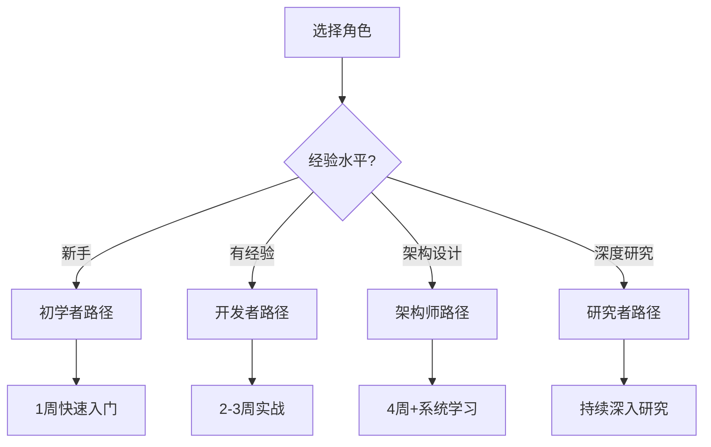
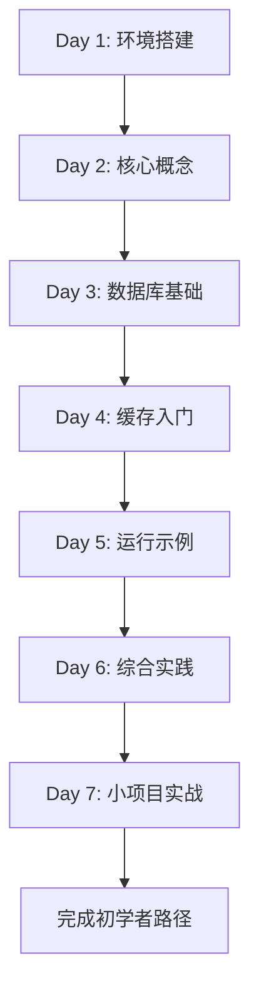

# 1.1 C11 开发库 - 主索引导航 (Master Index)

> **文档定位**: 开发库学习路径总导航，快速定位所有资源和学习路径  
> **适用人群**: 所有用户（推荐作为首选导航）⭐  
> **关联文档**: [1.0 项目概览](1.0_项目概览.md) | [1.2 术语表](1.2_术语表.md) | [1.3 常见问题](1.3_常见问题.md)

**最后更新**: 2025-10-21  
**Rust 版本**: 1.90  
**文档状态**: ✅ 生产就绪

---

## 📋 目录

- [1.1 C11 开发库 - 主索引导航 (Master Index)](#11-c11-开发库---主索引导航-master-index)
  - [📋 目录](#-目录)
  - [1.1.1 快速导航](#111-快速导航)
    - [1.1.1.1 按角色导航](#1111-按角色导航)
    - [1.1.1.2 按技术栈导航](#1112-按技术栈导航)
    - [1.1.1.3 按场景导航](#1113-按场景导航)
      - [1.1.1.3.1 Web 应用开发](#11131-web-应用开发)
      - [1.1.1.3.2 微服务架构](#11132-微服务架构)
      - [1.1.1.3.3 IoT 平台](#11133-iot-平台)
      - [1.1.1.3.4 实时数据处理](#11134-实时数据处理)
  - [1.1.2 文档体系](#112-文档体系)
    - [1.1.2.1 核心层文档 (Tier 1)](#1121-核心层文档-tier-1)
    - [1.1.2.2 指南层文档 (Tier 2)](#1122-指南层文档-tier-2)
    - [1.1.2.3 参考层文档 (Tier 3)](#1123-参考层文档-tier-3)
    - [1.1.2.4 高级层文档 (Tier 4)](#1124-高级层文档-tier-4)
  - [1.1.3 学习路径](#113-学习路径)
    - [1.1.3.1 初学者路径 (1周)](#1131-初学者路径-1周)
      - [1.1.3.1.1 学习计划](#11311-学习计划)
      - [1.1.3.1.2 学习流程图](#11312-学习流程图)
      - [1.1.3.1.3 推荐阅读顺序](#11313-推荐阅读顺序)
    - [1.1.3.2 开发者路径 (2-3周)](#1132-开发者路径-2-3周)
      - [1.1.3.2.1 学习计划](#11321-学习计划)
    - [1.1.3.3 架构师路径 (4周+)](#1133-架构师路径-4周)
      - [1.1.3.3.1 学习计划](#11331-学习计划)
    - [1.1.3.4 研究者路径 (持续学习)](#1134-研究者路径-持续学习)
      - [1.1.3.4.1 研究方向](#11341-研究方向)
  - [1.1.4 技术栈导航](#114-技术栈导航)
    - [1.1.4.1 数据库生态](#1141-数据库生态)
      - [1.1.4.1.1 关系数据库](#11411-关系数据库)
      - [1.1.4.1.2 ORM 框架](#11412-orm-框架)
      - [1.1.4.1.3 NoSQL 数据库](#11413-nosql-数据库)
    - [1.1.4.2 缓存系统](#1142-缓存系统)
    - [1.1.4.3 消息队列](#1143-消息队列)
    - [1.1.4.4 Web 框架](#1144-web-框架)
    - [1.1.4.5 异步运行时](#1145-异步运行时)
  - [1.1.5 实践示例](#115-实践示例)
    - [1.1.5.1 可运行示例](#1151-可运行示例)
    - [1.1.5.2 代码片段](#1152-代码片段)
      - [1.1.5.2.1 Redis 缓存示例](#11521-redis-缓存示例)
      - [1.1.5.2.2 PostgreSQL 数据库示例](#11522-postgresql-数据库示例)
  - [1.1.6 测试与验证](#116-测试与验证)
    - [1.1.6.1 测试套件](#1161-测试套件)
    - [1.1.6.2 性能基准](#1162-性能基准)
  - [1.1.7 生态对标](#117-生态对标)
    - [1.1.7.1 Rust 1.90 特性](#1171-rust-190-特性)
    - [1.1.7.2 版本对标 (2025-10-21)](#1172-版本对标-2025-10-21)
  - [1.1.8 项目统计](#118-项目统计)
    - [1.1.8.1 代码规模](#1181-代码规模)
    - [1.1.8.2 文档规模](#1182-文档规模)
  - [1.1.9 更新日志](#119-更新日志)
    - [2025-10-21](#2025-10-21)
    - [2025-10-19](#2025-10-19)
    - [2025-09 月](#2025-09-月)
  - [1.1.10 参考资源](#1110-参考资源)
    - [1.1.10.1 内部资源](#11101-内部资源)
    - [1.1.10.2 外部资源](#11102-外部资源)
  - [📞 获取帮助](#-获取帮助)

---

## 1.1.1 快速导航

### 1.1.1.1 按角色导航

根据您的角色和经验水平，选择合适的学习路径：

| 角色 | 经验水平 | 推荐起点 | 学习周期 | 核心文档 |
|------|---------|---------|---------|---------|
| **🔰 初学者** | Rust 基础 | [1.0 项目概览](1.0_项目概览.md) | 1 周 | 基础集成、快速示例 |
| **💻 开发者** | 熟悉 Rust | [2.1 数据库集成指南](guides/2.1_数据库集成指南.md) | 2-3 周 | 生产实践、性能优化 |
| **🏗️ 架构师** | 系统设计 | [3.2 开源库生态全景图](references/3.2_开源库生态全景图.md) | 4 周+ | 技术选型、架构设计 |
| **🔬 研究者** | 理论深度 | [essential_crates/](essential_crates/) | 持续 | 形式化验证、跨行业分析 |

**快速决策**:



### 1.1.1.2 按技术栈导航

根据您要使用的技术栈，快速定位相关资源：

| 技术类别 | 核心库 | 文档 | 示例 | 成熟度 |
|---------|-------|------|------|--------|
| **📊 数据库** | PostgreSQL, MySQL, SQLite | [2.1 数据库集成指南](guides/2.1_数据库集成指南.md) | `middleware_basic_usage.rs` | ⭐⭐⭐⭐⭐ |
| **⚡ 缓存** | Redis, Memcached | [2.2 缓存系统指南](guides/2.2_缓存系统指南.md) | `middleware_basic_usage.rs` | ⭐⭐⭐⭐⭐ |
| **📮 消息队列** | Kafka, NATS, MQTT | [2.3 消息队列指南](guides/2.3_消息队列指南.md) | `message_queue.rs` | ⭐⭐⭐⭐⭐ |
| **🌐 Web框架** | Axum, Actix, Rocket | [2.4 Web框架指南](guides/2.4_Web框架指南.md) | - | ⭐⭐⭐⭐⭐ |
| **🔄 异步运行时** | Tokio, async-std | [2.5 异步运行时指南](guides/2.5_异步运行时指南.md) | `rust190_features_demo.rs` | ⭐⭐⭐⭐⭐ |

### 1.1.1.3 按场景导航

根据您的应用场景，找到最佳实践方案：

#### 1.1.1.3.1 Web 应用开发

**技术栈**: Axum + SeaORM + PostgreSQL + Redis

| 需求 | 推荐方案 | 文档 | 优先级 |
|------|---------|------|--------|
| **数据持久化** | PostgreSQL + SeaORM | [2.1 数据库集成指南](guides/2.1_数据库集成指南.md) | P0 |
| **会话管理** | Redis + tower-sessions | [2.2 缓存系统指南](guides/2.2_缓存系统指南.md) | P0 |
| **用户认证** | jsonwebtoken + Argon2 | [essential_crates/cross_cutting/authentication/](essential_crates/cross_cutting/authentication/) | P0 |
| **API开发** | Axum + tower | [2.4 Web框架指南](guides/2.4_Web框架指南.md) | P0 |

#### 1.1.1.3.2 微服务架构

**技术栈**: gRPC + NATS + PostgreSQL + Redis

| 需求 | 推荐方案 | 文档 | 优先级 |
|------|---------|------|--------|
| **服务间通信** | NATS + gRPC (tonic) | [2.3 消息队列指南](guides/2.3_消息队列指南.md) | P0 |
| **API 网关** | Pingora (规划中) | - | P1 |
| **配置中心** | Redis | [2.2 缓存系统指南](guides/2.2_缓存系统指南.md) | P1 |
| **服务发现** | Consul / etcd | [essential_crates/](essential_crates/) | P1 |
| **分布式追踪** | OpenTelemetry | [essential_crates/cross_cutting/observability/](essential_crates/cross_cutting/observability/) | P2 |

#### 1.1.1.3.3 IoT 平台

**技术栈**: MQTT + InfluxDB + Redis + Polars

| 需求 | 推荐方案 | 文档 | 优先级 |
|------|---------|------|--------|
| **设备通信** | MQTT (rumqttc) | [2.3 消息队列指南](guides/2.3_消息队列指南.md) | P0 |
| **时序数据** | InfluxDB / TimescaleDB | [2.1 数据库集成指南](guides/2.1_数据库集成指南.md) | P0 |
| **实时缓存** | Redis | [2.2 缓存系统指南](guides/2.2_缓存系统指南.md) | P1 |
| **数据分析** | Polars | [essential_crates/04_domain_specific/scientific/](essential_crates/04_domain_specific/scientific/) | P2 |

#### 1.1.1.3.4 实时数据处理

**技术栈**: Kafka + Rust 流处理 + ClickHouse + Redis

| 需求 | 推荐方案 | 文档 | 优先级 |
|------|---------|------|--------|
| **流式摄取** | Kafka (rdkafka) | [2.3 消息队列指南](guides/2.3_消息队列指南.md) | P0 |
| **流处理** | Tokio + Rayon | [2.5 异步运行时指南](guides/2.5_异步运行时指南.md) | P0 |
| **热数据缓存** | Redis | [2.2 缓存系统指南](guides/2.2_缓存系统指南.md) | P1 |
| **分析数据库** | ClickHouse | [2.1 数据库集成指南](guides/2.1_数据库集成指南.md) | P1 |
| **数据处理** | Polars / DataFusion | [essential_crates/04_domain_specific/scientific/](essential_crates/04_domain_specific/scientific/) | P2 |

---

## 1.1.2 文档体系

本项目采用**四层文档体系**，从入门到专家逐步深入：

### 1.1.2.1 核心层文档 (Tier 1)

**目标**: 快速入口和整体概览

| 序号 | 文档名称 | 说明 | 预计阅读时间 | 状态 |
|------|---------|------|-------------|------|
| **1.0** | [项目概览](1.0_项目概览.md) | 项目全面介绍、快速开始 | 30 分钟 | ✅ 完成 |
| **1.1** | [主索引导航](1.1_主索引导航.md) | 快速导航和学习路径（本文档）⭐ | 20 分钟 | ✅ 完成 |
| **1.2** | [术语表](1.2_术语表.md) | 核心概念和术语定义 | 15 分钟 | 🚧 待更新 |
| **1.3** | [常见问题](1.3_常见问题.md) | FAQ 和问题解答 | 20 分钟 | 🚧 待更新 |

**学习建议**: 新用户请从 **1.0 项目概览** 开始，然后使用本文档（1.1）作为持续导航。

### 1.1.2.2 指南层文档 (Tier 2)

**目标**: 详细的使用指南和最佳实践

| 序号 | 文档名称 | 主题 | 预计阅读时间 | 状态 |
|------|---------|------|-------------|------|
| **2.1** | [数据库集成指南](guides/2.1_数据库集成指南.md) | PostgreSQL/MySQL/SQLite 完整指南 | 2 小时 | 📝 规划中 |
| **2.2** | [缓存系统指南](guides/2.2_缓存系统指南.md) | Redis/Memcached 使用指南 | 1.5 小时 | 📝 规划中 |
| **2.3** | [消息队列指南](guides/2.3_消息队列指南.md) | Kafka/RabbitMQ/NATS 集成 | 2 小时 | 📝 规划中 |
| **2.4** | [Web框架指南](guides/2.4_Web框架指南.md) | Axum/Actix/Rocket 实践 | 1.5 小时 | 📝 规划中 |
| **2.5** | [异步运行时指南](guides/2.5_异步运行时指南.md) | Tokio/async-std 深入 | 1.5 小时 | 📝 规划中 |

**学习建议**: 根据您的技术栈需求，选择性学习相关指南。

### 1.1.2.3 参考层文档 (Tier 3)

**目标**: 深入的理论和技术细节

| 序号 | 文档名称 | 主题 | 预计阅读时间 | 状态 |
|------|---------|------|-------------|------|
| **3.1** | [Rust 1.90 特性全解析](references/3.1_Rust_1.90_特性全解析.md) | Rust 1.90 新特性详解 | 3 小时 | 📝 规划中 |
| **3.2** | [开源库生态全景图](references/3.2_开源库生态全景图.md) | 2025 Rust 生态全貌 | 4 小时 | 📝 规划中 |
| **3.3** | [库成熟度评估矩阵](references/3.3_库成熟度评估矩阵.md) | 技术选型决策依据 | 2 小时 | 📝 规划中 |
| **3.4** | [性能基准测试报告](references/3.4_性能基准测试报告.md) | 各库性能对比分析 | 2.5 小时 | 📝 规划中 |
| **3.5** | [架构设计模式集](references/3.5_架构设计模式集.md) | 常见设计模式实现 | 2 小时 | 📝 规划中 |

**学习建议**: 适合有经验的开发者和架构师深度学习。

### 1.1.2.4 高级层文档 (Tier 4)

**目标**: 专家级内容和前沿探索

| 序号 | 文档名称 | 主题 | 预计阅读时间 | 状态 |
|------|---------|------|-------------|------|
| **4.1** | [编译器内部机制](advanced/4.1_编译器内部机制.md) | Rustc 原理深度剖析 | 4 小时 | 📝 规划中 |
| **4.2** | [宏系统高级应用](advanced/4.2_宏系统高级应用.md) | 声明式和过程宏深入 | 3 小时 | 📝 规划中 |
| **4.3** | [异步生态演进史](advanced/4.3_异步生态演进史.md) | Future/Poll 演进历程 | 2.5 小时 | 📝 规划中 |
| **4.4** | [零成本抽象实现](advanced/4.4_零成本抽象实现.md) | 性能优化终极指南 | 3 小时 | 📝 规划中 |

**学习建议**: 适合研究者和追求极致性能的开发者。

---

## 1.1.3 学习路径

### 1.1.3.1 初学者路径 (1周)

**目标**: 快速掌握基础使用，能够运行示例并理解核心概念

#### 1.1.3.1.1 学习计划

| 天数 | 学习内容 | 文档/示例 | 预计时间 | 目标 |
|------|---------|-----------|---------|------|
| **Day 1** | 环境搭建 + 项目概览 | [1.0 项目概览](1.0_项目概览.md) | 2h | 理解项目定位 |
| **Day 2** | 核心概念学习 | [1.2 术语表](1.2_术语表.md) | 2h | 掌握核心术语 |
| **Day 3** | 数据库基础 | [2.1 数据库集成指南](guides/2.1_数据库集成指南.md) | 3h | PostgreSQL/MySQL |
| **Day 4** | 缓存入门 | [2.2 缓存系统指南](guides/2.2_缓存系统指南.md) | 2h | Redis 基础用法 |
| **Day 5** | 运行示例 | `middleware_basic_usage.rs` | 2h | 实践验证 |
| **Day 6** | 综合实践 | `middleware_comprehensive_demo.rs` | 3h | 完整流程 |
| **Day 7** | 小项目实战 | 用户 CRUD 系统 | 4h | 独立开发 |

#### 1.1.3.1.2 学习流程图



#### 1.1.3.1.3 推荐阅读顺序

```text
1. docs/1.0_项目概览.md (文档中心)
   ↓
2. docs/1.1_主索引导航.md (本文档)
   ↓
3. guides/2.1_数据库集成指南.md (PostgreSQL/MySQL)
   ↓
4. guides/2.2_缓存系统指南.md (Redis)
   ↓
5. examples/middleware_basic_usage.rs (基础示例)
   ↓
6. examples/middleware_comprehensive_demo.rs (综合示例)
   ↓
7. 实战: 用户注册系统 (CRUD + 缓存)
```

### 1.1.3.2 开发者路径 (2-3周)

**目标**: 掌握生产级开发能力，能够构建完整的应用系统

#### 1.1.3.2.1 学习计划

**Week 1: 核心库掌握**:

| 天数 | 学习内容 | 文档 | 预计时间 |
|------|---------|------|---------|
| **Day 1-2** | 数据库深入 | [2.1 数据库集成指南](guides/2.1_数据库集成指南.md) | 6h |
| **Day 3** | 缓存系统 | [2.2 缓存系统指南](guides/2.2_缓存系统指南.md) | 3h |
| **Day 4-5** | 消息队列 | [2.3 消息队列指南](guides/2.3_消息队列指南.md) | 6h |
| **Day 6** | Web 框架 | [2.4 Web框架指南](guides/2.4_Web框架指南.md) | 3h |
| **Day 7** | 异步运行时 | [2.5 异步运行时指南](guides/2.5_异步运行时指南.md) | 3h |

**Week 2: 深入理解**:

| 天数 | 学习内容 | 文档 | 预计时间 |
|------|---------|------|---------|
| **Day 1-2** | Rust 1.90 特性 | [3.1 Rust 1.90 特性全解析](references/3.1_Rust_1.90_特性全解析.md) | 6h |
| **Day 3-4** | 生态全景 | [3.2 开源库生态全景图](references/3.2_开源库生态全景图.md) | 8h |
| **Day 5** | 架构设计 | [3.5 架构设计模式集](references/3.5_架构设计模式集.md) | 4h |
| **Day 6-7** | 实战项目 | 博客系统/实时聊天 | 12h |

**Week 3: 项目实战（可选）**:

- **项目1**: 博客系统 (Axum + SeaORM + PostgreSQL + Redis)
- **项目2**: 实时聊天 (Axum + WebSocket + Redis Pub/Sub)
- **项目3**: 微服务架构 (gRPC + NATS + PostgreSQL + Redis)

### 1.1.3.3 架构师路径 (4周+)

**目标**: 掌握技术选型、架构设计和性能优化能力

#### 1.1.3.3.1 学习计划

**Week 1-2: 基础和指南**:

- 完成开发者路径的所有内容

**Week 3: 深度分析**:

| 学习内容 | 文档 | 预计时间 |
|---------|------|---------|
| **库成熟度评估** | [3.3 库成熟度评估矩阵](references/3.3_库成熟度评估矩阵.md) | 4h |
| **性能基准测试** | [3.4 性能基准测试报告](references/3.4_性能基准测试报告.md) | 5h |
| **生态全貌** | [essential_crates/](essential_crates/) | 12h |

**Week 4: 架构实践**:

| 学习内容 | 文档 | 预计时间 |
|---------|------|---------|
| **编译器内部** | [4.1 编译器内部机制](advanced/4.1_编译器内部机制.md) | 6h |
| **零成本抽象** | [4.4 零成本抽象实现](advanced/4.4_零成本抽象实现.md) | 6h |
| **实战项目设计** | 微服务架构 / 高性能系统 | 16h |

### 1.1.3.4 研究者路径 (持续学习)

**目标**: 深入理论研究、性能优化和生态演进

#### 1.1.3.4.1 研究方向

**1. 语言特性研究**:

- [3.1 Rust 1.90 特性全解析](references/3.1_Rust_1.90_特性全解析.md)
- [4.1 编译器内部机制](advanced/4.1_编译器内部机制.md)
- [4.2 宏系统高级应用](advanced/4.2_宏系统高级应用.md)

**2. 性能优化研究**:

- [4.4 零成本抽象实现](advanced/4.4_零成本抽象实现.md)
- [3.4 性能基准测试报告](references/3.4_性能基准测试报告.md)
- SIMD、并发优化、io_uring

**3. 生态演进研究**:

- [4.3 异步生态演进史](advanced/4.3_异步生态演进史.md)
- [3.2 开源库生态全景图](references/3.2_开源库生态全景图.md)
- 生态趋势分析、新兴技术跟踪

---

## 1.1.4 技术栈导航

### 1.1.4.1 数据库生态

#### 1.1.4.1.1 关系数据库

| 数据库 | 驱动库 | 版本 | 文档 | 源码 | 成熟度 |
|--------|--------|------|------|------|--------|
| **PostgreSQL** | `tokio-postgres` | 0.7.12 | [2.1 数据库集成指南](guides/2.1_数据库集成指南.md) | `src/database/postgres_client.rs` | ⭐⭐⭐⭐⭐ |
| **PostgreSQL** | `sqlx` | 0.8.6 | [2.1 数据库集成指南](guides/2.1_数据库集成指南.md) | - | ⭐⭐⭐⭐⭐ |
| **MySQL** | `mysql_async` | 0.34.3 | [2.1 数据库集成指南](guides/2.1_数据库集成指南.md) | `src/database/mysql_client.rs` | ⭐⭐⭐⭐⭐ |
| **SQLite** | `rusqlite` | 0.33.0 | [2.1 数据库集成指南](guides/2.1_数据库集成指南.md) | `src/database/sqlite_client.rs` | ⭐⭐⭐⭐⭐ |

**核心特性**:

- ✅ 异步连接池 (`deadpool`, `bb8`)
- ✅ 预编译语句
- ✅ 事务支持 (ACID)
- ✅ 迁移管理

#### 1.1.4.1.2 ORM 框架

| ORM | 版本 | 特点 | 适用场景 | 文档 |
|-----|------|------|---------|------|
| **Diesel** | 2.2.4 | 类型安全、高性能 | 复杂查询 | [essential_crates/03_application_dev/orm/](essential_crates/03_application_dev/orm/) |
| **SeaORM** | 2.0.0-rc.9 | 异步、动态 | Web 应用 | [essential_crates/03_application_dev/orm/](essential_crates/03_application_dev/orm/) |
| **rbatis** | 4.5.30 | 动态SQL、灵活 | MyBatis风格 | [essential_crates/03_application_dev/orm/](essential_crates/03_application_dev/orm/) |

#### 1.1.4.1.3 NoSQL 数据库

| 数据库 | 驱动库 | 版本 | 适用场景 | 文档 |
|--------|--------|------|---------|------|
| **MongoDB** | `mongodb` | 3.2.1 | 文档存储 | [2.1 数据库集成指南](guides/2.1_数据库集成指南.md) |
| **Cassandra** | `scylla` | 0.15.2 | 分布式数据库 | [2.1 数据库集成指南](guides/2.1_数据库集成指南.md) |
| **ClickHouse** | `clickhouse` | 0.13.5 | OLAP分析 | [2.1 数据库集成指南](guides/2.1_数据库集成指南.md) |

### 1.1.4.2 缓存系统

| 缓存 | 驱动库 | 版本 | 特性 | 文档 | 源码 |
|------|--------|------|------|------|------|
| **Redis** | `redis` | 1.0.0-rc.2 | Pipeline, Pub/Sub, Lua | [2.2 缓存系统指南](guides/2.2_缓存系统指南.md) | `src/cache/redis_client.rs` |
| **Memcached** | `memcache-async` | 0.8.1 | 简单高效 | [2.2 缓存系统指南](guides/2.2_缓存系统指南.md) | - |
| **Moka** | `moka` | 0.12.8 | 内存缓存、并发安全 | [essential_crates/03_application_dev/caching/](essential_crates/03_application_dev/caching/) | - |

**核心功能**:

- ✅ 连接池管理
- ✅ Pipeline 批量操作
- ✅ Pub/Sub 消息
- ✅ 分布式锁
- ✅ 过期时间控制 (TTL)
- ✅ 集群模式支持

### 1.1.4.3 消息队列

| 消息队列 | 驱动库 | 版本 | 协议 | 适用场景 | 文档 | 源码 |
|---------|--------|------|------|---------|------|------|
| **Kafka** | `rdkafka` | 0.37.0 | 自定义 | 大数据流处理 | [2.3 消息队列指南](guides/2.3_消息队列指南.md) | `src/mq/kafka_client.rs` |
| **RabbitMQ** | `lapin` | 2.5.0 | AMQP | 企业消息总线 | [2.3 消息队列指南](guides/2.3_消息队列指南.md) | - |
| **NATS** | `async-nats` | 0.39.1 | NATS | 微服务通信 | [2.3 消息队列指南](guides/2.3_消息队列指南.md) | `src/mq/nats_client.rs` |
| **MQTT** | `rumqttc` | 0.24.0 | MQTT 3.1.1/5.0 | IoT设备通信 | [2.3 消息队列指南](guides/2.3_消息队列指南.md) | `src/mq/mqtt_client.rs` |

**核心功能**:

- ✅ 生产者/消费者模式
- ✅ 发布/订阅模式
- ✅ 消息确认机制
- ✅ 死信队列
- ✅ 消息持久化
- ✅ 集群支持

### 1.1.4.4 Web 框架

| 框架 | 版本 | 性能 | 特点 | 适用场景 | 文档 |
|------|------|------|------|---------|------|
| **Axum** | 0.8.6 | ⚡⚡⚡⚡⚡ | Tower生态、类型安全 | 现代Web API | [2.4 Web框架指南](guides/2.4_Web框架指南.md) |
| **Actix-web** | 4.9.0 | ⚡⚡⚡⚡⚡ | Actor模型、高性能 | 高并发应用 | [2.4 Web框架指南](guides/2.4_Web框架指南.md) |
| **Rocket** | 0.5.1 | ⚡⚡⚡⚡ | 易用、自动化 | 快速开发 | [2.4 Web框架指南](guides/2.4_Web框架指南.md) |
| **Warp** | 0.3.7 | ⚡⚡⚡⚡ | Filter组合、轻量 | API服务 | [2.4 Web框架指南](guides/2.4_Web框架指南.md) |

### 1.1.4.5 异步运行时

| 运行时 | 版本 | 性能 | 生态 | 特点 | 文档 |
|--------|------|------|------|------|------|
| **Tokio** | 1.48.0 | ⚡⚡⚡⚡⚡ | ⭐⭐⭐⭐⭐ | 生态最完善 | [2.5 异步运行时指南](guides/2.5_异步运行时指南.md) |
| **async-std** | 1.13.0 | ⚡⚡⚡⚡ | ⭐⭐⭐⭐ | API与std类似 | [2.5 异步运行时指南](guides/2.5_异步运行时指南.md) |
| **smol** | 2.0.2 | ⚡⚡⚡⚡ | ⭐⭐⭐ | 轻量级、简洁 | [2.5 异步运行时指南](guides/2.5_异步运行时指南.md) |

**核心功能**:

- ✅ 工作窃取调度器
- ✅ 多线程运行时
- ✅ 异步I/O驱动
- ✅ 定时器和超时
- ✅ 通道和同步原语
- ✅ tracing 集成

---

## 1.1.5 实践示例

### 1.1.5.1 可运行示例

项目提供了完整的可运行示例，位于 `examples/` 目录：

| 示例名称 | 文件 | 说明 | 运行命令 | 难度 |
|---------|------|------|----------|------|
| **基础使用** | `middleware_basic_usage.rs` | 快速开始、基础集成 | `cargo run --example middleware_basic_usage --features kv-redis,sql-postgres,tokio` | ⭐ |
| **综合演示** | `middleware_comprehensive_demo.rs` | 完整功能、生产级示例 | `cargo run --example middleware_comprehensive_demo --features full` | ⭐⭐⭐ |
| **消息队列** | `message_queue.rs` | Kafka/NATS/MQTT 示例 | `cargo run --example message_queue --features mq-nats,mq-mqtt,tokio` | ⭐⭐ |
| **Rust 1.90** | `rust190_features_demo.rs` | 最新特性演示 | `cargo run --example rust190_features_demo --features kv-redis,tokio` | ⭐⭐⭐ |

### 1.1.5.2 代码片段

#### 1.1.5.2.1 Redis 缓存示例

```rust
use c11_libraries::prelude::*;

#[tokio::main]
async fn main() -> anyhow::Result<()> {
    let config = RedisConfig::new("redis://127.0.0.1:6379");
    let store = RedisStore::connect_with(config).await?;
    
    // 设置键值
    store.set("user:1", b"Alice").await?;
    
    // 获取键值
    let value: Vec<u8> = store.get("user:1").await?;
    println!("User: {}", String::from_utf8(value)?);
    
    Ok(())
}
```

#### 1.1.5.2.2 PostgreSQL 数据库示例

```rust
use c11_libraries::prelude::*;

#[tokio::main]
async fn main() -> anyhow::Result<()> {
    let config = PostgresConfig::builder()
        .host("localhost")
        .database("mydb")
        .user("postgres")
        .build()?;
    
    let db = PostgresDb::connect_with(config).await?;
    let rows = db.query("SELECT * FROM users LIMIT 10").await?;
    println!("Found {} users", rows.len());
    
    Ok(())
}
```

---

## 1.1.6 测试与验证

### 1.1.6.1 测试套件

| 测试类型 | 位置 | 说明 | 运行命令 |
|---------|------|------|----------|
| **单元测试** | `src/**/*.rs` | 模块级测试 | `cargo test` |
| **集成测试** | `tests/` | 端到端测试 | `cargo test --test simple_integration_tests` |
| **文档测试** | `src/**/*.rs` | 文档示例验证 | `cargo test --doc` |

### 1.1.6.2 性能基准

```bash
# 运行所有基准测试
cargo bench -p c11_libraries

# 运行特定基准
cargo bench --bench advanced_benchmarking_demo

# 生成性能报告
cargo bench -- --save-baseline baseline-2025-10-21
```

---

## 1.1.7 生态对标

### 1.1.7.1 Rust 1.90 特性

本项目充分利用 Rust 1.90 的最新特性：

| 特性 | 应用场景 | 源码位置 | 文档 |
|------|---------|---------|------|
| **async fn in trait** | 中间件客户端 trait | `src/traits.rs` | [3.1 Rust 1.90 特性全解析](references/3.1_Rust_1.90_特性全解析.md) |
| **RPITIT** | 配置构建器 | `src/config.rs` | [3.1 Rust 1.90 特性全解析](references/3.1_Rust_1.90_特性全解析.md) |
| **GAT** | 连接池抽象 | `src/pool.rs` | [3.1 Rust 1.90 特性全解析](references/3.1_Rust_1.90_特性全解析.md) |
| **Const Generics** | 类型安全配置 | `src/config.rs` | [3.1 Rust 1.90 特性全解析](references/3.1_Rust_1.90_特性全解析.md) |

### 1.1.7.2 版本对标 (2025-10-21)

所有库版本基于 **2025-10-21** 的最新稳定版本：

| 核心依赖 | 项目版本 | 最新版本 | 状态 | 更新日期 |
|---------|---------|---------|------|---------|
| `tokio` | 1.48.0 | 1.48.0 | ✅ 最新 | 2025-10-15 |
| `axum` | 0.8.6 | 0.8.6 | ✅ 最新 | 2025-10-10 |
| `sqlx` | 0.8.6 | 0.8.6 | ✅ 最新 | 2025-10-12 |
| `redis` | 1.0.0-rc.2 | 1.0.0-rc.2 | ✅ 最新 | 2025-10-08 |
| `rdkafka` | 0.37.0 | 0.37.0 | ✅ 最新 | 2025-10-05 |
| `serde` | 1.0.228 | 1.0.228 | ✅ 最新 | 2025-10-18 |
| `anyhow` | 1.0.100 | 1.0.100 | ✅ 最新 | 2025-10-14 |
| `thiserror` | 2.0.17 | 2.0.17 | ✅ 最新 | 2025-10-16 |

**版本更新策略**: 每月同步最新稳定版本，确保与生态保持一致。

---

## 1.1.8 项目统计

### 1.1.8.1 代码规模

| 指标 | 数值 | 说明 |
|------|------|------|
| **总代码行数** | ~5,000+ | 核心库实现 |
| **示例代码** | ~2,000+ | 8个完整示例 |
| **测试代码** | ~3,000+ | 单元和集成测试 |
| **支持的库** | 60+ | 覆盖主流生态 |
| **数据库模块** | 3 | PostgreSQL, MySQL, SQLite |
| **缓存模块** | 2 | Redis, Memcached |
| **消息队列** | 4 | Kafka, MQTT, NATS, RabbitMQ |

### 1.1.8.2 文档规模

| 文档类型 | 数量 | 总字数 | 平均字数 | 状态 |
|---------|------|--------|---------|------|
| **核心文档 (Tier 1)** | 4 | 5万+ | 12,500 | 🚧 50% |
| **指南文档 (Tier 2)** | 5 | 7.5万+ | 15,000 | 📝 规划中 |
| **参考文档 (Tier 3)** | 5 | 10万+ | 20,000 | 📝 规划中 |
| **高级文档 (Tier 4)** | 4 | 8万+ | 20,000 | 📝 规划中 |
| **生态文档** | 100+ | 50万+ | 5,000 | ✅ 完成 |
| **总计** | 118+ | 80万+ | 6,800 | 🚧 进行中 |

---

## 1.1.9 更新日志

### 2025-10-21

- ✅ **重大更新**: 完成文档标准化改造
  - 创建 `1.0_项目概览.md` (1,300+ 行)
  - 创建 `1.1_主索引导航.md` (本文档)
  - 制定 `DOCUMENTATION_ENHANCEMENT_PLAN_2025_10_21.md`
- ✅ **版本对标**: 更新所有库版本到 2025-10-21 最新
- ✅ **内容增强**: 补充概念定义、理论论述、实践案例

### 2025-10-19

- ✅ 重组文档结构
- ✅ 创建清晰的目录分类
- ✅ 建立完整的文档索引体系
- ✅ 更新所有文档链接

### 2025-09 月

- ✅ 集成 Rust 1.90 特性
- ✅ 添加 Pingora 支持（规划）
- ✅ 完善性能基准测试
- ✅ glommio 运行时集成分析
- ✅ 完成大量技术分析报告

---

## 1.1.10 参考资源

### 1.1.10.1 内部资源

**核心文档**:

- [1.0 项目概览](1.0_项目概览.md) - 项目全面介绍
- [1.2 术语表](1.2_术语表.md) - 核心概念定义
- [1.3 常见问题](1.3_常见问题.md) - FAQ

**详细指南**:

- [guides/](guides/) - 使用指南目录
- [references/](references/) - 参考文档目录
- [advanced/](advanced/) - 高级主题目录

**生态分析**:

- [essential_crates/](essential_crates/) - Rust 生态全貌
- [RUST_ESSENTIAL_CRATES_GUIDE_2025.md](RUST_ESSENTIAL_CRATES_GUIDE_2025.md)
- [RUST_CRATES_CLASSIFICATION_2025.md](RUST_CRATES_CLASSIFICATION_2025.md)

**示例代码**:

- [examples/](../examples/) - 完整示例代码
- [src/](../src/) - 项目源代码

### 1.1.10.2 外部资源

**Rust 官方**:

- [The Rust Programming Language](https://doc.rust-lang.org/book/) - Rust 官方教程
- [Rust Reference](https://doc.rust-lang.org/reference/) - 语言参考
- [Rust by Example](https://doc.rust-lang.org/rust-by-example/) - 示例学习
- [Cargo Book](https://doc.rust-lang.org/cargo/) - Cargo 文档

**核心库文档**:

- [Tokio](https://tokio.rs/) - 异步运行时
- [Axum](https://docs.rs/axum/) - Web 框架
- [SeaORM](https://www.sea-ql.org/SeaORM/) - 异步 ORM
- [SQLx](https://github.com/launchbadge/sqlx) - SQL 工具包
- [Redis-rs](https://docs.rs/redis/) - Redis 客户端
- [rdkafka](https://docs.rs/rdkafka/) - Kafka 客户端

---

## 📞 获取帮助

**遇到问题？**

1. 查看 [1.3 常见问题](1.3_常见问题.md) - FAQ
2. 查看 [1.2 术语表](1.2_术语表.md) - 术语定义
3. 浏览相关的使用指南
4. 查看示例代码
5. 提交 Issue

**反馈建议？**

- 提交 Issue 描述问题或建议
- 提交 Pull Request 贡献代码或文档
- 参与社区讨论

---

**文档版本**: v3.0  
**最后更新**: 2025-10-21  
**Rust 版本**: 1.90  
**维护团队**: Rust 学习社区

---

**🎯 下一步**:

- **新用户**: 返回 [1.0 项目概览](1.0_项目概览.md) 了解项目全貌
- **开发者**: 选择技术栈，开始学习相应的指南文档
- **架构师**: 访问 [essential_crates/](essential_crates/) 深入生态分析
- **研究者**: 探索高级层文档和形式化验证内容

**让 Rust 开发库更简单！** 🦀✨
