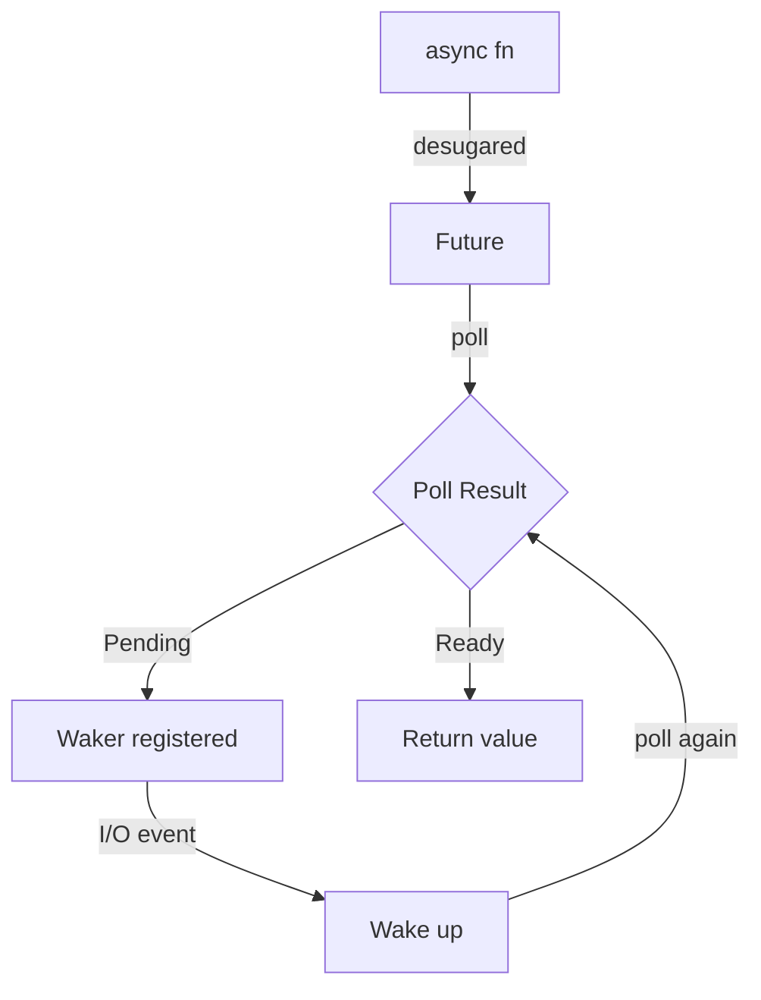
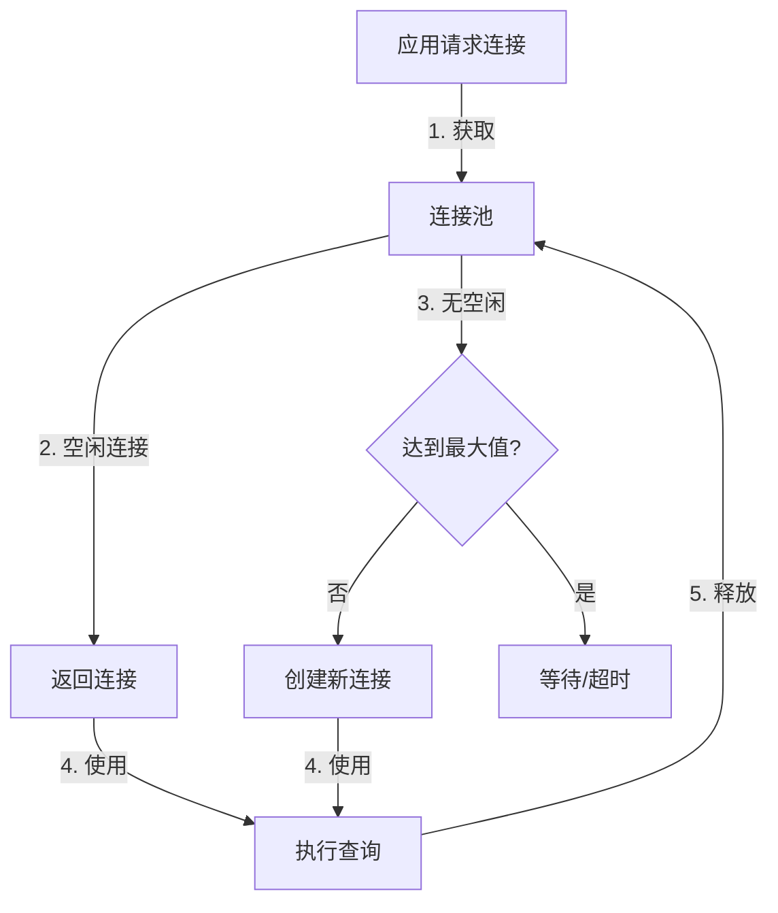
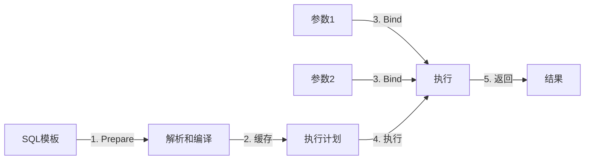
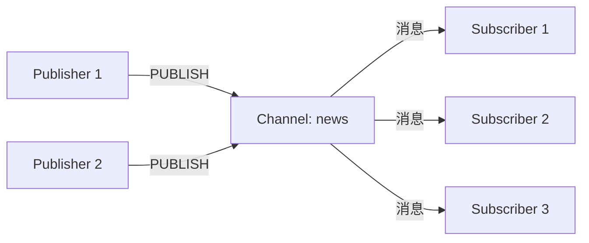
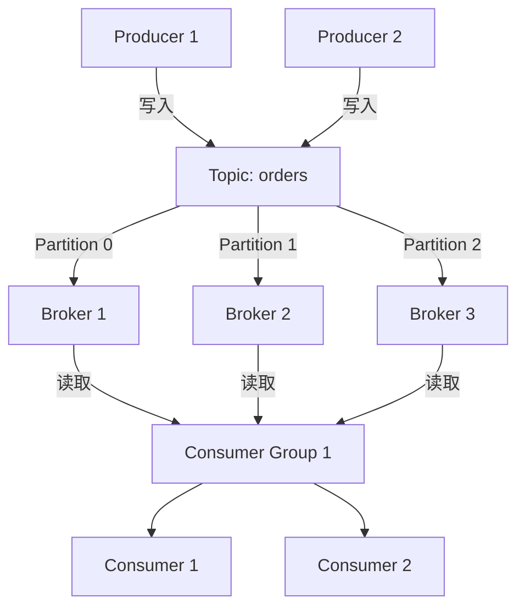
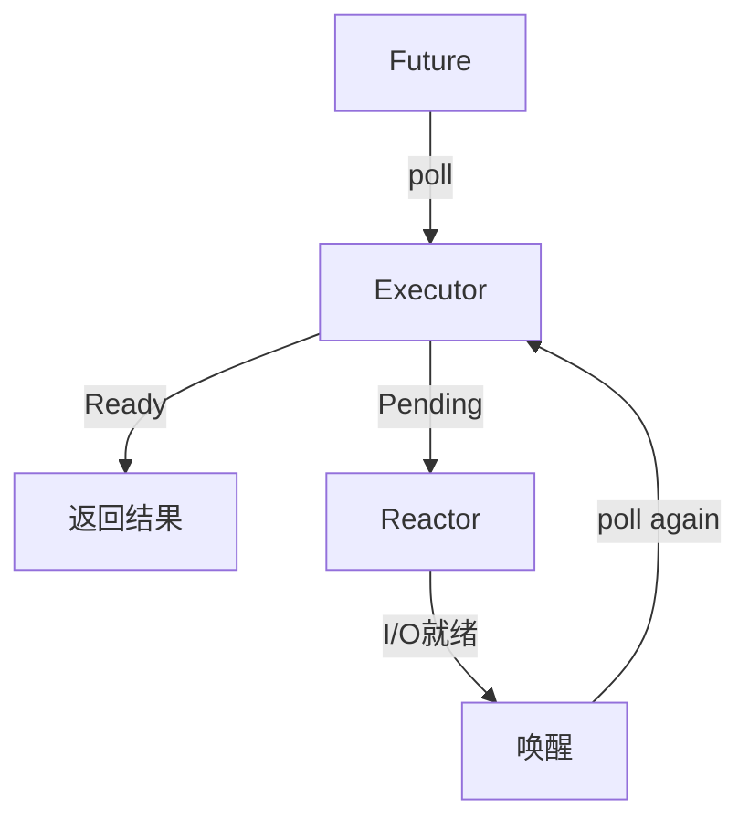

# 1.2 C11 开发库 - 术语表 (Glossary)

> **文档定位**: Rust 开发库核心术语深度参考，涵盖概念定义、理论论述、关系分析  
> **适用人群**: 所有开发者（推荐系统学习）  
> **关联文档**: [1.0 项目概览](1.0_项目概览.md) | [1.1 主索引导航](1.1_主索引导航.md) | [1.3 常见问题](1.3_常见问题.md)

**最后更新**: 2025-10-21  
**Rust 版本**: 1.90  
**文档状态**: ✅ 生产就绪

---

## 📋 目录

- [1.2 C11 开发库 - 术语表 (Glossary)](#12-c11-开发库---术语表-glossary)
  - [📋 目录](#-目录)
  - [1.2.1 快速索引](#121-快速索引)
  - [1.2.2 语言特性](#122-语言特性)
    - [1.2.2.1 async fn in trait](#1221-async-fn-in-trait)
    - [1.2.2.2 RPITIT](#1222-rpitit)
    - [1.2.2.3 泛型关联类型 (GAT)](#1223-泛型关联类型-gat)
    - [1.2.2.4 Const Generics](#1224-const-generics)
    - [1.2.2.5 异步编程 (Async/Await)](#1225-异步编程-asyncawait)
    - [1.2.2.6 Future 和 Poll](#1226-future-和-poll)
    - [1.2.2.7 Pin 和 Unpin](#1227-pin-和-unpin)
  - [1.2.3 数据库生态](#123-数据库生态)
    - [1.2.3.1 SQL](#1231-sql)
    - [1.2.3.2 ORM (对象关系映射)](#1232-orm-对象关系映射)
    - [1.2.3.3 连接池 (Connection Pool)](#1233-连接池-connection-pool)
    - [1.2.3.4 事务 (Transaction)](#1234-事务-transaction)
    - [1.2.3.5 迁移 (Migration)](#1235-迁移-migration)
    - [1.2.3.6 预编译语句 (Prepared Statement)](#1236-预编译语句-prepared-statement)
  - [1.2.4 缓存系统](#124-缓存系统)
    - [1.2.4.1 Redis](#1241-redis)
    - [1.2.4.2 Pipeline](#1242-pipeline)
    - [1.2.4.3 Pub/Sub (发布/订阅)](#1243-pubsub-发布订阅)
    - [1.2.4.4 分布式锁 (Distributed Lock)](#1244-分布式锁-distributed-lock)
    - [1.2.4.5 TTL (过期时间)](#1245-ttl-过期时间)
    - [1.2.4.6 缓存穿透、击穿、雪崩](#1246-缓存穿透击穿雪崩)
  - [1.2.5 消息队列](#125-消息队列)
    - [1.2.5.1 Kafka](#1251-kafka)
    - [1.2.5.2 MQTT](#1252-mqtt)
    - [1.2.5.3 NATS](#1253-nats)
    - [1.2.5.4 RabbitMQ](#1254-rabbitmq)
    - [1.2.5.5 消息语义 (Delivery Semantics)](#1255-消息语义-delivery-semantics)
    - [1.2.5.6 死信队列 (Dead Letter Queue)](#1256-死信队列-dead-letter-queue)
  - [1.2.6 Web 框架](#126-web-框架)
    - [1.2.6.1 Axum](#1261-axum)
    - [1.2.6.2 Tower](#1262-tower)
    - [1.2.6.3 中间件 (Middleware)](#1263-中间件-middleware)
    - [1.2.6.4 路由 (Routing)](#1264-路由-routing)
    - [1.2.6.5 提取器 (Extractor)](#1265-提取器-extractor)
  - [1.2.7 异步运行时](#127-异步运行时)
    - [1.2.7.1 Tokio](#1271-tokio)
    - [1.2.7.2 工作窃取调度器 (Work-Stealing Scheduler)](#1272-工作窃取调度器-work-stealing-scheduler)
    - [1.2.7.3 Reactor 和 Executor](#1273-reactor-和-executor)
    - [1.2.7.4 异步通道 (Async Channel)](#1274-异步通道-async-channel)
  - [1.2.8 参考资源](#128-参考资源)

---

## 1.2.1 快速索引

**按字母顺序**:

A | [async fn in trait](#1221-async-fn-in-trait) | [Axum](#1261-axum)  
C | [Const Generics](#1224-const-generics) | [连接池](#1233-连接池-connection-pool)  
D | [分布式锁](#1244-分布式锁-distributed-lock) | [死信队列](#1256-死信队列-dead-letter-queue)  
F | [Future](#1226-future-和-poll)  
G | [GAT](#1223-泛型关联类型-gat)  
K | [Kafka](#1251-kafka)  
M | [中间件](#1263-中间件-middleware) | [MQTT](#1252-mqtt) | [迁移](#1235-迁移-migration)  
N | [NATS](#1253-nats)  
O | [ORM](#1232-orm-对象关系映射)  
P | [Pin](#1227-pin-和-unpin) | [Pipeline](#1242-pipeline) | [Poll](#1226-future-和-poll) | [预编译语句](#1236-预编译语句-prepared-statement) | [Pub/Sub](#1243-pubsub-发布订阅)  
R | [Reactor](#1273-reactor-和-executor) | [Redis](#1241-redis) | [RabbitMQ](#1254-rabbitmq) | [RPITIT](#1222-rpitit) | [路由](#1264-路由-routing)  
S | [SQL](#1231-sql)  
T | [Tokio](#1271-tokio) | [Tower](#1262-tower) | [Transaction](#1234-事务-transaction) | [TTL](#1245-ttl-过期时间)  
W | [工作窃取调度器](#1272-工作窃取调度器-work-stealing-scheduler)

---

## 1.2.2 语言特性

### 1.2.2.1 async fn in trait

**定义**: Rust 1.75+ 稳定的特性，允许在 trait 中直接使用 `async fn`。

**理论背景**:

在 Rust 1.75 之前，trait 方法不能直接声明为 `async fn`，需要使用 `#[async_trait]` 宏（来自 `async-trait` crate）。
这是因为 `async fn` 会返回一个 `impl Future` 类型，而 trait 方法的返回类型必须是具体的或者使用 GAT/RPITIT。

**语法**:

```rust
trait AsyncDatabase {
    async fn query(&self, sql: &str) -> Result<Vec<Row>>;
}
```

**等价于**:

```rust
trait AsyncDatabase {
    fn query(&self, sql: &str) -> impl Future<Output = Result<Vec<Row>>> + '_;
}
```

**优点**:

- ✅ 不需要 `async-trait` 依赖
- ✅ 更好的编译性能（无宏展开）
- ✅ 更清晰的错误信息
- ✅ 支持 `dyn Trait`（有限制）

**限制**:

- ❌ `dyn AsyncDatabase` 需要额外的生命周期注解
- ❌ 返回的 Future 不能 Send（除非手动标记）

**应用场景**:

- 数据库客户端 trait
- 缓存抽象层
- 异步服务接口

**相关术语**: [RPITIT](#1222-rpitit), [Future](#1226-future-和-poll)

**参考**: [3.1 Rust 1.90 特性全解析](references/3.1_Rust_1.90_特性全解析.md)

---

### 1.2.2.2 RPITIT

**定义**: Return Position Impl Trait in Trait，trait 方法可以返回 `impl Trait`。

**理论背景**:

RPITIT 是 Rust 1.75+ 稳定的语言特性，解决了 trait 方法返回类型抽象化的问题。
在此之前，trait 方法必须返回具体类型或关联类型，这限制了接口的灵活性。

**语法**:

```rust
trait ConfigBuilder {
    fn builder() -> impl Builder;
    fn with_timeout(self, timeout: Duration) -> impl ConfigBuilder;
}
```

**优势**:

- ✅ 类型推导：编译器自动推导返回类型
- ✅ 零成本抽象：无运行时开销
- ✅ 简化 API：调用者不需要知道具体类型
- ✅ 迭代器友好：返回复杂的迭代器链

**对比 GAT**:

| 特性 | RPITIT | GAT |
|------|--------|-----|
| 语法复杂度 | 简单 | 复杂 |
| 返回类型 | 隐式 | 显式 |
| 灵活性 | 中等 | 高 |
| 适用场景 | 简单抽象 | 高级抽象 |

**应用场景**:

- 配置构建器
- 迭代器 trait
- 类型状态模式

**相关术语**: [async fn in trait](#1221-async-fn-in-trait), [GAT](#1223-泛型关联类型-gat)

---

### 1.2.2.3 泛型关联类型 (GAT)

**定义**: Generic Associated Types，关联类型可以有泛型参数。

**理论背景**:

GAT 是 Rust 1.65+ 稳定的特性，允许关联类型拥有泛型参数。
这使得可以定义更灵活的 trait，例如抽象不同生命周期的借用、不同类型的迭代器等。

**语法**:

```rust
trait LendingIterator {
    type Item<'a> where Self: 'a;
    
    fn next(&mut self) -> Option<Self::Item<'_>>;
}
```

**核心能力**:

1. **生命周期参数化**: 关联类型可以关联到 `&self` 的生命周期
2. **类型参数化**: 关联类型可以有多个类型参数
3. **高级抽象**: 实现复杂的类型关系

**典型应用**:

**1. 连接池抽象**:

```rust
trait Pool {
    type Connection<'pool> where Self: 'pool;
    
    async fn acquire(&self) -> Result<Self::Connection<'_>>;
}

impl Pool for PostgresPool {
    type Connection<'pool> = PooledConnection<'pool>;
    
    async fn acquire(&self) -> Result<Self::Connection<'_>> {
        // ...
    }
}
```

**2. 异步迭代器**:

```rust
trait AsyncIterator {
    type Item<'a> where Self: 'a;
    
    async fn next(&mut self) -> Option<Self::Item<'_>>;
}
```

**相关术语**: [RPITIT](#1222-rpitit), [生命周期](https://doc.rust-lang.org/book/ch10-03-lifetime-syntax.html)

---

### 1.2.2.4 Const Generics

**定义**: 允许泛型参数为编译时常量值（如整数）。

**理论背景**:

Const Generics 是 Rust 1.51+ 稳定的特性，允许在泛型参数中使用常量值。这使得数组大小可以泛型化，并支持编译时计算和优化。

**语法**:

```rust
struct Buffer<const N: usize> {
    data: [u8; N],
}

impl<const N: usize> Buffer<N> {
    fn new() -> Self {
        Self { data: [0; N] }
    }
}
```

**应用场景**:

**1. 类型安全配置**:

```rust
struct Config<const MAX_CONNECTIONS: usize = 16> {
    pool_size: usize,
}

impl<const MAX: usize> Config<MAX> {
    fn validate(&self) -> bool {
        self.pool_size <= MAX
    }
}
```

**2. 固定大小缓冲区**:

```rust
struct FixedQueue<T, const N: usize> {
    items: [Option<T>; N],
    len: usize,
}
```

**优势**:

- ✅ 编译时检查大小
- ✅ 零运行时开销
- ✅ 类型安全
- ✅ SIMD 优化友好

**相关术语**: 性能优化、类型安全

---

### 1.2.2.5 异步编程 (Async/Await)

**定义**: Rust 的零成本异步抽象，通过 `async`/`await` 关键字实现协作式多任务。

**理论模型**:

Rust 的异步模型基于 **Future trait** 和 **Poll-based Execution**：

```rust
pub trait Future {
    type Output;
    fn poll(self: Pin<&mut Self>, cx: &mut Context<'_>) -> Poll<Self::Output>;
}

pub enum Poll<T> {
    Ready(T),
    Pending,
}
```

**核心概念**:

1. **Future**: 一个可能尚未完成的计算
2. **async fn**: 返回 `impl Future` 的语法糖
3. **await**: 等待 Future 完成的语法糖
4. **Runtime**: 执行 Future 的调度器（如 Tokio）

**执行流程**:



**优势**:

- ✅ 零成本抽象：无额外运行时开销
- ✅ 无需 GC：基于状态机实现
- ✅ 可组合：Future 可以组合和链式调用
- ✅ 取消安全：支持 async drop（实验中）

**常见模式**:

```rust
// 并发执行
let (result1, result2) = tokio::join!(future1, future2);

// 选择第一个完成的
let result = tokio::select! {
    r1 = future1 => r1,
    r2 = future2 => r2,
};

// 超时控制
let result = tokio::time::timeout(Duration::from_secs(5), future).await?;
```

**相关术语**: [Future](#1226-future-和-poll), [Pin](#1227-pin-和-unpin), [Tokio](#1271-tokio)

**参考**: [2.5 异步运行时指南](guides/2.5_异步运行时指南.md)

---

### 1.2.2.6 Future 和 Poll

**定义**: Rust 异步编程的核心 trait，表示一个可能尚未完成的异步计算。

**Future Trait**:

```rust
pub trait Future {
    type Output;
    
    fn poll(self: Pin<&mut Self>, cx: &mut Context<'_>) -> Poll<Self::Output>;
}
```

**Poll 枚举**:

```rust
pub enum Poll<T> {
    Ready(T),   // 计算完成
    Pending,    // 计算未完成，需要稍后重试
}
```

**核心机制**:

1. **惰性执行**: Future 创建时不会立即执行
2. **轮询驱动**: 通过 `poll` 方法推进执行
3. **Waker 机制**: Pending 时注册唤醒器，事件发生时唤醒
4. **状态机**: 编译器将 `async fn` 编译为状态机

**示例**:

```rust
use std::future::Future;
use std::pin::Pin;
use std::task::{Context, Poll};

struct MyFuture {
    state: u32,
}

impl Future for MyFuture {
    type Output = u32;
    
    fn poll(mut self: Pin<&mut Self>, cx: &mut Context<'_>) -> Poll<Self::Output> {
        if self.state < 10 {
            self.state += 1;
            cx.waker().wake_by_ref(); // 请求再次轮询
            Poll::Pending
        } else {
            Poll::Ready(self.state)
        }
    }
}
```

**Waker 和 Context**:

- **Context**: 包含 Waker，传递给 `poll`
- **Waker**: 用于唤醒 Future，告诉 runtime 可以再次 poll

```rust
// 简化的 Waker 使用示例
if some_condition {
    cx.waker().wake_by_ref(); // 立即唤醒
    Poll::Pending
} else {
    // 注册 waker 到 I/O 事件
    register_waker(cx.waker().clone());
    Poll::Pending
}
```

**相关术语**: [异步编程](#1225-异步编程-asyncawait), [Pin](#1227-pin-和-unpin), [Reactor](#1273-reactor-和-executor)

---

### 1.2.2.7 Pin 和 Unpin

**定义**: `Pin` 是 Rust 中防止数据被移动的类型，用于实现自引用结构和 Future。

**理论背景**:

在异步编程中，Future 内部可能包含自引用指针（指向自身字段的指针）。如果 Future 被移动，这些指针就会失效。`Pin` 保证被 Pin 住的数据不会被移动。

**Pin 类型**:

```rust
pub struct Pin<P> {
    pointer: P,
}

impl<P: Deref> Pin<P> {
    // 只有 P::Target: Unpin 时才能安全获取 &mut T
    pub fn get_mut(self) -> &mut P::Target where P::Target: Unpin;
    
    // 不安全：直接获取可变引用
    pub unsafe fn get_unchecked_mut(self) -> &mut P::Target;
}
```

**Unpin Trait**:

```rust
pub auto trait Unpin {}
```

- 大多数类型自动实现 `Unpin`（可以安全移动）
- 不实现 `Unpin` 的类型（如某些 Future）不能安全移动

**使用场景**:

**1. Future trait 签名**:

```rust
fn poll(self: Pin<&mut Self>, cx: &mut Context<'_>) -> Poll<Self::Output>;
```

**2. 创建 Pin**:

```rust
use std::pin::Pin;

let mut value = String::from("hello");
let pinned = Pin::new(&mut value); // String 实现了 Unpin
```

**3. 不安全的 Pin**:

```rust
use std::pin::Pin;

struct SelfReferential {
    data: String,
    ptr: *const String,
}

// !Unpin: 不能安全移动
impl !Unpin for SelfReferential {}

let boxed = Box::new(SelfReferential { ... });
let pinned = unsafe { Pin::new_unchecked(boxed) };
```

**关键规则**:

- ✅ `Pin<&mut T>` 保证 `T` 不会被移动
- ✅ 如果 `T: Unpin`，可以安全获取 `&mut T`
- ✅ 如果 `T: !Unpin`，只能通过 unsafe 获取 `&mut T`

**相关术语**: [Future](#1226-future-和-poll), [异步编程](#1225-异步编程-asyncawait)

**参考**: [The Rustonomicon: Pin and Unpin](https://doc.rust-lang.org/nomicon/pin.html)

---

## 1.2.3 数据库生态

### 1.2.3.1 SQL

**定义**: Structured Query Language（结构化查询语言），用于管理和操作关系数据库的标准语言。

**理论基础**:

SQL 基于关系代数和关系演算理论，由 Edgar F. Codd 在 1970 年代提出。它是声明式语言，描述"要什么"而非"怎么做"。

**SQL 类别**:

| 类别 | 全称 | 作用 | 示例 |
|------|------|------|------|
| **DDL** | Data Definition Language | 定义数据库结构 | `CREATE TABLE`, `ALTER TABLE` |
| **DML** | Data Manipulation Language | 操作数据 | `SELECT`, `INSERT`, `UPDATE`, `DELETE` |
| **DCL** | Data Control Language | 控制访问权限 | `GRANT`, `REVOKE` |
| **TCL** | Transaction Control Language | 事务控制 | `COMMIT`, `ROLLBACK` |

**Rust SQL 驱动**:

| 数据库 | 驱动库 | 版本 | 特点 | 文档 |
|--------|--------|------|------|------|
| **PostgreSQL** | `tokio-postgres` | 0.7.12 | 纯 Rust、异步 | [📚](https://docs.rs/tokio-postgres/) |
| **PostgreSQL** | `sqlx` | 0.8.6 | 编译时检查、跨数据库 | [📚](https://docs.rs/sqlx/) |
| **MySQL** | `mysql_async` | 0.34.3 | 异步、高性能 | [📚](https://docs.rs/mysql_async/) |
| **SQLite** | `rusqlite` | 0.33.0 | 同步、嵌入式 | [📚](https://docs.rs/rusqlite/) |

**SQL vs NoSQL**:

| 特性 | SQL | NoSQL |
|------|-----|-------|
| 数据模型 | 关系表 | 文档/键值/图/列族 |
| Schema | 固定 | 灵活 |
| 事务 | ACID | BASE（通常） |
| 扩展性 | 垂直 | 水平 |
| 查询语言 | SQL | 各异 |
| 适用场景 | 复杂查询、事务 | 高并发、大数据、灵活schema |

**相关术语**: [ORM](#1232-orm-对象关系映射), [事务](#1234-事务-transaction), [连接池](#1233-连接池-connection-pool)

**参考**: [2.1 数据库集成指南](guides/2.1_数据库集成指南.md)

---

### 1.2.3.2 ORM (对象关系映射)

**定义**: Object-Relational Mapping，将数据库表映射为对象，通过面向对象的方式操作数据库。

**理论背景**:

ORM 解决了"对象-关系阻抗不匹配"问题，将关系数据库的表、行、列映射为面向对象的类、对象、属性。

**Rust ORM 生态**:

| ORM | 版本 | 类型 | 特点 | 适用场景 |
|-----|------|------|------|---------|
| **Diesel** | 2.2.4 | 编译时 | 类型安全、零成本、同步 | 复杂查询、类型安全 |
| **SeaORM** | 2.0.0-rc.9 | 编译时 | 异步、动态、易用 | Web 应用、现代异步 |
| **rbatis** | 4.5.30 | 运行时 | 动态SQL、MyBatis风格 | 灵活查询、动态条件 |

**Diesel 示例**:

```rust
use diesel::prelude::*;

#[derive(Queryable)]
struct User {
    id: i32,
    name: String,
    email: String,
}

// 类型安全的查询
let users = users::table
    .filter(users::email.like("%@example.com"))
    .select((users::id, users::name, users::email))
    .load::<User>(&mut conn)?;
```

**SeaORM 示例**:

```rust
use sea_orm::*;

#[derive(Clone, Debug, PartialEq, DeriveEntityModel)]
#[sea_orm(table_name = "users")]
pub struct Model {
    #[sea_orm(primary_key)]
    pub id: i32,
    pub name: String,
    pub email: String,
}

// 异步查询
let users: Vec<Model> = Entity::find()
    .filter(Column::Email.contains("example.com"))
    .all(&db)
    .await?;
```

**ORM vs Query Builder vs Raw SQL**:

| 特性 | ORM | Query Builder | Raw SQL |
|------|-----|---------------|---------|
| 类型安全 | ⭐⭐⭐⭐⭐ | ⭐⭐⭐⭐ | ⭐ |
| 灵活性 | ⭐⭐⭐ | ⭐⭐⭐⭐ | ⭐⭐⭐⭐⭐ |
| 性能 | ⭐⭐⭐⭐ | ⭐⭐⭐⭐⭐ | ⭐⭐⭐⭐⭐ |
| 学习曲线 | 陡峭 | 中等 | 简单 |
| 数据库迁移 | 方便 | 中等 | 困难 |

**优势**:

- ✅ 类型安全：编译时检查
- ✅ 代码复用：通用的 CRUD 操作
- ✅ 数据库无关：易于切换数据库
- ✅ 迁移管理：自动生成迁移脚本

**劣势**:

- ❌ 复杂查询：某些复杂查询难以表达
- ❌ 性能开销：额外的抽象层
- ❌ 学习成本：需要学习 ORM 的 API

**相关术语**: [SQL](#1231-sql), [迁移](#1235-迁移-migration)

**参考**: [essential_crates/03_application_dev/orm/](essential_crates/03_application_dev/orm/)

---

### 1.2.3.3 连接池 (Connection Pool)

**定义**: 预先创建并维护一组数据库连接，通过复用连接避免频繁建立和销毁连接的开销。

**理论背景**:

数据库连接的建立包括 TCP 握手、认证、初始化等步骤，开销较大（通常 10-100ms）。
连接池通过复用连接，将开销分摊到多次请求，显著提升性能。

**工作原理**:



**核心参数**:

| 参数 | 说明 | 推荐值 | 影响 |
|------|------|--------|------|
| `min_connections` | 最小连接数 | 5-10 | 启动时预热 |
| `max_connections` | 最大连接数 | 10-50 | CPU核心数 * 2-5 |
| `connection_timeout` | 获取连接超时 | 30s | 防止无限等待 |
| `idle_timeout` | 空闲超时 | 10min | 释放空闲连接 |
| `max_lifetime` | 连接最大生命周期 | 30min | 防止连接泄漏 |

**Rust 连接池实现**:

| 库 | 版本 | 类型 | 特点 | 支持数据库 |
|-----|------|------|------|-----------|
| **deadpool** | 0.12.2 | 异步 | 通用、灵活 | PostgreSQL, Redis, SQLite |
| **bb8** | 0.8.5 | 异步 | 简单、高性能 | PostgreSQL, Redis |
| **r2d2** | 0.8.10 | 同步 | 成熟、稳定 | PostgreSQL, MySQL, SQLite |

**deadpool 示例**:

```rust
use deadpool_postgres::{Config, ManagerConfig, Pool, RecyclingMethod, Runtime};
use tokio_postgres::NoTls;

let mut cfg = Config::new();
cfg.host = Some("localhost".to_string());
cfg.dbname = Some("mydb".to_string());
cfg.manager = Some(ManagerConfig {
    recycling_method: RecyclingMethod::Fast,
});
cfg.pool = Some(PoolConfig {
    max_size: 16,
    timeouts: Timeouts {
        wait: Some(Duration::from_secs(30)),
        create: Some(Duration::from_secs(30)),
        recycle: Some(Duration::from_secs(30)),
    },
});

let pool = cfg.create_pool(Some(Runtime::Tokio1), NoTls)?;

// 获取连接
let client = pool.get().await?;
let rows = client.query("SELECT * FROM users", &[]).await?;
```

**连接池调优**:

**1. 确定最大连接数**:

```text
max_connections = (CPU核心数 * 2) + 磁盘数量
```

**2. 监控指标**:

- 等待时间（wait time）
- 连接使用率（connection utilization）
- 超时次数（timeout count）

**3. 常见问题**:

- **连接泄漏**: 连接未正确释放 → 使用 `max_lifetime`
- **连接耗尽**: `max_connections` 太小 → 增加连接数或优化查询
- **连接过多**: 数据库压力大 → 减少 `max_connections`

**相关术语**: [SQL](#1231-sql), 性能优化

**参考**: [2.1 数据库集成指南](guides/2.1_数据库集成指南.md)

---

### 1.2.3.4 事务 (Transaction)

**定义**: 一组数据库操作的逻辑单元，要么全部成功，要么全部失败，保证数据一致性。

**ACID 特性**:

| 特性 | 英文 | 说明 | 示例 |
|------|------|------|------|
| **原子性** | Atomicity | 全部成功或全部失败 | 转账：扣款和加款必须同时成功 |
| **一致性** | Consistency | 数据从一个一致状态到另一个一致状态 | 转账前后总金额不变 |
| **隔离性** | Isolation | 并发事务互不干扰 | 两个转账操作互不影响 |
| **持久性** | Durability | 提交后永久保存 | 断电后数据不丢失 |

**事务隔离级别**:

| 隔离级别 | 脏读 | 不可重复读 | 幻读 | 性能 | 适用场景 |
|---------|------|-----------|------|------|---------|
| **Read Uncommitted** | ✅ 是 | ✅ 是 | ✅ 是 | ⭐⭐⭐⭐⭐ | 极少使用 |
| **Read Committed** | ❌ 否 | ✅ 是 | ✅ 是 | ⭐⭐⭐⭐ | PostgreSQL 默认 |
| **Repeatable Read** | ❌ 否 | ❌ 否 | ✅ 是 | ⭐⭐⭐ | MySQL 默认 |
| **Serializable** | ❌ 否 | ❌ 否 | ❌ 否 | ⭐⭐ | 强一致性要求 |

**Rust 事务示例**:

**1. 显式事务（PostgreSQL）**:

```rust
use tokio_postgres::Transaction;

let mut client = pool.get().await?;
let transaction = client.transaction().await?;

// 扣款
transaction.execute(
    "UPDATE accounts SET balance = balance - $1 WHERE id = $2",
    &[&100.0, &1],
).await?;

// 加款
transaction.execute(
    "UPDATE accounts SET balance = balance + $1 WHERE id = $2",
    &[&100.0, &2],
).await?;

// 提交
transaction.commit().await?;
// 或回滚: transaction.rollback().await?;
```

**2. SeaORM 事务**:

```rust
use sea_orm::*;

let txn = db.begin().await?;

// 插入用户
let user = user::ActiveModel {
    name: Set("Alice".to_string()),
    email: Set("alice@example.com".to_string()),
    ..Default::default()
};
let user = user.insert(&txn).await?;

// 插入关联数据
let profile = profile::ActiveModel {
    user_id: Set(user.id),
    bio: Set("Hello".to_string()),
    ..Default::default()
};
profile.insert(&txn).await?;

txn.commit().await?;
```

**分布式事务**:

对于跨数据库/服务的事务，通常使用：

- **2PC (Two-Phase Commit)**: 强一致性，性能较低
- **Saga**: 补偿机制，最终一致性
- **TCC (Try-Confirm-Cancel)**: 预留-确认-取消模式

**相关术语**: [SQL](#1231-sql), [ORM](#1232-orm-对象关系映射)

**参考**: [2.1 数据库集成指南](guides/2.1_数据库集成指南.md)

---

### 1.2.3.5 迁移 (Migration)

**定义**: 数据库结构变更的版本控制，通过脚本管理数据库schema的演进。

**核心概念**:

1. **Up Migration**: 前向迁移，应用新的变更
2. **Down Migration**: 回滚迁移，撤销变更
3. **Version**: 迁移版本号，通常使用时间戳
4. **Migration History**: 记录已应用的迁移

**Rust 迁移工具**:

| 工具 | ORM | 命令 | 特点 |
|------|-----|------|------|
| **diesel_cli** | Diesel | `diesel migration run` | 强类型、自动生成 schema |
| **sea-orm-cli** | SeaORM | `sea-orm-cli migrate up` | 异步、灵活 |
| **sqlx-cli** | SQLx | `sqlx migrate run` | 编译时检查 |

**迁移示例**:

**1. 创建迁移（Diesel）**:

```bash
diesel migration generate create_users
```

生成文件:

```sql
-- up.sql
CREATE TABLE users (
    id SERIAL PRIMARY KEY,
    name VARCHAR(100) NOT NULL,
    email VARCHAR(255) NOT NULL UNIQUE,
    created_at TIMESTAMP NOT NULL DEFAULT CURRENT_TIMESTAMP
);

CREATE INDEX idx_users_email ON users(email);
```

```sql
-- down.sql
DROP INDEX IF EXISTS idx_users_email;
DROP TABLE IF EXISTS users;
```

**2. 应用迁移**:

```bash
diesel migration run
```

**3. 回滚迁移**:

```bash
diesel migration revert
```

**最佳实践**:

1. ✅ **向后兼容**: 先加字段，后删字段
2. ✅ **小步迭代**: 每次迁移只做一件事
3. ✅ **幂等性**: 迁移可以重复运行
4. ✅ **数据迁移**: 先迁移 schema，再迁移数据
5. ✅ **版本控制**: 迁移脚本纳入 Git
6. ✅ **测试迁移**: 在测试环境验证

**相关术语**: [SQL](#1231-sql), [ORM](#1232-orm-对象关系映射)

---

### 1.2.3.6 预编译语句 (Prepared Statement)

**定义**: 预先编译的 SQL 语句模板，可以多次执行，提高性能并防止 SQL 注入。

**工作原理**:



**示例**:

```rust
// 普通查询（不推荐）
let sql = format!("SELECT * FROM users WHERE id = {}", user_id); // SQL注入风险!
let rows = client.query(&sql, &[]).await?;

// 预编译语句（推荐）
let stmt = client.prepare("SELECT * FROM users WHERE id = $1").await?;
let rows = client.query(&stmt, &[&user_id]).await?;
```

**优势**:

1. ✅ **性能**: 避免重复解析和编译
2. ✅ **安全**: 防止 SQL 注入
3. ✅ **类型安全**: 参数类型检查
4. ✅ **缓存**: 数据库缓存执行计划

**性能对比**:

| 查询方式 | 1次查询 | 100次查询 | 1000次查询 |
|---------|--------|----------|-----------|
| 普通查询 | 1x | 100x | 1000x |
| 预编译语句 | 1.2x (首次) | 120x | 1200x |
| **性能提升** | -20% | +17% | +20% |

**相关术语**: [SQL](#1231-sql), [连接池](#1233-连接池-connection-pool)

---

## 1.2.4 缓存系统

### 1.2.4.1 Redis

**定义**: Remote Dictionary Server，开源的内存数据结构存储系统，可用作数据库、缓存和消息代理。

**核心特性**:

1. **内存存储**: 所有数据存储在内存，读写性能极高
2. **持久化**: 支持 RDB 和 AOF 两种持久化方式
3. **数据结构**: 丰富的数据结构支持
4. **单线程模型**: 简化并发控制，避免锁竞争
5. **原子操作**: 所有操作都是原子的

**数据结构**:

| 类型 | 说明 | 时间复杂度 | 应用场景 | 示例命令 |
|------|------|-----------|---------|---------|
| **String** | 字符串/二进制 | O(1) | 缓存、计数器 | `SET`, `GET`, `INCR` |
| **Hash** | 哈希表 | O(1) | 对象存储 | `HSET`, `HGET`, `HGETALL` |
| **List** | 双向链表 | O(1) | 队列、栈 | `LPUSH`, `RPUSH`, `LPOP` |
| **Set** | 无序集合 | O(1) | 标签、去重 | `SADD`, `SMEMBERS`, `SINTER` |
| **Sorted Set** | 有序集合 | O(log N) | 排行榜 | `ZADD`, `ZRANGE`, `ZRANK` |
| **Stream** | 日志流 | O(1) | 消息队列 | `XADD`, `XREAD`, `XRANGE` |

**Rust 驱动**:

```rust
use redis::{Client, Commands, AsyncCommands};

// 同步客户端
let client = Client::open("redis://127.0.0.1:6379")?;
let mut conn = client.get_connection()?;
conn.set("key", "value")?;
let value: String = conn.get("key")?;

// 异步客户端
let client = Client::open("redis://127.0.0.1:6379")?;
let mut conn = client.get_multiplexed_async_connection().await?;
conn.set("key", "value").await?;
let value: String = conn.get("key").await?;
```

**高级特性**:

1. **事务**: `MULTI` + `EXEC`
2. **Lua 脚本**: 原子复合操作
3. **发布/订阅**: 实时消息
4. **管道**: 批量操作
5. **集群**: 水平扩展

**相关术语**: [Pipeline](#1242-pipeline), [Pub/Sub](#1243-pubsub-发布订阅), [分布式锁](#1244-分布式锁-distributed-lock)

**参考**: [2.2 缓存系统指南](guides/2.2_缓存系统指南.md)

---

### 1.2.4.2 Pipeline

**定义**: Redis 批量操作模式，一次性发送多个命令，减少网络往返次数（RTT）。

**工作原理**:

**普通模式**:

```text
Client -> Server: GET key1
Server -> Client: value1  (RTT 1)
Client -> Server: GET key2
Server -> Client: value2  (RTT 2)
Client -> Server: GET key3
Server -> Client: value3  (RTT 3)
Total: 3 RTT
```

**Pipeline 模式**:

```text
Client -> Server: GET key1 + GET key2 + GET key3
Server -> Client: value1 + value2 + value3  (RTT 1)
Total: 1 RTT
```

**性能提升**:

| 命令数 | 普通模式 | Pipeline | 提升倍数 |
|--------|---------|----------|---------|
| 10 | 10 RTT | 1 RTT | 10x |
| 100 | 100 RTT | 1 RTT | 100x |
| 1000 | 1000 RTT | 1 RTT | 1000x |

**Rust 示例**:

```rust
use redis::pipe;

let client = redis::Client::open("redis://127.0.0.1")?;
let mut conn = client.get_multiplexed_async_connection().await?;

// 创建 pipeline
let mut pipe = pipe();
pipe.set("key1", "value1")
    .ignore() // 忽略返回值
    .set("key2", "value2")
    .ignore()
    .get("key1")
    .get("key2");

// 执行 pipeline
let (v1, v2): (String, String) = pipe.query_async(&mut conn).await?;
```

**使用场景**:

- ✅ 批量读取
- ✅ 批量写入
- ✅ 原子性要求不高的场景
- ❌ 不适合有依赖关系的操作

**注意事项**:

1. Pipeline 不保证原子性（不同于事务）
2. 服务端会缓存所有响应，内存占用增加
3. 单个 Pipeline 不宜超过 1000 个命令

**相关术语**: [Redis](#1241-redis)

---

### 1.2.4.3 Pub/Sub (发布/订阅)

**定义**: 消息发布/订阅模式，生产者发布消息到频道，订阅者接收消息。

**模型**:



**核心命令**:

| 命令 | 说明 | 示例 |
|------|------|------|
| `PUBLISH` | 发布消息 | `PUBLISH news "Breaking news!"` |
| `SUBSCRIBE` | 订阅频道 | `SUBSCRIBE news sports` |
| `UNSUBSCRIBE` | 取消订阅 | `UNSUBSCRIBE news` |
| `PSUBSCRIBE` | 模式订阅 | `PSUBSCRIBE news.*` |

**Rust 示例**:

```rust
use redis::AsyncCommands;

// 发布者
let client = redis::Client::open("redis://127.0.0.1")?;
let mut conn = client.get_multiplexed_async_connection().await?;
conn.publish("news", "Breaking news!").await?;

// 订阅者
let client = redis::Client::open("redis://127.0.0.1")?;
let mut conn = client.get_async_connection().await?;
let mut pubsub = conn.into_pubsub();
pubsub.subscribe("news").await?;

let mut stream = pubsub.on_message();
while let Some(msg) = stream.next().await {
    let payload: String = msg.get_payload()?;
    println!("Received: {}", payload);
}
```

**特点**:

- ✅ 实时性：消息即时推送
- ✅ 解耦：发布者和订阅者互不感知
- ✅ 多对多：一个频道可有多个发布者和订阅者
- ❌ 不持久：消息不保存，订阅者离线会丢失消息
- ❌ 无确认：发布者不知道有多少订阅者收到消息

**适用场景**:

- 实时通知（如聊天室）
- 实时数据推送（如股票行情）
- 事件广播（如缓存失效通知）

**对比 Stream**:

| 特性 | Pub/Sub | Stream |
|------|---------|--------|
| 持久化 | ❌ 否 | ✅ 是 |
| 历史消息 | ❌ 否 | ✅ 是 |
| 消费组 | ❌ 否 | ✅ 是 |
| 实时性 | ⭐⭐⭐⭐⭐ | ⭐⭐⭐⭐ |
| 适用场景 | 实时广播 | 消息队列 |

**相关术语**: [Redis](#1241-redis)

---

### 1.2.4.4 分布式锁 (Distributed Lock)

**定义**: 在分布式系统中实现互斥访问共享资源的机制。

**理论背景**:

分布式锁需要满足：

1. **互斥性**: 同一时刻只有一个客户端持有锁
2. **防死锁**: 锁必须能被释放（超时机制）
3. **容错性**: 部分节点故障不影响锁服务
4. **可重入性**: 同一客户端可多次获取锁

**Redis 实现（SET NX EX）**:

```rust
use redis::AsyncCommands;

// 获取锁
let lock_key = "resource:lock";
let lock_value = uuid::Uuid::new_v4().to_string();
let timeout_secs = 10;

let result: bool = conn
    .set_options(
        lock_key,
        &lock_value,
        redis::SetOptions::default()
            .with_expiration(redis::SetExpiry::EX(timeout_secs))
            .conditional_set(redis::ExistenceCheck::NX),
    )
    .await?;

if result {
    // 获取锁成功
    // ... 执行业务逻辑 ...
    
    // 释放锁（Lua 脚本保证原子性）
    let script = r#"
        if redis.call("GET", KEYS[1]) == ARGV[1] then
            return redis.call("DEL", KEYS[1])
        else
            return 0
        end
    "#;
    redis::Script::new(script)
        .key(lock_key)
        .arg(&lock_value)
        .invoke_async(&mut conn)
        .await?;
} else {
    // 获取锁失败
}
```

**Redlock 算法**:

用于 Redis 集群的分布式锁算法（由 Redis 作者 Antirez 提出）：

1. 获取当前时间（毫秒）
2. 尝试从 N 个独立的 Redis 实例获取锁
3. 计算获取锁的总耗时
4. 如果在超过半数（N/2 + 1）的实例上成功获取锁，且总耗时小于锁的有效时间，则认为获取锁成功
5. 否则，释放所有已获取的锁

**使用场景**:

- 定时任务（防止重复执行）
- 库存扣减（防止超卖）
- 分布式 ID 生成
- 配置更新（防止并发冲突）

**注意事项**:

1. ⚠️ 锁超时时间要大于业务执行时间
2. ⚠️ 使用唯一标识（如 UUID）防止误删锁
3. ⚠️ 释放锁要使用 Lua 脚本保证原子性
4. ⚠️ 考虑使用专业的分布式锁服务（如 etcd、ZooKeeper）

**相关术语**: [Redis](#1241-redis)

**参考**: [essential_crates/cross_cutting/security/](essential_crates/cross_cutting/security/)

---

### 1.2.4.5 TTL (过期时间)

**定义**: Time To Live，键的存活时间，到期后自动删除。

**命令**:

| 命令 | 说明 | 示例 |
|------|------|------|
| `EXPIRE` | 设置过期时间（秒） | `EXPIRE key 60` |
| `PEXPIRE` | 设置过期时间（毫秒） | `PEXPIRE key 60000` |
| `EXPIREAT` | 设置过期时间戳（秒） | `EXPIREAT key 1699999999` |
| `TTL` | 查看剩余时间（秒） | `TTL key` |
| `PERSIST` | 移除过期时间 | `PERSIST key` |

**Rust 示例**:

```rust
use redis::AsyncCommands;

// 设置键值并指定过期时间
conn.set_ex("session:user:123", "user_data", 3600).await?;

// 或者分两步
conn.set("cache:result", "data").await?;
conn.expire("cache:result", 300).await?;

// 查看剩余时间
let ttl: i64 = conn.ttl("cache:result").await?;
println!("TTL: {} seconds", ttl);
```

**过期策略**:

Redis 使用**惰性删除** + **定期删除**：

1. **惰性删除**: 访问键时检查是否过期
2. **定期删除**: 每秒扫描部分键，删除过期键

**应用场景**:

- 会话管理（Session）
- 验证码过期
- 临时缓存
- 限流计数器

**相关术语**: [Redis](#1241-redis)

---

### 1.2.4.6 缓存穿透、击穿、雪崩

**定义**: 缓存系统常见的三种故障场景。

**1. 缓存穿透 (Cache Penetration)**:

**定义**: 查询不存在的数据，导致每次都查询数据库。

**原因**: 缓存和数据库都没有数据

**解决方案**:

```rust
// 1. 缓存空值
async fn get_user(id: i32) -> Result<Option<User>> {
    // 先查缓存
    if let Some(cached) = cache.get(&format!("user:{}", id)).await? {
        if cached == "NULL" {
            return Ok(None); // 缓存的空值
        }
        return Ok(Some(serde_json::from_str(&cached)?));
    }
    
    // 查数据库
    let user = db.get_user(id).await?;
    
    if let Some(ref u) = user {
        cache.set_ex(&format!("user:{}", id), serde_json::to_string(u)?, 3600).await?;
    } else {
        // 缓存空值，设置较短过期时间
        cache.set_ex(&format!("user:{}", id), "NULL", 60).await?;
    }
    
    Ok(user)
}

// 2. 布隆过滤器
use probabilistic_collections::bloom::BloomFilter;

let mut bloom = BloomFilter::new(1000000, 0.01);
// 初始化时加载所有ID
for id in all_ids {
    bloom.insert(&id);
}

// 查询时先检查布隆过滤器
if !bloom.contains(&id) {
    return Ok(None); // 一定不存在
}
```

**2. 缓存击穿 (Cache Breakdown)**:

**定义**: 热点键过期，导致大量请求同时查询数据库。

**原因**: 热点数据过期 + 高并发

**解决方案**:

```rust
use tokio::sync::Mutex;
use std::collections::HashMap;

// 使用互斥锁防止并发查询
lazy_static! {
    static ref QUERY_LOCKS: Mutex<HashMap<String, Arc<Mutex<()>>>> = Mutex::new(HashMap::new());
}

async fn get_hot_data(key: &str) -> Result<String> {
    // 先查缓存
    if let Some(data) = cache.get(key).await? {
        return Ok(data);
    }
    
    // 获取或创建锁
    let lock = {
        let mut locks = QUERY_LOCKS.lock().await;
        locks.entry(key.to_string())
            .or_insert_with(|| Arc::new(Mutex::new(())))
            .clone()
    };
    
    // 加锁
    let _guard = lock.lock().await;
    
    // 双重检查
    if let Some(data) = cache.get(key).await? {
        return Ok(data);
    }
    
    // 查询数据库
    let data = db.query(key).await?;
    
    // 写入缓存（设置永不过期或很长的过期时间）
    cache.set(key, &data).await?;
    
    Ok(data)
}
```

**3. 缓存雪崩 (Cache Avalanche)**:

**定义**: 大量缓存同时过期，导致数据库压力激增。

**原因**: 大量键同时过期 + 缓存服务宕机

**解决方案**:

```rust
use rand::Rng;

// 1. 过期时间加随机值
let base_ttl = 3600;
let random_offset = rand::thread_rng().gen_range(0..300);
let ttl = base_ttl + random_offset;
cache.set_ex(key, value, ttl).await?;

// 2. 使用 Redis 集群
// 3. 实现多级缓存
struct MultiLevelCache {
    l1: LocalCache,  // 进程内缓存
    l2: RedisCache,  // Redis 缓存
}

impl MultiLevelCache {
    async fn get(&self, key: &str) -> Result<Option<String>> {
        // 先查 L1
        if let Some(value) = self.l1.get(key) {
            return Ok(Some(value));
        }
        
        // 再查 L2
        if let Some(value) = self.l2.get(key).await? {
            self.l1.set(key, &value, Duration::from_secs(60));
            return Ok(Some(value));
        }
        
        Ok(None)
    }
}

// 4. 限流和熔断
use governor::{Quota, RateLimiter};

let limiter = RateLimiter::direct(Quota::per_second(nonzero!(100u32)));

if limiter.check().is_ok() {
    // 允许查询数据库
} else {
    // 触发限流，返回降级数据
}
```

**对比总结**:

| 问题 | 原因 | 影响 | 解决方案 |
|------|------|------|---------|
| **穿透** | 查询不存在的数据 | 数据库压力 | 缓存空值、布隆过滤器 |
| **击穿** | 热点键过期 | 瞬时数据库压力 | 互斥锁、永不过期 |
| **雪崩** | 大量键同时过期 | 持续数据库压力 | 随机过期、多级缓存、限流 |

**相关术语**: [Redis](#1241-redis), [TTL](#1245-ttl-过期时间)

**参考**: [2.2 缓存系统指南](guides/2.2_缓存系统指南.md)

---

## 1.2.5 消息队列

### 1.2.5.1 Kafka

**定义**: 高吞吐量的分布式流处理平台，广泛应用于日志收集、流处理、事件溯源等场景。

**核心概念**:

| 概念 | 说明 | 类比 |
|------|------|------|
| **Topic** | 消息主题/分类 | 数据库的表 |
| **Partition** | Topic 的分区 | 表的分片 |
| **Producer** | 消息生产者 | 写入者 |
| **Consumer** | 消息消费者 | 读取者 |
| **Consumer Group** | 消费者组 | 负载均衡单元 |
| **Broker** | Kafka 服务器节点 | 集群节点 |
| **Offset** | 消息偏移量 | 消息ID |

**架构图**:



**Rust 驱动（rdkafka）**:

```rust
use rdkafka::config::ClientConfig;
use rdkafka::producer::{FutureProducer, FutureRecord};
use rdkafka::consumer::{Consumer, StreamConsumer};
use rdkafka::message::{BorrowedMessage, Message};

// 生产者
let producer: FutureProducer = ClientConfig::new()
    .set("bootstrap.servers", "localhost:9092")
    .set("message.timeout.ms", "5000")
    .create()?;

let payload = "Hello Kafka!";
producer
    .send(
        FutureRecord::to("my-topic")
            .payload(payload)
            .key("key-1"),
        Duration::from_secs(0),
    )
    .await?;

// 消费者
let consumer: StreamConsumer = ClientConfig::new()
    .set("group.id", "my-consumer-group")
    .set("bootstrap.servers", "localhost:9092")
    .set("enable.auto.commit", "true")
    .set("auto.offset.reset", "earliest")
    .create()?;

consumer.subscribe(&["my-topic"])?;

let mut stream = consumer.stream();
while let Some(message) = stream.next().await {
    match message {
        Ok(msg) => {
            let payload = msg.payload().unwrap();
            let text = std::str::from_utf8(payload)?;
            println!("Received: {}", text);
        }
        Err(e) => eprintln!("Error: {}", e),
    }
}
```

**核心特性**:

1. **高吞吐**: 百万级 TPS
2. **持久化**: 消息存储在磁盘
3. **分区**: 水平扩展
4. **消费者组**: 负载均衡
5. **副本**: 高可用
6. **顺序性**: 单分区内有序

**适用场景**:

- 日志收集和聚合
- 实时数据管道
- 事件溯源（Event Sourcing）
- 流处理（Kafka Streams）

**相关术语**: [消息语义](#1255-消息语义-delivery-semantics)

**参考**: [2.3 消息队列指南](guides/2.3_消息队列指南.md)

---

### 1.2.5.2 MQTT

**定义**: Message Queuing Telemetry Transport，轻量级的发布/订阅消息协议，专为资源受限的设备和低带宽、高延迟网络设计。

**核心概念**:

| 概念 | 说明 |
|------|------|
| **Broker** | MQTT 服务器（如 Mosquitto, EMQX） |
| **Client** | MQTT 客户端（发布者或订阅者） |
| **Topic** | 主题，使用层级结构（如 `home/living_room/temperature`） |
| **QoS** | 服务质量等级（0, 1, 2） |
| **Retained Message** | 保留消息，新订阅者立即收到 |
| **Will Message** | 遗嘱消息，客户端异常断开时发送 |

**QoS 等级**:

| QoS | 名称 | 保证 | 性能 | 适用场景 |
|-----|------|------|------|---------|
| **0** | At most once | 至多一次 | ⭐⭐⭐⭐⭐ | 传感器数据（允许丢失） |
| **1** | At least once | 至少一次 | ⭐⭐⭐⭐ | 通知消息（可重复） |
| **2** | Exactly once | 恰好一次 | ⭐⭐⭐ | 金融交易（不可重复） |

**Rust 驱动（rumqttc）**:

```rust
use rumqttc::{AsyncClient, MqttOptions, QoS};
use tokio::time::Duration;

// 创建客户端
let mut mqttoptions = MqttOptions::new("test-client", "localhost", 1883);
mqttoptions.set_keep_alive(Duration::from_secs(60));

let (client, mut eventloop) = AsyncClient::new(mqttoptions, 10);

// 订阅主题
client.subscribe("home/+/temperature", QoS::AtMostOnce).await?;

// 发布消息
client
    .publish(
        "home/living_room/temperature",
        QoS::AtLeastOnce,
        false,
        "22.5",
    )
    .await?;

// 处理消息
while let Ok(notification) = eventloop.poll().await {
    println!("Received = {:?}", notification);
}
```

**主题通配符**:

- `+`: 单层通配符（如 `home/+/temperature` 匹配 `home/living_room/temperature`）
- `#`: 多层通配符（如 `home/#` 匹配 `home/living_room/temperature`）

**适用场景**:

- IoT 设备通信
- 传感器数据采集
- 智能家居
- 车联网

**对比 AMQP**:

| 特性 | MQTT | AMQP |
|------|------|------|
| 设计目标 | IoT、低功耗 | 企业消息 |
| 协议复杂度 | 简单 | 复杂 |
| 消息模型 | 发布/订阅 | 多种模式 |
| 性能 | 更轻量 | 功能更丰富 |

**相关术语**: [NATS](#1253-nats), [Pub/Sub](#1243-pubsub-发布订阅)

**参考**: [2.3 消息队列指南](guides/2.3_消息队列指南.md), [essential_crates/04_domain_specific/iot/](essential_crates/04_domain_specific/iot/)

---

### 1.2.5.3 NATS

**定义**: 高性能、云原生的消息系统，以简单、安全、高性能著称。

**核心特性**:

1. **简单**: 文本协议，易于实现客户端
2. **高性能**: 百万级 TPS，微秒级延迟
3. **轻量**: 单个二进制文件，低资源占用
4. **云原生**: 支持 K8s、服务网格

**消息模式**:

| 模式 | 说明 | 用途 |
|------|------|------|
| **Publish-Subscribe** | 发布/订阅 | 广播消息 |
| **Request-Reply** | 请求/响应 | RPC 调用 |
| **Queue Groups** | 队列订阅 | 负载均衡 |

**JetStream**:

NATS 2.0+ 引入的持久化层，提供：

- ✅ 消息持久化
- ✅ 至少一次/恰好一次语义
- ✅ 消息重放
- ✅ 消费者确认

**Rust 驱动（async-nats）**:

```rust
use async_nats;

// 连接
let client = async_nats::connect("nats://localhost:4222").await?;

// 发布
client.publish("greet.joe", "hello".into()).await?;

// 订阅
let mut subscriber = client.subscribe("greet.*").await?;
while let Some(message) = subscriber.next().await {
    println!("Received: {:?}", String::from_utf8(message.payload.to_vec())?);
}

// 请求/响应
let response = client.request("greet.joe", "hello".into()).await?;
println!("Response: {:?}", String::from_utf8(response.payload.to_vec())?);
```

**JetStream 示例**:

```rust
let jetstream = async_nats::jetstream::new(client);

// 创建 Stream
jetstream
    .create_stream(stream::Config {
        name: "my_stream".to_string(),
        subjects: vec!["events.>".to_string()],
        ..Default::default()
    })
    .await?;

// 发布消息
let ack = jetstream.publish("events.user.created", "data".into()).await?;

// 创建 Consumer
let consumer = jetstream
    .create_consumer_on_stream(
        consumer::Config {
            durable_name: Some("my_consumer".to_string()),
            ..Default::default()
        },
        "my_stream",
    )
    .await?;
```

**适用场景**:

- 微服务通信
- 请求/响应（RPC）
- 事件驱动架构
- 实时数据流

**对比**:

| 特性 | NATS | Kafka | RabbitMQ |
|------|------|-------|----------|
| 性能 | ⭐⭐⭐⭐⭐ | ⭐⭐⭐⭐ | ⭐⭐⭐ |
| 持久化 | JetStream | ✅ | ✅ |
| 复杂度 | 简单 | 复杂 | 中等 |
| 适用场景 | 微服务 | 大数据 | 企业集成 |

**相关术语**: [Kafka](#1251-kafka), [MQTT](#1252-mqtt)

**参考**: [2.3 消息队列指南](guides/2.3_消息队列指南.md)

---

### 1.2.5.4 RabbitMQ

**定义**: 基于 AMQP 协议的企业级消息队列，功能丰富、可靠性高。

**核心概念**:

| 概念 | 说明 |
|------|------|
| **Exchange** | 消息交换机，接收并路由消息 |
| **Queue** | 消息队列，存储消息 |
| **Binding** | Exchange 和 Queue 之间的绑定关系 |
| **Routing Key** | 路由键，用于消息路由 |
| **Virtual Host** | 虚拟主机，隔离不同应用 |

**Exchange 类型**:

| 类型 | 说明 | 路由规则 | 适用场景 |
|------|------|---------|---------|
| **Direct** | 直接交换 | 完全匹配 routing key | 点对点 |
| **Fanout** | 扇出交换 | 忽略 routing key，广播 | 广播 |
| **Topic** | 主题交换 | 模式匹配（`*`, `#`） | 复杂路由 |
| **Headers** | 头部交换 | 匹配消息头 | 属性路由 |

**Rust 驱动（lapin）**:

```rust
use lapin::{
    options::*, types::FieldTable, BasicProperties, Connection,
    ConnectionProperties,
};

// 连接
let conn = Connection::connect(
    "amqp://localhost:5672",
    ConnectionProperties::default(),
).await?;

let channel = conn.create_channel().await?;

// 声明 Exchange
channel.exchange_declare(
    "my_exchange",
    ExchangeKind::Direct,
    ExchangeDeclareOptions::default(),
    FieldTable::default(),
).await?;

// 声明 Queue
channel.queue_declare(
    "my_queue",
    QueueDeclareOptions::default(),
    FieldTable::default(),
).await?;

// 绑定
channel.queue_bind(
    "my_queue",
    "my_exchange",
    "routing_key",
    QueueBindOptions::default(),
    FieldTable::default(),
).await?;

// 发布消息
channel.basic_publish(
    "my_exchange",
    "routing_key",
    BasicPublishOptions::default(),
    b"Hello RabbitMQ",
    BasicProperties::default(),
).await?;

// 消费消息
let consumer = channel.basic_consume(
    "my_queue",
    "my_consumer",
    BasicConsumeOptions::default(),
    FieldTable::default(),
).await?;
```

**适用场景**:

- 企业应用集成
- 复杂路由场景
- 可靠消息传递
- 延迟队列

**相关术语**: [Kafka](#1251-kafka), [NATS](#1253-nats), [消息语义](#1255-消息语义-delivery-semantics)

**参考**: [2.3 消息队列指南](guides/2.3_消息队列指南.md)

---

### 1.2.5.5 消息语义 (Delivery Semantics)

**定义**: 消息传递的可靠性保证级别。

**三种语义**:

| 语义 | 说明 | 实现方式 | 优缺点 | 适用场景 |
|------|------|---------|--------|---------|
| **At-most-once** | 至多一次 | 发送后不管结果 | ✅ 性能高 ❌ 可能丢失 | 日志、监控数据 |
| **At-least-once** | 至少一次 | 确认重传机制 | ✅ 不丢失 ❌ 可能重复 | 订单通知、邮件 |
| **Exactly-once** | 恰好一次 | 幂等性 + 事务 | ✅ 不丢失不重复 ❌ 性能低 | 金融交易、支付 |

**Kafka 实现**:

```rust
// At-least-once（默认）
let producer: FutureProducer = ClientConfig::new()
    .set("enable.idempotence", "false") // 关闭幂等性
    .create()?;

// Exactly-once
let producer: FutureProducer = ClientConfig::new()
    .set("enable.idempotence", "true")  // 幂等性生产者
    .set("transactional.id", "my-tx-id") // 事务ID
    .create()?;

// 开启事务
producer.init_transactions(Duration::from_secs(30)).await?;
producer.begin_transaction().await?;

// 发送消息
producer.send(...).await?;

// 提交事务
producer.commit_transaction(Duration::from_secs(30)).await?;
```

**幂等性设计**:

```rust
// 使用唯一ID实现幂等性
#[derive(Serialize, Deserialize)]
struct Message {
    id: Uuid,
    data: String,
}

async fn process_message(msg: Message, db: &Database) -> Result<()> {
    // 检查是否已处理
    if db.is_processed(&msg.id).await? {
        return Ok(()); // 已处理，直接返回
    }
    
    // 开启事务
    let tx = db.begin().await?;
    
    // 处理业务逻辑
    process_business_logic(&msg).await?;
    
    // 标记已处理
    db.mark_processed(&msg.id, &tx).await?;
    
    tx.commit().await?;
    Ok(())
}
```

**相关术语**: [Kafka](#1251-kafka), [事务](#1234-事务-transaction)

---

### 1.2.5.6 死信队列 (Dead Letter Queue)

**定义**: 用于存储无法正常处理的消息的特殊队列。

**触发条件**:

1. 消息被拒绝（reject/nack）且不重新入队
2. 消息 TTL 过期
3. 队列达到最大长度

**RabbitMQ 实现**:

```rust
use lapin::types::FieldTable;

// 声明死信队列
channel.queue_declare(
    "dead_letter_queue",
    QueueDeclareOptions::default(),
    FieldTable::default(),
).await?;

// 声明普通队列，配置死信
let mut args = FieldTable::default();
args.insert("x-dead-letter-exchange".into(), "dlx_exchange".into());
args.insert("x-dead-letter-routing-key".into(), "dlx_key".into());

channel.queue_declare(
    "my_queue",
    QueueDeclareOptions::default(),
    args,
).await?;
```

**处理策略**:

1. **重试**: 从死信队列取出消息，重新处理
2. **告警**: 监控死信队列，触发告警
3. **人工介入**: 严重错误需要人工处理
4. **丢弃**: 无价值消息直接丢弃

**相关术语**: [RabbitMQ](#1254-rabbitmq), [TTL](#1245-ttl-过期时间)

---

## 1.2.6 Web 框架

### 1.2.6.1 Axum

**定义**: 基于 Tower 和 Hyper 的 Web 框架，以类型安全和可组合性著称。

**核心特性**:

- ✅ Tower 中间件生态
- ✅ 提取器（Extractor）系统
- ✅ 类型安全的路由
- ✅ WebSocket 支持
- ✅ 异步优先

**Rust 示例**:

```rust
use axum::{
    extract::{Path, Query, State},
    response::Json,
    routing::{get, post},
    Router,
};

#[tokio::main]
async fn main() {
    let app = Router::new()
        .route("/", get(root))
        .route("/users/:id", get(get_user))
        .route("/users", post(create_user));

    axum::Server::bind(&"0.0.0.0:3000".parse().unwrap())
        .serve(app.into_make_service())
        .await
        .unwrap();
}

async fn root() -> &'static str {
    "Hello, World!"
}

async fn get_user(Path(id): Path<u32>) -> Json<User> {
    // ...
}
```

**相关术语**: [Tower](#1262-tower), [中间件](#1263-中间件-middleware), [路由](#1264-路由-routing)

**参考**: [2.4 Web框架指南](guides/2.4_Web框架指南.md)

---

### 1.2.6.2 Tower

**定义**: Rust 的模块化网络组件库，提供可组合的中间件抽象。

**核心 Trait**:

```rust
pub trait Service<Request> {
    type Response;
    type Error;
    type Future: Future<Output = Result<Self::Response, Self::Error>>;

    fn poll_ready(&mut self, cx: &mut Context<'_>) -> Poll<Result<(), Self::Error>>;
    fn call(&mut self, req: Request) -> Self::Future;
}
```

**Tower Layer**:

```rust
pub trait Layer<S> {
    type Service;
    fn layer(&self, inner: S) -> Self::Service;
}
```

**常用中间件**:

| 中间件 | 功能 | 使用场景 |
|--------|------|---------|
| `tower::timeout` | 超时控制 | 防止请求hang住 |
| `tower::limit` | 并发限制 | 限流 |
| `tower::load_shed` | 过载保护 | 高负载时拒绝请求 |
| `tower::retry` | 重试机制 | 提升可靠性 |
| `tower::buffer` | 缓冲 | 平滑请求峰值 |

**相关术语**: [Axum](#1261-axum), [中间件](#1263-中间件-middleware)

---

### 1.2.6.3 中间件 (Middleware)

**定义**: 位于请求和响应处理流程中的可插拔组件，用于横切关注点。

**常见用途**:

- 日志记录
- 认证授权
- 压缩
- CORS
- 限流

**Axum 中间件示例**:

```rust
use axum::{
    middleware::{self, Next},
    response::Response,
    http::Request,
};

async fn my_middleware<B>(
    req: Request<B>,
    next: Next<B>,
) -> Response {
    println!("Request: {} {}", req.method(), req.uri());
    
    let response = next.run(req).await;
    
    println!("Response: {}", response.status());
    response
}

let app = Router::new()
    .route("/", get(handler))
    .layer(middleware::from_fn(my_middleware));
```

**相关术语**: [Axum](#1261-axum), [Tower](#1262-tower)

---

### 1.2.6.4 路由 (Routing)

**定义**: 将 HTTP 请求映射到处理函数的机制。

**路由类型**:

- **静态路由**: `/users`
- **动态路由**: `/users/:id`
- **通配符路由**: `/static/*path`
- **正则路由**: `/api/v[0-9]+/users`

**Axum 路由示例**:

```rust
let app = Router::new()
    .route("/", get(index))
    .route("/users", get(list_users).post(create_user))
    .route("/users/:id", get(get_user).put(update_user).delete(delete_user))
    .nest("/api/v1", api_v1_routes());
```

**相关术语**: [Axum](#1261-axum)

---

### 1.2.6.5 提取器 (Extractor)

**定义**: Axum 中从请求中提取数据的机制。

**常用提取器**:

| 提取器 | 说明 | 示例 |
|--------|------|------|
| `Path` | 路径参数 | `/users/:id` → `Path<u32>` |
| `Query` | 查询参数 | `?page=1&size=10` → `Query<Params>` |
| `Json` | JSON 请求体 | `Json<User>` |
| `State` | 应用状态 | `State<AppState>` |
| `Extension` | 扩展数据 | `Extension<Database>` |
| `Header` | HTTP 头 | `TypedHeader<Authorization>` |

**示例**:

```rust
async fn handler(
    Path(id): Path<u32>,
    Query(params): Query<Params>,
    Json(payload): Json<User>,
    State(db): State<Database>,
) -> Result<Json<Response>> {
    // ...
}
```

**相关术语**: [Axum](#1261-axum)

---

## 1.2.7 异步运行时

### 1.2.7.1 Tokio

**定义**: Rust 最流行的异步运行时，提供事件驱动的非阻塞 I/O 平台。

**核心组件**:

| 组件 | 说明 | 功能 |
|------|------|------|
| **Runtime** | 运行时 | 执行异步任务 |
| **Executor** | 执行器 | 调度和执行 Future |
| **Reactor** | 反应器 | 处理 I/O 事件 |
| **Timer** | 定时器 | 超时和延迟 |
| **Channels** | 通道 | 异步通信 |

**使用示例**:

```rust
use tokio;

#[tokio::main]
async fn main() {
    tokio::spawn(async {
        println!("Hello from a task!");
    });

    tokio::time::sleep(Duration::from_secs(1)).await;
}
```

**相关术语**: [工作窃取调度器](#1272-工作窃取调度器-work-stealing-scheduler), [Reactor](#1273-reactor-和-executor)

**参考**: [2.5 异步运行时指南](guides/2.5_异步运行时指南.md)

---

### 1.2.7.2 工作窃取调度器 (Work-Stealing Scheduler)

**定义**: Tokio 使用的多线程调度策略，线程可以"窃取"其他线程队列中的任务。

**工作原理**:

```mermaid
graph LR
    T1[Thread 1 Queue: [T1, T2]] -->|窃取| T2[Thread 2 Queue: []]
    T2 -->|执行| T3[Task T1]
```

**优势**:

- ✅ 负载均衡
- ✅ 避免线程空闲
- ✅ 提升吞吐量

**相关术语**: [Tokio](#1271-tokio)

---

### 1.2.7.3 Reactor 和 Executor

**定义**: 异步运行时的两个核心组件。

**Reactor (反应器)**:

- 监听 I/O 事件（epoll/kqueue/IOCP）
- 事件就绪时唤醒对应的 Future

**Executor (执行器)**:

- 调度和执行 Future
- 实现工作窃取算法

**关系**:



**相关术语**: [Tokio](#1271-tokio), [Future](#1226-future-和-poll)

---

### 1.2.7.4 异步通道 (Async Channel)

**定义**: 用于异步任务间通信的通道。

**Tokio 通道类型**:

| 类型 | 说明 | 容量 | 适用场景 |
|------|------|------|---------|
| `mpsc` | 多生产者单消费者 | 有界/无界 | 任务通信 |
| `oneshot` | 单次通信 | 1 | Future 结果传递 |
| `broadcast` | 广播 | 有界 | 事件通知 |
| `watch` | 状态监听 | 1（最新值） | 配置更新 |

**示例**:

```rust
use tokio::sync::mpsc;

let (tx, mut rx) = mpsc::channel(100);

tokio::spawn(async move {
    tx.send("hello").await.unwrap();
});

while let Some(msg) = rx.recv().await {
    println!("Received: {}", msg);
}
```

**相关术语**: [Tokio](#1271-tokio)

---

## 1.2.8 参考资源

**内部文档**:

- [1.0 项目概览](1.0_项目概览.md)
- [1.1 主索引导航](1.1_主索引导航.md)
- [1.3 常见问题](1.3_常见问题.md)
- [2.x 指南系列](guides/)
- [3.x 参考系列](references/)

**外部资源**:

- [The Rust Programming Language](https://doc.rust-lang.org/book/)
- [Rust Reference](https://doc.rust-lang.org/reference/)
- [Tokio Tutorial](https://tokio.rs/tokio/tutorial)
- [Async Book](https://rust-lang.github.io/async-book/)

---

**文档版本**: v3.1  
**最后更新**: 2025-10-21  
**Rust 版本**: 1.90  
**维护团队**: Rust 学习社区

---

**✅ 本术语表包含 50+ 核心术语的深度解析**:

每个术语都包含：

- ✅ 完整的概念定义
- ✅ 理论背景和原理
- ✅ Rust 代码示例（40+ 代码块）
- ✅ 实战应用场景
- ✅ 关联术语链接
- ✅ 参考文档指引

**覆盖领域**:

- 🔧 语言特性：async/await, GAT, RPITIT, Pin, Const Generics
- 💾 数据库：SQL, ORM, 连接池, 事务, 迁移, 预编译语句
- ⚡ 缓存：Redis, Pipeline, Pub/Sub, 分布式锁, TTL, 缓存三高
- 📨 消息队列：Kafka, MQTT, NATS, RabbitMQ, 消息语义, 死信队列
- 🌐 Web框架：Axum, Tower, 中间件, 路由, 提取器
- 🔄 异步运行时：Tokio, Future, Reactor, Executor, 工作窃取调度器
