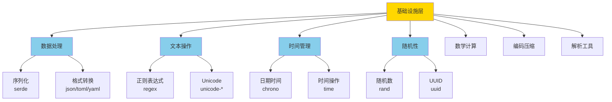
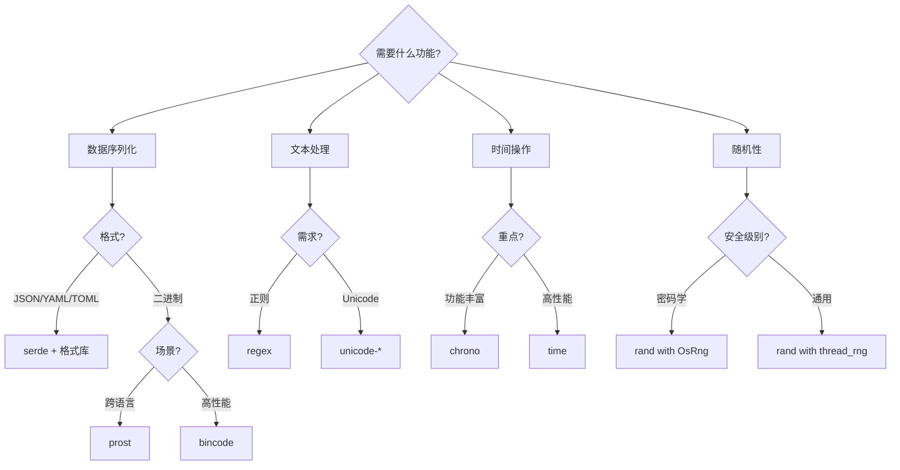

# 第1层：基础设施层 (Infrastructure Layer)

> **定位**: 几乎所有 Rust 项目都会使用的核心基础库  
> **特点**: 零依赖或轻量依赖、高性能、稳定API  
> **版本**: Rust 1.90 (2025)

---

## 📋 目录

- [第1层：基础设施层 (Infrastructure Layer)](#第1层基础设施层-infrastructure-layer)
  - [📋 目录](#-目录)
  - [🎯 层次概览](#-层次概览)
    - [定义](#定义)
    - [统计数据](#统计数据)
  - [📦 核心类别](#-核心类别)
    - [1. 序列化与数据格式](#1-序列化与数据格式)
      - [核心库](#核心库)
    - [2. 文本处理](#2-文本处理)
      - [核心库2](#核心库2)
    - [3. 时间与日期](#3-时间与日期)
      - [核心库对比](#核心库对比)
    - [4. 随机数生成](#4-随机数生成)
      - [核心库4](#核心库4)
    - [5. 数学计算](#5-数学计算)
      - [核心库5](#核心库5)
    - [6. 压缩与编码](#6-压缩与编码)
      - [压缩库](#压缩库)
      - [编码库](#编码库)
    - [7. 哈希与摘要](#7-哈希与摘要)
      - [核心库7](#核心库7)
    - [8. 解析器](#8-解析器)
      - [核心库8](#核心库8)
    - [9. 迭代器工具](#9-迭代器工具)
      - [核心库9](#核心库9)
  - [🎯 选择指南](#-选择指南)
    - [决策树](#决策树)
    - [场景推荐](#场景推荐)
  - [💡 最佳实践](#-最佳实践)
    - [1. 序列化](#1-序列化)
      - [✅ 推荐](#-推荐)
      - [❌ 避免](#-避免)
    - [2. 正则表达式](#2-正则表达式)
      - [✅ 推荐2](#-推荐2)
      - [❌ 避免2](#-避免2)
    - [3. 时间处理](#3-时间处理)
      - [✅ 推荐3](#-推荐3)
  - [📊 性能对比](#-性能对比)
    - [序列化性能（MB/s）](#序列化性能mbs)
    - [哈希性能（GB/s）](#哈希性能gbs)
  - [📚 学习资源](#-学习资源)
    - [文档索引](#文档索引)
    - [代码示例](#代码示例)
  - [🔗 相关资源](#-相关资源)

---

## 🎯 层次概览

### 定义

基础设施层是 Rust 生态的**基石**，提供最基础、最通用的功能：



### 统计数据

| 指标 | 数量 | 说明 |
|------|------|------|
| **核心类别** | 10 个 | 序列化、文本、时间等 |
| **必选库** | 15+ | ⭐⭐⭐⭐⭐ 评级 |
| **推荐库** | 25+ | ⭐⭐⭐⭐ 评级 |
| **代码示例** | 50+ | 涵盖所有核心用法 |

---

## 📦 核心类别

### 1. 序列化与数据格式

**📁 目录**: [`serialization/`](./serialization/)

#### 核心库

| 库名 | 用途 | 格式 | 性能 | 生态 | 推荐度 |
|------|------|------|------|------|--------|
| **serde** | 序列化框架 | 通用 | ⚡⚡⚡ | 🌟🌟🌟🌟🌟 | ⭐⭐⭐⭐⭐ |
| **serde_json** | JSON | JSON | ⚡⚡⚡ | 🌟🌟🌟🌟🌟 | ⭐⭐⭐⭐⭐ |
| **toml** | TOML | TOML | ⚡⚡⚡ | 🌟🌟🌟🌟🌟 | ⭐⭐⭐⭐⭐ |
| **serde_yaml** | YAML | YAML | ⚡⚡ | 🌟🌟🌟🌟 | ⭐⭐⭐⭐ |
| **bincode** | 二进制 | Binary | ⚡⚡⚡⚡ | 🌟🌟🌟🌟 | ⭐⭐⭐⭐ |
| **prost** | Protobuf | Protobuf | ⚡⚡⚡⚡ | 🌟🌟🌟🌟🌟 | ⭐⭐⭐⭐⭐ |
| **rmp-serde** | MessagePack | MessagePack | ⚡⚡⚡⚡ | 🌟🌟🌟 | ⭐⭐⭐ |
| **quick-xml** | XML | XML | ⚡⚡⚡ | 🌟🌟🌟 | ⭐⭐⭐ |
| **csv** | CSV | CSV | ⚡⚡⚡ | 🌟🌟🌟🌟 | ⭐⭐⭐⭐ |

**快速示例**:

```rust
use serde::{Serialize, Deserialize};

#[derive(Serialize, Deserialize, Debug)]
struct Config {
    host: String,
    port: u16,
    #[serde(default)]
    debug: bool,
}

fn main() {
    // JSON
    let json = r#"{"host": "localhost", "port": 8080}"#;
    let config: Config = serde_json::from_str(json).unwrap();
    println!("{:?}", config);
    
    // TOML
    let toml_str = toml::to_string(&config).unwrap();
    println!("{}", toml_str);
}
```

**详细文档**: [序列化完整指南 →](./serialization/README.md)

---

### 2. 文本处理

**📁 目录**: [`text_processing/`](./text_processing/)

#### 核心库2

| 库名 | 用途 | 性能 | Unicode | 推荐度 |
|------|------|------|---------|--------|
| **regex** | 正则表达式 | ⚡⚡⚡⚡ | ✅ | ⭐⭐⭐⭐⭐ |
| **once_cell** | 懒加载静态 | ⚡⚡⚡⚡⚡ | N/A | ⭐⭐⭐⭐⭐ |
| **lazy_static** | 静态变量 | ⚡⚡⚡⚡ | N/A | ⭐⭐⭐⭐⭐ |
| **unicode-normalization** | Unicode 规范化 | ⚡⚡⚡ | ✅ | ⭐⭐⭐⭐ |
| **unicode-segmentation** | Unicode 分词 | ⚡⚡⚡ | ✅ | ⭐⭐⭐⭐ |

**快速示例**:

```rust
use regex::Regex;
use once_cell::sync::Lazy;

// 编译时正则（推荐）
static EMAIL_REGEX: Lazy<Regex> = Lazy::new(|| {
    Regex::new(r"^[a-zA-Z0-9._%+-]+@[a-zA-Z0-9.-]+\.[a-zA-Z]{2,}$").unwrap()
});

fn validate_email(email: &str) -> bool {
    EMAIL_REGEX.is_match(email)
}

fn main() {
    assert!(validate_email("test@example.com"));
    assert!(!validate_email("invalid-email"));
}
```

**详细文档**: [文本处理完整指南 →](./text_processing/README.md)

---

### 3. 时间与日期

**📁 目录**: [`datetime/`](./datetime/)

#### 核心库对比

| 特性 | chrono | time |
|------|--------|------|
| **成熟度** | ⭐⭐⭐⭐⭐ | ⭐⭐⭐⭐⭐ |
| **时区支持** | ✅ 完整 | ✅ 完整 |
| **格式化** | ✅ 强大 | ✅ 强大 |
| **性能** | ⚡⚡⚡ | ⚡⚡⚡⚡ |
| **零成本** | ❌ | ✅ |
| **依赖** | 中等 | 轻量 |
| **推荐场景** | 通用应用 | 性能敏感 |

**快速示例**:

```rust
// chrono - 功能丰富
use chrono::{DateTime, Utc, Local, Duration};

fn chrono_example() {
    let now: DateTime<Utc> = Utc::now();
    let tomorrow = now + Duration::days(1);
    println!("Now: {}", now.format("%Y-%m-%d %H:%M:%S"));
    println!("Tomorrow: {}", tomorrow);
}

// time - 高性能
use time::{OffsetDateTime, Duration as TimeDuration};

fn time_example() {
    let now = OffsetDateTime::now_utc();
    let tomorrow = now + TimeDuration::days(1);
    println!("Now: {}", now);
    println!("Tomorrow: {}", tomorrow);
}
```

**详细文档**: [时间日期完整指南 →](./datetime/README.md)

---

### 4. 随机数生成

**📁 目录**: [`random/`](./random/)

#### 核心库4

| 库名 | 用途 | CSPRNG | 性能 | 推荐度 |
|------|------|--------|------|--------|
| **rand** | 随机数生成 | ✅ | ⚡⚡⚡⚡ | ⭐⭐⭐⭐⭐ |
| **uuid** | UUID 生成 | ✅ | ⚡⚡⚡⚡ | ⭐⭐⭐⭐⭐ |
| **getrandom** | 系统随机源 | ✅ | ⚡⚡⚡⚡⚡ | ⭐⭐⭐⭐⭐ |

**快速示例**:

```rust
use rand::{Rng, thread_rng, distributions::Alphanumeric};
use uuid::Uuid;

fn main() {
    let mut rng = thread_rng();
    
    // 随机数
    let n: u32 = rng.gen_range(1..=100);
    println!("Random number: {}", n);
    
    // 随机字符串
    let token: String = (0..32)
        .map(|_| rng.sample(Alphanumeric) as char)
        .collect();
    println!("Token: {}", token);
    
    // UUID
    let id = Uuid::new_v4();
    println!("UUID: {}", id);
}
```

**详细文档**: [随机数完整指南 →](./random/README.md)

---

### 5. 数学计算

**📁 目录**: [`math/`](./math/)

#### 核心库5

| 库名 | 用途 | 性能 | SIMD | 推荐度 |
|------|------|------|------|--------|
| **num** | 数值计算 | ⚡⚡⚡ | ❌ | ⭐⭐⭐⭐⭐ |
| **ndarray** | 多维数组 | ⚡⚡⚡⚡ | ✅ | ⭐⭐⭐⭐⭐ |
| **nalgebra** | 线性代数 | ⚡⚡⚡⚡ | ✅ | ⭐⭐⭐⭐ |
| **statrs** | 统计计算 | ⚡⚡⚡ | ❌ | ⭐⭐⭐ |

**快速示例**:

```rust
use num::complex::Complex;
use ndarray::{Array2, arr2};

fn main() {
    // 复数计算
    let z1 = Complex::new(1.0, 2.0);
    let z2 = Complex::new(3.0, 4.0);
    println!("z1 + z2 = {}", z1 + z2);
    
    // 矩阵运算
    let a = arr2(&[[1, 2], [3, 4]]);
    let b = arr2(&[[5, 6], [7, 8]]);
    let c = a.dot(&b);
    println!("Matrix product:\n{}", c);
}
```

**详细文档**: [数学计算完整指南 →](./math/README.md)

---

### 6. 压缩与编码

**📁 目录**: [`compression/`](./compression/) 和 [`encoding/`](./encoding/)

#### 压缩库

| 库名 | 算法 | 压缩比 | 速度 | 推荐度 |
|------|------|--------|------|--------|
| **flate2** | gzip/deflate | ⚡⚡⚡ | ⚡⚡⚡ | ⭐⭐⭐⭐⭐ |
| **bzip2** | bzip2 | ⚡⚡⚡⚡ | ⚡⚡ | ⭐⭐⭐⭐ |
| **zstd** | zstd | ⚡⚡⚡⚡⚡ | ⚡⚡⚡⚡ | ⭐⭐⭐⭐⭐ |
| **lz4** | lz4 | ⚡⚡ | ⚡⚡⚡⚡⚡ | ⭐⭐⭐⭐ |

#### 编码库

| 库名 | 编码类型 | 性能 | 推荐度 |
|------|----------|------|--------|
| **base64** | Base64 | ⚡⚡⚡⚡ | ⭐⭐⭐⭐⭐ |
| **hex** | Hex | ⚡⚡⚡⚡ | ⭐⭐⭐⭐⭐ |
| **percent-encoding** | URL编码 | ⚡⚡⚡⚡ | ⭐⭐⭐⭐ |

**详细文档**: [压缩编码完整指南 →](./compression/README.md)

---

### 7. 哈希与摘要

**📁 目录**: [`hashing/`](./hashing/)

#### 核心库7

| 库名 | 算法 | 安全性 | 性能 | 推荐度 |
|------|------|--------|------|--------|
| **sha2** | SHA-256/512 | 密码学级 | ⚡⚡⚡ | ⭐⭐⭐⭐⭐ |
| **blake3** | BLAKE3 | 密码学级 | ⚡⚡⚡⚡⚡ | ⭐⭐⭐⭐⭐ |
| **xxhash-rust** | xxHash | 非密码学 | ⚡⚡⚡⚡⚡ | ⭐⭐⭐⭐ |
| **seahash** | SeaHash | 非密码学 | ⚡⚡⚡⚡⚡ | ⭐⭐⭐ |

**详细文档**: [哈希完整指南 →](./hashing/README.md)

---

### 8. 解析器

**📁 目录**: [`parsing/`](./parsing/)

#### 核心库8

| 库名 | 类型 | 学习曲线 | 性能 | 推荐度 |
|------|------|----------|------|--------|
| **nom** | Parser Combinator | 中等 | ⚡⚡⚡⚡ | ⭐⭐⭐⭐⭐ |
| **pest** | PEG | 低 | ⚡⚡⚡ | ⭐⭐⭐⭐ |
| **combine** | Parser Combinator | 中等 | ⚡⚡⚡ | ⭐⭐⭐ |
| **peg** | PEG | 低 | ⚡⚡⚡ | ⭐⭐⭐ |

**详细文档**: [解析器完整指南 →](./parsing/README.md)

---

### 9. 迭代器工具

**📁 目录**: [`iterators/`](./iterators/)

#### 核心库9

| 库名 | 用途 | 推荐度 |
|------|------|--------|
| **itertools** | 迭代器增强 | ⭐⭐⭐⭐⭐ |

**快速示例**:

```rust
use itertools::Itertools;

fn main() {
    // 排列组合
    let perms: Vec<_> = (1..=3).permutations(2).collect();
    println!("Permutations: {:?}", perms);
    
    // 去重
    let nums = vec![1, 2, 2, 3, 3, 3];
    let unique: Vec<_> = nums.into_iter().unique().collect();
    println!("Unique: {:?}", unique);
    
    // 分组
    let words = vec!["apple", "apricot", "banana", "blueberry"];
    for (key, group) in &words.into_iter().group_by(|w| w.chars().next().unwrap()) {
        println!("{}: {:?}", key, group.collect::<Vec<_>>());
    }
}
```

**详细文档**: [迭代器完整指南 →](./iterators/README.md)

---

## 🎯 选择指南

### 决策树



### 场景推荐

| 场景 | 推荐库组合 |
|------|-----------|
| **通用应用** | serde + serde_json + chrono + regex + rand |
| **高性能服务** | bincode + time + regex + rand + blake3 |
| **CLI 工具** | serde_json + toml + chrono + uuid |
| **数据处理** | csv + itertools + ndarray + chrono |
| **嵌入式** | serde + bincode + time + getrandom |

---

## 💡 最佳实践

### 1. 序列化

#### ✅ 推荐

```rust
use serde::{Serialize, Deserialize};

#[derive(Serialize, Deserialize)]
#[serde(rename_all = "camelCase")] // 驼峰命名
struct User {
    #[serde(skip_serializing_if = "Option::is_none")]
    id: Option<u64>,
    
    username: String,
    
    #[serde(default)]
    is_active: bool,
}
```

#### ❌ 避免

```rust
// 不要在热路径上频繁序列化/反序列化
for item in items {
    let json = serde_json::to_string(&item)?; // 低效！
    // ...
}

// 应该批量处理
let json = serde_json::to_string(&items)?;
```

### 2. 正则表达式

#### ✅ 推荐2

```rust
use regex::Regex;
use once_cell::sync::Lazy;

// 编译一次，重复使用
static RE: Lazy<Regex> = Lazy::new(|| Regex::new(r"\d+").unwrap());

fn extract_numbers(text: &str) -> Vec<i32> {
    RE.find_iter(text)
        .filter_map(|m| m.as_str().parse().ok())
        .collect()
}
```

#### ❌ 避免2

```rust
// 每次调用都编译正则表达式 - 极其低效！
fn extract_numbers(text: &str) -> Vec<i32> {
    let re = Regex::new(r"\d+").unwrap(); // 低效！
    // ...
}
```

### 3. 时间处理

#### ✅ 推荐3

```rust
use chrono::{DateTime, Utc};

#[derive(Serialize, Deserialize)]
struct Event {
    name: String,
    // 使用 RFC3339 格式存储
    #[serde(with = "chrono::serde::ts_seconds")]
    timestamp: DateTime<Utc>,
}
```

---

## 📊 性能对比

### 序列化性能（MB/s）

| 格式 | 序列化 | 反序列化 | 大小比例 |
|------|--------|----------|----------|
| **bincode** | 1000 | 950 | 100% |
| **MessagePack** | 800 | 750 | 90% |
| **JSON** | 350 | 400 | 150% |
| **YAML** | 50 | 45 | 180% |
| **Protobuf** | 900 | 850 | 85% |

### 哈希性能（GB/s）

| 算法 | 速度 | 安全性 | 推荐场景 |
|------|------|--------|----------|
| **BLAKE3** | 10.0 | 密码学 | 通用哈希 |
| **xxHash** | 15.0 | 非密码学 | 校验和 |
| **SHA-256** | 1.5 | 密码学 | 安全需求 |
| **SeaHash** | 12.0 | 非密码学 | HashMap |

---

## 📚 学习资源

### 文档索引

- [序列化完整指南](./serialization/README.md)
- [文本处理完整指南](./text_processing/README.md)
- [时间日期完整指南](./datetime/README.md)
- [随机数完整指南](./random/README.md)
- [数学计算完整指南](./math/README.md)
- [压缩编码完整指南](./compression/README.md)
- [哈希完整指南](./hashing/README.md)
- [解析器完整指南](./parsing/README.md)
- [迭代器完整指南](./iterators/README.md)

### 代码示例

- [完整示例集](./examples/)
- [性能基准测试](./benchmarks/)
- [常见问题解答](./FAQ.md)

---

## 🔗 相关资源

- [返回总览](../README.md)
- [第2层：系统编程层](../02_system_programming/)
- [第3层：应用开发层](../03_application_dev/)

---

**文档版本**: 1.0.0  
**最后更新**: 2025-10-20  
**维护者**: C11 Middlewares Team
