# 文档工具 (Documentation Tools)

**类别**: 第5层 - 工具链  
**重要程度**: ⭐⭐⭐⭐  
**更新日期**: 2025-10-20

---

## 📋 概述

优秀的文档是项目成功的关键。Rust 提供了强大的文档工具，从 API 文档到技术书籍，从注释到完整的文档站点。

---

## 🔧 核心工具

### 1. rustdoc (必备 ⭐⭐⭐⭐⭐)

**安装**: Rust 自带  
**用途**: 生成 API 文档

#### 基础用法

```bash
# 生成文档
cargo doc

# 生成并打开
cargo doc --open

# 包含私有项
cargo doc --document-private-items

# 不包含依赖
cargo doc --no-deps
```

#### 文档注释

```rust
/// 计算两个数的和
///
/// # Examples
///
/// ```
/// use my_crate::add;
/// assert_eq!(add(2, 2), 4);
/// ```
///
/// # Panics
///
/// 当结果溢出时会 panic
///
/// # Errors
///
/// 此函数不会返回错误
///
/// # Safety
///
/// 此函数是安全的
pub fn add(a: i32, b: i32) -> i32 {
    a + b
}

/// 用户结构体
///
/// 表示系统中的一个用户
#[derive(Debug)]
pub struct User {
    /// 用户名（必须唯一）
    pub name: String,
    /// 用户年龄
    pub age: u32,
}

/// 模块级文档
///
/// 此模块包含用户相关的功能
pub mod user {
    //! 用户模块的内部文档
    //!
    //! 这里放置模块级别的说明
}
```

#### 文档测试

```rust
/// 除法运算
///
/// # Examples
///
/// ```
/// use my_crate::divide;
///
/// assert_eq!(divide(10, 2), 5);
/// ```
///
/// ```should_panic
/// use my_crate::divide;
///
/// divide(10, 0);  // 会 panic
/// ```
///
/// ```no_run
/// use my_crate::connect;
///
/// // 这个例子编译但不运行
/// connect("localhost:8080");
/// ```
///
/// ```ignore
/// // 这个例子会被忽略
/// some_unstable_api();
/// ```
pub fn divide(a: i32, b: i32) -> i32 {
    assert!(b != 0, "division by zero");
    a / b
}
```

#### 文档链接

```rust
/// 使用 [`User`] 结构体
///
/// 参见 [`create_user`] 函数
///
/// 外部链接: [RFC 1946](https://github.com/rust-lang/rfcs/pull/1946)
pub fn process_user(user: &User) {
    // ...
}

/// 链接到标准库
///
/// 使用 [`std::collections::HashMap`]
pub fn example() {
    // ...
}
```

---

### 2. mdBook (强烈推荐 🌟)

**安装**: `cargo install mdbook`  
**用途**: 创建技术书籍/文档站点

#### 快速开始

```bash
# 创建新书
mdbook init my-book

# 构建
mdbook build

# 实时预览
mdbook serve

# 清理
mdbook clean
```

#### 目录结构

```text
my-book/
├── book.toml         # 配置文件
└── src/
    ├── SUMMARY.md    # 目录
    ├── chapter_1.md
    └── chapter_2.md
```

#### book.toml 配置

```toml
[book]
title = "My Awesome Book"
authors = ["Author Name"]
language = "zh-CN"
description = "A comprehensive guide"

[output.html]
default-theme = "rust"
git-repository-url = "https://github.com/username/repo"
git-repository-icon = "fa-github"

[output.html.fold]
enable = true
level = 1

[output.html.search]
enable = true
limit-results = 30

# 语法高亮
[output.html.code]
line-numbers = true
```

#### SUMMARY.md 示例

```markdown
# Summary

[Introduction](./intro.md)

# 基础篇

- [快速开始](./basics/quickstart.md)
- [核心概念](./basics/concepts.md)
  - [所有权](./basics/ownership.md)
  - [借用](./basics/borrowing.md)

# 进阶篇

- [高级特性](./advanced/features.md)
  - [生命周期](./advanced/lifetimes.md)
  - [trait对象](./advanced/trait-objects.md)

---

[附录A: 术语表](./appendix/glossary.md)
[附录B: 参考资料](./appendix/resources.md)
```

#### 插件支持

```bash
# 安装 mermaid 支持（图表）
cargo install mdbook-mermaid
mdbook-mermaid install my-book

# 安装 toc 支持（目录）
cargo install mdbook-toc

# 安装 katex 支持（数学公式）
cargo install mdbook-katex
```

---

### 3. docs.rs (推荐)

**网站**: <https://docs.rs>  
**用途**: 自动生成和托管 crate 文档

#### 配置 Cargo.toml

```toml
[package.metadata.docs.rs]
# 所有特性
all-features = true

# 特定特性
features = ["full"]

# 目标平台
targets = ["x86_64-unknown-linux-gnu"]

# Rustdoc 参数
rustdoc-args = ["--cfg", "docsrs"]

# 默认目标
default-target = "x86_64-unknown-linux-gnu"
```

#### 使用 docsrs cfg

```rust
// 只在 docs.rs 生成文档时包含
#[cfg(docsrs)]
#[doc = include_str!("../README.md")]
mod readme {}

// 标记不稳定特性
#[cfg_attr(docsrs, doc(cfg(feature = "unstable")))]
#[cfg(feature = "unstable")]
pub fn experimental() {
    // ...
}
```

---

### 4. cargo-readme (可选)

**安装**: `cargo install cargo-readme`  
**用途**: 从 lib.rs 生成 README.md

```bash
# 生成 README
cargo readme > README.md

# 使用模板
cargo readme --template README.tpl > README.md
```

```rust
// lib.rs
//! # My Crate
//!
//! 这是一个很棒的 crate
//!
//! ## 示例
//!
//! ```rust
//! use my_crate::do_something;
//! do_something();
//! ```

// cargo readme 会将上面的注释转换为 README.md
```

---

### 5. cargo-deadlinks (可选)

**安装**: `cargo install cargo-deadlinks`  
**用途**: 检查文档中的失效链接

```bash
# 检查链接
cargo doc
cargo deadlinks

# 检查特定目录
cargo deadlinks --dir target/doc/my_crate
```

---

## 💡 最佳实践

### 1. 文档结构模板

```rust
//! # Crate 概述
//!
//! 简短描述这个 crate 的用途
//!
//! ## 特性
//!
//! - 特性1
//! - 特性2
//!
//! ## 快速开始
//!
//! ```rust
//! use my_crate::*;
//!
//! fn main() {
//!     // 示例代码
//! }
//! ```
//!
//! ## 详细文档
//!
//! 更多信息请参见各个模块的文档

/// 公共 API 的详细文档
///
/// # 参数
///
/// * `param1` - 参数1的说明
/// * `param2` - 参数2的说明
///
/// # 返回值
///
/// 返回值的说明
///
/// # Examples
///
/// ```
/// use my_crate::my_function;
///
/// let result = my_function(1, 2);
/// assert_eq!(result, 3);
/// ```
///
/// # Errors
///
/// 何时返回 `Err`
///
/// # Panics
///
/// 何时会 panic
///
/// # Safety
///
/// 如果是 unsafe 函数，说明安全要求
pub fn my_function(param1: i32, param2: i32) -> Result<i32, Error> {
    // 实现
}
```

### 2. 文档测试最佳实践

```rust
/// 复杂示例可以分多个部分
///
/// # Setup
///
/// ```
/// use my_crate::*;
/// let ctx = setup_context();
/// ```
///
/// # Basic Usage
///
/// ```
/// # use my_crate::*;
/// # let ctx = setup_context();
/// let result = ctx.process();
/// assert!(result.is_ok());
/// ```
///
/// # 隐藏设置代码
///
/// ```
/// # // 这一行会被隐藏
/// # use my_crate::*;
/// # let ctx = setup_context();
/// // 这一行会显示
/// ctx.cleanup();
/// ```
pub fn example() {
    // ...
}
```

### 3. 文档特性标记

```rust
#![warn(missing_docs)]  // 警告缺失的文档

// 允许缺失文档
#[allow(missing_docs)]
pub fn internal_api() {
    // ...
}

// 隐藏项目但保留文档
#[doc(hidden)]
pub fn deprecated_api() {
    // ...
}

// 内联文档
#[doc(inline)]
pub use external_crate::ExternalType;
```

### 4. mdBook 高级用法

````markdown
# 包含外部文件

```rust
{{#include ../examples/example.rs}}
```

# 包含特定行

```rust
{{#include ../examples/example.rs:10:20}}
```

# 包含代码片段

```rust
{{#rustdoc_include ../examples/example.rs:snippet_name}}
```

# Mermaid 图表

```mermaid
graph LR
    A[开始] --> B{判断}
    B -->|是| C[处理]
    B -->|否| D[结束]
    C --> D
```



# 数学公式 (需要 mdbook-katex)

\\( E = mc^2 \\)

$$
\int_{-\infty}^{\infty} e^{-x^2} dx = \sqrt{\pi}
$$
````

---

## 📊 文档质量检查

### 检查清单

```bash
#!/bin/bash

echo "📚 文档质量检查..."

# 1. 构建文档
echo "构建文档..."
cargo doc --no-deps --document-private-items

# 2. 文档测试
echo "运行文档测试..."
cargo test --doc

# 3. 检查失效链接
echo "检查链接..."
cargo deadlinks

# 4. 检查缺失的文档
echo "检查文档覆盖率..."
RUSTDOCFLAGS="-D missing-docs" cargo doc --no-deps 2>&1 | \
    grep "missing documentation" || echo "✅ 所有公共 API 都有文档"

echo "✅ 文档检查完成"
```

---

## 🎯 实战示例

### 完整的 crate 文档

```rust
//! # my-awesome-crate
//!
//! 一个令人惊叹的 Rust crate
//!
//! ## 功能特性
//!
//! - 🚀 高性能
//! - 🛡️ 类型安全
//! - 📦 易于使用
//!
//! ## 安装
//!
//! ```toml
//! [dependencies]
//! my-awesome-crate = "1.0"
//! ```
//!
//! ## 快速开始
//!
//! ```rust
//! use my_awesome_crate::*;
//!
//! fn main() {
//!     let result = awesome_function();
//!     println!("Result: {}", result);
//! }
//! ```
//!
//! ## 详细文档
//!
//! - [`awesome_function`] - 核心功能
//! - [`Config`] - 配置选项
//!
//! ## License
//!
//! MIT

#![warn(missing_docs)]
#![cfg_attr(docsrs, feature(doc_cfg))]

/// 配置结构体
///
/// # Examples
///
/// ```
/// use my_awesome_crate::Config;
///
/// let config = Config::default()
///     .set_timeout(30)
///     .enable_feature();
/// ```
#[derive(Debug, Clone)]
pub struct Config {
    /// 超时时间（秒）
    pub timeout: u64,
    /// 是否启用特性
    pub feature_enabled: bool,
}

impl Default for Config {
    fn default() -> Self {
        Self {
            timeout: 60,
            feature_enabled: false,
        }
    }
}

/// 核心功能函数
///
/// 这是 crate 的主要入口点
///
/// # Examples
///
/// ```
/// use my_awesome_crate::awesome_function;
///
/// let result = awesome_function();
/// assert!(result > 0);
/// ```
///
/// # Panics
///
/// 永不 panic
pub fn awesome_function() -> i32 {
    42
}
```

---

## 🔗 相关资源

- [Rustdoc Book](https://doc.rust-lang.org/rustdoc/)
- [mdBook User Guide](https://rust-lang.github.io/mdBook/)
- [docs.rs Documentation](https://docs.rs/about)
- [Writing Documentation in Rust](https://doc.rust-lang.org/book/ch14-02-publishing-to-crates-io.html#making-useful-documentation-comments)

---

**导航**: [返回工具链层](../README.md) | [下一类别：安全审计](../security/README.md)
