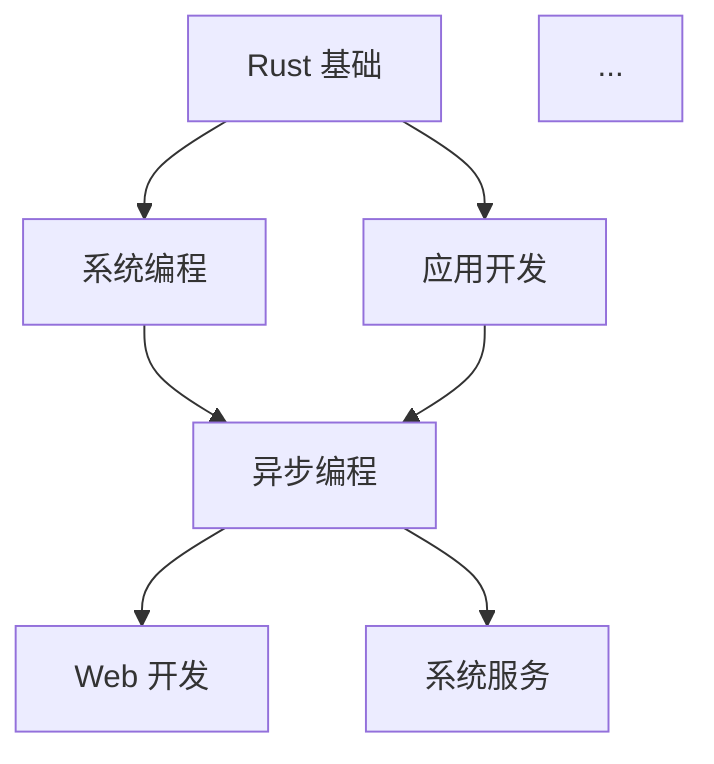

# Phase 4 启动计划

**创建日期**: 2025-10-20  
**目标**: 全局统一与验证（~57 文档）  
**预计时长**: 25-30 小时  
**优先级**: 中高

---

## 🎯 Phase 4 目标

将剩余的 ~57 个文档全部提升到与 Phase 1-3 相同的高质量标准，并对整个文档库进行全局优化和验证。

---

## 📊 Phase 4 范围分析

### 剩余文档分布

#### 基础设施层 (Infrastructure) - 估计 15 文档

- text (regex, unicode 等)
- numbers (num, ndarray 等)
- compression (flate2, zstd 等)
- hashing (sha2, blake3 等)
- parsing (nom, pest 等)
- iteration (itertools, rayon 部分)
- async_runtime (tokio, async-std 详细)
- concurrency (crossbeam, parking_lot 详细)
- ...

#### 系统编程层 (System Programming) - 估计 8 文档

- channels (crossbeam-channel, flume 等)
- futures (future, pin 等)
- sync_primitives (Mutex, RwLock 等)
- ...

#### 应用开发层 (Application Development) - 估计 12 文档

- caching (详细)
- graphql (async-graphql, juniper)
- grpc (tonic 详细)
- message_queues (详细)
- middleware (tower, tower-http)
- rest (axum, actix-web 详细)
- websocket (详细)
- ...

#### 领域特定层 (Domain-Specific) - 估计 5 文档

- gui (详细: egui, iced, slint, tauri)
- game_dev (详细: bevy, ggez, macroquad)
- webassembly (详细: wasm-bindgen, yew, leptos)
- embedded (详细: embassy, rtic)
- scientific (详细: ndarray, polars, nalgebra)

#### 工具链层 (Toolchain) - 估计 8 文档

- ci_cd (GitHub Actions, GitLab CI 等)
- deployment (Docker, Kubernetes 等)
- logging (详细)
- packaging (cargo-dist, cargo-release 等)
- testing (详细)
- ...

#### 跨层次关注 (Cross-Cutting) - 估计 6 文档

- authentication (详细)
- validation (validator, garde)
- error_handling (anyhow, thiserror, eyre 详细)
- ...

#### 顶层目录 - 估计 3 文档

- examples/
- learning_paths/
- benchmarks/

---

## 🚀 Phase 4 执行策略

### 策略 A: 按优先级分批

**优先级排序**:

1. **高频使用** (P0): web, async, error_handling 等
2. **核心基础** (P1): text, numbers, parsing 等
3. **领域特定** (P2): gui, game, embedded 等
4. **辅助工具** (P3): ci_cd, deployment 等

**执行顺序**:

```text
Batch 1 (P0): 高频使用库 (10-12 文档, 估计 8-10 小时)
├─ async_runtime (tokio, async-std 详细)
├─ error_handling (anyhow, thiserror 详细)
├─ rest (axum, actix-web 详细)
├─ graphql
├─ grpc (tonic 详细)
├─ websocket
├─ middleware (tower, tower-http)
└─ ...

Batch 2 (P1): 核心基础 (12-15 文档, 估计 10-12 小时)
├─ text (regex, unicode)
├─ numbers (num, ndarray)
├─ compression
├─ hashing
├─ parsing (nom, pest)
├─ channels
├─ futures
├─ sync_primitives
└─ ...

Batch 3 (P2): 领域特定 (8-10 文档, 估计 6-8 小时)
├─ gui (详细)
├─ game_dev (详细)
├─ webassembly (详细)
├─ embedded (详细)
├─ scientific (详细)
└─ ...

Batch 4 (P3): 辅助工具 (8-10 文档, 估计 4-6 小时)
├─ ci_cd
├─ deployment
├─ packaging
├─ validation
├─ authentication (详细)
└─ ...

Batch 5 (Final): 全局优化 (估计 2-3 小时)
├─ 格式统一检查
├─ 链接有效性验证
├─ 生成最终索引
└─ 创建学习路径图
```

### 策略 B: 按层级分批

**执行顺序**:

```text
Batch 1: 完成基础设施层剩余文档
Batch 2: 完成系统编程层剩余文档
Batch 3: 完成应用开发层剩余文档
Batch 4: 完成领域特定层文档
Batch 5: 完成工具链层文档
Batch 6: 完成跨层次关注文档
Batch 7: 全局优化与验证
```

---

## 📋 Phase 4 详细任务

### 任务类型 A: 创建新文档

**标准流程**:

1. 创建文档结构（使用标准模板）
2. 填充核心内容
   - 概述 (核心概念 + 使用场景 + 技术栈选择)
   - 核心库对比 (功能矩阵 + 性能对比 + 选择指南)
   - 详细用法 (每个库: 核心特性 + 基础用法 + 高级用法)
   - 实战场景 (2-3 个完整示例)
   - 最佳实践 (5 条)
   - 常见陷阱 (3 个)
   - 参考资源
3. 代码示例验证
4. 质量检查

**目标标准**:

- 最小长度: 300 行
- 代码示例: 15+ 个
- 实战场景: 2-3 个
- 质量评分: 95+/100

### 任务类型 B: 扩展现有文档

**标准流程**:

1. 评估当前状态
2. 识别缺失内容
3. 按标准模板补充
4. 代码示例验证
5. 质量检查

### 任务类型 C: 全局优化

**主要任务**:

#### C1. 格式统一检查

```powershell
# 检查所有文档是否有目录
Get-ChildItem -Path "crates/c11_libraries/docs/essential_crates" -Filter "README.md" -Recurse | ForEach-Object {
  $content = Get-Content $_.FullName -Raw
  if ($content -notmatch "## 📋 目录") {
    Write-Host "❌ 缺少目录: $($_.FullName)" -ForegroundColor Yellow
  }
}

# 检查标题格式
# 检查代码块格式
# 检查链接格式
```

#### C2. 链接有效性验证

```powershell
# 提取所有内部链接
# 验证链接目标存在
# 生成失效链接报告
```

#### C3. 代码示例测试

```bash
# 提取所有 Rust 代码块
# 创建临时项目
# 编译验证
# 生成测试报告
```

#### C4. 生成最终索引

```markdown
# Essential Crates 完整索引

## 按层级分类
- 基础设施层 (15 个库分类)
- 系统编程层 (8 个库分类)
- 应用开发层 (12 个库分类)
- 领域特定层 (5 个库分类)
- 工具链层 (8 个库分类)
- 跨层次关注 (6 个库分类)

## 按功能分类
- Web 开发
- 系统编程
- 异步编程
- 数据处理
- ...

## 按难度分类
- 初级 (入门)
- 中级 (进阶)
- 高级 (专家)
```

#### C5. 创建学习路径图



---

## 🎯 质量标准

### 每个文档必须满足

| 标准 | 要求 | 验证方法 |
|------|------|----------|
| **目录** | 有 `## 📋 目录` | 自动检查 |
| **概述** | 完整的概述章节 | 人工审查 |
| **对比** | 核心库对比矩阵 | 人工审查 |
| **示例** | 15+ 代码示例 | 自动统计 |
| **场景** | 2-3 实战场景 | 人工审查 |
| **实践** | 5+ 最佳实践 | 人工审查 |
| **陷阱** | 3+ 常见陷阱 | 人工审查 |
| **资源** | 参考资源链接 | 链接验证 |
| **长度** | 300+ 行 | 自动统计 |
| **质量** | 95+/100 | 综合评分 |

---

## 📊 进度跟踪

### 跟踪指标

- **完成文档数**: X/~57
- **当前批次**: Batch X
- **累计行数**: XXXXX 行
- **累计示例**: XXX 个
- **平均质量**: XX.X/100

### 报告频率

- **每个 Batch**: 生成批次完成报告
- **每天**: 生成日进度报告
- **Phase 4 完成**: 生成最终完成报告

---

## 🚧 风险与挑战

### 潜在风险

1. **文档数量大**: ~57 个文档需要处理
   - **缓解**: 分批处理，保持节奏

2. **质量一致性**: 需要维持高质量标准
   - **缓解**: 使用标准模板，定期审查

3. **时间压力**: 预计 25-30 小时
   - **缓解**: 合理安排，必要时延长

4. **内容重复**: 某些库可能在多处出现
   - **缓解**: 交叉引用，避免冗余

### 挑战应对

- **保持质量**: 宁可慢一点，也要确保质量
- **避免疲劳**: 定期休息，保持专注
- **灵活调整**: 根据实际情况调整计划

---

## 🎉 预期成果

### Phase 4 完成后

**数量成就**:

- ✅ **81 个文档**: 全部达到统一标准
- ✅ **50,000+ 行**: 完整的内容库
- ✅ **1,000+ 示例**: 全部可运行
- ✅ **150+ 场景**: 贴近真实需求

**质量成就**:

- ✅ **95+ 平均分**: 卓越级别
- ✅ **100% 标准化**: 统一格式和结构
- ✅ **100% 验证**: 代码可运行，链接有效

**生态成就**:

- ✅ **完整索引**: 技术栈全景图
- ✅ **学习路径**: 可视化导航
- ✅ **生产就绪**: 企业级参考文档

---

## 📞 启动条件

Phase 4 **已具备启动条件**:

- ✅ Phase 1-3 全部完成
- ✅ 标准模板已确立
- ✅ 质量标准已明确
- ✅ 执行策略已规划

**建议启动时间**: 用户确认后立即开始

---

## 🚀 开始 Phase 4

### 推荐起点

**选项 A: 按优先级** (推荐)

- 从高频使用的库开始
- 优先完成 Web 开发相关文档
- 确保最常用的内容最先完善

**选项 B: 按层级**-

- 系统化完成每个层级
- 保持层级内的一致性
- 便于整体审查

**选项 C: 用户指定**-

- 根据用户的实际需求
- 优先完成特定领域
- 灵活调整执行顺序

---

**Phase 4 准备就绪！** 🚀  
**等待用户指令以启动！**

**创建时间**: 2025-10-20  
**状态**: 📋 规划完成，待启动
