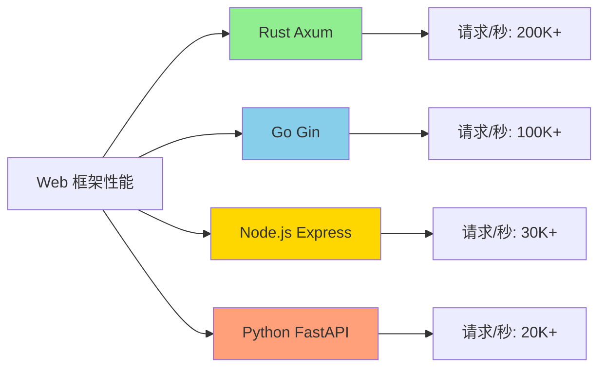

# 2.4 Rust Web 框架指南 (2025)

> **文档定位**: Rust Web 框架完整实战指南  
> **适用人群**: Web 开发者，后端工程师  
> **关联文档**: [3.2 开源库生态全景图](../references/3.2_开源库生态全景图.md) | [2.1 数据库集成指南](./2.1_数据库集成指南.md)


## 📊 目录

- [📋 目录](#目录)
- [2.4.1 概述](#241-概述)
  - [2.4.1.1 为什么选择 Rust 做 Web 开发？](#2411-为什么选择-rust-做-web-开发)
  - [2.4.1.2 Web 框架技术栈对比](#2412-web-框架技术栈对比)
- [2.4.2 Axum 深度实战](#242-axum-深度实战)
  - [2.4.2.1 项目初始化](#2421-项目初始化)
  - [2.4.2.2 路由系统](#2422-路由系统)
  - [2.4.2.3 提取器 (Extractors)](#2423-提取器-extractors)
  - [2.4.2.4 中间件](#2424-中间件)
  - [2.4.2.5 错误处理](#2425-错误处理)
  - [2.4.2.6 状态管理](#2426-状态管理)
- [2.4.3 Actix-web 实战](#243-actix-web-实战)
  - [2.4.3.1 项目初始化](#2431-项目初始化)
  - [2.4.3.2 路由和处理器](#2432-路由和处理器)
  - [2.4.3.3 中间件](#2433-中间件)
  - [2.4.3.4 应用状态](#2434-应用状态)
- [2.4.4 RESTful API 设计](#244-restful-api-设计)
  - [2.4.4.1 资源设计](#2441-资源设计)
  - [2.4.4.2 HTTP 方法](#2442-http-方法)
  - [2.4.4.3 状态码](#2443-状态码)
  - [2.4.4.4 版本控制](#2444-版本控制)
- [2.4.5 认证授权](#245-认证授权)
  - [2.4.5.1 JWT 认证](#2451-jwt-认证)
  - [2.4.5.2 OAuth2](#2452-oauth2)
  - [2.4.5.3 RBAC 权限](#2453-rbac-权限)
- [2.4.6 WebSocket](#246-websocket)
  - [2.4.6.1 基础实现](#2461-基础实现)
  - [2.4.6.2 消息广播](#2462-消息广播)
  - [2.4.6.3 心跳机制](#2463-心跳机制)
- [2.4.7 性能优化](#247-性能优化)
  - [2.4.7.1 连接复用](#2471-连接复用)
  - [2.4.7.2 响应压缩](#2472-响应压缩)
  - [2.4.7.3 静态资源](#2473-静态资源)
- [2.4.8 生产部署](#248-生产部署)
  - [2.4.8.1 配置管理](#2481-配置管理)
  - [2.4.8.2 日志记录](#2482-日志记录)
  - [2.4.8.3 健康检查](#2483-健康检查)
- [2.4.9 最佳实践](#249-最佳实践)
  - [2.4.9.1 项目结构](#2491-项目结构)
  - [2.4.9.2 错误处理](#2492-错误处理)
  - [2.4.9.3 安全实践](#2493-安全实践)


**Rust 版本**: 1.90  
**文档状态**: ✅ 生产就绪  
**最后更新**: 2025-10-21

---

## 📋 目录

- [2.4 Rust Web 框架指南 (2025)](#24-rust-web-框架指南-2025)
  - [📋 目录](#-目录)
  - [2.4.1 概述](#241-概述)
    - [2.4.1.1 为什么选择 Rust 做 Web 开发？](#2411-为什么选择-rust-做-web-开发)
    - [2.4.1.2 Web 框架技术栈对比](#2412-web-框架技术栈对比)
  - [2.4.2 Axum 深度实战](#242-axum-深度实战)
    - [2.4.2.1 项目初始化](#2421-项目初始化)
    - [2.4.2.2 路由系统](#2422-路由系统)
    - [2.4.2.3 提取器 (Extractors)](#2423-提取器-extractors)
    - [2.4.2.4 中间件](#2424-中间件)
    - [2.4.2.5 错误处理](#2425-错误处理)
    - [2.4.2.6 状态管理](#2426-状态管理)
  - [2.4.3 Actix-web 实战](#243-actix-web-实战)
    - [2.4.3.1 项目初始化](#2431-项目初始化)
    - [2.4.3.2 路由和处理器](#2432-路由和处理器)
    - [2.4.3.3 中间件](#2433-中间件)
    - [2.4.3.4 应用状态](#2434-应用状态)
  - [2.4.4 RESTful API 设计](#244-restful-api-设计)
    - [2.4.4.1 资源设计](#2441-资源设计)
    - [2.4.4.2 HTTP 方法](#2442-http-方法)
    - [2.4.4.3 状态码](#2443-状态码)
    - [2.4.4.4 版本控制](#2444-版本控制)
  - [2.4.5 认证授权](#245-认证授权)
    - [2.4.5.1 JWT 认证](#2451-jwt-认证)
    - [2.4.5.2 OAuth2](#2452-oauth2)
    - [2.4.5.3 RBAC 权限](#2453-rbac-权限)
  - [2.4.6 WebSocket](#246-websocket)
    - [2.4.6.1 基础实现](#2461-基础实现)
    - [2.4.6.2 消息广播](#2462-消息广播)
    - [2.4.6.3 心跳机制](#2463-心跳机制)
  - [2.4.7 性能优化](#247-性能优化)
    - [2.4.7.1 连接复用](#2471-连接复用)
    - [2.4.7.2 响应压缩](#2472-响应压缩)
    - [2.4.7.3 静态资源](#2473-静态资源)
  - [2.4.8 生产部署](#248-生产部署)
    - [2.4.8.1 配置管理](#2481-配置管理)
    - [2.4.8.2 日志记录](#2482-日志记录)
    - [2.4.8.3 健康检查](#2483-健康检查)
  - [2.4.9 最佳实践](#249-最佳实践)
    - [2.4.9.1 项目结构](#2491-项目结构)
    - [2.4.9.2 错误处理](#2492-错误处理)
    - [2.4.9.3 安全实践](#2493-安全实践)

---

## 2.4.1 概述

### 2.4.1.1 为什么选择 Rust 做 Web 开发？

**核心优势**:

1. ✅ **极致性能** - 零成本抽象，接近 C++ 性能
2. ✅ **内存安全** - 编译时保证，无运行时错误
3. ✅ **并发友好** - 原生异步支持，高并发处理
4. ✅ **类型安全** - 编译时检查，减少 bug
5. ✅ **生态成熟** - 完善的 Web 生态系统

**性能对比**:



### 2.4.1.2 Web 框架技术栈对比

| 框架 | 类型 | 特点 | 性能 | 学习曲线 | 生态 | 成熟度 |
|------|------|------|------|----------|------|--------|
| **Axum** | 模块化 | Tower 生态，类型安全 | ⭐⭐⭐⭐⭐ | ⭐⭐⭐ | ⭐⭐⭐⭐⭐ | ⭐⭐⭐⭐ |
| **Actix-web** | Actor 模型 | 高性能，功能完整 | ⭐⭐⭐⭐⭐ | ⭐⭐⭐ | ⭐⭐⭐⭐⭐ | ⭐⭐⭐⭐⭐ |
| **Rocket** | 宏驱动 | 易用，表达力强 | ⭐⭐⭐⭐ | ⭐⭐ | ⭐⭐⭐⭐ | ⭐⭐⭐⭐ |
| **Poem** | 现代化 | OpenAPI，优雅 | ⭐⭐⭐⭐ | ⭐⭐ | ⭐⭐⭐ | ⭐⭐⭐ |

---

## 2.4.2 Axum 深度实战

### 2.4.2.1 项目初始化

**依赖配置**:

```toml
[package]
name = "axum-web-app"
version = "0.1.0"
edition = "2021"

[dependencies]
# Web 框架
axum = { version = "0.8", features = ["ws", "multipart"] }
tower = "0.5"
tower-http = { version = "0.6", features = ["fs", "trace", "cors", "compression-gzip"] }

# 异步运行时
tokio = { version = "1.48", features = ["full"] }

# 序列化
serde = { version = "1.0", features = ["derive"] }
serde_json = "1.0"

# 数据库
sqlx = { version = "0.8", features = ["runtime-tokio-rustls", "postgres"] }

# 认证
jsonwebtoken = "9.3"
argon2 = "0.5"

# 错误处理
anyhow = "1.0"
thiserror = "2.0"

# 日志
tracing = "0.1"
tracing-subscriber = { version = "0.3", features = ["env-filter"] }

# 配置
dotenvy = "0.15"

# 验证
validator = { version = "0.18", features = ["derive"] }

# 时间
chrono = { version = "0.4", features = ["serde"] }
uuid = { version = "1.0", features = ["v4", "serde"] }
```

**基础应用**:

```rust
use axum::{
    Router,
    routing::{get, post},
};
use std::net::SocketAddr;

#[tokio::main]
async fn main() {
    // 初始化日志
    tracing_subscriber::fmt()
        .with_max_level(tracing::Level::DEBUG)
        .init();

    // 创建路由
    let app = Router::new()
        .route("/", get(root))
        .route("/health", get(health_check));

    // 启动服务器
    let addr = SocketAddr::from(([0, 0, 0, 0], 3000));
    tracing::info!("Server listening on {}", addr);
    
    let listener = tokio::net::TcpListener::bind(addr).await.unwrap();
    axum::serve(listener, app).await.unwrap();
}

async fn root() -> &'static str {
    "Hello, Axum!"
}

async fn health_check() -> &'static str {
    "OK"
}
```

### 2.4.2.2 路由系统

**基础路由**:

```rust
use axum::{
    Router,
    routing::{get, post, put, delete},
    response::Json,
};
use serde::{Deserialize, Serialize};

pub fn create_router() -> Router {
    Router::new()
        // 基础路由
        .route("/", get(root))
        .route("/users", get(list_users).post(create_user))
        .route("/users/:id", get(get_user).put(update_user).delete(delete_user))
        
        // 嵌套路由
        .nest("/api/v1", api_v1_routes())
        
        // 通配符路由
        .route("/files/*path", get(serve_file))
}

fn api_v1_routes() -> Router {
    Router::new()
        .route("/users", get(list_users))
        .route("/posts", get(list_posts))
}
```

**路径参数**:

```rust
use axum::extract::Path;

// 单个参数
async fn get_user(Path(id): Path<u64>) -> String {
    format!("User ID: {}", id)
}

// 多个参数
async fn get_user_post(
    Path((user_id, post_id)): Path<(u64, u64)>,
) -> String {
    format!("User {} Post {}", user_id, post_id)
}

// 结构体参数
#[derive(Deserialize)]
struct Params {
    user_id: u64,
    post_id: u64,
}

async fn get_user_post_struct(
    Path(params): Path<Params>,
) -> String {
    format!("User {} Post {}", params.user_id, params.post_id)
}
```

**查询参数**:

```rust
use axum::extract::Query;

#[derive(Deserialize)]
struct Pagination {
    page: Option<u64>,
    per_page: Option<u64>,
}

async fn list_users(Query(pagination): Query<Pagination>) -> String {
    let page = pagination.page.unwrap_or(1);
    let per_page = pagination.per_page.unwrap_or(10);
    
    format!("Page {} with {} items", page, per_page)
}
```

### 2.4.2.3 提取器 (Extractors)

**JSON 请求体**:

```rust
use axum::Json;

#[derive(Deserialize, Serialize)]
struct CreateUserRequest {
    username: String,
    email: String,
    password: String,
}

#[derive(Serialize)]
struct User {
    id: u64,
    username: String,
    email: String,
}

async fn create_user(
    Json(payload): Json<CreateUserRequest>,
) -> Json<User> {
    let user = User {
        id: 1,
        username: payload.username,
        email: payload.email,
    };
    
    Json(user)
}
```

**表单数据**:

```rust
use axum::Form;

#[derive(Deserialize)]
struct LoginForm {
    username: String,
    password: String,
}

async fn login(Form(form): Form<LoginForm>) -> String {
    format!("Login: {}", form.username)
}
```

**请求头**:

```rust
use axum::http::HeaderMap;

async fn headers_demo(headers: HeaderMap) -> String {
    let user_agent = headers
        .get("user-agent")
        .and_then(|v| v.to_str().ok())
        .unwrap_or("unknown");
    
    format!("User-Agent: {}", user_agent)
}
```

**自定义提取器**:

```rust
use axum::{
    async_trait,
    extract::{FromRequestParts, rejection::JsonRejection},
    http::{request::Parts, StatusCode},
};

// 验证的 JSON 提取器
struct ValidatedJson<T>(T);

#[async_trait]
impl<S, T> FromRequestParts<S> for ValidatedJson<T>
where
    T: for<'de> Deserialize<'de> + validator::Validate,
    S: Send + Sync,
{
    type Rejection = (StatusCode, String);

    async fn from_request_parts(
        parts: &mut Parts,
        state: &S,
    ) -> Result<Self, Self::Rejection> {
        let Json(value): Json<T> = Json::from_request_parts(parts, state)
            .await
            .map_err(|e| (StatusCode::BAD_REQUEST, e.to_string()))?;
        
        value.validate()
            .map_err(|e| (StatusCode::BAD_REQUEST, e.to_string()))?;
        
        Ok(ValidatedJson(value))
    }
}
```

### 2.4.2.4 中间件

**日志中间件**:

```rust
use tower_http::trace::TraceLayer;

let app = Router::new()
    .route("/", get(root))
    .layer(TraceLayer::new_for_http());
```

**CORS 中间件**:

```rust
use tower_http::cors::{CorsLayer, Any};

let cors = CorsLayer::new()
    .allow_origin(Any)
    .allow_methods(Any)
    .allow_headers(Any);

let app = Router::new()
    .route("/", get(root))
    .layer(cors);
```

**压缩中间件**:

```rust
use tower_http::compression::CompressionLayer;

let app = Router::new()
    .route("/", get(root))
    .layer(CompressionLayer::new());
```

**自定义中间件**:

```rust
use axum::middleware::{self, Next};
use axum::http::Request;
use axum::response::Response;

async fn auth_middleware<B>(
    req: Request<B>,
    next: Next<B>,
) -> Response {
    // 检查认证
    if let Some(auth_header) = req.headers().get("authorization") {
        // 验证 token
        tracing::info!("Authenticated request");
    }
    
    next.run(req).await
}

let app = Router::new()
    .route("/", get(root))
    .layer(middleware::from_fn(auth_middleware));
```

### 2.4.2.5 错误处理

**自定义错误类型**:

```rust
use axum::{
    response::{IntoResponse, Response},
    http::StatusCode,
};

#[derive(thiserror::Error, Debug)]
pub enum AppError {
    #[error("Database error: {0}")]
    Database(#[from] sqlx::Error),
    
    #[error("Not found: {0}")]
    NotFound(String),
    
    #[error("Unauthorized")]
    Unauthorized,
    
    #[error("Bad request: {0}")]
    BadRequest(String),
}

impl IntoResponse for AppError {
    fn into_response(self) -> Response {
        let (status, message) = match self {
            AppError::Database(e) => {
                tracing::error!("Database error: {}", e);
                (StatusCode::INTERNAL_SERVER_ERROR, "Internal server error")
            }
            AppError::NotFound(msg) => {
                (StatusCode::NOT_FOUND, msg.as_str())
            }
            AppError::Unauthorized => {
                (StatusCode::UNAUTHORIZED, "Unauthorized")
            }
            AppError::BadRequest(msg) => {
                (StatusCode::BAD_REQUEST, msg.as_str())
            }
        };
        
        (status, Json(serde_json::json!({
            "error": message
        }))).into_response()
    }
}

// 使用示例
async fn get_user(Path(id): Path<u64>) -> Result<Json<User>, AppError> {
    let user = sqlx::query_as::<_, User>("SELECT * FROM users WHERE id = $1")
        .bind(id as i64)
        .fetch_optional(&pool)
        .await?
        .ok_or_else(|| AppError::NotFound("User not found".to_string()))?;
    
    Ok(Json(user))
}
```

### 2.4.2.6 状态管理

**应用状态**:

```rust
use axum::extract::State;
use sqlx::PgPool;
use std::sync::Arc;

#[derive(Clone)]
struct AppState {
    db: PgPool,
    config: Arc<Config>,
}

async fn create_user(
    State(state): State<AppState>,
    Json(payload): Json<CreateUserRequest>,
) -> Result<Json<User>, AppError> {
    let user = sqlx::query_as::<_, User>(
        "INSERT INTO users (username, email) VALUES ($1, $2) RETURNING *"
    )
    .bind(&payload.username)
    .bind(&payload.email)
    .fetch_one(&state.db)
    .await?;
    
    Ok(Json(user))
}

#[tokio::main]
async fn main() {
    let pool = create_pool().await.unwrap();
    
    let state = AppState {
        db: pool,
        config: Arc::new(load_config()),
    };
    
    let app = Router::new()
        .route("/users", post(create_user))
        .with_state(state);
    
    // 启动服务器
}
```

---

## 2.4.3 Actix-web 实战

### 2.4.3.1 项目初始化

**依赖配置**:

```toml
[dependencies]
actix-web = "4.9"
actix-rt = "2.10"
actix-cors = "0.7"

# 序列化
serde = { version = "1.0", features = ["derive"] }
serde_json = "1.0"

# 数据库
sqlx = { version = "0.8", features = ["runtime-tokio-rustls", "postgres"] }
```

**基础应用**:

```rust
use actix_web::{web, App, HttpServer, HttpResponse};

#[actix_web::main]
async fn main() -> std::io::Result<()> {
    HttpServer::new(|| {
        App::new()
            .route("/", web::get().to(index))
            .route("/health", web::get().to(health))
    })
    .bind(("0.0.0.0", 8080))?
    .run()
    .await
}

async fn index() -> HttpResponse {
    HttpResponse::Ok().body("Hello, Actix!")
}

async fn health() -> HttpResponse {
    HttpResponse::Ok().json(serde_json::json!({
        "status": "ok"
    }))
}
```

### 2.4.3.2 路由和处理器

**资源路由**:

```rust
use actix_web::{web, HttpResponse, Result};

pub fn config(cfg: &mut web::ServiceConfig) {
    cfg.service(
        web::scope("/api/v1")
            .service(
                web::resource("/users")
                    .route(web::get().to(list_users))
                    .route(web::post().to(create_user))
            )
            .service(
                web::resource("/users/{id}")
                    .route(web::get().to(get_user))
                    .route(web::put().to(update_user))
                    .route(web::delete().to(delete_user))
            )
    );
}

async fn list_users() -> Result<HttpResponse> {
    Ok(HttpResponse::Ok().json(vec![
        User { id: 1, username: "alice".to_string() },
    ]))
}

async fn create_user(user: web::Json<CreateUserRequest>) -> Result<HttpResponse> {
    Ok(HttpResponse::Created().json(User {
        id: 1,
        username: user.username.clone(),
    }))
}
```

**路径参数**:

```rust
use actix_web::web::Path;

async fn get_user(path: Path<u64>) -> Result<HttpResponse> {
    let user_id = path.into_inner();
    Ok(HttpResponse::Ok().json(serde_json::json!({
        "id": user_id
    })))
}

// 多个参数
async fn get_user_post(path: Path<(u64, u64)>) -> Result<HttpResponse> {
    let (user_id, post_id) = path.into_inner();
    Ok(HttpResponse::Ok().json(serde_json::json!({
        "user_id": user_id,
        "post_id": post_id
    })))
}
```

### 2.4.3.3 中间件

**日志中间件**:

```rust
use actix_web::middleware::Logger;

HttpServer::new(|| {
    App::new()
        .wrap(Logger::default())
        .route("/", web::get().to(index))
})
```

**CORS 中间件**:

```rust
use actix_cors::Cors;

HttpServer::new(|| {
    let cors = Cors::default()
        .allow_any_origin()
        .allow_any_method()
        .allow_any_header();
    
    App::new()
        .wrap(cors)
        .route("/", web::get().to(index))
})
```

### 2.4.3.4 应用状态

**共享状态**:

```rust
use actix_web::web::Data;
use sqlx::PgPool;

struct AppState {
    db: PgPool,
}

async fn create_user(
    data: Data<AppState>,
    user: web::Json<CreateUserRequest>,
) -> Result<HttpResponse> {
    let user = sqlx::query_as::<_, User>(
        "INSERT INTO users (username, email) VALUES ($1, $2) RETURNING *"
    )
    .bind(&user.username)
    .bind(&user.email)
    .fetch_one(&data.db)
    .await?;
    
    Ok(HttpResponse::Created().json(user))
}

#[actix_web::main]
async fn main() -> std::io::Result<()> {
    let pool = create_pool().await.unwrap();
    
    let app_state = Data::new(AppState { db: pool });
    
    HttpServer::new(move || {
        App::new()
            .app_data(app_state.clone())
            .route("/users", web::post().to(create_user))
    })
    .bind(("0.0.0.0", 8080))?
    .run()
    .await
}
```

---

## 2.4.4 RESTful API 设计

### 2.4.4.1 资源设计

**URI 设计原则**:

```rust
// ✅ 好的设计
GET    /api/v1/users           // 获取用户列表
GET    /api/v1/users/{id}      // 获取单个用户
POST   /api/v1/users           // 创建用户
PUT    /api/v1/users/{id}      // 更新用户
DELETE /api/v1/users/{id}      // 删除用户

// 嵌套资源
GET    /api/v1/users/{id}/posts          // 获取用户的文章
POST   /api/v1/users/{id}/posts          // 创建用户的文章
GET    /api/v1/users/{id}/posts/{post_id} // 获取特定文章

// ❌ 不好的设计
GET    /api/v1/getUsers           // 动词形式
POST   /api/v1/user-creation      // 非资源名词
GET    /api/v1/users/list         // 冗余的动作
```

### 2.4.4.2 HTTP 方法

**标准方法语义**:

```rust
use axum::{Router, routing::*};

pub fn user_routes() -> Router {
    Router::new()
        // GET - 安全且幂等
        .route("/users", get(list_users))
        .route("/users/:id", get(get_user))
        
        // POST - 非幂等，创建资源
        .route("/users", post(create_user))
        
        // PUT - 幂等，完全替换资源
        .route("/users/:id", put(replace_user))
        
        // PATCH - 幂等，部分更新资源
        .route("/users/:id", patch(update_user))
        
        // DELETE - 幂等，删除资源
        .route("/users/:id", delete(delete_user))
}
```

### 2.4.4.3 状态码

**常用状态码**:

```rust
use axum::http::StatusCode;

// 2xx 成功
async fn create_user() -> (StatusCode, Json<User>) {
    (StatusCode::CREATED, Json(user))  // 201
}

// 3xx 重定向
async fn redirect() -> (StatusCode, [(&'static str, &'static str); 1]) {
    (StatusCode::MOVED_PERMANENTLY, [("location", "/new-path")])  // 301
}

// 4xx 客户端错误
async fn not_found() -> StatusCode {
    StatusCode::NOT_FOUND  // 404
}

async fn bad_request() -> (StatusCode, &'static str) {
    (StatusCode::BAD_REQUEST, "Invalid request")  // 400
}

async fn unauthorized() -> StatusCode {
    StatusCode::UNAUTHORIZED  // 401
}

// 5xx 服务器错误
async fn internal_error() -> StatusCode {
    StatusCode::INTERNAL_SERVER_ERROR  // 500
}
```

### 2.4.4.4 版本控制

**URI 版本控制**:

```rust
let app = Router::new()
    .nest("/api/v1", v1_routes())
    .nest("/api/v2", v2_routes());

fn v1_routes() -> Router {
    Router::new()
        .route("/users", get(v1::list_users))
}

fn v2_routes() -> Router {
    Router::new()
        .route("/users", get(v2::list_users))
}
```

**请求头版本控制**:

```rust
use axum::http::HeaderMap;

async fn list_users(headers: HeaderMap) -> Json<Vec<User>> {
    let version = headers
        .get("api-version")
        .and_then(|v| v.to_str().ok())
        .unwrap_or("v1");
    
    match version {
        "v2" => Json(v2::get_users().await),
        _ => Json(v1::get_users().await),
    }
}
```

---

## 2.4.5 认证授权

### 2.4.5.1 JWT 认证

**JWT 实现**:

```rust
use jsonwebtoken::{encode, decode, Header, Validation, EncodingKey, DecodingKey};
use serde::{Deserialize, Serialize};

#[derive(Debug, Serialize, Deserialize)]
struct Claims {
    sub: String,  // 用户 ID
    exp: usize,   // 过期时间
    iat: usize,   // 签发时间
}

// 生成 JWT
fn generate_jwt(user_id: &str, secret: &str) -> Result<String, AppError> {
    let expiration = chrono::Utc::now()
        .checked_add_signed(chrono::Duration::hours(24))
        .unwrap()
        .timestamp() as usize;
    
    let claims = Claims {
        sub: user_id.to_string(),
        exp: expiration,
        iat: chrono::Utc::now().timestamp() as usize,
    };
    
    let token = encode(
        &Header::default(),
        &claims,
        &EncodingKey::from_secret(secret.as_bytes()),
    )?;
    
    Ok(token)
}

// 验证 JWT
fn verify_jwt(token: &str, secret: &str) -> Result<Claims, AppError> {
    let token_data = decode::<Claims>(
        token,
        &DecodingKey::from_secret(secret.as_bytes()),
        &Validation::default(),
    )?;
    
    Ok(token_data.claims)
}
```

**认证中间件**:

```rust
use axum::{
    middleware::Next,
    http::{Request, StatusCode},
    response::Response,
};

async fn auth_middleware<B>(
    req: Request<B>,
    next: Next<B>,
) -> Result<Response, StatusCode> {
    let auth_header = req
        .headers()
        .get("authorization")
        .and_then(|v| v.to_str().ok())
        .ok_or(StatusCode::UNAUTHORIZED)?;
    
    let token = auth_header
        .strip_prefix("Bearer ")
        .ok_or(StatusCode::UNAUTHORIZED)?;
    
    // 验证 token
    verify_jwt(token, "secret")
        .map_err(|_| StatusCode::UNAUTHORIZED)?;
    
    Ok(next.run(req).await)
}

// 应用中间件
let protected_routes = Router::new()
    .route("/profile", get(get_profile))
    .layer(middleware::from_fn(auth_middleware));
```

### 2.4.5.2 OAuth2

**OAuth2 客户端**:

```rust
use oauth2::{
    AuthUrl, ClientId, ClientSecret, RedirectUrl, TokenUrl,
    basic::BasicClient,
    AuthorizationCode, CsrfToken, PkceCodeChallenge,
};

pub fn create_oauth_client() -> BasicClient {
    BasicClient::new(
        ClientId::new("client_id".to_string()),
        Some(ClientSecret::new("client_secret".to_string())),
        AuthUrl::new("https://provider.com/oauth/authorize".to_string()).unwrap(),
        Some(TokenUrl::new("https://provider.com/oauth/token".to_string()).unwrap()),
    )
    .set_redirect_uri(
        RedirectUrl::new("http://localhost:3000/callback".to_string()).unwrap()
    )
}

// 生成授权 URL
async fn login() -> String {
    let client = create_oauth_client();
    
    let (pkce_challenge, pkce_verifier) = PkceCodeChallenge::new_random_sha256();
    
    let (auth_url, csrf_token) = client
        .authorize_url(CsrfToken::new_random)
        .set_pkce_challenge(pkce_challenge)
        .url();
    
    // 保存 csrf_token 和 pkce_verifier 到 session
    
    auth_url.to_string()
}

// 处理回调
async fn callback(
    Query(params): Query<CallbackParams>,
) -> Result<String, AppError> {
    let client = create_oauth_client();
    
    // 从 session 获取 pkce_verifier
    
    let token_result = client
        .exchange_code(AuthorizationCode::new(params.code))
        .set_pkce_verifier(pkce_verifier)
        .request_async(oauth2::reqwest::async_http_client)
        .await?;
    
    Ok(token_result.access_token().secret().to_string())
}
```

### 2.4.5.3 RBAC 权限

**权限检查**:

```rust
use std::collections::HashSet;

#[derive(Debug, Clone)]
enum Permission {
    ReadUser,
    WriteUser,
    DeleteUser,
    ReadPost,
    WritePost,
}

#[derive(Debug, Clone)]
struct User {
    id: u64,
    username: String,
    permissions: HashSet<Permission>,
}

impl User {
    fn has_permission(&self, permission: &Permission) -> bool {
        self.permissions.contains(permission)
    }
}

// 权限中间件
async fn require_permission<B>(
    permission: Permission,
    req: Request<B>,
    next: Next<B>,
) -> Result<Response, StatusCode> {
    // 从 token 获取用户信息
    let user = get_current_user(&req)?;
    
    if !user.has_permission(&permission) {
        return Err(StatusCode::FORBIDDEN);
    }
    
    Ok(next.run(req).await)
}
```

---

## 2.4.6 WebSocket

### 2.4.6.1 基础实现

**Axum WebSocket**:

```rust
use axum::{
    extract::ws::{Message, WebSocket, WebSocketUpgrade},
    response::Response,
};
use futures::{sink::SinkExt, stream::StreamExt};

async fn ws_handler(ws: WebSocketUpgrade) -> Response {
    ws.on_upgrade(handle_socket)
}

async fn handle_socket(mut socket: WebSocket) {
    while let Some(msg) = socket.recv().await {
        match msg {
            Ok(Message::Text(text)) => {
                // 处理文本消息
                println!("Received: {}", text);
                
                // 发送响应
                if socket
                    .send(Message::Text(format!("Echo: {}", text)))
                    .await
                    .is_err()
                {
                    break;
                }
            }
            Ok(Message::Binary(data)) => {
                // 处理二进制消息
                println!("Received {} bytes", data.len());
            }
            Ok(Message::Close(_)) => {
                println!("Client disconnected");
                break;
            }
            Err(e) => {
                eprintln!("WebSocket error: {}", e);
                break;
            }
            _ => {}
        }
    }
}

// 路由配置
let app = Router::new()
    .route("/ws", get(ws_handler));
```

### 2.4.6.2 消息广播

**广播实现**:

```rust
use tokio::sync::broadcast;
use std::sync::Arc;

type Tx = broadcast::Sender<String>;

struct AppState {
    tx: Tx,
}

async fn ws_handler(
    ws: WebSocketUpgrade,
    State(state): State<Arc<AppState>>,
) -> Response {
    ws.on_upgrade(|socket| handle_socket(socket, state))
}

async fn handle_socket(socket: WebSocket, state: Arc<AppState>) {
    let (mut sender, mut receiver) = socket.split();
    let mut rx = state.tx.subscribe();
    
    // 接收消息并广播
    let mut send_task = tokio::spawn(async move {
        while let Ok(msg) = rx.recv().await {
            if sender.send(Message::Text(msg)).await.is_err() {
                break;
            }
        }
    });
    
    // 接收客户端消息
    let tx = state.tx.clone();
    let mut recv_task = tokio::spawn(async move {
        while let Some(Ok(Message::Text(text))) = receiver.next().await {
            // 广播给所有客户端
            let _ = tx.send(text);
        }
    });
    
    // 等待任务完成
    tokio::select! {
        _ = (&mut send_task) => recv_task.abort(),
        _ = (&mut recv_task) => send_task.abort(),
    };
}

#[tokio::main]
async fn main() {
    let (tx, _) = broadcast::channel(100);
    
    let state = Arc::new(AppState { tx });
    
    let app = Router::new()
        .route("/ws", get(ws_handler))
        .with_state(state);
    
    // 启动服务器
}
```

### 2.4.6.3 心跳机制

**心跳实现**:

```rust
use std::time::Duration;

async fn handle_socket_with_heartbeat(mut socket: WebSocket) {
    let mut interval = tokio::time::interval(Duration::from_secs(30));
    
    loop {
        tokio::select! {
            msg = socket.recv() => {
                match msg {
                    Some(Ok(Message::Text(text))) => {
                        println!("Received: {}", text);
                    }
                    Some(Ok(Message::Pong(_))) => {
                        println!("Received pong");
                    }
                    Some(Ok(Message::Close(_))) => {
                        break;
                    }
                    _ => {}
                }
            }
            _ = interval.tick() => {
                // 发送心跳
                if socket.send(Message::Ping(vec![])).await.is_err() {
                    break;
                }
            }
        }
    }
}
```

---

## 2.4.7 性能优化

### 2.4.7.1 连接复用

**HTTP/2 支持**:

```rust
use axum::Router;

#[tokio::main]
async fn main() {
    let app = Router::new()
        .route("/", get(root));
    
    // 使用 HTTP/2
    let listener = tokio::net::TcpListener::bind("0.0.0.0:3000")
        .await
        .unwrap();
    
    axum::serve(listener, app).await.unwrap();
}
```

### 2.4.7.2 响应压缩

**Gzip 压缩**:

```rust
use tower_http::compression::CompressionLayer;

let app = Router::new()
    .route("/", get(large_response))
    .layer(CompressionLayer::new());

async fn large_response() -> String {
    "A".repeat(100_000)
}
```

### 2.4.7.3 静态资源

**静态文件服务**:

```rust
use tower_http::services::ServeDir;

let app = Router::new()
    .nest_service("/static", ServeDir::new("static"));
```

---

## 2.4.8 生产部署

### 2.4.8.1 配置管理

**环境配置**:

```rust
use serde::Deserialize;

#[derive(Deserialize, Clone)]
pub struct Config {
    pub server: ServerConfig,
    pub database: DatabaseConfig,
}

#[derive(Deserialize, Clone)]
pub struct ServerConfig {
    pub host: String,
    pub port: u16,
}

#[derive(Deserialize, Clone)]
pub struct DatabaseConfig {
    pub url: String,
    pub max_connections: u32,
}

pub fn load_config() -> Result<Config, config::ConfigError> {
    let config = config::Config::builder()
        .add_source(config::File::with_name("config/default"))
        .add_source(config::File::with_name("config/production").required(false))
        .add_source(config::Environment::with_prefix("APP"))
        .build()?;
    
    config.try_deserialize()
}
```

### 2.4.8.2 日志记录

**结构化日志**:

```rust
use tracing::{info, error, instrument};

#[instrument]
async fn create_user(
    State(state): State<AppState>,
    Json(payload): Json<CreateUserRequest>,
) -> Result<Json<User>, AppError> {
    info!(username = %payload.username, "Creating user");
    
    let user = sqlx::query_as::<_, User>(
        "INSERT INTO users (username, email) VALUES ($1, $2) RETURNING *"
    )
    .bind(&payload.username)
    .bind(&payload.email)
    .fetch_one(&state.db)
    .await
    .map_err(|e| {
        error!(error = %e, "Failed to create user");
        AppError::Database(e)
    })?;
    
    info!(user_id = user.id, "User created successfully");
    
    Ok(Json(user))
}
```

### 2.4.8.3 健康检查

**健康检查端点**:

```rust
use axum::http::StatusCode;

#[derive(Serialize)]
struct HealthResponse {
    status: String,
    database: String,
    version: String,
}

async fn health_check(State(state): State<AppState>) -> (StatusCode, Json<HealthResponse>) {
    // 检查数据库连接
    let db_status = match sqlx::query("SELECT 1")
        .execute(&state.db)
        .await
    {
        Ok(_) => "healthy",
        Err(_) => "unhealthy",
    };
    
    let status = if db_status == "healthy" {
        StatusCode::OK
    } else {
        StatusCode::SERVICE_UNAVAILABLE
    };
    
    (status, Json(HealthResponse {
        status: "ok".to_string(),
        database: db_status.to_string(),
        version: env!("CARGO_PKG_VERSION").to_string(),
    }))
}
```

---

## 2.4.9 最佳实践

### 2.4.9.1 项目结构

**推荐结构**:

```text
my-web-app/
├── src/
│   ├── main.rs               # 应用入口
│   ├── config.rs             # 配置管理
│   ├── errors.rs             # 错误定义
│   ├── models/               # 数据模型
│   │   ├── mod.rs
│   │   └── user.rs
│   ├── routes/               # 路由处理
│   │   ├── mod.rs
│   │   ├── users.rs
│   │   └── posts.rs
│   ├── services/             # 业务逻辑
│   │   ├── mod.rs
│   │   └── user_service.rs
│   ├── middleware/           # 中间件
│   │   ├── mod.rs
│   │   └── auth.rs
│   └── utils/                # 工具函数
│       ├── mod.rs
│       └── jwt.rs
├── config/
│   ├── default.yaml
│   └── production.yaml
├── migrations/               # 数据库迁移
├── tests/                    # 集成测试
├── Cargo.toml
└── .env
```

### 2.4.9.2 错误处理

**统一错误响应**:

```rust
#[derive(Serialize)]
struct ErrorResponse {
    error: String,
    message: String,
    #[serde(skip_serializing_if = "Option::is_none")]
    details: Option<serde_json::Value>,
}

impl IntoResponse for AppError {
    fn into_response(self) -> Response {
        let (status, error_message) = match self {
            AppError::NotFound(msg) => (StatusCode::NOT_FOUND, msg),
            AppError::BadRequest(msg) => (StatusCode::BAD_REQUEST, msg),
            AppError::Unauthorized => (StatusCode::UNAUTHORIZED, "Unauthorized".to_string()),
            AppError::Database(_) => (StatusCode::INTERNAL_SERVER_ERROR, "Database error".to_string()),
        };
        
        let body = Json(ErrorResponse {
            error: status.to_string(),
            message: error_message,
            details: None,
        });
        
        (status, body).into_response()
    }
}
```

### 2.4.9.3 安全实践

**安全检查清单**:

1. ✅ **使用 HTTPS** - TLS 加密传输
2. ✅ **输入验证** - 验证所有用户输入
3. ✅ **SQL 注入防护** - 使用参数化查询
4. ✅ **XSS 防护** - 转义用户输入
5. ✅ **CSRF 防护** - 使用 CSRF token
6. ✅ **速率限制** - 防止 DDoS 攻击
7. ✅ **认证授权** - JWT 或 OAuth2
8. ✅ **敏感数据加密** - Argon2 密码哈希

```rust
use argon2::{
    password_hash::{PasswordHash, PasswordHasher, PasswordVerifier, SaltString},
    Argon2,
};

// 密码哈希
pub fn hash_password(password: &str) -> Result<String, AppError> {
    let salt = SaltString::generate(&mut rand::thread_rng());
    let argon2 = Argon2::default();
    
    let password_hash = argon2
        .hash_password(password.as_bytes(), &salt)?
        .to_string();
    
    Ok(password_hash)
}

// 密码验证
pub fn verify_password(password: &str, hash: &str) -> Result<bool, AppError> {
    let parsed_hash = PasswordHash::new(hash)?;
    let argon2 = Argon2::default();
    
    Ok(argon2.verify_password(password.as_bytes(), &parsed_hash).is_ok())
}
```

---

**文档版本**: v1.0  
**最后更新**: 2025-10-21  
**维护团队**: Rust 学习社区

---

**✅ Rust Web 框架指南完成！** 🎉
