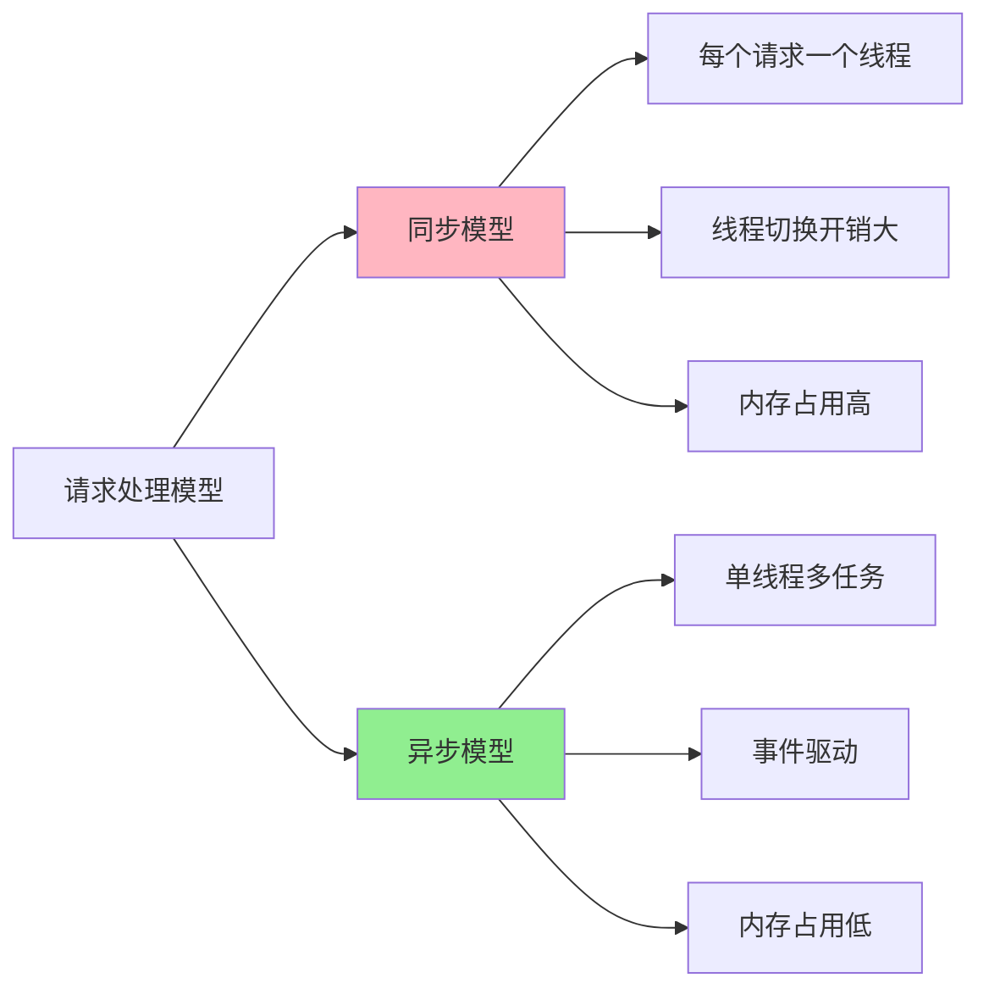

# 2.5 Rust 异步运行时指南 (2025)

> **文档定位**: Rust 异步运行时完整实战指南  
> **适用人群**: Rust 开发者，并发编程工程师  
> **关联文档**: [3.1 Rust 1.90 特性全解析](../references/3.1_Rust_1.90_特性全解析.md) | [1.2 术语表](../1.2_术语表.md)

**Rust 版本**: 1.90  
**文档状态**: ✅ 生产就绪  
**最后更新**: 2025-10-21

---

## 📋 目录

- [2.5 Rust 异步运行时指南 (2025)](#25-rust-异步运行时指南-2025)
  - [📋 目录](#-目录)
  - [2.5.1 概述](#251-概述)
    - [2.5.1.1 为什么需要异步运行时？](#2511-为什么需要异步运行时)
    - [2.5.1.2 运行时技术栈对比](#2512-运行时技术栈对比)
  - [2.5.2 Tokio 深度实战](#252-tokio-深度实战)
    - [2.5.2.1 项目初始化](#2521-项目初始化)
    - [2.5.2.2 任务调度](#2522-任务调度)
    - [2.5.2.3 Future 和 Poll](#2523-future-和-poll)
    - [2.5.2.4 异步通道](#2524-异步通道)
    - [2.5.2.5 同步原语](#2525-同步原语)
    - [2.5.2.6 定时器](#2526-定时器)
  - [2.5.3 async-std 实战](#253-async-std-实战)
    - [2.5.3.1 基础使用](#2531-基础使用)
    - [2.5.3.2 任务和流](#2532-任务和流)
  - [2.5.4 异步编程模式](#254-异步编程模式)
    - [2.5.4.1 并发执行](#2541-并发执行)
    - [2.5.4.2 流处理](#2542-流处理)
    - [2.5.4.3 超时处理](#2543-超时处理)
  - [2.5.5 异步 I/O](#255-异步-io)
    - [2.5.5.1 文件 I/O](#2551-文件-io)
    - [2.5.5.2 网络 I/O](#2552-网络-io)
    - [2.5.5.3 缓冲 I/O](#2553-缓冲-io)
  - [2.5.6 错误处理](#256-错误处理)
    - [2.5.6.1 Result 传播](#2561-result-传播)
    - [2.5.6.2 panic 处理](#2562-panic-处理)
    - [2.5.6.3 取消安全](#2563-取消安全)
  - [2.5.7 性能优化](#257-性能优化)
    - [2.5.7.1 任务调度器](#2571-任务调度器)
    - [2.5.7.2 零拷贝](#2572-零拷贝)
    - [2.5.7.3 批处理](#2573-批处理)
  - [2.5.8 调试和测试](#258-调试和测试)
    - [2.5.8.1 异步测试](#2581-异步测试)
    - [2.5.8.2 Tracing](#2582-tracing)
    - [2.5.8.3 性能分析](#2583-性能分析)
  - [2.5.9 最佳实践](#259-最佳实践)
    - [2.5.9.1 任务设计](#2591-任务设计)
    - [2.5.9.2 资源管理](#2592-资源管理)
    - [2.5.9.3 避免阻塞](#2593-避免阻塞)

---

## 2.5.1 概述

### 2.5.1.1 为什么需要异步运行时？

**核心价值**:

1. ✅ **高并发** - 单线程处理上万并发连接
2. ✅ **低开销** - 零成本抽象，接近手写状态机
3. ✅ **易用性** - async/await 语法简单直观
4. ✅ **灵活性** - 自定义运行时和调度策略
5. ✅ **生态完整** - 丰富的异步库生态

**同步 vs 异步对比**:



### 2.5.1.2 运行时技术栈对比

| 运行时 | 调度器 | 特点 | 性能 | 生态 | 成熟度 |
|--------|--------|------|------|------|--------|
| **Tokio** | 工作窃取 | 功能完整，高性能 | ⭐⭐⭐⭐⭐ | ⭐⭐⭐⭐⭐ | ⭐⭐⭐⭐⭐ |
| **async-std** | 工作窃取 | 类似 std，易用 | ⭐⭐⭐⭐ | ⭐⭐⭐⭐ | ⭐⭐⭐⭐ |
| **smol** | 单线程 | 轻量级，简单 | ⭐⭐⭐⭐ | ⭐⭐⭐ | ⭐⭐⭐ |

---

## 2.5.2 Tokio 深度实战

### 2.5.2.1 项目初始化

**依赖配置**:

```toml
[dependencies]
# Tokio 运行时
tokio = { version = "1.48", features = [
    "full",           # 所有特性
    "macros",         # #[tokio::main] 和 #[tokio::test]
    "rt-multi-thread", # 多线程运行时
    "io-util",        # I/O 工具
    "net",            # 网络
    "time",           # 定时器
    "sync",           # 同步原语
    "signal",         # 信号处理
] }

# Future 工具
futures = "0.3"

# 错误处理
anyhow = "1.0"
thiserror = "2.0"

# 日志
tracing = "0.1"
tracing-subscriber = "0.3"
```

**基础应用**:

```rust
use tokio::time::{sleep, Duration};

#[tokio::main]
async fn main() {
    println!("Hello, Tokio!");
    
    sleep(Duration::from_secs(1)).await;
    
    println!("1 second passed");
}
```

**运行时配置**:

```rust
use tokio::runtime::Runtime;

fn main() {
    // 单线程运行时
    let rt = Runtime::new().unwrap();
    
    rt.block_on(async {
        println!("Running on single thread");
    });
    
    // 多线程运行时
    let rt = tokio::runtime::Builder::new_multi_thread()
        .worker_threads(4)                    // 工作线程数
        .thread_name("my-tokio-worker")       // 线程名称
        .thread_stack_size(3 * 1024 * 1024)  // 栈大小 3MB
        .enable_all()                         // 启用所有特性
        .build()
        .unwrap();
    
    rt.block_on(async {
        println!("Running on multi-thread runtime");
    });
}
```

### 2.5.2.2 任务调度

**spawn 任务**:

```rust
use tokio::task;

#[tokio::main]
async fn main() {
    // 生成异步任务
    let handle = task::spawn(async {
        println!("Task running");
        42
    });
    
    // 等待任务完成
    let result = handle.await.unwrap();
    println!("Task result: {}", result);
}
```

**spawn_blocking 阻塞任务**:

```rust
#[tokio::main]
async fn main() {
    // 在阻塞线程池中执行
    let handle = task::spawn_blocking(|| {
        // CPU 密集型或阻塞操作
        std::thread::sleep(Duration::from_secs(1));
        println!("Blocking task complete");
        42
    });
    
    let result = handle.await.unwrap();
    println!("Result: {}", result);
}
```

**JoinSet 管理多任务**:

```rust
use tokio::task::JoinSet;

#[tokio::main]
async fn main() {
    let mut set = JoinSet::new();
    
    // 添加任务
    for i in 0..10 {
        set.spawn(async move {
            sleep(Duration::from_millis(100 * i)).await;
            i
        });
    }
    
    // 等待所有任务完成
    while let Some(res) = set.join_next().await {
        match res {
            Ok(n) => println!("Task {} completed", n),
            Err(e) => eprintln!("Task failed: {}", e),
        }
    }
}
```

### 2.5.2.3 Future 和 Poll

**自定义 Future**:

```rust
use std::future::Future;
use std::pin::Pin;
use std::task::{Context, Poll};

struct MyFuture {
    count: u32,
}

impl Future for MyFuture {
    type Output = u32;
    
    fn poll(mut self: Pin<&mut Self>, cx: &mut Context<'_>) -> Poll<Self::Output> {
        self.count += 1;
        
        if self.count < 3 {
            // 还未就绪，通知 waker 再次 poll
            cx.waker().wake_by_ref();
            Poll::Pending
        } else {
            // 就绪，返回结果
            Poll::Ready(self.count)
        }
    }
}

#[tokio::main]
async fn main() {
    let future = MyFuture { count: 0 };
    let result = future.await;
    println!("Result: {}", result);  // 输出: Result: 3
}
```

**Pin 和 Unpin**:

```rust
use std::pin::Pin;

async fn process_data(data: String) -> usize {
    data.len()
}

#[tokio::main]
async fn main() {
    let data = String::from("Hello");
    
    // Pin future
    let future = process_data(data);
    let pinned = Box::pin(future);
    
    let result = pinned.await;
    println!("Length: {}", result);
}
```

### 2.5.2.4 异步通道

**mpsc (多生产者单消费者)**:

```rust
use tokio::sync::mpsc;

#[tokio::main]
async fn main() {
    let (tx, mut rx) = mpsc::channel(32);  // 缓冲区大小 32
    
    // 生产者
    tokio::spawn(async move {
        for i in 0..10 {
            if tx.send(i).await.is_err() {
                break;
            }
        }
    });
    
    // 消费者
    while let Some(value) = rx.recv().await {
        println!("Received: {}", value);
    }
}
```

**oneshot (单次通信)**:

```rust
use tokio::sync::oneshot;

#[tokio::main]
async fn main() {
    let (tx, rx) = oneshot::channel();
    
    tokio::spawn(async move {
        // 发送一次
        if tx.send(42).is_err() {
            println!("Receiver dropped");
        }
    });
    
    match rx.await {
        Ok(value) => println!("Received: {}", value),
        Err(_) => println!("Sender dropped"),
    }
}
```

**broadcast (广播)**:

```rust
use tokio::sync::broadcast;

#[tokio::main]
async fn main() {
    let (tx, mut rx1) = broadcast::channel(16);
    let mut rx2 = tx.subscribe();
    
    // 发送者
    tokio::spawn(async move {
        for i in 0..5 {
            tx.send(i).unwrap();
        }
    });
    
    // 接收者 1
    tokio::spawn(async move {
        while let Ok(value) = rx1.recv().await {
            println!("Receiver 1: {}", value);
        }
    });
    
    // 接收者 2
    tokio::spawn(async move {
        while let Ok(value) = rx2.recv().await {
            println!("Receiver 2: {}", value);
        }
    });
    
    sleep(Duration::from_secs(1)).await;
}
```

**watch (状态同步)**:

```rust
use tokio::sync::watch;

#[tokio::main]
async fn main() {
    let (tx, mut rx) = watch::channel(0);
    
    // 更新者
    tokio::spawn(async move {
        for i in 1..=5 {
            tx.send(i).unwrap();
            sleep(Duration::from_millis(100)).await;
        }
    });
    
    // 观察者
    while rx.changed().await.is_ok() {
        println!("Value changed to: {}", *rx.borrow());
    }
}
```

### 2.5.2.5 同步原语

**Mutex (互斥锁)**:

```rust
use tokio::sync::Mutex;
use std::sync::Arc;

#[tokio::main]
async fn main() {
    let counter = Arc::new(Mutex::new(0));
    let mut handles = vec![];
    
    for _ in 0..10 {
        let counter = Arc::clone(&counter);
        let handle = tokio::spawn(async move {
            let mut num = counter.lock().await;
            *num += 1;
        });
        handles.push(handle);
    }
    
    for handle in handles {
        handle.await.unwrap();
    }
    
    println!("Counter: {}", *counter.lock().await);
}
```

**RwLock (读写锁)**:

```rust
use tokio::sync::RwLock;
use std::sync::Arc;

#[tokio::main]
async fn main() {
    let data = Arc::new(RwLock::new(vec![1, 2, 3]));
    
    // 读者
    let data_clone = Arc::clone(&data);
    tokio::spawn(async move {
        let read_guard = data_clone.read().await;
        println!("Read: {:?}", *read_guard);
    });
    
    // 写者
    let data_clone = Arc::clone(&data);
    tokio::spawn(async move {
        let mut write_guard = data_clone.write().await;
        write_guard.push(4);
    });
    
    sleep(Duration::from_millis(100)).await;
}
```

**Semaphore (信号量)**:

```rust
use tokio::sync::Semaphore;
use std::sync::Arc;

#[tokio::main]
async fn main() {
    let semaphore = Arc::new(Semaphore::new(3));  // 最多 3 个并发
    let mut handles = vec![];
    
    for i in 0..10 {
        let permit = semaphore.clone();
        let handle = tokio::spawn(async move {
            let _permit = permit.acquire().await.unwrap();
            println!("Task {} acquired permit", i);
            sleep(Duration::from_secs(1)).await;
            println!("Task {} released permit", i);
        });
        handles.push(handle);
    }
    
    for handle in handles {
        handle.await.unwrap();
    }
}
```

**Barrier (屏障)**:

```rust
use tokio::sync::Barrier;
use std::sync::Arc;

#[tokio::main]
async fn main() {
    let barrier = Arc::new(Barrier::new(5));
    let mut handles = vec![];
    
    for i in 0..5 {
        let barrier = Arc::clone(&barrier);
        let handle = tokio::spawn(async move {
            println!("Task {} waiting at barrier", i);
            barrier.wait().await;
            println!("Task {} passed barrier", i);
        });
        handles.push(handle);
    }
    
    for handle in handles {
        handle.await.unwrap();
    }
}
```

### 2.5.2.6 定时器

**sleep 延迟**:

```rust
use tokio::time::{sleep, Duration};

#[tokio::main]
async fn main() {
    println!("Start");
    sleep(Duration::from_secs(1)).await;
    println!("1 second passed");
}
```

**interval 定时器**:

```rust
use tokio::time::{interval, Duration};

#[tokio::main]
async fn main() {
    let mut interval = interval(Duration::from_secs(1));
    
    for i in 0..5 {
        interval.tick().await;
        println!("Tick {}", i);
    }
}
```

**timeout 超时**:

```rust
use tokio::time::{timeout, Duration, sleep};

#[tokio::main]
async fn main() {
    let result = timeout(Duration::from_secs(1), async {
        sleep(Duration::from_secs(2)).await;
        "completed"
    }).await;
    
    match result {
        Ok(value) => println!("Completed: {}", value),
        Err(_) => println!("Timeout!"),
    }
}
```

---

## 2.5.3 async-std 实战

### 2.5.3.1 基础使用

**依赖配置**:

```toml
[dependencies]
async-std = { version = "1.13", features = ["attributes"] }
```

**基础应用**:

```rust
use async_std::task;
use async_std::prelude::*;

#[async_std::main]
async fn main() {
    println!("Hello, async-std!");
    
    task::sleep(std::time::Duration::from_secs(1)).await;
    
    println!("1 second passed");
}
```

### 2.5.3.2 任务和流

**spawn 任务**:

```rust
use async_std::task;

#[async_std::main]
async fn main() {
    let handle = task::spawn(async {
        println!("Task running");
        42
    });
    
    let result = handle.await;
    println!("Result: {}", result);
}
```

**流处理**:

```rust
use async_std::stream::{self, StreamExt};

#[async_std::main]
async fn main() {
    let mut stream = stream::from_iter(1..=5);
    
    while let Some(value) = stream.next().await {
        println!("Value: {}", value);
    }
}
```

---

## 2.5.4 异步编程模式

### 2.5.4.1 并发执行

**join! 宏**:

```rust
use tokio::join;

#[tokio::main]
async fn main() {
    let future1 = async { 1 + 1 };
    let future2 = async { 2 + 2 };
    let future3 = async { 3 + 3 };
    
    // 并发执行，等待所有完成
    let (result1, result2, result3) = join!(future1, future2, future3);
    
    println!("Results: {}, {}, {}", result1, result2, result3);
}
```

**select! 宏**:

```rust
use tokio::select;
use tokio::time::{sleep, Duration};

#[tokio::main]
async fn main() {
    let future1 = sleep(Duration::from_secs(1));
    let future2 = sleep(Duration::from_secs(2));
    
    select! {
        _ = future1 => println!("Future 1 completed first"),
        _ = future2 => println!("Future 2 completed first"),
    }
}
```

**FuturesUnordered**:

```rust
use futures::stream::{FuturesUnordered, StreamExt};

#[tokio::main]
async fn main() {
    let mut futures = FuturesUnordered::new();
    
    for i in 0..5 {
        futures.push(async move {
            sleep(Duration::from_millis(100 * i)).await;
            i
        });
    }
    
    while let Some(result) = futures.next().await {
        println!("Completed: {}", result);
    }
}
```

### 2.5.4.2 流处理

**Stream trait**:

```rust
use futures::stream::{self, StreamExt};

#[tokio::main]
async fn main() {
    let stream = stream::iter(1..=10)
        .filter(|x| futures::future::ready(x % 2 == 0))
        .map(|x| x * 2);
    
    let results: Vec<_> = stream.collect().await;
    println!("Results: {:?}", results);
}
```

**异步迭代**:

```rust
use futures::stream::{self, StreamExt};

#[tokio::main]
async fn main() {
    let mut stream = stream::iter(1..=5);
    
    while let Some(value) = stream.next().await {
        println!("Processing: {}", value);
        sleep(Duration::from_millis(100)).await;
    }
}
```

### 2.5.4.3 超时处理

**tokio::time::timeout**:

```rust
use tokio::time::{timeout, Duration};

async fn fetch_data() -> Result<String, String> {
    sleep(Duration::from_secs(2)).await;
    Ok("data".to_string())
}

#[tokio::main]
async fn main() {
    match timeout(Duration::from_secs(1), fetch_data()).await {
        Ok(Ok(data)) => println!("Got data: {}", data),
        Ok(Err(e)) => println!("Fetch error: {}", e),
        Err(_) => println!("Timeout!"),
    }
}
```

---

## 2.5.5 异步 I/O

### 2.5.5.1 文件 I/O

**读取文件**:

```rust
use tokio::fs::File;
use tokio::io::{AsyncReadExt, AsyncWriteExt};

#[tokio::main]
async fn main() -> Result<(), Box<dyn std::error::Error>> {
    // 读取文件
    let mut file = File::open("example.txt").await?;
    let mut contents = String::new();
    file.read_to_string(&mut contents).await?;
    println!("File contents: {}", contents);
    
    // 写入文件
    let mut file = File::create("output.txt").await?;
    file.write_all(b"Hello, async file!").await?;
    
    Ok(())
}
```

**文件元数据**:

```rust
use tokio::fs;

#[tokio::main]
async fn main() -> Result<(), Box<dyn std::error::Error>> {
    let metadata = fs::metadata("example.txt").await?;
    println!("File size: {} bytes", metadata.len());
    println!("Is file: {}", metadata.is_file());
    
    Ok(())
}
```

### 2.5.5.2 网络 I/O

**TCP 客户端**:

```rust
use tokio::net::TcpStream;
use tokio::io::{AsyncReadExt, AsyncWriteExt};

#[tokio::main]
async fn main() -> Result<(), Box<dyn std::error::Error>> {
    let mut stream = TcpStream::connect("127.0.0.1:8080").await?;
    
    // 发送数据
    stream.write_all(b"Hello, server!").await?;
    
    // 接收数据
    let mut buffer = [0; 1024];
    let n = stream.read(&mut buffer).await?;
    println!("Received: {}", String::from_utf8_lossy(&buffer[..n]));
    
    Ok(())
}
```

**TCP 服务器**:

```rust
use tokio::net::TcpListener;
use tokio::io::{AsyncReadExt, AsyncWriteExt};

#[tokio::main]
async fn main() -> Result<(), Box<dyn std::error::Error>> {
    let listener = TcpListener::bind("127.0.0.1:8080").await?;
    println!("Server listening on port 8080");
    
    loop {
        let (mut socket, addr) = listener.accept().await?;
        println!("New connection from: {}", addr);
        
        tokio::spawn(async move {
            let mut buffer = [0; 1024];
            
            loop {
                match socket.read(&mut buffer).await {
                    Ok(0) => break,  // 连接关闭
                    Ok(n) => {
                        // 回显数据
                        if socket.write_all(&buffer[..n]).await.is_err() {
                            break;
                        }
                    }
                    Err(_) => break,
                }
            }
        });
    }
}
```

### 2.5.5.3 缓冲 I/O

**BufReader 和 BufWriter**:

```rust
use tokio::fs::File;
use tokio::io::{BufReader, BufWriter, AsyncBufReadExt, AsyncWriteExt};

#[tokio::main]
async fn main() -> Result<(), Box<dyn std::error::Error>> {
    // 缓冲读取
    let file = File::open("example.txt").await?;
    let reader = BufReader::new(file);
    
    let mut lines = reader.lines();
    while let Some(line) = lines.next_line().await? {
        println!("Line: {}", line);
    }
    
    // 缓冲写入
    let file = File::create("output.txt").await?;
    let mut writer = BufWriter::new(file);
    writer.write_all(b"Line 1\n").await?;
    writer.write_all(b"Line 2\n").await?;
    writer.flush().await?;
    
    Ok(())
}
```

---

## 2.5.6 错误处理

### 2.5.6.1 Result 传播

**? 操作符**:

```rust
async fn fetch_user(id: u64) -> Result<User, AppError> {
    let db = get_database().await?;
    let user = db.query_user(id).await?;
    Ok(user)
}
```

**自定义错误**:

```rust
use thiserror::Error;

#[derive(Error, Debug)]
enum AppError {
    #[error("IO error: {0}")]
    Io(#[from] std::io::Error),
    
    #[error("Database error: {0}")]
    Database(#[from] sqlx::Error),
    
    #[error("User not found: {0}")]
    UserNotFound(u64),
}
```

### 2.5.6.2 panic 处理

**catch_unwind**:

```rust
use std::panic::catch_unwind;

#[tokio::main]
async fn main() {
    let handle = tokio::spawn(async {
        panic!("Task panic!");
    });
    
    match handle.await {
        Ok(_) => println!("Task completed"),
        Err(e) => {
            if e.is_panic() {
                println!("Task panicked");
            }
        }
    }
}
```

### 2.5.6.3 取消安全

**CancellationToken**:

```rust
use tokio_util::sync::CancellationToken;

#[tokio::main]
async fn main() {
    let token = CancellationToken::new();
    let token_clone = token.clone();
    
    let handle = tokio::spawn(async move {
        loop {
            tokio::select! {
                _ = token_clone.cancelled() => {
                    println!("Task cancelled");
                    break;
                }
                _ = sleep(Duration::from_secs(1)) => {
                    println!("Working...");
                }
            }
        }
    });
    
    sleep(Duration::from_secs(3)).await;
    token.cancel();
    
    handle.await.unwrap();
}
```

---

## 2.5.7 性能优化

### 2.5.7.1 任务调度器

**工作窃取调度器**:

```rust
// Tokio 默认使用工作窃取调度器
let rt = tokio::runtime::Builder::new_multi_thread()
    .worker_threads(num_cpus::get())  // CPU 核心数
    .enable_all()
    .build()
    .unwrap();
```

### 2.5.7.2 零拷贝

**bytes crate**:

```rust
use bytes::{Bytes, BytesMut, BufMut};

fn process_data() {
    let mut buf = BytesMut::with_capacity(1024);
    buf.put(&b"Hello"[..]);
    
    // 零拷贝转换
    let bytes: Bytes = buf.freeze();
    
    // 零拷贝切片
    let slice = bytes.slice(0..5);
}
```

### 2.5.7.3 批处理

**批量操作**:

```rust
use tokio::sync::mpsc;

#[tokio::main]
async fn main() {
    let (tx, mut rx) = mpsc::channel(100);
    
    // 批量发送
    tokio::spawn(async move {
        for i in 0..100 {
            tx.send(i).await.unwrap();
        }
    });
    
    // 批量处理
    let mut batch = Vec::new();
    while let Some(value) = rx.recv().await {
        batch.push(value);
        
        if batch.len() >= 10 {
            process_batch(&batch).await;
            batch.clear();
        }
    }
}

async fn process_batch(batch: &[i32]) {
    println!("Processing batch of {} items", batch.len());
}
```

---

## 2.5.8 调试和测试

### 2.5.8.1 异步测试

**tokio::test**:

```rust
#[cfg(test)]
mod tests {
    use super::*;
    
    #[tokio::test]
    async fn test_async_function() {
        let result = fetch_data().await.unwrap();
        assert_eq!(result, "data");
    }
    
    #[tokio::test(flavor = "multi_thread", worker_threads = 2)]
    async fn test_concurrent() {
        let (result1, result2) = tokio::join!(
            async { 1 + 1 },
            async { 2 + 2 },
        );
        assert_eq!(result1, 2);
        assert_eq!(result2, 4);
    }
}
```

### 2.5.8.2 Tracing

**Tokio Console**:

```toml
[dependencies]
console-subscriber = "0.4"
```

```rust
#[tokio::main]
async fn main() {
    console_subscriber::init();
    
    // 应用代码
}
```

### 2.5.8.3 性能分析

**时间统计**:

```rust
use std::time::Instant;

#[tokio::main]
async fn main() {
    let start = Instant::now();
    
    expensive_operation().await;
    
    let duration = start.elapsed();
    println!("Operation took: {:?}", duration);
}
```

---

## 2.5.9 最佳实践

### 2.5.9.1 任务设计

**任务粒度**:

```rust
// ✅ 好的设计 - 合理的任务粒度
async fn process_user(user_id: u64) -> Result<()> {
    let user = fetch_user(user_id).await?;
    let posts = fetch_user_posts(user_id).await?;
    update_user_stats(&user, &posts).await?;
    Ok(())
}

// ❌ 不好的设计 - 任务过小
async fn tiny_task() {
    1 + 1
}
```

### 2.5.9.2 资源管理

**连接池**:

```rust
use sqlx::postgres::PgPoolOptions;

#[tokio::main]
async fn main() -> Result<(), sqlx::Error> {
    let pool = PgPoolOptions::new()
        .max_connections(5)
        .connect("postgres://localhost/mydb")
        .await?;
    
    // 使用连接池
    let row: (i64,) = sqlx::query_as("SELECT 1")
        .fetch_one(&pool)
        .await?;
    
    Ok(())
}
```

### 2.5.9.3 避免阻塞

**阻塞操作处理**:

```rust
use tokio::task;

#[tokio::main]
async fn main() {
    // ❌ 不要在异步任务中直接阻塞
    // std::thread::sleep(Duration::from_secs(1));
    
    // ✅ 使用异步 sleep
    tokio::time::sleep(Duration::from_secs(1)).await;
    
    // ✅ 或将阻塞操作移到专用线程
    task::spawn_blocking(|| {
        std::thread::sleep(Duration::from_secs(1));
    }).await.unwrap();
}
```

---

**文档版本**: v1.0  
**最后更新**: 2025-10-21  
**维护团队**: Rust 学习社区

---

**✅ Rust 异步运行时指南完成！** 🎉
