# 3.1 Rust 1.90 特性全解析 (2025)

> **文档定位**: Rust 1.90 版本核心特性深度解析  
> **适用人群**: 所有 Rust 开发者  
> **关联文档**: [1.2 术语表](../1.2_术语表.md) | [3.2 开源库生态全景图](3.2_开源库生态全景图.md)

**Rust 版本**: 1.90  
**发布时间**: 2025-10-21  
**文档状态**: ✅ 生产就绪

---

## 📋 目录

- [3.1 Rust 1.90 特性全解析 (2025)](#31-rust-190-特性全解析-2025)
  - [📋 目录](#-目录)
  - [3.1.1 版本概览](#311-版本概览)
    - [3.1.1.1 Rust 1.90 里程碑](#3111-rust-190-里程碑)
    - [3.1.1.2 Rust 2021 Edition 核心特性](#3112-rust-2021-edition-核心特性)
  - [3.1.2 语言特性](#312-语言特性)
    - [3.1.2.1 async fn in trait (稳定于 1.75)](#3121-async-fn-in-trait-稳定于-175)
    - [3.1.2.2 RPITIT (稳定于 1.75)](#3122-rpitit-稳定于-175)
    - [3.1.2.3 GAT (泛型关联类型, 稳定于 1.65)](#3123-gat-泛型关联类型-稳定于-165)
    - [3.1.2.4 Const Generics (稳定于 1.51, 持续改进)](#3124-const-generics-稳定于-151-持续改进)
  - [3.1.3 编译器改进](#313-编译器改进)
    - [3.1.3.1 编译速度优化](#3131-编译速度优化)
    - [3.1.3.2 改进的错误消息](#3132-改进的错误消息)
    - [3.1.3.3 诊断工具改进](#3133-诊断工具改进)
  - [3.1.4 标准库更新](#314-标准库更新)
    - [3.1.4.1 新增 API](#3141-新增-api)
    - [3.1.4.2 性能优化](#3142-性能优化)
  - [3.1.5 工具链升级](#315-工具链升级)
    - [3.1.5.1 Cargo 改进](#3151-cargo-改进)
    - [3.1.5.2 Clippy 更新](#3152-clippy-更新)
    - [3.1.5.3 Rustfmt 改进](#3153-rustfmt-改进)
  - [3.1.6 生态系统更新](#316-生态系统更新)
    - [3.1.6.1 主要库版本 (2025-10-21)](#3161-主要库版本-2025-10-21)
    - [3.1.6.2 新兴库 (2025)](#3162-新兴库-2025)
  - [3.1.7 迁移指南](#317-迁移指南)
    - [3.1.7.1 从 Rust 1.80 迁移](#3171-从-rust-180-迁移)
    - [3.1.7.2 常见迁移问题](#3172-常见迁移问题)
    - [3.1.7.3 破坏性变更](#3173-破坏性变更)
  - [3.1.8 参考资源](#318-参考资源)
    - [3.1.8.1 官方资源](#3181-官方资源)
    - [3.1.8.2 社区资源](#3182-社区资源)
    - [3.1.8.3 深度学习](#3183-深度学习)
  - [✅ 总结](#-总结)
    - [核心要点](#核心要点)
    - [版本特性速查](#版本特性速查)
    - [下一步行动](#下一步行动)

---

## 3.1.1 版本概览

### 3.1.1.1 Rust 1.90 里程碑

**Rust 1.90** 是 2025 年 10 月发布的稳定版本，标志着 Rust 语言的重要里程碑。

**核心特性总览**:

| 特性 | 状态 | 影响范围 | 重要性 |
|------|------|----------|--------|
| async fn in trait | ✅ 稳定 (1.75+) | 异步编程 | ⭐⭐⭐⭐⭐ |
| RPITIT | ✅ 稳定 (1.75+) | Trait 设计 | ⭐⭐⭐⭐⭐ |
| GAT | ✅ 稳定 (1.65+) | 高级类型 | ⭐⭐⭐⭐⭐ |
| Const Generics | ✅ 稳定 (1.51+) | 泛型编程 | ⭐⭐⭐⭐ |
| 改进的错误信息 | ✅ 持续改进 | 开发体验 | ⭐⭐⭐⭐⭐ |
| 编译速度优化 | ✅ 持续改进 | 开发效率 | ⭐⭐⭐⭐ |

**版本时间线**:

```mermaid
timeline
    title Rust 语言重要特性稳定化时间线
    2021 : Rust 2021 Edition
         : Const Generics (1.51)
    2022 : GAT 稳定 (1.65)
    2023 : async fn in trait (1.75)
         : RPITIT (1.75)
    2024 : 编译器性能优化
         : 改进的错误消息
    2025 : Rust 1.90 (当前)
         : 生态系统成熟
```



### 3.1.1.2 Rust 2021 Edition 核心特性

Rust 1.90 基于 **Rust 2021 Edition**，主要特性包括：

**1. Disjoint Capture in Closures**:

```rust
// Rust 2018: 捕获整个 struct
let a = SomeStruct { x: 10, y: 20 };
let c = || {
    println!("{}", a.x); // 捕获整个 a
};
// c(); a.y 无法访问

// Rust 2021: 只捕获使用的字段
let a = SomeStruct { x: 10, y: 20 };
let c = || {
    println!("{}", a.x); // 只捕获 a.x
};
c();
println!("{}", a.y); // ✅ 可以访问 a.y
```

**2. IntoIterator for Arrays**:

```rust
// Rust 2021: 数组自动实现 IntoIterator
let arr = [1, 2, 3];
for x in arr {  // 直接迭代，无需 &arr 或 arr.iter()
    println!("{}", x);
}
```

**3. Cargo Resolver V2**:

```toml
# Cargo.toml
[package]
edition = "2024"  # 自动启用 Resolver V3
```

**特点**:

- 更一致的依赖解析
- 避免重复编译相同依赖的不同特性组合
- 更快的构建速度

---

## 3.1.2 语言特性

### 3.1.2.1 async fn in trait (稳定于 1.75)

**定义**: 允许在 trait 中直接使用 `async fn`，无需 `#[async_trait]` 宏。

**核心价值**:

1. ✅ 零成本抽象 (无宏展开)
2. ✅ 更好的编译性能
3. ✅ 更清晰的错误信息
4. ✅ 原生语言支持

**示例**:

```rust
// ✅ Rust 1.75+ 原生支持
trait AsyncDatabase {
    async fn connect(&self, url: &str) -> Result<Connection>;
    async fn query(&self, sql: &str) -> Result<Vec<Row>>;
}

struct PostgresDb;

impl AsyncDatabase for PostgresDb {
    async fn connect(&self, url: &str) -> Result<Connection> {
        // 实现连接逻辑
        tokio_postgres::connect(url, tokio_postgres::NoTls).await
    }
    
    async fn query(&self, sql: &str) -> Result<Vec<Row>> {
        // 实现查询逻辑
        Ok(vec![])
    }
}

// 使用
async fn use_db(db: &impl AsyncDatabase) {
    let conn = db.connect("postgres://localhost").await?;
    let rows = db.query("SELECT * FROM users").await?;
}
```

**对比旧方案**:

```rust
// ❌ Rust 1.74 及之前: 需要 async-trait 宏
use async_trait::async_trait;

#[async_trait]
trait AsyncDatabase {
    async fn connect(&self, url: &str) -> Result<Connection>;
}

#[async_trait]
impl AsyncDatabase for PostgresDb {
    async fn connect(&self, url: &str) -> Result<Connection> {
        // ...
    }
}
```

**限制**:

- `dyn Trait` 需要额外的生命周期注解
- 返回的 Future 默认不是 `Send`

**解决方案**:

```rust
// 要求返回的 Future 是 Send
trait AsyncDatabase: Send + Sync {
    async fn query(&self, sql: &str) -> Result<Vec<Row>>
    where
        Self: Send;  // 确保 Future 是 Send
}

// 使用 dyn Trait
async fn use_dyn_db(db: &dyn AsyncDatabase) {
    // 需要 object-safe trait
}
```

**相关**: [1.2 术语表 - async fn in trait](../1.2_术语表.md#1221-async-fn-in-trait)

---

### 3.1.2.2 RPITIT (稳定于 1.75)

**定义**: Return Position Impl Trait in Trait，允许 trait 方法返回 `impl Trait`。

**核心价值**:

1. ✅ 类型推导
2. ✅ 零成本抽象
3. ✅ 简化 API
4. ✅ 迭代器友好

**示例**:

```rust
trait ConfigBuilder {
    // ✅ 返回 impl Trait
    fn builder() -> impl Builder;
    fn with_timeout(self, timeout: Duration) -> impl ConfigBuilder;
    fn with_retry(self, max_retries: u32) -> impl ConfigBuilder;
}

struct AppConfigBuilder {
    timeout: Option<Duration>,
    max_retries: Option<u32>,
}

impl ConfigBuilder for AppConfigBuilder {
    fn builder() -> impl Builder {
        AppConfigBuilder {
            timeout: None,
            max_retries: None,
        }
    }
    
    fn with_timeout(mut self, timeout: Duration) -> impl ConfigBuilder {
        self.timeout = Some(timeout);
        self
    }
    
    fn with_retry(mut self, max_retries: u32) -> impl ConfigBuilder {
        self.max_retries = Some(max_retries);
        self
    }
}

// 使用
let config = AppConfigBuilder::builder()
    .with_timeout(Duration::from_secs(30))
    .with_retry(3)
    .build();
```

**迭代器示例**:

```rust
trait DataSource {
    // 返回复杂的迭代器链
    fn fetch_items(&self) -> impl Iterator<Item = String> {
        vec!["item1".to_string(), "item2".to_string()]
            .into_iter()
            .filter(|s| s.len() > 3)
            .map(|s| s.to_uppercase())
    }
}
```

**对比 GAT**:

| 特性 | RPITIT | GAT |
|------|--------|-----|
| 语法 | `fn foo() -> impl Trait` | `type Output<'a>; fn foo() -> Self::Output<'_>` |
| 复杂度 | ⭐⭐ 简单 | ⭐⭐⭐⭐ 复杂 |
| 适用场景 | 简单返回类型抽象 | 高级类型关系 |
| 生命周期 | 自动推导 | 显式指定 |

**相关**: [1.2 术语表 - RPITIT](../1.2_术语表.md#1222-rpitit)

---

### 3.1.2.3 GAT (泛型关联类型, 稳定于 1.65)

**定义**: Generic Associated Types，关联类型可以有泛型参数。

**核心价值**:

1. ✅ 生命周期参数化
2. ✅ 类型参数化
3. ✅ 高级抽象能力
4. ✅ 实现复杂的类型关系

**示例 1: 连接池抽象**:

```rust
trait Pool {
    // GAT: 关联类型有生命周期参数
    type Connection<'pool> where Self: 'pool;
    
    async fn acquire(&self) -> Result<Self::Connection<'_>>;
}

struct PostgresPool {
    // ...
}

struct PooledConnection<'pool> {
    pool: &'pool PostgresPool,
    conn: tokio_postgres::Client,
}

impl Pool for PostgresPool {
    type Connection<'pool> = PooledConnection<'pool>;
    
    async fn acquire(&self) -> Result<Self::Connection<'_>> {
        // 获取连接
        let conn = self.get_connection().await?;
        Ok(PooledConnection {
            pool: self,
            conn,
        })
    }
}

// 使用
async fn use_pool(pool: &impl Pool) {
    let conn = pool.acquire().await?;
    // conn 的生命周期绑定到 pool
    // conn 被 drop 时自动归还到 pool
}
```

**示例 2: Lending Iterator (借用迭代器)**:

```rust
trait LendingIterator {
    type Item<'a> where Self: 'a;
    
    fn next(&mut self) -> Option<Self::Item<'_>>;
}

struct WindowsMut<'data, T> {
    data: &'data mut [T],
    window_size: usize,
    position: usize,
}

impl<'data, T> LendingIterator for WindowsMut<'data, T> {
    type Item<'a> = &'a mut [T] where Self: 'a;
    
    fn next(&mut self) -> Option<Self::Item<'_>> {
        if self.position + self.window_size <= self.data.len() {
            let start = self.position;
            let end = start + self.window_size;
            self.position += 1;
            Some(&mut self.data[start..end])
        } else {
            None
        }
    }
}

// 使用
let mut data = vec![1, 2, 3, 4, 5];
let mut windows = WindowsMut {
    data: &mut data,
    window_size: 3,
    position: 0,
};

while let Some(window) = windows.next() {
    // window 是可变借用，每次迭代都是独立的生命周期
    window[0] += 10;
}
```

**示例 3: 异步迭代器**:

```rust
trait AsyncIterator {
    type Item<'a> where Self: 'a;
    
    async fn next(&mut self) -> Option<Self::Item<'_>>;
}

struct DbCursor {
    conn: tokio_postgres::Client,
}

impl AsyncIterator for DbCursor {
    type Item<'a> = tokio_postgres::Row;
    
    async fn next(&mut self) -> Option<Self::Item<'_>> {
        // 从数据库获取下一行
        self.conn.query_one("SELECT ...", &[]).await.ok()
    }
}
```

**相关**: [1.2 术语表 - GAT](../1.2_术语表.md#1223-泛型关联类型-gat)

---

### 3.1.2.4 Const Generics (稳定于 1.51, 持续改进)

**定义**: 允许泛型参数为编译时常量值。

**Rust 1.90 改进**:

- ✅ 更多的常量表达式支持
- ✅ 更好的错误消息
- ✅ 性能优化

**示例 1: 固定大小缓冲区**:

```rust
struct Buffer<const N: usize> {
    data: [u8; N],
    len: usize,
}

impl<const N: usize> Buffer<N> {
    fn new() -> Self {
        Self {
            data: [0; N],
            len: 0,
        }
    }
    
    fn push(&mut self, byte: u8) -> Result<(), &'static str> {
        if self.len < N {
            self.data[self.len] = byte;
            self.len += 1;
            Ok(())
        } else {
            Err("Buffer full")
        }
    }
    
    fn capacity() -> usize {
        N
    }
}

// 使用
let mut buf: Buffer<1024> = Buffer::new();
buf.push(42)?;
assert_eq!(Buffer::<1024>::capacity(), 1024);
```

**示例 2: SIMD 向量**:

```rust
#[repr(align(16))]
struct SimdVector<T, const N: usize> {
    data: [T; N],
}

impl<T: Copy, const N: usize> SimdVector<T, N> {
    fn new(value: T) -> Self {
        Self {
            data: [value; N],
        }
    }
    
    fn add(&self, other: &Self) -> Self
    where
        T: std::ops::Add<Output = T>,
    {
        let mut result = Self::new(self.data[0]);
        for i in 0..N {
            result.data[i] = self.data[i] + other.data[i];
        }
        result
    }
}

// 使用
let v1: SimdVector<f32, 4> = SimdVector::new(1.0);
let v2: SimdVector<f32, 4> = SimdVector::new(2.0);
let v3 = v1.add(&v2);
```

**示例 3: 类型安全配置**:

```rust
struct Config<const MAX_CONNECTIONS: usize = 16> {
    pool_size: usize,
}

impl<const MAX: usize> Config<MAX> {
    fn new(pool_size: usize) -> Result<Self, String> {
        if pool_size > MAX {
            Err(format!(
                "Pool size {} exceeds maximum {}",
                pool_size, MAX
            ))
        } else {
            Ok(Self { pool_size })
        }
    }
    
    fn validate(&self) -> bool {
        self.pool_size <= MAX && self.pool_size > 0
    }
}

// 使用
let config: Config<32> = Config::new(16)?;
assert!(config.validate());

// 编译时错误
// let bad_config: Config<10> = Config::new(20)?;  // 运行时错误
```

**相关**: [1.2 术语表 - Const Generics](../1.2_术语表.md#1224-const-generics)

---

## 3.1.3 编译器改进

### 3.1.3.1 编译速度优化

**Rust 1.90 编译器性能改进**:

| 优化项 | 改进幅度 | 适用场景 |
|--------|---------|---------|
| 增量编译 | +30% | 日常开发 |
| 并行前端 | +25% | 大型项目 |
| LLVM 后端 | +15% | Release 构建 |
| 宏展开 | +20% | 宏密集代码 |

**示例: 优化编译配置**:

```toml
# Cargo.toml

[profile.dev]
# 开发环境: 快速编译
opt-level = 0
debug = true
incremental = true

[profile.release]
# 生产环境: 最优性能
opt-level = 3
lto = "fat"          # 链接时优化
codegen-units = 1    # 单一代码生成单元
strip = true         # 去除符号信息

[profile.dev.package."*"]
# 依赖库使用优化
opt-level = 2
```

### 3.1.3.2 改进的错误消息

**Rust 1.90 错误消息改进**:

**示例 1: 生命周期错误**:

```rust
// 错误代码
fn longest(x: &str, y: &str) -> &str {
    if x.len() > y.len() { x } else { y }
}

// Rust 1.90 错误消息:
// error[E0106]: missing lifetime specifier
//  --> src/main.rs:1:38
//   |
// 1 | fn longest(x: &str, y: &str) -> &str {
//   |               ----     ----     ^ expected named lifetime parameter
//   |
//   = help: this function's return type contains a borrowed value,
//           but the signature does not say whether it is borrowed from `x` or `y`
//   = note: consider introducing a named lifetime parameter
// help: consider using a named lifetime parameter:
//   |
// 1 | fn longest<'a>(x: &'a str, y: &'a str) -> &'a str {
//   |           ++++     ++          ++          ++
```

**示例 2: Trait 限制错误**:

```rust
// 错误代码
async fn process<T>(data: T) {
    tokio::spawn(async move {
        // 使用 data
    });
}

// Rust 1.90 错误消息:
// error[E0277]: `T` cannot be sent between threads safely
//  --> src/main.rs:3:5
//   |
// 3 |     tokio::spawn(async move {
//   |     ^^^^^^^^^^^^ `T` cannot be sent between threads safely
//   |
//   = help: the trait `Send` is not implemented for `T`
// help: consider restricting type parameter `T`:
//   |
// 1 | async fn process<T: Send>(data: T) {
//   |                   ++++++
```

### 3.1.3.3 诊断工具改进

**新增诊断选项**:

```bash
# 显示详细的编译过程
cargo build -v

# 时间分析
cargo build --timings

# 显示编译图
cargo build --build-plan

# 检查未使用的依赖
cargo +nightly udeps
```

**Rust Analyzer 改进** (2025):

- ✅ 更快的代码补全
- ✅ 更准确的类型推导
- ✅ 内联宏展开提示
- ✅ 改进的重构支持

---

## 3.1.4 标准库更新

### 3.1.4.1 新增 API

**Rust 1.90 新增标准库 API** (持续更新):

**1. Option/Result 增强**:

```rust
// 新增: Option::is_some_and
let x = Some(2);
assert!(x.is_some_and(|x| x > 1));

// 新增: Result::inspect
let result: Result<i32, String> = Ok(42);
result
    .inspect(|x| println!("Got value: {}", x))
    .inspect_err(|e| eprintln!("Got error: {}", e));
```

**2. Iterator 增强**:

```rust
// 新增: iterator.next_chunk()
let mut iter = [1, 2, 3, 4, 5].into_iter();
let chunk: [i32; 3] = iter.next_chunk().unwrap();
assert_eq!(chunk, [1, 2, 3]);
```

**3. 字符串处理**:

```rust
// 改进的字符串分割
let s = "hello world";
let (first, rest) = s.split_once(' ').unwrap();
assert_eq!(first, "hello");
assert_eq!(rest, "world");
```

### 3.1.4.2 性能优化

**标准库性能改进**:

| 组件 | 改进 | 影响 |
|------|------|------|
| HashMap | 更快的哈希算法 | +15% |
| String | 优化的格式化 | +10% |
| Vec | 改进的增长策略 | +8% |
| Arc/Mutex | 更快的原子操作 | +12% |

---

## 3.1.5 工具链升级

### 3.1.5.1 Cargo 改进

**Cargo 1.90 新特性**:

**1. 工作区依赖继承**:

```toml
# 根工作区 Cargo.toml
[workspace.dependencies]
tokio = { version = "1.48", features = ["full"] }
serde = { version = "1.0", features = ["derive"] }

# 子包 Cargo.toml
[dependencies]
tokio = { workspace = true }
serde = { workspace = true }
```

**2. Sparse Registry (稀疏索引)**:

```toml
# .cargo/config.toml
[registries.crates-io]
protocol = "sparse"  # 更快的依赖解析
```

**3. 改进的特性解析**:

- ✅ 更智能的特性传播
- ✅ 避免特性冲突
- ✅ 更快的依赖解析速度

### 3.1.5.2 Clippy 更新

**新增 Lint 规则**:

```rust
// 1. needless_pass_by_ref_mut
fn process(data: &mut Vec<i32>) {  // ⚠️ 警告: 不需要可变引用
    println!("{:?}", data);
}

// 修复
fn process(data: &Vec<i32>) {
    println!("{:?}", data);
}

// 2. redundant_type_annotations
let x: i32 = 42;  // ⚠️ 警告: 类型注解冗余
let x = 42i32;    // ✅ 推荐

// 3. manual_let_else
let Some(x) = option else {  // ✅ Rust 1.65+ 特性
    return;
};
```

### 3.1.5.3 Rustfmt 改进

**新格式化选项**:

```toml
# rustfmt.toml
edition = "2021"
max_width = 100
use_small_heuristics = "Max"
imports_granularity = "Crate"
group_imports = "StdExternalCrate"
```

---

## 3.1.6 生态系统更新

### 3.1.6.1 主要库版本 (2025-10-21)

**异步运行时**:

| 库 | 版本 | 主要特性 |
|----|------|---------|
| Tokio | 1.48.0 | 改进的 work-stealing，更快的 spawn |
| async-std | 1.13.0 | 标准库兼容的异步 API |
| smol | 2.0+ | 轻量级异步运行时 |

**Web 框架**:

| 库 | 版本 | 主要特性 |
|----|------|---------|
| Axum | 0.8.0 | 改进的类型推导，更好的错误处理 |
| Actix-web | 4.9.0 | 更快的路由，改进的中间件 |
| Rocket | 0.5.1 | 稳定的异步支持 |

**数据库**:

| 库 | 版本 | 主要特性 |
|----|------|---------|
| sqlx | 0.8.6 | 编译时 SQL 检查，更好的性能 |
| sea-orm | 2.0.0-rc.9 | 异步 ORM，支持多种数据库 |
| diesel | 2.2.4 | 类型安全的 SQL，性能优化 |

**序列化**:

| 库 | 版本 | 主要特性 |
|----|------|---------|
| serde | 1.0.228 | 更快的序列化，更好的错误 |
| serde_json | 1.0.145 | JSON 解析性能提升 |

### 3.1.6.2 新兴库 (2025)

**前端框架**:

**1. Leptos** (0.7+):

```rust
use leptos::*;

#[component]
fn Counter() -> impl IntoView {
    let (count, set_count) = create_signal(0);
    
    view! {
        <button on:click=move |_| set_count.update(|n| *n += 1)>
            "Count: " {count}
        </button>
    }
}
```

**特点**:

- ✅ 细粒度响应式
- ✅ 服务端渲染
- ✅ 全栈 Rust

**2. Dioxus** (0.6+):

```rust
use dioxus::prelude::*;

fn app() -> Element {
    let mut count = use_signal(|| 0);
    
    rsx! {
        button { 
            onclick: move |_| count += 1,
            "Count: {count}"
        }
    }
}
```

**特点**:

- ✅ 跨平台 (Web, Desktop, Mobile)
- ✅ React-like API
- ✅ 热重载

**数据处理**:

**1. Polars** (0.44+):

```rust
use polars::prelude::*;

let df = df! {
    "name" => ["Alice", "Bob", "Charlie"],
    "age" => [25, 30, 35],
}?;

let result = df
    .lazy()
    .filter(col("age").gt(25))
    .select([col("name")])
    .collect()?;
```

**特点**:

- ✅ 高性能 DataFrame
- ✅ 类似 Pandas API
- ✅ 支持 Arrow 格式

**2. DataFusion** (43+):

```rust
use datafusion::prelude::*;

let ctx = SessionContext::new();
ctx.register_csv("users", "users.csv", CsvReadOptions::new()).await?;

let df = ctx.sql("SELECT name, age FROM users WHERE age > 25").await?;
df.show().await?;
```

**特点**:

- ✅ SQL 查询引擎
- ✅ 支持大数据处理
- ✅ 可扩展

---

## 3.1.7 迁移指南

### 3.1.7.1 从 Rust 1.80 迁移

**检查清单**:

1. ✅ **更新 Rust 版本**:

    ```bash
    rustup update stable
    rustc --version  # 确认 1.90+
    ```

2. ✅ **更新依赖版本**:

    ```bash
    cargo update
    cargo outdated  # 检查过时的依赖
    ```

3. ✅ **运行 Clippy**:

    ```bash
    cargo clippy -- -D warnings
    ```

4. ✅ **运行测试**:

    ```bash
    cargo test
    cargo test --all-features
    ```

5. ✅ **更新 CI/CD**:

    ```yaml
    # .github/workflows/ci.yml
    - uses: actions-rust-lang/setup-rust-toolchain@v1
    with:
        toolchain: 1.90
    ```

### 3.1.7.2 常见迁移问题

**Q1: async fn in trait 如何使用?**

A: 直接在 trait 中使用 `async fn`，移除 `#[async_trait]` 宏：

```rust
// 旧代码
#[async_trait]
trait Database {
    async fn query(&self) -> Result<Vec<Row>>;
}

// 新代码 (Rust 1.75+)
trait Database {
    async fn query(&self) -> Result<Vec<Row>>;
}
```

**Q2: RPITIT 有什么限制?**

A: 不支持 `dyn Trait`，如需动态分发，使用关联类型：

```rust
// ❌ 不支持
trait Iterator {
    fn next(&mut self) -> impl Option<Self::Item>;
}
let iter: &dyn Iterator = ...;  // 错误

// ✅ 使用关联类型
trait Iterator {
    type Item;
    fn next(&mut self) -> Option<Self::Item>;
}
```

**Q3: 编译时间增加怎么办?**

A: 优化编译配置：

```toml
[profile.dev]
opt-level = 1  # 稍微优化
incremental = true
[profile.dev.package."*"]
opt-level = 2  # 依赖库更多优化
```

### 3.1.7.3 破坏性变更

**Rust 1.90 没有重大破坏性变更**，但注意：

1. ⚠️ 某些过时的 API 可能被弃用
2. ⚠️ Clippy 新增的 lint 可能报告更多警告
3. ⚠️ 依赖库可能有 breaking changes

---

## 3.1.8 参考资源

### 3.1.8.1 官方资源

**核心文档**:

- [Rust 官方网站](https://www.rust-lang.org/)
- [Rust 官方博客](https://blog.rust-lang.org/)
- [Rust Release Notes](https://github.com/rust-lang/rust/releases)
- [Rust Edition Guide](https://doc.rust-lang.org/edition-guide/)
- [Rust Reference](https://doc.rust-lang.org/reference/)

**学习资源**:

- [The Rust Book](https://doc.rust-lang.org/book/)
- [Rust by Example](https://doc.rust-lang.org/rust-by-example/)
- [Rustlings](https://github.com/rust-lang/rustlings)

### 3.1.8.2 社区资源

**新闻和更新**:

- [This Week in Rust](https://this-week-in-rust.org/)
- [Rust Reddit](https://www.reddit.com/r/rust/)
- [Rust Users Forum](https://users.rust-lang.org/)

**库和工具**:

- [Awesome Rust](https://github.com/rust-unofficial/awesome-rust)
- [Crates.io](https://crates.io/)
- [Lib.rs](https://lib.rs/)

### 3.1.8.3 深度学习

**高级主题**:

- [Rust Nomicon](https://doc.rust-lang.org/nomicon/) - Unsafe Rust
- [Rust Async Book](https://rust-lang.github.io/async-book/)
- [Rust Performance Book](https://nnethercote.github.io/perf-book/)

**内部机制**:

- [rustc-dev-guide](https://rustc-dev-guide.rust-lang.org/)
- [MIR (Mid-level IR)](https://blog.rust-lang.org/2016/04/19/MIR.html)

---

## ✅ 总结

### 核心要点

**Rust 1.90 (2025-10-21) 的 5 大亮点**:

1. ✅ **async fn in trait** - 原生异步 trait 支持
2. ✅ **RPITIT** - trait 方法返回 impl Trait
3. ✅ **GAT** - 泛型关联类型
4. ✅ **编译器优化** - 编译速度提升 20-30%
5. ✅ **生态成熟** - 主流库全面支持

### 版本特性速查

| 特性 | 稳定版本 | 使用率 | 推荐度 |
|------|---------|--------|--------|
| async fn in trait | 1.75+ | ⭐⭐⭐⭐⭐ | 强烈推荐 |
| RPITIT | 1.75+ | ⭐⭐⭐⭐ | 推荐 |
| GAT | 1.65+ | ⭐⭐⭐⭐ | 推荐 |
| Const Generics | 1.51+ | ⭐⭐⭐⭐⭐ | 强烈推荐 |

### 下一步行动

1. ✅ 升级到 Rust 1.90
2. ✅ 更新项目依赖
3. ✅ 采用新语言特性
4. ✅ 优化编译配置
5. ✅ 探索新兴库

---

**文档版本**: v1.0  
**最后更新**: 2025-10-21  
**维护团队**: Rust 学习社区

---

**✅ Rust 1.90 特性全解析完成！** 🎉
