# 3.2 Rust 开源库生态全景图 (2025)

> **文档定位**: Rust 开源库生态系统全景概览和分类指南  
> **适用人群**: 所有 Rust 开发者  
> **关联文档**: [3.1 Rust 1.90 特性全解析](3.1_Rust_1.90_特性全解析.md) | [1.1 主索引导航](../1.1_主索引导航.md)

**生态版本**: Rust 1.90  
**统计时间**: 2025-10-21  
**文档状态**: ✅ 生产就绪

---

## 📋 目录

- [3.2 Rust 开源库生态全景图 (2025)](#32-rust-开源库生态全景图-2025)
  - [📋 目录](#-目录)
  - [3.2.1 生态系统概览](#321-生态系统概览)
    - [3.2.1.1 核心统计](#3211-核心统计)
    - [3.2.1.2 生态架构图](#3212-生态架构图)
    - [3.2.1.3 成熟度评估](#3213-成熟度评估)
  - [3.2.2 基础设施层](#322-基础设施层)
    - [3.2.2.1 序列化与编码](#3221-序列化与编码)
    - [3.2.2.2 时间与日期](#3222-时间与日期)
    - [3.2.2.3 数学与算法](#3223-数学与算法)
    - [3.2.2.4 压缩与哈希](#3224-压缩与哈希)
    - [3.2.2.5 字符串处理](#3225-字符串处理)
  - [3.2.3 系统编程层](#323-系统编程层)
    - [3.2.3.1 异步运行时](#3231-异步运行时)
    - [3.2.3.2 并发与同步](#3232-并发与同步)
    - [3.2.3.3 内存管理](#3233-内存管理)
    - [3.2.3.4 网络协议](#3234-网络协议)
    - [3.2.3.5 系统接口](#3235-系统接口)
  - [3.2.4 应用开发层](#324-应用开发层)
    - [3.2.4.1 Web 框架](#3241-web-框架)
    - [3.2.4.2 数据库](#3242-数据库)
    - [3.2.4.3 缓存系统](#3243-缓存系统)
    - [3.2.4.4 消息队列](#3244-消息队列)
    - [3.2.4.5 CLI 工具](#3245-cli-工具)
  - [3.2.5 领域专用层](#325-领域专用层)
    - [3.2.5.1 GUI 开发](#3251-gui-开发)
    - [3.2.5.2 游戏开发](#3252-游戏开发)
    - [3.2.5.3 WebAssembly](#3253-webassembly)
    - [3.2.5.4 嵌入式系统](#3254-嵌入式系统)
    - [3.2.5.5 科学计算](#3255-科学计算)
  - [3.2.6 工具链层](#326-工具链层)
    - [3.2.6.1 开发工具](#3261-开发工具)
    - [3.2.6.2 测试工具](#3262-测试工具)
    - [3.2.6.3 性能分析](#3263-性能分析)
    - [3.2.6.4 文档生成](#3264-文档生成)
  - [3.2.7 横切关注点](#327-横切关注点)
    - [3.2.7.1 错误处理](#3271-错误处理)
    - [3.2.7.2 日志与追踪](#3272-日志与追踪)
    - [3.2.7.3 安全与认证](#3273-安全与认证)
    - [3.2.7.4 配置管理](#3274-配置管理)
  - [3.2.8 新兴趋势](#328-新兴趋势)
    - [3.2.8.1 全栈 Rust](#3281-全栈-rust)
    - [3.2.8.2 数据工程](#3282-数据工程)
    - [3.2.8.3 区块链](#3283-区块链)
    - [3.2.8.4 机器学习](#3284-机器学习)
  - [3.2.9 选型指南](#329-选型指南)
  - [3.2.10 参考资源](#3210-参考资源)

---

## 3.2.1 生态系统概览

### 3.2.1.1 核心统计

**Rust 生态系统规模 (2025-10-21)**:

| 指标 | 数量 | 说明 |
|------|------|------|
| **Crates.io 总库数** | 150,000+ | 官方包仓库 |
| **日均下载量** | 300M+ | 高活跃度 |
| **活跃维护库** | 50,000+ | 定期更新 |
| **生产就绪库** | 10,000+ | 成熟稳定 |
| **企业采用** | 5,000+ | 商业应用 |

**增长趋势**:

```mermaid
graph LR
    A[2020: 50K 库] --> B[2021: 70K 库]
    B --> C[2022: 90K 库]
    C --> D[2023: 110K 库]
    D --> E[2024: 130K 库]
    E --> F[2025: 150K+ 库]
    
    style F fill:#90EE90
```



### 3.2.1.2 生态架构图

**五层架构模型**:

```mermaid
graph TB
    subgraph Layer5[工具链层]
        T1[Cargo] & T2[Clippy] & T3[Rustfmt] & T4[Analyzer]
    end
    
    subgraph Layer4[领域专用层]
        D1[GUI] & D2[游戏] & D3[WASM] & D4[嵌入式] & D5[科学]
    end
    
    subgraph Layer3[应用开发层]
        A1[Web] & A2[数据库] & A3[缓存] & A4[消息队列] & A5[CLI]
    end
    
    subgraph Layer2[系统编程层]
        S1[异步运行时] & S2[并发] & S3[内存] & S4[网络] & S5[系统]
    end
    
    subgraph Layer1[基础设施层]
        I1[序列化] & I2[时间] & I3[数学] & I4[压缩] & I5[字符串]
    end
    
    Layer5 --> Layer4 --> Layer3 --> Layer2 --> Layer1
    
    style Layer1 fill:#E8F4F8
    style Layer2 fill:#D4E9F2
    style Layer3 fill:#C0DEEC
    style Layer4 fill:#ACD3E6
    style Layer5 fill:#98C8E0
```



### 3.2.1.3 成熟度评估

**库成熟度分级标准**:

| 等级 | 标准 | 特征 | 示例 |
|------|------|------|------|
| ⭐⭐⭐⭐⭐ | 生产就绪 | 1.0+ 版本，广泛使用 | serde, tokio, axum |
| ⭐⭐⭐⭐ | 稳定 | 0.8+, 活跃维护 | sea-orm, polars |
| ⭐⭐⭐ | 成长中 | 0.5+, 快速迭代 | leptos, dioxus |
| ⭐⭐ | 实验性 | 0.1+, 概念验证 | 新兴库 |
| ⭐ | 早期 | 概念阶段 | - |

---

## 3.2.2 基础设施层

### 3.2.2.1 序列化与编码

**核心库对比**:

| 库 | 版本 | 格式 | 性能 | 特点 | 成熟度 |
|----|------|------|------|------|--------|
| **serde** | 1.0.228 | 通用框架 | ⭐⭐⭐⭐⭐ | 零成本抽象，编译时 | ⭐⭐⭐⭐⭐ |
| **serde_json** | 1.0.145 | JSON | ⭐⭐⭐⭐⭐ | 标准 JSON | ⭐⭐⭐⭐⭐ |
| **bincode** | 1.3+ | 二进制 | ⭐⭐⭐⭐⭐ | 紧凑高效 | ⭐⭐⭐⭐⭐ |
| **postcard** | 1.0+ | 二进制 | ⭐⭐⭐⭐⭐ | 无堆分配，嵌入式 | ⭐⭐⭐⭐ |
| **rmp-serde** | 1.3+ | MessagePack | ⭐⭐⭐⭐ | 跨语言 | ⭐⭐⭐⭐ |
| **toml** | 0.9.8 | TOML | ⭐⭐⭐⭐ | 配置文件 | ⭐⭐⭐⭐⭐ |
| **quick-xml** | 0.37+ | XML | ⭐⭐⭐⭐ | 流式解析 | ⭐⭐⭐⭐ |

**使用场景**:

```rust
// JSON: API 通信
#[derive(Serialize, Deserialize)]
struct User {
    name: String,
    age: u32,
}

// Bincode: 高性能序列化
let bytes = bincode::serialize(&user)?;

// Postcard: 嵌入式系统
let bytes = postcard::to_vec(&user)?;

// MessagePack: 跨语言
let bytes = rmp_serde::to_vec(&user)?;
```

### 3.2.2.2 时间与日期

**核心库对比**:

| 库 | 版本 | 特点 | 时区支持 | 格式化 | 成熟度 |
|----|------|------|---------|--------|--------|
| **chrono** | 0.4.42 | 功能完整 | ✅ 完整 | ✅ 强大 | ⭐⭐⭐⭐⭐ |
| **time** | 0.3.44 | 现代API | ✅ 完整 | ✅ 宏支持 | ⭐⭐⭐⭐⭐ |
| **humantime** | 2.1+ | 人类可读 | ❌ 无 | ✅ 简单 | ⭐⭐⭐⭐ |

**使用场景**:

```rust
// chrono: 通用时间处理
use chrono::{DateTime, Utc};
let now: DateTime<Utc> = Utc::now();

// time: 现代 API
use time::{Date, Month, macros::date};
let date = date!(2025-10-21);

// humantime: 配置文件
let duration = humantime::parse_duration("1h 30m")?;
```

### 3.2.2.3 数学与算法

**核心库对比**:

| 库 | 版本 | 领域 | 特点 | 成熟度 |
|----|------|------|------|--------|
| **num** | 0.4+ | 数值类型 | 大整数，复数，有理数 | ⭐⭐⭐⭐⭐ |
| **ndarray** | 0.16.1 | N维数组 | NumPy-like API | ⭐⭐⭐⭐⭐ |
| **nalgebra** | 0.33+ | 线性代数 | 向量，矩阵，变换 | ⭐⭐⭐⭐⭐ |
| **statrs** | 0.17+ | 统计学 | 分布，采样，测试 | ⭐⭐⭐⭐ |
| **rand** | 0.9.2 | 随机数 | 高质量随机数生成 | ⭐⭐⭐⭐⭐ |

**使用场景**:

```rust
// ndarray: 科学计算
use ndarray::Array2;
let a = Array2::<f64>::zeros((3, 3));

// nalgebra: 游戏/图形学
use nalgebra::{Vector3, Matrix4};
let v = Vector3::new(1.0, 2.0, 3.0);

// statrs: 统计分析
use statrs::distribution::{Normal, Continuous};
let n = Normal::new(0.0, 1.0)?;
```

### 3.2.2.4 压缩与哈希

**压缩库对比**:

| 库 | 版本 | 算法 | 速度 | 压缩率 | 成熟度 |
|----|------|------|------|--------|--------|
| **flate2** | 1.0+ | gzip/deflate | ⭐⭐⭐⭐ | ⭐⭐⭐⭐ | ⭐⭐⭐⭐⭐ |
| **zstd** | 0.13+ | Zstandard | ⭐⭐⭐⭐⭐ | ⭐⭐⭐⭐⭐ | ⭐⭐⭐⭐⭐ |
| **lz4_flex** | 0.11+ | LZ4 | ⭐⭐⭐⭐⭐ | ⭐⭐⭐ | ⭐⭐⭐⭐ |
| **bzip2** | 0.4+ | bzip2 | ⭐⭐ | ⭐⭐⭐⭐⭐ | ⭐⭐⭐⭐ |

**哈希库对比**:

| 库 | 版本 | 算法 | 速度 | 安全性 | 成熟度 |
|----|------|------|------|--------|--------|
| **sha2** | 0.10+ | SHA-256/512 | ⭐⭐⭐⭐ | ⭐⭐⭐⭐⭐ | ⭐⭐⭐⭐⭐ |
| **blake3** | 1.5+ | BLAKE3 | ⭐⭐⭐⭐⭐ | ⭐⭐⭐⭐⭐ | ⭐⭐⭐⭐⭐ |
| **xxhash-rust** | 0.8+ | xxHash | ⭐⭐⭐⭐⭐ | ⭐⭐⭐ | ⭐⭐⭐⭐ |

### 3.2.2.5 字符串处理

**核心库对比**:

| 库 | 版本 | 功能 | 特点 | 成熟度 |
|----|------|------|------|--------|
| **regex** | 1.11+ | 正则表达式 | 编译时检查 | ⭐⭐⭐⭐⭐ |
| **once_cell** | 1.20+ | 懒加载 | 标准库候选 | ⭐⭐⭐⭐⭐ |
| **unicode-normalization** | 0.1+ | Unicode | 标准化 | ⭐⭐⭐⭐⭐ |
| **unicode-segmentation** | 1.12+ | 字素簇 | 正确的字符边界 | ⭐⭐⭐⭐⭐ |

---

## 3.2.3 系统编程层

### 3.2.3.1 异步运行时

**核心对比**:

| 运行时 | 版本 | 特点 | 性能 | 生态 | 成熟度 | 使用场景 |
|--------|------|------|------|------|--------|----------|
| **Tokio** | 1.48.0 | 工作窃取 | ⭐⭐⭐⭐⭐ | ⭐⭐⭐⭐⭐ | ⭐⭐⭐⭐⭐ | 通用，Web，网络 |
| **async-std** | 1.13.0 | 标准库风格 | ⭐⭐⭐⭐ | ⭐⭐⭐⭐ | ⭐⭐⭐⭐⭐ | 简单应用 |
| **smol** | 2.0+ | 轻量级 | ⭐⭐⭐⭐⭐ | ⭐⭐⭐ | ⭐⭐⭐⭐ | 嵌入式，资源受限 |
| **embassy** | 0.1+ | 嵌入式 | ⭐⭐⭐⭐ | ⭐⭐⭐ | ⭐⭐⭐⭐ | 嵌入式系统 |

**市场占有率**:

```mermaid
pie title "异步运行时市场份额 (2025)"
    "Tokio" : 75
    "async-std" : 15
    "smol" : 5
    "其他" : 5
```



**特性对比**:

```rust
// Tokio: 功能完整
#[tokio::main]
async fn main() {
    tokio::spawn(async {
        // 并发任务
    });
}

// async-std: 标准库风格
#[async_std::main]
async fn main() {
    async_std::task::spawn(async {
        // 并发任务
    });
}

// smol: 轻量级
fn main() {
    smol::block_on(async {
        smol::spawn(async {
            // 并发任务
        }).await;
    });
}
```

### 3.2.3.2 并发与同步

**核心库对比**:

| 库 | 版本 | 功能 | 特点 | 成熟度 |
|----|------|------|------|--------|
| **crossbeam** | 0.8.4 | 无锁数据结构 | 高性能通道，epoch GC | ⭐⭐⭐⭐⭐ |
| **rayon** | 1.11.0 | 数据并行 | 工作窃取，简单API | ⭐⭐⭐⭐⭐ |
| **parking_lot** | 0.12.5 | 同步原语 | 更快的 Mutex/RwLock | ⭐⭐⭐⭐⭐ |
| **dashmap** | 7.0.0-rc2 | 并发 HashMap | 分片锁，高并发 | ⭐⭐⭐⭐ |
| **flume** | 0.11+ | 通道 | 快速MPMC通道 | ⭐⭐⭐⭐ |

**使用场景**:

```rust
// rayon: 数据并行
use rayon::prelude::*;
let sum: i32 = vec![1, 2, 3, 4, 5]
    .par_iter()
    .sum();

// crossbeam: 高性能通道
use crossbeam::channel;
let (tx, rx) = channel::unbounded();

// parking_lot: 更快的锁
use parking_lot::Mutex;
let mutex = Mutex::new(0);

// dashmap: 并发 HashMap
use dashmap::DashMap;
let map = DashMap::new();
map.insert("key", "value");
```

### 3.2.3.3 内存管理

**核心库对比**:

| 库 | 版本 | 功能 | 特点 | 成熟度 |
|----|------|------|------|--------|
| **bytes** | 1.10.1 | 字节缓冲区 | 零拷贝，引用计数 | ⭐⭐⭐⭐⭐ |
| **bumpalo** | 3.16+ | Arena 分配器 | bump 分配，快速 | ⭐⭐⭐⭐⭐ |
| **slab** | 0.4+ | Slab 分配器 | 预分配，固定大小 | ⭐⭐⭐⭐⭐ |
| **typed-arena** | 2.0+ | 类型化 Arena | 类型安全 | ⭐⭐⭐⭐ |

**使用场景**:

```rust
// bytes: 网络缓冲区
use bytes::Bytes;
let bytes = Bytes::from("hello");

// bumpalo: 临时分配
use bumpalo::Bump;
let bump = Bump::new();
let value = bump.alloc(42);

// slab: 对象池
use slab::Slab;
let mut slab = Slab::new();
let key = slab.insert("value");
```

### 3.2.3.4 网络协议

**核心库对比**:

| 库 | 版本 | 协议 | 特点 | 成熟度 |
|----|------|------|------|--------|
| **hyper** | 1.7.0 | HTTP/1, HTTP/2 | 底层，高性能 | ⭐⭐⭐⭐⭐ |
| **reqwest** | 0.12.24 | HTTP 客户端 | 易用，功能完整 | ⭐⭐⭐⭐⭐ |
| **tonic** | 0.13+ | gRPC | 完整的 gRPC 实现 | ⭐⭐⭐⭐⭐ |
| **quinn** | 0.11+ | QUIC | HTTP/3 支持 | ⭐⭐⭐⭐ |
| **tokio-tungstenite** | 0.24+ | WebSocket | 异步 WebSocket | ⭐⭐⭐⭐⭐ |

**协议栈**:

```mermaid
graph TB
    A[应用层] --> B[reqwest / tonic / ws]
    B --> C[传输层: hyper / quinn]
    C --> D[网络层: tokio / async-std]
    D --> E[系统层: mio / io_uring]
    
    style A fill:#E8F4F8
    style B fill:#D4E9F2
    style C fill:#C0DEEC
    style D fill:#ACD3E6
    style E fill:#98C8E0
```



### 3.2.3.5 系统接口

**核心库对比**:

| 库 | 版本 | 平台 | 功能 | 成熟度 |
|----|------|------|------|--------|
| **libc** | 0.2+ | Unix/Linux | 原生 C 绑定 | ⭐⭐⭐⭐⭐ |
| **nix** | 0.29+ | Unix/Linux | 安全的系统调用 | ⭐⭐⭐⭐⭐ |
| **windows** | 0.58+ | Windows | Windows API | ⭐⭐⭐⭐⭐ |
| **sysinfo** | 0.32+ | 跨平台 | 系统信息 | ⭐⭐⭐⭐⭐ |

---

## 3.2.4 应用开发层

### 3.2.4.1 Web 框架

**框架对比**:

| 框架 | 版本 | 架构 | 性能 | 易用性 | 生态 | 成熟度 | 适用场景 |
|------|------|------|------|--------|------|--------|----------|
| **Axum** | 0.8.0 | Tower | ⭐⭐⭐⭐⭐ | ⭐⭐⭐⭐ | ⭐⭐⭐⭐⭐ | ⭐⭐⭐⭐⭐ | 微服务，API |
| **Actix-web** | 4.9.0 | Actor | ⭐⭐⭐⭐⭐ | ⭐⭐⭐⭐ | ⭐⭐⭐⭐⭐ | ⭐⭐⭐⭐⭐ | 高性能 Web |
| **Rocket** | 0.5.1 | 宏驱动 | ⭐⭐⭐⭐ | ⭐⭐⭐⭐⭐ | ⭐⭐⭐⭐ | ⭐⭐⭐⭐⭐ | 快速原型 |
| **Poem** | 3.0+ | 组合子 | ⭐⭐⭐⭐⭐ | ⭐⭐⭐⭐ | ⭐⭐⭐ | ⭐⭐⭐⭐ | OpenAPI |
| **Salvo** | 0.70+ | 现代 | ⭐⭐⭐⭐⭐ | ⭐⭐⭐⭐ | ⭐⭐⭐ | ⭐⭐⭐⭐ | 简洁 API |

**市场份额**:

```mermaid
pie title "Web 框架市场份额 (2025)"
    "Axum" : 35
    "Actix-web" : 30
    "Rocket" : 20
    "Poem" : 8
    "Salvo" : 5
    "其他" : 2
```



**特性对比**:

```rust
// Axum: 类型安全
use axum::{routing::get, Router};

let app = Router::new()
    .route("/", get(handler));

// Actix-web: 高性能
use actix_web::{web, App, HttpServer};

HttpServer::new(|| {
    App::new()
        .route("/", web::get().to(handler))
});

// Rocket: 易用
use rocket::{get, routes};

#[get("/")]
fn handler() -> &'static str {
    "Hello"
}

#[launch]
fn rocket() -> _ {
    rocket::build()
        .mount("/", routes![handler])
}
```

### 3.2.4.2 数据库

**ORM/查询构建器对比**:

| 库 | 版本 | 类型 | 数据库 | 特点 | 成熟度 |
|----|------|------|--------|------|--------|
| **sqlx** | 0.8.6 | 查询构建器 | Postgres, MySQL, SQLite | 编译时检查 | ⭐⭐⭐⭐⭐ |
| **sea-orm** | 2.0.0-rc.9 | 异步 ORM | Postgres, MySQL, SQLite | 动态查询 | ⭐⭐⭐⭐ |
| **diesel** | 2.2.4 | 同步 ORM | Postgres, MySQL, SQLite | 类型安全 | ⭐⭐⭐⭐⭐ |
| **rbatis** | 4.5+ | 动态 SQL | 多数据库 | XML/注解 | ⭐⭐⭐⭐ |
| **tokio-postgres** | 0.7+ | 原生驱动 | PostgreSQL | 异步，性能好 | ⭐⭐⭐⭐⭐ |

**NoSQL 支持**:

| 库 | 版本 | 数据库 | 特点 | 成熟度 |
|----|------|--------|------|--------|
| **mongodb** | 3.2+ | MongoDB | 官方驱动 | ⭐⭐⭐⭐⭐ |
| **redis** | 1.0.0-rc.2 | Redis | 异步，管道 | ⭐⭐⭐⭐⭐ |
| **surrealdb** | 2.1+ | SurrealDB | 多模型 | ⭐⭐⭐⭐ |

### 3.2.4.3 缓存系统

**核心库对比**:

| 库 | 版本 | 类型 | 特点 | 成熟度 |
|----|------|------|------|--------|
| **moka** | 0.12+ | 内存缓存 | 高并发，淘汰策略 | ⭐⭐⭐⭐⭐ |
| **cached** | 0.53+ | 宏缓存 | 函数结果缓存 | ⭐⭐⭐⭐ |
| **redis** | 1.0.0-rc.2 | 分布式 | Redis 客户端 | ⭐⭐⭐⭐⭐ |

### 3.2.4.4 消息队列

**核心库对比**:

| 库 | 版本 | 消息系统 | 特点 | 成熟度 |
|----|------|---------|------|--------|
| **rdkafka** | 0.36+ | Kafka | 高性能，完整功能 | ⭐⭐⭐⭐⭐ |
| **lapin** | 2.5+ | RabbitMQ | AMQP 0.9.1 | ⭐⭐⭐⭐⭐ |
| **async-nats** | 0.37+ | NATS | JetStream 支持 | ⭐⭐⭐⭐⭐ |
| **rumqttc** | 0.24+ | MQTT | MQTT 3.1/5.0 | ⭐⭐⭐⭐⭐ |
| **pulsar** | 6.0+ | Pulsar | 云原生 | ⭐⭐⭐⭐ |

### 3.2.4.5 CLI 工具

**核心库对比**:

| 库 | 版本 | 功能 | 特点 | 成熟度 |
|----|------|------|------|--------|
| **clap** | 4.5+ | 参数解析 | 派生宏，功能完整 | ⭐⭐⭐⭐⭐ |
| **dialoguer** | 0.11+ | 交互式 | 提示，选择，确认 | ⭐⭐⭐⭐⭐ |
| **indicatif** | 0.17+ | 进度条 | 美观，多种样式 | ⭐⭐⭐⭐⭐ |
| **console** | 0.15+ | 终端样式 | 颜色，格式化 | ⭐⭐⭐⭐⭐ |
| **crossterm** | 0.28+ | 终端控制 | 跨平台，低级API | ⭐⭐⭐⭐⭐ |

---

## 3.2.5 领域专用层

### 3.2.5.1 GUI 开发

**框架对比**:

| 框架 | 版本 | 架构 | 平台 | 特点 | 成熟度 | 适用场景 |
|------|------|------|------|------|--------|----------|
| **egui** | 0.32.3 | 即时模式 | 全平台 | 简单，快速 | ⭐⭐⭐⭐⭐ | 工具，编辑器 |
| **iced** | 0.13+ | Elm架构 | 全平台 | 响应式 | ⭐⭐⭐⭐ | 现代应用 |
| **slint** | 1.9+ | 声明式 | 全平台 | 高性能 | ⭐⭐⭐⭐ | 嵌入式GUI |
| **tauri** | 2.8.5 | Web技术 | 桌面 | 轻量，跨平台 | ⭐⭐⭐⭐⭐ | 桌面应用 |
| **gtk-rs** | 0.20+ | GTK绑定 | Linux/Win/Mac | 原生外观 | ⭐⭐⭐⭐ | 系统工具 |

### 3.2.5.2 游戏开发

**引擎对比**:

| 引擎 | 版本 | 架构 | 特点 | 成熟度 | 适用场景 |
|------|------|------|------|--------|----------|
| **Bevy** | 0.15+ | ECS | 模块化，数据驱动 | ⭐⭐⭐⭐ | 2D/3D 游戏 |
| **ggez** | 0.9+ | 简单 | 易学，快速原型 | ⭐⭐⭐⭐ | 2D 游戏 |
| **macroquad** | 0.4+ | 简洁 | 零配置，跨平台 | ⭐⭐⭐⭐ | 快速开发 |
| **godot-rust** | 0.13+ | Godot | 完整引擎 | ⭐⭐⭐ | 复杂游戏 |

**支持库**:

| 库 | 版本 | 功能 | 成熟度 |
|----|------|------|--------|
| **rapier** | 0.22+ | 2D/3D 物理引擎 | ⭐⭐⭐⭐⭐ |
| **glam** | 0.29+ | 数学库(SIMD优化) | ⭐⭐⭐⭐⭐ |
| **image** | 0.25+ | 图像处理 | ⭐⭐⭐⭐⭐ |
| **rodio** | 0.20+ | 音频播放 | ⭐⭐⭐⭐ |

### 3.2.5.3 WebAssembly

**框架对比**:

| 框架 | 版本 | 架构 | 特点 | 成熟度 | 适用场景 |
|------|------|------|------|--------|----------|
| **Leptos** | 0.7+ | 细粒度响应式 | SSR, 全栈 | ⭐⭐⭐⭐ | 现代 Web 应用 |
| **Dioxus** | 0.6+ | React-like | 跨平台 | ⭐⭐⭐⭐ | Web, Desktop, Mobile |
| **Yew** | 0.21+ | 组件化 | 虚拟DOM | ⭐⭐⭐⭐ | SPA |
| **wasm-bindgen** | 0.2.104 | JS 互操作 | 基础设施 | ⭐⭐⭐⭐⭐ | WASM 项目基础 |

### 3.2.5.4 嵌入式系统

**核心库对比**:

| 库 | 版本 | 功能 | 特点 | 成熟度 |
|----|------|------|------|--------|
| **embedded-hal** | 1.0+ | 硬件抽象 | 标准trait | ⭐⭐⭐⭐⭐ |
| **embassy** | 0.1+ | 异步运行时 | no_std异步 | ⭐⭐⭐⭐ |
| **rtic** | 2.1+ | 实时框架 | 零成本并发 | ⭐⭐⭐⭐⭐ |
| **probe-rs** | 0.24+ | 调试烧录 | 多芯片支持 | ⭐⭐⭐⭐⭐ |

### 3.2.5.5 科学计算

**核心库对比**:

| 库 | 版本 | 功能 | 特点 | 成熟度 |
|----|------|------|------|--------|
| **polars** | 0.44+ | DataFrame | 高性能，Pandas-like | ⭐⭐⭐⭐⭐ |
| **ndarray** | 0.16.1 | N维数组 | NumPy-like | ⭐⭐⭐⭐⭐ |
| **nalgebra** | 0.33+ | 线性代数 | 泛型，零成本 | ⭐⭐⭐⭐⭐ |
| **plotters** | 0.3+ | 绘图 | 多后端 | ⭐⭐⭐⭐ |

---

## 3.2.6 工具链层

### 3.2.6.1 开发工具

**核心工具**:

| 工具 | 版本 | 功能 | 成熟度 |
|------|------|------|--------|
| **cargo** | 1.90+ | 包管理，构建 | ⭐⭐⭐⭐⭐ |
| **clippy** | 1.90+ | Lint检查 | ⭐⭐⭐⭐⭐ |
| **rustfmt** | 1.90+ | 代码格式化 | ⭐⭐⭐⭐⭐ |
| **rust-analyzer** | 2025+ | LSP服务器 | ⭐⭐⭐⭐⭐ |

### 3.2.6.2 测试工具

**核心库对比**:

| 库 | 版本 | 类型 | 特点 | 成熟度 |
|----|------|------|------|--------|
| **criterion** | 0.7.0 | 基准测试 | 统计分析 | ⭐⭐⭐⭐⭐ |
| **proptest** | 1.8.0 | 属性测试 | 随机输入 | ⭐⭐⭐⭐⭐ |
| **mockall** | 0.13.1 | Mock | 强大的mock | ⭐⭐⭐⭐⭐ |
| **rstest** | 0.23+ | 参数化测试 | 简洁的测试 | ⭐⭐⭐⭐ |

### 3.2.6.3 性能分析

**核心工具**:

| 工具 | 功能 | 特点 | 成熟度 |
|------|------|------|--------|
| **flamegraph** | 火焰图 | 可视化性能 | ⭐⭐⭐⭐⭐ |
| **perf** | CPU分析 | Linux 原生 | ⭐⭐⭐⭐⭐ |
| **valgrind** | 内存分析 | 内存泄漏检测 | ⭐⭐⭐⭐⭐ |
| **heaptrack** | 堆分析 | 内存分配追踪 | ⭐⭐⭐⭐ |

### 3.2.6.4 文档生成

**核心工具**:

| 工具 | 版本 | 功能 | 成熟度 |
|------|------|------|--------|
| **rustdoc** | 内置 | API文档 | ⭐⭐⭐⭐⭐ |
| **mdBook** | 0.4+ | 书籍文档 | ⭐⭐⭐⭐⭐ |
| **cargo-doc** | 内置 | 依赖文档 | ⭐⭐⭐⭐⭐ |

---

## 3.2.7 横切关注点

### 3.2.7.1 错误处理

**核心库对比**:

| 库 | 版本 | 类型 | 特点 | 成熟度 |
|----|------|------|------|--------|
| **anyhow** | 1.0.100 | 动态错误 | 灵活，易用 | ⭐⭐⭐⭐⭐ |
| **thiserror** | 2.0.17 | 派生宏 | 类型安全 | ⭐⭐⭐⭐⭐ |
| **eyre** | 0.6+ | 报告 | 详细错误报告 | ⭐⭐⭐⭐ |
| **miette** | 7.2+ | 诊断 | 漂亮的错误 | ⭐⭐⭐⭐ |

### 3.2.7.2 日志与追踪

**核心库对比**:

| 库 | 版本 | 类型 | 特点 | 成熟度 |
|----|------|------|------|--------|
| **tracing** | 0.1.41 | 结构化追踪 | 异步友好 | ⭐⭐⭐⭐⭐ |
| **log** | 0.4.28 | 简单日志 | 轻量级 | ⭐⭐⭐⭐⭐ |
| **env_logger** | 0.11+ | 日志后端 | 环境配置 | ⭐⭐⭐⭐⭐ |
| **tracing-subscriber** | 0.3+ | 订阅者 | 灵活配置 | ⭐⭐⭐⭐⭐ |

### 3.2.7.3 安全与认证

**核心库对比**:

| 库 | 版本 | 功能 | 特点 | 成熟度 |
|----|------|------|------|--------|
| **ring** | 0.17+ | 加密 | 安全，高性能 | ⭐⭐⭐⭐⭐ |
| **rustls** | 0.23+ | TLS | 纯Rust TLS | ⭐⭐⭐⭐⭐ |
| **argon2** | 0.5+ | 密码哈希 | 安全的密码存储 | ⭐⭐⭐⭐⭐ |
| **jsonwebtoken** | 9.3+ | JWT | Token认证 | ⭐⭐⭐⭐⭐ |
| **oauth2** | 4.4+ | OAuth2 | 标准实现 | ⭐⭐⭐⭐ |

### 3.2.7.4 配置管理

**核心库对比**:

| 库 | 版本 | 特点 | 成熟度 |
|----|------|------|--------|
| **config** | 0.14+ | 多格式，分层 | ⭐⭐⭐⭐⭐ |
| **figment** | 0.10+ | 类型安全 | ⭐⭐⭐⭐ |
| **dotenvy** | 0.15+ | .env文件 | ⭐⭐⭐⭐⭐ |

---

## 3.2.8 新兴趋势

### 3.2.8.1 全栈 Rust

**新兴框架**:

| 框架 | 特点 | 成熟度 | 趋势 |
|------|------|--------|------|
| **Leptos** | 细粒度响应式，SSR | ⭐⭐⭐⭐ | 📈 快速增长 |
| **Dioxus** | 跨平台UI | ⭐⭐⭐⭐ | 📈 快速增长 |
| **Axum + Leptos** | 全栈组合 | ⭐⭐⭐⭐ | 📈 新兴方案 |

### 3.2.8.2 数据工程

**新兴库**:

| 库 | 功能 | 成熟度 | 趋势 |
|----|------|--------|------|
| **Polars** | DataFrame | ⭐⭐⭐⭐⭐ | 📈 快速增长 |
| **DataFusion** | SQL引擎 | ⭐⭐⭐⭐ | 📈 快速增长 |
| **Delta-rs** | Delta Lake | ⭐⭐⭐ | 📈 新兴 |

### 3.2.8.3 区块链

**核心库**:

| 库 | 功能 | 成熟度 |
|----|------|--------|
| **ethers-rs** | Ethereum | ⭐⭐⭐⭐⭐ |
| **substrate** | 区块链框架 | ⭐⭐⭐⭐⭐ |
| **solana-sdk** | Solana | ⭐⭐⭐⭐⭐ |

### 3.2.8.4 机器学习

**核心库**:

| 库 | 功能 | 成熟度 |
|----|------|--------|
| **burn** | 深度学习 | ⭐⭐⭐ |
| **tch-rs** | PyTorch绑定 | ⭐⭐⭐⭐ |
| **linfa** | 机器学习 | ⭐⭐⭐ |

---

## 3.2.9 选型指南

**按场景选择**:

| 场景 | 推荐库 | 理由 |
|------|--------|------|
| **微服务 API** | Axum + sqlx + Redis | 性能好，类型安全 |
| **高性能 Web** | Actix-web + diesel | 最高性能 |
| **快速原型** | Rocket + sea-orm | 易用，快速 |
| **全栈应用** | Axum + Leptos | 现代，全栈 Rust |
| **CLI 工具** | clap + indicatif | 完整，美观 |
| **数据处理** | Polars + DataFusion | 高性能 |
| **嵌入式** | embassy + probe-rs | 现代异步 |
| **游戏开发** | Bevy + rapier | 模块化，活跃 |
| **桌面应用** | Tauri + Leptos | 轻量，跨平台 |

---

## 3.2.10 参考资源

**官方资源**:

- [Crates.io](https://crates.io/) - 官方包仓库
- [Lib.rs](https://lib.rs/) - 精选库目录
- [Awesome Rust](https://github.com/rust-unofficial/awesome-rust)

**趋势分析**:

- [Rust Survey](https://blog.rust-lang.org/2024/12/05/2024-rust-survey-results.html)
- [State of Rust](https://www.jetbrains.com/lp/devecosystem-2024/rust/)

---

**文档版本**: v1.0  
**最后更新**: 2025-10-21  
**维护团队**: Rust 学习社区

---

**✅ Rust 开源库生态全景图完成！** 🎉
